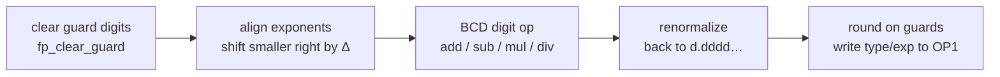

# 06 — Floating-Point Engine

> **Deep dive:** [Calculation Engine](sub-calculation.md) — ×, ÷, ^, roots, the transcendentals (sin/cos/ln/eˣ), and number formatting.

All TI-BASIC arithmetic runs through a BCD floating-point engine centered on the **OP registers** in RAM. The engine lives mostly on flash page 0 (it's hot), with the RST-30 shortcut for the most common op.

## Number format — `TIFloat` (9 bytes on disk) [confirmed]

```
+0  type      0x00 = real (positive), 0x80 = negative real;
              0x0C/0x8C = complex (paired with the imaginary part)
+1  exp       base-100? no — base-10 exponent, biased by 0x80 (0x80 = 10^0)
+2..+8  mantissa   7 bytes = 14 packed BCD digits, normalized d.dddddddddddddd
```
The stored value is

$$v = \pm\\,(d_0.d_1d_2\cdots d_{13})\times 10^{\\,e-\mathtt{0x80}}$$

where $e$ is the biased exponent byte and $d_0\ldots d_{13}$ are the 14 BCD mantissa digits. A local ROM-byte scan found 126 candidate BCD constants ROM-wide ($\pi/180 = 1.745\ldots\mathrm{e}{-2}$, $180/\pi = 5.729\ldots\mathrm{e}{1}$, 65536, plus the FP transcendental coefficient tables on page 0x02). The current MCP interface does not expose raw byte search, so this count should be treated as a scan artifact; the table addresses below are confirmed by Ghidra disassembly and raw ROM bytes.

## OP registers — 11 bytes each [confirmed]

`OP1`–`OP6` at `0x8478`, spaced **11** bytes (`OP2`=0x8483 …). The extra 2 bytes past the 9-byte number are **extended guard digits** used during math: `OP1EXT`/`OP2EXT` = bytes +9/+10 (seen in `_FPAdd` as `DAT_ram_8481`/`8482`). `OP1` is the primary accumulator; most routines take their argument in `OP1` (and `OP2` for binary ops) and return in `OP1`.

## Core operations [confirmed from disassembly]

Every binary operation has the shape **`OP1 ∘ OP2 → OP1`** and walks the same five stages. Because the format is **sign-magnitude BCD**, the sign is settled separately — negating a value is a single `XOR 0x80` on its type byte — so the digit work always runs on a non-negative 14-digit mantissa:



The page-0 entry points — the hottest get a one-byte `RST` shortcut, which is why FP code is dense with `RST 30h`/`08h`/`20h`:

| Routine | Addr | Shortcut | Effect |
|---------|------|----------|--------|
| `_FPAdd` | `00:229E` | **RST 30h** | `OP1 ← OP1 + OP2` |
| `_OP1ToOP2` | `00:1A2F` | **RST 08h** | copy `OP1 → OP2` (11 bytes, `FUN_ram_1a8e`) |
| `_Mov9ToOP1` | `00:1B01` | **RST 20h** | load 9 bytes at `HL → OP1` (a constant/var) |
| `_CkOP1FP0` / `_CkOP2FP0` | page 0 | — | test `OP1`/`OP2 == 0` (sets `Z`) |
| `_CkOP1Real` | page 0 | — | type-check `OP1` is real |

### Alignment, then the worked example — `_FPAdd`

To combine $x=(-1)^{s_x} m_x\times 10^{e_x}$ and $y=(-1)^{s_y} m_y\times 10^{e_y}$, the engine first **aligns** to the larger exponent. With $e_x \ge e_y$ it shifts $m_y$ right by

$$\Delta = e_x - e_y \quad(\text{digit shifts})$$

one nibble per `fp_shift_right_digit` call; if $\Delta > 15$ the smaller operand falls entirely past the 14 mantissa digits plus the 2 guard digits and is dropped. It then **adds the aligned mantissas when the signs match** ($s_x = s_y$) and **subtracts when they differ** ($s_x \ne s_y$), fixing the result's sign afterward — the essence of sign-magnitude arithmetic:

```pseudocode
\begin{algorithm}
\caption{\texttt{\_FPAdd}: $OP1 \gets OP1 + OP2$ (sign-magnitude BCD)}
\begin{algorithmic}
\IF{$OP2 = 0$}
    \RETURN $OP1$
\ENDIF
\IF{$OP1 = 0$}
    \STATE $OP1 \gets OP2$ \COMMENT{incl. extended bytes}
    \RETURN $OP1$
\ENDIF
\STATE $\Delta \gets \mathrm{exp}(OP1) - \mathrm{exp}(OP2)$ \COMMENT{\texttt{fp\_exp\_diff}}
\STATE shift the smaller mantissa right by $|\Delta|$ digits to align \COMMENT{\texttt{fp\_shift\_right\_digit}}
\IF{$|\Delta| > 15$}
    \RETURN larger operand \COMMENT{other is negligible}
\ENDIF
\IF{$\mathrm{sign}(OP1) = \mathrm{sign}(OP2)$}
    \STATE $\mathrm{mantissa} \gets$ BCD-add
\ELSE
    \STATE $\mathrm{mantissa} \gets$ BCD-subtract; fix result sign \COMMENT{\texttt{fp\_sub\_mantissa}}
\ENDIF
\STATE round via the guard digits, renormalize, store exp/type in $OP1$
\RETURN $OP1$
\end{algorithmic}
\end{algorithm}
```

This is the canonical sign-magnitude BCD add. The full helper cluster is documented below.

### The FP helper cluster [confirmed]

These five page-0 primitives are shared by add/sub/mult/div and the transcendentals. All were decompiled and disassembled in this ROM; the names below were applied to the Ghidra DB. They operate on the OP-register guard region (`OP1EXT`/`OP2EXT` at `0x8481`/`0x848C`) and the 7-byte mantissas of `OP1` (`0x8478`) / `OP2` (`0x8483`).

| Helper | Addr | Role [confirmed] |
|--------|------|------|
| `fp_shift_right_digit` | `ram:1bea` | Mantissa **shift-right by one BCD digit** (one nibble). Cascades nibbles down 8 bytes (`b[i] = b[i]>>4 \| b[i-1]<<4`) and returns the digit shifted out. Called per step to align the smaller operand. |
| `fp_exp_diff` | `ram:1fbf` | **Exponent difference** `OP1.exp − OP2.exp` (signed). Drives how many `fp_shift_right_digit` steps are needed for alignment. |
| `fp_add_mantissa` | `ram:1cb9` | **BCD add** of the two mantissa+guard runs. Sets `HL=0x848C` (OP2 guard), `DE=0x8481` (OP1 guard) and runs the shared BCD add/`DAA`-style adjust loop (`bcd_add_pair`). Used for same-sign add. |
| `fp_sub_mantissa` | `ram:1d37` | **BCD subtract** (`OP1 − OP2`) of mantissa+guard with borrow, via the `BCDadjust`/`BCDadjustCarry` chain across all 7 mantissa bytes plus the guard byte. Used for opposite-sign add. (`ram:1d2f`, `fp_sub_mantissa_fwd`, is the same subtract entered with the operand pointers swapped.) |
| `fp_clear_guard` | `ram:2627` | Zero the extended guard bytes (`OP1EXT`/`OP2EXT`). |

`ram:1d2f` and `ram:1d37` are two entry points into the same BCD-subtract body — `1d2f` loads `HL=0x8481, DE=0x848C` (subtract OP2 from OP1) and `1d37` loads `HL=0x848C` (the reverse direction) before joining the common loop — so the caller picks the subtraction direction by choosing the entry. This is what lets `_FPAdd` produce a non-negative magnitude and then fix the sign.

Multiply/divide/transcendentals (on page 0x02) reuse the same align/normalize primitives.

## Floating-point stack (FPS) [standard]
`FPS` (`0x9824`) is a software stack for temporaries; `_PushRealO1` (= **RST 18h**, `00:155C`), `_PushReal`, `_PopRealOx`, `_AllocFPS`/`_DeallocFPS` manage it. Used to spill OP registers during nested expression evaluation.

## Multiply / divide / transcendentals [confirmed — located]

The rest of the FP op set lives alongside add on page 0, with the transcendentals banked to page 0x02:

| Routine | Addr | Role |
|---------|------|------|
| `_FPSub` | `00:2297` | OP1 = OP1 − OP2 |
| `_FPMult` | `00:238B` | OP1 = OP1 × OP2 |
| `_FPRecip` | `00:253D` | OP1 = 1 / OP1 |
| `_FPDiv` | `00:2541` | OP1 = OP1 / OP2 |
| `_LnX` | `02:6EFD` | natural log |
| `_EToX` | `02:705C` | eˣ |
| `_SinCosRad` | `02:733E` | sin/cos (radians) |

See [Calculation Engine](sub-calculation.md) for the ×/÷/^/root algorithms and number formatting.

## Transcendental method [confirmed]

The ln/e^x/sin-cos evaluators are local page-0x02 code plus page-0x02 coefficient tables. The apparent `LD A,n; CALL 0x2362` "page switch" sites are **not** banked series tails: Ghidra disassembly shows `ram:2362: CALL 0x3DD1`, and `ram:3DD1` is a bcall-table entry whose inline descriptor is `1E 7D 02` (`page_02:7D1E`). The real banked-call helper is `ram:2B09`; here it only calls the page-0x02 coefficient fetcher. Therefore the preceding `LD A,n` is a **coefficient-table index**, not a target flash page. Raw ROM bytes at the supposed same-address page-0x03 targets are `0xFF`, and Ghidra has no page-0x03/page-0x06 functions there.

### `_LnX` — natural log (`02:6EFD`) [confirmed]

`_LnX` first calls `_CkOP1Pos` (`0x1e5d`) and raises a domain error on `x <= 0`. The core (`02:6F1B`) performs an **argument/range reduction** that splits `x` into mantissa * 10^exp, then computes a log via the `(x-1)/(x+1)` substitution: at `02:6F45`-`02:6F50` it forms numerator/denominator with `_FPAdd` (RST 30h) / `_FPSub` and divides with `_FPDiv` (`0x2541`). A digit-driven Horner/atanh loop (`02:6F8C`-`02:6FEC`) steps through the shared 16-slot table at `02:7181` via `02:7301`/`02:7302`; the first phase stops when the old selector has bit 3 set (`02:6FAB`-`02:6FAF`), and the digit loop stops when the selector reaches bit 4 (`02:6FD2`-`02:6FD5`). The `02:6F70: LD A,3; CALL 0x2362` site fetches constant-table index 3, and `02:704A: LD A,6; CALL 0x2362` fetches index 6 (`ln(10)`), both from `02:7D42`.

### `_EToX` — eˣ (`02:705C`) [confirmed]

`_EToX` is local code, not a page-0x03 thunk. It clears guard digits, then `02:705F: LD A,3; CALL 0x2362` loads constant-table index 3 (`log10(e)`) and falls through at `02:7064` into the same local body used by `_TenX` (`02:7066`). The body splits the decimal exponent/integer digit shift (`02:7069`-`02:70B6`), handles sign/reciprocal cases (`02:70B9`-`02:70D9`), then evaluates the fractional part with the shared 16-row table at `02:7181`. The exact loop bound is `02:7109: LD A,(0x848E); CP 0x0F; JR Z,0x7140`, so the table-driven exp evaluator has 16 selector slots (`0..15`).

### `_SinCosRad` — sin/cos in radians (`02:733E`) [confirmed]

This one keeps its **range reduction on page 0x02** and is the most fully recovered:

1. **Mode/select flags.** `0x8499` holds a sin/cos + quadrant selector (`0x81`/`0x04`/`0x80` bits, partly from `(IY+0)` bit 2). `fp_clear_guard` and `_ZeroOP3` initialize the work area.
2. **Exponent gate.** `LD A,(0x8479); SUB 0x80; CP 0x0C; JP NC` — arguments with decimal exponent ≥ 12 are rejected to the slow/error path (`_JError 0x84` for out-of-range), because reduction can no longer be done accurately.
3. **Reduce mod π/2.** It multiplies by a stored reciprocal constant and takes the fractional part to find the quadrant. The reduction constants are the page-0x02 BCD block:
   - `0x7d81` — reduction reciprocal (2/π-class constant), loaded into the OP3 work reg via `LD HL,0x7d81; CALL 0x1ae2` (`0x1ae2` copies a constant to `0x8490`).
   - `0x7d8e`, `0x7d95`, `0x7d96` — companion constants used in the quadrant-fixup / remainder comparisons (`CALL 0x1d7b` magnitude compare at `02:73B1`/`02:7447`).
   The quadrant (0–3) is accumulated in `B`/`bStack_1` (bits 0/3/6) and decides sin-vs-cos and the result sign (the `XOR 0x1 / OR 0x8 / XOR 0x8` flag juggling at `02:7424`–`02:7464`).
4. **Polynomial evaluation.** After reduction (`02:7475` onward, falling through `02:7488 LD A,B`) the reduced argument in `[0, pi/4)` is fed to a Horner-style BCD polynomial. The coefficient loaders are local: `02:74AB: CALL 0x731D` loads from the signed table at `02:7201`, and `02:74EA: CALL 0x7312` loads from the signed table at `02:7281`. The selector is bounded by `BIT 3,B` / `BIT 3,C` in the tail (`02:74DD`-`02:74E0`, `02:75C6`-`02:75C8`), so the forward sin/cos polynomial uses eight selector rows (`0..7`), each with two 8-byte sign/phase variants.

### Coefficient tables [confirmed]

`02:7D1E` zeroes the OP2 type byte, indexes `02:7D42 + 9*A`, then copies the selected constant image into OP2. The only `LD A,n; CALL 0x2362` uses in this cluster are `A=3` (`log10(e)`) and `A=6` (`ln(10)`); the later trig reduction constants are loaded directly from the same nearby block.

```
02:7D42 constants, 9-byte stride:
  [00] 81 57 29 57 79 51 30 82 32
  [01] 80 15 70 79 63 26 79 48 97
  [02] 7F 78 53 98 16 33 97 44 83
  [03] 7F 43 42 94 48 19 03 25 18  ; log10(e) fetch site
  [04] 80 31 41 59 26 53 58 98 00
  [05] 7E 17 45 32 92 51 99 43 30
  [06] 80 23 02 58 50 92 99 40 46  ; ln(10) fetch site
  [07] 62 83 18 53 07 17 96 31 41  ; direct trig-reduction region starts here
  [08] 59 26 53 58 98 78 53 98 16
```

`02:7181` is the shared ln/e^x digit table loaded by `02:7301`/`02:7302`/`02:7305`. It has 16 8-byte rows:

```
[00] 30 10 29 99 56 63 98 12  [01] 04 13 92 68 51 58 22 50
[02] 00 43 21 37 37 82 64 26  [03] 00 04 34 07 74 79 31 86
[04] 00 00 43 42 72 76 86 27  [05] 00 00 04 34 29 23 10 45
[06] 00 00 00 43 42 94 26 48  [07] 00 00 00 04 34 29 44 60
[08] 00 00 00 00 43 42 94 48  [09] 00 00 00 00 04 34 29 45
[10] 00 00 00 00 00 43 42 94  [11] 00 00 00 00 00 04 34 29
[12] 00 00 00 00 00 00 43 43  [13] 00 00 00 00 00 00 04 34
[14] 00 00 00 00 00 00 00 43  [15] 00 00 00 00 00 00 00 04
```

`02:7201` and `02:7281` are the forward sin/cos signed polynomial tables. Each row is 16 bytes: the first 8-byte variant is selected when `0x84A4 bit 7` is clear, and the second 8-byte variant is selected when it is set.

```
02:7201:
[00] 09 96 68 65 24 91 16 20 | 10 03 35 34 77 31 07 56
[01] 09 99 96 66 68 66 65 24 | 10 00 03 33 35 33 34 76
[02] 09 99 99 96 66 66 68 67 | 10 00 00 03 33 33 35 33
[03] 09 99 99 99 96 66 66 67 | 10 00 00 00 03 33 33 33
[04] 09 99 99 99 99 96 66 67 | 10 00 00 00 00 03 33 33
[05] 09 99 99 99 99 99 96 67 | 10 00 00 00 00 00 03 33
[06] 09 99 99 99 99 99 99 97 | 10 00 00 00 00 00 00 03
[07] 10 00 00 00 00 00 00 00 | 10 00 00 00 00 00 00 00

02:7281:
[00] 95 09 85 29 44 83 72 02 | 10 52 06 69 51 89 55 92
[01] 99 94 95 10 19 99 69 80 | 10 00 50 52 03 08 13 30
[02] 99 99 94 94 95 10 20 35 | 10 00 00 50 50 52 03 05
[03] 99 99 99 94 94 94 95 10 | 10 00 00 00 50 50 50 52
[04] 99 99 99 99 94 94 94 95 | 10 00 00 00 00 50 50 51
[05] 99 99 99 99 99 94 94 95 | 10 00 00 00 00 00 50 51
[06] 99 99 99 99 99 99 94 95 | 10 00 00 00 00 00 00 51
[07] 99 99 99 99 99 99 99 95 | 10 00 00 00 00 00 00 01
```

No CORDIC iteration was observed in the forward ln/e^x/sin-cos paths. Forward trig is Horner/polynomial; inverse trig still uses the separate arctangent CORDIC engine documented in [Calculation Engine](sub-calculation.md).
