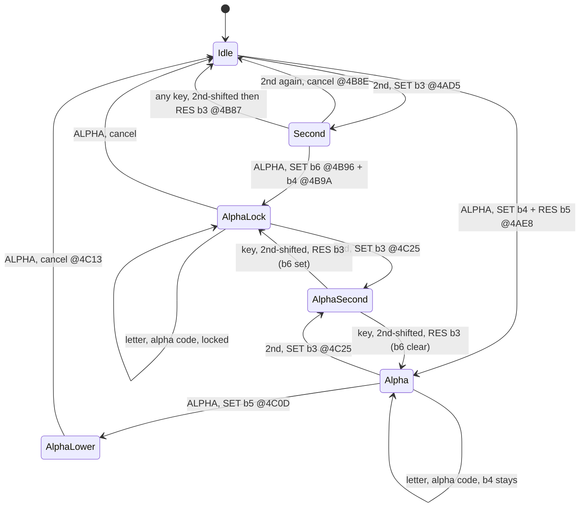

# 09 — Keyboard & link port

> **Deep dive:** [Link / Data Transfer](sub-link-transfer.md) — the silent-link packet protocol and variable send/receive.

## Keyboard

The keypad is a matrix read through **port 1** (`port_keypad`): write a group-select mask, read back the active columns. The **interrupt** triggers periodic scans; the result is debounced into `kbdScanCode` (`0x843F`).

- `_GetCSC` (`00:04B2`) — "Get Cursor/Scan Code": with interrupts masked, returns `kbdScanCode` and clears it (one key per call, no repeat). Raw scan codes (`skXxx`). **[confirmed]**
- `_GetKey` (`06:491E`) — the cooked key API: blocks, handles **2nd/ALPHA** modifier state, key repeat, and APD; returns a `TIKeyCode` (`kXxx`, 642 values). Also runs the cursor blink. Drives menus/homescreen. **[confirmed entry; body large]**
- `_KeyToString` (`01:6D10`) — map a key code to its display token/string (for text entry).

Scan codes (`skEnter`, hardware matrix position) differ from key codes (`kEnter`=5, post-modifier). `_GetCSC` returns the former; `_GetKey` the latter.

### Matrix scan — port 1 group masks [confirmed from disassembly]

The low-level read primitive is `kbd_reset_port` (`ram:0480`): it writes a **group-select mask** to **port 1** (active-low — `0` bits select rows to drive), waits 4 `NOP`s for the lines to settle, reads the column bits back, then writes `0xFF` to release. (On 84+ hardware, `IN A,(0x02) bit7` + `IN A,(0x20)` gate the read against link/clock activity first.)

```z80
0480: IN A,(0x2) ; AND 0x80          ; 84+ present? (else fall straight through)
0488: OUT (0x1),A                     ; A = group-select mask (active-low)
048a: NOP×4                           ; let the matrix settle
048e: IN A,(0x1) ; LD B,A             ; read columns (active-low: 0 = key down)
0491: LD A,0xFF ; OUT (0x1),A         ; release all groups
0495: LD A,B ; RET                    ; return raw column byte
```

The scanner `kbd_scan_autorepeat` (`ram:0406`) walks the matrix one group at a time. It seeds the mask in `C = 0xFE` (only bit0 low → group 0) and rotates it left (`RLC C` @ `044C`) after each column read, so successive iterations drive groups 0..7:

| port-1 mask (`C`) | group / key row driven |
|-------------------|------------------------|
| `0xFE` (bit0 low) | group 0 — **GRAPH / arrow keys** (and the special `0xF5/0xF3/0xFA/0xFC` direction codes) |
| `0xFD` (bit1 low) | group 1 |
| `0xFB` (bit2 low) | group 2 |
| `0xF7` (bit3 low) | group 3 |
| `0xEF` (bit4 low) | group 4 |
| `0xDF` (bit5 low) | group 5 |
| `0xBF` (bit6 low) | group 6 |
| `0x7F` (bit7 low) | group 7 |
| `0x00` (all low) | "any key down?" probe used by `0x0406`'s initial `SUB A` call; selects all groups |
| `0xFF` (all high) | release all groups after a read (`kbd_reset_port` writes this at `0491`) |

**Forming a raw scan code.** For each driven group the routine reads the column byte, then finds the single low (pressed) column bit by an 8-iteration `RLA`/`DJNZ` loop (`0435`–`043C`) that counts the **cleared** (pressed, active-low) column bits into `E` (`RLA` → `JR C` skips `INC E` on a `1` bit, so only `0` bits are counted) and records the bit index in `L`. If exactly one key is down it builds the scan code as **`group × 8 + column_index`**, where `group` is the 0-based group from the table above. The code forms it at `0453: DEC A; RLA;RLA;RLA; ADD A,L`: the iteration counter in `A` is 1-based, so `DEC A` converts it to the 0-based `group`, the three `RLA`s multiply by 8, and `ADD A,L` adds the column index in `L`; it then returns the byte. multiple simultaneous keys set carry (`SCF` @ `0459`) so the press is rejected (debounce / ghost-key reject). The single resulting byte is the raw scan code that lands in `kbdScanCode` (`0x843F`), which `_GetCSC` (`00:04B2`) then reads-and-clears under `DI`. The scan-enable gate `BIT 0,(IY+0x2C)` @ `0415` lets the ISR/`_GetKey` path special-case the arrow group.

### 2nd / ALPHA modifier state machine [confirmed]

While cooking raw scan codes into the `kXxx` key constants, `_GetKey` (`06:491E`) runs a small modifier state machine in **`shiftFlags`** (`IY+0x12` = `0x8A02`, the `[2nd]`/`[ALPHA]` flag byte):

| Bit | Name | Meaning |
|-----|------|---------|
| 3 | `shift2nd` | `[2nd]` is pending — the next key is 2nd-shifted |
| 4 | `shiftAlpha` | alpha mode active — the next key is a letter |
| 5 | `shiftLwrAlph` | 1 = lowercase, 0 = uppercase |
| 6 | `shiftALock` | alpha **lock** — alpha survives across keys |
| 7 | `shiftKeepAlph` | the alpha shift cannot be cancelled |

The low three bits of the same `IY+0x12` byte are `indicFlags` (bit 0 `indicRun`, the run/busy indicator set by `_RunIndicOn`; see [04](04-interrupts.md)); `shiftFlags` occupies bits 3–7.

`_GetKey` first dispatches on the pending modifier (`06:4AC3` `BIT 3` → the 2nd handler at `06:4B87`; `06:4ACA` `BIT 4` → the alpha handler at `06:4BFD`), then on the key. The transitions, with the `SET`/`RES` sites:

- **`[2nd]` (`0x36`) from idle** → `SET shift2nd` (`06:4AD5`); loop without returning a key, lighting the 2nd cursor (`IY+0x1F` bit 6).
- **`[2nd]` again while pending** → cancel (`06:4B8E` `CP 0x36`, clear the cursor, loop).
- **any other key while 2nd-pending** → the 2nd handler clears the flag first (`06:4B87` `RES 3`) then returns the **2nd-shifted** code, so `[2nd]` is **one-shot**.
- **`[ALPHA]` (`0x30`) from idle** → `SET shiftAlpha`, `RES shiftLwrAlph` (uppercase) (`06:4AE8`/`4AEC`); loop, lighting the alpha cursor (`IY+0x1F` bit 7).
- **`[2nd]` then `[ALPHA]`** (alpha pressed while 2nd is pending) → the 2nd handler reaches `06:4B92` `CP 0x30` and sets `SET shiftALock` + `SET shiftAlpha` (`06:4B96`/`4B9A`): **alpha LOCK**.
- **`[ALPHA]` while already in alpha** (`06:4BFD`) → in a lowercase-capable context (`IY+0x24` bit 3) and still uppercase, `SET shiftLwrAlph` (`06:4C0D`) cycles **upper → lower**; otherwise it cancels alpha. Repeated `[ALPHA]` walks uppercase → lowercase → off.
- **`[2nd]` while in alpha** (`06:4C1D`) → `SET shift2nd` (`06:4C25`): a 2nd press stacks on top of alpha (alpha is retained).

`shift2nd` clears the moment a 2nd-combo key is consumed (`06:4B87`), and the IM1 timer ISR also clears it at `ram:01E0` (`RES 3,(IY+0x12)`), so a pending `[2nd]` does not linger. `_GetKey` sets `shiftAlpha` and (on 2nd+ALPHA) `shiftALock` but reads neither to clear alpha — within `_GetKey`, alpha stays set until a later `[ALPHA]` press cancels it. The one-shot-versus-lock choice is left to the consuming editor, which reads `shiftALock` (bit 6) to decide whether to drop `shiftAlpha` after a single character.



### Key → token translation [confirmed]

`_KeyToString` (`01:6D10`) turns a key code into a TI-BASIC **token** for the editor. It's not a single flat table — it combines:
- **range arithmetic**: contiguous key ranges map to token ranges by a fixed offset (e.g. key `0x1F`→`'P'`-based, `0x59`→`'a'` for lowercase) — letters/digits;
- **per-mode lookup tables** on another page, reached via `cross_page_jump` (the 2nd/ALPHA-mode and function-key token tables);
- special key codes `0xFB/0xFC/0xFE/0xFF` are **not** tokens — they're the **menu / context-switch return codes** the main event loop branches on (see [11](11-boot-contexts-errors.md)), so `_KeyToString` routes them out via `cross_page_jump` rather than translating.

So the input path is: keypad → ISR → `kbdScanCode` → `_GetKey` (cooked `kXxx` + modifiers) → `_KeyToString` → token → parser ([07](07-tokenizer-basic.md)).

## Link port

The 2.5 mm I/O link has two open-collector lines (tip/ring), driven via **port 0** (`port_link`), with an 84+ **hardware link-assist / USB** path via ports `0x08`-`0x0D`. See [USB ASIC and link assist](sub-usb-asic.md) for the ASIC-facing port map and the `_LinkXferOP` USB-selection gate.

`_SendAByte` (`3C:420D`) shows both paths **[confirmed]**:
- **Hardware-assisted** (when enabled): poll status `port 0x09` bit 5 (ready), then write the byte to `port 0x0D`; helper routines on page 3C manage the assist FIFO/timing.
- **Legacy bit-bang**: to send a bit, pull one line low (`port_link = 1` for a 0-bit, `2` for a 1-bit), wait for the receiver to mirror it, release, wait for idle — with a timeout that raises `E_LnkErr` (`0x9F`, "ERR:LINK") via `_JErrorNo` on failure (matching [sub-link-transfer.md](sub-link-transfer.md)). Repeats per bit of the byte.

`_RecAByteIO` (`3C:443F`) is the matching receive. Higher-level link commands (`_CmdLoad`, variable transfer, plus screen-shot / remote-control commands) sit on top. (Note: the names `_CircCmd`/`_VertCmd` are documented in [sub-graphing.md](sub-graphing.md) as the graphing draw commands `Circle(` (`33:74CE`) and `Vertical` (`04:7955`); the link-layer command routines referenced here are distinct and were not separately traced — treat this as a [hypothesis].)

### Variable-transfer command/packet framing

A TI link packet is a **4-byte header** (`machine-ID, command-ID, length-lo, length-hi`) optionally followed by `data[len]` and a **16-bit LE checksum**; commands include `0x06` VAR, `0x09` CTS, `0x15` DATA, `0x56` ACK, `0x5A` NAK, `0x92` EOT. The full framing, the silent-link send/receive engine (`_LinkXferOP`, `_SendVarCmd`), checksum/ACK handling, and the 16-byte Flash-batched receive path are all reverse-engineered in **[sub-link-transfer.md](sub-link-transfer.md)** — see §3 (framing) and §5 (variable send). **[confirmed]**
