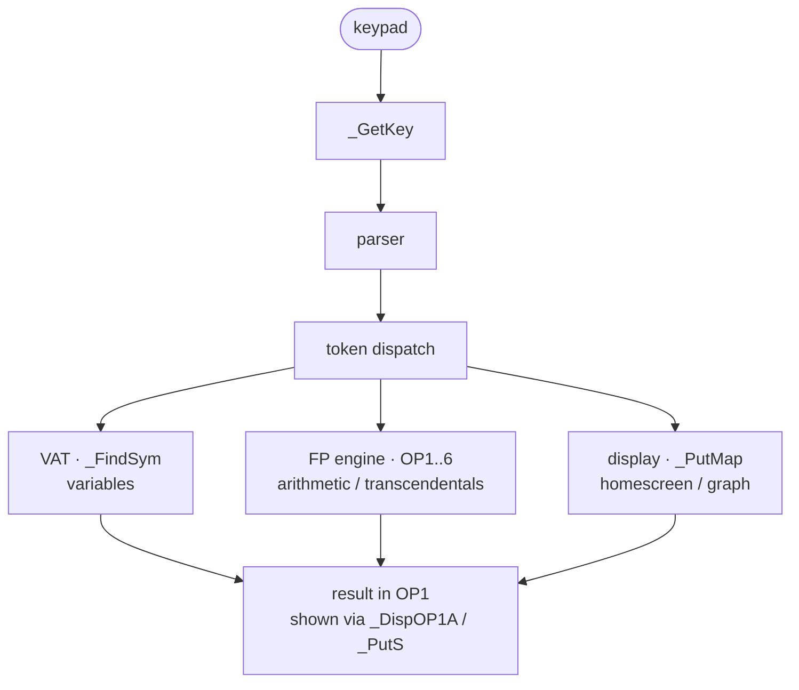

# 10 — Subsystem Map (bcall API surface)

A way to see the *whole* OS at once: categorize the ~600 named bcall entry points (the OS's public API) by subsystem. This is the surface area user code and the OS itself program against.

| Subsystem | ~bcalls | Representative entry points |
|-----------|--------:|------------------------------|
| **Floating-point / numeric** | ~230 (+~120 more in "misc") | `_FPAdd`,`_Times2`,`_DivHLBy10`,`_Intgr`,`_Trunc`,`_DToR`,`_RToD`,`_Min`,`_Max`,`_Sqrt`,`_LdHLind` |
| **Display / LCD** | ~41 | `_PutMap`,`_PutC`,`_PutS`,`_DispHL`,`_NewLine`,`_ClrLCDFull`,`_VPutS`,`_GrBufCpy` |
| **Variables / VAT** | ~37 | `_FindSym`,`_ChkFindSym`,`_CreateReal/List/Mat/Str/AppVar`,`_DelVar`,`_InsertMem`,`_Arc/Unarc` |
| **String / convert** | ~18 | `_ExpToHex`,`_OP1ExpToDec`,`_CreateStrng`,`_StrCopy`,`_Get_Tok_Strng` |
| **Parser / TI-BASIC** | ~18 | `_IsA2ByteTok`,`_GetTokLen`,`_BinOPExec`,`_RunIndic*` |
| **Link / I-O** | ~15 | `_SendByte`,`_Recv*`,`_CmdLoad`, link-command handlers (`_CircCmd`,`_VertCmd`) |
| **System / power** | ~15 | `_AppInit`,`_PutAway`,`_RandInit`,`_ApdSetup`,`_Chk_Batt_Low`,`_SetExSpeed`,`_JForceCmd` |
| **List / Matrix** | ~13 | `_CreateRList/CList/RMat`,`_ErrDimMismatch`,dim/element ops |
| **Keyboard** | ~5 | `_GetCSC`,`_GetKey`,`_KeyToString` |
| **Menu / UI** | ~5 | `_DispMenuTitle`,`_CursorOn/Off`,`_RunIndicOn/Off` |

(Counts approximate — keyword buckets overlap; ~170 "misc" are mostly more math/int helpers.)

## Reading the map

The dominant fact: **this is a calculator** — roughly **two-thirds of the API is numeric**. Everything else is comparatively small glue. The architecture flows:

Cross-cutting services used by all of the above: **bcall/paging** ([03](03-bcall-mechanism.md)), **interrupts/APD** ([04](04-interrupts.md)), **error handling** (`_JError` + `TIError` codes), and the **system flags** (`SystemFlags` @ `flags`).

## How the pieces connect (the through-line)
1. **Interrupt** keeps time, scans the keypad into `kbdScanCode`, runs APD.
2. **`_GetKey`** turns scan codes into key codes (`TIKeyCode`), driving menus and the homescreen.
3. The **parser** reads tokenized input/programs, dispatching each `TIToken`.
4. Number tokens → **FP engine** (OP1–OP6, BCD); name tokens → **VAT** (`_FindSym`).
5. Results land in **OP1** and are rendered by the **display** subsystem.
6. **bcall + paging** is the substrate that lets steps 3–5 live on different flash pages; **errors** unwind via `_JError`/`onSP`.

See per-subsystem docs `01`–`09` for detail.
