# 12 — Memory management (RAM heap & Flash archive)

How the OS allocates the ~24 KiB of user RAM between variables, temporaries, the FP stack, and the program being run — and how it offloads variables to Flash ("archive").

## The RAM heap [confirmed pointers, standard layout]

The dynamic region runs from `userMem` (`0x9D95`) up to `symTable` (`0xFE66`). Two structures grow toward each other with **free RAM** in the middle:

```mermaid
flowchart TB
    A["0xFE66 · symTable — top of user RAM"]
    B["VAT — variable names + metadata<br/>type, data ptr/page, name · grows DOWNWARD ↓"]
    C["( free RAM )"]
    D["user data — variable contents<br/>grows UPWARD ↑"]
    E["0x9D95 · userMem — bottom of user RAM"]
    A --- B --- C --- D --- E
    style C fill:#1b1b1b,stroke-dasharray:5 5
```

VAT entry layout: type, data ptr/page, name — see [05-variables-vat.md](05-variables-vat.md).

Boundary/work pointers (clustered at `0x9820–0x983A`) [confirmed addrs]:

| Ptr | Addr | Role |
|-----|------|------|
| `tempMem` | `0x9820` | base of the temporary area |
| `fpBase` | `0x9822` | floating-point stack base |
| `FPS` | `0x9824` | FP stack pointer (grows; `_PushReal`/`_PopReal`) |
| `OPBase` | `0x9826` | base of OP/symbol scratch |
| `OPS` | `0x9828` | OP/symbol scratch stack pointer (top) |
| `pTemp` | `0x982E` | temp-variable pointer |
| `progPtr` | `0x9830` | currently-executing program pointer |
| `pagedBuf` | `0x983A` | paged scratch buffer |

`_MemChk` reports free RAM as `(OPS) − (FPS)` (the pointers at `0x9828`/`0x9824`) `+ 1`, i.e. the span between the floating-point stack and the operand/symbol stack in the middle of the region (the conceptual picture above: user data grows up, the VAT grows down, free RAM in the middle). When a variable grows/shrinks, everything above it shifts.

## Core allocation primitives [confirmed]

- `_InsertMem` (`ram:0F81`) — open a gap of `HL` bytes at address `DE` by shifting all memory above it up. It calls `insertmem_setup` (`ram:0F8B`), which does the `LDDR` block move (at `ram:0FA1`), then `delmem_fixup_tail` (`ram:1398`) to fix up pointers. `_InsertMem` does **not** check free space itself — callers must ensure room first via `_EnoughMem` (the wrapper `_ErrNotEnoughMem` at `ram:1735` calls `_EnoughMem` then jumps to `_ErrMemory` at `ram:2721` on shortfall).
- `_DelMem` (`ram:1368`) — the inverse: close a gap, shifting memory down.
- `_EnoughMem` (`ram:0FA6`) — ensure N free bytes; if short, it walks the temp/scratch entries (9-byte stride from `pTemp` down to `OPBase`) and `_DelVar`s reclaimable temporaries to make room. **[confirmed]**
- `_MemChk` (`ram:0E20`) — compute current free RAM.

Variable-creation bcalls — `_CreateReal`, `_CreateStrng`, `_CreateAppVar`, `_CreateRList`, etc. (see [05](05-variables-vat.md)) — share a create body (`_CreateReal` at `ram:10B8` jumps into `ram:1011`) that carves space via an internal gap routine at `ram:0F0C` — which does its own block move and updates the temp/FP-stack pointers, *not* the public `_InsertMem` — then registers the variable in the VAT.

## Flash archive [confirmed location]

To save scarce RAM, variables can be **archived** to Flash. The archive entry point is on **flash page 0x07**, while the low-level flash read/write/erase workers are on **page 0x3D**:
- `_Arc_Unarc` (`07:6248`) — move OP1's variable between RAM and the Flash archive (toggles the archive bit, then relocates the data and rewrites the VAT entry's page to the Flash page).
- `_FlashToRam` (id `5017` → body `3D:6745`) — copy archived data back into RAM.
Archived vars are *appended* to Flash, which can't be overwritten in place, so deleting one only marks it dead. When the archive Flash fills, a **garbage collector** rewrites the live vars to fresh sectors and erases the old ones — the **Garbage Collecting** screen (stored as two ROM strings, `"Garbage"`/`"Collecting..."`, with three ASCII dots). That GC path is distinct from `_CleanAll`, but the older `flash_gc_relocate@3C:7BD0` / `gc_show_screen@3C:7E0D` labels are not present as functions in the current live Ghidra/MCP DB.

`_CleanAll` is RAM cleanup (not Flash GC) [confirmed from disassembly]: `_CleanAll` (`07:52CF`) compacts the **floating-point stack** down to `tempMem` (`fpBase`/`FPS`) and the **OP/scratch stack** down to `pTemp` (it sets `OPBase = pTemp`, `LDDR`s the live span down, and sets `OPS` to its new top), reclaiming temporary RAM after a command/expression finishes. It does **not** touch Flash.

Flash is **erased** a sector at a time but **programmed byte-by-byte** (the page-3D writer at `3D:64AA` calls the single-byte bcall `_WriteAByte`, id `8021`), via low-level routines through the **flash-control port `0x14`** (see [Variables, Archive & Unarchive](sub-vat-archive.md)) **[partly confirmed]**:
- Live MCP-confirmed page-3D anchors include `_FlashToRam` (`3D:6745`), `flash_program_buf` (`3D:678C`), `flash_erase_wait` (`3D:5ED3`), `flash_cmd_base` (`3D:738B`), and the status-bit helpers `flash_op_fd` (`3D:7C8F`), `flash_op_fb` (`3D:7C93`), `flash_op_fe` (`3D:7C97`).
- Further page-3D flash routines at `3D:61AF`, `3D:6B9B`, `3D:64AA`, `3D:62C2`, and `3D:6413` are not yet named in the current DB and await a symbol pass.
- Archive workers: `_Arc_Unarc` (`07:6248`) → `arc_ram_to_flash` (`07:61F4`) / `arc_flash_to_ram` (`07:6107`).

## Resolved
The `_FindSym` VAT walk is byte-verified in [Variables, Archive & Unarchive](sub-vat-archive.md). Flash write/erase and GC still need a current MCP-backed symbol pass to replace the older address/name map.
