# 12 — Memory Management (RAM heap & Flash archive)

How the OS allocates the ~24 KiB of user RAM between variables, temporaries, the FP stack, and the program being run — and how it offloads variables to Flash ("archive").

## The RAM heap [confirmed pointers, standard layout]

The dynamic region runs from `userMem` (`0x9D95`) up to `symTable` (`0xFE66`). Two structures grow toward each other with **free RAM** in the middle:

```mermaid
flowchart TB
    A["0xFE66 · symTable — top of user RAM"]
    B["VAT — variable names + metadata<br/>type, data ptr/page, name · grows DOWNWARD ↓"]
    C["( free RAM )"]
    D["user data — variable contents<br/>grows UPWARD ↑"]
    E["0x9D95 · userMem — bottom of user RAM"]
    A --- B --- C --- D --- E
    style C fill:#1b1b1b,stroke-dasharray:5 5
```

VAT entry layout: type, data ptr/page, name — see [05-variables-vat.md](05-variables-vat.md).

Boundary/work pointers (clustered at `0x9820–0x983A`) [confirmed addrs]:

| Ptr | Addr | Role |
|-----|------|------|
| `tempMem` | 9820 | base of the temporary area |
| `fpBase` | 9822 | floating-point stack base |
| `FPS` | 9824 | FP stack pointer (grows; `_PushReal`/`_PopReal`) |
| `OPBase` | 9826 | base of OP/symbol scratch |
| `pTemp` | 982E | temp-variable pointer |
| `progPtr` | 9830 | currently-executing program pointer |
| `pagedBuf` | 983A | paged scratch buffer |

So free RAM = (gap between the upward data heap and the downward VAT). When a variable grows/shrinks, everything above it shifts.

## Core allocation primitives [confirmed]

- `_InsertMem` (`00:0F81`) — open a gap of N bytes at HL by shifting all memory above it up (helper `FUN_ram_1398` is the block move); fails with `E_Memory` if it would collide with the VAT.
- `_DelMem` (`00:1368`) — the inverse: close a gap, shifting memory down.
- `_EnoughMem` (`00:0FA6`) — ensure N free bytes; if short, it walks the temp/scratch entries (9-byte stride from `pTemp` down to `OPBase`) and `_DelVar`s reclaimable temporaries to make room. **[confirmed]**
- `_MemChk` (`00:0E20`) — compute current free RAM.

Every `_CreateXxx` (see [05](05-variables-vat.md)) ultimately calls `_InsertMem` to carve space, then registers the variable in the VAT.

## Flash archive [confirmed location]

To save scarce RAM, variables can be **archived** to Flash. The archive code lives on **flash page 0x07**:
- `_Arc_Unarc` (`07:6248`) — move OP1's variable between RAM and the Flash archive (toggles the archive bit, then relocates the data and rewrites the VAT entry's page to the Flash page).
- `_FlashToRam` (id `5017` → body `3D:6745`) — copy archived data back into RAM.
Archived vars are *appended* to Flash (which can't be overwritten in place), so deleting one just marks it dead; when the archive Flash fills, a **garbage collector** rewrites the live vars to fresh sectors and erases the old ones — the **"Garbage Collecting…"** screen. (That GC routine is distinct from `_CleanAll` — it is `flash_gc_relocate`@`3C:7BD0`, located below.)

**Correction — `_CleanAll` is *RAM* cleanup, not Flash GC** [confirmed from disassembly]: `_CleanAll` (`07:52CF`) compacts the **floating-point stack** (`fpBase`/`FPS` → `tempMem`) and resets the `OPBase`/`OPS`/`pTemp` scratch pointers, reclaiming temporary RAM after a command/expression finishes. It does **not** touch Flash.

Flash is written/erased a sector at a time via low-level routines through the **flash-control port `0x14`**. These are now located [confirmed via subagent RE — see [sub-vat-archive.md](sub-vat-archive.md)]:
- `flash_program_core` (`page_3D:61AF`) — the byte-program primitive (port `0x14` command sequence); `flash_write_byte` (`3D:6B9B`), `flash_write_record` (`3D:64AA`), `flash_alloc_sector` (`3D:62C2`), `flash_free_scan` (`3D:6413`).
- `flash_cmd_dispatch` (`3C:7121`) and the **garbage collector** `flash_gc_relocate` (`3C:7BD0`) + `gc_show_screen` (`3C:7E0D`) — the real "Garbage Collecting…" path (distinct from `_CleanAll`).
- Archive workers: `_Arc_Unarc` (`07:6248`) → `arc_ram_to_flash` (`07:61F4`) / `arc_flash_to_ram` (`07:6107`).

## Resolved
The `_FindSym` VAT walk, the Flash write/erase primitives (port `0x14`), and the archive sector layout are byte-verified in [Variables, Archive & Unarchive](sub-vat-archive.md).
