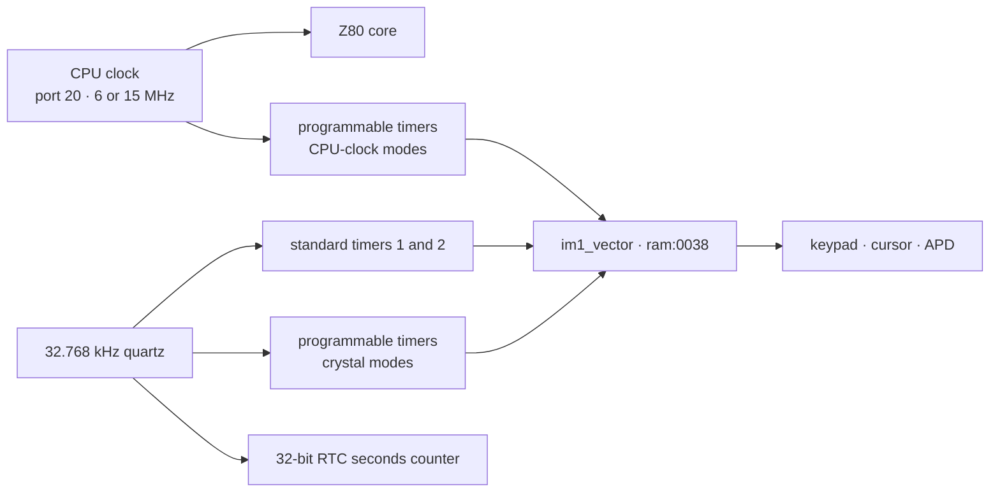
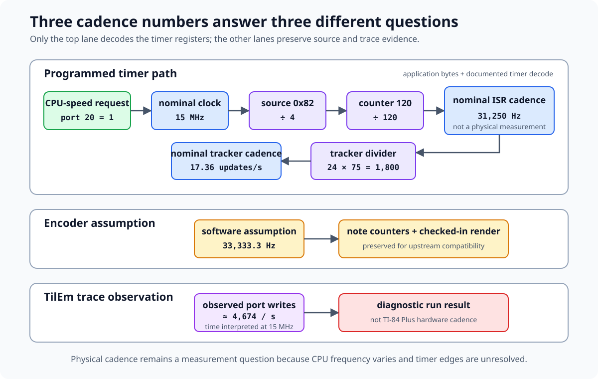
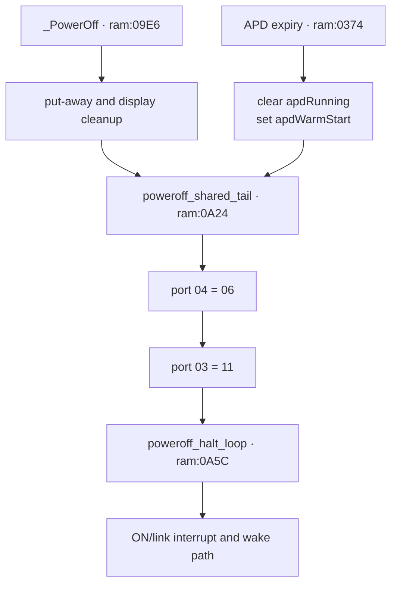

# Clock, timers, and power

*TI-84 Plus OS 2.55MP — Clock domains, timer APIs, APD, RTC, and low-power control.*

The TI-84 Plus derives OS timekeeping from a 32.768 kHz crystal while the Z80 runs at a separately selectable CPU rate. This page separates the standard interrupt timers, three programmable timers, and real-time clock; reconstructs the undocumented timer bcall state machine; and follows both explicit and automatic shutdown into the ASIC's low-power state.

## Evidence layers

The subsystem crosses ROM code, public hardware observations, and emulator policy. A claim marked [confirmed] comes from the local OS 2.55MP image or a complete instruction trace. A claim marked [standard] comes from the named hardware or emulator source and agrees with the ROM where their scopes overlap. Emulator behavior is identified by implementation and revision rather than treated as physical-ASIC proof.

| Layer | Main evidence | What it establishes |
|-------|---------------|---------------------|
| TI-OS kernel | `ram:0038`–`ram:04B2` and `ram:09B5`–`ram:0A5F` | interrupt routing, standard-timer consumers, APD counters, and shutdown [confirmed] |
| TI-OS banked code | `33:5E1E`–`33:5F69` and `37:5359`–`37:5950` | programmable-timer API and RTC conversion/access [confirmed] |
| TI-OS dynamic execution | `tools/macros/power-cycle.macro` and resolved TilEm traces | standard-timer cadence and the explicit shutdown/HALT path [confirmed] |
| Public hardware notes | WikiTI ports `0x03`, `0x04`, `0x20`, `0x2D`, `0x2F`, `0x30`–`0x38`, and `0x40`–`0x48` | register semantics and oscillator-derived rates [standard] |
| Emulator models | TilEm commit `f56ad63`, Wabbitemu commit `48c2dc0`, MAME 0.287, and jsTIfied `20170706a` | independent timer decode, scheduling, status, interrupt, and RTC policies [standard] |
| Native emulator execution | guarded TilEm, Wabbitemu, and MAME timer/interrupt runs | source decode, scheduling, counter, acknowledgement, callback, HALT-line, reset, and RTC transitions [standard] |

## Hardware blocks and clock domains

The TA2/TA3 ASIC integrates the Z80-compatible core, RAM interface, USB, and supporting logic. WikiTI's hardware history places the variable CPU clock, 32.768 kHz quartz oscillator, programmable timers, and MD5 assist in the advanced gate array introduced with the TI-83 Plus Silver Edition. The TI-84 Plus adds a real-time clock driven from that low-frequency domain. Datamath identifies the local calculator family as using TI REF 83PLUSB/TA2 or 84PLUSB/TA3 ASIC revisions. [standard]

The [MD5 accelerator and boot API](md5-hardware.md) page checks the MD5 port block and boot routines independently.



The three timing blocks have different contracts: [standard]

| Block | Registers | Resolution or source | OS use |
|-------|-----------|----------------------|--------|
| Standard hardware timers | `port 0x04` rate; `port 0x03` mask/ack | four crystal-derived rates | kernel tick, keypad scan, cursor, APD |
| Programmable timers 1–3 | triplets `0x30`–`0x38` | crystal or divided CPU clock | timer bcall API and USB timeouts |
| Real-time clock | `0x40`–`0x48` | one-second, 32-bit counter | date/time bcalls and TI-BASIC clock commands |

### CPU speed

Port `0x20` selects CPU speed. Value `0` selects the nominal 6 MHz mode; values `1`–`3` select the nominal 15 MHz mode on the TI-84 Plus. TilEm models these as exactly 6 MHz and 15 MHz. Physical measurements published by WikiTI vary by ASIC revision and unit, so cycle-count conversion should name whether it uses nominal or measured frequency. [standard]

Pinned Wabbitemu starts at exactly 6 MHz. Its default TI-84 Plus context maps
port-`0x20` values 0–3 to 6, 15, 15, and 15 MHz. An internal
`timer_version = 1` setting maps them to 6, 15, 20, and 25 MHz. A guarded
initialized-core run verifies both matrices. The internal setting is
front-end configuration, not a calculator port or evidence of additional
physical TI-84 Plus clock modes. [standard]

The low two speed bits also select one of ports `0x29`–`0x2C` for LCD and
memory wait states, plus a field in port `0x2F`. See
[Bus timing and wait states](bus-timing.md). [standard]

The standard timers and RTC remain tied to the quartz domain when the CPU speed changes. Programmable timers can instead select the CPU clock, so their wall time then changes with port `0x20`. [standard]

## Interrupt-source routing

TI-OS uses IM1. `im1_vector` at `ram:0038` jumps to
`int_entry_save_alt_regs` at `ram:006D`. That entry swaps in the alternate
general registers, polls the active-low USB summary at port `0x55`, and falls
through to the separate legacy status port `0x04` when the USB block reports no
source. [confirmed]

Reading port `0x04` reports legacy pending state, live ON level, and programmable-timer completion: [standard]

| Bit | Source | OS branch from the dispatcher |
|----:|--------|-------------------------------|
| 0 | ON key | `on_irq` at `ram:015B` |
| 1 | standard hardware timer 1 | `standard_timer1_irq` at `ram:0167` |
| 2 | standard hardware timer 2 | `ram:01F1` |
| 3 | ON key level, active low | tested as state rather than a source |
| 4 | link activity | `legacy_link_irq` at `ram:01E0` |
| 5 | programmable timer 1 complete | status check at `ram:013A`; handler `33:5EB4` |
| 6 | programmable timer 2 complete | `ram:0154` path |
| 7 | programmable timer 3 complete | status check at `ram:012C`; handler `35:4792` |

The two status handlers visible in this dispatch are unrelated to the kernel's APD tick: [confirmed]

- `33:5EB4` continues the OS timer API's programmable-timer-1 countdown.
- `35:4792` stops programmable timer 3 and services a USB timeout/event structure through ports `0x8E`, `0x91`, and `0x92`.
- `standard_timer1_irq` handles the tick that reaches keypad scanning, cursor blink, the run indicator, and APD.

The status-test order is programmable timer 3, timer 1, timer 2, standard timer 2, link, ON, then standard timer 1. Programmable completion bits remain visible when their timer mode does not request an interrupt, so timers 1 and 3 receive an additional mode-bit check before their handlers run. [confirmed] for the test order and mode checks; [standard] for completion visibility.

The kernel normally writes `0x0B` to port `0x03`: ON and standard timer 1 can interrupt, timer 2 and link cannot, and bit 3 keeps the ASIC powered during `HALT`. The acknowledge sequence at `ram:00DC` writes `0x08`, which clears all legacy source bits under the clear-on-zero contract, and then writes a handler-supplied byte. See [Interrupts (IM1)](interrupts.md#clear-on-zero-acknowledgement) for the complete register tables and simultaneous-source behavior. [confirmed] for the writes; [standard] for latch semantics.

## Standard hardware timers

Writing port `0x04` selects both memory-map mode and the standard-timer rate. Bits 1–2 form an index $i$ from 0 through 3. On the TI-84 Plus, standard timer 1 has period [standard]

$$
T_1 = \frac{64 + 80i}{32768}\text{ seconds}
$$

and timer 2 runs at twice its frequency. [standard]

| Port-`0x04` bits 2–1 | $i$ | Timer-1 period | Timer-1 frequency | Timer-2 frequency |
|----------------------:|----:|---------------:|------------------:|------------------:|
| `00` | 0 | 1.953125 ms | 512 Hz | 1,024 Hz |
| `01` | 1 | 4.39453125 ms | 227.555556 Hz | 455.111111 Hz |
| `10` | 2 | 6.8359375 ms | 146.285714 Hz | 292.571429 Hz |
| `11` | 3 | 9.27734375 ms | 107.789474 Hz | 215.578947 Hz |

TI-OS writes `0x06` to port `0x04` at several setup sites, including `ram:09B7`. Bit 0 is clear, selecting memory-map mode 0, and bits 1–2 select the slowest standard-timer rate. The kernel tick period is therefore exactly $304/32768$ seconds under the documented quartz model. [confirmed] for the write; [standard] for the physical rate.

Wabbitemu instead stores a rounded rate table of 512, 227, 158, and 108 Hz.
Its index-2 value differs from the documented 146.285714 Hz, while the other
three approximate their corresponding public rates. A guarded initialized-core
run records the resulting internal periods and checks the expiry boundary
through the registered port handler. These values describe Wabbitemu only.
[standard]

### Dynamic cadence

A resolved TilEm trace enters `standard_timer1_irq` at steady intervals of
139,153–139,157 emulated CPU cycles after the OS reaches its 15 MHz state.
TilEm schedules this timer at 9,277 µs, so its nominal interval is 139,155
cycles. Instruction-boundary acceptance accounts for the small spread.
[confirmed]

The hardware formula gives 9,277.34375 µs, or 139,160.15625 nominal 15 MHz cycles. TilEm rounds each rate to whole microseconds with the table `{1953, 4395, 6836, 9277}`. The five-cycle difference at the slow setting is emulator quantization, not evidence that the quartz formula differs. [standard]

A guarded direct-core probe confirms the table through port-`0x04` writes.
Each selection applies the same period to timer 1 and both timer-2 callbacks.
The initial intervals remain 1,600, 1,300, and 1,000 µs across those writes,
matching TilEm's `tilem_z80_set_timer_period` contract. Direct callbacks with
port-`0x03` mask `0x06` produce status `0x0A` for timer 1 and `0x0C` for
either timer-2 callback. These are scheduler observations from pinned TilEm,
not physical phase or frequency measurements. [standard]

## Kernel-tick consumers

`standard_timer1_irq` at `ram:0167` performs the periodic kernel work below before returning through the common interrupt acknowledge path. [confirmed]

| Consumer | Gate or counter | Code |
|----------|-----------------|------|
| Run indicator | `indicCounter` at `0x8476` | `run_indicator_tick` at `ram:027B` |
| Keypad scan and repeat | state at `0x8440`–`0x8443` | `kbd_tick_debounce_repeat` at `ram:03B4` → `kbd_scan_matrix` at `ram:0406` |
| Cursor blink | `curTime` at `0x844A` | `cursor_blink_tick` at `06:7C45` through the `ram:3FCF` bjump |
| General countdown | word at `0x9C24` | `apd_timer_tick` at `ram:0355` |
| APD | `apdSubTimer`/`apdTimer` at `0x8448`/`0x8449` | `ram:036C`–`ram:0382` |

The keypad mechanism is covered in [Keypad and ON-key hardware](keypad-on-hardware.md). These consumers advance from standard timer 1, not from a programmable timer. [confirmed]

### Auto Power Down timing

`_ApdSetup = 4C93` has body `ram:03AE`. It reloads only the high byte: [confirmed]

```z80
ram:03AE  ld hl,0x8449       ; apdTimer
ram:03B1  ld (hl),0x74
ram:03B3  ret
```

When `apdAble` and `apdRunning` are set, `ram:036C` decrements the low byte first and the high byte only when the low byte reaches zero: [confirmed]

```z80
ram:036C  ld hl,0x8448       ; apdSubTimer
ram:036F  dec (hl)
ram:0370  ret nz
ram:0371  inc hl             ; apdTimer
ram:0372  dec (hl)
ram:0373  ret nz
```

Because `_ApdSetup` leaves `apdSubTimer` unchanged, the timeout depends on its phase. If $d$ is the number of ticks until the low byte next reaches zero, with $1 \le d \le 256$, expiry takes [confirmed]

$$
N = d + 115 \times 256
$$

standard timer-1 ticks. The exact range is: [confirmed] for the counter arithmetic; [standard] for conversion through the documented timer rate.

| Quantity | Minimum | Maximum |
|----------|--------:|--------:|
| Timer ticks | 29,441 | 29,696 |
| Seconds | 273.134277 | 275.500000 |
| Minutes | 4.552238 | 4.591667 |

The low byte's free-running phase explains the roughly 2.37-second spread after a reload. The high-byte constant alone therefore does not encode one exact number of minutes. [confirmed]

On expiry, `ram:0374` performs display/context cleanup, clears `apdRunning`,
sets `apdWarmStart`, and jumps to `poweroff_shared_tail` at `ram:0A24`.
[confirmed]

### Cursor blink cadence

`_CursorOn` and `_CursorOff` reload `curTime` with `0x32` (50).
`cursor_blink_tick` decrements it, toggles `curOn` on expiry, and reloads the
same value. [confirmed]

At the OS standard-timer setting, one visible-state interval is [confirmed] for the tick count; [standard] for wall time.

$$
50 \times \frac{304}{32768} = 0.4638671875\text{ seconds}
$$

A complete on/off cycle is 0.927734375 seconds. The run indicator has a separate counter at `0x8476`; it does not share the APD word. [confirmed]

## Programmable timers

The ASIC provides three independent eight-bit countdown timers. Each uses a source/frequency register, a mode/status register, and a counter register. [standard]

| Timer | Source/frequency | Mode/status | Counter | Port-`0x04` completion bit |
|------:|-----------------:|------------:|--------:|---------------------------:|
| 1 | `0x30` | `0x31` | `0x32` | 5 |
| 2 | `0x33` | `0x34` | `0x35` | 6 |
| 3 | `0x36` | `0x37` | `0x38` | 7 |

### Source and divisor

The high two frequency-register bits choose the clock family. The low bits encode a family-specific divisor. [standard]

| Value or family | Result |
|-----------------|--------|
| `0x00` | timer off |
| `0x40` | 32.768 kHz divided by 3 |
| `0x41` | 32.768 kHz divided by 33 |
| `0x42` | 32.768 kHz divided by 328 |
| `0x43` | 32.768 kHz divided by 3,277 |
| `0x44`, `0x45`, `0x46`, `0x47` | 32.768 kHz divided by 1, 16, 256, or 4,096 |
| `0x80`, `0x81`, `0x82`, `0x84`, `0x88`, `0x90`, `0xA0` | CPU clock divided by 1, 2, 4, 8, 16, 32, or 64 |
| `0xC0` family | CPU clock plus the speed-dependent port-`0x2F` prescaler |

Writing a nonzero counter starts it when a valid source is selected. Counter value zero represents 256 ticks, loops continuously, and does not assert the port-`0x04` completion bit. [standard]

TilEm stops a timer on every source-register write and retains the current counter as the next loop value. This is emulator behavior in `tilem_user_timer_set_frequency`, not evidence that every physical ASIC revision retains the counter the same way. [standard]

TilEm rounds crystal-family durations to whole microseconds before scheduling.
For a freshly loaded counter value of one, sources `0x40`–`0x47` schedule at
`92`, `1007`, `10010`, `100006`, `31`, `488`, `7813`, and `125000` µs. The
counter read rescales that rounded remainder against a separately rounded
256-count duration. It consequently reads `1 0 1 0 1 0 1 1` immediately
after those eight starts. This readback pattern is a TilEm quantization effect,
not a physical counter claim. [standard]

### Mode, completion, and acknowledgement

| Mode/status bit | Meaning |
|----------------:|---------|
| 0 | loop after expiry |
| 1 | request a maskable interrupt on expiry |
| 2 | overflow: another expiry occurred before acknowledgement |

Writing the mode/status port acknowledges completion, clears overflow, and removes the timer's interrupt request. The corresponding port-`0x04` bit records completion even when mode bit 1 did not request an interrupt. If looping remains active without a new mode write before the next expiry, the counter continues through a 256-count overflow cycle and sets status bit 2. [standard]

TilEm also assigns a recurring 256-tick period when software restarts an
already completed non-looping timer without first writing its mode port. The
completion bit remains set, the low mode read remains zero, and the next
callback sets overflow bit 2. OS 2.55MP acknowledges before programming its
next chunk, so the timer bcall path does not use this emulator edge. [standard]

### Bad Apple audio timer case

The third-party Bad Apple application sets CPU-speed port `0x20` to `1`, then
writes source `0x82`, mode `0x03`, and counter `120` to timer 1. Its interrupt
routine acknowledges by rewriting `0x03` to port `0x31` and emits one link-port
sample through port `0x00`. [confirmed] for the application source.

Source `0x82` is the CPU-clock family divided by 4. At the nominal 15 MHz
TI-84 Plus speed, the programmed cadence is therefore

$$
\frac{15{,}000{,}000}{4 \times 120} = 31{,}250\ \mathrm{Hz}.
$$

The program's companion encoder instead uses 33,333.3 Hz when converting notes
to oscillator counts. That value is an encoder tuning assumption rather than a
decode of the active timer registers. The program advances its tracker after
$24 \times 75 = 1{,}800$ interrupts, so both note pitch and tracker tempo depend
on the actual timer cadence. Published CPU-frequency variation and unresolved
physical timer edges prevent the nominal calculation from serving as a
physical measurement. [confirmed] for the constants and control flow;
[standard] for the timer decode; [hypothesis] for physical cadence.



**Cadence evidence.** The top lane combines [confirmed] application bytes with
the [standard] timer decode. The encoder and trace lanes preserve their source
contexts; neither measures physical calculator cadence.

Port `0x2D` controls low-power behavior. Bit 0 keeps the quartz oscillator active on the TI-83 Plus Silver Edition; the TI-84 Plus RTC already requires it. Bit 1 allows the programmable timers to continue counting in low power. TI writes `0x03`. Public hardware tests report that these timers still do not reliably interrupt a halted CPU, so software should keep a standard timer enabled when it must escape `HALT`. [standard]

### Prepared physical discriminator

The guarded [`HWTMR` probe](hardware-probes.md#programmable-timer-physical-probe)
tests the four source-model disagreements without using `HALT`. It compares
source `0x41` with the common source-`0x45` reference, measures source `0xE0`
across CPU-speed requests 0–3, starts a source-`0x45` timer with counter zero,
and captures status after two unacknowledged expiries. It snapshots ports
`0x02`, `0x03`, `0x04`, `0x15`, `0x20`, `0x2D`, `0x2F`, and `0x30`–`0x35`.
It runs only when timers 1 and 2 are idle and their completion bits are clear.
Every polling loop is bounded. [confirmed] for the assembled source and host
decoder.

The exact image completes through its cleanup boundary in pinned Wabbitemu and
selects that implementation's divisor-32, omitted-port-`0x2F`, counter-zero
completion, and first-expiry-bit-2 behaviors. This validates the program and
decoder against a known model. No exported `HWTMR001` result from a calculator
has been recorded, so the physical divisor, prescaler, zero-counter, and
expiry-status edges remain [hypothesis].

## Undocumented timer bcall API

OS 2.55MP exposes one software timer backed by programmable timer 1. `ti83plus.inc` supplies official equate names, but the WikiTI pages for IDs `526C`–`5281` are absent. The ABI below is reconstructed from `33:5E1E`–`33:5F69`. [confirmed]

### Entry points

| Bcall | ID | Body | Inputs | Success result |
|-------|---:|------|--------|----------------|
| `_InitTimer` | `526C` | `33:5E38` | none | `B=0x70`, `A=0`, carry clear |
| `_KillTimer` | `526F` | `33:5E4E` | `A=0x70` | stops hardware and clears all state |
| `_StartTimer` | `5272` | `33:5E58` | `A=0x70`, `DE` duration, `C!=0` for auto-restart | starts or completes immediately |
| `_RestartTimer` | `5275` | `33:5E9D` | same duration/restart inputs | replaces the current run |
| `_StopTimer` | `5278` | `33:5F42` | `A=0x70` | stops hardware and clears running |
| `_WaitTimer` | `527B` | `33:5EA4` | `A=0x70`, `DE` duration | starts once and busy-waits for finished |
| `_CheckTimer` | `527E` | `33:5F16` | `A=0x70` | `HL` expiry count; Z if unfinished, NZ if finished |
| `_CheckTimerRestart` | `5281` | `33:5F27` | `A=0x70` | returns old `HL`, then clears finished/count |

All operations except `_InitTimer` validate `A=0x70`. An invalid or uninitialized ID returns carry set and `A=2`. `_InitTimer` returns carry set and `A=1` when already initialized. `_StartTimer` returns carry set and `A=3` when already running. [confirmed]

### State block

| Address | Size | Meaning |
|---------|-----:|---------|
| `0x9C0C` | 1 | bit 0 initialized; bit 1 running; bit 2 finished; bit 3 auto-restart |
| `0x9C0D` | 2 | original `DE` duration for auto-restart |
| `0x9C0F` | 2 | remaining chunk word |
| `0x9C11` | 2 | saturating completed-expiry count |

`_InitTimer` sets only initialized. `_KillTimer` writes zero to ports `0x30` and `0x31`, then clears all seven bytes. `_StopTimer` stops those ports and clears running, but preserves finished, auto-restart, the saved duration, and the expiry count. [confirmed]

### Duration encoding and hardware programming

`_StartTimer` selects source `0x41`, whose tick period is $33/32768$ seconds, and mode `0x02`, which requests an interrupt without hardware looping. `timer_program_next_chunk` at `33:5EF3` programs counter `0x32` in chunks. [confirmed]

For input `DE`, the high byte `D` counts full chunks of 255 and the low byte `E` supplies the final chunk. The total hardware count is therefore [confirmed]

$$
N = 255D + E
$$

rather than the ordinary 16-bit value $256D+E$. Each tick is about 1.007080078125 ms under the crystal specification. For example, `DE=0x0100` programs 255 ticks, and `DE=0x0101` programs 256. This radix-255 chunking is an ABI quirk, not a generic property of the hardware counter. [confirmed]

After each hardware expiry, `timer_irq` acknowledges mode port `0x31`, programs the next chunk, and returns while chunks remain. At the logical expiry it increments the word at `0x9C11`, saturating at `0xFFFF`, clears running, and sets finished. With auto-restart selected, it restores the original duration, sets running again, and programs the first new chunk. [confirmed]

A zero duration has no hardware chunk. `_StartTimer` marks the timer finished immediately and increments the expiry count once. [confirmed]

### Check and wait quirks

`_CheckTimer` preserves the `BIT 2` result while loading `HL`: Z means unfinished and NZ means finished. It always returns `A=0` and carry clear on a valid timer. The count can exceed one when auto-restart runs faster than the caller checks it. [confirmed]

`_CheckTimerRestart` disables interrupts, captures the old count, clears finished and the count, then executes `EI` unconditionally. It does not preserve a caller's disabled-interrupt state. Its final success path also makes Z set, so use the returned count rather than `_CheckTimer`'s finished-flag convention. [confirmed]

`_WaitTimer` sets `C=0`, calls `_StartTimer`, and spins on state bit 2. It does not execute `HALT`. Because `timer_irq` advances multi-chunk and completed timers, ordinary waits require interrupts to remain enabled. [confirmed]

## Real-time clock

The RTC is a 32-bit count of seconds since midnight on 1 January 1997. The set and current registers are little-endian by port number. [standard]

| Ports | Access | Meaning |
|-------|--------|---------|
| `0x40` | read/write | bit 0 enable; rising edge on bit 1 commits a new count |
| `0x41`–`0x44` | read/write | staged set value, least-significant byte first |
| `0x45`–`0x48` | read | current seconds, least-significant byte first |

To set the clock, software writes all four staged bytes, writes `0x01` to port `0x40` so command bit 1 is low, then writes `0x03` to create its rising edge while leaving the clock enabled. [standard]

### Raw OS access

`rtc_read_seconds` at `37:58A1` reads current ports in the order `0x48`, `0x47`, `0x46`, `0x45` into `0x8499`–`0x849C`. The following conversion loop turns that 32-bit integer into the OS floating-point/date representation. [confirmed]

`rtc_write_seconds` at `37:593F` writes the four converted bytes in the reverse port order `0x44`, `0x43`, `0x42`, `0x41`, then emits the `0x01` → `0x03` control sequence. [confirmed]

The exact-ROM disassembly shows both block-I/O loops:

```z80
; 37:58A1 — bytes 21 99 84 06 04 0E 49 0D ED A2 20 FB
ld hl,0x8499
ld b,4
ld c,0x49
.read_byte:
dec c
ini
jr nz,.read_byte

; 37:593C — bytes 21 99 84 06 04 0E 45 0D ED A3 20 FB
ld hl,0x8499
ld b,4
ld c,0x45
.write_byte:
dec c
outi
jr nz,.write_byte
```

`INI` increments `HL` and decrements `B`, so the first loop pairs ascending RAM
addresses with descending current-time ports. `OUTI` applies the same register
updates to the staged set ports. [confirmed]

`tools/describe_rom_io_coverage.py` reproduces this result from the pinned ROM.
Its raw scan covers all 37 possible register and block-I/O opcode pairs in the
image, including pairs inside operands and data. It also verifies that no
16 KiB page ends with an `ED` prefix. Only `37:58A9` and `37:5944` survive as
aligned instructions with a statically resolved port. Regression tests pin
their ports to `0x48` and `0x44`. This is ROM evidence; the separate TilEm RTC
probes below test emulator behavior. [confirmed]

The hardware documentation does not describe a snapshot/latch operation for current-time reads. The OS reads high byte first, which reduces but does not eliminate the possibility of a rollover between the four port reads. No retry or two-pass coherence check appears at `37:58A1`. [confirmed] for the OS sequence; [hypothesis] for physical rollover behavior.

TilEm reads host `time_t` separately on every current-register access. A
probe-controlled rollover from `0x00FFFFFF` to `0x01000000` between the
port-`0x48` read and the remaining bytes assembles `0x00000000`. This proves
that pinned TilEm has no multi-byte RTC latch. It does not resolve whether the
physical ASIC snapshots the current count. [standard]

### Date and time bcalls

| Bcall | ID | Body | Role |
|-------|---:|------|------|
| `_chkTmr` | `5143` | `37:54C1` | clock-value conversion/check entry |
| `_getDate` | `514F` | `37:550B` | date into the floating-point stack |
| `_GetDateString` | `5152` | `37:55E8` | format the current date into `DE` buffer |
| `_getDtFmt` | `5155` | `37:5581` | return date-order setting 1, 2, or 3 |
| `_getDtStr` | `5158` | `37:55A9` | date-string wrapper using current format |
| `_getTime` | `515B` | `37:5551` | seconds, minutes, and 24-hour hour values |
| `_GetTimeString` | `515E` | `37:567E` | format current time into `DE` buffer |
| `_getTmFmt` | `5161` | `37:5593` | return 12- or 24-hour setting |
| `_getTmStr` | `5164` | `37:55CF` | time-string wrapper using current format |
| `_SetZeroOne` | `5167` | `37:5359` | helper for clock-setting parser state |
| `_setDate` | `516A` | `37:536E` | validate and set a date |
| `_IsOneTwoThree` | `516D` | `37:5438` | validate the three date formats |
| `_setTime` | `5170` | `37:540D` | validate and set a time |
| `_IsOP112or24` | `5173` | `37:5413` | validate 12/24-hour selection |
| `_chkTimer0` | `5176` | `37:557E` | jump directly to `rtc_read_seconds` |
| `_timeCnv` | `5179` | `37:56C4` | clock/date conversion entry |

WikiTI documents `_getDate` as returning day, month, and year through `OP1` and floating-point stack slots. `_getTime` returns seconds, minutes, and hours, with hours always in 24-hour form. `_GetTimeString` applies the user's 12/24-hour setting and writes a null-terminated string such as `1:41AM` or `15:56`. [standard]

## Power-off and wake flow

`_PowerOff = 5008` resolves to `ram:09E6`. It performs context and display
cleanup before joining `poweroff_shared_tail` at `ram:0A24`. APD performs its
own cleanup at `ram:0374` and joins the same tail. [confirmed]



The final writes are: [confirmed]

| Address | Operation | Effect |
|---------|-----------|--------|
| `ram:0A4B` | `OUT (0x04),0x06` | map mode 0 and slow standard-timer rate |
| `ram:0A4F` | `OUT (0x03),0x11` | ON and link interrupts enabled; both standard timers disabled; low-power-on-HALT selected |
| `ram:0A51` | clear `shift2nd` | remove the **[2nd]** modifier |
| `ram:0A55` | clear `onRunning` | mark the OS as powered down |
| `ram:0A5B` | `EI` | allow the selected wake interrupt |
| `poweroff_halt_loop` | `HALT`<br>`JR ram:0A5C` | remain in the ASIC low-power loop |

The low-power request is port-`0x03` bit 3 clear combined with Z80 `HALT`;
writing `0x11` by itself does not finish the transition. ON and link activity
remain enabled as wake sources. The wake interrupt follows `im1_vector` →
`int_entry_save_alt_regs` → `on_irq` → `on_key_debounce_power`. After
debouncing the active-low ON level, the power-on branch at `ram:09AC` restores
the CPU-speed setting and writes `0x06` to port `0x04` at `ram:09B7`. It does
not return to the suspended `_PowerOff` caller. [confirmed]

### Dynamic power-cycle trace

`tools/macros/power-cycle.macro` cold-boots the OS, presses **[2nd]**+**ON**,
waits in low power, then presses **ON**. The resolved trace enters `_PowerOff`
once, reaches `poweroff_shared_tail`, executes both port writes, and repeats
`HALT` in `poweroff_halt_loop` until the wake event. It then records the wake
route through `on_key_debounce_power`, `ram:09AC`, and `ram:09B5`. [confirmed]

```sh
TILEM=~/Git/tilem-headless/result/bin/tilem2

$TILEM --headless --rom tools/rom.bin --model ti84p --normal-speed --reset \
  --macro tools/macros/power-cycle.macro \
  --trace /tmp/tilem-power-cycle.trace --trace-range all \
  --trace-limit 500000000

nix develop -c python tools/tilem_trace_resolve.py \
  /tmp/tilem-power-cycle.trace --initial-mapping ti84p-reset \
  --names tools/names.txt --only-space ram \
  --only-addr 09e6-0a5d --print 180
```

## Emulator comparison

The comparison below reproduces pinned source behavior. Agreement between implementations is useful corroboration of a software contract, but it is not a substitute for a physical TA2 or TA3 measurement. [standard]

| Area | Documented contract | TilEm `f56ad63` | Wabbitemu `48c2dc0` | MAME 0.287 | jsTIfied `20170706a` |
|------|---------------------|-----------------|------------------------|------------|-----------------------|
| Crystal divisors for `0x40`–`0x43` | `3`, `33`, `328`, `3277` | `3`, `33`, `328`, `3277` | `3`, `32`, `327`, `3276` | `3`, `32`, `327`, `3276` | `3`, `33`, `328`, `3277` |
| CPU families | CPU clock divided by 1–64 | implemented | implemented | all nonzero values instead use 32.768 kHz and the low-three-bit crystal table | implemented with divisors 1–64 |
| Mode-3 source | additional port-`0x2F` divisor | ordinary CPU-family decode | ordinary CPU-family decode | same fixed-crystal decode; port `0x2F` is unmapped | ordinary CPU-family decode |
| Counter `0` | recurring 256-count timer without completion | implemented | reaches ordinary underflow after 256 decrements | never decremented by the callback | scheduled by the same countdown path as other reload values |
| Mode bit 1 | set requests interrupt | set requests interrupt | set requests interrupt | clear requests interrupt | set requests interrupt |
| Mode/status bit 2 | missed acknowledgement/overflow | set on a second unacknowledged expiry | set on the first underflow | never exposed; mode writes retain only bits 0–1 | completion/loop state is held in emulator timer fields |
| RTC | ports `0x40`–`0x48` | host wall time plus offset | emulated elapsed time plus base | unmapped | implemented |

### TilEm timer and RTC policy

TilEm reproduces the paths used by this OS, but several model choices matter for timing experiments. [standard]

Port-`0x03` bits 1 and 2 jointly control TilEm's programmable-timer
`NO_HALT_INT` flag. With both bits clear, a halted CPU receives no programmable
request even though port-`0x04` exposes completion. Either bit set removes the
gate for all three timers. A running CPU receives the request in either state.
The guarded interrupt probe exercises all three cases through the direct timer
callback. [standard]

- Standard-timer periods are rounded to whole microseconds: `{1953, 4395, 6836, 9277}`.
- Crystal-family programmable timers use the documented divisor table. CPU-family duration is measured in Z80 clocks and follows the speed selected at port `0x20`.
- The `0xC0` family uses the ordinary CPU-family decode, so port `0x2F` does not prescale it.
- Port `0x2D` stores its low two bits but does not pause the oscillator or programmable timers in low power.
- An internal `NO_HALT_INT` flag suppresses programmable-timer interrupts during `HALT` when neither standard timer is enabled at port `0x03`.
- The RTC uses host `time_t` plus an offset. Disabling it freezes the stored count rather than making current ports read zero.

A full TilEm reset disables all three programmable timers and clears their
frequency, reload, and status fields. It reschedules the standard timers but
retains the global Z80 clock and dynamically allocated scheduler timers. The
TI-84 Plus callback also leaves `CLOCK_MODE`, `CLOCK_INPUT`, and `CLOCK_DIFF`
unchanged. A guarded direct-core run verifies each boundary. These are emulator
lifecycle rules, not physical RTC or reset behavior. [standard]

TilEm tracks completion internally for port `0x04` while exposing loop, interrupt enable, and overflow through the low three mode/status bits. The first nonzero-counter expiry sets completion; a second expiry without a mode write sets visible overflow bit 2. [standard]

**Native TilEm confirmation.** The guarded direct-core matrix verifies all
eight rounded crystal durations and all seven CPU divisors. Sources `0x00`,
`0x01`, and `0x3F` leave the scheduler stopped while preserving a written
counter. Source `0xC0` schedules one CPU clock with port `0x2F` set to `0x00`,
`0x4A`, or `0xFF`. [standard]

Counter zero schedules a recurring 256-tick callback without completion.
One non-looping expiry produces internal status `0x100`, port-`0x04 = 0x28`,
and no request. A second unacknowledged expiry changes the visible mode/status
read to `0x04`. Interrupt mode produces internal request `0x08`; completing
timers 1–3 cumulatively produces port-`0x04` values `0x28`, `0x68`, and
`0xE8`, with internal request masks `0x08`, `0x18`, and `0x38`. A mode write
clears completion and the matching request. A source write after four of ten
CPU ticks — advanced directly in the probe's scheduler clock — retains counter
six and stops the timer. [standard]

The RTC case substitutes a deterministic `time_t` source inside the probe
process. Committing `0x12345678`, advancing ten seconds, disabling for ninety,
and re-enabling for five produces `0x12345678`, `0x12345682`, `0x12345682`,
and `0x12345687`. A disabled commit of `0xDEADBEEF` survives full TilEm reset
with control mode `0x02`. Two isolated executions produce identical canonical
native JSON with SHA-256
`0da06edc402dfb14945d28577f212face4c04c22b3b6ffc3e283a70e0ecb4aa5`.
The binary SHA-256 is
`fa665079fac1ace807930be8a3836385f6821ee9994c6454039b8ca85bb75d77`.
[standard]

### Wabbitemu timer and RTC policy

Wabbitemu stops a programmable timer and clears its pending interrupt generation on a source write. It decodes the crystal-family divisors as `3`, `32`, `327`, `3276`, `1`, `16`, `256`, and `4096`; the three near-decimal divisors therefore differ from both the published table and TilEm. Its `0x80` and `0xC0` families both use the divided-CPU decode and ignore port `0x2F`. [standard]

Wabbitemu's low-level `CPU_reset` and frontend `calc_reset` do not reset the
timer context, delay registers, standard interrupt controller, programmable
timers, or RTC. A guarded initialized-core run retains seeded T-states
`123456`, frequency 25 MHz, timer version 1, and byte-complete state for those
peripherals. Direct seeding verifies emulator field retention only. It does not
establish warm-reset, cold-reset, or power-loss behavior on an ASIC. [standard]
for source; [confirmed] for the pinned run.

Wabbitemu registers ports `0x29`–`0x2F` through one delay-latch handler. Port
`0x2D` consequently stores all eight bits and only recomputes the memory-wait
booleans from the active speed register and port `0x2E`. A native write to
`0x2D` leaves the programmable-timer state, clock frequency, LCD-active state,
`HALT`, interrupt line, and T-state count unchanged. This differs from the
public low-power contract and cannot establish physical port-`0x2D` behavior.
[standard]

The crystal handler computes elapsed 32.768 kHz ticks but uses a single `if`, so one invocation decrements each crystal timer at most once even if multiple source periods elapsed. The CPU path uses `while` and catches up all elapsed divisors. On the first expiry, Wabbitemu reloads the original counter, stops if loop bit 0 is clear, sets the underflow flag exposed as mode/status bit 2 and port-`0x04` completion, and retains interrupt generation when mode bit 1 is set. It does not assert that interrupt while the emulated CPU is in `HALT`. [standard]

Wabbitemu implements ports `0x40`–`0x48` from emulated elapsed seconds rather than host wall time. A bit-1 rising edge copies the staged value into the base. Bit-0 transitions start or stop elapsed-time accumulation, and disabled reads return the frozen base. Each staged-byte write also resets the stored elapsed-time reference; the OS set sequence commits immediately afterward, so this does not disturb the traced ROM path. [standard]

**Native Wabbitemu confirmation.** The guarded initialized-core probe loads counter 3 with crystal source `0x41`, advances the emulated crystal by 320 ticks, and reads the counter three times without advancing time again. The reads are `0x02`, `0x01`, and `0x03`: each device evaluation consumes one pending divisor, and the third reloads the original count. Mode/status reads `0x04`, and port `0x04` reads `0x28`. [standard]

The corresponding CPU-source case loads counter 3 with source `0x80` and advances four T-states. One counter read catches up three divisors, reloads `0x03`, and produces the same `0x04` mode/status and `0x28` port status. Loading counter zero and advancing 257 T-states reaches underflow after 256 decrements. It reads back zero with status `0x04` and port `0x04 = 0x28`. A mode write acknowledges that state, returning mode/status to `0x00` and port `0x04` to `0x08`. [standard]

With mode `0x02`, source `0x80`, and counter 1, expiry during `HALT` leaves the CPU interrupt line clear while mode/status reads `0x06`. Evaluating the timer after leaving `HALT` asserts the retained interrupt request. The RTC case commits `0x12345678`, advances emulated time by 10.75 seconds, and reads `0x12345682`. Disabling the RTC freezes that value through an advance to 100 seconds. These tests inject emulator clock values directly; they do not measure wall-clock accuracy, callback cadence under CPU execution, or physical low-power behavior. [standard]

**Assembled-probe confirmation.** The exact 835-byte `HWTMR` image also runs
after a retail OS 2.55MP boot. The guarded runner stops at `01:9EE4` before
`_CreateAppVar`, after 1,645,212 probe instructions and 12,937,610 modeled
T-states, with no execution-violation reset. Four samples infer source-`0x41`
divisor `3568/111`, about 32.144. Speed requests 0–3 read back as 0, 1, 1,
and 1, and the nonzero cases infer prescalers near one. Counter zero produces
mode/status `0x04` and port `0x04 = 0x68`; both expiry samples expose bit 2.
All saved timer, speed, port-`0x2F`, power-control, and interrupt-mask fields
compare equal after cleanup. [confirmed] for the pinned Wabbitemu run.

The shared injected-program adapter has SHA-256
`3acb6a18280f9c42d6fe324188eab73f87280ee70b973e1251fcfa50f54fb14e`.
The machine-code SHA-256 is
`6767caf1d714bc15e642de2f791151a060015fa0d9faebe1ebddd92d184df68a`.
This execution does not create the result AppVar or measure physical timing.

### MAME timer and RTC policy

MAME maps only timer ports `0x30`–`0x38` from this block. Ports `0x2D`–`0x2F` and RTC ports `0x40`–`0x48` are unmapped. For every nonzero source value, a counter write selects one of the eight Wabbitemu-style crystal divisors from the low three bits and schedules at `32768/divisor` Hz. CPU-source family bits do not select the CPU clock. [standard]

The initial callback is scheduled at zero delay, so a nonzero counter value $N$ reaches its first modeled expiry after $N-1$ periodic intervals; a value of one can expire immediately. Counter zero remains zero because the callback decrements only a nonzero count. At expiry, loop bit 0 reloads the counter once, but the callback then applies `loop &= 2` and discards that bit. Mode bit 1 has inverted polarity: an interrupt and port-`0x04` completion are produced only when it is clear. A mode write also clears all three programmable completion bits globally rather than only the selected timer. [standard]

The TI-84 Plus driver is marked `MACHINE_NOT_WORKING`. Its standard timers remain fixed at 256 Hz and 512 Hz, and port-`0x04` writes do not retime them. It can still run the repository ROM's page-0 ON-wake path, as shown in [Interrupts (IM1)](interrupts.md#emulator-comparison), but that execution does not validate the timer model. [standard]

**Native MAME confirmation.** The guarded CPU-I/O-space probe parks the Z80 in a `DI` loop on isolated RAM. Source bytes `0x01`, `0x41`, and `0x81` each reduce counter `0xFF` to `0xEA` over 20 ms of emulated time. The 21 decrements comprise one zero-delay callback and 20 periods at 1,024 Hz. This confirms that the documented off, crystal, and CPU families all use low-three-bit divisor `32`. [standard]

Counter zero remains zero with source `0x07` after 15 frames. The source readback remains `0x07`, and port `0x04` remains `0x08`. Source zero disables a running timer while preserving count `0x05`. A mode write retains only bits 0–1. Mode bit 1 set produces no completion; the same count with bit 1 clear sets timer-3 completion and changes port `0x04` from `0x08` to `0x88`. [standard]

Loop mode reloads count one, clears bit 0, and schedules another zero-delay callback. The second callback stops the timer, leaving count, source, and mode at zero with completion set. Simultaneous timer-1 and timer-2 completion produces port `0x04 = 0x68`; writing timer 1's mode clears both bits and returns `0x08`. Ports `0x2D`–`0x2F` and `0x40`–`0x48` return zero before and after patterned writes. Two isolated runs produce byte-identical reports with SHA-256 `5aab56b737495fef9c953522e1a3eee47d3e96637bc8266ce6258ff10d3e2c26`. [standard]

A separate guarded legacy-interrupt run enables standard timer 1, standard
timer 2, and both for one 20 ms frame. Port `0x04` reads `0x0A`, `0x0C`, and
`0x0E`. Timer 1 produces `0x0A` after both configuration writes `0x00` and
`0x06`, consistent with the source's fixed callbacks. A soft reset retains
both masks: clearing their pending fields after reset allows both to regenerate
status `0x0E` during the next frame. These are MAME scheduler and reset results,
not physical timer periods or retention. [standard]

## Reusable timer tools

`tools/timer_hardware.py` exposes exact rational source rates, first-expiry timing, callback outcomes, the ROM's radix-255 chunks, RTC implementation profiles, and the physical-probe discriminator. `tools/describe_timer_hardware.py` is a JSON-capable front end. The TilEm, Wabbitemu, and MAME report oracles validate native observations against reusable source models; `tools/jstified_hardware.py` supplies a separately hash-guarded source profile without claiming a native run. `tools/tilem_timer.py` adds the complete direct-core programmable-timer and deterministic RTC matrix. `tools/tilem_interrupt.py` adds direct standard-timer scheduling and programmable-timer HALT-gate observations. `tools/mame_interrupt.py` adds fixed standard-timer and reset-retention observations through the immutable MAME state in `tools/interrupt_controller.py`. Their guarded CLIs retain exact binary, ROM, adapter, output, and evidence-scope identities. CPU-speed and port-`0x2D` implementation edges use `tools/wabbitemu_speed_probe.py` and its guarded CLI. `tools/run_wabbitemu_timer_physical_probe.py` executes the assembled physical discriminator through the shared injected-program runner. These are emulator-comparison tools, not physical-hardware simulators.

```sh
nix develop -c python tools/describe_timer_hardware.py \
  source 0x41 0x80 0xC0 --mode3-prescaler 4

nix develop -c python tools/describe_timer_hardware.py \
  duration --source 0x41 --counter 0xFF

nix develop -c python tools/describe_timer_hardware.py \
  expiry --mode 0x02 --halted --no-standard-timer

nix develop -c python tools/describe_timer_hardware.py chunks 0x0100 0x0101
nix develop -c python tools/describe_timer_hardware.py --json rtc

timer_probe_parent=$(mktemp -d /tmp/ti84-timer-probe.XXXXXX)
nix develop -c python tools/run_wabbitemu_timer_edge_probe.py \
  --rom tools/rom.bin \
  --binary "$wabbit_tmp/wabbitemu-headless" \
  --output-dir "$timer_probe_parent/run" --json

physical_timer_parent=$(mktemp -d /tmp/ti84-physical-timer.XXXXXX)
nix develop -c python tools/run_wabbitemu_timer_physical_probe.py \
  --rom tools/rom.bin \
  --binary "$wabbit_tmp/wabbitemu-headless" \
  --expected-binary-sha256 \
    3acb6a18280f9c42d6fe324188eab73f87280ee70b973e1251fcfa50f54fb14e \
  --output-dir "$physical_timer_parent/run" --json

mame_timer_parent=$(mktemp -d /tmp/ti84-mame-timer.XXXXXX)
nix shell nixpkgs#mame --command python tools/run_mame_timer_probe.py \
  --expected-mame-sha256 \
    fc5f4aba1aa6eb115d66decad13bb3f5313b9f3be9cff7c785d8d88e3fca0b91 \
  --output-dir "$mame_timer_parent/run" --json
```

## Resolved findings and open hardware questions

- [confirmed] `standard_timer1_irq` drives APD, keypad scanning, cursor blink, and the run indicator.
- [confirmed] `33:5EB4` is the programmable-timer API interrupt handler; `35:4792` is a USB timer-3 handler.
- [confirmed] APD expires 29,441–29,696 kernel ticks after `_ApdSetup`, depending on the untouched low-byte phase.
- [confirmed] The cursor toggles every 50 kernel ticks.
- [confirmed] The timer bcall API exposes only ID `0x70`, uses radix-255 duration chunking, and keeps a saturating expiry count.
- [confirmed] The Bad Apple application writes timer-1 tuple `0x82`/`0x03`/`120`; the documented CPU-clock decode gives 31.25 kHz at nominal 15 MHz, while its companion encoder assumes 33,333.3 Hz.
- [confirmed] Explicit power-off and APD share `poweroff_shared_tail`.
- [standard] TilEm matches the published `33`/`328`/`3277` crystal divisors; pinned Wabbitemu and MAME sources use `32`/`327`/`3276`.
- [standard] TilEm, Wabbitemu, MAME, and jsTIfied all omit the published port-`0x2F` prescaler from their `0xC0`-family timer models.
- [standard] A guarded TilEm run verifies its four whole-microsecond standard-timer periods, unchanged current intervals on rate writes, two timer-2 callbacks sharing one pending bit, and the three programmable-timer HALT-gate cases.
- [standard] A guarded TilEm timer/RTC run verifies every source divisor, rounded count readback, off sources, ignored port-`0x2F`, counter-zero behavior, overflow and acknowledgement, the unacknowledged non-loop restart, per-timer status mapping, source-write retention, RTC freeze/re-enable/reset, and an exact torn read.
- [standard] A guarded initialized-core Wabbitemu run verifies single-step crystal catch-up, full CPU catch-up, first-underflow status bit 2, counter-zero completion, acknowledgement, HALT-line suppression with retained generation, and frozen disabled RTC reads.
- [confirmed] The exact assembled `HWTMR` image reproduces Wabbitemu's divisor-32, omitted-prescaler, counter-zero-completion, and first-expiry-bit-2 model through its cleanup boundary. No physical result has been recorded.
- [standard] A guarded MAME run verifies fixed-crystal source-family collapse, its zero-delay first callback, idle counter zero, inverted mode-bit polarity, one-reload loop behavior, global completion clearing, source-off preservation, and unmapped auxiliary and RTC blocks.
- [standard] A separate guarded MAME run verifies both standard-timer pending bits, timer-1 status within one frame after port-`0x04` writes `0x00` and `0x06`, and retained legacy masks across soft reset.
- [standard] Wabbitemu's low-level and frontend reset paths retain the timer context, delay registers, interrupt controller, programmable timers, and RTC. A guarded run confirms the directly seeded state. Physical reset retention remains open.
- [standard] TilEm's full reset clears programmable timers and reschedules standard timers while retaining the global clock, RTC fields, and dynamic scheduler timers. A guarded direct-core run confirms the seeded boundaries. Physical reset retention remains open.
- [confirmed] The prepared [memory-bus timing probe](hardware-probes.md#memory-bus-timing-probe) uses timer 2 only when its source and mode are zero, records completion state for every sample, and restores the idle counter byte. No physical result has been recorded.
- [hypothesis] Physical RTC reads can tear across a one-second rollover because no latch or OS retry is documented.
- [hypothesis] The physical crystal divisors, port-`0x2F` prescaler, first-versus-second-expiry meaning of mode/status bit 2, counter-zero edge, and precise reason programmable timers fail to wake `HALT` need direct TA2/TA3 measurements.
- [hypothesis] Low-power behavior of port `0x2D`, disabled RTC reads, control-edge behavior, and rollover coherence should be checked on TA2 and TA3 hardware rather than inferred from emulators.

## Sources

| Source | Used for |
|--------|----------|
| [WikiTI interrupt overview](https://wikiti.brandonw.net/index.php?title=83Plus:Interrupts) | source bits, masks, acknowledgement, and HALT notes |
| [WikiTI port `0x04`](https://wikiti.brandonw.net/index.php?title=83Plus:Ports:04) | standard-timer rates and programmable completion bits |
| [WikiTI port `0x20`](https://wikiti.brandonw.net/index.php?title=83Plus:Ports:20) | CPU-speed settings and physical measurements |
| [WikiTI ports `0x2D`](https://wikiti.brandonw.net/index.php?title=83Plus:Ports:2D) and [`0x2F`](https://wikiti.brandonw.net/index.php?title=83Plus:Ports:2F) | low-power crystal control and mode-3 prescaler |
| [WikiTI programmable timers](https://wikiti.brandonw.net/index.php?title=83Plus:Ports:30) | timer triplets, divisors, modes, overflow, and HALT quirk |
| [Bad Apple application source at `111dcf1`](https://github.com/fb39ca4/badapple-ti84/blob/111dcf10838fe44315cefb7874e8c2b3c5f35bd8/badapple.asm) and [companion encoder](https://github.com/fb39ca4/badapple-ti84/blob/111dcf10838fe44315cefb7874e8c2b3c5f35bd8/util/audio.py) | third-party timer setup, ISR output, tracker cadence, and note-counter constant |
| [WikiTI RTC control](https://wikiti.brandonw.net/index.php?title=83Plus:Ports:40), [set registers](https://wikiti.brandonw.net/index.php?title=83Plus:Ports:41), and [current registers](https://wikiti.brandonw.net/index.php?title=83Plus:Ports:45) | RTC protocol and 1997 epoch |
| [WikiTI hardware history](https://wikiti.brandonw.net/index.php?title=83Plus:History_of_TI-8x_hardware) | ASIC integration, quartz oscillator, and TI-84 Plus RTC |
| [Datamath TI-84 Plus hardware](http://www.datamath.org/Graphing/TI-84PLUS.htm) | TA2/TA3 identification, ASIC/PCB photographs, and 15 MHz specification |
| [TilEm `x4_io.c`](https://github.com/debrouxl/tilem/blob/f56ad637d0524ee841dd381be6ecbaf5b8975600/emu/x4/x4_io.c), [`x4_init.c`](https://github.com/debrouxl/tilem/blob/f56ad637d0524ee841dd381be6ecbaf5b8975600/emu/x4/x4_init.c), and [`timers.c`](https://github.com/debrouxl/tilem/blob/f56ad637d0524ee841dd381be6ecbaf5b8975600/emu/timers.c) | emulator timer, RTC, interrupt, and power policy |
| [TilEm `calcs.c`](https://github.com/debrouxl/tilem/blob/f56ad637d0524ee841dd381be6ecbaf5b8975600/emu/calcs.c) and [`z80.c`](https://github.com/debrouxl/tilem/blob/f56ad637d0524ee841dd381be6ecbaf5b8975600/emu/z80.c) | reset sequencing and scheduler-state retention |
| [Wabbitemu `83psehw.c`](https://github.com/sputt/wabbitemu/blob/48c2dc0e6d1d87bb5cf9611efbeb0d048b19c422/hardware/83psehw.c), [`83psehw.h`](https://github.com/sputt/wabbitemu/blob/48c2dc0e6d1d87bb5cf9611efbeb0d048b19c422/hardware/83psehw.h), [`core.c`](https://github.com/sputt/wabbitemu/blob/48c2dc0e6d1d87bb5cf9611efbeb0d048b19c422/core/core.c), and [`calc.c`](https://github.com/sputt/wabbitemu/blob/48c2dc0e6d1d87bb5cf9611efbeb0d048b19c422/interface/calc.c) | independent source decode, catch-up, underflow, HALT, RTC, and reset-retention policies |
| [MAME 0.287 `ti85.cpp`](https://github.com/mamedev/mame/blob/mame0287/src/mame/ti/ti85.cpp) and [`ti85_m.cpp`](https://github.com/mamedev/mame/blob/mame0287/src/mame/ti/ti85_m.cpp) | mapped ports, scheduling, callback polarity, standard timers, and driver status |
| [jsTIfied deployed `20170706a` artifact](https://www.cemetech.net/projects/jstified/jstified_compressed.js?20170706a) and [readable mirror](https://github.com/Quuxplusone/ti83/blob/56246a1181f90123a843ea17eb9e0f2fcda65113/jstified.js) | fourth timer-source decoder, cycle scheduling, interrupt, low-power, and RTC policy |
