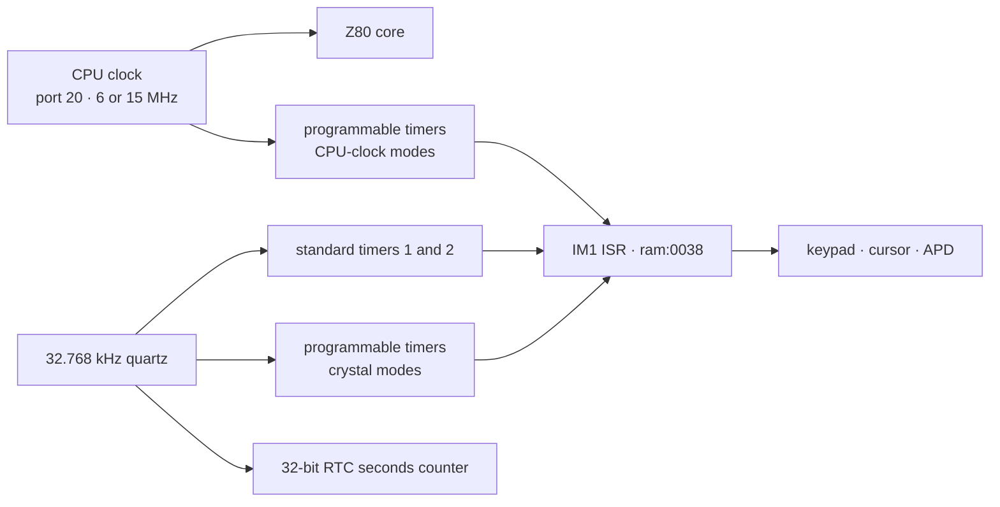
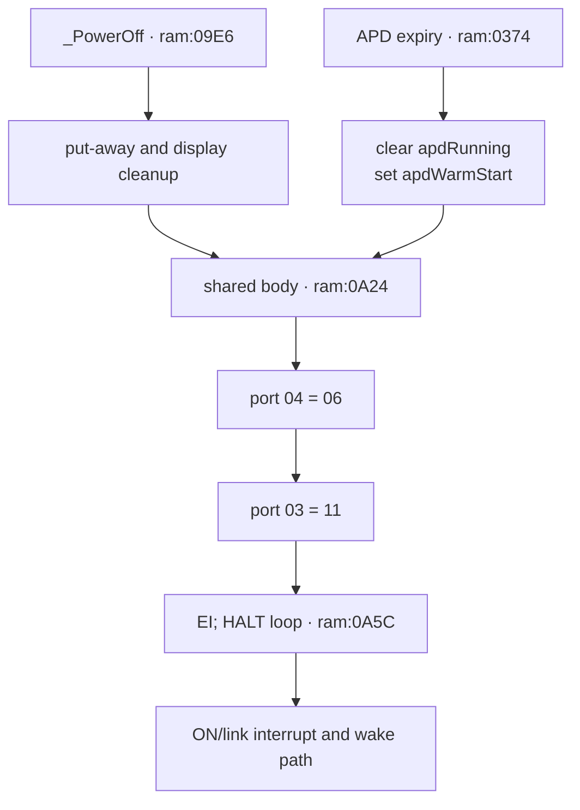

# Clock, timers, and power

*TI-84 Plus OS 2.55MP — Clock domains, timer APIs, APD, RTC, and low-power control.*

The TI-84 Plus derives OS timekeeping from a 32.768 kHz crystal while the Z80 runs at a separately selectable CPU rate. This page separates the standard interrupt timers, three programmable timers, and real-time clock; reconstructs the undocumented timer bcall state machine; and follows both explicit and automatic shutdown into the ASIC's low-power state.

## Evidence layers

The subsystem crosses ROM code, public hardware observations, and emulator policy. A claim marked [confirmed] comes from the local OS 2.55MP image or a complete instruction trace. A claim marked [standard] comes from the named hardware source and agrees with the ROM. TilEm behavior is identified as emulator behavior rather than physical-ASIC proof.

| Layer | Main evidence | What it establishes |
|-------|---------------|---------------------|
| TI-OS kernel | `ram:0038`–`ram:04B2` and `ram:09B5`–`ram:0A5F` | interrupt routing, standard-timer consumers, APD counters, and shutdown [confirmed] |
| TI-OS banked code | `33:5E1E`–`33:5F69` and `37:5359`–`37:5950` | programmable-timer API and RTC conversion/access [confirmed] |
| Dynamic execution | `tools/macros/power-cycle.macro` and resolved TilEm traces | standard-timer cadence and the explicit shutdown/HALT path [confirmed] |
| Public hardware notes | WikiTI ports `0x03`, `0x04`, `0x20`, `0x2D`, `0x2F`, `0x30`–`0x38`, and `0x40`–`0x48` | register semantics and oscillator-derived rates [standard] |
| Emulator model | Upstream TilEm `x4_io.c`, `x4_init.c`, and `timers.c` at commit `f56ad63` | implemented timing, status transitions, RTC policy, and fidelity gaps [standard] |

## Hardware blocks and clock domains

The TA2/TA3 ASIC integrates the Z80-compatible core, RAM interface, USB, and supporting logic. WikiTI's hardware history places the variable CPU clock, 32.768 kHz quartz oscillator, programmable timers, and MD5 assist in the advanced gate array introduced with the TI-83 Plus Silver Edition. The TI-84 Plus adds a real-time clock driven from that low-frequency domain. Datamath identifies the local calculator family as using TI REF 83PLUSB/TA2 or 84PLUSB/TA3 ASIC revisions. [standard]

The [MD5 accelerator and boot API](md5-hardware.md) page checks the MD5 port block and boot routines independently.



The three timing blocks have different contracts: [standard]

| Block | Registers | Resolution or source | OS use |
|-------|-----------|----------------------|--------|
| Standard hardware timers | `port 0x04` rate; `port 0x03` mask/ack | four crystal-derived rates | kernel tick, keypad scan, cursor, APD |
| Programmable timers 1–3 | triplets `0x30`–`0x38` | crystal or divided CPU clock | timer bcall API and USB timeouts |
| Real-time clock | `0x40`–`0x48` | one-second, 32-bit counter | date/time bcalls and TI-BASIC clock commands |

### CPU speed

Port `0x20` selects CPU speed. Value `0` selects the nominal 6 MHz mode; values `1`–`3` select the nominal 15 MHz mode on the TI-84 Plus. TilEm models these as exactly 6 MHz and 15 MHz. Physical measurements published by WikiTI vary by ASIC revision and unit, so cycle-count conversion should name whether it uses nominal or measured frequency. [standard]

The low two speed bits also select one of ports `0x29`–`0x2C` for LCD and
memory wait states, plus a field in port `0x2F`. See
[Bus timing and wait states](bus-timing.md). [standard]

The standard timers and RTC remain tied to the quartz domain when the CPU speed changes. Programmable timers can instead select the CPU clock, so their wall time then changes with port `0x20`. [standard]

## Interrupt-source routing

TI-OS uses IM1. `ram:0038` jumps to `ram:006D`, swaps in the alternate general registers, polls the active-low USB summary at port `0x55`, and falls through to the separate legacy status port `0x04` when the USB block reports no source. [confirmed]

Reading port `0x04` reports legacy pending state, live ON level, and programmable-timer completion: [standard]

| Bit | Source | OS branch from the dispatcher |
|----:|--------|-------------------------------|
| 0 | ON key | `ram:015B` |
| 1 | standard hardware timer 1 | `ram:0167` |
| 2 | standard hardware timer 2 | `ram:01F1` |
| 3 | ON key level, active low | tested as state rather than a source |
| 4 | link activity | `ram:01E0` path |
| 5 | programmable timer 1 complete | status check at `ram:013A`; handler `33:5EB4` |
| 6 | programmable timer 2 complete | `ram:0154` path |
| 7 | programmable timer 3 complete | status check at `ram:012C`; handler `35:4792` |

The two status handlers visible in this dispatch are unrelated to the kernel's APD tick: [confirmed]

- `33:5EB4` continues the OS timer API's programmable-timer-1 countdown.
- `35:4792` stops programmable timer 3 and services a USB timeout/event structure through ports `0x8E`, `0x91`, and `0x92`.
- `ram:0167` handles the standard timer-1 tick that reaches keypad scanning, cursor blink, the run indicator, and APD.

The status-test order is programmable timer 3, timer 1, timer 2, standard timer 2, link, ON, then standard timer 1. Programmable completion bits remain visible when their timer mode does not request an interrupt, so timers 1 and 3 receive an additional mode-bit check before their handlers run. [confirmed] for the test order and mode checks; [standard] for completion visibility.

The kernel normally writes `0x0B` to port `0x03`: ON and standard timer 1 can interrupt, timer 2 and link cannot, and bit 3 keeps the ASIC powered during `HALT`. The acknowledge sequence at `ram:00DC` writes `0x08`, which clears all legacy source bits under the clear-on-zero contract, and then writes a handler-supplied byte. See [Interrupts (IM1)](interrupts.md#clear-on-zero-acknowledgement) for the complete register tables and simultaneous-source behavior. [confirmed] for the writes; [standard] for latch semantics.

## Standard hardware timers

Writing port `0x04` selects both memory-map mode and the standard-timer rate. Bits 1–2 form an index $i$ from 0 through 3. On the TI-84 Plus, standard timer 1 has period [standard]

$$
T_1 = \frac{64 + 80i}{32768}\text{ seconds}
$$

and timer 2 runs at twice its frequency. [standard]

| Port-`0x04` bits 2–1 | $i$ | Timer-1 period | Timer-1 frequency | Timer-2 frequency |
|----------------------:|----:|---------------:|------------------:|------------------:|
| `00` | 0 | 1.953125 ms | 512 Hz | 1,024 Hz |
| `01` | 1 | 4.39453125 ms | 227.555556 Hz | 455.111111 Hz |
| `10` | 2 | 6.8359375 ms | 146.285714 Hz | 292.571429 Hz |
| `11` | 3 | 9.27734375 ms | 107.789474 Hz | 215.578947 Hz |

TI-OS writes `0x06` to port `0x04` at several setup sites, including `ram:09B7`. Bit 0 is clear, selecting memory-map mode 0, and bits 1–2 select the slowest standard-timer rate. The kernel tick period is therefore exactly $304/32768$ seconds under the documented quartz model. [confirmed] for the write; [standard] for the physical rate.

### Dynamic cadence

A resolved TilEm trace enters `ram:0167` at steady intervals of 139,153–139,157 emulated CPU cycles after the OS reaches its 15 MHz state. TilEm schedules this timer at 9,277 µs, so its nominal interval is 139,155 cycles. Instruction-boundary acceptance accounts for the small spread. [confirmed]

The hardware formula gives 9,277.34375 µs, or 139,160.15625 nominal 15 MHz cycles. TilEm rounds each rate to whole microseconds with the table `{1953, 4395, 6836, 9277}`. The five-cycle difference at the slow setting is emulator quantization, not evidence that the quartz formula differs. [standard]

## Kernel-tick consumers

`standard_timer1_irq` at `ram:0167` performs the periodic kernel work below before returning through the common interrupt acknowledge path. [confirmed]

| Consumer | Gate or counter | Code |
|----------|-----------------|------|
| Run indicator | `indicCounter` at `0x8476` | `run_indicator_tick` at `ram:027B` |
| Keypad scan and repeat | state at `0x8440`–`0x8443` | `kbd_tick_debounce_repeat` at `ram:03B4` → `kbd_scan_matrix` at `ram:0406` |
| Cursor blink | `curTime` at `0x844A` | `06:7C45` through the `ram:3FCF` bjump |
| General countdown | word at `0x9C24` | `apd_timer_tick` at `ram:0355` |
| APD | `apdSubTimer`/`apdTimer` at `0x8448`/`0x8449` | `ram:036C`–`ram:0382` |

The keypad mechanism is covered in [Keypad and ON-key hardware](keypad-on-hardware.md). These consumers advance from standard timer 1, not from a programmable timer. [confirmed]

### Auto Power Down timing

`_ApdSetup = 4C93` has body `ram:03AE`. It reloads only the high byte: [confirmed]

```z80
ram:03AE  ld hl,0x8449       ; apdTimer
ram:03B1  ld (hl),0x74
ram:03B3  ret
```

When `apdAble` and `apdRunning` are set, `ram:036C` decrements the low byte first and the high byte only when the low byte reaches zero: [confirmed]

```z80
ram:036C  ld hl,0x8448       ; apdSubTimer
ram:036F  dec (hl)
ram:0370  ret nz
ram:0371  inc hl             ; apdTimer
ram:0372  dec (hl)
ram:0373  ret nz
```

Because `_ApdSetup` leaves `apdSubTimer` unchanged, the timeout depends on its phase. If $d$ is the number of ticks until the low byte next reaches zero, with $1 \le d \le 256$, expiry takes [confirmed]

$$
N = d + 115 \times 256
$$

standard timer-1 ticks. The exact range is: [confirmed] for the counter arithmetic; [standard] for conversion through the documented timer rate.

| Quantity | Minimum | Maximum |
|----------|--------:|--------:|
| Timer ticks | 29,441 | 29,696 |
| Seconds | 273.134277 | 275.500000 |
| Minutes | 4.552238 | 4.591667 |

The low byte's free-running phase explains the roughly 2.37-second spread after a reload. The high-byte constant alone therefore does not encode one exact number of minutes. [confirmed]

On expiry, `ram:0374` performs display/context cleanup, clears `apdRunning`, sets `apdWarmStart`, and jumps to the shared shutdown body at `ram:0A24`. [confirmed]

### Cursor blink cadence

`_CursorOn` and `_CursorOff` reload `curTime` with `0x32` (50). The handler at `06:7C45` decrements it, toggles `curOn` on expiry, and reloads the same value. [confirmed]

At the OS standard-timer setting, one visible-state interval is [confirmed] for the tick count; [standard] for wall time.

$$
50 \times \frac{304}{32768} = 0.4638671875\text{ seconds}
$$

A complete on/off cycle is 0.927734375 seconds. The run indicator has a separate counter at `0x8476`; it does not share the APD word. [confirmed]

## Programmable timers

The ASIC provides three independent eight-bit countdown timers. Each uses a source/frequency register, a mode/status register, and a counter register. [standard]

| Timer | Source/frequency | Mode/status | Counter | Port-`0x04` completion bit |
|------:|-----------------:|------------:|--------:|---------------------------:|
| 1 | `0x30` | `0x31` | `0x32` | 5 |
| 2 | `0x33` | `0x34` | `0x35` | 6 |
| 3 | `0x36` | `0x37` | `0x38` | 7 |

### Source and divisor

The high two frequency-register bits choose the clock family. The low bits encode a family-specific divisor. [standard]

| Value or family | Result |
|-----------------|--------|
| `0x00` | timer off |
| `0x40` | 32.768 kHz divided by 3 |
| `0x41` | 32.768 kHz divided by 33 |
| `0x42` | 32.768 kHz divided by 328 |
| `0x43` | 32.768 kHz divided by 3,277 |
| `0x44`, `0x45`, `0x46`, `0x47` | 32.768 kHz divided by 1, 16, 256, or 4,096 |
| `0x80`, `0x81`, `0x82`, `0x84`, `0x88`, `0x90`, `0xA0` | CPU clock divided by 1, 2, 4, 8, 16, 32, or 64 |
| `0xC0` family | CPU clock plus the speed-dependent port-`0x2F` prescaler |

Writing a nonzero counter starts it when a valid source is selected. Counter value zero represents 256 ticks, loops continuously, and does not assert the port-`0x04` completion bit. [standard]

TilEm stops a timer on every source-register write and retains the current counter as the next loop value. This is emulator behavior in `tilem_user_timer_set_frequency`, not evidence that every physical ASIC revision retains the counter the same way.

### Mode, completion, and acknowledgement

| Mode/status bit | Meaning |
|----------------:|---------|
| 0 | loop after expiry |
| 1 | request a maskable interrupt on expiry |
| 2 | overflow: another expiry occurred before acknowledgement |

Writing the mode/status port acknowledges completion, clears overflow, and removes the timer's interrupt request. The corresponding port-`0x04` bit records completion even when mode bit 1 did not request an interrupt. If looping remains active without a new mode write before the next expiry, the counter continues through a 256-count overflow cycle and sets status bit 2. [standard]

Port `0x2D` controls low-power behavior. Bit 0 keeps the quartz oscillator active on the TI-83 Plus Silver Edition; the TI-84 Plus RTC already requires it. Bit 1 allows the programmable timers to continue counting in low power. TI writes `0x03`. Public hardware tests report that these timers still do not reliably interrupt a halted CPU, so software should keep a standard timer enabled when it must escape `HALT`. [standard]

## Undocumented timer bcall API

OS 2.55MP exposes one software timer backed by programmable timer 1. `ti83plus.inc` supplies official equate names, but the WikiTI pages for IDs `526C`–`5281` are absent. The ABI below is reconstructed from `33:5E1E`–`33:5F69`. [confirmed]

### Entry points

| Bcall | ID | Body | Inputs | Success result |
|-------|---:|------|--------|----------------|
| `_InitTimer` | `526C` | `33:5E38` | none | `B=0x70`, `A=0`, carry clear |
| `_KillTimer` | `526F` | `33:5E4E` | `A=0x70` | stops hardware and clears all state |
| `_StartTimer` | `5272` | `33:5E58` | `A=0x70`, `DE` duration, `C!=0` for auto-restart | starts or completes immediately |
| `_RestartTimer` | `5275` | `33:5E9D` | same duration/restart inputs | replaces the current run |
| `_StopTimer` | `5278` | `33:5F42` | `A=0x70` | stops hardware and clears running |
| `_WaitTimer` | `527B` | `33:5EA4` | `A=0x70`, `DE` duration | starts once and busy-waits for finished |
| `_CheckTimer` | `527E` | `33:5F16` | `A=0x70` | `HL` expiry count; Z if unfinished, NZ if finished |
| `_CheckTimerRestart` | `5281` | `33:5F27` | `A=0x70` | returns old `HL`, then clears finished/count |

All operations except `_InitTimer` validate `A=0x70`. An invalid or uninitialized ID returns carry set and `A=2`. `_InitTimer` returns carry set and `A=1` when already initialized. `_StartTimer` returns carry set and `A=3` when already running. [confirmed]

### State block

| Address | Size | Meaning |
|---------|-----:|---------|
| `0x9C0C` | 1 | bit 0 initialized; bit 1 running; bit 2 finished; bit 3 auto-restart |
| `0x9C0D` | 2 | original `DE` duration for auto-restart |
| `0x9C0F` | 2 | remaining chunk word |
| `0x9C11` | 2 | saturating completed-expiry count |

`_InitTimer` sets only initialized. `_KillTimer` writes zero to ports `0x30` and `0x31`, then clears all seven bytes. `_StopTimer` stops those ports and clears running, but preserves finished, auto-restart, the saved duration, and the expiry count. [confirmed]

### Duration encoding and hardware programming

`_StartTimer` selects source `0x41`, whose tick period is $33/32768$ seconds, and mode `0x02`, which requests an interrupt without hardware looping. `timer_program_next_chunk` at `33:5EF3` programs counter `0x32` in chunks. [confirmed]

For input `DE`, the high byte `D` counts full chunks of 255 and the low byte `E` supplies the final chunk. The total hardware count is therefore [confirmed]

$$
N = 255D + E
$$

rather than the ordinary 16-bit value $256D+E$. Each tick is about 1.007080078125 ms under the crystal specification. For example, `DE=0x0100` programs 255 ticks, and `DE=0x0101` programs 256. This radix-255 chunking is an ABI quirk, not a generic property of the hardware counter. [confirmed]

After each hardware expiry, `timer_irq` acknowledges mode port `0x31`, programs the next chunk, and returns while chunks remain. At the logical expiry it increments the word at `0x9C11`, saturating at `0xFFFF`, clears running, and sets finished. With auto-restart selected, it restores the original duration, sets running again, and programs the first new chunk. [confirmed]

A zero duration has no hardware chunk. `_StartTimer` marks the timer finished immediately and increments the expiry count once. [confirmed]

### Check and wait quirks

`_CheckTimer` preserves the `BIT 2` result while loading `HL`: Z means unfinished and NZ means finished. It always returns `A=0` and carry clear on a valid timer. The count can exceed one when auto-restart runs faster than the caller checks it. [confirmed]

`_CheckTimerRestart` disables interrupts, captures the old count, clears finished and the count, then executes `EI` unconditionally. It does not preserve a caller's disabled-interrupt state. Its final success path also makes Z set, so use the returned count rather than `_CheckTimer`'s finished-flag convention. [confirmed]

`_WaitTimer` sets `C=0`, calls `_StartTimer`, and spins on state bit 2. It does not execute `HALT`. Because `timer_irq` advances multi-chunk and completed timers, ordinary waits require interrupts to remain enabled. [confirmed]

## Real-time clock

The RTC is a 32-bit count of seconds since midnight on 1 January 1997. The set and current registers are little-endian by port number. [standard]

| Ports | Access | Meaning |
|-------|--------|---------|
| `0x40` | read/write | bit 0 enable; rising edge on bit 1 commits a new count |
| `0x41`–`0x44` | read/write | staged set value, least-significant byte first |
| `0x45`–`0x48` | read | current seconds, least-significant byte first |

To set the clock, software writes all four staged bytes, writes `0x01` to port `0x40` so command bit 1 is low, then writes `0x03` to create its rising edge while leaving the clock enabled. [standard]

### Raw OS access

`rtc_read_seconds` at `37:58A1` reads current ports in the order `0x48`, `0x47`, `0x46`, `0x45` into `0x8499`–`0x849C`. The following conversion loop turns that 32-bit integer into the OS floating-point/date representation. [confirmed]

`rtc_write_seconds` at `37:593F` writes the four converted bytes in the reverse port order `0x44`, `0x43`, `0x42`, `0x41`, then emits the `0x01` → `0x03` control sequence. [confirmed]

The hardware documentation does not describe a snapshot/latch operation for current-time reads. The OS reads high byte first, which reduces but does not eliminate the possibility of a rollover between the four port reads. No retry or two-pass coherence check appears at `37:58A1`. [confirmed] for the OS sequence; [hypothesis] for physical rollover behavior.

### Date and time bcalls

| Bcall | ID | Body | Role |
|-------|---:|------|------|
| `_chkTmr` | `5143` | `37:54C1` | clock-value conversion/check entry |
| `_getDate` | `514F` | `37:550B` | date into the floating-point stack |
| `_GetDateString` | `5152` | `37:55E8` | format the current date into `DE` buffer |
| `_getDtFmt` | `5155` | `37:5581` | return date-order setting 1, 2, or 3 |
| `_getDtStr` | `5158` | `37:55A9` | date-string wrapper using current format |
| `_getTime` | `515B` | `37:5551` | seconds, minutes, and 24-hour hour values |
| `_GetTimeString` | `515E` | `37:567E` | format current time into `DE` buffer |
| `_getTmFmt` | `5161` | `37:5593` | return 12- or 24-hour setting |
| `_getTmStr` | `5164` | `37:55CF` | time-string wrapper using current format |
| `_SetZeroOne` | `5167` | `37:5359` | helper for clock-setting parser state |
| `_setDate` | `516A` | `37:536E` | validate and set a date |
| `_IsOneTwoThree` | `516D` | `37:5438` | validate the three date formats |
| `_setTime` | `5170` | `37:540D` | validate and set a time |
| `_IsOP112or24` | `5173` | `37:5413` | validate 12/24-hour selection |
| `_chkTimer0` | `5176` | `37:557E` | jump directly to `rtc_read_seconds` |
| `_timeCnv` | `5179` | `37:56C4` | clock/date conversion entry |

WikiTI documents `_getDate` as returning day, month, and year through `OP1` and floating-point stack slots. `_getTime` returns seconds, minutes, and hours, with hours always in 24-hour form. `_GetTimeString` applies the user's 12/24-hour setting and writes a null-terminated string such as `1:41AM` or `15:56`. [standard]

## Power-off and wake flow

`_PowerOff = 5008` resolves to `ram:09E6`. It performs context and display cleanup before joining a shared shutdown tail. APD performs its own cleanup at `ram:0374` and joins later at `ram:0A24`. [confirmed]



The final writes are: [confirmed]

| Address | Operation | Effect |
|---------|-----------|--------|
| `ram:0A4B` | `OUT (0x04),0x06` | map mode 0 and slow standard-timer rate |
| `ram:0A4F` | `OUT (0x03),0x11` | ON and link interrupts enabled; both standard timers disabled; low-power-on-HALT selected |
| `ram:0A51` | clear `shift2nd` | remove the **[2nd]** modifier |
| `ram:0A55` | clear `onRunning` | mark the OS as powered down |
| `ram:0A5B` | `EI` | allow the selected wake interrupt |
| `ram:0A5C` | `HALT; JR ram:0A5C` | remain in the ASIC low-power loop |

The low-power request is port-`0x03` bit 3 clear combined with Z80 `HALT`; writing `0x11` by itself does not finish the transition. ON and link activity remain enabled as wake sources. The wake interrupt follows `ram:0038` → `ram:006D` → `ram:015B` → `ram:0964`. After debouncing the active-low ON level, the power-on branch at `ram:09AC` restores the CPU-speed setting and writes `0x06` to port `0x04` at `ram:09B7`. It does not return to the suspended `_PowerOff` caller. [confirmed]

### Dynamic power-cycle trace

`tools/macros/power-cycle.macro` cold-boots the OS, presses **[2nd]**+**ON**, waits in low power, then presses **ON**. The resolved trace enters `_PowerOff` once, reaches `ram:0A24`, executes both port writes, and repeats `HALT` at `ram:0A5C` until the wake event. It then records the wake route through `ram:0964`, `ram:09AC`, and `ram:09B5`. [confirmed]

```sh
TILEM=~/Git/tilem-headless/result/bin/tilem2

$TILEM --headless --rom tools/rom.bin --model ti84p --normal-speed --reset \
  --macro tools/macros/power-cycle.macro \
  --trace /tmp/tilem-power-cycle.trace --trace-range all \
  --trace-limit 500000000

nix develop -c python tools/tilem_trace_resolve.py \
  /tmp/tilem-power-cycle.trace --initial-mapping ti84p-reset \
  --names tools/names.txt --only-space ram \
  --only-addr 09e6-0a5d --print 180
```

## TilEm behavior and fidelity gaps

TilEm reproduces the paths used by this OS, but several model choices matter for timing experiments. [standard]

| Area | TilEm behavior | Consequence |
|------|----------------|-------------|
| Standard timers | whole-microsecond periods `{1953, 4395, 6836, 9277}` | small quantization from exact quartz ratios |
| Programmable crystal modes | integer calculations derived from 32.768 kHz | documented `0x40`–`0x47` modes work |
| Programmable CPU modes | divisors 1–64 based on bit 7 | follows CPU speed selected at port `0x20` |
| Mode-3 prescaler | treats `0xC0` family like ordinary CPU mode | port-`0x2F` timer prescaling is not modeled |
| Port `0x2D` | stores and reads the value | does not pause timers or oscillator in low power |
| HALT timer quirk | internal `NO_HALT_INT` flag follows standard-timer enable bits in port `0x03` | approximates the observed need to keep a standard timer active |
| RTC source | host `time_t` plus a stored offset | clock advances with host wall time, not emulated Z80 cycles |
| Disabled RTC | returns a frozen stored count | differs from WikiTI's report that ports `0x45`–`0x48` read zero while disabled |

TilEm's programmable-timer model tracks loop, interrupt-enable, completion, and overflow separately. Completion is an internal flag exposed through port `0x04`; the mode/status read exposes bits 0–2. This matches the split in the hardware notes and the OS ISR. [standard]

## Resolved findings and open hardware questions

- [confirmed] Standard hardware timer 1 drives APD, keypad scanning, cursor blink, and the run indicator through `ram:0167`.
- [confirmed] `33:5EB4` is the programmable-timer API interrupt handler; `35:4792` is a USB timer-3 handler.
- [confirmed] APD expires 29,441–29,696 kernel ticks after `_ApdSetup`, depending on the untouched low-byte phase.
- [confirmed] The cursor toggles every 50 kernel ticks.
- [confirmed] The timer bcall API exposes only ID `0x70`, uses radix-255 duration chunking, and keeps a saturating expiry count.
- [confirmed] Explicit power-off and APD share the low-power tail at `ram:0A24`.
- [hypothesis] Physical RTC reads can tear across a one-second rollover because no latch or OS retry is documented.
- [hypothesis] The precise ASIC reason programmable timers fail to wake `HALT` remains undocumented.
- [hypothesis] Low-power behavior of port `0x2D` and RTC reads should be checked on TA2 and TA3 hardware rather than inferred from TilEm.

## Sources

| Source | Used for |
|--------|----------|
| [WikiTI interrupt overview](https://wikiti.brandonw.net/index.php?title=83Plus:Interrupts) | source bits, masks, acknowledgement, and HALT notes |
| [WikiTI port `0x04`](https://wikiti.brandonw.net/index.php?title=83Plus:Ports:04) | standard-timer rates and programmable completion bits |
| [WikiTI port `0x20`](https://wikiti.brandonw.net/index.php?title=83Plus:Ports:20) | CPU-speed settings and physical measurements |
| [WikiTI ports `0x2D`](https://wikiti.brandonw.net/index.php?title=83Plus:Ports:2D) and [`0x2F`](https://wikiti.brandonw.net/index.php?title=83Plus:Ports:2F) | low-power crystal control and mode-3 prescaler |
| [WikiTI programmable timers](https://wikiti.brandonw.net/index.php?title=83Plus:Ports:30) | timer triplets, divisors, modes, overflow, and HALT quirk |
| [WikiTI RTC control](https://wikiti.brandonw.net/index.php?title=83Plus:Ports:40), [set registers](https://wikiti.brandonw.net/index.php?title=83Plus:Ports:41), and [current registers](https://wikiti.brandonw.net/index.php?title=83Plus:Ports:45) | RTC protocol and 1997 epoch |
| [WikiTI hardware history](https://wikiti.brandonw.net/index.php?title=83Plus:History_of_TI-8x_hardware) | ASIC integration, quartz oscillator, and TI-84 Plus RTC |
| [Datamath TI-84 Plus hardware](http://www.datamath.org/Graphing/TI-84PLUS.htm) | TA2/TA3 identification, ASIC/PCB photographs, and 15 MHz specification |
| [TilEm `x4_io.c`](https://github.com/debrouxl/tilem/blob/f56ad637d0524ee841dd381be6ecbaf5b8975600/emu/x4/x4_io.c), [`x4_init.c`](https://github.com/debrouxl/tilem/blob/f56ad637d0524ee841dd381be6ecbaf5b8975600/emu/x4/x4_init.c), and [`timers.c`](https://github.com/debrouxl/tilem/blob/f56ad637d0524ee841dd381be6ecbaf5b8975600/emu/timers.c) | emulator timer, RTC, interrupt, and power policy |
