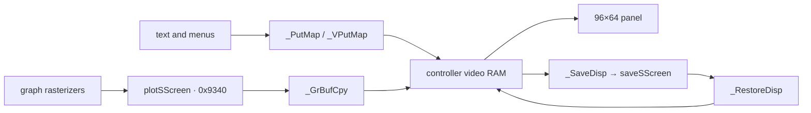

# Display and LCD

The display subsystem turns text, graph buffers, menus, and equation layouts into the 96×64 monochrome image scanned from LCD-controller video RAM. This page maps the OS-facing render paths and software buffers; [LCD controller and display bus](lcd-hardware.md) reconstructs commands, addressing, timing, initialization, reads, power, and controller-revision behavior.

## Display paths

The OS uses direct rendering for homescreen text and an explicit RAM back buffer for graphs. [confirmed]



| Path | Main entry | Behavior |
|------|------------|----------|
| Large text | `_PutMap` at `01:5A98` | draws one large-font glyph directly into controller RAM |
| Cooked character | `_PutC` at `01:5B4C` | calls `_PutMap`, advances `curCol`, and handles newline/wrap |
| String | `_PutS` at `01:5C39` | emits a null-terminated large-font string |
| Small text | `_VPutMap`/`_VPutS` | renders variable-width glyphs using `penCol`/`penRow` |
| Graph clear | `_GrBufClr` at `04:6071` | clears 768 bytes of `plotSScreen`; does not touch the LCD |
| Graph blit | `_GrBufCpy` at `04:60A3` | copies selected graph-buffer rows to controller RAM |
| Physical clear | `_ClrLCDFull` at `01:60E4` | writes zero to all 768 visible controller bytes |
| Save/restore | `_SaveDisp`/`_RestoreDisp` | captures and restores the displayed image |

## Software display state

| Address | Name | Size | Role |
|---------|------|-----:|------|
| `0x8447` | `contrast` | 1 byte | OS contrast level used to build controller command `0xC0`–`0xFF` |
| `0x844A` | `curTime` | 1 byte | timer-driven cursor blink countdown |
| `0x844B`/`0x844C` | `curRow`/`curCol` | 2 bytes | 16×8 homescreen character cursor |
| `0x845A`–`0x8461` | `lFont_record` | 8 bytes | current large-font render record |
| `0x8508`–`0x8587` | `textShadow` | 128 bytes | 16×8 homescreen character shadow |
| `0x86EC`–`0x89EB` | `saveSScreen` | 768 bytes | saved display image |
| `0x9340`–`0x963F` | `plotSScreen` | 768 bytes | graph/back buffer, 12 bytes × 64 rows |

Both 768-byte buffers use the `MonoFramebuffer` layout: [confirmed]

```c
typedef struct {
    uint8_t rows[64][12];
} MonoFramebuffer;
```

Each `rows[y][byte_column]` byte holds eight pixels, most-significant bit first.
Controller video RAM is a third image store outside Z80 RAM. Direct text output
can change it without changing `plotSScreen`, while graph drawing can change
`plotSScreen` without changing the panel until `_GrBufCpy` runs. [confirmed]

## Large-font text

`_PutMap` clamps character code zero and codes at or above `0xF8` to replacement code `0xD0`. It computes `character × 8` and bjumps to `put_glyph_large` at `07:4588`. [confirmed]

The page-7 blitter adjusts that offset to a seven-byte packed stride:

$$
\text{glyph address} = \texttt{07:45FF} + 7c
$$

where $c$ is the character code. It then copies eight bytes into `lFont_record`, so the eighth byte overlaps the first byte of the next packed glyph. [confirmed]

Two flags at `IY+0x35` select alternate font-hook sources before the page-7 table read. Bit 5 calls `3B:7BFB` with selector `A=0x01`; bit 1 calls `3B:7B9C` with selector `A=0x76`. With neither flag set, `_PutMap` reads the built-in table. [confirmed]

The renderer positions the controller from `curRow` and `curCol`. Glyph edges use controller read-modify-write with the required dummy data read before the real byte. The complete bus sequence is in [LCD controller and display bus](lcd-hardware.md#text-drawing-and-read-modify-write).

## Cursor and indicators

`_CursorOn` and `_CursorOff` reload `curTime` with 50. Standard hardware timer
1 reaches `cursor_blink_tick` at `06:7C45`, which toggles the cursor every 50
ticks. See [Clock, timers, and power](clock-timers-power.md#cursor-blink-cadence).
[confirmed]

The run indicator uses `indicCounter` and `indicBusy` at `0x8476`/`0x8477`. `_RunIndicOn` seeds it, and `run_indicator_tick` at `ram:027B` advances it from the same standard-timer interrupt. `_ClrLCDFull` temporarily clears and then restores the indicator-enable bit around the physical clear. [confirmed]

## Numeric and string output

`_DispHL` at `01:5BF6` converts `HL` to five decimal positions with repeated `_DivHLBy10`, stores digits backward in scratch RAM, replaces leading zeroes with spaces, and prints through `_PutC`. [confirmed]

`_PutC` wraps when `curCol` reaches 16 and calls the newline/scroll path. `_PutS` and related bounded-string entries repeat `_PutC` over character data. These APIs target the character-oriented homescreen state, not the graph buffer. [confirmed]

## Graph and equation rendering

Graph rasterizers write `plotSScreen` and call `_GrBufCpy` or `_PDspGrph` to expose the result. Coordinate transforms, clipping, line/circle algorithms, and graph state are covered in [Graphing](sub-graphing.md).

MathPrint uses a separate layout engine before its glyphs reach the display primitives. Its descriptors, box tree, cursor geometry, and runtime gaps are covered in [Equation display](sub-equation-display.md).

The table editor and Y= screens build text-grid state through their own context handlers. See [Table and Y= variables](sub-table-yvars.md).

## Related deep dives

- [LCD controller and display bus](lcd-hardware.md) — ports, status, commands, addressing, waits, initialization, clear/blit/read paths, contrast, power, dynamic I/O traces, and cross-emulator fidelity.
- [Graphing](sub-graphing.md) — graph buffer, transforms, pixels, lines, circles, and graph display.
- [Equation display](sub-equation-display.md) — MathPrint layout and compositing.
- [Table and Y= variables](sub-table-yvars.md) — table grid and function editor.
