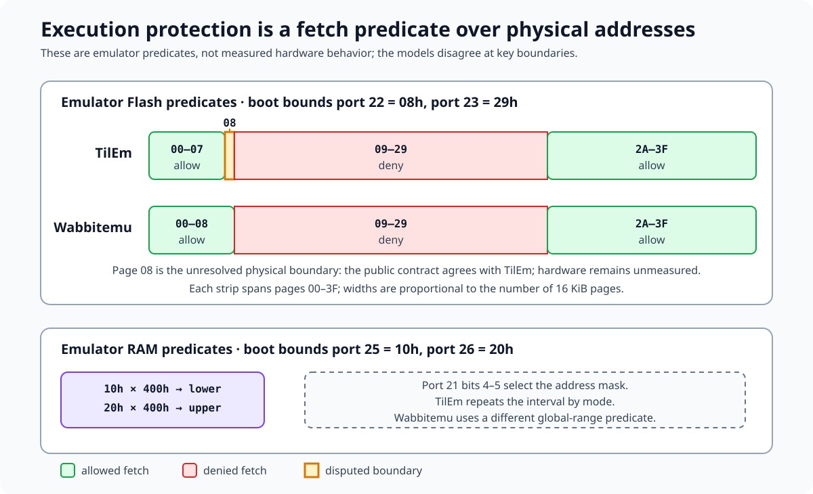

# Execution protection

*TI-84 Plus OS 2.55MP — Flash-page and RAM-chunk fetch controls.*

Ports `0x21`–`0x26` define where the ASIC permits instruction fetches. The
retail boot writes five protection registers before it changes the normal
memory map. Emulator source supplies reproducible models for the resulting
checks, but several boundary details still require physical measurement.

## Evidence boundaries

| Evidence | What it establishes | Confidence |
|----------|---------------------|------------|
| Retail boot page `3F` | protected writes, register values, and `_SetFlashLowerBound` behavior | [confirmed] |
| Complete-ROM static I/O scan | one write each to ports `0x21`, `0x22`, `0x25`, and `0x26`; two writes to port `0x23`; no resolved port-`0x24` access | [confirmed] |
| TilEm x4, Wabbitemu, and jsTIfied source | three executable software models, including their disagreements | [standard] |
| Guarded TilEm boundary traces | fetch, return, warning, and reset sequences at pages `07`, `08`, `29`, and `2A` | [confirmed] for the pinned emulator run |
| Guarded Wabbitemu boundary runs | fetch, return, marker, and instrumented reset sequences at pages `07`, `08`, `09`, `29`, and `2A` | [confirmed] for the pinned emulator run |
| Guarded RAM execution runs | chunk-edge and mode disagreements under pinned TilEm and Wabbitemu | [confirmed] for the pinned emulator runs |
| Guarded Wabbitemu protected-port run | registered-port gate, readback, high-field handling, and 16-bit RAM-bound storage | [standard] |
| WikiTI port pages | public inclusive-bound descriptions and the larger-device port-`0x24` extension | [standard] |
| Physical TA2/TA3 behavior | lower-edge, reset, violation, and overlay details | [hypothesis] until measured |

The emulator equations below are source-verified descriptions of those
programs. Agreement between an emulator and a public table does not promote an
unmeasured ASIC behavior to [confirmed].

## Registers and boot values

The boot sequence establishes these values. [confirmed]

| Port | Boot value | Modeled role |
|------|-----------:|--------------|
| `0x21` | `0x00` | bits 4–5 select the repeating RAM address mask; bits 0–1 also select the Flash protection group |
| `0x22` | `0x08` | lower Flash no-execute page |
| `0x23` | `0x29` | upper Flash no-execute page |
| `0x25` | `0x10` | lower executable RAM chunk in 1 KiB units |
| `0x26` | `0x20` | upper executable RAM chunk in 1 KiB units |

`boot_execution_protection_init` at `3F:41D5` performs the five writes through
`3F:4206`: [confirmed]

```z80
3F:41D5  ld a,0x00
3F:41D7  nop
3F:41D8  nop
3F:41D9  im 1
3F:41DB  di
3F:41DC  out (0x21),a
3F:41DE  di

3F:41DF  ld a,0x08
3F:41E1  nop
3F:41E2  nop
3F:41E3  im 1
3F:41E5  di
3F:41E6  out (0x22),a
3F:41E8  di

3F:41E9  ld a,0x29
3F:41EB  nop
3F:41EC  nop
3F:41ED  im 1
3F:41EF  di
3F:41F0  out (0x23),a
3F:41F2  di

3F:41F3  ld a,0x10
3F:41F5  nop
3F:41F6  nop
3F:41F7  im 1
3F:41F9  di
3F:41FA  out (0x25),a
3F:41FC  di

3F:41FD  ld a,0x20
3F:41FF  nop
3F:4200  nop
3F:4201  im 1
3F:4203  di
3F:4204  out (0x26),a
3F:4206  di
```

Each output is preceded by fetched bytes `00 00 ED 56 F3 D3`. TilEm advances
its protected-write recognizer only while these bytes come from physical Flash
`0xB0000`–`0xBFFFF` or `0xF0000`–`0xFFFFF`. Wabbitemu does not recognize the
six bytes. It accepts a port-`0x14` lock change whenever the output instruction
executes on one of its privileged pages. Both implementations then accept
writes to ports `0x21`–`0x26` only while Flash is unlocked. [standard]

The ROM proves that it emits the required byte sequence from page `3F`. It does
not by itself prove the complete privileged-page set or the response to an
invalid sequence. [confirmed] for the bytes; [standard] for the differing
emulator gates.

## Flash instruction fetches

TilEm x4 applies the following test after it resolves a logical address to a
physical Flash page $p$: [standard]

$$
\mathit{denied}_{\mathrm{TilEm}} = (\mathtt{port22} \le p \le \mathtt{port23})
$$

The boot values therefore deny pages `0x08`–`0x29`, inclusive. Pages
`0x00`–`0x07` and `0x2A`–`0x3F` remain executable. Reversing the bounds makes
the interval empty in this model. [standard]

Wabbitemu implements a different lower edge: [standard]

```c
return bank->page <= flash_lower || bank->page > flash_upper;
```

Its forbidden interval is `(port22, port23]`. With the boot values, Wabbitemu
allows page `0x08`, while TilEm denies it. Both deny page `0x09` and page
`0x29`. WikiTI describes the lower bound as inclusive, which agrees with TilEm,
but the physical page-`0x08` result remains unmeasured. [standard] for the
published contract and source comparison; [hypothesis] for hardware.



**Boot execution ranges.** The written bounds are [confirmed], and the emulator predicates are [standard]. The physical page-`08` boundary remains [hypothesis]. The RAM panel introduces the mode-dependent chunk model detailed below.

Both emulator paths apply this rule to opcode fetches. Ordinary Flash data
reads use a separate path. The locked certificate-page read censor is also a
separate mechanism. [standard]

jsTIfied stores ports `0x22` and `0x23` only while its Flash gate is open and
builds page-level `run_lock` entries. A denied fetch sets its halted/reset state
to `2`. Ports `0x25` and `0x26` are stored but do not participate in the fetch
predicate, so jsTIfied cannot test the documented 1 KiB RAM-bound behavior.
Its port-`0x21` handler instead rebuilds coarser RAM-page execution groups.
These are properties of the pinned JavaScript source, not ASIC evidence.
[standard]

WikiTI also says page `0x00` always remains executable and that a forbidden
fetch resets the calculator. Wabbitemu always permits page 0 and resets the CPU
on a violation when no debugger callback is installed. TilEm's interval test
can deny page 0 when port `0x22 = 0`. Its opcode-read handler raises an
execution exception, and its Z80 loop performs a full calculator reset after
the fetched opcode completes. These custom-bound and post-violation behaviors
remain physical test cases. [standard]

### Guarded TilEm boundary trace

A controlled fixture tests both sides of the boot interval rather than
inferring runtime behavior from source alone. Each derived ROM changes only six
erased bytes at target `pp:7FF0` to this marker routine:

```z80
ld a,pp
ld (0x8478),a
ret
```

The 75-byte assembly program at `ram:9D95` first reads those six bytes as data
and compares them with its embedded signature. It then seeds `0x8478`, maps
the target page, and executes `CALL 0x7FF0` at `ram:9DBD`. A mismatch returns
without attempting the fetch. The fixture builder requires the exact complete
ROM hash, verifies that the patched span was `FF FF FF FF FF FF`, and writes a
new ROM copy rather than modifying `tools/rom.bin`.

The pinned headless TilEm run produced these control-flow sequences. Clock
deltas are relative to the `CALL`; absolute clocks include UI launch timing.
[confirmed]

| Page | Recorded sequence after `ram:9DBD` | TilEm warning count | Outcome |
|------|-------------------------------------|--------------------:|---------|
| `07` | `07:7FF0` at +8, `07:7FF2` at +23, return `ram:9DC0` at +47 | 0 | returned |
| `08` | attempted `08:7FF0` at +8, reset entry at +15; no `08:7FF2` or return | 1 | violation reset |
| `29` | attempted `29:7FF0` at +8, reset entry at +15; no `29:7FF2` or return | 1 | violation reset |
| `2A` | `2A:7FF0` at +8, `2A:7FF2` at +23, return `ram:9DC0` at +47 | 0 | returned |

TilEm records the denied target's first opcode-fetch address before its main
loop services the pending execution exception. It does not advance to the
marker store at `pp:7FF2`; the next record is logical `0x8000`, followed by the
retail reset stub's mapping writes and boot continuation. The first post-reset
record is resolved with stale pre-reset mapper state because TLMT has no
explicit internal-reset event, so the classifier uses the logical `0x8000`
transition and the subsequent reset-stub sequence.

The machine-code and trace identities were: [confirmed]

| Page | Probe SHA-256 | Trace SHA-256 |
|------|--------------|---------------|
| `07` | `87c11964b6cf67624b2eff46e1a962c56f1684dd48db931a5cb68e08c1b84b4e` | `250cc9d2b8b3c85f5edb6391e847993e27e6c308c4a70d62dd5cfc8168af8e68` |
| `08` | `ddd023d522d301315c0f4929f348499faca08c708e96c1333bf85e32505f9534` | `f9c1f142430aafc47b514ef220a707be01de02678e6cd22fcb1f6e5fb024eeac` |
| `29` | `f671bdb62e6bad19f33402eb919e70631cf7cc8f00b9f7f52114d052f86cea78` | `ee3dac7ec1843c2a82ee321c0a3a16c95bc5898d3c70fb97296127dbf2020007` |
| `2A` | `d5f72f96562ef5e96f4ddaa12954548d210650d9ca6bec365f75f1bb6f3bad1b` | `b9db26bc7ef69d97907118d0124213603632d9e2f3d9ebb56680b87d8644636d` |

This dynamically confirms the inclusive `08`–`29` interval and reset policy
implemented by this TilEm build. It does not decide the physical page-`08`
boundary or validate Wabbitemu's lower-exclusive model. [confirmed] for TilEm;
[hypothesis] for the physical lower edge and violation response.

### TilEm reset and exception scope

TilEm's `tilem_calc_reset` resets the Z80, LCD controller, link port, keypad,
Flash command state, MD5 accelerator, programmable timers, and model-specific
hardware state in sequence. The TI-84 Plus callback then selects this starting
state: [standard]

| Group | Reset value |
|-------|-------------|
| Z80 register pairs except `PC` | `0xFFFF` |
| `PC`, `R` bit 7 | `0x8000`, `0x80` |
| `IFF1`, `IFF2`, `IM`, interrupt requests, `HALT` | zero |
| Mapper windows | page `00`, certificate page `3E`, boot page `3F`, boot page `3F` |
| CPU speed | 6 MHz |
| Protection ports `0x21`–`0x23`, `0x25`, `0x26` | `00`, `08`, `29`, `10`, `20` |
| Flash command gate, state, and busy flag | locked, array-read mode, idle |
| LCD controller | inactive, contrast 32, 8-bit mode, increment 7, row stride 16 |
| Link output and assist, keypad, MD5, programmable timers | cleared or reset defaults |

The reset retains all memory arrays, including LCD backing memory. It also
retains Flash program-address, data, toggle, override-group, and emulation
fields. External link-emulator state remains. The TI-84 Plus callback leaves
port `0x05`, ports `0x09`–`0x0F`, the three RTC fields, and `LCD_WAIT`
unchanged. Scheduler and debugger state also survives: the Z80 clock, access
timestamps, emulation flags, dynamic timers, and breakpoints. [standard]

A guarded direct-core run seeds eight reset groups and nine retained groups.
All 17 match the source model. It records `PC=0x8000`, `SP=0xFFFF`, mapper
windows `00/3E/3F/3F`, and a retained dynamic timer with 4,321 clocks
remaining. Direct internal seeding tests TilEm implementation state, not a
physical reset. [confirmed]

TilEm's forbidden-fetch path does not suppress the opcode. The M1 read raises
`TILEM_EXC_FLASH_EXEC`, returns the byte, and the Z80 executes the complete
instruction. The main loop checks the exception afterward and calls
`tilem_calc_reset`. The direct-core fixture maps Flash page `08` at `0x4000`
and RAM page `0x40` at `0x8000`. Its forbidden instruction is
`LD (0x8000),A` with `A=0x5A`. The run stops on the exception after reset with
`PC=0x8000` and `AF=SP=0xFFFF`, while physical RAM byte `0x100000` contains
`0x5A`. [confirmed]

The boundary fixture above begins with `LD A,pp`; reset follows that first
instruction, before its marker-store instruction. Its unchanged marker proves
only that the second opcode did not execute. It does not prove that TilEm
suppresses the forbidden opcode itself.

The direct-core binary SHA-256 is
`ab0a862b1fbb7f8a09a075fbd0ec61ebb0bab84d12d2a9c2a650813476cc7e5a`.
The builder requires clean TilEm commit
`f56ad637d0524ee841dd381be6ecbaf5b8975600` and Git tree
`58316afe35d69e69353f0f743698144153051d4a`.

### Guarded Wabbitemu boundary run

The pinned Wabbitemu core executed the same six-byte ROM markers and 75-byte
RAM probes. The native adapter first cold-boots the fixture ROM. It waits until
the retail boot establishes `0x08`, `0x29`, `0x4000`, and `0x83FF` as the Flash
and RAM bounds. It also requires mode 0 and relocked Flash. Every run reached
this state after
134,845 instructions and 1,746,999 T-states at `3F:4223`. [confirmed] for the
pinned emulator run.

The adapter then maps physical RAM page 1 at `0x8000`, copies the probe to
`ram:9D95`, verifies the complete copy through the logical mapping, and sets
`PC=0x9D95`. This is a direct emulator-core injection, not an OS variable or UI
launch. An execution-violation callback counts the event and calls the same
`CPU_reset` function used by Wabbitemu's callback-free path. [confirmed] for the
harness behavior.

The native core produced these sequences: [confirmed]

| Page | Sequence from `ram:9DBD` | Probe instructions | Marker | Outcome |
|------|---------------------------|-------------------:|-------:|---------|
| `07` | `07:7FF0`, `07:7FF2`, return `ram:9DC0` | 54 | `07` | returned |
| `08` | `08:7FF0`, `08:7FF2`, return `ram:9DC0` | 54 | `08` | returned |
| `09` | attempted `09:7FF0`; no `09:7FF2` or return; one reset | 52 | `A0` | violation reset |
| `29` | attempted `29:7FF0`; no `29:7FF2` or return; one reset | 52 | `A0` | violation reset |
| `2A` | `2A:7FF0`, `2A:7FF2`, return `ram:9DC0` | 54 | `2A` | returned |

The probe seeds the marker with `A0` immediately before the call. The denied
pages therefore show that the marker store at `pp:7FF2` did not execute. Page
`08` returns while page `09` resets, dynamically distinguishing Wabbitemu's
lower-exclusive interval from TilEm's inclusive interval. This establishes the
pinned emulator's behavior only. The physical lower edge and violation state
remain unmeasured. [confirmed] for Wabbitemu; [hypothesis] for hardware.

The native binary SHA-256 is
`07d56ac311cc6726d95f0e76987ce34af8814d07bcf1528f6b25375c083489f2`.
It was built from pinned Wabbitemu commit `48c2dc0e6d1d87bb5cf9611efbeb0d048b19c422`
and source-tree SHA-256
`a8a4f97fc7952770bed317b4a477f80345894da38d14fad8f0bf0ee60aae71ba`.
The derived fixture identities were: [confirmed]

| Page | Fixture ROM SHA-256 | Probe SHA-256 |
|------|---------------------|---------------|
| `07` | `ed2372b459cddd89deea6a27d00cd6f757d612c4f63db4feaf134665ad2e78cf` | `87c11964b6cf67624b2eff46e1a962c56f1684dd48db931a5cb68e08c1b84b4e` |
| `08` | `b0d32c8f3af1f87c8fce8f7966ab45d588a8ed42ed9ce7708de38b4d7dc57934` | `ddd023d522d301315c0f4929f348499faca08c708e96c1333bf85e32505f9534` |
| `09` | `7f2443e3aecceaa8c1ad60e0de4e2316caad3d17802ec3a719567a05e25a244c` | `f121bae475d56947bec80090bb3047fab478cc86db4dec897e4161f78df14584` |
| `29` | `1590ddf2681c3636e119df3759909c43b62a49a9dbc74f5a4f00d6500ae9017d` | `f671bdb62e6bad19f33402eb919e70631cf7cc8f00b9f7f52114d052f86cea78` |
| `2A` | `1ee90aef8e9795ef56b668ae36560ad6a4c99938055cd0e5763b930b0f585d2a` | `d5f72f96562ef5e96f4ddaa12954548d210650d9ca6bec365f75f1bb6f3bad1b` |

### Wabbitemu reset scope

Wabbitemu's `CPU_reset` is a CPU and mapper reset, not a complete hardware
reinitialization. The function writes only these groups for the TI-84 Plus
model: [standard]

| Group | Reset value |
|-------|-------------|
| `PC`, `SP` | `0x0000` |
| Interrupt mode | `1` |
| Interrupt, `EI` block, `IFF1`, `IFF2`, `HALT`, and I/O flags | cleared |
| Prefix state | zero |
| Ports `0x27` and `0x28` remap counts | zero |
| RAM execution bounds | `0x0000`–`0x03FF` |
| Mapper windows | boot page `3F`, Flash page `00`, Flash page `00`, RAM page `00` |
| Boot-map and page-0-change flags | cleared |
| Legacy `protected_page[4]` array and selected group | zero |

The function retains the other directly seeded state. This includes general
and alternate CPU registers, `I`, `R`, bus state, RAM contents, the Flash
command state, Flash lock and bounds, protection mode and selectors, timer
frequency and T-states, delay registers, MD5 state, standard and programmable
timers, RTC, keypad and ON state, raw link, link assist, USB, GPIO, and the LCD
object. [standard]

The frontend `calc_reset` calls `CPU_reset` and then the LCD reset callback.
The LCD callback clears display memory and its queue, disables output, zeros
the coordinates and last-read latch, selects 8-bit words, and sets contrast
32. It retains the LCD access timestamp and port-`0x2F` delay field. No other
peripheral reset follows. [standard]

A guarded initialized-core run seeds 14 component groups before calling
`CPU_reset`. All 14 retain their seeded values. The reset mapping is
`3F/00/00/00`, the RAM bounds are `0x0000`–`0x03FF`, and the frontend-equivalent
call produces the LCD state above while retaining `last_tstate = 654321` and
`lcd_delay = 61`. Direct state seeding isolates field retention; it does not
reproduce a physical warm or cold reset. [confirmed] for the pinned Wabbitemu
run.

An execution violation calls `CPU_reset` inside `CPU_opcode_fetch`, then
continues the same `CPU_step`. A seeded `FLASH_PROGRAM` violation ends the
command state, fetches boot bytes `3E 07`, executes `LD A,0x07`, and finishes
at `PC=0x0002` after seven T-states. A seeded `FLASH_ERROR` violation fetches
opcode `0x3E`, returns status byte `0xE0` for the immediate read, clears the
error flag, executes `LD A,0xE0`, and also finishes at `PC=0x0002`. The command
step remains `FLASH_ERROR` in the second case. This is an emulator control-flow
quirk, not a physical reset model. [confirmed]

The reset-retention manifest guards OS 2.55MP ROM SHA-256
`7d9a7d96d89fc552ebee6afdbdd011fdc6047be9c16d308245dff07eb1f7bd6d`
and native-binary SHA-256
`386be74e738f2a0f9ad17f12bae4cd44994b5a73835ab10d488c7b8232afd87e`.

## RAM instruction fetches

TilEm x4 reduces a physical RAM byte offset $a$ to a 1 KiB chunk address. For
port-`0x21` mode $t = 0,1,2,3$, it computes: [standard]

$$
\begin{aligned}
M_t &= (\mathtt{0x8000} \ll t) - \mathtt{0x400} \\\\
m &= a \mathbin{\\&} M_t \\\\
\mathit{allowed} &= \mathtt{port25}\cdot\mathtt{0x400}
                   \le m \le
                   \mathtt{port26}\cdot\mathtt{0x400}
\end{aligned}
$$

The mask clears the low ten address bits, so the comparisons operate at 1 KiB
granularity. The upper comparison is inclusive. A port-`0x26` value of `0x20`
therefore includes the complete `0x8000`–`0x83FF` chunk whenever $M_t$ can
produce `0x8000`. [standard]

### Coverage with the boot bounds

The table covers the TI-84 Plus's eight physical RAM pages. Page notation uses
the ordinary selector spelling `0x80`–`0x87`. “Chunk 0” means the first 1 KiB
at page offset `0x0000`–`0x03FF`. [standard]

| Mode | TilEm mask | Repetition | Fully executable pages | Partly executable pages |
|-----:|-----------:|-----------:|------------------------|-------------------------|
| 0 | `0x7C00` | 32 KiB | `0x81`, `0x83`, `0x85`, `0x87` | none |
| 1 | `0xFC00` | 64 KiB | `0x81`, `0x85` | chunk 0 of `0x82` and `0x86` |
| 2 | `0x1FC00` | 128 KiB | `0x81` | chunk 0 of `0x82` |
| 3 | `0x3FC00` | 256 KiB | `0x81` | chunk 0 of `0x82` |

Modes 2 and 3 have the same coverage within the first 128 KiB. Their masks
diverge only when an address reaches the next 128 KiB. Reversing ports `0x25`
and `0x26` denies every RAM chunk in TilEm because the inclusive interval is
empty. [standard]

### Wabbitemu comparison

Wabbitemu's source comments list the fully executable page pattern implied by
the four modes. Its executable predicate contains this expression: [standard]

```c
if (bank->page & (2 >> (prot_mode + 1)))
    return TRUE;
```

For mode 0, the shifted value is `1`, so every odd RAM page returns early. For
modes 1–3, the shifted value is zero. Those modes fall through to one global
address comparison instead of applying a repeating mask. The default bounds
produce this actual coverage: [standard]

| Mode | Wabbitemu fully executable pages | Partly executable pages |
|-----:|-----------------------------------|-------------------------|
| 0 | `0x81`, `0x83`, `0x85`, `0x87` | chunk 0 of `0x82` |
| 1 | `0x81` | chunk 0 of `0x82` |
| 2 | `0x81` | chunk 0 of `0x82` |
| 3 | `0x81` | chunk 0 of `0x82` |

The extra mode-0 chunk comes from Wabbitemu's inclusive global range check,
not its page shortcut. Its mode-2 and mode-3 coverage happens to match TilEm
within 128 KiB under these bounds. The source arithmetic still differs for
other RAM sizes and bound values. These implementation results are not ASIC
evidence.

Wabbitemu stores `ram_lower` and `ram_upper` as 16-bit unsigned fields. Its
port handlers multiply the 8-bit port value by `0x400` before assigning those
fields. Values `0x40`–`0xFF` therefore wrap modulo `0x10000`. For example,
writing `0x40` to both ports produces the implemented interval
`0x0000`–`0x03FF`, not `0x10000`–`0x103FF`. TilEm retains the wider products.
[standard] for the emulator sources; [hypothesis] for physical high-value
behavior.

### Guarded RAM execution runs

Two guarded runners exercise the predicates through opcode fetches. Both use a
six-byte target routine that stores a case marker at `0x8478` and returns. The
source program reads back all six target bytes before it seeds `0x8478` with
`0xA0` and calls the target. A returned case records its case marker. A denied
case retains `0xA0`, omits the target store at logical target +2, and records
one reset. [confirmed] for the pinned emulator runs.

The Wabbitemu adapter cold-boots the exact ROM through the retail protection
sequence. It then configures the requested RAM fields and injects the guarded
source at physical RAM page 1, `ram:9D95`, plus the target routine. This is a
direct emulator-core injection. Every default-bound case reached the baseline
at `3F:4223` after 134,845 instructions and 1,746,999 T-states. Returned cases
executed 47 injected instructions; denied cases reset on instruction 45.
[confirmed]

The TilEm runner changes only the immediate byte at `3F:41D6` when it selects
a nonzero mode. Mode 1 changes that byte from `0x00` to `0x10`; the derived ROM
SHA-256 is
`47b38fa0fd747529dea85d4fe54d24bafdadeee29c8ade82014f4452ef52699f`.
The OS launches a self-installing assembly program through the normal variable
and UI path. The program writes the marker through data accesses before the
guarded call. [confirmed]

The runtime comparison produced these boundary results: [confirmed]

| Mode | Physical target | TilEm | Wabbitemu | Predicate detail |
|-----:|-----------------|-------|------------|------------------|
| 0 | page `0x82`, offset `0x03F0` | violation reset | returned | Wabbitemu includes page-2 chunk 0 through its global range; TilEm's mode-0 mask maps it below the lower bound |
| 0 | page `0x82`, offset `0x0400` | violation reset | violation reset | first target in chunk 1 |
| 1 | page `0x82`, offset `0x03F0` | returned | returned | target lies wholly inside chunk 0 |
| 1 | page `0x82`, offset `0x0400` | violation reset | violation reset | first target in chunk 1 |
| 1 | page `0x85`, offset `0x3FF0` | returned | violation reset | TilEm repeats the full-page window after 64 KiB; Wabbitemu uses one global range |
| 1 | page `0x86`, offset `0x03F0` | returned | violation reset | TilEm repeats the page-2 upper chunk after 64 KiB; Wabbitemu uses one global range |

The TilEm target fetch occurs seven clocks after each `CALL`. Allowed marker
routines return 44 clocks after the call. Denied targets reset seven clocks
after the attempted fetch. TilEm completes the first target opcode during that
interval. Wabbitemu's callback records the violation and invokes the same
`CPU_reset` function as its callback-free path. Timing between the two runners
is not compared because the Wabbitemu harness reports instruction counts, not
a TLMT clock trace.

The other Wabbitemu cases cover all four modes under the boot bounds:
[confirmed]

| Mode | Returned targets | Violation-reset targets |
|-----:|------------------|-------------------------|
| 0 | page `0x81` offset `0x3FF0`; page `0x82` offset `0x03F0`; page `0x83` offset `0x3FF0` | page `0x82` offset `0x0400`; page `0x84` offset `0x0000` |
| 1 | page `0x81` offset `0x3FF0`; page `0x82` offset `0x03F0` | page `0x82` offset `0x0400`; page `0x85` offset `0x3FF0`; page `0x86` offset `0x03F0` |
| 2 | page `0x81` offset `0x3FF0`; page `0x82` offset `0x03F0` | page `0x82` offset `0x0400`; page `0x83` offset `0x0000` |
| 3 | page `0x81` offset `0x3FF0`; page `0x82` offset `0x03F0` | page `0x82` offset `0x0400`; page `0x83` offset `0x0000` |

A separate Wabbitemu run configured both chunk ports to `0x40`. The native
report recorded the wrapped bounds `0x0000`–`0x03FF`. Mode-0 page `0x80`,
offset `0x0000`, returned; page `0x82`, offset `0x0000`, reset. The first result
comes from the wrapped global interval. The second lies outside it and has no
odd-page shortcut. [confirmed] for Wabbitemu; [hypothesis] for hardware.

The pinned identities for the cross-emulator cases were:

| Mode and target | TilEm probe SHA-256 | TilEm trace SHA-256 | Wabbitemu probe SHA-256 |
|-----------------|---------------------|---------------------|-------------------------|
| mode 0, `0x82+0x03F0` | `a0853c1ea1f900a7b8b4c26d1091e5696265b993a214d20836c182743ae330c3` | `0bde946b277f0c3fe7c6040931ea1df6c265aa11d4fad6394cfeea5955dfe18b` | `783d757f767b0d89df7c68881413e0cb47a6652da2c94829f90972e3eb2a64cb` |
| mode 0, `0x82+0x0400` | `9f82e2df6960cc6e0658c1db4b19e755bd544105be73fa476f8b17e34527a116` | `66853fc88e6a934577f1e70916df012f77e02ea7ab7e77b2caa4a9cda0a5e602` | `d068ef192978d9fbddada76d6f55320263315ad2b3344e64751cc33f9aa58d5f` |
| mode 1, `0x82+0x03F0` | `7ef4086cf9fe4e938215cf3592435d13fcd0874a239e58fbdc50c78719531ff2` | `31601907572c2060adaa76d2031a138e225a5e73bdc8f84c50505178e1e871ee` | `f0843119d9a19ab5f5578f61160a8cb5ce723d12ed2b3ea13a5d9cdfc8857ce7` |
| mode 1, `0x82+0x0400` | `1531839a1d11895ad14ddada9974da4c307eb1ba09b5b660b3f1858bf2659a7f` | `8a9ded0bb3479a86587579ae647a4c2604689f3f0dea9beba96b7fb1117415a9` | `d2ba9523c63f7645f61cfad45677b9afc3bc47a64b251f2d8f3daafadc8525b0` |
| mode 1, `0x85+0x3FF0` | `4996653aca01db9c7ce67d7a367810cf4a07ee42fa65991920232a81d6b3074c` | `a76f11d993e1b5cf6e19feca1af4321637670a9f1c7f5232159096ea2ba0839f` | `857a38aa6ccf163ebac779c775d812e9ad9df844c870a9bbc42fdad7932da959` |
| mode 1, `0x86+0x03F0` | `8851278b8f3b54b7a7e7a0ff206b03f98bbec6528a3d705598a054dcf5f501a0` | `e976f06992278db20f1b00c6faf2caf4140d7635de1af180f6491d103e0719ce` | `3c989491f4031cfac972cd72af55824d6a1ca8f384315ac3fbbd5ed0ad15a3c0` |

The TilEm assembly source SHA-256 is
`eafb257ff0190bfa8417269c981ab0ff94508e92a31b716c01814b0afe4bb2ca`.
The Wabbitemu assembly source SHA-256 is
`e21fe4374eec887b4877ad27ccb77dd458dcb38c24e48cb167ebb1438fc8d43c`.
These runs establish emulator behavior only. Physical mode repetition,
high-value wrapping, chunk endpoints, and reset state remain open measurements.

## Port `0x24` larger-device extension

WikiTI assigns two high Flash-bound bits to port `0x24`: bit 0 extends port
`0x22`, and bit 1 extends port `0x23`. TilEm's color `xc` model uses exactly
those two bits when it compares pages. Its TI-84 Plus `x4` model has no
port-`0x24` case. [standard]

The complete OS 2.55MP ROM scan finds no direct port-`0x24` instruction and no
access resolved from a nearby literal load into `C` or `BC`. Computed accesses
across calls or control-flow joins remain outside this static proof.
[confirmed]

Port `0x24` is therefore a family extension, not part of the confirmed retail
TI-84 Plus initialization path. Wabbitemu registers it on the TI-84 Plus-family
device, but its two high-bit assignment expressions lack parentheses around
the masked bit before shifting. Both expressions evaluate to zero for an
8-bit bus value under C operator precedence. [standard]

## Native protected-register confirmation

The guarded initialized-core probe finds active, protected handlers at every
port from `0x22` through `0x26`. The reset core reads
`0x10/0x30/0x00/0x00/0x00`. These are Wabbitemu initialization values, not the
retail boot values in the table above. All five writes are rejected while the
in-memory Flash lock remains closed. Reads remain active. [standard]

The probe then opens the emulator's lock directly and seeds the internal Flash
bounds as `0x01A5` and `0x02B6`. Writes of `0xCC` and `0xDD` to ports `0x22`
and `0x23` produce `0x01CC` and `0x02DD`, confirming that both low-byte
handlers preserve their seeded high bytes. Writing `0xFF` to port `0x24`
reads back `0xFF` but changes the internal bounds to `0x00CC` and `0x00DD`.
The native result matches Wabbitemu's precedence defect. It does not test a
physical larger-device extension. [standard]

The same run writes four edge values to both RAM-bound ports: [standard]

| Written byte | Port-`0x25` read | Internal lower field | Port-`0x26` read | Internal upper field |
|-------------:|-----------------:|---------------------:|-----------------:|---------------------:|
| `0x3F` | `0x3F` | `0xFC00` | `0x3F` | `0xFFFF` |
| `0x40` | `0x00` | `0x0000` | `0x00` | `0x03FF` |
| `0x41` | `0x01` | `0x0400` | `0x01` | `0x07FF` |
| `0xFF` | `0x3F` | `0xFC00` | `0x3F` | `0xFFFF` |

The manifest records the exact ROM and native-binary hashes. Opening the lock
and seeding high fields are direct emulator-core operations. This mode does
not execute the ROM's protected-byte sequence or attempt an opcode fetch.

## `_SetFlashLowerBound`

The official bcall name does not match the port written by its body.
`_SetFlashLowerBound = 80CF` maps to `3F:4784`, which writes `A` to port
`0x23` — the upper end of the modeled forbidden interval: [confirmed]

```z80
3F:4784  nop
3F:4785  nop
3F:4786  im 1
3F:4788  di
3F:4789  out (0x23),a
3F:478B  di
3F:478C  ret
```

Flash must already be unlocked for either emulator to accept the write. The
routine preserves `A` and leaves interrupts disabled. [confirmed] for the
routine; [standard] for the modeled write gate.

## Mapping and forced overlays

Execution protection runs after logical-to-physical page resolution. TilEm
applies ports `0x27` and `0x28` first, then chooses its Flash or RAM predicate
from the resulting physical page. [standard]

Wabbitemu chooses its Flash-versus-RAM branch from the underlying bank. Its RAM
path also evaluates the page shortcut before replacing the global address for
a forced overlay. The two emulators can therefore disagree when an overlay
forces RAM over a Flash-backed window or substitutes RAM page 0 or 1. See
[Paging](paging.md#interaction-with-execution-protection). [standard]

The guarded Wabbitemu mapper run places a NOP in forced RAM over an underlying
Flash HALT. Independent mode executes the NOP; paired mode disables the
overlay and executes the HALT. This confirms the fetched-byte routing through
the initialized core. Both underlying Flash pages are permitted by the boot
protection bounds, so the run does not distinguish which protection predicate
Wabbitemu evaluated. That ordering remains established by pinned source.
[standard]

The normal OS boot and homescreen traces leave both overlays disabled, so this
difference does not affect those executed paths. [confirmed]

## MAME 0.287 omission

MAME's TI-84 Plus I/O map does not register ports `0x22`–`0x28`. Its opcode
fetch path reads the mapped Flash or RAM without an execution-protection
predicate. Port `0x14` records an unlock value, but the paging and Flash-write
paths do not consult it. [standard]

A guarded native run writes patterns to ports `0x22`–`0x28`; all seven ports
still read zero. With port `0x21 = 0x33`, writes `CC DD AA 10 20` to
`0x22`–`0x26` also read back as five zero bytes while a 50-T-state loop
continues executing from RAM page 0. This covers one allowed-by-absence fetch
path. It does not emulate any boundary or violation response. [standard]

MAME therefore cannot test any boundary or violation described on this page.
The driver is marked `MACHINE_NOT_WORKING`, so this omission is a driver limit,
not evidence that the physical ASIC lacks execution protection. See
[Flash memory](flash-memory.md#mame-behavior-and-limits) for the resulting
Flash-command behavior. [standard]

## Reproducing the models

`tools/execution_protection.py` contains side-effect-free predicates and RAM
coverage enumeration. The focused CLI prints both emulator results:

```console
$ python tools/describe_execution_protection.py flash
Flash bounds 0x08-0x29
page 0x07: TilEm=allow Wabbitemu=allow
page 0x08: TilEm=deny Wabbitemu=allow
```

```console
$ python tools/describe_execution_protection.py ram --compare-wabbitemu
RAM chunks 0x10-0x20
mode 0 TilEm-mask=0x7C00
  page 0x80: TilEm=- Wabbitemu=-
  page 0x81: TilEm=all Wabbitemu=all
```

Use `--json` for machine-readable output. Custom `--lower`, `--upper`,
`--mode`, and `--ram-pages` values expose boundary cases without modifying an
emulator.

The guarded trace runner builds all four boundary fixtures in a fresh output
directory, runs them, and rejects a classification that disagrees with the
TilEm predicate:

```sh
probe_parent=$(mktemp -d)
nix develop -c python tools/run_execution_protection_probe.py \
  --tilem "$TILEM" --output-dir "$probe_parent/run" --json
```

`tools/execution_protection_fixture.py` holds the exact-ROM patching,
machine-code validation, reusable assembler entry point, packaging, and trace
classifier. The CLI retains each derived ROM, program pair, log, trace, and a
hash-complete `manifest.json` in the requested directory.

The direct reset probe supplies the missing single-opcode control. Its build
and run commands are under “Reset and execution exception” in the repository's
`tools/dynamic-tracing.md`. The shared `tools/tilem_core.py` library validates
the source tree and runs the binary. `tools/tilem_reset.py` parses the native
report and checks the reset and retention vectors against the source model.

The Wabbitemu CLI uses the same fixture library and adds page `09` to
distinguish the two lower-edge predicates:

```sh
wabbit_probe_parent=$(mktemp -d)
nix develop -c python tools/run_wabbitemu_execution_probe.py \
  --binary "$wabbit_tmp/wabbitemu-headless" \
  --output-dir "$wabbit_probe_parent/run" --json
```

It refuses an existing output directory. Each native report must contain the
boot-register snapshot, exact injection mapping, call and target visit counts,
marker value, reset count, fixture hashes, and native-binary hash.

The RAM runners accept repeatable `MODE:PHYSICAL_PAGE:PAGE_OFFSET` targets.
Their defaults cover the cross-emulator disagreements and all Wabbitemu modes:

```sh
tilem_ram_parent=$(mktemp -d)
nix develop -c python tools/run_tilem_ram_execution_probe.py \
  --tilem "$TILEM" --output-dir "$tilem_ram_parent/run" --json

wabbit_ram_parent=$(mktemp -d)
nix develop -c python tools/run_wabbitemu_ram_execution_probe.py \
  --binary "$wabbit_tmp/wabbitemu-headless" \
  --output-dir "$wabbit_ram_parent/run" --json
```

The Wabbitemu CLI also accepts custom `--lower-chunk` and `--upper-chunk`
values. The `0x40` wrap case is reproducible with:

```sh
wrap_parent=$(mktemp -d)
nix develop -c python tools/run_wabbitemu_ram_execution_probe.py \
  --binary "$wabbit_tmp/wabbitemu-headless" \
  --output-dir "$wrap_parent/run" \
  --lower-chunk 0x40 --upper-chunk 0x40 \
  --target 0:0:0 --target 0:2:0 --json

protected_port_parent=$(mktemp -d /tmp/ti84-protected-port.XXXXXX)
nix develop -c python tools/run_wabbitemu_protection_port_probe.py \
  --rom tools/rom.bin \
  --binary "$wabbit_tmp/wabbitemu-headless" \
  --output-dir "$protected_port_parent/run" --json
```

The boot bytes can be recovered independently:

```console
$ python tools/disassemble_rom.py 0x3f --start 0x41d5 --end 0x4206
$ python tools/analyze_rom_io.py 0x21 0x22 0x23 0x24 0x25 0x26 --summary
```

## Flash write-disable bcall [confirmed]

`_FlashWriteDisable = 0x4F3C`, body `3C:66D5`, controls Flash programming,
not the execution-protection bounds described above. After four padding
`NOP`s, it saves `AF`, clears `A`, executes `DI`, selects IM 1, writes
`0x00` to port `0x14`, executes another `DI`, restores `AF`, and returns. The
intervening `OR A` makes its `JP NZ,ram:0000` unreachable on this path.

The body restores the caller's `AF` but deliberately leaves maskable
interrupts disabled. Callers that require interrupts must re-enable them after
the bcall; they must not infer interrupt restoration from the saved `AF`.
A controlled trace reaches the body once, observes `OUT (0x14),A` with
`A = 0x00`, returns to the fixture, and then executes an explicit `EI`. The
reduced result is in `tools/data/community-bcall-semantics.csv`. [confirmed]
under TilEm; the physical Flash gate was not written on hardware in this test.

## Community execution techniques

Crabcake's original source uses two model-specific methods. On a 6 MHz
TI-83 Plus it uses a Flash-unlock exploit, locates a protected
`OUT (0x16),A` routine on Flash page `0x1F`, and calls it with `0x00` or `0x07`.
Separate exploit code changes the port-`0x05` mapping. On the
TI-83+SE/TI-84+/SE family it does not rewrite ports `0x25` or `0x26`. With
interrupts disabled, it swaps all `0x4000` bytes between physical RAM pages
`0x80` and `0x83`, then maps page `0x83` into bank C. Code above `0xC000`
remains at the same CPU address while residing on an executable odd physical
page. The Crabcake release source contains both paths. [confirmed]

The TI-84-family cleanup restores port `0x05` to an assumed normal value,
unconditionally enables interrupts, and has no error handler around the swap.
These operations are explicit in the release source. [confirmed] The release
does not distinguish the later 48 KiB alias model. That hardware remains
unsupported without a physical probe.

zStart 1.3.013 implements its `Execute >C000` option as a persistent policy.
Its menu toggle first writes the assumed retail values `0x10` and `0x20` to
ports `0x25` and `0x26`, regardless of the new option state. If the option is
enabled, later configuration and ON-script paths call `unlockC000`, which
writes `0x00` and `0xFF` after unlocking Flash writes. This is not a per-launch
save/restore wrapper. The zStart release source confirms this control flow.
[confirmed]

The Swords 2 source release contains `FULLRENE.8xv`, a 229-byte AppVar payload
with the Axiom `DE C0` signature. Both embedded command bodies contain this
sequence: [confirmed]

```z80
    LD A,0x10
    JR NC,+1
    XOR A
    OUT (0x25),A
```

The incoming carry therefore selects `0x10` or `0x00` for port `0x25`, and
neither command body writes port `0x26`. One command immediately calls
`_FlashWriteDisable` and returns. The other restores port `0x06` from the stack
before the same bcall and return. [confirmed] The artifact does not establish a
hardware model matrix or behavior after an OS error. Those details remain
[hypothesis].

`tools/data/execution-protection-observations.csv` records the emulator and
physical-probe classifications in the preceding sections. It does not classify
Crabcake, zStart, or Fullrene.

## Resolved findings and open hardware tests

- The boot writes `00`, `08`, `29`, `10`, and `20` to ports `0x21`, `0x22`,
  `0x23`, `0x25`, and `0x26` through protected byte sequences. [confirmed]
- `_SetFlashLowerBound` writes port `0x23`, despite its official name.
  [confirmed]
- TilEm denies the inclusive Flash interval. Four guarded TilEm traces execute
  pages `07` and `2A` and reset on attempted fetches from pages `08` and `29`.
  Wabbitemu allows its programmed lower page: guarded native runs execute pages
  `07`, `08`, and `2A` and reset on attempted fetches from pages `09` and `29`.
  [standard] for the source comparison; [confirmed] for the pinned emulator
  runs.
- TilEm applies a repeating RAM mask and inclusive 1 KiB chunk bounds.
  Wabbitemu's modes 1–3 omit the intended page shortcut and its 16-bit fields
  wrap high chunk values. Guarded runs exercise the mode-0 extra chunk, both
  mode-1 repetition disagreements, the common chunk edge, all four Wabbitemu
  modes, and the `0x40` wrap case. [standard] for source behavior; [confirmed]
  for the pinned emulator runs.
- The retail ROM has no statically resolved port-`0x24` access. [confirmed]
- jsTIfied implements page-level Flash and RAM execution groups, but its stored
  ports `0x25` and `0x26` do not affect instruction fetches. [standard]
- A guarded initialized-core Wabbitemu run verifies the common protected-write
  gate across ports `0x22`–`0x26`, the port-`0x24` high-field clearing defect,
  and 16-bit RAM-bound wrap at `0x40` and above. [standard]
- A guarded initialized-core Wabbitemu run confirms forced-RAM fetch routing in
  independent mode and underlying-window fetch routing in paired mode. It does
  not dynamically distinguish the Flash-versus-RAM protection predicate.
  [standard]
- Wabbitemu's low-level reset retains most peripheral and Flash state. Its
  frontend adds only an LCD reset. A guarded initialized-core run verifies all
  14 seeded retention groups and shows that an execution violation continues
  the interrupted `CPU_step` through one boot instruction. [standard] for the
  source model; [confirmed] for the pinned run.
- TilEm's full reset reinitializes eight CPU, peripheral, and ASIC groups while
  retaining memory plus selected Flash, link, RTC, scheduler, and debugger
  fields. A forbidden opcode completes before that reset. A guarded direct-core
  run verifies the reset inventory and a surviving RAM-store side effect.
  [standard] for the source model; [confirmed] for the pinned run.

Physical tests must determine whether page `0x08` executes, what exception or
reset state follows a violation, and whether lower-greater-than-upper disables
each protection range. The [read-only physical fetch
suite](hardware-probes.md#execution-protection-fetch-probes) prepares the
retail-mode Flash edge and RAM chunk tests. Tests should also sweep all 1 KiB
RAM boundaries in all four modes, repeat them with ports `0x27` and `0x28`
active, and record the register state after warm and cold resets. Until then,
emulator agreement is only a test oracle for emulator behavior.

## Sources

| Source | Use |
|--------|-----|
| OS 2.55MP and boot 1.03 ROM, especially `boot_execution_protection_init` and `_SetFlashLowerBound` | protected writes and bcall body |
| [TilEm `calcs.c`](https://github.com/debrouxl/tilem/blob/f56ad637d0524ee841dd381be6ecbaf5b8975600/emu/calcs.c), [`z80.c`](https://github.com/debrouxl/tilem/blob/f56ad637d0524ee841dd381be6ecbaf5b8975600/emu/z80.c), [`x4_init.c`](https://github.com/debrouxl/tilem/blob/f56ad637d0524ee841dd381be6ecbaf5b8975600/emu/x4/x4_init.c), and [`x4_memory.c`](https://github.com/debrouxl/tilem/blob/f56ad637d0524ee841dd381be6ecbaf5b8975600/emu/x4/x4_memory.c) | full reset sequence, TI-84 Plus reset fields, Flash and RAM fetch predicates, and post-opcode exception handling |
| [TilEm x4 I/O model at `f56ad63`](https://github.com/debrouxl/tilem/blob/f56ad637d0524ee841dd381be6ecbaf5b8975600/emu/x4/x4_io.c) | protected register writes and mask updates |
| Headless TilEm fork at `8da54573ac49fe271fa22c60924b4c6a7cb9639f` | boundary execution traces; binary SHA-256 `1c1f7dbe04fe074c2b9aca1657d0eb5ac5cfd1f7cbd480725eb7fb39b8126f33`, `x4_memory.c` SHA-256 `ddaa1e45330e3e4ad49486bd5c3675a0a0dff01bfda4d01817ba3387e309ac89` |
| [TilEm xc memory model at `f56ad63`](https://github.com/debrouxl/tilem/blob/f56ad637d0524ee841dd381be6ecbaf5b8975600/emu/xc/xc_memory.c) | port-`0x24` high-bound bits |
| [Wabbitemu `core.c` at `48c2dc0`](https://github.com/sputt/wabbitemu/blob/48c2dc0e6d1d87bb5cf9611efbeb0d048b19c422/core/core.c) | Flash and RAM fetch predicates, `CPU_reset`, and execution-violation control flow |
| [Wabbitemu `calc.c`](https://github.com/sputt/wabbitemu/blob/48c2dc0e6d1d87bb5cf9611efbeb0d048b19c422/interface/calc.c) and [`lcd.c`](https://github.com/sputt/wabbitemu/blob/48c2dc0e6d1d87bb5cf9611efbeb0d048b19c422/hardware/lcd.c) | frontend reset scope and LCD reset fields |
| [Wabbitemu `device.c` at `48c2dc0`](https://github.com/sputt/wabbitemu/blob/48c2dc0e6d1d87bb5cf9611efbeb0d048b19c422/core/device.c) | global protected-port write gate |
| [Wabbitemu `83psehw.c` at `48c2dc0`](https://github.com/sputt/wabbitemu/blob/48c2dc0e6d1d87bb5cf9611efbeb0d048b19c422/hardware/83psehw.c) | port handlers and port-`0x24` implementation |
| [MAME `ti85.cpp` and `ti85_m.cpp` at `mame0287`](https://github.com/mamedev/mame/tree/mame0287/src/mame/ti) | absent execution-protection ports and unused Flash-unlock state |
| [jsTIfied deployed `20170706a` artifact](https://www.cemetech.net/projects/jstified/jstified_compressed.js?20170706a) and [readable mirror](https://github.com/Quuxplusone/ti83/blob/56246a1181f90123a843ea17eb9e0f2fcda65113/jstified.js) | protected writes, page-level `run_lock`, violation reset, and unused stored RAM-bound ports |
| [WikiTI port `0x22`](https://wikiti.brandonw.net/index.php?title=83Plus:Ports:22), [`0x23`](https://wikiti.brandonw.net/index.php?title=83Plus:Ports:23), [`0x24`](https://wikiti.brandonw.net/index.php?title=83Plus:Ports:24), [`0x25`](https://wikiti.brandonw.net/index.php?title=83Plus:Ports:25), and [`0x26`](https://wikiti.brandonw.net/index.php?title=83Plus:Ports:26) | public register descriptions, treated as secondary evidence |
| [Crabcake release archive](https://www.ticalc.org/pub/83plus/asm/libs/crabcake.zip), SHA-256 `84f6660c86f715e09e03637b19df47abe46b86906ed34791bc4281959186f71e` | 6 MHz protected-port path and TI-84-family page-swap path |
| [zStart 1.3.013 release archive](https://www.ticalc.org/pub/83plus/flash/shells/zstart.zip), SHA-256 `7a1b7c69c85030b412bb6ea11ae71ac608b9882a9de3ab7dbef1faf69519c5e9` | persistent `Execute >C000` configuration and ON-script restoration |
| [Swords 2 source release](https://www.ticalc.org/archives/files/fileinfo/449/44919.html), archive SHA-256 `830878e3449221664b85eb3996992ad0f8b46b7e57183c337930b7e78e5a3397`; `FULLRENE.8xv` SHA-256 `327ea2ce2a603febc46490d9758cffc12c9fc926fc1d773a0d53a5ccdf5d4ec3` | original Fullrene Axiom command bodies |
