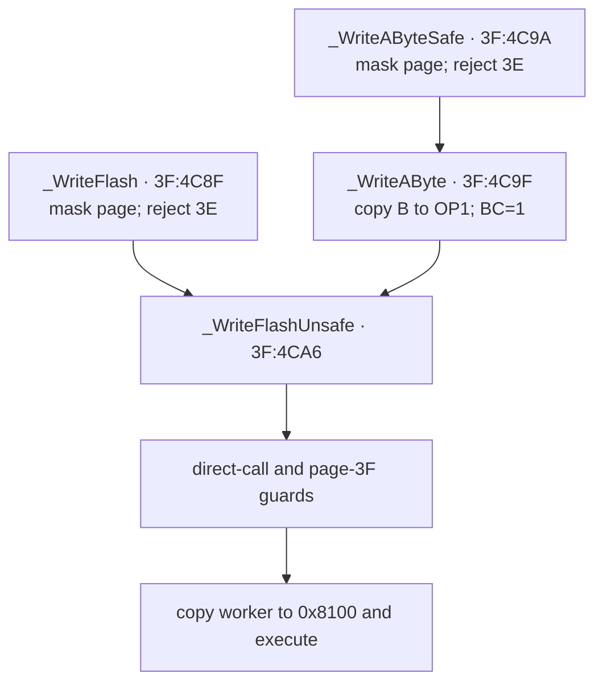

# Flash memory

*TI-84 Plus OS 2.55MP — Flash hardware, boot bcalls, and archive writes.*

The TI-84 Plus programs Flash through three distinct layers: ASIC access control, an AMD-compatible command state machine in the Flash chip, and boot-page bcalls that execute their write loops from RAM. This page separates those layers, reconstructs `_WriteFlash` and the erase APIs byte for byte, and follows a normal `Archive prgmA` operation into the hardware path.

## Evidence layers

The mechanisms below use several evidence sources. A claim marked [confirmed] comes from the local OS 2.55MP image or a complete TilEm execution trace. A claim marked [standard] comes from the named hardware source and agrees with the ROM. Emulator behavior is identified explicitly. It establishes what that emulator implements, not what the physical ASIC or Flash chip does.

| Layer | Main evidence | What it establishes |
|-------|---------------|---------------------|
| TI-OS and boot code | `tools/rom.bin`, especially `3D:61AF`–`3D:6BC4` and `3F:4784`–`3F:4E56` | bcall ABI, guards, RAM workers, archive allocation, and status handling [confirmed] |
| Dynamic execution | archive and `GCFLASH` macro fixtures plus resolved TilEm traces | normal archive writes, GC sector ordering, register values, page selection, and successful returns [confirmed] |
| ASIC model | TilEm `x4_memory.c`, `x4_io.c`, and `x4_init.c` | protected-byte recognizer, port gates, execution limits, and modeled sector protection [standard] |
| Flash device | Datamath's March 2004 board photograph and Fujitsu `MBM29LV800TA` data sheet | observed package marking, sector geometry, command cycles, DQ status semantics, and rated limits [standard] |
| Emulator comparison | pinned TilEm, Wabbitemu, and MAME source | modeled command decode, mutation rules, status reads, timing, and missing ASIC gates [standard] |

## Physical organization

### Identified board part and compatible family

Datamath's photographed March 2004 TI-84 Plus board carries a Fujitsu package
marked `29LV800TA-70PFTN`. Fujitsu's orderable part number adds its `MBM`
prefix: `MBM29LV800TA-70PFTN`. This identifies the device on that photographed
board. It does not establish one vendor for every TI-84 Plus revision.
[standard]

Datamath's NOR component index also lists AMIC `A29L800A`, Fujitsu `29LV800`,
Spansion `S29AL008D`, and Macronix `MX29LV800` as compatible 1 MiB families.
Those entries establish a reported compatible family, not which part a
particular calculator contains. [standard]

The Fujitsu suffixes and rated limits decode as follows. These are data-sheet
limits rather than measurements of a calculator. [standard]

| Marking or field | Meaning |
|------------------|---------|
| `8M (1M × 8/512K × 16)` | 8 Mbit array, used here as one MiB of byte-addressable NOR Flash |
| `TA` | top-boot sector geometry |
| `-70` | 70 ns maximum read access |
| `PFTN` | 48-pin TSOP(I), normal-bend package |
| supply | 3.0 V-only read, program, and erase |
| program/erase endurance | minimum 100,000 cycles |
| byte program | 8 µs typical, 300 µs maximum |
| sector erase | 1 s typical, 10 s maximum |

The local ROM image and TilEm's TI-84 Plus model use 64 logical pages of
16 KiB. A logical Flash page is an ASIC paging unit, not an erase unit. Port
`0x06` maps one page into the Z80's `0x4000`–`0x7FFF` bank-A window. The Flash
device erases the larger physical sector containing the command address.
[confirmed] for the ROM page count; [standard] for the device organization.

### Data-sheet command and status interface

In byte mode, the Fujitsu device decodes unlock addresses `0xAAA` and `0x555`.
Byte program uses `AA 55 A0` followed by the destination and data. Sector erase
uses `AA 55 80 AA 55 30`. A write of `0xF0` resets the command state machine to
array-read mode, including after DQ5 reports an exceeded timing limit.
[standard]

The status outputs distinguish more states than the boot workers consume:
[standard]

| Bit | Fujitsu data-sheet behavior |
|-----|-----------------------------|
| DQ7 | complements programmed data bit 7 while program is active; reads 0 during erase and the array value after completion |
| DQ6 | toggles during program, erase, and the sector-erase timeout window |
| DQ5 | indicates exceeded program/erase timing; it can also follow an attempt to program a nonblank location without erasing |
| DQ3 | distinguishes the open sector-erase command window from the active erase algorithm |
| DQ2 | toggles for an erasing or erase-suspended sector and helps distinguish erase states from program states |

The device also defines `0xB0` erase suspend and `0x30` erase resume commands.
The retail workers issue neither command. [standard] for the command set;
[confirmed] for the worker bytes.

Fujitsu autoselect returns manufacturer `0x04` and top-boot byte-mode device
`0xDA`. Wabbitemu and MAME instead return manufacturer `0x01` with the same
device code. Their values identify the AMD-compatible emulator model, not the
Fujitsu package in the Datamath photograph. [standard]

### Sector geometry

The Fujitsu `MBM29LV800TA` data sheet defines the top-boot geometry below.
TilEm, Wabbitemu, and MAME use the same boundaries. [standard]

| Physical range | Size | Logical pages or page portion |
|----------------|-----:|-------------------------------|
| `0x000000`–`0x0EFFFF` | 15 × 64 KiB | pages `00`–`3B`, four pages per sector |
| `0x0F0000`–`0x0F7FFF` | 32 KiB | pages `3C`–`3D` |
| `0x0F8000`–`0x0F9FFF` | 8 KiB | `3E:4000`–`3E:5FFF` |
| `0x0FA000`–`0x0FBFFF` | 8 KiB | `3E:6000`–`3E:7FFF` |
| `0x0FC000`–`0x0FFFFF` | 16 KiB | page `3F` |

The two halves of logical page `3E` are separate 8 KiB sectors. This is why `_EraseCertificateSector` accepts logical address `0x4000` or `0x6000`. Page `3F` is one 16 KiB boot sector. A sector erase directed anywhere in an ordinary archive page erases all four 16 KiB pages in its 64 KiB sector. [confirmed] for the certificate API; [standard] for chip geometry.

## Three independent protection mechanisms

"Flash protection" can refer to three different controls. Treating them as one switch obscures several ROM checks.

### Flash command lock — port `0x14`

Port `0x14` controls whether writes reach the Flash command state machine. Writing `1` unlocks Flash command writes; writing `0` locks them. The write is accepted only after the ASIC observes this byte sequence fetched from a privileged Flash region: [standard]

```text
00 00 ED 56 F3 D3
```

The usual instruction spelling is:

```z80
nop
nop
im 1
di
out (0x14),a
```

The ASIC recognizes fetched bytes rather than the semantic instruction stream. WikiTI documents alternate instruction sequences that produce the same bytes. TilEm's TI-84 Plus model advances its recognizer only when the bytes come from physical `0xB0000`–`0xBFFFF` or `0xF0000`–`0xFFFFF`; other Flash or RAM reads reset the recognizer. It accepts the following port-`0x14` output only in recognizer state 7. [standard]

Unlocking port `0x14` does not program a byte. It allows subsequent memory writes to reach the Flash chip, where they must still form a valid AMD command sequence. [standard]

The public write and erase bcalls expect Flash to be unlocked by their caller. The archive record writer at `3D:64AA` performs the protected port-`0x14` sequence itself before calling those APIs. [confirmed]

### Physical sector protection

TilEm assigns protection group 1 to physical `0xB0000`–`0xBFFFF` and `0xFC000`–`0xFFFFF`. Port `0x21` bits 0–1 select the modeled override group while Flash is unlocked. A command can therefore pass the port-`0x14` lock and still be rejected for a protected physical sector. [standard]

The retail boot programs port `0x21 = 0` at `3F:41DC`. Its low field also
selects model-specific Flash page bounds, while bits 4–5 configure the RAM
execution mask. See [ASIC status, identity, protection, and GPIO](asic-status-gpio.md)
for the ROM uses, emulator equations, and public size tables. [confirmed] for
the boot write; [standard] for the modeled protection behavior.

This protection is separate from the safe bcall checks. For example, `_WriteAByte` permits starting page `3E` at the software layer, while the hardware still controls whether the affected sector is writable. [confirmed] for the bcall; [standard] for the ASIC model.

### Read and execution protection

The certificate page is read-censored while Flash is locked. WikiTI documents the model-selected page as `1E`, `3E`, or `7E`; TilEm returns `0xFF` for locked reads of page `3E` on its TI-84 Plus model. [standard]

Ports `0x22` and `0x23` define a forbidden Flash-execution interval. TilEm
includes both endpoints, while Wabbitemu allows the lower page. The retail boot
writes `0x08` and `0x29`. Ports `0x25` and `0x26` bound executable RAM in 1 KiB
units. Both emulators accept writes to these protected ports only while Flash
is unlocked. See [Execution protection](execution-protection.md) for the ROM
sequence, exact equations, and unresolved physical boundaries. [confirmed] for
the boot values; [standard] for the emulator behavior.

These execution limits explain why the byte-poke loops run at `ramCode` (`0x8100`). They are distinct from the Flash chip's inability to provide ordinary array data while a program or erase operation is active. [confirmed] for the RAM workers; [standard] for the execution controls.

## Boot-page Flash API

The retail boot bcall table maps the Flash APIs below. The bcall ID is the word after `rst 28h`; the body address is where the resolved code executes. [confirmed]

| Bcall | ID | Body | Inputs | Result |
|-------|---:|------|--------|--------|
| `_WriteAByte` | `8021` | `3F:4C9F` | `A` page, `DE` destination, `B` byte | Z on success, NZ on failure |
| `_EraseFlash` | `8024` | `3F:4C2A` | `A` page, `HL` sector address | Z on success, NZ on failure |
| `_EraseCertificateSector` | `8060` | `3F:4E3F` | `HL=0x4000` or `0x6000` | preserves caller registers and flags |
| `_EraseFlashPage` | `8084` | `3F:4C1E` | `A` page | Z on success, NZ on failure |
| `_WriteFlashUnsafe` | `8087` | `3F:4CA6` | `A` page, `DE` destination, `BC` length, `HL` RAM source | Z on success, NZ on failure |
| `_WriteAByteSafe` | `80C6` | `3F:4C9A` | `A` page, `DE` destination, `B` byte | Z on success, NZ on failure |
| `_WriteFlash` | `80C9` | `3F:4C8F` | `A` page, `DE` destination, `BC` length, `HL` RAM source | Z on success, NZ on failure |
| `_SetFlashLowerBound` | `80CF` | `3F:4784` | `A` value for port `0x23` | preserves `A`; leaves interrupts disabled |

WikiTI's ABI agrees with these register uses and says the block-write source must be RAM. The ROM adds exact page guards, call-site checks, return values, and boundary behavior described below. [standard] for the published ABI; [confirmed] for the additions.

## `_WriteFlash` entry paths

The four write entry points converge on the core at `3F:4CA6`. [confirmed]



### Safe and unsafe page guards

`_WriteFlash` masks `A` with `0x3F` and returns immediately for page `3E`. `_WriteAByteSafe` does the same before falling into `_WriteAByte`. The unsafe core masks the page again and returns for page `3F`. Safe writes therefore reject both pages `3E` and `3F`. [confirmed]

`_WriteAByte` enters the unsafe core without the page-`3E` test. It stores `B` in `OP1` at `0x8478`, replaces `HL` with that address, and sets `BC=1`. It permits page `3E` but still inherits the page-`3F` rejection. [confirmed]

The guards return without reporting a distinct error code. They preserve whatever flags the last comparison produced, so a rejected call is not a reliable success result. Callers must obey the documented page contract rather than infer rejection from a new error value. [confirmed]

### Direct-call-site check

Both `_WriteFlashUnsafe` and `_EraseFlash` inspect the immediate stacked return address:

```z80
ex (sp),hl
bit 7,h
ex (sp),hl
ret nz
```

The routine returns when that address is at least `0x8000`. A normal bcall passes because the bcall dispatcher interposes a low-memory return frame; the archive trace reaches `3F:4CA6` with the relevant return address at `0x2B41`. This is a direct-call-site check. It does not prevent a RAM program from invoking the public bcall through `rst 28h`. [confirmed]

### Zero-length write

After the guards, `_WriteFlashUnsafe` tests `B|C`. A zero-length call returns before it copies or executes the RAM worker. It does not normalize `A` or flags to a documented success code. [confirmed]

## RAM-worker launcher

`3F:48C5` launches length-prefixed boot workers. `IX` points at a little-endian length word followed by worker bytes. The launcher copies that many bytes to `ramCode` at `0x8100`, restores the caller's `HL`, `DE`, and `BC`, and calls the copied code. [confirmed]

The interrupt wrapper at `3F:48EE` records IFF2 from `LD A,I` in `0x82A2`, disables interrupts, and returns to the launcher. After the worker returns, `3F:48E1` executes `EI` only if interrupts were enabled before entry. The worker therefore runs atomically while preserving the caller's prior interrupt-enabled state. [confirmed]

| Worker | Prefix | Source bytes | RAM destination |
|--------|-------:|--------------|-----------------|
| sector erase | `0x0052` at `3F:4C3B` | `3F:4C3D`–`3F:4C8E` | `0x8100`–`0x8151` |
| block program | `0x007C` at `3F:4CC8` | `3F:4CCA`–`3F:4D45` | `0x8100`–`0x817B` |

## Block-program worker

The block worker repeats a four-write AMD byte-program sequence for each source byte. It temporarily maps fixed pages `02` and `01` so the command addresses appear in bank A, then restores the target page for the data write. [confirmed]

| Step | Mapped page | Logical write | Value |
|-----:|------------:|---------------|------:|
| 1 | `02` | `0x6AAA` | `0xAA` |
| 2 | `01` | `0x5555` | `0x55` |
| 3 | `02` | `0x6AAA` | `0xA0` |
| 4 | target | `DE` | byte from `(HL)` |

The device decodes the physical low 12 address bits. Page `02`, logical
`0x6AAA` is physical address `0xAAAA`; page `01`, logical `0x5555` is physical
`0x5555`. Their low 12 bits are the Fujitsu byte-mode unlock addresses `0xAAA`
and `0x555`. [confirmed] for the ROM addresses; [standard] for device decoding.

### Completion polling

After `LDI` writes a byte and advances `HL`, `DE`, and `BC`, the worker steps back to compare the programmed byte with the target read: [confirmed]

1. XOR source and target, then test bit 7. Equal DQ7 means the byte completed.
2. If DQ7 differs, read target DQ5. Clear DQ5 means keep polling.
3. If DQ5 is set, read and compare DQ7 once more.
4. A second DQ7 mismatch takes the failure path.

This is the algorithm in Fujitsu figure 22. During programming, DQ7 returns the
complement of the requested data bit until completion. DQ5 indicates an
exceeded timing limit. The data sheet requires the second DQ7 check because DQ7
and DQ5 may change simultaneously. [standard]

### Return state

On success, the worker writes reset command `0xF0` at the last target address, forces port `0x06` to page `3F`, and returns `A=0`, Z. On failure, it writes `0xF0` at the failing target, also forces page `3F`, and returns `A=0xF0`, NZ. [confirmed]

`HL`, `DE`, and `BC` retain their post-copy values: source and destination point one byte beyond the completed span, and `BC=0` after full success. `_WriteAByte` therefore destroys the public ABI registers exactly as WikiTI reports. [confirmed]

Forcing page `3F` is part of the worker ABI. The outer bcall dispatcher restores the page mapping required by its caller after the boot routine returns. A direct caller that passes the low-address check must account for this mapping change itself. [confirmed]

### Cross-page destination behavior

The intended path uses a RAM source, so source `H` has bit 7 set. On that path the worker detects `DE > 0x7FFF`, increments the current target page, and resets `DE=0x4000` before the next byte. [confirmed]

The ordinary `Archive prgmA` trace groups its 17 byte-program commands into six worker invocations. The garbage-collection window groups 1,133 commands into 56 invocations, with a maximum length of 232 bytes. Every one is page-local, physically contiguous, and followed by a reset at its final target. These ordinary paths therefore exercise the worker but do not by themselves test its page-crossing branch. [confirmed]

A deliberate TilEm trace archives a generated 17,000-byte `prgmZBIGDATA` through **MEM** > **Mem Mgmt/Del** > **Prgm**. One `_WriteFlashUnsafe` invocation programs all 17,002 bytes of the variable data, from physical `0x20013` (`08:4013`) through `0x2427C` (`09:427C`). The decoder observes exactly one `08:7FFF` to `09:4000` crossing, no discontinuity, and the terminal `0xF0` reset at `09:427C`. At the crossing, `ram:811B` reads port `0x06` with `A=0x08` at clock 230,976,551; `ram:8122` outputs `A=0x09` at clock 230,976,580; and `ram:8124` has reset `DE` from `0x8000` to `0x4000` at clock 230,976,590. This confirms the ordinary `08` to `09` software path in emulation; it is not a physical-calculator Flash test. [confirmed]

The boundary code contains a page-`3E` quirk:

```z80
in a,(0x06)
inc a
cp 0x3e
jr z,skip_out
out (0x06),a
skip_out:
ld de,0x4000
```

A write that crosses from page `3D` computes page `3E` but skips the page-select output. It resets `DE` to `0x4000` and continues on the old mapping. This is not a clean stop at the certificate boundary. Starting `_WriteFlashUnsafe` on page `3E` can increment toward page `3F`; the hardware protection layer remains separate. This conclusion is byte-confirmed from the worker but has not been exercised dynamically or on a physical calculator. [confirmed]

### Source-space branch and ROM callers

If source `H` has bit 7 clear, the worker sets `(IY+0x25).1` and skips
destination-crossing logic. An exhaustive raw-bcall scan of the retail ROM
finds 20 `_WriteFlashUnsafe` (`8087`) candidates and three `_WriteFlash`
(`80C9`) candidates. Static register reduction puts every source in RAM:
[confirmed]

| Page | Bcall sites and source `HL` |
|------|-----------------------------|
| `36` | `5E5C=82A5` |
| `3C` | `630E=8000`, `6AA0=82A5`, `6AF5=983A` |
| `3D` | `436C=8478`, `4670=9C9E`, `5050=82A5`, `5852=8000`, `58ED=8478`, `5926=8478`, `5CBA=83A5`, `6522=83F9`, `6578=8478`, `65BA=(83F3)`, `6A23=83FD`, `6A39=8402`, `6AA6=8000`, `6ACE=8000`, `718C=8000+offset`, `71E1=8479`, `7201=8000`, `7ABB=8479`, `7B72=983A` |

At `3D:65BA`, the source is `arcInfo.destPtr`. Setup at `07:6331` saves the
incoming data pointer from the variable lookup in that field. It is a RAM data
pointer on the RAM-to-Flash path; the Flash-to-RAM path later replaces it at
`07:622E` with the newly allocated RAM destination. The GC trace reaches this
bcall twice with `HL=9E53`; the normal archive trace reaches it once with
`HL=9E21`. The helper called before `3D:718C` returns either `8000` or
`8000+offset` within its caller's established range. The local helpers at
`3D:5258` and `3D:5964` preserve source `HL` for their dependent sites.
[confirmed]

The copied-worker entry provides an independent runtime check. Opcode `E6` at
`ram:8100`, with destination `DE<8000`, identifies block-program entries. The
GC trace contains 62: source `HL` is `8000` once, `83F9` twice, `83FD` once,
`8402` once, `8478` 55 times, and `9E53` twice. The normal archive trace
contains six: `83F9` once, `8478` four times, and `9E21` once. No observed
entry takes the `H<80` branch. [confirmed]

The alternate branch is not a general Flash-to-Flash copy path. The worker
selects the destination page through port `0x06` before it reads the source. A
source in the banked `4000`–`7FFF` window therefore aliases the destination
page rather than retaining an independent source page. A source in the fixed
`0000`–`3FFF` window can still be read, but after a destination byte at `7FFF`,
the skipped crossing logic lets the next `LDI` write at `8000` in RAM. The
branch is byte-confirmed but unused by every statically identified ROM call and
both available write traces. Its intended external use, if any, remains
unknown. [confirmed] for the ROM and trace behavior; [hypothesis] for a use
outside the documented RAM-source ABI.

## Erase APIs and worker

`_EraseFlashPage` sets `HL=0x4000`, masks `A` to six bits, and rejects page `3E`. For page `00` it changes `HL` to `0x0000`, because page 0 is fixed below the banked window. It then falls into `_EraseFlash`. [confirmed]

`_EraseFlash` applies the same immediate-return-address check as `_WriteFlashUnsafe`, then copies the erase worker to `0x8100`. It does not reject page `3F`. The Flash chip's sector protection is a later, independent gate. [confirmed]

The erase worker issues the six-cycle AMD sector-erase command: [confirmed]

| Step | Mapped page or target | Address | Value |
|-----:|-----------------------|---------|------:|
| 1 | page `02` | `0x6AAA` | `0xAA` |
| 2 | page `01` | `0x5555` | `0x55` |
| 3 | page `02` | `0x6AAA` | `0x80` |
| 4 | page `02` | `0x6AAA` | `0xAA` |
| 5 | page `01` | `0x5555` | `0x55` |
| 6 | target page | `HL` | `0x30` |

It polls target DQ7 until it becomes 1. If DQ5 becomes 1 first, it takes the failure path. Success forces port `0x06` to page `3F` and returns `A=0`, Z. Failure loads `A=0xF0`, writes it through `DE`, executes `OR 1`, forces page `3F`, and returns `A=0xF1`, NZ. The write through `DE` is present in the copied worker even though `_EraseFlash` documents only `A` and `HL` as inputs. [confirmed]

### Failure-path `DE` audit

The RAM-worker launcher at `3F:48C5` saves the caller's `BC`, `DE`, and `HL`,
copies the worker, restores those registers, and only then calls `0x8100`.
It does not synthesize a reset pointer. The worker therefore receives whatever
`DE` the caller supplied. [confirmed]

The Fujitsu command table defines `0xF0` as a read/reset command accepted at any
Flash address. Writing it through a Flash pointer is consequently a valid way
to leave the status state and return to array reads. [standard] The ROM code
does not check that `DE` is such a pointer. If `DE >= 0x8000`, the same
instruction writes `0xF0` to RAM instead; the public `_EraseFlash` ABI does
not document `DE` as an input. [confirmed] for the conditional ROM behavior;
[hypothesis] for a physical test that deliberately reaches DQ5 with a RAM
pointer.

There is one raw `_EraseFlash` bcall sequence in the OS image, at `3D:45EA`.
The wrapper at `3D:45E7` first selects the model-specific certificate page,
then calls bcall `8024`. Four direct calls reach that wrapper on page `3D`:
[confirmed]

| Call | `DE` evidence at the erase |
|------|-----------------------------|
| `3D:40A3` | The helper at `3D:409F` and boot `_GetCertificateStart` preserve incoming `DE`. Its `3D:7A68` caller leaves `DE=0x1DE2`, a fixed-page Flash address. The `3D:71C3` path instead carries a metadata word returned by `3D:5B17`, not a pointer. |
| `3D:4252` | `_GetCertificateStart` at `3D:424D`, followed by `EX DE,HL`, puts the active certificate-half start in `DE`. |
| `3D:60EE` | The local branch toggles `HL` to the half being erased while preserving caller `DE`. Page-0 thunk `00:3EEB` reaches this routine from reset at `00:0D73` before any local `DE` initialization, and from two page-`37` call sites without an ABI constraint on `DE`. |
| `3D:6127` | The alternating scan starts with `HL=0x4001`, `DE=0x6001`; on exit `DE` still points into the other certificate half. |

The `3D:71C3` provenance is byte-specific. `3D:787B` calls `3D:5B17`, which
saves a scan-result word, fetches an OS-header subfield through
`_FindOSHeaderSubField`, reads its first byte, then forms returned `DE` from
that byte and the saved scan count. The caller requires returned `D` to be
nonzero, saves `DE` at `3D:7089`, and restores it at `3D:71B2` immediately
before the erase branch. `_GetCertificateStart` preserves `DE` with explicit
push/pop pairs at `3F:486E`–`3F:4884`. This path therefore transports archive
and OS-header metadata through the erase call; it does not establish a Flash
reset pointer. [confirmed]

The `3D:60EE` entry is similarly caller-controlled. Its page-0 thunk is a raw
`CALL 2B09; .dw 6098; .db 7D` descriptor at `00:3EEB`; masking the raw page
selects physical page `3D`. The reset caller initializes `HL`, `SP`, and `IY`
at `00:0D65`–`00:0D6F` but not `DE` before calling the thunk. The page-`3D`
body and its Flash-byte reader preserve that inherited value through the erase
at `3D:60EE`. [confirmed]

The GC trace supplies a counterexample to any broader internal convention. Its
seven entries at `3F:4C2A` carry `DE=0x802C`, `0x802C`, `0x802C`, `0x6000`,
`0x7DF1`, `0x4001`, and `0x4000`. The first three are RAM pointers. All seven
erases succeed, so none reaches `3F:4C83`; nevertheless, the launcher would
preserve the same `DE` values for the failure path. [confirmed]

Thus multiple certificate-wrapper paths intentionally or incidentally provide
a Flash address suitable for the reset command, but the ROM as a whole has no
such invariant and the convention does not extend the public ABI. The failure
path is best classified as an underspecified interface with a conditionally
unsafe RAM write. [confirmed]

The `0x30` command erases a physical sector, not one logical page. `_EraseFlashPage` is therefore named for the page used to select a sector, not for 16 KiB erase granularity. [standard]

### Certificate sectors

`_EraseCertificateSector` preserves `AF` around its work. It accepts only `H=0x40` or `H=0x60`; other values return without erasing. For either accepted address, it loads `A=0x3E`, calls `_EraseFlash`, restores `AF`, and returns. The two values select the two 8 KiB sectors within physical page `3E`. [confirmed]

The garbage collector uses those halves as a transactional certificate and phase-journal pair. It
erases the inactive half, copies the used tail of the active half, switches the active marker, and
later copies the tail back. This behavior is visible as separate erases at physical `0xF8000` and
`0xFA000`; it does not treat page `3E` as one 16 KiB erase unit. [confirmed]

## `_SetFlashLowerBound`

The official name is misleading on the TI-84 Plus: `_SetFlashLowerBound` writes port `0x23`, which is the upper end of the modeled forbidden Flash-execution interval. Its complete body is: [confirmed]

```z80
3F:4784  nop
3F:4785  nop
3F:4786  im 1
3F:4788  di
3F:4789  out (0x23),a
3F:478B  di
3F:478C  ret
```

The leading bytes form the protected-port sequence. Flash must already be unlocked for port `0x23` to accept the write. The routine leaves interrupts disabled and preserves the value in `A`. See [Execution protection](execution-protection.md#_setflashlowerbound) for the cross-emulator boundary comparison. [confirmed] for the routine; [standard] for the write gate.

## Archive allocation above the hardware API

The archive manager and the raw Flash API solve different problems. The boot bcalls program an address supplied by their caller. Page-3D code chooses an archive record location, maintains record states, and invokes the boot API. [confirmed]

### Dynamic archive boundary

The archive pool begins at page `08`. Its upper boundary is computed around installed Flash Apps; it is not the fixed range `0x15`–`0x1E`. [confirmed]

`3D:6413` starts at a model-selected top App page returned by `3D:726E`: [confirmed]

| Model branch | Top App page |
|--------------|-------------:|
| port `0x02` bit 7 clear | `0x15` |
| port `0x21 & 3` equals zero | `0x29` |
| remaining branch | `0x69` |

At each candidate it reads the first byte at logical `0x4000`. A possible App header (`0x80` or `0x00`) is validated through the page-3C helper reached at `ram:3DC5`; `_FindAppNumPages` at `3D:4AA3` then returns the App span in `C`. The routine subtracts that span and repeats. It returns the first page below the installed App run in `B`. [confirmed]

`3D:62C2` stores that value as an exclusive upper bound, loads `A=0x08`, and scans archive records upward from `08:4000`. Its page comparisons stop at or above the dynamic bound. With no installed Apps in the local image, the trace returns `B=0x29` and selects `A=0x08`, `HL=0x4000` for the new record. [confirmed]

The nearby selector at `3D:738B` returns `0x1E`, `0x3E`, or `0x7E`. Those are model-specific certificate pages. They do not define the archive pool's upper endpoint. [confirmed]

### Record writer

`3D:64AA` is the archive record writer. It unlocks Flash, checks or retires the previous record marker, writes `0xFE`, programs the size, symbol header, name, and data, then changes the record status to `0xFC`. It calls `_WriteAByte` for marker bytes and `_WriteFlashUnsafe` for blocks. [confirmed]

The checks at `3D:6B6D` and `3D:6B9B` reject pages below `08`, reject pages at or above the dynamic App boundary, and require the Flash destination to be at least `0x4000`. The block form at `3D:6B6D` also requires its RAM-side address to be at least `0x4000`. [confirmed]

Record state changes only clear bits, matching NOR programming rules: `0xFF` is erased, `0xFE` is in progress, `0xFC` is complete, and `0xF0` is retired. Sector erase is the only operation that restores zero bits to one. See [Variables, archive & unarchive](sub-vat-archive.md) for the record layout and garbage collector. [confirmed]

## End-to-end archive trace

`tools/macros/archive-program.macro` cold-boots the calculator, creates `prgmA`, inserts one token, and executes `Archive prgmA`. The final screen is `Archive prgmA` followed by `Done`. The trace contains 4,015,092 instructions, 19,876 mapping writes, and no unresolved mappings. [confirmed]

The executed write path is: [confirmed]

```text
07:6107  archive RAM-to-Flash path
  → 3D:61AF
  → 3D:62C2  free-record scan; selects 08:4000
  → 3D:64AA  archive record writer
      → 3F:4C9F  _WriteAByte, three calls
      → 3F:4CA6  _WriteFlashUnsafe, six calls total
          → 0x8100  copied byte-program worker
```

The calls write an initial `0xF0` marker when needed, `0xFE`, a two-byte size field, an eight-byte header, a four-byte payload, and final status `0xFC`. Every boot-worker call follows the successful DQ7 path and returns `A=0`. [confirmed]

The trace also resolves the archive-range ambiguity directly. `3D:6413` returns `B=0x29`; `3D:62C2` explicitly starts at page `08`; and the programmed physical target is page `08`. [confirmed]

The generated large-program trace uses the same record path and demonstrates that the data block is not split at a 16 KiB page boundary: its 17,002-byte worker invocation crosses contiguously from page `08` to page `09`. The fixture builder, UI macro, decoder, and exact worker-point query are documented under “Cross-page Flash-programming fixture” in the repository's `tools/dynamic-tracing.md`. [confirmed]

## End-to-end garbage-collection trace

The generated `GCFLASH` program archives real variables `A` and `B`, unarchives `A`, and runs
`GarbageCollect`. The macro selects **2:Yes** at the confirmation prompt. Dynamic coverage reaches
`gc_command` at `3C:71F8`, `archive_gc_collect` at `3C:7733`, and the boot erase body at
`3F:4C2A`. [confirmed]

The decoded GC window contains 4,630 Flash writes. They form 1,133 AMD byte-program commands,
seven sector erases, 56 array-reset writes, and no unmatched command writes. The physical erases
occur in this order: [confirmed]

| Target | Physical sector |
|--------|-----------------|
| `3E:6000` | `0xFA000`–`0xFBFFF` |
| `0C:4000` | `0x30000`–`0x3FFFF` |
| `3E:6000` | `0xFA000`–`0xFBFFF` |
| `3E:4000` | `0xF8000`–`0xF9FFF` |
| `08:4000` | `0x20000`–`0x2FFFF` |
| `3E:4000` | `0xF8000`–`0xF9FFF` |
| `3E:6000` | `0xFA000`–`0xFBFFF` |

The page-`0C` erase and page-`08` erase each cover four logical pages. The page-`3E` erases cover
one 8 KiB half each. The command sequence therefore directly confirms that the collector follows
the physical top-boot geometry rather than issuing one erase per 16 KiB paging unit. [confirmed]

The collector uses page `0C` as the destination for the surviving `B` record, retires the old
record at `08:4016`, erases the old page-`08` sector, and marks page `08` as the next empty scratch
sector. It copies the used certificate tail between the two page-`3E` halves while persistent
phase bytes advance. [confirmed] See [Variables, archive & unarchive](sub-vat-archive.md#7-flash-garbage-collector-confirmed)
for the record bytes, sector-header states, journal fields, and recovery dispatcher.

`tools/hardware_trace.py` exposes reusable resolved-instruction and resolved-memory-write
iterators. `tools/flash_trace.py` decodes AMD commands and groups adjacent program runs. Their
focused CLIs reproduce the phase timeline without parsing the binary trace in a one-off script:
[confirmed]

```sh
python tools/analyze_flash_trace.py \
  /tmp/tibasic-smoke/gcflash.trace \
  --clock 321347460-344829074 \
  --timeline

python tools/analyze_trace_points.py \
  /tmp/tibasic-smoke/gcflash.trace \
  --point page_3C:7733 \
  --point page_3C:7cfb
```

### Reproduce the trace

Use the repository's Nix environment when `z80dasm` or another analysis utility is not installed globally. The trace itself is large, so it is generated outside the repository. [confirmed]

```sh
TILEM=~/Git/tilem-headless/result/bin/tilem2

$TILEM --headless --rom tools/rom.bin --model ti84p --normal-speed --reset \
  --macro tools/macros/archive-program.macro \
  --trace /tmp/tilem-archive-program-success.trace --trace-range all

tools/tilem_trace_resolve.py /tmp/tilem-archive-program-success.trace \
  --initial-mapping ti84p-reset --coverage --sort addr \
  --names tools/names.txt

nix develop -c z80dasm -a -t -g 0x4000 \
  /tmp/ti84-page3f.bin
```

See `tools/dynamic-tracing.md` for page-resolution details and trace-format caveats.

## Emulator comparison

The three inspected emulators agree on the command bytes and top-boot sector
boundaries used by the ROM. They differ at the points most useful for negative
tests: illegal bit transitions, completion timing, status reads, and ASIC
access control. [standard]

| Behavior | TilEm `f56ad63` | Wabbitemu `48c2dc0` | MAME 0.287 |
|----------|-----------------|------------------------|------------|
| Unlock addresses | low 12 bits `0xAAA`, `0x555` | low 12 bits `0xAAA`, `0x555` | accepts several AMD address conventions, including the ROM's low-12-bit form |
| Byte mutation | `old &= requested` | `old &= requested` | `old = requested` |
| Successful program | 7-cycle modeled busy state | immediate array data | immediate array data |
| Illegal `0→1` request | error state | one transient error read | writes the requested one bit |
| Sector erase | 200,000-cycle model | immediate | immediate data mutation followed by a timer |
| Autoselect | incomplete | modeled AMD manufacturer `0x01`, device `0xDA` | modeled AMD manufacturer `0x01`, device `0xDA` |
| ASIC write gate | protected-byte sequence, lock, and sector groups | privileged-page port-`0x14` gate and boot-page flags | no effective Flash-write gate |

These are source-level results. MAME marks the complete TI-84 Plus driver
`MACHINE_NOT_WORKING`. None of the divergences resolves physical behavior.
[standard]

The emulator autoselect rows differ from the photographed Fujitsu part's data
sheet, which specifies `0x04/0xDA`. Matching device code `0xDA` establishes a
compatible top-boot command family; manufacturer `0x01` does not identify the
photographed package. [standard]

### TilEm behavior and limits

TilEm implements the same command progression used by the ROM: `AA`, `55`, then `A0` for program, or `80`, `AA`, `55`, `30` for sector erase. It matches command addresses by physical low 12 bits `0xAAA` and `0x555`. [standard]

Its program operation computes `stored_byte &= requested_byte`. A requested `0→1` transition leaves the zero bit unchanged and enters the emulator's error state. During program busy, DQ7 is complemented and DQ6 toggles; the modeled delay is seven cycles when delay emulation is enabled. [standard]

During erase, DQ6 and DQ2 toggle. DQ3 distinguishes the 50-cycle erase-command window from the modeled 200,000-cycle erase operation. The ROM's erase worker polls DQ7 and DQ5 rather than those toggle bits. [standard]

TilEm does not implement every chip mode. Its source explicitly leaves autoselect, erase suspend, fast program, and CFI incomplete. Those omissions do not affect the command paths exercised by `_WriteFlash` and `_EraseFlash`. [standard]

### Wabbitemu behavior and limits

Wabbitemu recognizes byte program, sector erase, chip erase, autoselect, and
fast-program commands. It applies program data with `stored &= requested`.
Successful programming returns to array mode immediately. [standard]

An illegal `0→1` request sets an error flag. The next read returns complemented
DQ7, set DQ5, and its current DQ6 toggle bit. That same read clears the error
flag, so later reads return array data. This one-read lifetime is Wabbitemu
behavior, not the hardware data-sheet polling contract. It can interact with
the ROM worker's separate DQ7 and DQ5 reads in ways that depend on the stored
byte. [standard]

Sector erase changes the complete sector to `0xFF` before the next instruction
and exposes no erase-busy interval. Its sector arithmetic matches the physical
64, 32, 8, 8, and 16 KiB top-boot layout. The two 8 KiB sectors are the halves
of page `3E`. [standard]

Wabbitemu accepts a port-`0x14` write only while the current Flash page passes
its privileged-page predicate. Its source names pages `2F`, `3C`, `3D`, and
`3F` for the TI-84 Plus path; page `3E` does not pass that predicate. A separate
write-validity check requires the resulting unlocked state and applies model
flags to boot-page writes. This approximates the ASIC gates but does not model
TilEm's byte-fetch recognizer. [standard]

### MAME behavior and limits

MAME 0.287 instantiates its generic `AMD_29F800T` device for the TI-84 Plus.
The device has a one-megabyte array, AMD manufacturer ID `0x01`, device ID
`0xDA`, and top-boot sector geometry. [standard]

Its 8-bit byte-program path assigns `stored = requested`. It does not apply NOR
AND semantics. A request to change a stored zero to one therefore succeeds in
MAME, and the first ROM poll reads the assigned byte with matching DQ7. The
program path has no timed busy mode or DQ5 failure state. [standard]

Sector erase fills the selected sector with `0xFF` immediately, then enters a
timed status mode. MAME uses 1,000 ms for a 64 KiB sector, 500 ms for the 32 KiB
and 16 KiB sectors, and 250 ms for either 8 KiB sector. In-sector reads alternate
`0x4C` and `0x08`, toggling DQ6 and DQ2 around a base DQ3 value. DQ5 stays clear.
When the timer expires, reads return the already-erased array. [standard]

The busy-read range has a separate geometry bug. MAME tests a 64 KiB interval
from `m_erase_sector` even when it erased a 32, 16, or 8 KiB top-boot sector.
Erasing the first page-`3E` half at `0xF8000`, for example, returns erase status
for every read through `0xFFFFF` until the 250 ms timer ends. Only the selected
8 KiB array region is changed. [standard]

The TI driver maps every Flash bank directly to the generic device's read and
write methods. Port `0x14` stores `m_flash_unlocked` and updates paging, but no
memory-write path consults that value. The driver also omits ports `0x22`–`0x28`.
MAME therefore accepts command writes without the protected byte sequence,
sector override, or execution-protection state used by the ROM. [standard]

### Reproducing the comparison

`tools/flash_hardware.py` contains the photographed-device specification,
reported compatible families, sector table, source-modeled program rules, MAME
erase status, and the ROM worker's DQ7/DQ5 decision. The focused CLI separates
physical and emulator identities and exposes negative cases without modifying
an emulator:

```console
$ python tools/describe_flash_hardware.py parts
photographed part: Fujitsu MBM29LV800TA-70PFTN
  package marking: 29LV800TA-70PFTN
  board evidence: Datamath March 2004 TI-84 Plus PCB photograph
  data-sheet autoselect: manufacturer=0x04 device=0xDA
  rated byte program: 8 us typical, 300 us maximum
  rated sector erase: 1 s typical, 10 s maximum
reported compatible families: AMIC A29L800A, Fujitsu 29LV800, Spansion S29AL008D, Macronix MX29LV800
```

```console
$ python tools/describe_flash_hardware.py program --old 0x00 --data 0xFF
program old=0x00 requested=0xFF
  TilEm: stored=0x00 poll=error state
  Wabbitemu: stored=0x00 poll=one transient error-status read
  MAME: stored=0xFF poll=array data
  Wabbitemu error-read values (DQ6=0/1): 0x20 0x60
```

```console
$ python tools/describe_flash_hardware.py mame-erase 0xF9000 --reads 4
sector 0x0F8000-0x0F9FFF, timer=250 ms
busy reads 0x0F8000-0x0FFFFF
status: 0x4C 0x08 0x4C 0x08
```

The `parts`, `geometry`, `profiles`, and `poll` subcommands also support
`--json` for scripts. `tools/flash_trace.py` imports the same geometry library,
so dynamic trace reports and emulator comparisons use one sector definition.

## Quirks and unresolved hardware questions

- `_WriteFlash`'s page-`3E` crossing behavior is byte-confirmed but not hardware-tested on a physical calculator. The skipped `OUT (0x06),A` makes the continued target surprising. [confirmed] for the ROM; [hypothesis] for physical consequences.
- `_EraseFlash`'s failure path uses undocumented `DE` as a reset-command pointer. Two internal certificate paths leave a Flash address there, while the `3D:60EE` reset path leaves inherited `DE`, the `3D:71C3` path carries metadata, and the public bcall accepts arbitrary `DE`. A forced physical DQ5 test with `DE` in RAM is still required. [confirmed] for the ROM paths; [hypothesis] for physical failure behavior.
- The precise physical ASIC implementation of the protected-byte recognizer is represented here by WikiTI and TilEm behavior. The calculator schematic does not expose the ASIC's internal state machine. [standard]
- Physical tests still need to measure legal and illegal byte-program status reads, including a requested `0→1` transition. TilEm, Wabbitemu, and MAME disagree on this case. [hypothesis]
- The Fujitsu data sheet bounds byte program at 300 µs and sector erase at 10 s, with 8 µs and 1 s typical values. Calculator-level duration, DQ toggle cadence, erase-suspend behavior, and top-boot busy-read boundaries remain unmeasured. [standard] for the part limits; [hypothesis] for behavior on a particular calculator.
- The collector's normal sector-copy policy and persistent phase dispatcher are reconstructed. Fault-injection traces still need to stop after each journal write and test restart behavior, especially on physical hardware. [hypothesis]

## Sources

| Source | Use |
|--------|-----|
| [WikiTI port `0x14`](https://wikiti.brandonw.net/index.php?title=83Plus:Ports:14) | Flash command lock and certificate read protection |
| [WikiTI protected ports](https://wikiti.brandonw.net/index.php?title=Category:83Plus:Ports:By_Address:Protected) | privileged pages and protected-byte sequence |
| [WikiTI `_WriteFlash`](https://wikiti.brandonw.net/index.php?title=83Plus:BCALLs:80C9) and [`_WriteFlashUnsafe`](https://wikiti.brandonw.net/index.php?title=83Plus:BCALLs:8087) | public ABI and RAM-source requirement |
| [WikiTI `_EraseFlash`](https://wikiti.brandonw.net/index.php?title=83Plus:BCALLs:8024) | sector-erase ABI and granularity warning |
| [WikiTI ports `0x21`](https://wikiti.brandonw.net/index.php?title=83Plus:Ports:21), [`0x22`](https://wikiti.brandonw.net/index.php?title=83Plus:Ports:22), and [`0x23`](https://wikiti.brandonw.net/index.php?title=83Plus:Ports:23) | chip selection and Flash execution limits |
| [Datamath TI-84 Plus hardware](http://www.datamath.org/Graphing/TI-84PLUS.htm) and [March 2004 PCB photograph](http://www.datamath.org/Graphing/Images/TI-84Plus_PCB.jpg) | Fujitsu vendor identification and photographed `29LV800TA-70PFTN` marking |
| [Datamath memory-component index](http://www.datamath.org/ROM_IC.htm#Flash_NOR_AMIC) | reported AMIC, Fujitsu, Spansion, and Macronix compatible families |
| [Fujitsu `MBM29LV800TA/BA` data sheet](https://www.datasheetarchive.com/pdf/download/distributors/Datasheets-12/DSA-234528.pdf), DS05-20845-4E | exact part organization, suffixes, command table, autoselect IDs, status bits, polling algorithm, timing, and endurance; PDF SHA-256 `552a0ebc1de06b64507b7226e1d5bf4cebf8f61d6b5820e0cc796b1985186b19` |
| [TilEm `flash.c`](https://github.com/debrouxl/tilem/blob/f56ad637d0524ee841dd381be6ecbaf5b8975600/emu/flash.c), [`x4_memory.c`](https://github.com/debrouxl/tilem/blob/f56ad637d0524ee841dd381be6ecbaf5b8975600/emu/x4/x4_memory.c), [`x4_io.c`](https://github.com/debrouxl/tilem/blob/f56ad637d0524ee841dd381be6ecbaf5b8975600/emu/x4/x4_io.c), and [`x4_subcore.c`](https://github.com/debrouxl/tilem/blob/f56ad637d0524ee841dd381be6ecbaf5b8975600/emu/x4/x4_subcore.c) | emulator command state machine, ASIC gates, and sector table |
| [Wabbitemu `core.c`](https://github.com/sputt/wabbitemu/blob/48c2dc0e6d1d87bb5cf9611efbeb0d048b19c422/core/core.c) and [`83psehw.c`](https://github.com/sputt/wabbitemu/blob/48c2dc0e6d1d87bb5cf9611efbeb0d048b19c422/hardware/83psehw.c) | command state machine, program error read, erase geometry, port `0x14`, and write-validity gates |
| [MAME `intelfsh.cpp`](https://github.com/mamedev/mame/blob/mame0287/src/devices/machine/intelfsh.cpp), [`ti85.cpp`](https://github.com/mamedev/mame/blob/mame0287/src/mame/ti/ti85.cpp), and [`ti85_m.cpp`](https://github.com/mamedev/mame/blob/mame0287/src/mame/ti/ti85_m.cpp) | generic AMD device behavior, TI-84 Plus mapping, I/O coverage, and driver status |
