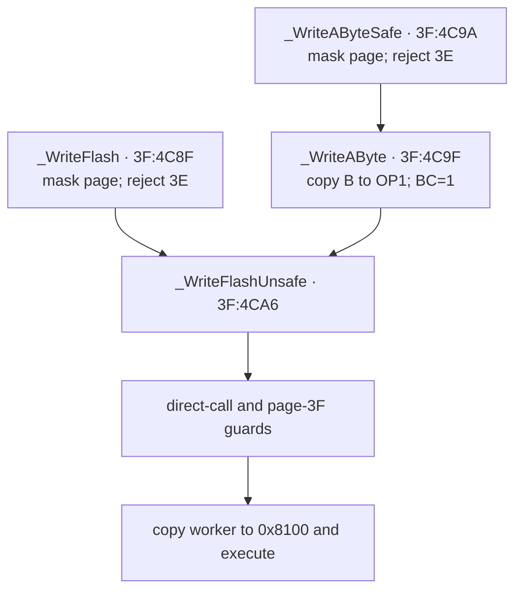

# Flash memory

*TI-84 Plus OS 2.55MP — Flash hardware, boot bcalls, and archive writes.*

The TI-84 Plus programs Flash through three distinct layers: ASIC access control, an AMD-compatible command state machine in the Flash chip, and boot-page bcalls that execute their write loops from RAM. This page separates those layers, reconstructs `_WriteFlash` and the erase APIs byte for byte, and follows a normal `Archive prgmA` operation into the hardware path.

## Evidence layers

The mechanisms below use several evidence sources. A claim marked [confirmed] comes from the local OS 2.55MP image or a complete TilEm execution trace. A claim marked [standard] comes from the named hardware source and agrees with the ROM. Emulator behavior is identified explicitly. It establishes what that emulator implements, not what the physical ASIC or Flash chip does.

| Layer | Main evidence | What it establishes |
|-------|---------------|---------------------|
| TI-OS and boot code | `tools/rom.bin`, especially `3D:61AF`–`3D:6BC4` and `3F:4784`–`3F:4E56` | bcall ABI, guards, RAM workers, archive allocation, and status handling [confirmed] |
| Dynamic execution | archive and `GCFLASH` TilEm traces plus guarded Wabbitemu runs | ROM worker paths, GC sector ordering, execution limits, and native command-state behavior [confirmed] for the pinned emulator runs |
| ASIC model | TilEm `x4_memory.c`, `x4_io.c`, and `x4_init.c` | protected-byte recognizer, port gates, execution limits, and modeled sector protection [standard] |
| Flash device | Datamath's March 2004 board photograph and Fujitsu `MBM29LV800TA` data sheet | observed package marking, sector geometry, command cycles, DQ status semantics, and rated limits [standard] |
| Emulator comparison | pinned TilEm, Wabbitemu, and MAME source | modeled command decode, mutation rules, status reads, timing, and missing ASIC gates [standard] |

## Physical organization

### Identified board part and compatible family

Datamath's photographed March 2004 TI-84 Plus board carries a Fujitsu package
marked `29LV800TA-70PFTN`. Fujitsu's orderable part number adds its `MBM`
prefix: `MBM29LV800TA-70PFTN`. This identifies the device on that photographed
board. It does not establish one vendor for every TI-84 Plus revision.
[standard]

Datamath's NOR component index also lists AMIC `A29L800A`, Fujitsu `29LV800`,
Spansion `S29AL008D`, and Macronix `MX29LV800` as compatible 1 MiB families.
Those entries establish a reported compatible family, not which part a
particular calculator contains. [standard]

The Fujitsu suffixes and rated limits decode as follows. These are data-sheet
limits rather than measurements of a calculator. [standard]

| Marking or field | Meaning |
|------------------|---------|
| `8M (1M × 8/512K × 16)` | 8 Mbit array, used here as one MiB of byte-addressable NOR Flash |
| `TA` | top-boot sector geometry |
| `-70` | 70 ns maximum read access |
| `PFTN` | 48-pin TSOP(I), normal-bend package |
| supply | 3.0 V-only read, program, and erase |
| program/erase endurance | minimum 100,000 cycles |
| byte program | 8 µs typical, 300 µs maximum |
| sector erase | 1 s typical, 10 s maximum |

The local ROM image and TilEm's TI-84 Plus model use 64 logical pages of
16 KiB. A logical Flash page is an ASIC paging unit, not an erase unit. Port
`0x06` maps one page into the Z80's `0x4000`–`0x7FFF` bank-A window. The Flash
device erases the larger physical sector containing the command address.
[confirmed] for the ROM page count; [standard] for the device organization.

### Data-sheet command and status interface

In byte mode, the Fujitsu device decodes unlock addresses `0xAAA` and `0x555`.
The command table defines the following operations. Address and data cycles
after a command prefix are shown separately. [standard]

| Operation | Byte-mode command cycles |
|-----------|--------------------------|
| Read/reset | `F0`, or `AA 55 F0` |
| Autoselect | `AA 55 90` |
| Byte program | `AA 55 A0`, then destination and data |
| Chip erase | `AA 55 80 AA 55 10` |
| Sector erase | `AA 55 80 AA 55 30` |
| Erase suspend | `B0` at any address during sector erase or its timeout window |
| Erase resume | `30` at any address while erase is suspended |
| Enter fast mode | `AA 55 20` |
| Fast program | `A0`, then destination and data; repeat in fast mode |
| Exit fast mode | `90`, then `F0` or `00` |

The data sheet defines no CFI query command for this part. A reset returns the
device to array-read mode, including after DQ5 reports an exceeded timing
limit. [standard]

The status outputs distinguish more states than the boot workers consume:
[standard]

| Bit | Fujitsu data-sheet behavior |
|-----|-----------------------------|
| DQ7 | complements programmed data bit 7 while program is active; reads 0 during erase and the array value after completion |
| DQ6 | toggles during program, erase, and the sector-erase timeout window |
| DQ5 | indicates exceeded program/erase timing; it can also follow an attempt to program a nonblank location without erasing |
| DQ3 | distinguishes the open sector-erase command window from the active erase algorithm |
| DQ2 | toggles for an erasing or erase-suspended sector and helps distinguish erase states from program states |

Erase suspend applies only to sector erase, including its 50 µs timeout
window. The device ignores it during chip erase and byte program. The data
sheet bounds suspend latency at 20 µs. DQ7 becomes one and DQ6 stops toggling;
DQ2 continues toggling when the suspended sector is read. Reads and programs
remain available in sectors that are not being erased. [standard]

Fujitsu autoselect returns manufacturer `0x04` and top-boot byte-mode device
`0xDA` at byte-mode offsets `XX00` and `XX02`. Offset `XX04` reports the
selected sector's protection state in DQ0. Wabbitemu and MAME instead return
manufacturer `0x01` with the same device code. Their values identify an
AMD-compatible emulator model, not the Fujitsu package in the Datamath
photograph. [standard]

### Retail ROM command coverage

The retail ROM's instruction-aligned direct stores to logical unlock addresses
`0x6AAA` and `0x5555` occur at 11 locations. They belong to three
length-prefixed command bodies. [confirmed]

| Command body | Direct unlock-address stores | Command use |
|--------------|-------------------------------|-------------|
| Page-`3D` program worker at `3D:730A` | `3D:7342`, `3D:734B`, `3D:7354` | `AA 55 A0`, then program data through `LDI` |
| Boot erase worker | `3F:4C48`, `3F:4C51`, `3F:4C5A`, `3F:4C63`, `3F:4C6C` | `AA 55 80 AA 55 30` |
| Boot program worker | `3F:4CFB`, `3F:4D04`, `3F:4D0D` | `AA 55 A0`, then program data through `LDI` |

No direct unlock-address candidate has a nearby command-valued `LD A,n` for
chip erase (`0x10`), fast-mode entry (`0x20`), autoselect (`0x90`), erase
suspend (`0xB0`), or CFI query (`0x98`). The worker bodies use byte program,
sector erase, and array reset. [confirmed]

`tools/flash_rom_commands.py` performs the structural match, and
`tools/analyze_flash_rom_commands.py` emits text or JSON. The scan deliberately
does not treat raw literals as commands. Linear disassembly can decode data as
instructions, indirect stores can hide a destination, and a standalone command
can target an address other than the two unlock addresses. The result therefore
establishes coverage of exact `LD (nn),A` candidates, not universal absence of
every dynamically constructed command. [confirmed]

### Sector geometry

The Fujitsu `MBM29LV800TA` data sheet defines the top-boot geometry below.
TilEm, Wabbitemu, and MAME use the same boundaries. [standard]

| Physical range | Size | Logical pages or page portion |
|----------------|-----:|-------------------------------|
| `0x000000`–`0x0EFFFF` | 15 × 64 KiB | pages `00`–`3B`, four pages per sector |
| `0x0F0000`–`0x0F7FFF` | 32 KiB | pages `3C`–`3D` |
| `0x0F8000`–`0x0F9FFF` | 8 KiB | `3E:4000`–`3E:5FFF` |
| `0x0FA000`–`0x0FBFFF` | 8 KiB | `3E:6000`–`3E:7FFF` |
| `0x0FC000`–`0x0FFFFF` | 16 KiB | page `3F` |

The two halves of logical page `3E` are separate 8 KiB sectors. This is why `_EraseCertificateSector` accepts logical address `0x4000` or `0x6000`. Page `3F` is one 16 KiB boot sector. A sector erase directed anywhere in an ordinary archive page erases all four 16 KiB pages in its 64 KiB sector. [confirmed] for the certificate API; [standard] for chip geometry.

## Three independent protection mechanisms

"Flash protection" can refer to three different controls. Treating them as one switch obscures several ROM checks.

### Flash command lock — port `0x14`

Port `0x14` controls whether writes reach the Flash command state machine. Writing `1` unlocks Flash command writes; writing `0` locks them. The write is accepted only after the ASIC observes this byte sequence fetched from a privileged Flash region: [standard]

```text
00 00 ED 56 F3 D3
```

The usual instruction spelling is:

```z80
nop
nop
im 1
di
out (0x14),a
```

The ASIC recognizes fetched bytes rather than the semantic instruction stream. WikiTI documents alternate instruction sequences that produce the same bytes. TilEm's TI-84 Plus model advances its recognizer only when the bytes come from physical `0xB0000`–`0xBFFFF` or `0xF0000`–`0xFFFFF`; other Flash or RAM reads reset the recognizer. It accepts the following port-`0x14` output only in recognizer state 7. [standard]

Unlocking port `0x14` does not program a byte. It allows subsequent memory writes to reach the Flash chip, where they must still form a valid AMD command sequence. [standard]

The public write and erase bcalls expect Flash to be unlocked by their caller. The archive record writer at `3D:64AA` performs the protected port-`0x14` sequence itself before calling those APIs. [confirmed]

### Physical sector protection

TilEm assigns protection group 1 to physical `0xB0000`–`0xBFFFF` and `0xFC000`–`0xFFFFF`. Port `0x21` bits 0–1 select the modeled override group while Flash is unlocked. A command can therefore pass the port-`0x14` lock and still be rejected for a protected physical sector. [standard]

The retail boot programs port `0x21 = 0` at `3F:41DC`. Its low field also
selects model-specific Flash page bounds, while bits 4–5 configure the RAM
execution mask. See [ASIC status, identity, protection, and GPIO](asic-status-gpio.md)
for the ROM uses, emulator equations, and public size tables. [confirmed] for
the boot write; [standard] for the modeled protection behavior.

This protection is separate from the safe bcall checks. For example, `_WriteAByte` permits starting page `3E` at the software layer, while the hardware still controls whether the affected sector is writable. [confirmed] for the bcall; [standard] for the ASIC model.

### Read and execution protection

The certificate page is read-censored while Flash is locked. WikiTI documents the model-selected page as `1E`, `3E`, or `7E`; TilEm returns `0xFF` for locked reads of page `3E` on its TI-84 Plus model. [standard]

Ports `0x22` and `0x23` define a forbidden Flash-execution interval. TilEm
includes both endpoints, while Wabbitemu allows the lower page. The retail boot
writes `0x08` and `0x29`. Ports `0x25` and `0x26` bound executable RAM in 1 KiB
units. Both emulators accept writes to these protected ports only while Flash
is unlocked. See [Execution protection](execution-protection.md) for the ROM
sequence, exact equations, guarded Flash and RAM execution runs, and unresolved
physical boundaries. [confirmed] for the boot values and pinned emulator runs;
[standard] for the source models.

These execution limits explain why the byte-poke loops run at `ramCode` (`0x8100`). They are distinct from the Flash chip's inability to provide ordinary array data while a program or erase operation is active. [confirmed] for the RAM workers; [standard] for the execution controls.

## Boot-page Flash API

The retail boot bcall table maps the Flash APIs below. The bcall ID is the word after `rst 28h`; the body address is where the resolved code executes. [confirmed]

| Bcall | ID | Body | Inputs | Result |
|-------|---:|------|--------|--------|
| `_WriteAByte` | `8021` | `3F:4C9F` | `A` page, `DE` destination, `B` byte | worker result or early guard result below |
| `_EraseFlash` | `8024` | `3F:4C2A` | `A` page, `HL` sector address | worker result or direct-call guard below |
| `_EraseCertificateSector` | `8060` | `3F:4E3F` | `HL=0x4000` or `0x6000` | preserves caller registers and flags; hides worker result |
| `_EraseFlashPage` | `8084` | `3F:4C1E` | `A` page | worker result or page guard below |
| `_WriteFlashUnsafe` | `8087` | `3F:4CA6` | `A` page, `DE` destination, `BC` length, `HL` RAM source | worker result or early guard result below |
| `_WriteAByteSafe` | `80C6` | `3F:4C9A` | `A` page, `DE` destination, `B` byte | worker result or early guard result below |
| `_WriteFlash` | `80C9` | `3F:4C8F` | `A` page, `DE` destination, `BC` length, `HL` RAM source | worker result or early guard result below |
| `_SetFlashLowerBound` | `80CF` | `3F:4784` | `A` value for port `0x23` | preserves `A`; leaves interrupts disabled |

WikiTI's ABI agrees with these register uses and says the block-write source must be RAM. The ROM adds exact page guards, call-site checks, return values, and boundary behavior described below. [standard] for the published ABI; [confirmed] for the additions.

## `_WriteFlash` entry paths

The four write entry points converge on the core at `3F:4CA6`. [confirmed]



### Safe and unsafe page guards

`_WriteFlash` masks `A` with `0x3F` and returns immediately for page `3E`. `_WriteAByteSafe` does the same before falling into `_WriteAByte`. The unsafe core masks the page again and returns for page `3F`. Safe writes therefore reject both pages `3E` and `3F`. [confirmed]

`_WriteAByte` enters the unsafe core without the page-`3E` test. It stores `B` in `OP1` at `0x8478`, replaces `HL` with that address, and sets `BC=1`. It permits page `3E` but still inherits the page-`3F` rejection. [confirmed]

The page guards return the result of an equality comparison. Rejected page
`3E` and page `3F` calls therefore return Z, the same condition as a successful
worker. Callers must obey the page contract; Z alone does not prove that a
write occurred. [confirmed]

### Direct-call-site check

Both `_WriteFlashUnsafe` and `_EraseFlash` inspect the immediate stacked return address:

```z80
ex (sp),hl
bit 7,h
ex (sp),hl
ret nz
```

The routine returns NZ when that address is at least `0x8000`. It does so
before masking `A`. A normal bcall passes because the bcall dispatcher
interposes a low-memory return frame; the archive trace reaches `3F:4CA6` with
the relevant return address at `0x2B41`. This is a direct-call-site check. It
does not prevent a RAM program from invoking the public bcall through
`rst 28h`. [confirmed]

### Zero-length write

After the guards, `_WriteFlashUnsafe` saves `AF`, tests `B|C`, and restores
`AF` when the length is zero. A zero-length call therefore returns the masked
page in `A` and the flags from the preceding `CP 0x3F`. An accepted page is not
equal to `0x3F`, so this no-op returns NZ. It never copies or executes the RAM
worker. [confirmed]

### Early-return trace

The read-only `entry-returns` fixture runs on the unmodified ROM. It verifies
the first eight bytes at `3F:4CA6`, never writes port `0x14`, and exercises
four paths that return before worker launch. `analyze_flash_trace.py` reports
zero CPU write attempts targeting mapped Flash. The captured bcall-visible
values are: [confirmed] for
TilEm execution of the ROM paths.

| Clock | Call and trigger | Return `AF` | Condition |
|------:|------------------|------------:|-----------|
| 186,993,567 | `_WriteFlash`, input page `0x7E` → masked page `3E` | `0x3E42` | Z |
| 186,995,033 | `_WriteFlashUnsafe`, input page `0x7F` → masked page `3F` | `0x3F42` | Z |
| 186,996,552 | `_WriteFlashUnsafe`, input page `0x7D`, `BC=0` | `0x3DBB` | NZ |
| 186,996,732 | direct `CALL 3F:4CA6` from RAM, input `A=0xA5` | `0xA591` | NZ |

The direct call reaches `3F:4CA6` and returns from `3F:4CAA`; it does not reach
the page mask at `3F:4CAB`. The zero-length call reaches `3F:4CB3`, branches to
`3F:4CC6`, restores the saved comparison result, and returns. [confirmed]

### Byte-entry return trace

`_WriteAByteSafe` checks page `3E` before entering `_WriteAByte`. A page-`3E`
rejection returns from `3F:4C9E` without changing `OP1`, `BC`, `DE`, or `HL`.
Page `3F` passes that first comparison. `_WriteAByte` then stores `B` at
`OP1` (`0x8478`), loads `HL=0x8478` and `BC=1`, and reaches the unsafe core.
The page-`3F` rejection at `3F:4CAF` therefore exposes those wrapper side
effects even though no worker runs. [confirmed]

A direct `CALL 3F:4C9F` from RAM also performs the byte-wrapper setup before
the unsafe core inspects the return address at `3F:4CA6`. It returns from
`3F:4CAA` with `OP1`, `BC`, and `HL` changed. [confirmed]

The read-only `byte-entry-returns` fixture verifies all 16 bytes from
`3F:4C9A` through `3F:4CA9` on the unmodified ROM. It restores the original
`OP1` byte before returning and never unlocks Flash. Its machine-code SHA-256
is `6851da991e031ea7df1a31ab3bf62816ad992e3d1946566d31b0a02e16dd50e1`.
The trace contains zero CPU write attempts targeting mapped Flash. [confirmed]
for the fixture and TilEm execution.

| Clock | Call and trigger | Return `AF` | `BC` | `DE` | `HL` | `OP1` |
|------:|------------------|------------:|-----:|-----:|-----:|------:|
| 187,804,393 | `_WriteAByteSafe`, page `0x7E` → `3E` | `0x3E42` | `0x2233` | `0x4455` | `0x6677` | `0x11` unchanged |
| 187,806,001 | `_WriteAByteSafe`, page `0x7F` → `3F` | `0x3F42` | `0x0001` | `0x6677` | `0x8478` | `0x44` from `B` |
| 187,807,587 | `_WriteAByte`, page `0x7F` → `3F` | `0x3F42` | `0x0001` | `0x7788` | `0x8478` | `0x55` from `B` |
| 187,807,892 | direct `CALL 3F:4C9F`, `A=0xA5` | `0xA591` | `0x0001` | `0x8899` | `0x8478` | `0x66` from `B` |

The two page guards still return Z. That condition describes the final
comparison, not whether `_WriteAByte` changed its scratch registers or launched
a worker. [confirmed]

## RAM-worker launcher

`3F:48C5` launches length-prefixed boot workers. `IX` points at a little-endian length word followed by worker bytes. The launcher copies that many bytes to `ramCode` at `0x8100`, restores the caller's `HL`, `DE`, and `BC`, and calls the copied code. [confirmed]

The interrupt wrapper at `3F:48EE` records IFF2 from `LD A,I` in `0x82A2`, disables interrupts, and returns to the launcher. After the worker returns, `3F:48E1` executes `EI` only if interrupts were enabled before entry. The worker therefore runs atomically while preserving the caller's prior interrupt-enabled state. [confirmed]

| Worker | Prefix | Source bytes | RAM destination |
|--------|-------:|--------------|-----------------|
| sector erase | `0x0052` at `3F:4C3B` | `3F:4C3D`–`3F:4C8E` | `0x8100`–`0x8151` |
| block program | `0x007C` at `3F:4CC8` | `3F:4CCA`–`3F:4D45` | `0x8100`–`0x817B` |

Page `3D` contains a relocated copy of the same launcher structure at
`3D:678C`. It runs the `_FlashToRam` descriptor at `3D:6761` and the internal
certificate-program descriptor at `3D:7308`. Its interrupt wrapper at
`3D:67B5` has the same IFF2-save, `DI`, conditional-`EI` behavior as the boot
launcher. The inferred name `ram_worker_launcher` therefore describes both
call paths. [confirmed]

## Block-program worker

The block worker repeats a four-write AMD byte-program sequence for each source byte. It temporarily maps fixed pages `02` and `01` so the command addresses appear in bank A, then restores the target page for the data write. [confirmed]

| Step | Mapped page | Logical write | Value |
|-----:|------------:|---------------|------:|
| 1 | `02` | `0x6AAA` | `0xAA` |
| 2 | `01` | `0x5555` | `0x55` |
| 3 | `02` | `0x6AAA` | `0xA0` |
| 4 | target | `DE` | byte from `(HL)` |

The device decodes the physical low 12 address bits. Page `02`, logical
`0x6AAA` is physical address `0xAAAA`; page `01`, logical `0x5555` is physical
`0x5555`. Their low 12 bits are the Fujitsu byte-mode unlock addresses `0xAAA`
and `0x555`. [confirmed] for the ROM addresses; [standard] for device decoding.

### Completion polling

After `LDI` writes a byte and advances `HL`, `DE`, and `BC`, the worker steps back to compare the programmed byte with the target read: [confirmed]

1. XOR source and target, then test bit 7. Equal DQ7 means the byte completed.
2. If DQ7 differs, restore that same target byte and test its DQ5 bit.
3. Clear DQ5 repeats the first target read.
4. Set DQ5 causes one final target read and DQ7 comparison.
5. A second DQ7 mismatch takes the failure path.

This is the algorithm in Fujitsu figure 22. During programming, DQ7 returns the
complement of the requested data bit until completion. DQ5 indicates an
exceeded timing limit. The data sheet requires the second DQ7 check because DQ7
and DQ5 may change simultaneously. [standard]

### Return state

On success, the worker writes reset command `0xF0` at the last target address,
forces port `0x06` to page `3F`, and returns `A=0`, Z. On failure,
`3F:4D3D`–`3F:4D45` writes `0xF0` at the failing target, loads `A=0x3F` for
the page-select output, executes `OR A`, and returns `A=0x3F`, NZ. [confirmed]

After full success, `HL` and `DE` point one byte beyond the completed span, and
`BC=0`. On failure, the branch occurs before `3F:4D2C` and `3F:4D2D` restore
the backed-up pointers. `HL` and `DE` therefore identify the failing source and
target bytes, while `BC` retains the decrement performed by `LDI`.
`_WriteAByte` destroys all three public ABI registers. [confirmed]

Forcing page `3F` is part of the worker ABI. The outer bcall dispatcher restores the page mapping required by its caller after the boot routine returns. A direct caller that passes the low-address check must account for this mapping change itself. [confirmed]

### Internal certificate-page programmer

`certificate_write_byte` at `3D:72E5` launches a second byte-program worker.
It sets `BC=1`, clears `(IY+0x25).1`, normalizes the target page for the current
calculator model, and passes descriptor `3D:7308` to `ram_worker_launcher`.
The descriptor contains 129 bytes at `3D:730A`–`3D:738A`. The boot block worker
contains 124 bytes at `3F:4CCA`–`3F:4D45`. [confirmed]

The only direct call to `certificate_write_byte` is `3D:4332`, inside
`certificate_copy_from_flash` at `3D:431A`. The loop obtains an ordinary Flash
page from `3D:5258`, stages one byte in OP1 with `_FlashToRam`, selects the
model-specific certificate page through `model_certificate_page` at `3D:738B`,
and programs the byte at the current certificate destination. Direct callers
at `3D:426A` and `3D:4715` reach this loop. [confirmed]

`certificate_copy_to_flash` at `3D:434B` performs the reverse transfer. Its
prologue at `3D:433F` obtains and erases the ordinary Flash destination page.
The loop stages a certificate byte in OP1 through `3D:42AC`, obtains the
ordinary destination page through `3D:5258`, and calls `_WriteFlashUnsafe =
8087h`. The direct callers at `3D:4127` and `3D:4707` pass destination address
`0x4000`. [confirmed]

Both loops belong to `certificate_rebuild_dispatch` at `3D:40F1`. The
dispatcher stores its mode byte at `0x9C20`, copies certificate data to an
ordinary Flash work area at `3D:4127`, rebuilds mode-dependent certificate
fields, erases a model-selected certificate half through `3D:4252`, and can
copy the work area back at `3D:426A`. This identifies the data directions and
the rebuild role. Direct calls and page-0 bjump calls identify an owner for
each mode. [confirmed]

The dispatcher operates on the last `0x216` bytes of either 8 KiB certificate
half. Its fixed offsets and lengths divide that tail into four contiguous
blocks: [confirmed]

| Half-relative offset | Length | Range |
|----------------------|--------|-------|
| `0x1DEA` | `0x66` | `0x1DEA`–`0x1E4F` |
| `0x1E50` | `0xC8` | `0x1E50`–`0x1F17` |
| `0x1F18` | `0xC8` | `0x1F18`–`0x1FDF` |
| `0x1FE0` | `0x20` | `0x1FE0`–`0x1FFF` |

Six helpers at `3D:5227`–`3D:5256` add fixed or model-selected offsets to
`_GetCertificateStart`'s result. Raw `CALL` scanning finds the complete direct
caller sets without relying on disassembler labels: [confirmed]

| Entry | Selected offset | Direct callers |
|-------|-----------------|----------------|
| `3D:5227` | `0x1DD3` | `3D:42D4`, `3D:7D7A` |
| `3D:522D` | `0x1FE0` | `3D:42B3`, `3D:4589`, `3D:4654`, `3D:47A8`, `3D:521D`, `3D:5448` |
| `3D:5233` | `0x1F18` | `3D:414B`, `3D:4288`, `3D:42EA`, `3D:42F2`, `3D:42FD`, `3D:4306`, `3D:47B1`, `3D:493D`, `3D:4CBD`, `3D:4F14`, `3D:5080`, `3D:5184`, `3D:51A8`, `3D:538F` |
| `3D:5241` | `0x1DEA` | `3D:4274`, `3D:4298`, `3D:42A3` |
| `3D:5247` | model-selected | `3D:490F`, `3D:5385`, `3D:548F`, `3D:5C0E` |
| `3D:5252` | `0x1FE0` | `3D:430E` |

The model-selected helper calls `00:1837`. That probe reads port `0x02`, masks
bit 7, and preserves the resulting flags while restoring `A` and `BC`.
`3D:5247` branches to the fixed `0x1F18` helper when the bit is clear and falls
through to `0x1E50` when it is set. The resolved TI-84 Plus traces read `0xE1`,
`0xE3`, or `0xE7`, so every observed TI-84 Plus state selects `0x1E50`.
[confirmed]

Wabbitemu independently returns a base value with bit 7 set for models at or
above its `TI_84P` enum and clear for its TI-83 Plus family. This supports the
family split implemented by the ROM but remains evidence about the emulator,
not a physical measurement. [standard]

Consequently `0x1E50`–`0x1F17` is the active App-trial table on TI-84 Plus.
When port-`0x02` bit 7 is clear, the same clear, write, query, and display paths
select the alternate table at `0x1F18`–`0x1FDF`. TI-84 Plus rebuild modes `0`
and `2` still stage or replace that alternate-model span together with validity
metadata, but no TI-84 Plus per-entry semantic accessor to that span has been
identified. Giving it another TI-84 Plus field name would exceed the evidence.
[confirmed] for selection and access; [hypothesis] for any further TI-84 Plus
meaning.

The helper calls in each dispatch branch identify which span receives
mode-specific replacement data. Other helpers clone retained spans from the
active half to the opposite half. Mode `4` also exports `0x1E50`–`0x1F17` to
`0x8000` and `0x1DD3`–`0x1DDF` to `0x80F0`. [confirmed]

| Mode | Branch | Mode-specific replacement span |
|------|--------|--------------------------------|
| `0` | `3D:423F` | `0x1F18`–`0x1FFF` (`0xE8` bytes) |
| `1` | `3D:41ED` | `0x1E50`–`0x1F17` (`0xC8` bytes) |
| `2` | `3D:41DF` | `0x1F18`–`0x1FFF` (`0xE8` bytes) |
| `3` | `3D:41FB` | `0x1DEA`–`0x1E4F` (`0x66` bytes) |
| `4` | `3D:4209` | `0x1DEA`–`0x1E4F` and `0x1FE0`–`0x1FFF` |
| `5` | `3D:421D` | `0x1FE0`–`0x1FFF` (`0x20` bytes) |
| `6` | `3D:422B` | complete `0x1DEA`–`0x1FFF` tail (`0x216` bytes) |

Neither copy loop nor the dispatcher writes port `0x14`. Five direct call
sites enter the dispatcher: [confirmed]

| Mode | Direct call | Byte-pinned gate context |
|------|-------------|--------------------------|
| `0` | `3D:66C7` | The full-reset path at `35:7205` reaches `3D:6673` through the page-0 trampoline at `00:2DC3`. `3D:6673` opens the gate at `3D:6680`; the tail at `3D:66CA` jumps to the shared relock routine. |
| `1` | `3D:5774` | The App-deletion path at `3D:4018` and invalid-App cleanup at `3D:5F71` call `3D:5759`. The first path opens at `3D:400A`; the second opens at `3D:5F28`. |
| `2` | `3D:437E` | The certificate receive path reaches `3D:4721`; Flash App receive preparation reaches `3D:5094`. Both inherit gate state. |
| `5` | `3D:51D7` | The enclosing path opens at `3D:70DA`; later exits relock at `3D:7194`, `3D:71AA`, or `3D:71E4`. |
| `6` | `3D:7D87` | `_RemoveAppRestrictions` at `3D:7C1B` opens at `3D:7C46`, calls the rebuild wrapper at `3D:7D82`, and relocks at `3D:7C8C`. |

Modes `3` and `4` enter through the page-0 bjump stub at `00:2B77`. The stub's
inline descriptor is `F1 40 7D`, which resolves to `3D:40F1`. Both callers
belong to `gc_recovery_preflight` at `3C:7219`, which opens the Flash gate at
`3C:7228`: [confirmed]

| Mode | Page-`3C` call | Call chain | Role |
|------|----------------|------------|------|
| `3` | `3C:7558` | `3C:7219 → 3C:724A → 3C:7544 → 3C:7558 → 00:2B77 → 3D:40F1` | Rewrite the `0x1DEA`–`0x1E4F` recovery metadata after an archive-sector operation in the recovery loop. |
| `4` | `3C:7313` | `3C:7219 → 3C:72A5 → 3C:7313 → 00:2B77 → 3D:40F1` | Initialize the certificate-backed recovery metadata before the loop. |

Mode `0` initializes the OS/App-validity tail during full reset. `3D:6673`
erases ordinary Flash page `8`, fills the `0xE8`-byte replacement buffer with
`0xFF`, and stores `0xFE` at `0x836D`. That RAM byte corresponds to
certificate offset `0x1FE0`. On models other than the TI-83 Plus, the routine
also stores `0x7F` in the next byte before invoking mode `0`. [confirmed]

Mode `1` clears a two-byte per-App trial entry when an App is removed. `3D:5759`
stages the model-selected table, converts the App page to a two-byte index,
writes `FF FF`, and invokes mode `1`. On TI-84 Plus that table is
`0x1E50`–`0x1F17`. The table's use as an App trial table is also ROM-confirmed.
The App receive path writes the same
two-byte entry at `3D:5BB7`. The App-information path at `36:70B5` calls the
reader at `3D:5466`, displays the ROM string `"Trials Remaining:"` at
`01:41AA`, and prints values derived from the two bytes. The direct mode-`1`
callers at `3D:4018` and `3D:5F71` belong to App deletion and invalid-App
cleanup. [confirmed]

One mode-`2` owner is the certificate receive path. The link header dispatcher
selects certificate type `0x25` at `3C:565D`. After `_FindFirstCertField`, a
field selector with `H=3` and `L & 0xF0 = 0x10` reaches the page-0 bjump stub
at `00:2BFB` from `3C:5714`. That stub targets `3D:4771`. Its certificate-half
rotation path calls `3D:46EE`, which invokes mode `2` at `3D:4721`. This pins
mode `2` to rebuilding `0x1F18`–`0x1FFF` for that certificate-field selector.
The other mode-`2` caller belongs to Flash App receive preparation. Header
type `0x24` enters at `3C:550D`. The per-page call at `3C:55BD` reaches
`3D:73BE` through the page-0 stub at `00:2D81`. `3D:73BE` checks the App page,
clears its App-validity bit when necessary, and reaches `3D:5019` through
`3D:5356`. That path stages `0x1F18`–`0x1FFF` and invokes mode `2` at
`3D:5094`. [confirmed]

These owners establish where mode `2` is used. They do not establish any
additional TI-84 Plus field meaning for the alternate-model App-trial span at
`0x1F18`–`0x1FDF`. [hypothesis] for such an additional meaning.

The mode-`4` path fills the model-selected journal buffer at `0x82A5` or
`0x8000`, initializes its phase bytes at `3C:72D1`–`3C:730D`, and invokes the
dispatcher. The recovery loop reaches mode `3` through `3C:7544`. That routine
selects an archive sector, calls `_EraseFlashPage = 8084h`, updates the RAM
journal fields at `3C:7568` and `3C:7576`, then persists the `0x66`-byte block.
[confirmed]

The main bcall table pins mode `6` to the App-restriction API: [confirmed]

| Bcall | ID | Page-`3D` entry |
|-------|----|-----------------|
| `_SetAppRestrictions` | `52F6h` | `3D:7B9B` |
| `_RemoveAppRestrictions` | `52F9h` | `3D:7C1B` |
| `_QueryAppRestrictions` | `52FCh` | `3D:7CBA` |

The restriction storage occupies certificate offsets `0x1DD2`–`0x1DDF`.
Offset `0x1DD2` is a control byte. The 13 bytes at `0x1DD3`–`0x1DDF` act as a
record or as an App-restriction bitmap, depending on the API operation. For an
App on Flash page $p$, the bitmap index is $p - 8$. `3D:7D69` divides that
index by eight, and the mask helper at `3D:785D` uses least-significant-bit-first
ordering. A clear bitmap bit means that the App is restricted. [confirmed]

The low control-byte bits have these ROM-confirmed roles:

| Bit | Mask | Clear-bit meaning | Evidence |
|-----|------|-------------------|----------|
| `0` | `0x01` | Base restriction control is active. | The type-`2` set and query paths at `3D:7C02` and `3D:7CD8`; aggregate type `3` is queried by `_ExecutePrgm` at `07:5758`, while equation/token paths query type `2`. |
| `1` | `0x02` | `logBASE` is disabled. | Type `6` selects mask `0x02` at `3D:7CE3`; the UI string at `37:4A42` and query at `37:4E43` name `logBASE`. |
| `2` | `0x04` | The summation token is disabled. | Type `7` selects mask `0x04` at `3D:7CDD`; the UI string at `37:4A54` and query at `37:4E52` name the summation token. |

The API dispatch gives each restriction type the following behavior:

| Type | Role | Set | Query | Remove |
|------|------|-----|-------|--------|
| `0` | App named in OP1 | Resolve the App page and clear its bitmap bit. | Test the resolved App's bitmap bit. | Unsupported. |
| `1` | 13-byte restriction record | Program `0x847A`–`0x8486` into `0x1DD3`–`0x1DDF`. | Report whether any record byte differs from `0xFF`. | Replace the record with `0xFF`. |
| `2` | Base restriction control | Clear control bit `0`. | Return `1` when bit `0` is clear. | Set control bit `0`. |
| `3` | Aggregate restriction profile | Clear bit `0` and program the record. | Derive an active-profile mask from the control and record bytes. | Set bits `0`–`4` and replace the record with `0xFF`. |
| `4` | Bulk App bitmap | Program the control byte and 13 bitmap bytes from `0x848E`–`0x849B`. | Count installed Apps whose bitmap bits are clear. | Unsupported. |
| `5` | App page in `B` | Unsupported. | Test the selected App's bitmap bit. | Unsupported. |
| `6` | `logBASE` restriction | Clear control bit `1`. | Return `4` when bit `1` is clear. | Set control bits `1` and `2`. |
| `7` | Summation restriction | Clear control bit `2`. | Return `8` when bit `2` is clear. | Unsupported. |

`_SetAppRestrictions` accepts types `0`–`4`, `6`, and `7`; it rejects type
`5`. `_RemoveAppRestrictions` accepts types `1`, `2`, `3`, and `6`. Removal
loads the 14-byte span into `0x8479` at `3D:7DCE`. The rebuild wrapper at
`3D:7D82` invokes mode `6` and writes the updated span back. Set paths clear
Flash bits with direct programming. Removal restores some cleared bits to one,
so it rebuilds the complete `0x216`-byte certificate tail. [confirmed]

Mode `5` sets a per-App validity bit. `locate_app_validity_bit` at `3D:51F6`
starts with `_GetCertificateStart + 0x1FE0`, divides the calculated App index
by eight at `3D:7D6B`, and retains the low three bits as the bit index.
`set_app_validity_bit` at `3D:51BE` advances past `0x1FE0` before reading, so
the bitmap starts at half-relative offset `0x1FE1`. The mask loop at `3D:785D`
uses least-significant-bit-first ordering. [confirmed]

The receive path from `_WriteToFlash` at `3D:6DA5` reaches the set routine at
`3D:70E1`. If the bit is clear, `stage_app_validity_byte` at `3D:51A6` updates
the `0x836D` tail buffer and calls mode `5` at `3D:51D7`. Setting a NOR Flash
bit from zero to one requires the erase-and-rebuild path. The inverse routine,
`clear_app_validity_bit` at `3D:51E4`, masks the bit to zero and reaches
`_WriteAByte = 8021h` through `3D:7CB3`; programming one to zero does not
require an erase. [confirmed]

The boot bcall table and page-`3F` bodies independently confirm the OS-validity
bit at offset `0x1FE0`: [confirmed]

| Bcall | ID | Body | Behavior |
|-------|----|------|----------|
| `_MarkOSInvalid` | `8093h` | `3F:5209` | Stage `0x1F18`–`0x1FFF`, set bit `0` in the staged `0x1FE0` byte at `0x836D`, and erase/rebuild the certificate data. |
| `_MarkOSValid` | `8099h` | `3F:51F5` | Read `0x1FE0`, clear bit `0`, and program the byte through `_WriteAByte = 8021h`. |
| `_CheckOSValidated` | `809Ch` | `3F:52C6` | Read `0x1FE0` and test bit `0`. |

Bit `0` clear means that the OS is valid; bit `0` set means that it is invalid.
WikiTI gives the same field label, but the conclusion above comes from the boot
ROM paths. WikiTI also labels `0x1DEA` as garbage-collection information. The
mode-`3` and mode-`4` call chains independently confirm that the
`0x1DEA`–`0x1E4F` block stores garbage-collection recovery metadata. The exact
meaning of every byte is not established: the first six fields and the live
sector-state array are decoded, while the two retained trailing bytes at
`0x1E4E`–`0x1E4F` have no direct semantic accessor. [confirmed] for block
ownership and access bounds; [hypothesis] for the trailing bytes' owner.

On the TI-84 Plus path, `3C:7E6B` loads the existing block and `3C:7317` writes
`0xFF` over only the first `0x64` bytes in RAM at `0x82A5`. Mode `4` later
rebuilds the full `0x66` bytes from that buffer, retaining offsets `+0x64` and
`+0x65`. The first six initialized bytes are fixed fields, leaving 94 bytes of
state-array capacity; the TI-84 Plus archive limit `0x2A` makes only slots
`0`–`8` live. [confirmed]

`tools/certificate_rebuild.py` exposes the signature-checked reconstruction as
a library. Its thin CLI reports the block partition, all seven branches,
direct and bjump invocations, resolved mode owners, OS/App-validity metadata,
and App-restriction behavior:

```sh
python tools/analyze_certificate_rebuild.py --json
```

`tools/gc_journal.py` decodes the `0x1DEA` recovery block, master phase
dispatch, and archive-sector state indexing. Its CLI can correlate the static
ROM paths with state-changing command writes in a TilEm trace. See
[Variables, archive & unarchive](sub-vat-archive.md#7d-certificate-sector-journal)
for the field and phase tables. [confirmed]

```sh
python tools/analyze_gc_journal.py --json
python tools/analyze_gc_journal.py --trace /tmp/tibasic-smoke/gcflash.trace
```

The reusable call analyzer can resolve a banked target back through its page-0
bjump stub and report candidate callers with linear-disassembly context:

```sh
nix develop -c python tools/analyze_rom_calls.py \
  3D:4771 --bjump-call --before 5 --after 5
```

The complete-ROM raw scan and linear disassembly independently find 90 `D3 14`
occurrences. All 90 use one of four privilege-sequence spellings: 70 load
`A=1`, and 20 clear `A`. Page `3D` contains 34 unlock forms and the shared lock
form at `3D:5CE6`. Page `3D` never writes port `0x21`. Its only resolved
port-`0x21` access is the read at `3D:7392` that selects a model-specific
certificate page. These paths do not change the modeled physical-sector
override. [confirmed] for the ROM scan; [standard] for the emulator-defined
override role.

`tools/flash_gate.py` exposes the raw scanner as a library. The thin CLI keeps
complete privileged sequences separate from unmatched `D3 14` candidates:

```sh
python tools/analyze_flash_gate.py --page 0x3D --json
```

The two program workers share the command writes, `LDI`, DQ7/DQ5 polling, and
reset write. A sequence comparison aligns 116 bytes. Five byte spans encode
the differences: [confirmed]

| Behavior | Page-`3D` certificate worker | Boot block worker |
|----------|------------------------------|-------------------|
| Prologue | saves target page at `0x9868`, then saves the current port-`0x06` value | masks the target page to six bits and maps it directly |
| Crossing sentinel | skips a page-select output when the next page is `0x7E` | skips it when the next page is `0x3E` |
| Success mapping | restores the saved port-`0x06` value | forces page `0x3F` |
| Failure mapping | restores the saved port-`0x06` value | forces page `0x3F` |
| Failure return | returns the restored page in `A`; Z if that page is zero | returns `A=0x3F`, NZ |

The page-`3D` caller ignores the worker flags after `3D:4332`. A DQ5 failure
therefore does not stop its byte-copy loop. Even a caller that inspects the
flags cannot treat Z as unconditional success: the failure tail writes `0xF0`
at the target, pops the saved port-`0x06` value into `A`, restores that page,
and executes `OR A`. A saved page zero produces Z on the failure path.
[confirmed]

The guarded `certificate-program-error` fixture copies the unmodified 129-byte
worker to `0x8100`, saves page zero, and requests `0x80` over stored `0x00` at
`3E:4000`. It runs only with the patched unlock wrapper and verifies the worker
head, worker tail, and target byte before programming. Its machine-code SHA-256
is `34fc6b71a0015cbcb13578a30ec195883a187ee43b234d6ab671d00275824429`.
[confirmed]

Pinned TilEm returns program-status values `0x00`, `0x60`, and `0x20`, then
executes the failure reset at `ram:817B`. The trace decoder labels the
invocation `certificate-failure`. The copied worker returns `AF=0x0044`, Z,
with `BC=0`, `DE=0x4000`, `HL=0x9E63`, and port `0x06` restored to zero. The
final target remains `0x00`. This dynamically confirms the worker tail in
TilEm; physical DQ5 behavior remains unmeasured. [confirmed] for the ROM and
TilEm trace; [hypothesis] for hardware.

`tools/flash_workers.py` extracts two-byte-length descriptors and compares
worker bytes. Its CLI reproduces the lengths, hashes, aligned-byte total, and
five edit spans:

```sh
python tools/describe_flash_workers.py --json
```

### Locked write can satisfy DQ7 under TilEm

The Flash APIs do not unlock the ASIC command gate. A caller can therefore
reach the unmodified worker while port `0x14` still blocks every command write.
The worker checks only DQ7 during the normal completion path. It does not
compare the remaining seven data bits after DQ7 agrees. [confirmed]

The read-only `locked-byte-noop` fixture verifies the 16-byte `_WriteAByte`
wrapper signature and the 16-byte protected lock-wrapper signature. It calls
the original lock wrapper at `3C:66D5`, then aborts unless port `0x02` bit 2 is
clear. The fixture uses the unmodified ROM and restores the original `OP1`
byte. Its machine-code SHA-256 is
`4a843bc617282b44c5a1dac1c6f08627c65c33175908198c908bddc8ba4b82ee`.
[confirmed] for the fixture construction.

The source byte at `3D:7FFF` is `0x50`. The fixture requests legal NOR
programming to `0x40`; both values have DQ7 clear. TilEm reports port `0x02`
as `0xE3` before the call, confirming that its Flash-unlocked bit is clear.
The trace records five CPU write attempts targeting mapped Flash: [confirmed]
for TilEm execution.

| Clock | Worker address | CPU write or read |
|------:|----------------|-------------------|
| 186,985,124 | `ram:8149` | attempt data `0x40` at `3D:7FFF` after `AA 55 A0` |
| 186,985,143 | `ram:814D` | read array byte `0x50`; requested and observed DQ7 agree |
| 186,985,240 | `ram:816B` | attempt array reset `0xF0` at `3D:7FFF` |

TLMT records CPU writes to the mapped Flash window, not whether the ASIC or
device accepted them. The command decoder consequently recognizes one
command-shaped byte-program sequence and one reset. The final array read is
the acceptance check: `3D:7FFF` remains `0x50`. Port `0x02` also remains
`0xE3`. [confirmed]

The bcall returns `AF=0x0044`, Z, with `BC=0`, `DE=0x8000`, `HL=0x8479`, and
`OP1=0x40`. The return state is indistinguishable from a completed one-byte
worker call unless the caller verifies array data. This confirms the caller's
unlock obligation in pinned TilEm and shows another path where Z does not prove
mutation. It does not establish how a physical ASIC handles the same attempt.
[confirmed] for the ROM and emulator trace; [hypothesis] for physical behavior.

### Cross-page destination behavior

The intended path uses a RAM source, so source `H` has bit 7 set. On that path the worker detects `DE > 0x7FFF`, increments the current target page, and resets `DE=0x4000` before the next byte. [confirmed]

The ordinary `Archive prgmA` trace groups its 17 byte-program commands into six worker invocations. The garbage-collection window groups 1,133 commands into 56 invocations, with a maximum length of 232 bytes. Every one is page-local, physically contiguous, and followed by a reset at its final target. These ordinary paths therefore exercise the worker but do not by themselves test its page-crossing branch. [confirmed]

A deliberate TilEm trace archives a generated 17,000-byte `prgmZBIGDATA` through **MEM** > **Mem Mgmt/Del** > **Prgm**. One `_WriteFlashUnsafe` invocation programs all 17,002 bytes of the variable data, from physical `0x20013` (`08:4013`) through `0x2427C` (`09:427C`). The decoder observes exactly one `08:7FFF` to `09:4000` crossing, no discontinuity, and the terminal `0xF0` reset at `09:427C`. At the crossing, `ram:811B` reads port `0x06` with `A=0x08` at clock 230,976,551; `ram:8122` outputs `A=0x09` at clock 230,976,580; and `ram:8124` has reset `DE` from `0x8000` to `0x4000` at clock 230,976,590. This confirms the ordinary `08` to `09` software path in emulation; it is not a physical-calculator Flash test. [confirmed]

The boundary code contains a page-`3E` quirk:

```z80
in a,(0x06)
inc a
cp 0x3e
jr z,skip_out
out (0x06),a
skip_out:
ld de,0x4000
```

A write that crosses from page `3D` computes page `3E` but skips the page-select output. It resets `DE` to `0x4000` and continues on the old mapping. This is not a clean stop at the certificate boundary. Starting `_WriteFlashUnsafe` on page `3E` can increment toward page `3F`; the hardware protection layer remains separate. [confirmed]

An emulator-only TilEm fixture exercises the page-`3D` boundary with `A=0x3D`,
`DE=0x7FFF`, `BC=2`, and RAM source bytes `0x40,0xE0`. It patches only the tail
of a protected page-`3C` unlock wrapper in a copy of the exact OS image. The
worker copied from `3F:4CCA` remains unchanged. The generated assembly program
checks all eight patched bytes and exits on an unmodified ROM before it can
unlock Flash. [confirmed] for the fixture construction.

The trace decodes two byte-program commands followed by one array reset:
[confirmed] for TilEm behavior.

| Clock | Command | Physical target | Value |
|------:|---------|-----------------|------:|
| 186,446,349 | byte program | `3D:7FFF` (`0xF7FFF`) | `0x40` |
| 186,446,829 | byte program | `3D:4000` (`0xF4000`) | `0xE0` |
| 186,447,016 | array reset | `3D:4000` (`0xF4000`) | `0xF0` |

At clock 186,446,607, `ram:811B` reads port `0x06` while the mapping is page
`3D`. `ram:811D` increments the value to `0x3E`; `ram:811E` compares it with
`0x3E`; and `ram:8120` takes the zero branch. The trace contains no execution
of the page-select output at `ram:8122`. At clock 186,446,640, `ram:8124` has
set `DE=0x4000` while page `3D` remains mapped. The trace decoder classifies
the physical `0xF7FFF` → `0xF4000` transition as `same-page-window-wrap`.
[confirmed]

This run confirms the static branch in TilEm. It does not test the physical
ASIC, the photographed Fujitsu device, or a production ROM without the
emulator-only unlock shim. The fixture and commands are documented under
“Guarded Flash-worker fixtures” in the repository's
`tools/dynamic-tracing.md`.

### Illegal byte-program failure under TilEm

A second guarded fixture calls `_WriteFlashUnsafe` with `A=0x3D`,
`DE=0x7FFF`, `BC=1`, and source byte `0xD0`. The source ROM holds `0x50` at
`3D:7FFF`, so bit 7 requests an illegal NOR `0→1` transition. The fixture uses
the same eight-byte unlock shim guard as the page-`3E` probe. Its machine-code
SHA-256 is
`d83208e1bbcc0f891b2bb73f7558cc521d55c37ce91c3ebdd88b5076e04c5076`.
[confirmed] for the fixture construction.

[TilEm `f56ad63`'s `emu/flash.c`](https://github.com/debrouxl/tilem/blob/f56ad637d0524ee841dd381be6ecbaf5b8975600/emu/flash.c)
applies `stored &= requested` and enters `FLASH_ERROR` when the stored byte
does not equal the request. Error reads complement the requested DQ7, set DQ5,
toggle DQ6, and leave the error state active until reset. The pinned file's
SHA-256 is
`280e0e45b6e1f1ef21d779abb809eaef2d04d08db09feb87a459e079280c9545`.
[standard]

The trace records this poll sequence: [confirmed] for TilEm behavior.

| Clock | Worker address | Observed result |
|------:|----------------|-----------------|
| 186,668,556 | `ram:8149` | program `0xD0` at `3D:7FFF` (`0xF7FFF`) |
| 186,668,575 | `ram:814D` | read `0x00`; DQ7 differs and DQ5 is clear |
| 186,668,646 | `ram:814D` | read `0x60`; DQ7 differs and DQ5 is set |
| 186,668,712 | `ram:8159` | final read `0x20`; DQ7 still differs |
| 186,668,738 | `ram:815D` | take the NZ branch to `ram:8173` |
| 186,668,753 | `ram:8175` | write array reset `0xF0` at `3D:7FFF` |
| 186,668,775 | `ram:817A` | `OR A` produces `AF=0x3F2C` |

The bcall returns to `ram:9DBE` with `AF=0x3F2C` at clock 186,668,984. The
fixture remaps page `3D`, rereads `3D:7FFF`, and observes the unchanged stored
byte `0x50` at clock 186,669,043. The trace decoder uses the reset-write PC to
label this invocation `worker_outcome: "failure"`. [confirmed]

This result confirms how the unmodified worker responds to TilEm's persistent
program-error state. It does not measure status timing, DQ bits, or failure
recovery on the photographed Fujitsu device or another physical calculator.

### Source-space branch and ROM callers

If source `H` has bit 7 clear, the worker sets `(IY+0x25).1` and skips
destination-crossing logic. An exhaustive raw-bcall scan of the retail ROM
finds 20 `_WriteFlashUnsafe` (`8087`) candidates and three `_WriteFlash`
(`80C9`) candidates. Static register reduction puts every source in RAM:
[confirmed]

| Page | Bcall sites and source `HL` |
|------|-----------------------------|
| `36` | `5E5C=82A5` |
| `3C` | `630E=8000`, `6AA0=82A5`, `6AF5=983A` |
| `3D` | `436C=8478`, `4670=9C9E`, `5050=82A5`, `5852=8000`, `58ED=8478`, `5926=8478`, `5CBA=83A5`, `6522=83F9`, `6578=8478`, `65BA=(83F3)`, `6A23=83FD`, `6A39=8402`, `6AA6=8000`, `6ACE=8000`, `718C=8000+offset`, `71E1=8479`, `7201=8000`, `7ABB=8479`, `7B72=983A` |

The page-`3C` site at `3C:6AF5` is `_WriteFlash` (`80C9h`). The
`flush_paged_flash_block` caller at `3C:6AB1` loads `HL=0x983A`, `B=0`, and
`C=(0x9834)` after opening the port-`0x14` gate. It accepts model-dependent
pages only after the classifier at `3C:6B79`; the TI-84 Plus range is
`0x08`–`0x29`. The link receiver reaches this staging path only when the
destination loaded at `3C:42AB` has bit 15 clear. RAM destinations take the
direct store at `3C:42D4`. The second mode-`3` owner is the USB
receive-to-memory loop at `36:40E7`. It fills `0x983A` through the page-35
endpoint helper at `35:4FA1`, which reads port `0xA1` at `35:500E`, then calls
the page-`3C` dispatcher at `36:415C`. [confirmed]

At `3D:65BA`, the source is `arcInfo.destPtr`. Setup at `07:6331` saves the
incoming data pointer from the variable lookup in that field. It is a RAM data
pointer on the RAM-to-Flash path; the Flash-to-RAM path later replaces it at
`07:622E` with the newly allocated RAM destination. The GC trace reaches this
bcall twice with `HL=9E53`; the normal archive trace reaches it once with
`HL=9E21`. The helper called before `3D:718C` returns either `8000` or
`8000+offset` within its caller's established range. The local helpers at
`3D:5258` and `3D:5964` preserve source `HL` for their dependent sites.
[confirmed]

The copied-worker entry provides an independent runtime check. Opcode `E6` at
`ram:8100`, with destination `DE<8000`, identifies block-program entries. The
GC trace contains 62: source `HL` is `8000` once, `83F9` twice, `83FD` once,
`8402` once, `8478` 55 times, and `9E53` twice. The normal archive trace
contains six: `83F9` once, `8478` four times, and `9E21` once. No observed
entry takes the `H<80` branch. [confirmed]

The alternate branch is not a general Flash-to-Flash copy path. The worker
selects the destination page through port `0x06` before it reads the source. A
source in the banked `4000`–`7FFF` window therefore aliases the destination
page rather than retaining an independent source page. A source in the fixed
`0000`–`3FFF` window can still be read. The guarded `low-source-cross` fixture
tests that case on an unmodified ROM. It locks Flash through the protected
wrapper at `3C:66D5`, confirms port `0x02` bit 2 is clear, and calls
`_WriteFlashUnsafe` with `A=0x3D`, `DE=0x7FFF`, `BC=2`, and `HL=0x0068`.
Source bytes `00:0068` and `00:0069` are `0x4D` and `0x50`. [confirmed]

| Clock | Copied-worker address | Resolved write attempt and state |
|------:|-----------------------|----------------------------------|
| 187,318,374 | `ram:8149` | first `LDI`: `0x4D` to locked Flash at `3D:7FFF`; `BC=1`, `DE=8000`, `HL=0069` |
| 187,318,708 | `ram:8149` | second `LDI`: `0x50` to RAM `8000`; `BC=0`, `DE=8001`, `HL=006A` |
| 187,318,824 | `ram:816B` | terminal `0xF0` reset write also resolves to RAM `8000` |

The bcall returns `AF=0x0044`, Z, with the final `BC`, `DE`, and `HL` values
shown above. The probe captures RAM `8000=F0`, `(IY+0x25).1` set,
`3D:7FFF=50`, and port `0x02=E3` before restoring its RAM and flag fixtures.
The Flash decoder sees one command-shaped byte-program attempt and no Flash
reset because the terminal reset resolves to RAM. The fixture ROM hash equals
the source ROM hash; the probe's machine-code SHA-256 is
`bb8159803d67bbfdc354d523db7dbe72e02bf4469a89c79d2c7d033dd660074e`.
[confirmed] for pinned TilEm and the unmodified ROM.

The branch remains unused by every statically identified ROM call and both
available OS write traces. Its intended external use, if any, remains unknown.
The dynamic result does not establish what a physical ASIC and Flash device do
with the locked command-shaped write attempt. [hypothesis] for a use outside
the documented RAM-source ABI and for physical consequences.

## Erase APIs and worker

`_EraseFlashPage` sets `HL=0x4000`, masks `A` to six bits, and rejects page
`3E`. Its equality comparison returns `A=0x3E`, Z on that no-op path. For page
`00` it changes `HL` to `0x0000`, because page 0 is fixed below the banked
window. It then falls into `_EraseFlash`. [confirmed]

`_EraseFlash` applies the same immediate-return-address check as
`_WriteFlashUnsafe`. A direct caller with a return address at or above
`0x8000` returns NZ before worker launch. A bcall proceeds to copy the erase
worker to `0x8100`. The routine does not reject page `3F`; the Flash chip's
sector protection is a later, independent gate. [confirmed]

### Erase-entry trace

The read-only `erase-entry-returns` fixture verifies eight bytes at each of
`3F:4C1E`, `3F:4C2A`, and `3F:4E3F`. It never writes port `0x14`, and every
test returns before worker launch. The trace contains zero resolved Flash
writes. [confirmed] for the fixture and TilEm execution.

| Clock | Call and trigger | Return `AF` | Condition |
|------:|------------------|------------:|-----------|
| 187,400,702 | `_EraseFlashPage`, input page `0x7E` → masked page `3E` | `0x3E42` | Z |
| 187,400,886 | direct `CALL 3F:4C2A` from RAM, input `A=0xA5` | `0xA591` | NZ |
| 187,402,383 | `_EraseCertificateSector`, `HL=0x5000`, seeded `AF=0xA545` | `0xA545` | caller value |

The page rejection returns at `3F:4C25`. The direct call returns at
`3F:4C2E`. The invalid certificate address branches from `3F:4E4E` to the
common `POP AF; RET` tail at `3F:4E55`–`3F:4E56`. [confirmed]

The erase worker issues the six-cycle AMD sector-erase command: [confirmed]

| Step | Mapped page or target | Address | Value |
|-----:|-----------------------|---------|------:|
| 1 | page `02` | `0x6AAA` | `0xAA` |
| 2 | page `01` | `0x5555` | `0x55` |
| 3 | page `02` | `0x6AAA` | `0x80` |
| 4 | page `02` | `0x6AAA` | `0xAA` |
| 5 | page `01` | `0x5555` | `0x55` |
| 6 | target page | `HL` | `0x30` |

It polls target DQ7 until it becomes 1. If DQ5 becomes 1 first, it takes the failure path. Success forces port `0x06` to page `3F` and returns `A=0`, Z. Failure loads `A=0xF0`, writes it through `DE`, executes `OR 1`, forces page `3F`, and returns `A=0xF1`, NZ. The write through `DE` is present in the copied worker even though `_EraseFlash` documents only `A` and `HL` as inputs. [confirmed]

### Failure-path `DE` audit

The RAM-worker launcher at `3F:48C5` saves the caller's `BC`, `DE`, and `HL`,
copies the worker, restores those registers, and only then calls `0x8100`.
It does not synthesize a reset pointer. The worker therefore receives whatever
`DE` the caller supplied. [confirmed]

The Fujitsu command table defines `0xF0` as a read/reset command accepted at any
Flash address. Writing it through a Flash pointer is consequently a valid way
to leave the status state and return to array reads. [standard] The ROM code
does not check that `DE` is such a pointer. If `DE >= 0x8000`, the same
instruction writes `0xF0` to RAM instead; the public `_EraseFlash` ABI does
not document `DE` as an input. [confirmed] for the conditional ROM behavior;
[hypothesis] for a physical test that deliberately reaches DQ5 with a RAM
pointer.

There is one raw `_EraseFlash` bcall sequence in the OS image, at `3D:45EA`.
The wrapper at `3D:45E7` first selects the model-specific certificate page,
then calls bcall `8024`. Four direct calls reach that wrapper on page `3D`:
[confirmed]

| Call | `DE` evidence at the erase |
|------|-----------------------------|
| `3D:40A3` | The helper at `3D:409F` and boot `_GetCertificateStart` preserve incoming `DE`. Its `3D:7A68` caller leaves `DE=0x1DE2`, a fixed-page Flash address. The `3D:71C3` path instead carries a metadata word returned by `3D:5B17`, not a pointer. |
| `3D:4252` | `_GetCertificateStart` at `3D:424D`, followed by `EX DE,HL`, puts the active certificate-half start in `DE`. |
| `3D:60EE` | The local branch toggles `HL` to the half being erased while preserving caller `DE`. Page-0 thunk `00:3EEB` reaches this routine from reset at `00:0D73` before any local `DE` initialization, and from two page-`37` call sites without an ABI constraint on `DE`. |
| `3D:6127` | The alternating scan starts with `HL=0x4001`, `DE=0x6001`; on exit `DE` still points into the other certificate half. |

The `3D:71C3` provenance is byte-specific. `3D:787B` calls `3D:5B17`, which
saves a scan-result word, fetches an OS-header subfield through
`_FindOSHeaderSubField`, reads its first byte, then forms returned `DE` from
that byte and the saved scan count. The caller requires returned `D` to be
nonzero, saves `DE` at `3D:7089`, and restores it at `3D:71B2` immediately
before the erase branch. `_GetCertificateStart` preserves `DE` with explicit
push/pop pairs at `3F:486E`–`3F:4884`. This path therefore transports archive
and OS-header metadata through the erase call; it does not establish a Flash
reset pointer. [confirmed]

The `3D:60EE` entry is similarly caller-controlled. Its page-0 thunk is a raw
`CALL 2B09; .dw 6098; .db 7D` descriptor at `00:3EEB`; masking the raw page
selects physical page `3D`. The reset caller initializes `HL`, `SP`, and `IY`
at `00:0D65`–`00:0D6F` but not `DE` before calling the thunk. The page-`3D`
body and its Flash-byte reader preserve that inherited value through the erase
at `3D:60EE`. [confirmed]

The GC trace supplies a counterexample to any broader internal convention. Its
seven entries at `3F:4C2A` carry `DE=0x802C`, `0x802C`, `0x802C`, `0x6000`,
`0x7DF1`, `0x4001`, and `0x4000`. The first three are RAM pointers. All seven
erases succeed, so none reaches `3F:4C83`; nevertheless, the launcher would
preserve the same `DE` values for the failure path. [confirmed]

Thus multiple certificate-wrapper paths intentionally or incidentally provide
a Flash address suitable for the reset command, but the ROM as a whole has no
such invariant and the convention does not extend the public ABI. The failure
path is best classified as an underspecified interface with a conditionally
unsafe RAM write. [confirmed]

The `0x30` command erases a physical sector, not one logical page. `_EraseFlashPage` is therefore named for the page used to select a sector, not for 16 KiB erase granularity. [standard]

### Certificate sectors

`_EraseCertificateSector` preserves `AF` around its work. It accepts only
`H=0x40` or `H=0x60`; other values return without erasing. For either accepted
address, it loads `A=0x3E`, calls `_EraseFlash`, restores the caller's `AF`,
and returns. The restored flags hide both the Z success and NZ failure result
from `_EraseFlash`. The two values select the two 8 KiB sectors within
physical page `3E`. [confirmed]

### Successful certificate erase under TilEm

The guarded `certificate-erase-success` fixture runs only on the patched ROM
copy. It unlocks Flash, seeds `AF=0xA545`, and calls
`_EraseCertificateSector` with `HL=0x4000`. The source image contains `0x00`
at physical `0xF8000`, so the post-erase read distinguishes mutation from an
already erased byte. The fixture machine-code SHA-256 is
`e46ffebe8dbeb6a37ea62790744e8d758dc4772b08046b058ed4a0f351dee97e`.
[confirmed] for the fixture construction.

The trace resolves all six command writes and decodes one sector erase at
`3E:4000` (`0xF8000`) at clock 186,869,906. The selected physical sector is
`0xF8000`–`0xF9FFF`, matching the first 8 KiB certificate half. [confirmed]
for TilEm execution of the ROM command path.

The worker reads the target at `ram:8138` 24,497 times. Grouping the observed
`A` values separates TilEm's two modeled erase phases: [confirmed] for the
trace values; [standard] for the pinned TilEm state names.

| TilEm state | Target-read value | Count |
|-------------|------------------:|------:|
| `FLASH_BUSY_ERASE_WAIT` | `0x00` | 3 |
| `FLASH_BUSY_ERASE_WAIT` | `0x44` | 3 |
| `FLASH_BUSY_ERASE` | `0x08` | 12,245 |
| `FLASH_BUSY_ERASE` | `0x4C` | 12,245 |
| array data after completion | `0xFF` | 1 |

The first reads occur at clocks 186,869,913 (`0x00`) and 186,869,962
(`0x44`). Active-erase values begin at clock 186,870,207. The final `0xFF`
read occurs at clock 188,070,217. `ram:8143` then takes the success path at
clock 188,070,241, and the worker returns `A=0`, Z at `ram:8151`. [confirmed]

`3F:4E55` restores `AF=0xA545` at clock 188,070,415. The bcall-visible result
at `ram:9DBA` remains `0xA545`, and the fixture rereads `3E:4000` as `0xFF` at
clock 188,070,584. This dynamically confirms that the certificate wrapper
hides the successful worker result. It does not establish physical erase
duration, status cadence, or wrapper behavior on another OS image.

The garbage collector uses those halves as a transactional certificate and phase-journal pair. It
erases the inactive half, copies the used tail of the active half, switches the active marker, and
later copies the tail back. This behavior is visible as separate erases at physical `0xF8000` and
`0xFA000`; it does not treat page `3E` as one 16 KiB erase unit. [confirmed]

### Erase-busy read scope under TilEm

The guarded `erase-busy-range` fixture issues the sector-erase command directly
for `3E:4000` (`0xF8000`). It waits for DQ3 before sampling the selected sector,
nearby top-boot sectors, and a distant archive page. The fixture then waits for
DQ7 and reads the same locations in array mode. Its machine-code SHA-256 is
`561c424816f0dd4dbe76cba7635d2edabb433a234860e63c1c8767dab8254781`.
[confirmed] for the fixture construction.

The trace decodes one sector erase at clock 187,143,123. TilEm returns its
alternating active-erase values at all six sampled addresses: [confirmed] for
TilEm execution.

| Sample | Relation to selected sector | Busy value and clock | Array value and clock |
|--------|-----------------------------|---------------------:|----------------------:|
| `3E:4000` (`0xF8000`) | selected start | `0x08` at 187,143,475 | `0xFF` at 188,343,472 |
| `3E:5FFF` (`0xF9FFF`) | selected end | `0x4C` at 187,143,502 | `0xFF` at 188,343,499 |
| `3E:6000` (`0xFA000`) | adjacent 8 KiB sector | `0x08` at 187,143,529 | `0xFF` at 188,343,526 |
| `3D:7FFF` (`0xF7FFF`) | preceding 32 KiB sector | `0x4C` at 187,143,574 | `0x50` at 188,343,571 |
| `3F:4000` (`0xFC000`) | boot sector | `0x08` at 187,143,619 | `0x3E` at 188,343,616 |
| `08:4000` (`0x20000`) | distant 64 KiB sector | `0x4C` at 187,143,664 | `0xFF` at 188,343,661 |

Only physical `0xF8000`–`0xF9FFF` is erased. The final values at the adjacent,
preceding, boot, and distant samples match the source ROM. [confirmed]

Pinned TilEm handles `FLASH_BUSY_ERASE` before applying an address-dependent
read result. It warns when the read and erase-command addresses have different
upper 16 physical-address bits, but returns erase status after either outcome.
The run emits one `reading from Flash while erasing` warning for `0x20000`.
The other five addresses share upper byte `0x0F` with the erase target, so the
warning check does not distinguish their physical sectors. [standard] for the
pinned source; [confirmed] for the trace and warning.

The Fujitsu data sheet gives different address scopes to the status bits. DQ6
toggles on successive reads from any address, while DQ2 toggles only when read
from an erasing sector. It also requires DQ7 erase polling within a selected
sector. TilEm's global `0x08`/`0x4C` alternation therefore models DQ2 outside
the selected sector more broadly than the data sheet specifies. [standard]
Physical TI-84 Plus behavior at these boundaries remains unmeasured.

## `_SetFlashLowerBound`

The official name is misleading on the TI-84 Plus: `_SetFlashLowerBound` writes port `0x23`, which is the upper end of the modeled forbidden Flash-execution interval. Its complete body is: [confirmed]

```z80
3F:4784  nop
3F:4785  nop
3F:4786  im 1
3F:4788  di
3F:4789  out (0x23),a
3F:478B  di
3F:478C  ret
```

The leading bytes form the protected-port sequence. Flash must already be unlocked for port `0x23` to accept the write. The routine leaves interrupts disabled and preserves the value in `A`. See [Execution protection](execution-protection.md#_setflashlowerbound) for the cross-emulator boundary comparison. [confirmed] for the routine; [standard] for the write gate.

## Archive allocation above the hardware API

The archive manager and the raw Flash API solve different problems. The boot bcalls program an address supplied by their caller. Page-3D code chooses an archive record location, maintains record states, and invokes the boot API. [confirmed]

### Dynamic archive boundary

The archive pool begins at page `08`. Its upper boundary is computed around installed Flash Apps; it is not the fixed range `0x15`–`0x1E`. [confirmed]

`3D:6413` starts at a model-selected top App page returned by `3D:726E`: [confirmed]

| Model branch | Top App page |
|--------------|-------------:|
| port `0x02` bit 7 clear | `0x15` |
| port `0x21 & 3` equals zero | `0x29` |
| remaining branch | `0x69` |

At each candidate it reads the first byte at logical `0x4000`. A possible App header (`0x80` or `0x00`) is validated through the page-3C helper reached at `ram:3DC5`; `_FindAppNumPages` at `3D:4AA3` then returns the App span in `C`. The routine subtracts that span and repeats. It returns the first page below the installed App run in `B`. [confirmed]

`3D:62C2` stores that value as an exclusive upper bound, loads `A=0x08`, and scans archive records upward from `08:4000`. Its page comparisons stop at or above the dynamic bound. With no installed Apps in the local image, the trace returns `B=0x29` and selects `A=0x08`, `HL=0x4000` for the new record. [confirmed]

The nearby selector at `3D:738B` returns `0x1E`, `0x3E`, or `0x7E`. Those are model-specific certificate pages. They do not define the archive pool's upper endpoint. [confirmed]

### Record writer

`3D:64AA` is the archive record writer. It unlocks Flash, checks or retires the previous record marker, writes `0xFE`, programs the size, symbol header, name, and data, then changes the record status to `0xFC`. It calls `_WriteAByte` for marker bytes and `_WriteFlashUnsafe` for blocks. [confirmed]

The checks at `3D:6B6D` and `3D:6B9B` reject pages below `08`, reject pages at or above the dynamic App boundary, and require the Flash destination to be at least `0x4000`. The block form at `3D:6B6D` also requires its RAM-side address to be at least `0x4000`. [confirmed]

Record state changes only clear bits, matching NOR programming rules: `0xFF` is erased, `0xFE` is in progress, `0xFC` is complete, and `0xF0` is retired. Sector erase is the only operation that restores zero bits to one. See [Variables, archive & unarchive](sub-vat-archive.md) for the record layout and garbage collector. [confirmed]

## End-to-end archive trace

`tools/macros/archive-program.macro` cold-boots the calculator, creates `prgmA`, inserts one token, and executes `Archive prgmA`. The final screen is `Archive prgmA` followed by `Done`. The trace contains 4,015,092 instructions, 19,876 mapping writes, and no unresolved mappings. [confirmed]

The executed write path is: [confirmed]

```text
07:6107  archive RAM-to-Flash path
  → 3D:61AF
  → 3D:62C2  free-record scan; selects 08:4000
  → 3D:64AA  archive record writer
      → 3F:4C9F  _WriteAByte, three calls
      → 3F:4CA6  _WriteFlashUnsafe, six calls total
          → 0x8100  copied byte-program worker
```

The calls write an initial `0xF0` marker when needed, `0xFE`, a two-byte size field, an eight-byte header, a four-byte payload, and final status `0xFC`. Every boot-worker call follows the successful DQ7 path and returns `A=0`. [confirmed]

The trace also resolves the archive-range ambiguity directly. `3D:6413` returns `B=0x29`; `3D:62C2` explicitly starts at page `08`; and the programmed physical target is page `08`. [confirmed]

The generated large-program trace uses the same record path and demonstrates that the data block is not split at a 16 KiB page boundary: its 17,002-byte worker invocation crosses contiguously from page `08` to page `09`. The fixture builder, UI macro, decoder, and exact worker-point query are documented under “Cross-page Flash-programming fixture” in the repository's `tools/dynamic-tracing.md`. [confirmed]

## End-to-end garbage-collection trace

The generated `GCFLASH` program archives real variables `A` and `B`, unarchives `A`, and runs
`GarbageCollect`. The macro selects **2:Yes** at the confirmation prompt. Dynamic coverage reaches
`gc_command` at `3C:71F8`, `archive_gc_collect` at `3C:7733`, and the boot erase body at
`3F:4C2A`. [confirmed]

The decoded GC window contains 4,630 Flash writes. They form 1,133 AMD byte-program commands,
seven sector erases, 56 array-reset writes, and no unmatched command writes. The physical erases
occur in this order: [confirmed]

| Target | Physical sector |
|--------|-----------------|
| `3E:6000` | `0xFA000`–`0xFBFFF` |
| `0C:4000` | `0x30000`–`0x3FFFF` |
| `3E:6000` | `0xFA000`–`0xFBFFF` |
| `3E:4000` | `0xF8000`–`0xF9FFF` |
| `08:4000` | `0x20000`–`0x2FFFF` |
| `3E:4000` | `0xF8000`–`0xF9FFF` |
| `3E:6000` | `0xFA000`–`0xFBFFF` |

The page-`0C` erase and page-`08` erase each cover four logical pages. The page-`3E` erases cover
one 8 KiB half each. The command sequence therefore directly confirms that the collector follows
the physical top-boot geometry rather than issuing one erase per 16 KiB paging unit. [confirmed]

The collector uses page `0C` as the destination for the surviving `B` record, retires the old
record at `08:4016`, erases the old page-`08` sector, and marks page `08` as the next empty scratch
sector. It copies the used certificate tail between the two page-`3E` halves while persistent
phase bytes advance. [confirmed] See [Variables, archive & unarchive](sub-vat-archive.md#7-flash-garbage-collector-confirmed)
for the record bytes, sector-header states, journal fields, and recovery dispatcher.

`tools/hardware_trace.py` exposes reusable resolved-instruction and resolved-memory-write
iterators. `tools/flash_trace.py` decodes AMD commands and groups adjacent program runs. Their
focused CLIs reproduce the phase timeline without parsing the binary trace in a one-off script:
[confirmed]

```sh
python tools/analyze_flash_trace.py \
  /tmp/tibasic-smoke/gcflash.trace \
  --clock 321347460-344829074 \
  --timeline

python tools/analyze_trace_points.py \
  /tmp/tibasic-smoke/gcflash.trace \
  --point page_3C:7733 \
  --point page_3C:7cfb
```

The same decoded command stream can be replayed into immutable Flash images at
active journal phases. Cold TilEm boots now exercise all six phase-dispatch
branches. The `0xFF`, `0xFE`, `0xFC`, `0xF8`, and `0xE0` replays converge
byte-for-byte with uninterrupted execution. The `0xF0` replay has identical
archive bytes but completes certificate cleanup one boot earlier; cold-booting
the uninterrupted result once produces the same stable image. See
[Variables, archive & unarchive](sub-vat-archive.md#7e-tilem-restart-at-six-journal-boundaries)
for the input and trace hashes, command counts, controlled-topology boundary,
and deferred-cleanup result. [confirmed] for TilEm.

Pinned Wabbitemu cold boots independently execute the same six dispatcher
branches. Complete output images equal the corresponding TilEm recovery
results. The record-authentic `0xF0` input is reconstructed from eight
deterministic program records before the unmodified OS materializes its journal
phase. See [Variables, archive & unarchive](sub-vat-archive.md#7f-wabbitemu-restart-at-six-journal-boundaries)
for input hashes, dispatcher visits, and changed-byte counts. [confirmed] for
the emulator command-boundary runs.

### Reproduce the trace

Use the repository's Nix environment when `z80dasm` or another analysis utility is not installed globally. The trace itself is large, so it is generated outside the repository. [confirmed]

```sh
TILEM=~/Git/tilem-headless/result/bin/tilem2

$TILEM --headless --rom tools/rom.bin --model ti84p --normal-speed --reset \
  --macro tools/macros/archive-program.macro \
  --trace /tmp/tilem-archive-program-success.trace --trace-range all

tools/tilem_trace_resolve.py /tmp/tilem-archive-program-success.trace \
  --initial-mapping ti84p-reset --coverage --sort addr \
  --names tools/names.txt

nix develop -c z80dasm -a -t -g 0x4000 \
  /tmp/ti84-page3f.bin
```

See `tools/dynamic-tracing.md` for page-resolution details and trace-format caveats.

## Emulator comparison

The three inspected emulators agree on the command bytes and top-boot sector
boundaries used by the ROM. They differ at the points most useful for negative
tests: illegal bit transitions, completion timing, status reads, and ASIC
access control. [standard]

| Behavior | TilEm `f56ad63` | Wabbitemu `48c2dc0` | MAME 0.287 |
|----------|-----------------|------------------------|------------|
| Unlock addresses | low 12 bits `0xAAA`, `0x555` | low 12 bits `0xAAA`, `0x555` | accepts several AMD address conventions, including the ROM's low-12-bit form |
| Byte mutation | `old &= requested` | `old &= requested` | `old = requested` |
| Successful program | 7-cycle modeled busy state | immediate array data | immediate array data |
| Illegal `0→1` request | error state | one transient error read | writes the requested one bit |
| Sector erase | 200,000-cycle model | immediate | immediate data mutation followed by a timer |
| Autoselect | incomplete | modeled AMD manufacturer `0x01`, device `0xDA` | IDs at offsets `0`/`1`; no compatible protection read |
| Chip erase | writable sectors only; final status follows the last sector | immediate full-array fill, including boot | immediate full-array fill; stale/default busy range |
| Fast program | command flow present; fidelity unresolved | implemented for TI-84 Plus Flash version 3 | entry accepted, but `A0` excludes the AMD maker ID |
| Erase suspend/resume | absent | absent | absent |
| CFI query | absent | absent | absent for `AMD_29F800T` |
| Sector-protection autoselect read | unavailable with missing autoselect | offset `4` always returns zero | no data-sheet-compatible protection read |
| ASIC write gate | protected-byte sequence, lock, and sector groups | privileged-page port-`0x14` gate and boot-page flags | no effective Flash-write gate |

These are source-level results. MAME marks the complete TI-84 Plus driver
`MACHINE_NOT_WORKING`. None of the divergences resolves physical behavior.
[standard]

The emulator autoselect rows differ from the photographed Fujitsu part's data
sheet, which specifies `0x04/0xDA`. Matching device code `0xDA` establishes a
compatible top-boot command family; manufacturer `0x01` does not identify the
photographed package. [standard]

### TilEm behavior and limits

TilEm implements the same command progression used by the ROM: `AA`, `55`, then `A0` for program, or `80`, `AA`, `55`, `30` for sector erase. It matches command addresses by physical low 12 bits `0xAAA` and `0x555`. [standard]

Its program operation computes `stored_byte &= requested_byte`. A requested `0→1` transition leaves the zero bit unchanged and enters the emulator's error state. During program busy, DQ7 is complemented and DQ6 toggles; the modeled delay is seven cycles when delay emulation is enabled. [standard]

During erase, DQ6 and DQ2 toggle. DQ3 distinguishes the 50-cycle erase-command window from the modeled 200,000-cycle erase operation. The ROM's erase worker polls DQ7 and DQ5 rather than those toggle bits. [standard]

TilEm's source comment lists fast program among unfinished work, but the state
machine implements part of it. `AA 55 20` enters fast mode, `A0` selects one
program operation, and the next write calls the ordinary byte-program helper.
The state then returns to fast mode. `90`, followed by `F0`, exits. This is an
implemented command flow with unresolved hardware fidelity. Autoselect logs
that it is unimplemented; erase suspend and CFI have no states. [standard]

TilEm's chip-erase path iterates over the sector table and calls erase only for
sectors accepted by its protection model. On a TI-84 Plus with default override
group zero, this skips physical `0xB0000`–`0xBFFFF` and
`0xFC000`–`0xFFFFF`. Override group one admits those sectors. Each sector erase
resets the recorded program address and timer, so the final busy status
describes only the last writable sector. This differs from a single physical
chip-erase operation. [standard]

### Wabbitemu behavior and limits

Wabbitemu recognizes byte program, sector erase, chip erase, autoselect, and
fast-program commands. It applies program data with `stored &= requested`.
Successful programming returns to array mode immediately. [standard]

An illegal `0→1` request sets an error flag. The next read returns complemented
DQ7, set DQ5, and its current DQ6 toggle bit. That same read clears the error
flag, so later reads return array data. This one-read lifetime is Wabbitemu
behavior, not the hardware data-sheet polling contract. The ROM worker tests
DQ7 and DQ5 in that same first byte. [standard] for Wabbitemu source;
[confirmed] for the ROM worker.

A guarded native run exercises seven byte pairs through Wabbitemu's
`CPU_mem_write` and `CPU_mem_read` entry points. Each case issues `AA 55 A0`,
programs page `08` offset `0x0100`, and reads the target twice. The harness
unlocks the in-memory ASIC gate directly and replaces the target's initial byte
before the command. It does not execute the retail ROM worker. [confirmed] for
the pinned Wabbitemu run.

| Initial | Requested | Initial DQ6 | Stored | First read | Second read |
|--------:|----------:|------------:|-------:|-----------:|------------:|
| `FF` | `50` | `00` | `50` | `50` | `50` |
| `50` | `40` | `00` | `40` | `40` | `40` |
| `80` | `00` | `00` | `00` | `00` | `00` |
| `50` | `D0` | `00` | `50` | `20` | `50` |
| `50` | `D0` | `40` | `50` | `60` | `50` |
| `00` | `80` | `00` | `00` | `20` | `00` |
| `00` | `01` | `00` | `00` | `A0` | `00` |

The first three requests are legal and expose array data immediately. The four
illegal requests set the error flag after programming `initial & requested`.
Their first read clears that flag and flips DQ6. Their second read exposes the
stored byte. All seven cases return to `FLASH_READ`; the initialized adapter
adds zero T-states for these accesses, so this run provides no timing evidence.
[confirmed] for the pinned Wabbitemu run.

The native binary SHA-256 is
`67077107b604e97cfb751cadf4392dca53d00d5bbc417b2f48c422eebb9ac560`.
It uses pinned commit `48c2dc0e6d1d87bb5cf9611efbeb0d048b19c422` and the exact
OS 2.55MP image. The guarded CLI checks every native field against the
fixed launch expectations and the independent Python source model before
writing its manifest.

The pinned Wabbitemu source and the ROM worker produce three paths. The first
ROM read consumes Wabbitemu's error status. The worker tests both DQ7 and DQ5
in that byte. Since Wabbitemu sets DQ5, every illegal request proceeds directly
to one final array read. This table models emulator source combined with the
byte-confirmed ROM poll logic. It does not describe physical Flash behavior.
[standard] for Wabbitemu; [confirmed] for the ROM poll logic.

| Program request | Final stored DQ7 | ROM result |
|-----------------|------------------|------------|
| legal | matches requested DQ7 | succeeds on the first array read |
| illegal `0→1` outside DQ7 | matches requested DQ7 | succeeds after the final read even though lower requested bits remain zero |
| illegal DQ7 `0→1` | differs from requested DQ7 | fails after the final read |

Exhaustive enumeration of all 65,536 old/requested byte pairs gives 49,152
successes and 16,384 failures. No pair is nonterminating under this composition.
The successes contain 6,561 legal pairs and 42,591 illegal requests that the
ROM reports as successful. These exhaustive counts are deterministic
consequences of the pinned source model, not an exhaustive Wabbitemu run or
hardware observation. [standard]

A second guarded mode boots the exact retail ROM, injects a four-byte
`rst 28h`/`8087h` harness into RAM page 1, and sets the documented
`_WriteFlashUnsafe` ABI registers. The bcall copies the original 124-byte
worker from `3F:4CCA` to `0x8100` and executes it. The harness directly opens
Wabbitemu's in-memory ASIC gate, so it does not test the protected port-`0x14`
unlock sequence or an OS/UI caller. [confirmed] for the pinned native run.

| Initial | Requested | Initial DQ6 | Worker reads | Stored | Result | `AF` |
|--------:|----------:|------------:|--------------|-------:|--------|-----:|
| `FF` | `50` | `00` | `50` | `50` | success | `0044` |
| `00` | `01` | `00` | `A0`, `00` | `00` | success | `0044` |
| `20` | `A0` | `00` | `20`, `20` | `20` | failure | `3F2C` |
| `50` | `D0` | `00` | `20`, `50` | `50` | failure | `3F2C` |
| `50` | `D0` | `40` | `60`, `50` | `50` | failure | `3F2C` |

All five cases enter the copied worker once and issue one program write. The
legal request takes the success reset at `ram:816B`. The illegal lower-bit
request also takes that path after its final DQ7 read, despite leaving bit 0
clear. Both illegal DQ7 requests take the failure reset at `ram:8175`,
regardless of stored DQ5. DQ6 changes the first status byte but not the return
path. [confirmed] for the pinned native run.

The cold-recovery runner exercises a separate retail path without opening the
gate through emulator state. Startup at `00:0D73` calls the bjump stub at
`00:3EEB`, which resolves to `3D:6098`. The bytes at `3D:609C`–`3D:60A8`
write `1` to port `0x14`; Wabbitemu changes `flash_locked` from true to false
at the `OUT` at `3D:60A6`. The wrapper calls `00:2BAD` at `3D:6101` to enter
`gc_check_interrupted` at `3C:7BC7`. Its return path jumps to the lock sequence
at `3D:5CE6`, and the `OUT` at `3D:5CEF` changes `flash_locked` from false to
true. The static gate scanner classifies both sequences and finds no
unclassified port-`0x14` candidate on page `3D`. [confirmed]

All six reconstructed recovery images take that protected unlock → recovery →
relock path. The observer identifies the public block-program worker by
comparing all 124 RAM bytes at `0x8100` with `3F:4CCA`–`3F:4D45`. Each
`_WriteFlashUnsafe` visit reaches one matching worker entry and one success
tail at `ram:816B`; no run reaches the failure tail at `ram:8175`. [confirmed]

| Input phase | `_WriteFlashUnsafe` / worker entries | Data writes at `ram:8149` | `_EraseFlash` entries |
|------------:|-------------------------------------:|-------------------------------:|----------------------:|
| `0xFF` | 33 | 48 | 3 |
| `0xFE` | 32 | 47 | 3 |
| `0xFC` | 20 | 20 | 4 |
| `0xF8` | 19 | 19 | 3 |
| `0xF0` | 304 | 65,560 | 3 |
| `0xE0` | 17 | 17 | 2 |

These counts cover the exact public block-program worker. Other internal RAM
workers can issue additional Flash commands during certificate rebuilding.
The run is Wabbitemu evidence for the retail control path, not physical ASIC
or Flash evidence. The observer binary SHA-256 is
`242ca0d3ecab861ce1048285258d1e13ebc18a175bccf016397692fbe0f150db`.
It uses pinned Wabbitemu commit
`48c2dc0e6d1d87bb5cf9611efbeb0d048b19c422`. [confirmed]

Sector erase changes the complete sector to `0xFF` before the next instruction
and exposes no erase-busy interval. Its sector arithmetic matches the physical
64, 32, 8, 8, and 16 KiB top-boot layout. The two 8 KiB sectors are the halves
of page `3E`. [standard]

Wabbitemu also implements chip erase by filling the complete Flash array with
`0xFF`, including page `3F`, without consulting its per-write boot-page gates.
Its TI-84 Plus profile sets Flash version 3, which enables `AA 55 20`, repeated
`A0` program operations, and `90 F0` exit. It has no erase-suspend or CFI state.
Autoselect offset `4` always returns zero, so it reports every sector as
unprotected. [standard]

A guarded native command-family run checks these source claims through
`CPU_mem_write` and `CPU_mem_read`. The adapter loads the exact OS 2.55MP image,
opens Wabbitemu's in-memory gate, and keeps every mutation in the allocated
Flash array. It does not execute a retail-ROM Flash routine. [confirmed] for
the pinned Wabbitemu run.

| Command path | Native observation |
|--------------|--------------------|
| Autoselect | `AA 55 90` enters `FLASH_AUTOSELECT`; offsets `0`, `2`, and `4` return `01`, `DA`, and `00` |
| Array reset | `F0` returns autoselect and a partial `AA` sequence to `FLASH_READ` |
| Fast program | `AA 55 20` enters `FLASH_FASTMODE`; two `A0` operations store `F0 & 50 = 50` and `AA & A0 = A0`, returning to fast mode after each |
| Fast-mode exit | `90` enters `FLASH_FASTMODE_EXIT`; `F0` returns to `FLASH_READ` |
| Sector erase | `AA 55 80 AA 55 30` changes all 65,536 seeded bytes at physical `0x20000`–`0x2FFFF` to `FF`; no byte outside the range changes |
| Chip erase | `AA 55 80 AA 55 10` reduces 322,043 non-`FF` bytes to zero and changes a seeded byte at physical `0xFFFFF` from `00` to `FF` |
| CFI query | `98` from array mode returns to `FLASH_READ` and changes no byte |
| Erase suspend/resume | `B0` in `FLASH_ERASE_55` returns to `FLASH_READ`; the following `30` also leaves the array unchanged |

The sector test seeds the complete 64 KiB sector and two adjacent boundary
bytes before issuing the command. The chip test counts the complete 1 MiB
array and explicitly seeds its final boot-page byte. The adapter records zero
T-states for the direct calls, so the run provides no command-timing evidence.
Its binary SHA-256 is
`41304b9a760438440f60cbfeca394cd37252c929ef2043e692c0254b8d1cb52d`.
[confirmed] for the pinned Wabbitemu run.

Wabbitemu accepts a port-`0x14` write only while the current Flash page passes
its privileged-page predicate. Its source names pages `2F`, `3C`, `3D`, and
`3F` for the TI-84 Plus path; page `3E` does not pass that predicate. A separate
write-validity check requires the resulting unlocked state and applies model
flags to boot-page writes. This approximates the ASIC gates but does not model
TilEm's byte-fetch recognizer. [standard]

### MAME behavior and limits

MAME 0.287 instantiates its generic `AMD_29F800T` device for the TI-84 Plus.
The device has a one-megabyte array, AMD manufacturer ID `0x01`, device ID
`0xDA`, and top-boot sector geometry. [standard]

Its AMD autoselect path returns the configured maker ID at offset `0`, device
ID at offset `1`, and a fixed zero at offset `2`. It does not implement the
Fujitsu byte-mode offsets `0`, `2`, and `4`, including the sector-protection
read at offset `4`. It has no CFI query state for `AMD_29F800T` and no AMD
erase-suspend state. The `0xB0` case in this source is a Sanyo-specific
bank-select command, not erase suspend. [standard]

Its 8-bit byte-program path assigns `stored = requested`. It does not apply NOR
AND semantics. A request to change a stored zero to one therefore succeeds in
MAME, and the first ROM poll reads the assigned byte with matching DQ7. The
program path has no timed busy mode or DQ5 failure state. [standard]

Sector erase fills the selected sector with `0xFF` immediately, then enters a
timed status mode. MAME uses 1,000 ms for a 64 KiB sector, 500 ms for the 32 KiB
and 16 KiB sectors, and 250 ms for either 8 KiB sector. In-sector reads alternate
`0x4C` and `0x08`, toggling DQ6 and DQ2 around a base DQ3 value. DQ5 stays clear.
When the timer expires, reads return the already-erased array. [standard]

The busy-read range has a separate geometry bug. MAME tests a 64 KiB interval
from `m_erase_sector` even when it erased a 32, 16, or 8 KiB top-boot sector.
Erasing the first page-`3E` half at `0xF8000`, for example, returns erase status
for every read through `0xFFFFF` until the 250 ms timer ends. Only the selected
8 KiB array region is changed. [standard]

Chip erase fills the complete array with `0xFF` immediately and starts the
generic 16-second `AMD_29F800T` erase timer. The chip-erase branch does not set
`m_erase_sector`. Busy reads consequently use its stale or initial value and a
64 KiB interval even though the complete array has already changed. [standard]

MAME accepts `AA 55 20` and sets its fast-mode flag. Its subsequent `0xA0`
handler permits fast programming only for Fujitsu and selected ST maker IDs.
The `0x90` fast-exit transition uses the same maker-ID gate. The TI-84 Plus
instance uses maker ID `0x01` for AMD, so `A0` logs an unknown mode byte and
`90 F0` returns to normal reads without clearing the fast-mode flag. MAME
therefore has partial, not working, unlock-bypass support for this device
configuration. [standard]

The TI driver maps every Flash bank directly to the generic device's read and
write methods. Port `0x14` stores `m_flash_unlocked` and updates paging, but no
memory-write path consults that value. The driver also omits ports `0x22`–`0x28`.
MAME therefore accepts command writes without the protected byte sequence,
sector override, or execution-protection state used by the ROM. [standard]

### Reproducing the comparison

`tools/flash_hardware.py` contains the photographed-device specification,
reported compatible families, sector table, source-modeled program rules, MAME
erase status, and the ROM worker's DQ7/DQ5 decision. The focused CLI separates
physical and emulator identities and exposes negative cases without modifying
an emulator:

```console
$ python tools/describe_flash_hardware.py parts
photographed part: Fujitsu MBM29LV800TA-70PFTN
  package marking: 29LV800TA-70PFTN
  board evidence: Datamath March 2004 TI-84 Plus PCB photograph
  data-sheet autoselect: manufacturer=0x04 device=0xDA
  rated byte program: 8 us typical, 300 us maximum
  rated sector erase: 1 s typical, 10 s maximum
reported compatible families: AMIC A29L800A, Fujitsu 29LV800, Spansion S29AL008D, Macronix MX29LV800
```

```console
$ python tools/describe_flash_hardware.py program --old 0x00 --data 0xFF
program old=0x00 requested=0xFF
  TilEm: stored=0x00 poll=error state
  Wabbitemu: stored=0x00 poll=one transient error-status read
  MAME: stored=0xFF poll=array data
  Wabbitemu error-read values (DQ6=0/1): 0x20 0x60
```

The Wabbitemu/ROM composition is available for one pair or as an exhaustive
summary. The single-pair model defaults the persistent DQ6 toggle bit to clear;
`--dq6` selects a set bit. DQ6 changes the first read value but not the ROM's
DQ7/DQ5 decision.

```console
$ python tools/describe_flash_hardware.py wabbitemu-poll --old 0x50 --data 0xD0
Wabbitemu/ROM old=0x50 requested=0xD0 stored=0x50
  read 0: DQ7/DQ5 poll=0x20 -> need-final-read
  read 1: final DQ7 poll=0x50 -> failure
  outcome: failure
```

```console
$ python tools/describe_flash_hardware.py wabbitemu-poll
all byte pairs: 65536
  outcomes: success=49152 failure=16384
  legal successes: 6561
  illegal requests reported successful: 42591
```

```console
$ python tools/describe_flash_hardware.py mame-erase 0xF9000 --reads 4
sector 0x0F8000-0x0F9FFF, timer=250 ms
busy reads 0x0F8000-0x0FFFFF
status: 0x4C 0x08 0x4C 0x08
```

The command-capability matrix and structural ROM scan are available as JSON:

```sh
python tools/describe_flash_hardware.py --json commands
nix develop -c python tools/analyze_flash_rom_commands.py --json
```

The `parts`, `geometry`, `profiles`, `commands`, `poll`, and `wabbitemu-poll`
subcommands support `--json` for scripts. `tools/flash_trace.py` imports the
same geometry library, so dynamic trace reports and emulator comparisons use
one sector definition.

## Quirks and unresolved hardware questions

- Page-guard rejection returns Z, while an accepted-page zero-length call
  returns NZ. The read-only TilEm fixture captures all three cases without a
  Flash write. Callers cannot interpret Z as proof that programming occurred.
  [confirmed]
- A locked `_WriteAByte` request can return Z under TilEm without changing the
  target when the requested and stored DQ7 bits already agree. Port `0x02` and
  the final array read confirm that the gate remained locked and the target
  remained `0x50`. Physical ASIC behavior remains unmeasured. [confirmed] for
  the ROM and TilEm trace; [hypothesis] for hardware.
- The internal page-`3D` certificate programmer returns the saved port-`0x06`
  page in `A` after a DQ5 failure. Saved page zero therefore produces Z, and
  its only direct caller ignores the flags in every case. A guarded TilEm
  fixture reproduces the Z failure with an unchanged target. Physical DQ5
  behavior remains unmeasured. [confirmed] for the ROM and TilEm trace;
  [hypothesis] for hardware.
- `_EraseFlashPage` also rejects page `3E` with Z. The certificate-sector
  wrapper restores caller `AF` after valid and invalid inputs, so it does not
  expose an erase result through flags. A guarded TilEm erase confirms this
  with a successful worker and an unchanged caller `AF`. [confirmed]
- `_WriteFlash`'s page-`3E` crossing behavior is byte-confirmed and dynamically reproduced in TilEm with an emulator-only patched-ROM fixture. It remains untested on a physical calculator. [confirmed] for the ROM and emulator trace; [hypothesis] for physical consequences.
- `_EraseFlash`'s failure path uses undocumented `DE` as a reset-command pointer. Two internal certificate paths leave a Flash address there, while the `3D:60EE` reset path leaves inherited `DE`, the `3D:71C3` path carries metadata, and the public bcall accepts arbitrary `DE`. A forced physical DQ5 test with `DE` in RAM is still required. [confirmed] for the ROM paths; [hypothesis] for physical failure behavior.
- The precise physical ASIC implementation of the protected-byte recognizer is represented here by WikiTI and TilEm behavior. The calculator schematic does not expose the ASIC's internal state machine. [standard]
- Physical tests still need to measure legal and illegal byte-program status reads, including a requested `0→1` transition. TilEm, Wabbitemu, and MAME disagree on this case. [hypothesis]
- The Fujitsu data sheet bounds byte program at 300 µs and sector erase at 10 s, with 8 µs and 1 s typical values. Calculator-level duration, DQ toggle cadence, erase-suspend behavior, and top-boot busy-read boundaries remain unmeasured. [standard] for the part limits; [hypothesis] for behavior on a particular calculator.
- Physical tests have not exercised chip erase, autoselect sector-protection
  reads, fast programming, or erase suspend/resume. Emulator agreement cannot
  fill those gaps because the pinned implementations disagree with the Fujitsu
  command table or omit the states. [hypothesis]
- The collector's normal sector-copy policy and persistent phase dispatcher are reconstructed. TilEm cold-restart traces exercise all six ROM-written journal phases. Active `0xFF`, `0xFE`, `0xFC`, `0xF8`, and `0xE0` converge byte-for-byte with uninterrupted execution. Active `0xF0` has matching archive bytes and converges after the uninterrupted result performs deferred `0xE0` cleanup on its next boot. A deterministic eight-record constructor reproduces the record-authentic `0xF0` input byte for byte. Pinned Wabbitemu independently executes all six dispatcher branches and produces the corresponding complete TilEm images. Cuts during busy commands and physical power loss remain untested. [confirmed] for the emulator command-boundary runs; [hypothesis] for the remaining cases.
- Pinned Wabbitemu cold recovery takes the retail startup path from `00:0D73` through the protected unlock at `3D:60A6`, `gc_check_interrupted` at `3C:7BC7`, public Flash bcalls and copied block workers, and the relock at `3D:5CEF`. All six phase images take this path. [confirmed] for Wabbitemu; [hypothesis] for physical gate behavior.

## Sources

| Source | Use |
|--------|-----|
| [WikiTI certificate headers](https://wikiti.brandonw.net/index.php?title=83Plus:OS:Certificate/Headers&oldid=10644) | literature labels for certificate-tail offsets, kept separate from ROM-derived ownership |
| [Wabbitemu `83psehw.c` at `48c2dc0`](https://github.com/sputt/wabbitemu/blob/48c2dc0e6d1d87bb5cf9611efbeb0d048b19c422/hardware/83psehw.c) | independent port-`0x02` family-bit implementation |
| [WikiTI port `0x14`](https://wikiti.brandonw.net/index.php?title=83Plus:Ports:14) | Flash command lock and certificate read protection |
| [WikiTI protected ports](https://wikiti.brandonw.net/index.php?title=Category:83Plus:Ports:By_Address:Protected) | privileged pages and protected-byte sequence |
| [WikiTI `_WriteFlash`](https://wikiti.brandonw.net/index.php?title=83Plus:BCALLs:80C9) and [`_WriteFlashUnsafe`](https://wikiti.brandonw.net/index.php?title=83Plus:BCALLs:8087) | public ABI and RAM-source requirement |
| [WikiTI `_EraseFlash`](https://wikiti.brandonw.net/index.php?title=83Plus:BCALLs:8024) | sector-erase ABI and granularity warning |
| [WikiTI ports `0x21`](https://wikiti.brandonw.net/index.php?title=83Plus:Ports:21), [`0x22`](https://wikiti.brandonw.net/index.php?title=83Plus:Ports:22), and [`0x23`](https://wikiti.brandonw.net/index.php?title=83Plus:Ports:23) | chip selection and Flash execution limits |
| [Datamath TI-84 Plus hardware](http://www.datamath.org/Graphing/TI-84PLUS.htm) and [March 2004 PCB photograph](http://www.datamath.org/Graphing/Images/TI-84Plus_PCB.jpg) | Fujitsu vendor identification and photographed `29LV800TA-70PFTN` marking |
| [Datamath memory-component index](http://www.datamath.org/ROM_IC.htm#Flash_NOR_AMIC) | reported AMIC, Fujitsu, Spansion, and Macronix compatible families |
| Fujitsu `MBM29LV800TA/BA` data sheet, DS05-20845-4E | exact part organization, suffixes, command table, autoselect IDs, status bits, polling algorithm, timing, and endurance; audited 59-page PDF SHA-256 `552a0ebc1de06b64507b7226e1d5bf4cebf8f61d6b5820e0cc796b1985186b19`; former DatasheetArchive download URL returned 404 on 2026-08-09 |
| [TilEm `flash.c`](https://github.com/debrouxl/tilem/blob/f56ad637d0524ee841dd381be6ecbaf5b8975600/emu/flash.c), [`x4_memory.c`](https://github.com/debrouxl/tilem/blob/f56ad637d0524ee841dd381be6ecbaf5b8975600/emu/x4/x4_memory.c), [`x4_io.c`](https://github.com/debrouxl/tilem/blob/f56ad637d0524ee841dd381be6ecbaf5b8975600/emu/x4/x4_io.c), and [`x4_subcore.c`](https://github.com/debrouxl/tilem/blob/f56ad637d0524ee841dd381be6ecbaf5b8975600/emu/x4/x4_subcore.c) | pinned commit `f56ad637d0524ee841dd381be6ecbaf5b8975600`; `flash.c` SHA-256 `280e0e45b6e1f1ef21d779abb809eaef2d04d08db09feb87a459e079280c9545`; emulator command state machine, ASIC gates, and sector table |
| [Wabbitemu `core.c`](https://github.com/sputt/wabbitemu/blob/48c2dc0e6d1d87bb5cf9611efbeb0d048b19c422/core/core.c), [`core.h`](https://github.com/sputt/wabbitemu/blob/48c2dc0e6d1d87bb5cf9611efbeb0d048b19c422/core/core.h), and [`83psehw.c`](https://github.com/sputt/wabbitemu/blob/48c2dc0e6d1d87bb5cf9611efbeb0d048b19c422/hardware/83psehw.c) | pinned commit `48c2dc0e6d1d87bb5cf9611efbeb0d048b19c422`; file SHA-256 values `7e7552577b9934a8e344d0bea8152e2b46ddf6840e997e478723cfde7c170c2b`, `6add613d150b55ffdabc8a784e1261b1fcac6e27f0519b1da835de4064b790ec`, and `3acba050bde4df46348aac703899e2980efb24b5fec83f3f0b5940a47f8327c4`; command state machine, erase geometry, and ASIC gates |
| [MAME `intelfsh.cpp`](https://github.com/mamedev/mame/blob/mame0287/src/devices/machine/intelfsh.cpp), [`intelfsh.h`](https://github.com/mamedev/mame/blob/mame0287/src/devices/machine/intelfsh.h), [`ti85.cpp`](https://github.com/mamedev/mame/blob/mame0287/src/mame/ti/ti85.cpp), and [`ti85_m.cpp`](https://github.com/mamedev/mame/blob/mame0287/src/mame/ti/ti85_m.cpp) | pinned tag `mame0287`; file SHA-256 values `8fb7e74656801c7939246c9bc77dceab3b36561df33d9ef4201f786eb6713da0`, `42837497b8d3dfdcf1f1119168ae87bf4583c19238acf078c0efcf5dca1e64f9`, `33d77ae3ffc373088202cf79d9979d2a9b715eb1f451122cfd764d1a911d75a1`, and `ae9f8986a80a4ea3ee00c801787f48edb0447880099612949c3429017d1cdedf`; generic AMD device behavior and TI-84 Plus mapping |
