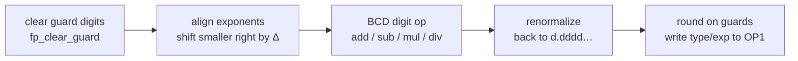

# Floating-point engine

> **Deep dive:** [Calculation Engine](sub-calculation.md) — ×, ÷, ^, roots, the transcendentals (sin/cos/ln/eˣ), and number formatting.

All TI-BASIC arithmetic runs through a BCD floating-point engine centered on the OP registers in RAM. The engine lives mostly on flash page 0 (it's hot), with the RST-30 shortcut for the most common op.

## Number format — `TIFloat` (9 bytes on disk) [confirmed]

```
+0  type      0x00 = real (positive), 0x80 = negative real;
              0x0C/0x8C = complex (paired with the imaginary part)
+1  exp       base-100? no — base-10 exponent, biased by 0x80 (0x80 = 10^0)
+2..+8  mantissa   7 bytes = 14 packed BCD digits, normalized d.dddddddddddddd
```

As a C struct:

```c
typedef struct {
    uint8_t type;          /* +0: 0x00 real (positive), 0x80 negative; 0x0C/0x8C complex part */
    uint8_t exp;           /* +1: base-10 exponent, biased by 0x80 (0x80 == 10^0)             */
    uint8_t mantissa[7];   /* +2..+8: 14 packed BCD digits, normalized d.dddddddddddddd        */
} TIFloat;                                              /* 9 bytes on disk / in a stored var   */
/* In an OP register slot the number occupies 11 bytes: the 9 above plus 2 trailing guard      */
/* digit bytes (OP1EXT at +9/+10) used during math — see "OP registers" below.                 */
```
The stored value is

$$v = \pm\\,(d_0.d_1d_2\cdots d_{13})\times 10^{\\,e-\mathtt{0x80}}$$

where $e$ is the biased exponent byte and $d_0\ldots d_{13}$ are the 14 BCD mantissa digits. A ROM-byte scan found roughly 126 candidate BCD constants ROM-wide [hypothesis] ($\pi/180 = 1.745\ldots\mathrm{e}{-2}$, $180/\pi = 5.729\ldots\mathrm{e}{1}$, 65536, plus the FP transcendental coefficient tables on page 0x02). The table addresses below are confirmed by Ghidra disassembly and raw ROM bytes.

## OP registers — 11 bytes each [confirmed]

`OP1`–`OP6` at `0x8478`, spaced `11` bytes (`OP2`=0x8483 …). The extra 2 bytes past the 9-byte number are extended guard digits used during math: `OP1EXT`/`OP2EXT` = bytes +9/+10 (seen in `_FPAdd` as `0x8481`/`0x8482`). `OP1` is the primary accumulator; most routines take their argument in `OP1` (and `OP2` for binary ops) and return in `OP1`.

## Core operations [confirmed from disassembly]

Every binary operation has the shape `OP1 ∘ OP2 → OP1`. Add and subtract walk the same five stages below; multiply and divide instead *combine* exponents (add them for `×`, subtract for `÷`) and multiply/divide the mantissas. Because the format is sign-magnitude BCD, the sign is settled separately — negating a value is a single `XOR 0x80` on its type byte — so the digit work always runs on a non-negative 14-digit mantissa:



The page-0 entry points — the hottest get a one-byte `RST` shortcut, which is why FP code is dense with `RST 30h`/`08h`/`20h`:

| Routine | Addr | Shortcut | Effect |
|---------|------|----------|--------|
| `_FPAdd` | `ram:229E` | `RST 30h` | `OP1 ← OP1 + OP2` |
| `_OP1ToOP2` | `ram:1A2F` | `RST 08h` | copy `OP1 → OP2` (11 bytes, via `copy_op11` `ram:1a8e`) |
| `_Mov9ToOP1` | `ram:1B01` | `RST 20h` | load 9 bytes at `HL → OP1` (a constant/var) |
| `_CkOP1FP0` / `_CkOP2FP0` | `ram:1DE9` / `ram:1DEE` | — | test `OP1`/`OP2 == 0` (sets `Z`) |
| `_CkOP1Real` | `ram:1942` | — | type-check `OP1` is real |

### Alignment, then the worked example — `_FPAdd`

To combine $x=(-1)^{s_x} m_x\times 10^{e_x}$ and $y=(-1)^{s_y} m_y\times 10^{e_y}$, the engine first aligns to the larger exponent. With $e_x \ge e_y$ it shifts $m_y$ right by

$$\Delta = e_x - e_y \quad(\text{digit shifts})$$

one nibble per `fp_shift_right_digit` call; if $\Delta > 15$ the smaller operand falls entirely past the 14 mantissa digits plus the 2 guard digits and is dropped. It then adds the aligned mantissas when the signs match ($s_x = s_y$) and subtracts when they differ ($s_x \ne s_y$), fixing the result's sign afterward — the essence of sign-magnitude arithmetic:

```pseudocode
\begin{algorithm}
\caption{\texttt{\_FPAdd}: $OP1 \gets OP1 + OP2$ (sign-magnitude BCD)}
\begin{algorithmic}
\IF{$OP2 = 0$}
    \RETURN $OP1$
\ENDIF
\IF{$OP1 = 0$}
    \STATE $OP1 \gets OP2$ \COMMENT{incl. extended bytes}
    \RETURN $OP1$
\ENDIF
\STATE $\Delta \gets \mathrm{exp}(OP1) - \mathrm{exp}(OP2)$ \COMMENT{\texttt{fp\_exp\_diff}}
\STATE shift the smaller mantissa right by $|\Delta|$ digits to align \COMMENT{\texttt{fp\_shift\_right\_digit}}
\IF{$|\Delta| > 15$}
    \RETURN larger operand \COMMENT{other is negligible}
\ENDIF
\IF{$\mathrm{sign}(OP1) = \mathrm{sign}(OP2)$}
    \STATE $\mathrm{mantissa} \gets$ BCD-add
\ELSE
    \STATE $\mathrm{mantissa} \gets$ BCD-subtract; fix result sign \COMMENT{\texttt{fp\_sub\_mantissa}}
\ENDIF
\STATE round via the guard digits, renormalize, store exp/type in $OP1$
\RETURN $OP1$
\end{algorithmic}
\end{algorithm}
```

The full helper cluster is documented below.

> **Dynamic confirmation.** Traced under headless TilEm: the `2+3` run
> ([`home-2plus3.macro`](https://github.com/siraben/ti84p-re/blob/main/tools/macros/home-2plus3.macro)) enters `_FPAdd` and
> — signs equal — falls through the sign test to `fp_add_mantissa` (`ram:1cb9`),
> while the `5−2` run ([`fpsub.macro`](https://github.com/siraben/ti84p-re/blob/main/tools/macros/fpsub.macro)) negates `OP2`
> and takes the opposite-sign branch into `fp_sub_mantissa` (`ram:1d37`).
> `fp_sub_mantissa` has 0 hits in the add trace and the add path 0 hits in the
> subtract trace, so the pseudocode's sign dispatch is confirmed both ways.

### The FP helper cluster [confirmed]

These five page-0 primitives are shared by add/sub/mult/div and the transcendentals. All were decompiled and disassembled in this ROM; the `fp_*` names below are the project's labels (in `tools/names.txt`). They operate on the OP-register guard region (`OP1EXT`/`OP2EXT` are 2 bytes each, at `0x8481`–`0x8482`/`0x848C`–`0x848D` — `fp_clear_guard` zeroes all four) and the 7-byte mantissas of `OP1` / `OP2` (`OP1M` `0x847A` / `OP2M` `0x8485`, two bytes past the type/exponent bytes at `0x8478`/`0x8483`).

| Helper | Addr | Role [confirmed] |
|--------|------|------|
| `fp_shift_right_digit` | `ram:1bea` | Mantissa shift-right by one BCD digit (one nibble). Cascades nibbles down 8 bytes (`b[i] = b[i]>>4 \| b[i-1]<<4`) and returns the digit shifted out. Called per step to align the smaller operand. |
| `fp_exp_diff` | `ram:1fbf` | Exponent difference `OP1.exp − OP2.exp` (signed). Drives how many `fp_shift_right_digit` steps are needed for alignment. |
| `fp_add_mantissa` | `ram:1cb9` | BCD add of the two mantissa+guard runs. Sets `HL=0x848C` (OP2 guard), `DE=0x8481` (OP1 guard) and runs the shared BCD add/`DAA`-style adjust loop (`bcd_add_pair`). Used for same-sign add. |
| `fp_sub_mantissa` | `ram:1d37` | BCD subtract (`OP1 − OP2`) of mantissa+guard with borrow, via repeated `DAA`-style BCD adjust across all 7 mantissa bytes plus the guard byte. Used for opposite-sign add. (`ram:1d2f`, `fp_sub_mantissa_fwd`, is the same subtract entered with the operand pointers swapped.) |
| `fp_clear_guard` | `ram:2627` | Zero the extended guard bytes (`OP1EXT`/`OP2EXT`). |

`ram:1d2f` and `ram:1d37` are two entry points into the same BCD-subtract body — `1d2f` loads `HL=0x8481` (OP1 guard), `DE=0x848C` (OP2 guard) and computes `OP2 − OP1` into OP2 (`LD A,(DE); SUB (HL)`), while `1d37` enters with the pointers swapped for the reverse `OP1 − OP2`, before joining the common loop — so the caller picks the subtraction direction by choosing the entry. This is what lets `_FPAdd` produce a non-negative magnitude and then fix the sign.

Multiply/divide/transcendentals (on page 0x02) reuse the same align/normalize primitives.

## Floating-point stack (FPS) [standard]
`FPS` (`0x9824`) is a software stack for temporaries; `_PushRealO1` (= `RST 18h`, `ram:155C`), `_PushReal`, `_PopRealO1` through `_PopRealO6`, `_PopReal`, `_AllocFPS`, and `_DeallocFPS` manage it. Used to spill OP registers during nested expression evaluation.

## Multiply / divide / transcendentals [confirmed — located]

The rest of the FP op set lives alongside add on page 0, with the transcendentals banked to page 0x02:

| Routine | Addr | Role |
|---------|------|------|
| `_FPSub` | `ram:2297` | OP1 = OP1 − OP2 |
| `_FPMult` | `ram:238B` | OP1 = OP1 × OP2 |
| `_FPRecip` | `ram:253D` | OP1 = 1 / OP1 |
| `_FPDiv` | `ram:2541` | OP1 = OP1 / OP2 |
| `_LnX` | `02:6EFD` | natural log |
| `_EToX` | `02:705C` | eˣ |
| `_SinCosRad` | `02:733E` | sin/cos (radians) |

See [Calculation Engine](sub-calculation.md) for the ×/÷/^/root algorithms and number formatting.

## Transcendental method [confirmed]

The ln/e^x/sin-cos evaluators are local page-0x02 code plus page-0x02 coefficient tables. The apparent `LD A,n; CALL ram:2362` "page switch" sites are not banked series tails: Ghidra disassembly shows `ram:2362: CALL ram:3DD1`, and `ram:3DD1` is a bcall-table entry whose inline descriptor is `1E 7D 02` (`02:7D1E`). The real banked-call helper is `ram:2B09`. `ram:2362` fetches the page-0x02 coefficient indexed by `A` and then multiplies OP1 by it (it enters the `_FPMult` body at `ram:2392`). Therefore the preceding `LD A,n` is a coefficient-table index, not a target flash page. Raw ROM bytes at the supposed same-address page-0x03 targets are `0xFF`, and Ghidra has no page-0x03/page-0x06 functions there.

### The shared algorithm — digit-by-digit pseudo-division [confirmed]

The forward log and exp evaluators are a digit-by-digit pseudo-division recurrence — the algorithm BCD calculators have used since the 1960s. The table gives it away: `02:7181`'s 16 rows are exactly $\log_{10}(1+10^{-k})$ for $k=0\ldots15$ (matched to 14 digits — `[00]` = `log₁₀2`, `[01]` = `log₁₀1.1`, `[02]` = `log₁₀1.01`, …), which is precisely the per-step increment such a recurrence consumes. The recurrence runs on shift-and-add alone: scaling a BCD number by $1+10^{-k}$ is $x + (x\text{ shifted right }k\text{ digits})$, one `fp_shift_right_digit` (`ram:1bea`) plus one BCD-add, so the digit-by-digit recurrence core needs no general multiply (only the base-conversion scaling via `CALL ram:2362` enters `_FPMult`). (The traces show the shift `1bea` is shared, but the running-add entry differs: `_EToX` uses `fp_add_mantissa` `ram:1cb9`, while `_LnX` uses the sibling BCD-add entry `ram:1ca9` — `1cb9` fires 0× in the `ln(2)` loop, `1ca9` 0× in the `e¹` loop.)

**Logarithm.** With the exponent already split off so the mantissa is $x\in[1,10)$, the loop (`02:6F80`–`6FEE`) drives $x$ up toward $10$ by repeatedly scaling by the largest table factor that doesn't overshoot; the number of scalings at each position *is* the corresponding digit of the answer, and the running sum of the table entries is the logarithm:

```pseudocode
\begin{algorithm}
\caption{Logarithm by pseudo-division (table $c_k=\log_{10}(1+10^{-k})$ at \texttt{02:7181})}
\begin{algorithmic}
\REQUIRE reduced mantissa $x \in [1,10)$, accumulator $L \gets 0$
\FOR{$k = 0$ \TO $15$}
    \WHILE{$x \cdot (1+10^{-k}) \le 10$}
        \STATE $x \gets x + (x \gg k\text{ digits})$ \COMMENT{$\times(1+10^{-k})$ is a BCD shift-add}
        \STATE $L \gets L + c_k$ \COMMENT{add count = the $k$-th digit of the answer}
    \ENDWHILE
\ENDFOR
\RETURN $\log_{10}x = 1 - L$ \COMMENT{$x$ driven up to $10$; then $\ln x = \log_{10}x \cdot \ln 10$}
\end{algorithmic}
\end{algorithm}
```

The code's two passes — the `AND 0x8` then `BIT 4` stops at `02:6FAD`/`6FD3` — are the coarse digits ($k=0\ldots7$) and the fine digits ($k=8\ldots15$). The selector `C` chooses the base: $\ln x = \log_{10}x \cdot \ln 10$, with $\ln 10$ fetched from `02:7D42`[06] by the `LD A,6; CALL ram:2362` tail at `02:704A` (`_LogX` skips that final multiply).

**Exponential.** `_EToX`/`_TenX` (`02:7066`+) run the *same* table backwards — consuming the fractional part $y$ digit by digit, subtracting $\log_{10}(1+10^{-k})$ while building $10^{y}=\prod_k(1+10^{-k})^{d_k}$ into an accumulator, again with only shift-adds:

```pseudocode
\begin{algorithm}
\caption{Exponential by pseudo-multiplication (same table, run in reverse)}
\begin{algorithmic}
\REQUIRE $y = $ fractional part of $x\log_{10}e$, accumulator $A \gets 1$
\FOR{$k = 0$ \TO $15$}
    \WHILE{$y \ge c_k$}
        \STATE $y \gets y - c_k$
        \STATE $A \gets A + (A \gg k\text{ digits})$ \COMMENT{$\times(1+10^{-k})$}
    \ENDWHILE
\ENDFOR
\RETURN $10^{y} = A$
\end{algorithmic}
\end{algorithm}
```

So a single 16-row table at `02:7181` powers *all* of ln / log / eˣ / 10ˣ; the `02:7D42` block only supplies the base-conversion constants ($\log_{10}e$, $\ln 10$) and the trig reduction constants.

> **Dynamic confirmation.** Traced under headless TilEm: `ln(2)`
> ([`ln2.macro`](https://github.com/siraben/ti84p-re/blob/main/tools/macros/ln2.macro)) drives `_LnX`, whose selector
> (`02:6F94`) steps `A=00…07` then `08…0F` (the coarse/fine split at the `6FAD AND 0x8`
> / `6FD3 BIT 4` tests), walking successive `02:7181` rows with a per-step
> shift-add, then fetches $\ln 10$ via `LD A,6; CALL ram:2362` and multiplies.
> `e^{1}` ([`exp1.macro`](https://github.com/siraben/ti84p-re/blob/main/tools/macros/exp1.macro)) drives `_EToX`, which consumes
> the same table in reverse (the inner step is `fp_sub_mantissa` `1d37`, the
> accumulator add `fp_add_mantissa` `1cb9`), selector sweeping `00…0F` under the
> `710A CP 0x0F` bound. On-screen results: `.6931471806` and `2.718281828`.

**Sin/cos** (`_SinCosRad`) uses the same digit-recurrence *shape* on the range-reduced angle, but with its own near-unity scaling tables `02:7201`/`02:7281` (eight rows, two sign-variants each, picked by `0x84A4` bit 7) rather than Taylor coefficients — so it too is a table-driven recurrence, not a fixed polynomial. The exact rotation identity each trig row encodes is not pinned here.

### `_LnX` — natural log (`02:6EFD`) [confirmed]

`_LnX` first calls `_CkOP1Pos` (`ram:1E5D`) and raises a domain error on `x <= 0`. The core (`02:6F1B`) splits `x` into mantissa × 10^exp; after a small pre-step near `02:6F45`–`02:6F50` (a value formed with `_FPAdd` (RST 30h) / `_FPSub` / `_FPDiv` `ram:2541`), the pseudo-division loop described above (`02:6F8C`–`02:6FEC`) steps through the shared 16-slot table at `02:7181` via `02:7301`/`02:7302`; the first phase stops when the selector has bit 3 set (`02:6FAB`–`02:6FAF`, coarse digits) and the second when it reaches bit 4 (`02:6FD2`–`02:6FD5`, fine digits). The `02:6F70: LD A,3; CALL ram:2362` site fetches constant-table index 3, and `02:704A: LD A,6; CALL ram:2362` fetches index 6 (`ln(10)`, the base-conversion multiply), both from `02:7D42`.

### `_EToX` — eˣ (`02:705C`) [confirmed]

`_EToX` is local page-0x02 code. It clears guard digits, then `02:705F: LD A,3; CALL ram:2362` loads constant-table index 3 (`log10(e)`) and then `02:7064 JR +3` skips `_TenX`'s entry at `02:7066` (which does its own `CALL ram:2627`), joining the shared body at `02:7069`. The body splits the decimal exponent/integer digit shift (`02:7069`–`02:70B6`), handles sign/reciprocal cases (`02:70B9`–`02:70D9`), then evaluates the fractional part with the shared 16-row table at `02:7181`. The exact loop bound is `02:7106 LD HL,0x848E; 02:7109 LD A,(HL); CP 0x0F; JR Z,02:7140`, so the table-driven exp evaluator has 16 selector slots (`0..15`).

### `_SinCosRad` — sin/cos in radians (`02:733E`) [confirmed]

This one keeps its range reduction on page 0x02 and is the most fully recovered:

1. **Mode/select flags.** `0x8499` holds the trig-op selector — `0x01` (sin), `0x02` (cos), `0x04` (tan) — ORed with `0x80` when `(IY+0)` bit 2 is clear (`BIT 2,(IY+0); JR NZ,+2; OR 0x80`). `_SinCosRad` itself enters with `A=0x81`, so it stores `0x81` regardless. `fp_clear_guard` and `_ZeroOP3` initialize the work area.
2. **Exponent gate.** `LD A,(0x8479); SUB 0x80; JP C,02:73D4; CP 0x0C; JP NC` — tiny arguments (negative exponent) take a fast path at `02:73D4`, and arguments with decimal exponent ≥ 12 are rejected to the slow/error path (`_JError 0x84` for out-of-range), because reduction can no longer be done accurately.
3. **Reduce the angle.** It reduces against the stored period constants and takes the fractional part to find the quadrant. The reduction constants are the page-0x02 BCD block:
   - `02:7D81` — the 2π full-turn modulus (mantissa `62 83 18 53 07 17 96` = `6.2831853…`), copied to the OP3 work reg via `LD HL,02:7D81; CALL ram:1AE2` (`ram:1AE2`/`copy7_from_8490` copies 7 mantissa bytes to `0x8490`).
   - `02:7D8E`, `02:7D95`, `02:7D96` — companion constants used in the quadrant-fixup / remainder comparisons (`CALL ram:1D7B` magnitude compare at `02:73B1`/`02:7447`).
   The quadrant (0–3) is accumulated in `B`/`bStack_1` (bits 0/3/6) and decides sin-vs-cos and the result sign (the `XOR 0x1 / OR 0x8 / XOR 0x8` flag juggling at `02:7424`–`02:7464`).
4. **Per-digit evaluation.** After reduction (`02:7475` onward, falling through `02:7488 LD A,B`) the reduced argument in `[0, pi/4)` drives the same table-stepping digit recurrence as ln/e^x: a selector walks the coefficient table one row per step rather than unrolling a fixed polynomial. The loaders are local — `02:74AB: CALL 02:731D` reads the signed table at `02:7201`, `02:74EA: CALL 02:7312` reads the signed table at `02:7281` — and the selector advances under `BIT 3,B` / `BIT 3,C` in the tail (`02:74DD`–`02:74E0`, `02:75C6`–`02:75C8`), so the walk covers eight selector rows (`0..7`), each carrying two 8-byte sign/phase variants. Per-row decoding of `02:7201`/`02:7281` is the one piece still open: the rows climb toward 10 (e.g. `02:7201[00]`=`9.9668…`, `[06]`=`9.999999…`), the shape of a half-angle / rotation factor consumed one digit at a time.

> **Dynamic confirmation.** Traced under headless TilEm: `sin(1)` in radian mode
> ([`sin1.macro`](https://github.com/siraben/ti84p-re/blob/main/tools/macros/sin1.macro)) drives `_SinCosRad`. The flag init,
> the exponent gate (`735D LD A,(0x8479); SUB 0x80; JP C,02:73D4; CP 0x0C; JP NC` — neither
> branch taken, since `exp(1)=0` is in `[0,12)`), the reduction multiply by the `02:7D81` constant
> (`7372 LD HL,02:7D81; CALL ram:1AE2`), and the table-stepping loader `02:731D` returning
> successive rows of `02:7201` (HL = `7209/7219/…/7279`, 16-byte stride) all execute as
> described. On-screen result: `.8414709848`. (Per-row coefficient meaning remains the open piece.)

### Coefficient tables [confirmed]

`02:7D1E` zeroes the OP2 type byte, indexes `02:7D42 + 9*A`, then copies the selected constant image into OP2. The only `LD A,n; CALL ram:2362` uses in this cluster are `A=3` (`log10(e)`) and `A=6` (`ln(10)`); the later trig reduction constants are loaded directly from the same nearby block.

```
02:7D42 constants, 9-byte stride:
  [00] 81 57 29 57 79 51 30 82 32
  [01] 80 15 70 79 63 26 79 48 97
  [02] 7F 78 53 98 16 33 97 44 83
  [03] 7F 43 42 94 48 19 03 25 18  ; log10(e) fetch site
  [04] 80 31 41 59 26 53 58 98 00
  [05] 7E 17 45 32 92 51 99 43 30
  [06] 80 23 02 58 50 92 99 40 46  ; ln(10) fetch site
  [07] 62 83 18 53 07 17 96 31 41  ; direct trig-reduction region starts here
  [08] 59 26 53 58 98 78 53 98 16
```

`02:7181` is the shared ln/e^x digit table loaded by `02:7301`/`02:7302`/`02:7305`. It has 16 8-byte rows:

```
[00] 30 10 29 99 56 63 98 12  [01] 04 13 92 68 51 58 22 50
[02] 00 43 21 37 37 82 64 26  [03] 00 04 34 07 74 79 31 86
[04] 00 00 43 42 72 76 86 27  [05] 00 00 04 34 29 23 10 45
[06] 00 00 00 43 42 94 26 48  [07] 00 00 00 04 34 29 44 60
[08] 00 00 00 00 43 42 94 48  [09] 00 00 00 00 04 34 29 45
[10] 00 00 00 00 00 43 42 94  [11] 00 00 00 00 00 04 34 29
[12] 00 00 00 00 00 00 43 43  [13] 00 00 00 00 00 00 04 34
[14] 00 00 00 00 00 00 00 43  [15] 00 00 00 00 00 00 00 04
```

`02:7201` and `02:7281` are the forward sin/cos signed recurrence tables (the per-row near-unity factors the digit loop steps through, per the shared algorithm above). Each row is 16 bytes: the first 8-byte variant is selected when `0x84A4 bit 7` is clear, and the second 8-byte variant is selected when it is set.

```
02:7201:
[00] 09 96 68 65 24 91 16 20 | 10 03 35 34 77 31 07 56
[01] 09 99 96 66 68 66 65 24 | 10 00 03 33 35 33 34 76
[02] 09 99 99 96 66 66 68 67 | 10 00 00 03 33 33 35 33
[03] 09 99 99 99 96 66 66 67 | 10 00 00 00 03 33 33 33
[04] 09 99 99 99 99 96 66 67 | 10 00 00 00 00 03 33 33
[05] 09 99 99 99 99 99 96 67 | 10 00 00 00 00 00 03 33
[06] 09 99 99 99 99 99 99 97 | 10 00 00 00 00 00 00 03
[07] 10 00 00 00 00 00 00 00 | 10 00 00 00 00 00 00 00

02:7281:
[00] 95 09 85 29 44 83 72 02 | 10 52 06 69 51 89 55 92
[01] 99 94 95 10 19 99 69 80 | 10 00 50 52 03 08 13 30
[02] 99 99 94 94 95 10 20 35 | 10 00 00 50 50 52 03 05
[03] 99 99 99 94 94 94 95 10 | 10 00 00 00 50 50 50 52
[04] 99 99 99 99 94 94 94 95 | 10 00 00 00 00 50 50 51
[05] 99 99 99 99 99 94 94 95 | 10 00 00 00 00 00 50 51
[06] 99 99 99 99 99 99 94 95 | 10 00 00 00 00 00 00 51
[07] 99 99 99 99 99 99 99 95 | 10 00 00 00 00 00 00 01
```

The forward ln, e^x, and sin/cos paths all run on the table-driven digit recurrence above — a selector that steps through a coefficient table one row at a time, on shift-and-add (ln/e^x loaded from `02:7181`; sin/cos from `02:7201`/`02:7281`). The separate arctangent engine behind inverse trig uses a base-10 CORDIC iteration, documented in [Calculation Engine](sub-calculation.md).
