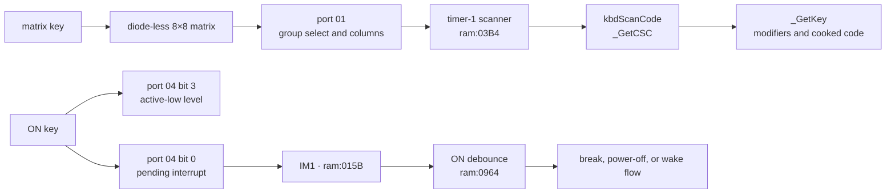

# Keypad and ON-key hardware

*TI-84 Plus OS 2.55MP — Matrix scanning, debounce, repeat, ON interrupts, and wake behavior.*

The TI-84 Plus reads most keys through an active-low 8×8 matrix on port `0x01`. The **ON** key uses a separate level and interrupt circuit. This page follows both paths from the electrical interface through the OS scanner, `_GetCSC`, `_GetKey`, shutdown, and wake.

## Evidence layers

The matrix's electrical behavior, the ROM's filtering policy, and emulator input models are separate evidence layers.

| Layer | Main evidence | What it establishes |
|-------|---------------|---------------------|
| TI-OS kernel | `ram:015B`, `ram:03B4`–`ram:04BE`, and `ram:0964`–`ram:0A5D` | matrix transactions, scan-code construction, release filtering, repeat, ON debounce, and low-power control [confirmed] |
| TI-OS banked code | `_GetKey = 4972`, body `06:491E` | blocking input, hooks, APD interaction, modifiers, and cooked key codes [confirmed] |
| Dynamic execution | `tools/macros/power-cycle.macro` and `/tmp/tilem-power-cycle.trace` | a complete **[2nd]**+**ON** shutdown/wake cycle and a live **[2nd]** matrix scan [confirmed] |
| Public hardware notes | WikiTI ports `0x01`, `0x03`, and `0x04` | matrix wiring, capacitance, ghosting, bounce, and interrupt-port semantics [standard] |
| Emulator models | TilEm commit `f56ad63`, Wabbitemu commit `48c2dc0`, and MAME 0.287 | three different matrix algorithms and ON-edge policies [standard] |

## Two input circuits

The keypad has two paths into the ASIC. Matrix keys are polled by software. **ON** has its own active-low level and can request an interrupt while the CPU is halted. [standard]



The conventional scan-code number `0x29` occupies the unused matrix position at group 5, bit 0, but **ON** is not electrically present at that position. TilEm also uses `0x29` as its injected-key identifier. Port `0x04`, not port `0x01`, reports its physical state. [standard]

## Matrix wiring and scan codes

Writing port `0x01` selects groups with zero bits. Reading the same port returns one bit per key line, where zero means closed. `0xFF` releases every group, and `0x00` selects all groups. [standard]

The table gives the complete TI-84 Plus matrix. Each parenthesized byte is the scan code that `kbd_scan_matrix` at `ram:0406` constructs for a single key. A dash is an unwired position. [confirmed] for the ROM formula; [standard] for the physical map.

| Group mask | Bit 0 | Bit 1 | Bit 2 | Bit 3 | Bit 4 | Bit 5 | Bit 6 | Bit 7 |
|-----------:|-------|-------|-------|-------|-------|-------|-------|-------|
| `0xFE` | **↓** (`0x01`) | **←** (`0x02`) | **→** (`0x03`) | **↑** (`0x04`) | — | — | — | — |
| `0xFD` | **ENTER** (`0x09`) | **+** (`0x0A`) | **−** (`0x0B`) | **×** (`0x0C`) | **÷** (`0x0D`) | **^** (`0x0E`) | **CLEAR** (`0x0F`) | — |
| `0xFB` | **(−)** (`0x11`) | **3** (`0x12`) | **6** (`0x13`) | **9** (`0x14`) | **)** (`0x15`) | **TAN** (`0x16`) | **VARS** (`0x17`) | — |
| `0xF7` | **.** (`0x19`) | **2** (`0x1A`) | **5** (`0x1B`) | **8** (`0x1C`) | **(** (`0x1D`) | **COS** (`0x1E`) | **PRGM** (`0x1F`) | **STAT** (`0x20`) |
| `0xEF` | **0** (`0x21`) | **1** (`0x22`) | **4** (`0x23`) | **7** (`0x24`) | **,** (`0x25`) | **SIN** (`0x26`) | **APPS** (`0x27`) | **X,T,θ,n** (`0x28`) |
| `0xDF` | — | **STO→** (`0x2A`) | **LN** (`0x2B`) | **LOG** (`0x2C`) | **x²** (`0x2D`) | **x⁻¹** (`0x2E`) | **MATH** (`0x2F`) | **ALPHA** (`0x30`) |
| `0xBF` | **GRAPH** (`0x31`) | **TRACE** (`0x32`) | **ZOOM** (`0x33`) | **WINDOW** (`0x34`) | **Y=** (`0x35`) | **2nd** (`0x36`) | **MODE** (`0x37`) | **DEL** (`0x38`) |
| `0x7F` | — | — | — | — | — | — | — | — |

For group number $g$ from 0 through 7 and bit number $b$ from 0 through 7, the ordinary scan code is

$$
\operatorname{scanCode} = 8g + b + 1.
$$

At `ram:0410`, the scanner starts with mask `0xFE` and group counter 1. `RLC C` at `ram:044C` advances through `0xFD`, `0xFB`, `0xF7`, `0xEF`, `0xDF`, `0xBF`, and `0x7F`. The eight-iteration loop at `ram:0435` counts low bits and records the one-based bit position. `ram:0453` subtracts one from the group counter, shifts it three times, and adds the bit position. [confirmed]

The scanner rejects an ordinary sample containing more than one closed key. Two low bits within a group, or a second nonempty group after the first, return with carry set at `ram:0459`. [confirmed]

### Diagonal-arrow exception

When `mouseFlag1` bit 0 at `IY+0x2C` is set, group 0 has four accepted two-key values. The routine returns the raw active-low byte before the ordinary single-key reduction. [confirmed]

| Raw value | Low bits | Keys |
|----------:|----------|------|
| `0xF5` | 1 and 3 | **←**+**↑** |
| `0xF3` | 2 and 3 | **→**+**↑** |
| `0xFA` | 0 and 2 | **↓**+**→** |
| `0xFC` | 0 and 1 | **↓**+**←** |

These bytes are active-low group samples, not ordinary values from the scan-code formula. The repeat filter treats values `0xF3` and above as repeatable. The flag's callers and user-visible purpose remain incompletely mapped; the standard include names only its byte as `mouseFlag1`. [confirmed] for scanner behavior; [hypothesis] for the wider mode.

## One port transaction

`kbd_read_group` at `ram:0480` takes an active-low group mask in `A`, reads port `0x01`, releases all groups with `0xFF`, and returns the sampled byte. [confirmed]

```z80
ram:0480  push af
ram:0481  in a,(0x02)
ram:0483  and 0x80
ram:0485  jr nz,ram:0497       ; TI-84 Plus timing path

ram:0487  pop af
ram:0488  out (0x01),a
ram:048A  nop                  ; four-NOP path
ram:048B  nop
ram:048C  nop
ram:048D  nop
ram:048E  in a,(0x01)
ram:0490  ld b,a
ram:0491  ld a,0xFF
ram:0493  out (0x01),a         ; release all groups
ram:0495  ld a,b
ram:0496  ret

ram:0497  in a,(0x20)          ; CPU-speed selector
ram:0499  and 0x01
ram:049B  jr z,ram:0487        ; nominal 6 MHz: four NOPs
ram:049D  pop af
ram:049E  out (0x01),a
ram:04A0  nop                  ; nominal 15 MHz: add three NOPs
ram:04A1  nop
ram:04A2  nop
ram:04A3  jr ram:048A          ; then the four-NOP tail
```

Port `0x02` bit 7 selects the newer-hardware path. On a TI-84 Plus, port `0x20` bit 0 chooses between four settling NOPs at nominal 6 MHz and three NOPs plus a taken backward branch plus the four-NOP tail at nominal 15 MHz. The port-`0x20` read is a CPU-speed test, not a link-port gate. [confirmed]

Every call ends with `OUT (0x01),0xFF`. WikiTI attributes the reset requirement and variable delay to capacitance in the keypad lines: a line from the previous group can remain charged after that group is unselected. Published measurements report that a single key often settles within eight 6 MHz cycles, while some multi-key arrangements take more than 50 cycles. These measurements vary by keypad. [standard]

An interrupt can overwrite the caller's group selection between a manual `OUT` and `IN`. Code that scans port `0x01` outside the OS must mask interrupts or provide an ISR that leaves the transaction undisturbed. [standard]

## Ghosting and physical bounce

The matrix has no isolation diode at each key. Three closed switches can connect an unselected group to a selected group and create a fourth apparent closure. WikiTI's example selects group `0xF7`: pressing **2**, **3**, and **6** also couples group `0xFB`, making **5** appear closed. Unwired positions can ghost too. [standard]

TilEm reproduces this topology in `tilem_keypad_read_keys`. It starts with all keys in selected groups, then repeatedly unions any group sharing a set bit until the set stops growing. The returned byte is the complement of that transitive closure. [standard]

```pseudocode
closed = union(keysDown[group] for each selected group)
repeat
    previous = closed
    for each group:
        if closed intersects keysDown[group]:
            closed = closed union keysDown[group]
until closed == previous
return bitwise_not(closed)
```

The physical switches also bounce during release. WikiTI reports release bounce but little observable press bounce at ordinary scan rates. TilEm changes matrix bits immediately on an injected event; it models neither switch bounce nor capacitive settling. [standard]

## Timer scanner, release filter, and repeat

Standard hardware timer 1 enters `standard_timer1_irq` at `ram:0167`. Its keyboard call at `ram:0198` reaches `kbd_tick_debounce_repeat` at `ram:03B4`. With the OS's port-`0x04` setting, the nominal tick period is $304/32768$ seconds, or 9.27734375 ms. [confirmed] for the call path and register write; [standard] for the quartz-derived time.

The scanner uses the following contiguous RAM state. [confirmed]

| Address | Name | Role |
|---------|------|------|
| `0x843F` | `kbdScanCode` | event mailbox consumed by `_GetCSC` |
| `0x8440` | `kbdLGSC` | last scan code accepted by the filter |
| `0x8441` | `kbdPSC` | previous raw scan result |
| `0x8442` | `kbdWUR` | wait-until-repeat countdown |
| `0x8443` | `kbdDebncCnt` | stable-release countdown |
| `0x8444` | `kbdKey` | cooked-key workspace used by `_GetKey` |
| `0x8445` | `kbdGetKy` | most recent nonzero published scan code |
| `0x8446` | `keyExtend` | extended key-processing state |

`kbd_tick_debounce_repeat` applies asymmetric filtering: [confirmed]

1. `kbd_scan_matrix` first writes `0x00` to port `0x01` as an all-groups probe. It returns immediately when every read bit is one.
2. A multi-key rejection sets `kbdPSC = 0xFF` and reloads `kbdDebncCnt = 5`; it publishes no event.
3. A changed raw result is copied to `kbdPSC`, and `kbdDebncCnt` is reloaded to 5.
4. A changed nonzero result proceeds immediately. The ROM does not require five equal pressed samples.
5. A zero result must appear on five consecutive scanner calls. The first zero reloads and immediately decrements the counter; the fifth reaches zero and accepts release.

Five samples span four complete tick intervals between the first and accepted zero, about 37.109 ms. Phase relative to the physical release gives an overall detection latency of about 37.109–46.387 ms under the documented timer rate. This digital filter complements the slower periodic sampling; it does not model matrix capacitance directly. [confirmed] for the sample count; [standard] for wall time.

### Repeat policy

A newly accepted nonzero key is published immediately and loads `kbdWUR = 0x32`. Only these held values repeat: [confirmed]

- arrow scan codes `0x01`–`0x04`;
- **DEL**, scan code `0x38`;
- the diagonal-arrow raw values `0xF3`–`0xFC` accepted by the special path.

Other matrix keys produce one event until release. A repeatable key waits 50 timer ticks before the first repeat and reloads 10 ticks after each repeat. Those intervals are about 463.867 ms and 92.773 ms. [confirmed] for the counters; [standard] for wall time.

`kbd_publish_scan_code` at `ram:04A5` always stores `A` in `kbdScanCode` and sets `kbdSCR`, bit 3 of `IY+0`. A nonzero value also updates `kbdGetKy`; zero leaves `kbdGetKy` unchanged. The caller sets `kbdKeyPress`, bit 4 of `IY+0`, for a newly accepted nonzero press. [confirmed]

## `_GetCSC` and `_GetKey`

`_GetCSC = 4018`, body `ram:04B2`, is the nonblocking raw-event interface. It disables interrupts, reads `kbdScanCode`, clears the byte, clears `kbdSCR`, re-enables interrupts, and returns the event in `A`. It returns zero when no event is pending. Repeat events generated by the timer scanner are visible through this same mailbox. [confirmed]

```z80
ram:04B2  ld hl,0x843F
ram:04B5  di
ram:04B6  ld a,(hl)
ram:04B7  ld (hl),0
ram:04B9  res 3,(iy+0)         ; kbdSCR
ram:04BD  ei
ram:04BE  ret
```

The mailbox is one byte deep. If the scanner publishes another event before `_GetCSC` consumes the previous one, the newer value replaces it. The interrupt-masked read prevents a torn read-and-clear operation, but it does not queue multiple keys. `_GetCSC` also executes `EI` unconditionally rather than restoring the caller's prior interrupt-enable state. [confirmed]

`_GetKey = 4972`, body `06:491E`, is the blocking cooked-key interface. Its loop calls `_GetCSC` at `06:4973`, services input hooks and link/USB conditions, participates in cursor and APD handling, and waits until a cooked key appears in `kbdKey`. It turns matrix scan codes into `kXxx` values and applies **2nd** and **ALPHA** state. [confirmed]

The two APIs therefore have different contracts:

| API | Waits | Value | Modifiers and hooks | Repeat source |
|-----|-------|-------|---------------------|---------------|
| `_GetCSC` | no | raw scan event, or zero | no cooking | timer scanner |
| `_GetKey` | yes | cooked `TIKeyCode` | **2nd**, **ALPHA**, hooks, context policy | events consumed from the scanner |

### Modifier state

`_GetKey` stores modifier state in `shiftFlags` at `IY+0x12`. [confirmed]

| Bit | Equate | Meaning |
|----:|--------|---------|
| 3 | `shift2nd` | **2nd** pending |
| 4 | `shiftAlpha` | alpha mode active |
| 5 | `shiftLwrAlph` | lowercase rather than uppercase |
| 6 | `shiftALock` | alpha lock |
| 7 | `shiftKeepAlph` | prevent automatic alpha clearing |

From idle, scan code `0x36` sets `shift2nd` at `06:4AD5` and loops without returning. A second **2nd** cancels it at `06:4B8E`; another key clears the flag at `06:4B87` before translation. Scan code `0x30` sets uppercase alpha at `06:4AE8`. **[2nd]** then **ALPHA** sets both `shiftALock` and `shiftAlpha` at `06:4B96`–`06:4B9A`. In a lowercase-capable context, another **ALPHA** sets `shiftLwrAlph` at `06:4C0D`; the next cycle cancels alpha. [confirmed]

`key_clear_alpha_if_unlocked` at `ram:04BF` preserves alpha when `shiftALock` or `shiftKeepAlph` is set and otherwise clears `shiftAlpha`. The timer ISR can also clear a pending **2nd** at `ram:01E0`, preventing an abandoned modifier from persisting indefinitely. [confirmed]

`_KeyToString` at `01:6D10` performs the next layer: cooked key code to editor token or string. The complete input path is matrix → scanner → `_GetCSC` → `_GetKey` → `_KeyToString` → tokenizer. See [Tokenizer & TI-BASIC](tokenizer-basic.md). [confirmed]

## ON interrupt and level

The **ON** circuit uses two ports. [standard]

| Register | Bit | Meaning |
|----------|----:|---------|
| port `0x03` write | 0 | one enables ON interrupts; zero disables and acknowledges the pending request |
| port `0x03` read | 0 | ON interrupt enable state |
| port `0x04` read | 0 | ON interrupt pending |
| port `0x04` read | 3 | live ON level, active low |

The IM1 dispatcher reads port `0x04` and enters `ram:015B` when bit 0 is set. That branch calls `on_key_debounce_power` at `ram:0964`, clears a link/interrupt sub-flag, and acknowledges through the common port-`0x03` path. [confirmed]

Port `0x04` bit 0 says that the source is pending; bit 3 says whether the button is currently held. Software must not substitute one for the other. The handler uses bit 3 to decide whether the stable state is press or release. [confirmed]

The port-`0x03` clear-on-zero sequence, source priority, and the differing TilEm and Wabbitemu ON-edge policies are detailed in [Interrupts (IM1)](interrupts.md#on-request-versus-on-level).

## ON debounce

`on_key_debounce_power` normalizes its timing before polling the level. On TI-84 Plus hardware, it saves port `0x20` in `E` and writes zero to select nominal 6 MHz. It then requires port-`0x04` bit 3 to remain unchanged for `0x1016`, or 4,118, loop iterations. Any change reloads the counter. [confirmed]

```z80
ram:096A  in a,(0x20)
ram:096C  ld e,a
ram:096D  xor a
ram:096E  out (0x20),a         ; nominal 6 MHz
ram:0970  ld b,0

ram:0972  ld hl,0x1016         ; reload after a level change
ram:0975  in a,(0x04)
ram:0977  and 0x08
ram:0979  cp b
ram:097A  ld b,a
ram:097B  jr nz,ram:0972
ram:097D  dec hl
ram:097E  ld a,l
ram:097F  or h
ram:0980  jr nz,ram:0975
```

In the power-cycle trace, successive reads at `ram:0975` are 68 trace clock units apart. The stable sequence runs from clock 95,685,465 through 95,965,421, then restores port `0x20` at clock 95,965,535. Counting 4,118 iterations gives 280,024 nominal 6 MHz cycles, or about 46.671 ms. [confirmed]

The routine restores the saved CPU-speed selector at `ram:09B3` and writes `0x06` to port `0x04` at `ram:09B7`. A stable low level takes the power-on/pressed branch at `ram:09AC`; a stable high level follows the release and running-state checks from `ram:0985`. [confirmed]

This debounce is independent of the matrix's five-sample release filter. It polls **ON** rapidly at forced 6 MHz instead of waiting for timer-1 scans. [confirmed]

## 2nd+ON, APD, and wake

`_GetKey` recognizes the ON request as an internal `0xFF` event at `06:4A93`. It clears `shift2nd`. If `appRetKeyOff` is set, it returns the context key `0x3F`; otherwise it jumps to `_PowerOff`, body `ram:09E6`. [confirmed]

Explicit power-off and Auto Power Down (APD) perform different cleanup, then join the shared shutdown path at `ram:0A24`. The final hardware operations are: [confirmed]

| Address | Operation | Effect |
|---------|-----------|--------|
| `ram:0A29` | `OUT (0x03),0x08` | acknowledge and temporarily disable interrupt sources while cleanup continues |
| `ram:0A4B` | `OUT (0x04),0x06` | select map mode 0 and the slow standard-timer rate |
| `ram:0A4F` | `OUT (0x03),0x11` | enable ON and link wake, disable standard timers, and select low power on `HALT` |
| `ram:0A51` | clear `shift2nd` | discard the power-off modifier |
| `ram:0A55` | clear `onRunning` | mark the OS powered down |
| `ram:0A5B` | `EI` | accept a selected wake interrupt |
| `ram:0A5C` | `HALT; JR ram:0A5C` | remain in the low-power loop |

Port-`0x03` bit 3 being clear selects low power only when the Z80 executes `HALT`. The `0x11` write alone does not complete shutdown. ON and link activity remain wake sources. [standard]

The trace confirms the complete sequence. The shutdown side restores CPU speed, writes `0x06` to port `0x04`, acknowledges with `0x08`, disables the LCD with command `0x02`, writes `0x11`, and reaches the `ram:0A5C` loop. A later **ON** event enters the same 4,118-iteration debounce. The wake side then writes normal interrupt mask `0x0B` at `ram:0C9E` and sends LCD commands `0x40,0x05,0x01,0x03,0x17,0x0B,0xEF` through `06:4D38`. [confirmed]

## Dynamic reproduction

The resolver can print injected key events and restrict both key and I/O output to an inclusive trace-clock window.

```sh
nix develop -c python tools/tilem_trace_resolve.py \
  /tmp/tilem-power-cycle.trace \
  --initial-mapping ti84p-reset --names tools/names.txt \
  --key-events

nix develop -c python tools/tilem_trace_resolve.py \
  /tmp/tilem-power-cycle.trace \
  --initial-mapping ti84p-reset --names tools/names.txt \
  --io-ports 01 --event-clock 93285080-93450000

nix develop -c python tools/tilem_trace_resolve.py \
  /tmp/tilem-power-cycle.trace \
  --initial-mapping ti84p-reset --names tools/names.txt \
  --io-ports 03,04,10,20 --event-clock 95965000-95967000
```

The **[2nd]** scan contains this transaction: [confirmed]

```text
clk=93375052  ram:049e  OUT (0x01) <- 0x00
clk=93375112  ram:048e  IN  (0x01) -> 0xdf
clk=93375137  ram:0493  OUT (0x01) <- 0xff
...
clk=93378814  ram:049e  OUT (0x01) <- 0xbf
clk=93378874  ram:048e  IN  (0x01) -> 0xdf
clk=93378899  ram:0493  OUT (0x01) <- 0xff
```

The all-groups probe finds bit 5 low. The group walk later selects `0xBF`; bit 5 remains low, producing scan code `6 × 8 + 5 + 1 = 0x36`, **2nd**. Every sample releases the matrix afterward. [confirmed]

## Emulator comparison

All three pinned implementations return matrix state immediately and omit electrical settling and mechanical bounce. Their digital matrix algorithms do not agree. [standard]

| Area | TilEm `f56ad63` | Wabbitemu `48c2dc0` | MAME 0.287 |
|------|-----------------|------------------------|------------|
| Selected rows | active-low write, all eight bits | complements the write, then considers seven rows | active-low write, seven rows |
| Ordinary combination | OR of selected rows | OR of selected row results | XOR of each selected pressed position |
| Ghosting | iterated transitive closure | one pairwise-overlap pass | none |
| Same-column keys in two selected rows | remain low | remain low | XOR twice and cancel to high |
| ON level | separate active-low port-`0x04` bit 3 | separate active-low port-`0x04` bit 3 | separate active-low port-`0x04` bit 3 |
| ON request edge | press and release | press only | press only |
| ON detection | injected-state event | standard-interrupt device evaluation | fixed 256 Hz timer-1 callback |

TilEm begins with the union of selected rows, then repeatedly adds every row intersecting the current closed-bit set. It therefore propagates through an arbitrarily long chain of row intersections. It stores eight row bytes, including the physically unwired eighth row, and uses the OS-compatible matrix-position numbers for ordinary keys. Its injected identifier `0x29` represents the separate **ON** key rather than a port-`0x01` position. [standard]

Wabbitemu first constructs a result for each row by unioning that row with every row that directly intersects it. It does not iterate the result, so a three-row chain can stop after the second row where TilEm reaches the third. It considers rows 0–6 and ignores row 7. ON press detection compares the current state with a saved state when the standard-interrupt model runs; release updates the saved state without latching a request. [standard]

MAME does not compute a union. Starting from `0xFF`, it XORs the column bit for every pressed key in every selected row. Two selected pressed positions in one column therefore toggle the bit twice and disappear from the read. Its ON press is sampled by the fixed 256 Hz standard-timer callback; a held press does not create another request until a callback has observed a release. The TI-84 Plus driver remains marked `MACHINE_NOT_WORKING`. [standard]

These discrepancies are emulator behavior, not competing physical measurements. TilEm's closure is topologically plausible for a diode-less matrix, but the physical result still depends on resistance, capacitance, switch state, and the delay between the group write and read. [hypothesis]

## Reusable keypad tools

`tools/keypad_hardware.py` exposes the three source-pinned matrix algorithms and ON-edge policies. `tools/describe_keypad_hardware.py` accepts numeric `GROUP,BIT` positions, which keeps ghost and unwired-position experiments independent of UI key names.

```sh
# Three-key rectangle: TilEm/Wabbitemu read 0xFC; MAME reads 0xFE.
nix develop -c python tools/describe_keypad_hardware.py matrix \
  --mask 0xFE --key 0,0 --key 1,0 --key 1,1

# Transitive chain: TilEm reaches bit 2; Wabbitemu stops at bit 1.
nix develop -c python tools/describe_keypad_hardware.py matrix \
  --mask 0xFE --key 0,0 --key 1,0 --key 1,1 --key 2,1 --key 2,2

nix develop -c python tools/describe_keypad_hardware.py on press release
nix develop -c python tools/describe_keypad_hardware.py --json profiles
```

## Resolved findings and open hardware tests

- [confirmed] The fast TI-84 Plus scan path tests CPU speed and executes three NOPs, a taken branch, and the shared four-NOP tail before reading port `0x01`.
- [confirmed] Ordinary multi-key samples are rejected, while four diagonal-arrow active-low bytes bypass the ordinary scan-code formula under `mouseFlag1` bit 0.
- [confirmed] A new press is accepted immediately; release requires five consecutive zero samples.
- [confirmed] Initial and subsequent repeat delays are 50 and 10 timer-1 ticks, and only arrows, diagonals, and **DEL** repeat at this layer.
- [confirmed] `_GetCSC` is a destructive one-byte mailbox read, so it can lose overwritten events.
- [confirmed] ON debounce forces nominal 6 MHz and requires 4,118 stable reads, about 46.7 ms in the trace.
- [confirmed] Explicit power-off and APD share the `ram:0A24` low-power tail; **ON** wake restores the interrupt mask and reinitializes the LCD.
- [standard] TilEm iterates matrix closure, Wabbitemu performs only pairwise closure, and MAME XORs selected positions.
- [standard] TilEm requests ON interrupts on press and release; Wabbitemu and MAME request only on press.
- [hypothesis] The exact capacitance and minimum safe settle time should be measured across TA2 and TA3 calculators, including worst-case chords.
- [hypothesis] A logic-analyzer test should establish which physical ON transitions request interrupts on each ASIC revision rather than selecting an emulator policy by majority.
- [hypothesis] The callers and intended UI contract of the diagonal-arrow mode at `IY+0x2C` bit 0 need a complete banked-code trace.

## Sources

| Source | Used for |
|--------|----------|
| [WikiTI port `0x01`](https://wikiti.brandonw.net/index.php?title=83Plus:Ports:01) | matrix map, active-low protocol, capacitance, settling, ghosting, bounce, and interrupt interference |
| [WikiTI port `0x03`](https://wikiti.brandonw.net/index.php?title=83Plus:Ports:03) | interrupt enables, acknowledgement, and low-power-on-`HALT` behavior |
| [WikiTI port `0x04`](https://wikiti.brandonw.net/index.php?title=83Plus:Ports:04) | ON pending and active-low level bits |
| [TilEm `keypad.c`](https://github.com/debrouxl/tilem/blob/f56ad637d0524ee841dd381be6ecbaf5b8975600/emu/keypad.c) | matrix closure, instant key state, and ON edge policy |
| [TilEm `x4_io.c`](https://github.com/debrouxl/tilem/blob/f56ad637d0524ee841dd381be6ecbaf5b8975600/emu/x4/x4_io.c) | port `0x01`, port `0x03`, and port `0x04` model |
| [TilEm `scancodes.h`](https://github.com/debrouxl/tilem/blob/f56ad637d0524ee841dd381be6ecbaf5b8975600/emu/scancodes.h) | injected key identifiers |
| [Wabbitemu `keys.c`](https://github.com/sputt/wabbitemu/blob/48c2dc0e6d1d87bb5cf9611efbeb0d048b19c422/hardware/keys.c) and [`83psehw.c`](https://github.com/sputt/wabbitemu/blob/48c2dc0e6d1d87bb5cf9611efbeb0d048b19c422/hardware/83psehw.c) | pairwise matrix algorithm and press-edge ON latch |
| [MAME 0.287 `ti85.cpp`](https://github.com/mamedev/mame/blob/mame0287/src/mame/ti/ti85.cpp) and [`ti85_m.cpp`](https://github.com/mamedev/mame/blob/mame0287/src/mame/ti/ti85_m.cpp) | keypad map, XOR scan, and timer-polled ON edge |
| Local headless TilEm `trace.c` at commit `8da5457` | key-event trace record format |
