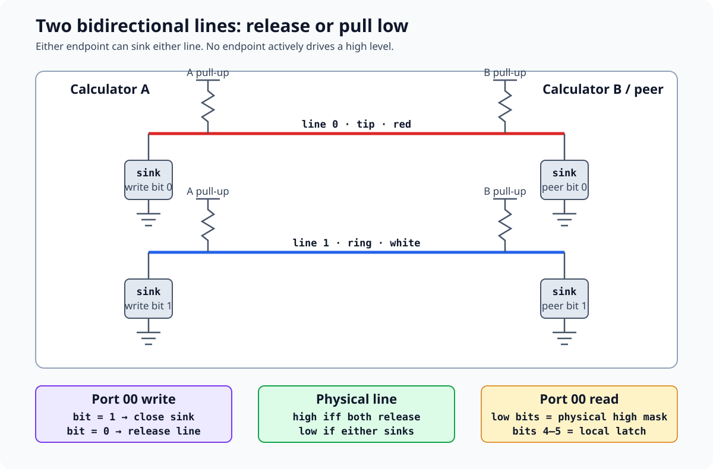

# Two-wire link port hardware

*TI-84 Plus OS 2.55MP — port `0x00`, raw bytes, and line handshakes.*

The 2.5 mm link port carries each byte over two bidirectional lines. This page reconstructs the port encoding, the four-transition bit handshake, timeout behavior, and background link detection.

The packet layer above these byte routines is covered in [Link / data transfer](sub-link-transfer.md). The hardware-assisted byte path is covered in [USB ASIC and link assist](sub-usb-asic.md).

## Evidence boundaries

The sources answer different questions:

| Source | What it establishes | Confidence |
|--------|---------------------|------------|
| OS 2.55MP bytes | Values written to port `0x00`, values accepted on reads, bit order, acknowledgements, and error branches | [confirmed] |
| TilEm and Wabbitemu | Two independent digital models of port reads, local output latches, connected endpoints, and link assist | [standard] where both match the public port contract |
| MAME 0.287 | A third raw-port implementation, optional link-bus devices, advertised assist state, and interrupt omissions | [standard] |
| Guarded TilEm link edge probe | Direct-core raw truth table, assist port map, byte transfers, status, interrupts, and reset retention | [standard] |
| Guarded Wabbitemu link edge probe | Initialized-core raw truth table, assist port map, byte transfers, status, and interrupts | [standard] |
| Guarded MAME raw-link probe | CPU-visible PCR readback, connector-facing output fields, peer inputs, and advertised-but-inert assist ports | [confirmed] for the pinned emulator run |
| TI Link Protocol Guide and WikiTI | Open-collector electrical description and red/tip versus white/ring names | [standard] |
| Physical measurements | Rise time, pull-up resistance, voltage thresholds, and ASIC-specific edge timing | [hypothesis] until measured on this hardware |

The code below therefore uses *line 0* and *line 1* for ROM-derived behavior. Connector names appear only where an external hardware source supplies them.

## Port `0x00` line encoding

The low two write bits are active-high drive controls. Setting a bit pulls that line low. Clearing it releases the line so the pull-up can make it high. The low two read bits have the opposite sense: a set bit reports a physically high line. [standard]

| Low write bits | Local action | Unopposed low read bits |
|----------------|--------------|-------------------------|
| `0` | release both lines | `3` |
| `1` | pull line 0 low | `2` |
| `2` | pull line 1 low | `1` |
| `3` | pull both lines low | `0` |



**Open-collector model.** The electrical contract is [standard]. OS 2.55MP's port values and bit order are [confirmed]; pull-up resistance, thresholds, and rise time remain [hypothesis] until measured.

Let `L` be the local two-bit pull-low mask and `P` the peer mask. TilEm computes the physical high-line mask as:

$$
H = \mathord{\sim}(L \mathbin{|} P) \mathbin{\\&} 3
$$

Wabbitemu uses the equivalent expression `((L | P) & 3) ^ 3`. Both models put the local output latch in read bits 4–5, giving `(L << 4) | H`. WikiTI documents the same latch behavior. [standard]

The ROM masks reads with `AND 0x03`, so the raw byte routines do not depend on
bits 2–7. The reusable model in `tools/link_port.py` keeps the physical contract
separate from implementation profiles. Its TilEm and Wabbitemu profiles use the
two line bits and bits 4–5 latch directly; its MAME profile also preserves the
internal PCR byte needed to reproduce that driver's expressions.

### Connector-contact names

The archived TI Link Protocol Guide calls line 0 red/tip and line 1 white/ring. WikiTI gives the same bit-to-contact mapping. It also describes both lines as open-collector outputs with pull-ups. [standard]

OS 2.55MP sends a zero bit with write `1` and a one bit with write `2`. That agrees with the guide's rule that zero pulls red/tip first and one pulls white/ring first. [confirmed] for the write values; [standard] for the physical contact names.

### Differential audio output

Software can use the two output controls as a three-level differential source.
If $V_0$ and $V_1$ denote the logical high/low levels of line 0 and line 1,
the idealized differential signal is $V_0 - V_1$: [standard]

| Port-`0x00` write | Line 0 | Line 1 | Idealized differential state |
|------------------:|--------|--------|------------------------------|
| `0` | released/high | released/high | zero |
| `1` | driven low | released/high | negative |
| `2` | released/high | driven low | positive |
| `3` | driven low | driven low | zero |

An interrupt routine can therefore write `1` and `2` for opposite polarities,
or use either equal-line state for the midpoint. This is the same
open-collector digital contract used by link transfers; it is not a separate
audio peripheral. The repository's `tools/badapple/README.md` describes one
software example and preserves the upstream program's oscillator and tracker
encoding. [standard]

The table does not specify voltage, output impedance, safe load, loudness, or
analog bandwidth. Those depend on the unmeasured pull-ups, ASIC drive behavior,
connector load, and edge timing. A physical calculator and load must be
measured before treating the idealized levels as an electrical schematic.
[hypothesis]

## Sending one byte at `3C:420D`

`_SendAByte = 4EE5`, body `3C:420D`, copies the byte from `A` to `C`. The model probe at `3C:420E` selects the link-assist path when available. The legacy path sends eight bits least-significant first. [confirmed]

```z80
3C:4214  LD B,8
3C:4216  LD DE,0xFFFF
3C:4219  RR C
3C:421B  JR NC,send_zero
3C:421D  LD A,2
3C:421F  JP drive_bit
send_zero:
3C:4222  LD A,1
drive_bit:
3C:4224  OUT (0),A
```

`RR C` places the next low bit in carry. Carry clear chooses write `1`; carry set chooses write `2`. Repeating the rotation eight times consumes the original byte from bit 0 through bit 7. [confirmed]

After driving the selected line, the sender polls until both lines read low:

```z80
3C:4226  IN A,(0)
3C:4228  AND 3
3C:422A  JP Z,acknowledged
3C:422D  IN A,(0)
3C:422F  AND 3
3C:4231  JP Z,acknowledged
3C:4234  DEC DE
3C:4237  JP NZ,0x4226
3C:423A  JP 0x2799
```

The receiver acknowledges by pulling the other line low. The combined read value becomes `0`. The sender then writes `0` to release its own line and waits for read value `3`, which means the receiver also released its acknowledgement. [confirmed]

```z80
acknowledged:
3C:423D  LD A,0
3C:423F  OUT (0),A
3C:4241  LD DE,0xFFFF
3C:4244  DEC DE
3C:4249  IN A,(0)
3C:424B  AND 3
3C:424D  CP 3
3C:424F  JP NZ,0x4244
3C:4252  DJNZ 0x4216
3C:4254  RET
```

## The four-transition handshake

Each bit uses the same four transitions. The sender chooses which line moves first; the receiver pulls the other line low; then each endpoint releases its own line. [confirmed]

| Phase | Sender drive | Receiver drive | Read value for bit 0 | Read value for bit 1 |
|-------|--------------|----------------|----------------------|----------------------|
| Sender asserts | `1` for bit 0; `2` for bit 1 | `0` | `2` | `1` |
| Receiver acknowledges | unchanged | the other line | `0` | `0` |
| Sender releases | `0` | unchanged | `1` | `2` |
| Receiver releases | `0` | `0` | `3` | `3` |

This is a level handshake, not a clocked UART waveform. Either endpoint can pause a transfer by delaying its next transition, up to the software or hardware timeout. Byte boundaries are supplied by the calling protocol rather than a separate wire symbol. [standard]

## Receiving one byte at `3C:447E`

`_RecAByteIO = 4F03`, body `3C:443F`, reaches the legacy receiver at `3C:447E` when the model probe does not select link assist. The receiver waits for a single-low state and rejects both-low. [confirmed]

```z80
3C:447E  LD B,8
3C:4486  LD DE,0xFFFF
3C:448B  IN A,(0)
3C:448D  AND 3
3C:448F  JR Z,link_error
3C:4491  CP 3
3C:4493  JP NZ,decode_bit
3C:4496  IN A,(0)
3C:4498  AND 3
3C:449A  JR Z,link_error
3C:449C  CP 3
3C:449E  JP NZ,decode_bit
```

Only read values `1` and `2` reach `decode_bit`:

| Initial read | Sender drove | Received bit | Receiver acknowledgement |
|--------------|--------------|--------------|--------------------------|
| `2` | line 0 with write `1` | 0 | write `2` |
| `1` | line 1 with write `2` | 1 | write `1` |

The comparison at `3C:44AA` also prepares carry for `RR C`. Read `2` makes carry clear, inserting a zero at bit 7. Read `1` makes carry set, inserting a one. After eight rotations, `C` contains the byte in its original order even though the wire bits arrived least-significant first. [confirmed]

```z80
decode_bit:
3C:44AA  CP 2
3C:44AC  JR Z,received_zero
3C:44AE  LD A,1
3C:44B0  OUT (0),A
3C:44B2  RR C
             ; wait until read 2: sender released line 1
received_zero:
3C:44DE  LD A,2
3C:44E0  OUT (0),A
3C:44E2  RR C
             ; wait until read 1: sender released line 0
```

Once the sender releases, the receiver writes `0`. It samples briefly for idle and uses `DJNZ` to begin the next bit. `_Rec1stByte` at `3C:439C` adds APD and first-activity handling before entering the same decoder. [confirmed]

## The TI-Keyboard error delimiter

Both-low has three context-dependent roles. It is the normal acknowledgement
midpoint after a receiver has recognized a single-low data bit. It is a link
error if the raw receiver sees both lines low before selecting a bit. The
TI-Keyboard decoder deliberately uses that otherwise exceptional condition as
a frame delimiter after prefix byte `0xE0`. [confirmed] for the ROM branches.

`_KeyboardGetKey = 50E9` resolves through the main bcall table to `3C:6D5E`.
After accepting `0xE0`, it calls `3C:6CC1`. The assist branch treats port-`0x09`
bit 6 as the expected delimiter; the legacy branch waits for a non-idle raw
state and accepts only the both-low value. A timeout or ordinary single-low
state returns status `0x02`. The decoder then calls `3C:6D17` for two bytes.
That helper compares the first with `0x01`, saves the comparison flags, receives
the second, and restores the flags before returning. The second byte is
therefore consumed as a scan code or modifier mask, but the public routine
replaces it with status `0x01`. [confirmed]

The complete accepted sequence is:

```text
0xE0
deliberate DBUS error / both lines low
0x01
scan code or modifier mask
```

The ROM establishes the receiver grammar and status control flow. WikiTI's
historical `_KeyboardGetKey` page independently says the TI-Keyboard transmits
the same sequence, but no physical capture was made for this reconstruction.
[standard] for that peripheral claim.

The explicit OS 2.55MP return tails are:

| Status | Tail | ROM condition |
|--------|------|---------------|
| `0x00` | `3C:6DA0` | No accepted raw or assist activity; the early no-assist return at `3C:6D6A` also leaves `A=0`. |
| `0x01` | `3C:6DDB` | Prefix and delimiter accepted; first following byte is `0x01`. |
| `0x02` | `3C:6DE2` | Ordinary receive did not produce `0xE0`, or the required delimiter condition failed. |
| `0xF9` | `3C:6D95` | Entry assist status has bit 6, but neither masked buffered-data/activity bit. |
| `0xFA` | `3C:6D8E` | Entry assist error has buffered data other than `0xE0`. |
| `0xFB` | `3C:6D87` | Entry assist error has buffered `0xE0`; cleanup and two additional reads follow. |
| `0xFC` | `3C:6DE9` | The first post-prefix byte is not `0x01`. |
| `0xFD` | `3C:6DF0` | The legacy prefix receive returned nonzero low-level status. |
| `0xFE` | `3C:6DF7` | The assist prefix receive returned nonzero status with `C != 0xE0`. |
| `0xFF` | `3C:6DFE` | The installed error handler caught a lower-level error. |

These descriptions follow the ROM branches rather than the historical status
list, which does not fully characterize the `0xFC` and `0xFD` paths.

## Timeouts and malformed states

The raw routines use loop counters, not a wall-clock register. CPU speed and I/O timing therefore affect the elapsed timeout. The fixed count alone does not justify a duration claim. [confirmed]

| Condition | ROM response | Evidence |
|-----------|--------------|----------|
| Sender never sees both-low acknowledgement | exhaust `DE = 0xFFFF`, then jump to `_JErrorNo` | `3C:4216`–`423A` [confirmed] |
| Peer never releases after acknowledgement | exhaust `DE = 0xFFFF`, then share the same `_JErrorNo` edge | `3C:4241`–`424F` [confirmed] |
| Receiver waits too long for a non-idle state | jump to `_ErrLinkXmit` | `3C:4486`–`44A7` [confirmed] |
| Receiver sees both lines low before acknowledging | jump to `_ErrLinkXmit` | `3C:448B`–`449A`, `3C:44F9` [confirmed] |
| Sender fails to release its selected line | exhaust `DE = 0xFFFF`, then jump to `_JErrorNo` | `3C:44B4`–`44C6`, `3C:44E4`–`44F6` [confirmed] |

`_ErrLinkXmit = 44D4`, body `00:278D`, loads error `0x9F` before the common error path. The include file names `0x9F` `E_LnkErr`. `_JErrorNo` at `00:2799` raises the error already stored by the surrounding link operation. [confirmed]

The send acknowledgement loop reads port `0x00` twice before decrementing `DE`. A cycle estimate that treats it as one read per iteration is incorrect. [confirmed]

## Header setup and idle recovery

The packet-header sender at `3C:41C3` prepares the transport before sending its four header bytes. On the raw path it writes `0`, requires low bits `3` for idle, and invokes the receive-status path when a peer already holds a line low. It loads the first header byte at `3C:41F8` and calls the byte sender at `3C:41FB`. [confirmed]

The receiver entry at `3C:43B4` repeatedly samples port `0x00` until the low bits differ from `3`. It then initializes the eight-bit decoder at `3C:43C5`. This separates the unbounded wait for the first activity from the bounded waits inside a byte. [confirmed]

## Background link detection and interrupts

The standard-timer handler contains a raw-line activity check. After its surrounding link-service gates pass, `ram:01B1` calls the hardware-model probe. The legacy branch reads `port 0x00 & 3`; a value other than `3` calls the common link-activity bjump at `ram:3FD5`. The assist branch instead checks `port 0x09 & 0x18`, pulses port `0x08`, and calls the same bjump. [confirmed]

This explains why OS input and timer activity can react to a peer that pulls one raw line low. It does not mean every port transition immediately vectors the Z80. Port `0x03` controls the legacy link-interrupt enable, while this specific silent-link check occurs inside `standard_timer1_irq` at `ram:0167`. [confirmed]

Port-`0x03` bit 4 also keeps link activity available as a wake source in the standard hardware interrupt block. The power-off path writes `0x11` before `HALT`, enabling ON and link wake while disabling the standard timers. [confirmed] for the ROM write; [standard] for the port-bit role.

Port-`0x04` bit 4 has lower OS dispatch priority than the three programmable timers and standard timer 2, but higher priority than ON and standard timer 1. The branch enters the power-restoration path at `ram:01E0`. See [Interrupts (IM1)](interrupts.md#dispatch-order-and-simultaneous-sources) for acknowledgement and simultaneous-source behavior. [confirmed]

## Error cleanup and the both-low abort pulse

### Callback provenance

`3C:618D` has one genuine direct caller, at `3C:614E`. Raw searches also find six `CALL 0x618D` instructions on page `05`, but those resolve to unrelated page-`05` code because both the call sites and destination occupy the same banked window. They are not callers of `3C:618D`. `analyze_rom_calls.py` now reports this inferred physical destination as `resolved_target`, which keeps same-address routines on different pages distinct. [confirmed]

The real entry chain starts at page-0 bjump stub `00:2D51`, whose inline descriptor resolves to `3C:6136`. Six higher-level paths load `HL=0x2D51` and call the error-callback installer at `00:27DA`: `36:4BAD`, `36:5B7D`, `3D:6D77`, `3D:6EE3`, `3D:6F10`, and `3D:6F40`. The callback examines `sndRecState` at `0x8672`. State `0x0A` immediately rethrows the pending error. State `0x15` follows an `ioFlag` bit-1 branch without reaching the pulse. Other states fall through `3C:614C`, call `3C:618D`, and then invoke page-0 stub `00:2F31`, which resolves to `07:7AC3` and stores `1` in `ioErrState`. This makes the routine part of installed link-error cleanup rather than an arbitrary command delay. [confirmed]

### Transport-specific cleanup

`3C:618D` first tests link-mode bit 5 at `(IY+0x1B)`. The bit is set by USB initialization elsewhere in the ROM. When it is set, the routine skips all raw port activity and calls `lnk_clr_busy_b` at `3C:4F32`. The raw branch performs this sequence: [confirmed]

```z80
3C:6193  call 6971h       ; lnk_set_busy
3C:6196  ld a,3
3C:6198  out (0),a        ; pull both raw lines low
3C:619A  call 0DBDh       ; save port 20; select speed mode 0
           ... delay ...
3C:61AE  call 0CF8h       ; restore saved port-20 bit 0
3C:61B1  ld a,0
3C:61B3  out (0),a        ; release both lines
3C:61B5  call 4F32h       ; lnk_clr_busy_b
3C:61B8  ret
```

The public DBus guide defines simultaneous assertion of both lines as the electrical error/abort condition. Error-callback provenance, explicit busy-state bracketing, the both-low/release waveform, and the USB bypass together identify `3C:618D` as the OS's transport abort cleanup; the pulse is specific to the raw two-wire path. [confirmed] for the ROM role; [standard] for the public waveform name.

### Exact software delay

The loop at `3C:619D`–`61AE` loads `HL=0xFFFF`. For every outer iteration it loads `A=4`, executes four padding `NOP`s, runs a four-iteration `DEC A`/`JR NZ` loop, decrements `HL`, and repeats until zero. Base Z80 timing is 7,077,785 T-states across 1,114,096 opcode fetches. Under the documented wait-state semantics, the OS's mode-0 configuration (`port 0x29=0x17`, `port 0x2E=0x45`) adds one T-state to each Flash opcode fetch, making the delay loop 8,191,881 T-states. At the nominal 6 MHz selected by `00:0DBD`, that is 1.3653135 seconds. `00:0CF8` later restores only bit 0 of the saved port-`0x20` byte, which is sufficient for the OS's normal modes `0` and `1` but would collapse modes `2` and `3`. The count excludes the surrounding calls and I/O instructions. [confirmed] for the base instruction and fetch counts; [standard] for the configured wait-state and nominal clock conversion.

The archived protocol guide describes an abort assertion of approximately 250 µs and a two-second maximum bit time. This OS deliberately holds the condition far longer than that example while remaining below the nominal two-second timeout. Physical CPU frequency, wait-state behavior, and line rise/fall time still need measurement before assigning an exact oscilloscope duration. [standard] for the guide; [hypothesis] for the physical waveform.

## Emulator comparison

The pinned sources implement materially different levels of the link stack.
These are executable software behaviors, not measurements of the ASIC.
[standard]

| Detail | TilEm `f56ad63` | Wabbitemu `48c2dc0` | MAME 0.287 | jsTIfied `20170706a` |
|--------|------------------|----------------------|------------|-----------------------|
| Raw write `1`/`2` reaches connector | yes | yes | no; both external lines are released | yes, through the browser link endpoint |
| Disconnected read after `1`/`2` | `0x12`/`0x21` | `0x12`/`0x21` | `0x12`/`0x21` | modeled raw-line latch and peer state |
| Peer pull-low affects reads | yes | yes | yes | yes |
| Read bits 4–5 | local low-two-bit latch | local low-two-bit latch | low write bits copied into PCR bits 4–5 | local output state |
| Link-assist advertisement | yes | yes | yes, through port `0x02 = 0xC3` | yes |
| Assist ports present | `0x08`–`0x0D` | `0x08`, `0x09`, `0x0A`, `0x0D` | only port `0x09`, fixed read zero | `0x08`–`0x0D` state machine |
| Assist byte transfer | implemented | implemented | absent | implemented |
| Raw-line activity interrupt | transition model present | no transition assertion in the raw port handler | absent from mask, status, and port handlers | modeled through link state changes |
| Driver status | usable link model | usable link model | `MACHINE_NOT_WORKING` | browser emulator source model |

### TilEm and Wabbitemu digital agreement

TilEm and Wabbitemu agree on the raw digital contract:

- each endpoint stores a two-bit pull-low mask;
- connected masks combine with OR because either endpoint can pull a line low;
- reads invert the combined mask so set bits mean physically high lines;
- read bits 4–5 report the local output latch.

TilEm's external-line setter detects a peer transition not already hidden by a
local low output and can assert the link-activity interrupt when port `0x03`
bit 4 enables it. Its link core also implements the four-phase assist state
machine and two-second emulator timeout policy. [standard]

Wabbitemu's port-`0x00` handler implements the same raw truth table, while its
virtual-cable sender and receiver implement the LSB-first handshake at a higher
level. The raw handler itself only updates and reads line masks; it does not
assert a link-activity interrupt when the client mask changes. Its assist
engine can assert CPU interrupts for read-ready, idle, and error conditions.
[standard]

Wabbitemu represents a disconnected calculator by making `client` point back
to its own `host` latch. OR-ing the latch with itself gives the expected idle
and self-drive reads. The separate `link_disconnect` function instead assigns
`client = NULL`, while the port handler unconditionally evaluates
`client[0]`. A subsequent port read can therefore dereference a null pointer.
This is an emulator lifecycle defect, not link-port behavior. [standard]

### Native TilEm raw and assist edges

A guarded direct-core run exercises TilEm's registered port handlers and link
state machine at commit `f56ad637d0524ee841dd381be6ecbaf5b8975600`.
The raw port produces the same 16-value local-major truth table shown for
Wabbitemu below. Writing `0xA6` gives `0x21`. Pulling peer line 0 low while the
local latch is zero gives `0x02` and asserts the link-activity interrupt when
port-`0x03` bit 4 enables it. [standard]

TilEm maps all six assist ports from `0x08` through `0x0D`. A fresh disabled
engine reads status `0x20`. Writes `0x91`, `0xA2`, `0xB3`, and `0xC4` to
ports `0x09`–`0x0C` remain in internal auxiliary registers, while the read
sides continue to return computed status or zero. [standard]

Enabling idle-ready produces status `0x22` and asserts the CPU interrupt.
Reading port `0x0D` leaves both conditions unchanged. Sending `0xA5` drives
`2,1,2,1,1,2,1,2`, least-significant bit first, and returns to `0x22` after
eight controlled acknowledgements. Receiving the same byte completes at
`0x31`; reading port `0x0A` returns `0xA5` and changes status to `0x20`.
[standard]

An illegal both-low receive state produces status `0x64` and asserts the CPU
interrupt. The first port-`0x09` read clears the interrupt request but retains
the error flag, so the next status is `0x60`. Full reset restores port
`0x08 = 0x80` and clears active assist state. It retains the four auxiliary
registers and the externally supplied peer-line state. Direct port calls add
zero modeled CPU clocks. These are initialized-core TilEm behaviors, not
TI-OS execution, electrical measurements, or physical reset guarantees.
[standard]

### Native Wabbitemu raw and assist edges

A guarded initialized-core run exercises the registered Wabbitemu handlers.
The raw port produces this local-major matrix, with peer masks across each row:
[standard]

| Local drive | Peer `0` | Peer `1` | Peer `2` | Peer `3` |
|-------------|----------|----------|----------|----------|
| `0` | `0x03` | `0x02` | `0x01` | `0x00` |
| `1` | `0x12` | `0x12` | `0x10` | `0x10` |
| `2` | `0x21` | `0x20` | `0x21` | `0x20` |
| `3` | `0x30` | `0x30` | `0x30` | `0x30` |

Writing `0xA6` gives `0x21`, so bits 2–7 do not alter the two-bit drive
latch. Pulling peer line 0 low while the local latch is zero gives `0x02`.
That peer-state change leaves the CPU interrupt line clear even when
port-`0x03` bit 4 is enabled, matching the absence of transition logic in the
raw handler. The probe assigns a controlled peer mask directly; it does not
exercise Wabbitemu's connection or disconnection lifecycle. [standard]

The initialized assist block maps ports `0x08`, `0x09`, `0x0A`, and `0x0D`.
Ports `0x0B` and `0x0C` are absent and reject reads. Port `0x08` resets to
`0x80`, while status and both data latches reset to zero. Enabling idle-ready
interrupts produces status `0x22` and asserts the CPU line. Reading port
`0x0D` clears ready and returns status to zero. [standard]

Writing byte `0xA5` to port `0x0D` drives masks
`2,1,2,1,1,2,1,2`, least-significant bit first. Eight controlled peer
acknowledgements complete the transfer with status `0x22`; reading port
`0x0D` returns `0xA5` and clears ready. The receive direction reconstructs
`0xA5`, reports status `0x11`, asserts the CPU line, and clears read-ready when
port `0x0A` is read. These transitions use Wabbitemu's device evaluator, not
TI-OS or a physical cable. [standard]

The pinned source contains no assignment that raises the assist error field.
The probe seeds that internal field to test its observable contract. With
error interrupts enabled and a single-low peer state being received, status
is `0x4C` and the CPU line asserts. The first status read clears error; the
second reads `0x08`, retaining only the receiving flag. This verifies the
read-to-clear handler but does not establish a naturally reachable error path.
[standard]

### MAME's readback-versus-connector split

MAME's TI-Plus write handler copies write bits 0–1 into internal PCR bits 4–5.
Its read handler masks the peer inputs with the inverse of those PCR bits.
Consequently, ordinary disconnected reads reproduce the public contract:
[standard]

| Write | MAME PCR after reset | Local latch | Disconnected read |
|-------|----------------------|-------------|-------------------|
| `0x00` | `0x00` | `0` | `0x03` |
| `0x01` | `0x10` | `1` | `0x12` |
| `0x02` | `0x20` | `2` | `0x21` |
| `0x03` | `0x30` | `3` | `0x30` |

A guarded MAME 0.287 run reproduces these reads through the main CPU I/O
space: `03`, `12`, `21`, and `30`. It then writes zero to the PCR and injects
the four peer pull-low masks through the link-port device's saved input fields.
The resulting reads are `03`, `02`, `01`, and `00`. This confirms that the
live read handler observes both the PCR latch and peer input state. [confirmed]

The connector callbacks use different bits. MAME drives tip low only when
write bits 2 and 4 are both set, and ring low only when bits 3 and 5 are both
set. Normal OS writes `1` and `2` satisfy neither pair and therefore release
both external lines. Values `0x14` and `0x28` drive tip and ring respectively,
but those are not the TI-84 Plus raw protocol values. A local MAME program can
thus read an apparently correct self-latch while a connected link-bus device
sees no asserted bit. [standard]

The guarded run reads MAME's connector-facing `m_tip_out` and `m_ring_out`
save items after every write. Values `0x00`–`0x03` leave both at `1`, meaning
released. Write `0x14` changes the pair to `0,1`; `0x28` changes it to `1,0`;
and `0x3C` changes it to `0,0`. These are internal MAME device levels. The run
does not attach an optional link device or observe a physical connector.
[confirmed]

MAME's reusable link-bus layer has a four-phase bit/byte implementation,
one-second timeout placeholders, collision handling, and optional bit-socket,
Graph Link, tee, and speaker devices. The TI-84 Plus host handler's mismatched
control bits prevent normal raw writes from reaching those devices. The
presence of the generic bus layer does not repair the calculator-side wiring.
[standard]

MAME also returns port `0x02 = 0xC3`, advertising link assist through bit 6,
while its TI-84 Plus I/O map omits ports `0x08`, `0x0A`, `0x0B`, `0x0C`, and
`0x0D`. Port `0x09` alone returns zero. OS 2.55MP therefore selects an assist
path that this driver cannot execute. The driver also ignores port-`0x03` bit
4 and never reports port-`0x04` link activity. [standard]

The same native run reads port `0x02 = C3`. Ports `0x08`–`0x0D` all return
zero before and after distinct writes `A8`–`AD`. The runtime result proves
that no writable assist state is visible through those six ports. It cannot
distinguish the fixed-zero handler at port `0x09` from the five unmapped
ports; the pinned I/O map establishes that distinction. [confirmed] for the
runtime values; [standard] for handler coverage.

The emulator agreement corroborates the raw state transitions only where the
implementations actually agree. None establishes analog voltage thresholds,
pull-up values, connector wear behavior, or edge timing on a physical TI-84
Plus. Those analog details remain hypotheses until measured. [hypothesis]

## Reusable debugging tools

`tools/link_port.py` provides the wired-AND model, port-read decoder, byte
encoding, receive assembly, four-phase trace, and pinned implementation
profiles. `tools/describe_link_port.py` exposes those operations as a CLI:

```sh
nix develop -c python tools/describe_link_port.py profiles
nix develop -c python tools/describe_link_port.py drive 0x02
nix develop -c python tools/describe_link_port.py wire --local 1 --peer 2
nix develop -c python tools/describe_link_port.py byte 0xA5
nix develop -c python tools/describe_link_port.py receive 1 2 1 2 2 1 2 1
nix develop -c python tools/describe_link_port.py compare 1 2 0
nix develop -c python tools/describe_link_port.py emulator mame 0x14 0x28
nix develop -c python tools/describe_link_port.py abort-pulse
nix develop -c python tools/describe_link_port.py keyboard \
  --prefix 0xE0 --delimiter-error --command 0x01 --data 0x42
nix develop -c python tools/describe_link_port.py keyboard-path \
  --assist-status 0x50 --buffered 0xE0
nix develop -c python tools/describe_link_port.py keyboard-rom
```

Add `--json` before the subcommand for machine-readable output. The model uses neutral line numbers so a trace remains valid even when the physical contact mapping is under review.
The `keyboard-rom` command verifies the `0x50E9` bcall entry and hashes the
three OS 2.55MP byte regions that support the decoder; it rejects a different
control-flow body instead of applying the fixed status model silently.

### Prepared physical readback matrix

The [raw two-wire link probe](hardware-probes.md#raw-two-wire-link-probe) writes
all four low-bit drive states and records the complete port-`0x00` byte after 0,
1, 4, and 16 `NOP` instructions. It repeats each point 16 times, compares the
exported result with `port_read_value` from the reusable model, and releases
both lines during cleanup. The decoder reports low-line, local-latch,
exact-byte, stability, and idle-cleanup results separately. [confirmed] for the
probe bytes and decoder; [hypothesis] for pending physical samples.

The matrix must run with an empty connector because it preconditions both lines
low before every target write. It can test the public disconnected truth table
and bound a CPU-visible settling change. It cannot measure analog rise time or
voltage without external instrumentation.

Run the guarded TilEm matrix with the pinned clean source tree:

```sh
tilem_link_tmp=$(mktemp -d /tmp/ti84-tilem-link.XXXXXX)
git clone https://github.com/debrouxl/tilem.git "$tilem_link_tmp/tilem"
git -C "$tilem_link_tmp/tilem" checkout \
  f56ad637d0524ee841dd381be6ecbaf5b8975600
nix shell \
  github:NixOS/nixpkgs/f13ff45afd1bb73e640eaa08a7066dbed07e3238#gcc \
  --command python tools/build_tilem_link_probe.py \
  --source "$tilem_link_tmp/tilem" \
  --output "$tilem_link_tmp/tilem-link-probe" --json

tilem_link_parent=$(mktemp -d /tmp/ti84-tilem-link-report.XXXXXX)
python tools/run_tilem_link_probe.py \
  --binary "$tilem_link_tmp/tilem-link-probe" \
  --expected-binary-sha256 \
    b878d9be860a92da72c5712e82a4c2974fb3cad125e078e61f8444172b887896 \
  --output-dir "$tilem_link_parent/run" --json
```

`tools/tilem_link.py` derives the expected raw matrix, byte order, assist
status, acknowledgement, and reset boundary from `tools/link_port.py`. The
guarded runner records the source tree, exact binary, native report, and
evidence scope.

Run the guarded Wabbitemu matrix with:

```sh
wabbit_link_parent=$(mktemp -d /tmp/ti84-wabbit-link.XXXXXX)
python tools/run_wabbitemu_link_edge_probe.py \
  --rom tools/rom.bin \
  --binary "$wabbit_tmp/wabbitemu-headless" \
  --output-dir "$wabbit_link_parent/run" --json
```

`tools/wabbitemu_link_probe.py` derives the raw matrix, byte order, mapped
ports, and assist status from the reusable model. The guarded CLI requires the
exact ROM and records the ROM and binary hashes.

Run the guarded MAME raw-link matrix with:

```sh
mame_link_parent=$(mktemp -d /tmp/ti84-mame-link.XXXXXX)
nix shell nixpkgs#mame --command python tools/run_mame_link_probe.py \
  --expected-mame-sha256 \
    fc5f4aba1aa6eb115d66decad13bb3f5313b9f3be9cff7c785d8d88e3fca0b91 \
  --output-dir "$mame_link_parent/run" --json
```

`tools/mame_link.py` derives every expected read and connector output from
`tools/link_port.py`. The guarded CLI retains the exact MAME, ROM, Lua script,
native report, and parsed oracle identities. It does not execute a TI-OS
transfer or attach a virtual cable.

## Resolved findings and open hardware tests

- [confirmed] `_SendAByte` writes `1` for bit 0 and `2` for bit 1, least-significant bit first.
- [confirmed] The receiver maps initial read `2` to bit 0 and read `1` to bit 1, then acknowledges on the other line.
- [confirmed] Both-low is the acknowledgement midpoint during a valid transfer, but it is an error when a receiver sees it before choosing a bit.
- [confirmed] `_KeyboardGetKey` deliberately accepts that error condition after prefix `0xE0`, then consumes command `0x01` and one data byte while returning status `0x01`.
- [confirmed] The installed error callback reaches `3C:618D` for applicable transfer states; its raw branch brackets a both-low pulse with link-busy state and its USB branch skips the raw lines.
- [confirmed] The raw delay loop is 7,077,785 base T-states and 8,191,881 T-states with the OS's mode-0 Flash opcode wait.
- [confirmed] The standard-timer path detects non-idle raw lines and routes them to the OS link-activity handler.
- [standard] Port reads use active-high physical levels, writes use active-high pull-low controls, and bits 4–5 reflect the local output latch.
- [standard] Public hardware references map bit 0 to red/tip and bit 1 to white/ring.
- [standard] TilEm and Wabbitemu reproduce the raw open-collector truth table.
- [confirmed] The prepared `HWLINK` probe encodes the four-state, four-delay,
  16-trial matrix and releases both lines during cleanup; no physical AppVar has
  been recorded.
- [standard] The guarded TilEm run verifies the raw matrix, activity interrupt, all six assist handlers, LSB-first `0xA5` transfers, status and data acknowledgement, sticky error flag, auxiliary-register retention, and external-line retention across reset.
- [confirmed] The guarded MAME run reproduces its local readback and peer-input matrix while normal writes `1` and `2` leave both modeled connector outputs released.
- [standard] The guarded Wabbitemu run verifies the complete raw matrix, absent assist ports `0x0B`/`0x0C`, idle-ready and read-ready interrupts, LSB-first `0xA5` send and receive, data-register acknowledgement, and seeded-error read-to-clear behavior.
- [confirmed] MAME reports port `0x02 = C3`, while ports `0x08`–`0x0D` remain zero before and after patterned writes.
- [standard] MAME's source map gives port `0x09` a fixed-zero handler and omits the other five assist ports.
- [hypothesis] Physical tests must measure pull-up resistance, high/low thresholds, line rise time, timeout duration at both CPU speeds, and the actual duration and voltage waveform of the `3C:618D` abort pulse.

## External references

- [WikiTI port `0x00`](https://wikiti.brandonw.net/index.php?title=83Plus:Ports:00) — public bit meanings and output-latch behavior; treated as a secondary source.
- [TI Link Protocol Guide](https://www.ticalc.org/archives/files/fileinfo/247/24750.html) — archived open-collector, contact-name, four-transition, abort-condition, and timeout description.
- [WikiTI `_KeyboardGetKey` revision 5510](https://wikiti.brandonw.net/index.php?title=83Plus:BCALLs:50E9&oldid=5510) — historical peripheral sequence; treated as secondary literature and checked against the ROM decoder.
- [TilEm link core at `f56ad63`](https://github.com/debrouxl/tilem/blob/f56ad637d0524ee841dd381be6ecbaf5b8975600/emu/link.c) and [`x4_io.c`](https://github.com/debrouxl/tilem/blob/f56ad637d0524ee841dd381be6ecbaf5b8975600/emu/x4/x4_io.c) — raw lines, activity interrupt, link assist, and timeout policy.
- [Wabbitemu `83psehw.c` at `48c2dc0`](https://github.com/sputt/wabbitemu/blob/48c2dc0e6d1d87bb5cf9611efbeb0d048b19c422/hardware/83psehw.c) and [`link.c`](https://github.com/sputt/wabbitemu/blob/48c2dc0e6d1d87bb5cf9611efbeb0d048b19c422/hardware/link.c) — raw port, assist engine, virtual-cable handshake, and disconnect lifecycle.
- [MAME 0.287 `ti85.cpp`](https://github.com/mamedev/mame/blob/mame0287/src/mame/ti/ti85.cpp), [`ti85_m.cpp`](https://github.com/mamedev/mame/blob/mame0287/src/mame/ti/ti85_m.cpp), and [`ti8x.cpp`](https://github.com/mamedev/mame/blob/mame0287/src/devices/bus/ti8x/ti8x.cpp) — I/O coverage, PCR expressions, connector callbacks, and generic link-bus state machine.
- [jsTIfied deployed `20170706a` artifact](https://www.cemetech.net/projects/jstified/jstified_compressed.js?20170706a) and [readable mirror](https://github.com/Quuxplusone/ti83/blob/56246a1181f90123a843ea17eb9e0f2fcda65113/jstified.js) — fourth raw-line, browser endpoint, and link-assist implementation.
