# Memory management (RAM heap & Flash archive)

How the OS allocates the ~24 KiB of user RAM between variables, temporaries, the FP stack, and the program being run — and how it offloads variables to Flash ("archive").

## The RAM heap [standard]

The dynamic region runs from `userMem` (`0x9D95`) up to `symTable` (`0xFE66`). Two structures grow toward each other with free RAM in the middle:

```mermaid
flowchart TB
    A["0xFE66 · symTable — top of user RAM"]
    B["VAT — variable names + metadata<br/>type, data ptr/page, name · grows DOWNWARD ↓"]
    C["( free RAM )"]
    D["user data — variable contents<br/>grows UPWARD ↑"]
    E["0x9D95 · userMem — bottom of user RAM"]
    A --- B --- C --- D --- E
    style C fill:#1b1b1b,stroke-dasharray:5 5
```

VAT entry layout: type, data ptr/page, name — see [variables-vat.md](variables-vat.md).

Boundary/work pointers (clustered at `0x9820-0x983A`) [confirmed]:

| Ptr | Addr | Role |
|-----|------|------|
| `tempMem` | `0x9820` | base of the temporary area |
| `fpBase` | `0x9822` | floating-point stack base |
| `FPS` | `0x9824` | FP stack pointer (grows; `_PushReal`/`_PopReal`) |
| `OPBase` | `0x9826` | base of OP/symbol scratch |
| `OPS` | `0x9828` | OP/symbol scratch stack pointer (top) |
| `pTemp` | `0x982E` | temp-variable pointer |
| `progPtr` | `0x9830` | currently-executing program pointer |
| `pagedBuf` | `0x983A` | paged scratch buffer |

`_MemChk` reports free RAM as `(OPS) − (FPS)` (the pointers at `0x9828`/`0x9824`) `+ 1`, i.e. the span between the floating-point stack and the operand/symbol stack in the middle of the region (the conceptual picture above: user data grows up, the VAT grows down, free RAM in the middle). When a variable grows/shrinks, everything above it shifts.

## Core allocation primitives [confirmed]

- `_InsertMem` (`ram:0F81`) — open a gap of `HL` bytes at address `DE` by shifting all memory above it up. It calls `insertmem_setup` (`ram:0F8B`), which does the `LDDR` block move (at `ram:0FA1`), then `delmem_fixup_tail` (`ram:1398`) to fix up pointers. `_InsertMem` does not check free space itself — callers must ensure room first via `_EnoughMem` (the wrapper `_ErrNotEnoughMem` at `ram:1735` calls `_EnoughMem` then jumps to `_ErrMemory` at `ram:2721` on shortfall).
- `_DelMem` (`ram:1368`) — the inverse: close a gap, shifting memory down.
- `_EnoughMem` (`ram:0FA6`) — ensure N free bytes; if short, it walks the temp/scratch entries (9-byte stride from `pTemp` down to `OPBase`) and `_DelVar`s reclaimable temporaries to make room. [confirmed]
- `_MemChk` (`ram:0E20`) — compute current free RAM.

Variable-creation bcalls — `_CreateReal`, `_CreateStrng`, `_CreateAppVar`, `_CreateRList`, etc. (see [Variables & the VAT](variables-vat.md)) — share a create body (`_CreateReal` at `ram:10B8` jumps into `ram:1011`) that carves space via an internal gap routine at `ram:0F0C` — which does its own block move and updates the temp/FP-stack pointers, not the public `_InsertMem` — then registers the variable in the VAT.

## Flash archive [confirmed]

To save scarce RAM, variables can be archived to Flash. The archive entry point is on `flash page 0x07`, while the low-level flash read/write/erase workers are on `page 0x3D`:
- `_Arc_Unarc` (`07:6248`) — move OP1's variable between RAM and the Flash archive (toggles the archive bit, then relocates the data and rewrites the VAT entry's page to the Flash page).
- `_FlashToRam` (id `5017` → body `3D:6745`) — copy archived data back into RAM.
Archived vars are *appended* to Flash, which cannot be overwritten in place, so deleting one only marks it dead. `archive_gc_collect` at `3C:7733` rewrites live records in 64 KiB sector units and erases the old sectors. `gc_show_screen` at `3C:7E0D` displays `"Garbage"` and `"Collecting..."` from page `01`. The collector also journals its phase in the inactive 8 KiB half of page `3E`. [confirmed]

`_CleanAll` is RAM cleanup (not Flash GC) [confirmed]: `_CleanAll` (`07:52CF`) compacts the floating-point stack down to `tempMem` (`fpBase`/`FPS`) and the OP/scratch stack down to `pTemp` (it sets `OPBase = pTemp`, `LDDR`s the live span down, and sets `OPS` to its new top), reclaiming temporary RAM after a command/expression finishes. It does not touch Flash.

Flash is erased a physical sector at a time but programmed byte by byte. `archive_write_record` at `3D:64AA` calls `_WriteAByte` (`8021`) and `_WriteFlashUnsafe` (`8087`) through the Flash-control port `0x14`. See [Flash memory](flash-memory.md) for the hardware and boot-bcall path, and [Variables, archive & unarchive](sub-vat-archive.md) for record format and allocation. [confirmed]

- `_FlashToRam` (`3D:6745`) copies archived bytes through a worker at `0x8100`.
  `ram_worker_launcher` at `3D:678C` installs that worker. The same launcher
  also runs the internal certificate-page program worker. [confirmed]
- `archive_find_free_span` (`3D:62C2`) scans upward from page `08` to the dynamic App boundary from `archive_app_boundary` (`3D:6413`). The OS-only trace returns boundary `0x29` and selects `08:4000`. [confirmed]
- `archive_write_record` (`3D:64AA`) writes record states `0xFE` then `0xFC`; the helpers at `3D:7C8F`, `3D:7C93`, and `3D:7C97` implement additional monotonic bit-clears. [confirmed]
- Archive workers: `_Arc_Unarc` (`07:6248`) → `arc_ram_to_flash` (`07:6107`, RAM→Flash) / `arc_flash_to_ram` (`07:61F4`, Flash→RAM). (`_Arc_Unarc` dispatches on the FindSym page byte `B`: `B==0`/in-RAM → `6107` archive, `B≠0`/in-Flash → `61F4` unarchive.)

The `_FindSym` VAT walk, public Flash workers, and normal garbage-collection path are byte-verified in [Variables, archive & unarchive](sub-vat-archive.md) and [Flash memory](flash-memory.md). TilEm and Wabbitemu restart successfully from each persistent phase marker. Physical power loss at those markers and cuts during busy commands remain untested. [confirmed] for the emulator command-boundary runs; [hypothesis] for physical interruption behavior.
