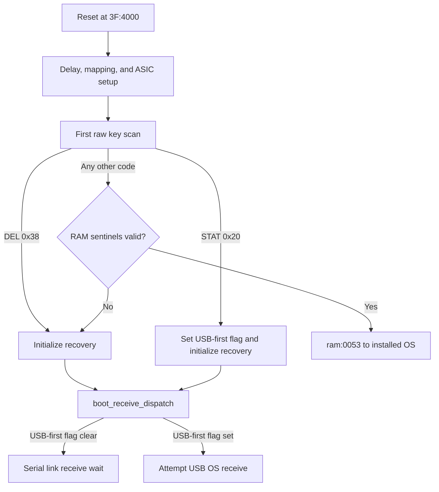

# Retail boot page

*TI-84 Plus OS 2.55MP — page layout, startup dispatch, recovery, and validation.*

Flash page `3F` is the calculator's retail boot block. It owns the reset stub,
the `0x8xxx` bcall table, OS-validation and certificate services, the serial
recovery receiver, and the hardware setup that hands control to either the
installed OS or an installer. [confirmed]

This page maps that control plane. See
[Retail boot hardware initialization](boot-hardware.md) for the register-level
reset sequence and the destructive hardware diagnostics.

## Evidence boundaries

| Evidence | What it establishes | Confidence |
|----------|---------------------|------------|
| OS 2.55MP page `3F` bytes | page layout, instructions, direct branch targets, table entries, and validation checks | [confirmed] |
| Rebuilt Ghidra database | function boundaries and cross-references within page `3F` and the USB payload on page `2F` | [confirmed] |
| Four reset-origin TilEm traces | ordinary, DEL-held, STAT-held, and MODE-held startup behavior in the pinned emulator | [confirmed] for those runs |
| Full 2007 `ti83plus.inc` | official names for 83 of the 87 callable table entries | [confirmed] |
| Physical calculator with a sending peer | electrical link/USB behavior and a complete installer transaction | [hypothesis] until measured |

The checked trace reduction is `tools/retail-boot-traces.json`. Its ROM hash,
emulator source commit, emulator-binary hash, trace hashes, visit counts, and
first-visit clocks keep each dynamic claim tied to a specific run. The raw
TLMT traces are too large for the repository and remain external.

## Physical layout

Boot version `1.03` partitions page `3F` as follows: [confirmed]

| Page-`3F` range | Contents |
|-----------------|----------|
| `3F:4000`–`3F:400E` | reset stub |
| `3F:400F`–`3F:4017` | NUL-terminated version string and header data |
| `3F:4018`–`3F:40D4` | 63 bcall entries, IDs `0x8018`–`0x80D2` |
| `3F:40D5`–`3F:40E3` | bank/return dispatch stub, not bcall entries |
| `3F:40E4`–`3F:412B` | 24 bcall entries, IDs `0x80E4`–`0x8129` |
| `3F:412C`–`3F:7E4D` | executable code and data |
| `3F:7E4E`–`3F:7FFF` | 434 erased bytes (`0xFF`) |

The table therefore has 87 populated three-byte entries in two ranges, not
one continuous range. Treating `3F:40D5`–`3F:40E3` as five more entries
decodes executable stub bytes as bogus targets. `tools/bcall_tables.py` rejects
those reserved IDs. [confirmed]

Each real entry stores a little-endian target address followed by a page byte.
Eighty-one targets stay on page `3F`; six enter the companion USB boot payload
on page `2F`. The public include file names 83 entries. These four populated
slots lack public equates: [confirmed] for addresses and bytes; routine names
and summaries are inferred.

| ID | Body | Inferred role |
|----|------|---------------|
| `0x804E` | `certificate_reconcile_id_fields` at `3F:4924` | reconcile calculator-ID certificate fields and rewrite the certificate/validation data |
| `0x8066` | `certificate_find_matching_field_data` at `3F:4F91` | find matching data under certificate field `0x0310` and subfield `0x0610` |
| `0x8069` | `certificate_count_matching_fields` at `3F:4EFF` | count or match certificate fields beginning with field `0x0300` |
| `0x810B` | `usb_set_port81_bit0_delay` at `2F:62C5` | set bit 0 of USB port `0x81`, then delay |

The three certificate summaries agree with the comments beside their unnamed
slots in `ti83plus.inc`. The `0x804E` body also calls certificate erase/write,
RSA-validation, and `_WriteValidationNumber` services. These semantic names
remain [hypothesis] pending complete caller and data-format reconstruction.

## Reset dispatch

After the delay, memory-map transition, and ASIC initialization, the reset path
calls the raw keypad scanner and reaches `boot_startup_dispatch` at `3F:422D`.
Only two scan codes have first-scan boot meanings: [confirmed]

```z80
3F:422D  call raw_key_scan
3F:4230  cp 0x38             ; DEL
3F:4232  jp z,3F:4279
3F:4235  cp 0x20             ; STAT
3F:4237  jr z,3F:4270
```

All other keys, including MODE (`0x37`), take the fast installed-OS check:
[confirmed]

```z80
3F:4238  ld a,(0x0038)
3F:423B  cp 0xFF
3F:423F  ld hl,(0x0056)
3F:4242  ld bc,0xA55A
3F:4246  sbc hl,bc
3F:4248  jp z,0x0053
```

The jump requires byte `0x0038 != 0xFF` and word `0x0056 = 0xA55A`.
`ram:0053` jumps to `ram:0C4F`, the installed-OS handoff body. A failed check
enters recovery initialization at `3F:42B3`. [confirmed]



The following trace outcomes distinguish those branches: [confirmed] for the
pinned emulator runs.

| Held key | First scan | Observed endpoint within the trace |
|----------|------------|------------------------------------|
| none | `0x00` | `ram:0053`, then `ram:0C4F` |
| DEL | `0x38` | `boot_link_receive_wait` at `3F:63B2` |
| STAT | `0x20` | `_AttemptUSBOSReceive` at `2F:4145` |
| MODE | `0x37` | `ram:0053`, then `ram:0C4F` |

The DEL and STAT runs both display `Waiting...`, `Please install`, `operating`,
and `system now`. DEL enters the page-`3F` serial-link wait without visiting
the page-`2F` USB attempt. STAT sets bit 5 at `IY + 0x1B`, reaches the USB
attempt, and does not return to the serial wait during the three-second run.
[confirmed]

## The orphan MODE dispatcher

`boot_mode_diagnostic_dispatch` at `3F:427E` contains another raw key scan,
compares its result with MODE (`0x37`), and can jump to
`boot_flash_ram_diagnostic` at `3F:4504`. It is not part of the reset dispatch
described above. [confirmed]

No direct page-`3F` branch or call targets `3F:427E`, and none of the four
reset-origin traces visits it. In particular, holding MODE at reset produces
scan code `0x37` at `3F:4230` and hands off to the installed OS; it visits
neither `3F:427E` nor `3F:4504`. [confirmed]

An undiscovered computed entry remains possible, so the stronger claim that
the block is unreachable under every boot-page state is [hypothesis]. Directly
entering `3F:427E` with a MODE result does select the destructive Flash/RAM
diagnostic documented on the hardware page. [confirmed]

## Recovery initialization and transport

`boot_recovery_init` at `3F:42B3` selects CPU speed 1, restores the runtime
mapping with RAM page `0x81` in window B, initializes the link port and LCD,
and clears RAM from `0x8000` through `0xFE70`. It then displays the installer
prompt and enters `boot_receive_dispatch` at `3F:5C7E`. [confirmed]

The first-scan key determines the initial transport:

- DEL enters the ordinary recovery initializer and reaches
  `boot_link_receive_wait` at `3F:63B2`. [confirmed]
- STAT first sets bit 5 of the boot flag byte at `IY + 0x1B`. The receive
  dispatcher observes that flag and calls `_AttemptUSBOSReceive` at
  `2F:4145`. [confirmed]

The traces stop while each path waits for a peer. They prove transport
selection, not receipt, signature validation, Flash programming, fallback
after a USB error, or a successful reboot. Those end-to-end behaviors require
a controlled sending peer. [hypothesis]

## OS validation and invalid-image handling

The fast reset path deliberately uses only the RAM sentinel at `0x0038` and
handoff marker `0xA55A` at `0x0056`. It does not call `_CheckOSValidated`.
[confirmed]

Recovery and diagnostic paths can instead call `boot_check_os_validated` at
`3F:43A9`. That predicate rejects `ram:0026 = 0xFF`, opens the protected Flash
gate, invokes `_CheckOSValidated` (`0x809C`, body `3F:52C6`), closes the gate,
and, on its zero-result path, tail-checks the same `0xA55A` marker in
`boot_check_os_handoff_marker` at `3F:4425`. [confirmed]

Error handling at `3F:57E2` can transfer to `boot_erase_invalid_os` at
`3F:4308` after that full validation fails. The routine reinitializes recovery
state, validates again, erases Flash page 0 if the image remains invalid,
closes the protected gate, and enters a power/HALT loop. [confirmed]

This split matters when interpreting a normal trace: reaching the installed
OS proves that the two RAM markers passed on that boot, not that the trace
executed a fresh certificate or cryptographic validation. [confirmed]

## Reproduction

Capture each macro from reset with the pinned TilEm build, `--normal-speed`,
and `--trace-range all`, as described in `tools/dynamic-tracing.md`. Reduce the
four TLMT files with: [confirmed]

```sh
PYTHONPATH=tools python tools/analyze_retail_boot.py \
  --rom tools/rom.bin \
  --trace normal=/tmp/retail-boot-normal.trace \
  --trace del=/tmp/retail-boot-del.trace \
  --trace stat=/tmp/retail-boot-stat.trace \
  --trace mode_ignored=/tmp/retail-boot-mode-ignored.trace \
  --output tools/retail-boot-traces.json
```

The corresponding macros are `tools/macros/boot-idle.macro`,
`tools/macros/boot-del-recovery.macro`,
`tools/macros/boot-stat-recovery.macro`, and
`tools/macros/boot-mode-ignored.macro`. The reducer validates the ROM and
emulator hashes before replacing the checked report.
