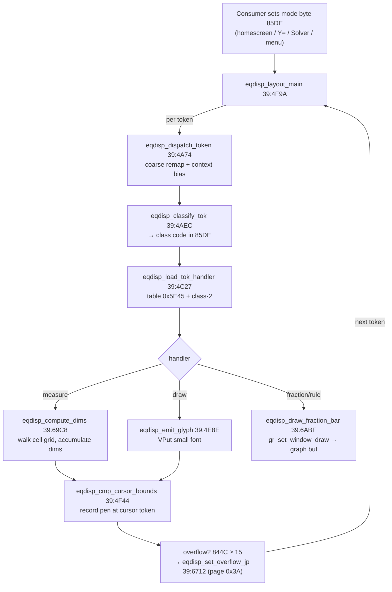

# Equation Display (MathPrint pretty-printer)

*TI-84 Plus OS 2.55MP — feature deep dive.*

How the OS lays a tokenized expression out as **2-D text** — the engine behind the homescreen entry line, the **Y= editor**, the **Solver** equation line, and catalog/menu rendering. It is the single largest subsystem on **flash page 0x39** (147 named functions, 112 with the `eqdisp_*` prefix; the rest are menu/solver helpers). It is the inverse of parsing: a token stream → pixels, with nesting, fraction bars, superscripts, radicals, and indentation, instead of evaluation.

> Related: [Tokenizer & TI-BASIC](07-tokenizer-basic.md) (the token format it consumes), [Display & LCD](08-display-lcd.md) (the glyph blitter and graph buffer it drives), [Solver & Numerical Methods](sub-solver-numeric.md) (a consumer of the equation line).

## What the engine actually is

There is **no float "box-tree"**. MathPrint is a **cell-grid typesetter**: it walks the token stream and assigns each piece to a cell on a grid of *rows × columns*, where a column is ~7 px wide and each row carries its own height. Stacked structures (fractions, exponents) consume extra rows; the renderer turns each `(row, col)` cell into a pixel `(x, y)` and emits a glyph there. State lives in a fixed RAM block (`0x85DE–0x85F2`) plus the OS display context addressed through `IY`. Glyphs are the OS **proportional small font** (drawn via the page-1 `_VPutMap` path); the **fraction bar and structural rules are filled rectangles** blitted into the graph back-buffer — not characters.

The walk runs effectively **twice**: a *measure* phase that builds the cell grid and its dimensions (`eqdisp_compute_dims`), and a *draw* phase that emits glyphs and rules at the resolved positions. The phase is selected by mode flags (`IY+0x36` bit 6 = draw path; `IY+0x0C` bit 4 = "geometry committed"), and the draw path for overflowing lines is continued on page 0x3A.



## The data model — RAM state block

Everything the engine needs is in `0x85DE–0x85F2`, plus the shared display vars and the `IY` flag area. (`R/W` = how the engine touches it.)

| Addr | Name | R/W | Purpose |
|------|------|-----|---------|
| `0x85DE` | **mode / token class** | R+W | The dispatch index. Consumers write it to pick the editor (homescreen/Y=/Solver/menu); `eqdisp_classify_tok` overwrites it with the token's *class code*. |
| `0x85DF` | row / arg index | R+W | Current sub-row; wraps against `85E1`. |
| `0x85E0` | column / arg position | R+W | Current cell column in the row. |
| `0x85E1` | row count (dim word hi) | R | Loop bound for `85DF/85E0`. |
| `0x85E2` | argument / token count | R | Outer loop bound in `layout_main`. |
| `0x85E3..E6` | saved display context | W/R | `IY+0xD`, `IY+0xC`, `8D17`, `IY+3` snapshot (save/restore). |
| `0x85E7` | OP scratch slot **E7** (9 B) | R+W | OP1 save slot across recursion. |
| `0x85E8` | **kind nibble** | R+W | `& 0xF`: `0`=glyph run, `2`=fraction, else template index; bit 1 = matrix vs linear. |
| `0x85E9/EA` | dimension word (cols, rows) | R+W | Grid extent accumulator. |
| `0x85EB` | row-height / ascent base | R+W | Pixels above baseline for the cell origin. |
| `0x85EC/ED` | per-row height array ptr | R+W | Walks the kind descriptor. |
| `0x85EE/EF` | fraction num/den cells | R+W | The two sub-positions of a fraction. |
| `0x85F2` | OP scratch slot **F2** (9 B) | R+W | Second OP1 save slot. |
| `0x844B` | `curRow` | R+W | Shared OS text row (= the homescreen `curRow`). |
| `0x844C` | `curCol` / **overflow flag** | R+W | Pen column; set to 1 by `eqdisp_set_overflow_jp` when a line runs off-screen. |
| `0x984A` | indent depth | R | 1 normally, 2 for the `'!'` structure. |
| `0x984B/4C` | scroll / pixel accumulators | W | Zeroed at entry, accumulated while drawing. |
| `0x8478` | `OP1` | R+W | The math accumulator the engine must preserve (see [Floating-Point](06-floating-point.md)). |
| `0x86D7/D8` | `penCol`/`penRow` | R+W | Pixel pen staged before each glyph emit. |
| `0x8DA2` | draw-window struct (5 B) | W | Corner coords fed to the graph-buffer rectangle fill. |

A handful of `IY` flag bits steer the walk:

| Flag | Meaning |
|------|---------|
| `IY+0x36` bit 6 | **draw** path (set) vs **measure**/layout path (clear) |
| `IY+0x0C` bit 4 | token geometry committed ("render this token") |
| `IY+0x09` bit 0 | **fraction / argument context** active (selects stacked forms) |
| `IY+0x02` bits 4/5/6 | edit-context bits (select superscript / alternate forms) |

The flash side of the model is a set of **per-kind box descriptors** (`0x686F`, `0x6880`, `0x6893`, `0x689C`, `0x68A5`), each a length-prefixed list of glyph elements `{count, [glyph-id | (0x20, width) …]}` walked by `eqdisp_glyph_width` to sum a structure's width.

## Token classification & dispatch [confirmed — from disassembly]

A raw token is reduced to a small **class code** (≈`0x01–0x43`), context-biased, then used to index a pointer table.

1. **Coarse remap** (`eqdisp_dispatch_token` 39:4A74): token `0x3D` is special-cased out to `0x672E`; otherwise the byte is biased down by `0x2A` and adjusted by the edit-context bits `(IY+0x2)` 4/5/6 and the fraction/arg flag `(IY+0x9)` bit 0. When the fraction/arg context is set, classes `0x03–0x08` are pushed up by `0x28` to select their **stacked variants** — this is the switch that makes the *same* operator token render as a superscript or a fraction part depending on where the cursor is.
2. **Classify** (`eqdisp_classify_tok` 39:4AEC): stores the class code into `0x85DE` and loads the token's handler **record** (not just a code). Disassembled, it: zeroes the sub-row (`85DF`); writes the class to `85DE` (or, on the draw pass `IY+0x36` bit 6, derives it via `2CBB`); calls `load_tok_handler` (`4C27`) to get `HL =` the handler **record pointer**; then reads `(HL)` → **`85E1` = row count** and walks the record to extract the **argument/token count → `85E2`** (for the float class `0x14` it instead reads the live float type from `0x8478`). It then branches on a handful of terminal classes: `0x32`/`0x41` return immediately (literal/atom), `0x10` → variable (`59A6`, `_FindSym` path), `0x02` → list/named operand (`5AC5`), `0x29` → close-group (emits glyph `0x17` via `59CC`). This is what populates the per-token grid extents the geometry pass consumes.
3. **Dispatch** (`eqdisp_load_tok_handler` 39:4C27): `LD A,(85DE) ; LD HL,0x5E45 ; SLA A ; ADD HL,DE ; JP 0x0033` — i.e. **`HL = 0x5E45 + class·2`**, then `0x0033` is `_LdHLind` which dereferences the 16-bit little-endian pointer at that slot and jumps to it. So the **class byte in `0x85DE` directly indexes the `0x5E45` table** (stride 2, `SLA A` = ·2) to reach the token's handler. The handler then emits a glyph / opens a fraction / opens an exponent / recurses.

```pseudocode
\begin{algorithm}
\caption{Token dispatch (eqdisp\_dispatch\_token / load\_tok\_handler)}
\begin{algorithmic}
\REQUIRE raw token in $A$, edit flags in $(IY{+}2)$, fraction flag $(IY{+}9).0$
\IF{$A = \mathtt{0x3D}$} \STATE jump to dedicated handler \texttt{0x672E}; \RETURN \ENDIF
\STATE $c \gets A - \mathtt{0x2A}$ \COMMENT{coarse class}
\IF{$(IY{+}2).4$} \STATE $c \gets c + \mathtt{0x29}$ \ENDIF \COMMENT{superscript / alt edit form}
\IF{$(IY{+}9).0$ \AND $c \in \{3,4,5,6,7,8\}$} \STATE $c \gets c + \mathtt{0x28}$ \ENDIF \COMMENT{stacked fraction-context form}
\STATE $(\mathtt{0x85DE}) \gets c$
\STATE $\mathit{handler} \gets \texttt{word at } \mathtt{0x5E45} + 2c$ \COMMENT{table lookup, then \_LdHLind}
\STATE run $\mathit{handler}$ \COMMENT{emit glyph / open fraction / open exponent / recurse}
\end{algorithmic}
\end{algorithm}
```

Notable terminal classes: `0x10` → variable/symbol (`eqdisp_findsym_op1`), `0x14` → float/value token (reads the float type from `0x8478`), `0x02` → list/named operand, `0x29` → close/grouping (emits glyph `0x17`). The handler table at **`0x5E45`** holds 0x44 little-endian entries pointing into one large handler block (`0x5Exx–0x66xx`); e.g. class `0x01`→`0x6654`, `0x10`→`0x6148`, `0x14`→`0x6529`, `0x29`→`0x6546`. Paren matching uses pair tables at `0x62E2 / 0x62CB / 0x62F9`.

**The class table is a flat 0x44-entry pointer array indexed by `0x85DE`.** Because dispatch is purely `0x5E45 + 2·(0x85DE)`, the *layout class* of every token is exactly the byte the coarse-remap (`dispatch_token` 4A74) deposits in `0x85DE` — there is no second lookup. The context-bias in step 1 is what swaps a token between its baseline and stacked class **before** this index is taken: superscript edit form adds `0x29` (`4A85`), and an active fraction/argument context (`IY+9` bit 0) bumps classes `0x03–0x08` up by `0x28` (`4AB3`), so the *same* operator token resolves to a different `0x5E45` slot — a baseline glyph vs a fraction-part / exponent handler. The **fraction‑vs‑superscript form selector** for two‑byte tokens is two small `{hi,lo}` match tables consulted by `eqdisp_chk_frac_tbl` (`39:5E1F`, table **`0x6203`**, 14 entries) and its sibling (`39:5E26`, table **`0x63E3`**, 4 entries): a hit picks the stacked class (`0x92`, superscript) vs the default (`0x8E`, fraction) at `537D`/`5381`. Paren matching uses pair tables at `0x62E2 / 0x62CB / 0x62F9` (walked by `eqdisp_peek_match_tok` `6667`/`6675`).

## The cell grid → pixels [confirmed — from disassembly]

The geometry pass (`eqdisp_compute_dims` 39:69C8) iterates the grid `row = 0..rows-1`, `col = 0..cols-1`, and `eqdisp_decr_counters` (39:683D) maps each cell to a pixel:

- **x** = `base + 7·col` — each column advances **7 px** (the nominal glyph-cell width).
- **y** = `base + Σ(row_height + 2)` — rows stack downward, each contributing its own height plus a **2 px** inter-row gap.

So **width = Σ column advances** (proportional glyph widths summed for the real pen position) and **height = Σ row heights** down the stacked rows — widths add across a row, heights add down the rows, and a row's height is the max glyph height it contains.

```pseudocode
\begin{algorithm}
\caption{Cell $\to$ pixel (eqdisp\_decr\_counters, 39:683D)}
\begin{algorithmic}
\REQUIRE grid dims $(\mathit{rows}, \mathit{cols})$ at \texttt{0x85E9}, cursor $(\mathit{col}, \mathit{row})$ at \texttt{0x85DF}
\STATE $x \gets \mathit{rows\_base}$
\FOR{$i = 1$ \TO $\mathit{col}$} \STATE $x \gets x + 7$ \ENDFOR \COMMENT{7 px per column}
\STATE $y \gets \mathit{cols\_base}$
\FOR{$j = 1$ \TO $\mathit{row}$} \STATE $y \gets y + \mathit{row\_height}[j] + 2$ \ENDFOR \COMMENT{stack rows, +2 px gap}
\RETURN pixel $(x, y)$
\end{algorithmic}
\end{algorithm}
```

## Stacking rules

### Fractions [confirmed — from disassembly]

A fraction is a **2-row cell**: row 0 = numerator, the bar, row 1 = denominator. `eqdisp_layout_token_geom` (39:68AE) tracks the two halves in `0x85EE`/`0x85EF`. Width is the **wider** of the two operands; the bar spans that width; the denominator is pushed below it.

- The bar's horizontal extent comes from `eqdisp_advance_col6` (39:6B1C): right edge `x = 0x1B + 7·(cols+1) + 4` — base `0x1B`, **+7 px per column**, matching the cell grid, so the bar grows with `max(num_cols, den_cols)`.
- The bar sits at `y = top + 6` (`ADD A,0x6`); the denominator origin is shifted **+4 px** below the bar (`INC D ×4`).
- The bar itself is drawn by `gr_set_window_draw` (39:4833) as a thin filled rectangle into the graph window struct at `0x8DA2` → graph buffer `0x9340` — **not** a glyph.

$$\text{width} = \max(\text{num}_w, \text{den}_w), \qquad \text{height} = \text{num}_h + \text{bar} + \text{den}_h$$

```pseudocode
\begin{algorithm}
\caption{Fraction layout (kind == 2)}
\begin{algorithmic}
\STATE measure numerator $\to (\text{num}_w, \text{num}_h)$ on row 0
\STATE measure denominator $\to (\text{den}_w, \text{den}_h)$ on row 1
\STATE $W \gets \max(\text{num}_w, \text{den}_w)$
\STATE draw bar: rectangle of width $\approx \mathtt{0x1B} + 7(W{+}1)$ at $y = \text{top} + 6$
\STATE place numerator centered on row 0; denominator on row 1, $+4$ px below the bar
\STATE box $\gets (W,\ \text{num}_h + \text{bar} + \text{den}_h)$
\end{algorithmic}
\end{algorithm}
```

### Exponents / superscripts [confirmed — from disassembly]

`eqdisp_set_row_for_tok` (39:4CE9) forces the superscript token into a **raised row slot** (`0x844B = 3` or `4`) — **no glyph downscale**, the same small font. It is **class-table driven off `0x85DE`**: it tests the class in `[0x24, 0x29)` (the fraction/exponent-context band produced by the `+0x28` bias above) and, for those, saves the current `0x844B`, loads a raised row index (`LD HL,4` / `LD L,3` for the `0x24+4` case), writes it, and lays the token there (`3B2B`); class `0x39` takes the same raised path with row `4`. Because `decr_counters` derives `y` from the row index, a smaller row index renders higher on screen; the exponent's height is folded into the parent box through the per-row accumulation. So `X²` is just `X` on the baseline row and `2` on a raised row — the class byte alone (not a glyph attribute) selects the raised slot.

### Indentation [confirmed]

`eqdisp_setup_indent` (39:4C40) sets indent depth `0x984A = 1`, or `2` for the `'!'` structure, applied only in display context (`85DE == 'H'`). It is folded into the row origin (`+6 px` window offset) for nested / continued rows.

### Multi-argument functions [confirmed]

`eqdisp_sum_arg_widths` (39:4DCA) sums per-argument widths and reserves one **separator column** per gap; `eqdisp_layout_multiarg` (39:5167) lays out args `0..(0x85E2-1)`, bumping the column counter `0x844B` between them and overflowing into a continued row once `0x844B ≥ 7`.

## Glyph emission [confirmed — from disassembly]

`eqdisp_emit_glyph` (39:4E8E) stages `penCol` (`0x86D7`) / `penRow` (`0x86D8`), then calls the OS **proportional small font** path (`page_01:5A98`, the `_VPutMap` core: index ×8 into 8-byte font cells). The font is variable-width; `eqdisp_glyph_width` (39:6BE7) sums per-sub-glyph widths via the page-1 width helper for the real pen advance.

- **Digits** (`eqdisp_emit_digit` 39:4E14) convert a numeric token to its ASCII char (`+'0'`/`+'1'`, hex base `'7'`) and VPut it, with a cursor-highlight bit when the digit is at the cursor.
- **Structural symbols** (operators, **big parentheses**, the **fraction/radical rules**) are *not* glyphs — they are filled rectangles/strokes drawn straight into the graph buffer by `gr_draw_tbl_glyph` (39:66DC, via `_SetTblGraphDraw`) and `gr_set_window_draw` (39:4833), the same path the fraction bar uses. Paren matching feeds them via the pair tables at `0x62E2/0x62CB/0x62F9`.
- The routine RE-named `eqdisp_load_glyph18b` (39:6B62) is **not** a glyph loader: it `_Mov18B`-copies an 18-byte chunk from the **MathPrint mode-menu string table** at `0x6BA9` — length-prefixed strings `"n⁄d"`, `"Un⁄d"`, `"summation Σ("`, `"AUTO Answer"`, `"FRAC Answer"`, `"DEC Answer"` — i.e. menu text for the fraction/answer display modes, not a bitmap. (Name kept here only to match the disassembly DB.)

## Worked examples

The structure (which cell each piece lands in) is exact; pixel sizes follow the 7-px column / per-row-height model above.

**`1/2`** — kind = 2 (fraction), 2 rows × 1 col:

```
row 0, col 0:  1        (numerator)
   ───────              bar  (filled rectangle, y = top+6, width ≈ 0x1B+7·2+4)
row 1, col 0:  2        (denominator, +4 px below the bar)
```
The engine measures `1` → (1 col, h), measures `2` → (1 col, h), takes `W = max(1,1) = 1`, draws the bar, stacks the rows. Total box = `(1 col wide, num_h + bar + den_h)`.

**`X²`** — exponent via `set_row_for_tok`:

```
raised row (slot 4):       2     <- forced row index 4, same small font
baseline row:           X        <- 'X' glyph on the baseline
```
No fraction kind, no second column for the base — the `2` is placed on a higher row slot so it renders up and to the right.

**`(A+B)/C`** — fraction with a 3-wide numerator over a 1-wide denominator:

```
row 0:  ( A + B )        numerator: 'A','+','B' across cols (plus parens)
        ─────────        bar spans W = max(3,1) = 3 columns
row 1:      C            denominator centered under the 3-col bar
```
`eqdisp_sum_arg_widths` adds the operand columns; the bar length tracks the wider (numerator) row.

**`1/(2/3)`** — *nested* fraction: the outer denominator is itself a 2-row fraction, so the outer row-1 cell contains a sub-grid. The engine recurses through `eqdisp_emit_subexpr`, measuring the inner fraction's box first and feeding its `(width, height)` back up as the denominator's dimensions — which is why heights compound and the whole expression grows taller.

**`2⌐3/4` (mixed number)** — in `Un/d` display mode the OS shows an improper fraction as an integer part beside a fraction cell:

```
        3
   2  ─────        '2' on the baseline (col 0), then a fraction box at cols 1+
        4
```
The `2` is an ordinary baseline glyph; the `3/4` is a kind-2 fraction box laid out to its right. The `n⁄d` vs `Un/d` choice comes from the mode menu (`0x6BA9` strings) — the same flag that picks improper-vs-mixed rendering.

### Function-call structures — `fnInt`, `Σ`, brackets

On the **monochrome TI-84 Plus, integrals and summations are not 2-D symbols** — `∫` and `Σ` templates are a TI-84 Plus **CE** feature. Here `fnInt(`, `nDeriv(`, and `sum(`/`seq(` are ordinary **multi-argument function tokens** (`pg01:4923` `fnInt(`, `pg01:492B` `nDeriv(`), laid out in **function-call form with parentheses** by the multi-arg machinery (`eqdisp_sum_arg_widths` 39:4DCA, `eqdisp_layout_multiarg` 39:5167). The "brackets" are those parentheses, drawn as structural graph-buffer glyphs.

**`fnInt(X²,X,0,1)`** — the integral $\int_0^1 X^2\,dX$ entered on an 84+:

```
   fnInt( X² , X , 0 , 1 )
   └──┬─┘ └┬┘  │   │   │  └ close paren (structural glyph)
  func tok  │  └── comma-separated args (4 args, 3 separator columns)
            └ arg 0 recurses: 'X' baseline + '2' on the raised exponent row
```
The walk: emit the `fnInt(` token and the open paren, then lay out each of the four arguments left-to-right (`layout_multiarg`), inserting a separator column (`0x844B++`) before each comma; `sum_arg_widths` pre-reserves those columns so the close paren lands in the right place. Argument 0 (`X²`) is itself laid out recursively, so its exponent still superscripts inside the call. If the line gets too wide, `0x844B ≥ 7` triggers the overflow continuation (below).

**`sum(seq(I²,I,1,4))` (a summation $\sum_{I=1}^{4} I^2$)** — nested function calls:

```
   sum( seq( I² , I , 1 , 4 ) )
        └──────── one argument of sum( ────────┘
```
`sum(` has a single argument that is itself a 4-arg `seq(` call. The inner call is laid out by `eqdisp_emit_subexpr` recursing into `layout_multiarg` again — its box (width/height, including the superscript in `I²`) is measured first and handed back up as `sum(`'s argument width. Bracket depth is just recursion depth; each level adds its own pair of structural parens. This is how the 84+ renders a "summation": as `sum(seq(...))`, not a Σ glyph.

**Bracket nesting `(((X)))`** — each `(` pushes a structural open-paren glyph and matches via the pair tables at `0x62E2/0x62CB/0x62F9`; `eqdisp_classify_paren` tracks the depth so the matching `)` glyphs line up. Pure nesting adds width (a column per paren) but no height.

> **MATHPRINT vs CLASSIC.** 2.55MP has both modes (menu strings at `pg01:5A09`: `MATHPRINT`, `CLASSIC`, `n⁄d`, `Un/d`). In CLASSIC mode the engine takes the 1-line path (`page_01 disp_sync_curpos` checks `0x85DE == 0`) and none of the cell-grid stacking above runs — everything renders left-to-right like the older OSes.

## Cursor, overflow & state preservation [confirmed]

**Cursor tracking** (`eqdisp_cmp_cursor_bounds` 39:4F44): as each glyph is placed, the engine compares the **current token pointer** against the saved cursor bounds `0xFBC8` (hi) / `0xFBC7` (lo) using `_CpHLDE`; on a match it fires a cross-page bcall (#6/#7) that records the pen `(x, y)` — that is how the 2-D screen cursor position is recovered from the linear token stream.

**Overflow / scroll**: `eqdisp_emit_glyph` checks the pen column `0x844C` against the 15-column width; when a line runs off-screen, `eqdisp_set_overflow_jp` (39:6712) sets the overflow flag (`0x844C = 1`) and continues rendering on **page 0x3A**. `eqdisp_chk_state_e5` (39:671D) gates scrolled/split display modes (`8D17` ∈ {0x2F, 0x1E, 0x1C}); the scroll accumulators `0x984B/4C` are zeroed at entry and advanced during draw.

**Register preservation**: layout is recursive and must not clobber the caller's math registers. `eqdisp_save_disp_state` / `restore_disp_state` (39:57CF/5801) snapshot the OS display context (`IY+0xC/0xD/3`, `8D17`) into `0x85E3–E6`; OP1 (`0x8478`) is preserved through two 9-byte scratch slots `0x85E7` and `0x85F2` (`op1_to_e7`/`op1_to_f2` via `_Mov9B`), so the engine can run the parser/`_FindSym` on sub-expressions and still hand the caller its OP1 back intact.

## Consumers [confirmed]

The engine takes **no register arguments** — it is driven through the shared mode byte `0x85DE`, the cursor-bound pointers `0xFBC7/0xFBC8`, the `IY` display context, and OP1. Setup/readers:

- **page_33::5E14** writes `0x85DE` — the producer that hands the engine its token-stream context.
- **page_01 `disp_sync_curpos`** reads `0x85DE` to choose the legacy 1-line path vs. the 2-D path (homescreen entry line).
- **page_06 `app_mode_dispatch` / `_GetKey`** consult the mode while editing, routing to the entry line / Y= editor / Solver / catalog-menu (sibling byte `0x859A` ∈ {'U','I','V','X','@'}) so cursor keys move within the 2-D layout.
- The graph (page_04), table (page_05), and `_Disp` (page_37) paths share the same display-state byte `0x8D17` the engine saves/restores.

## Routine reference

| Stage | Routine | Addr |
|-------|---------|------|
| Entry / loop | `eqdisp_begin` / `eqdisp_render_entry` / `eqdisp_layout_main` | `49A8` / `4A56` / `4F9A` |
| Dispatch | `eqdisp_dispatch_token` / `eqdisp_classify_tok` / `eqdisp_load_tok_handler` | `4A74` / `4AEC` / `4C27` |
| Geometry | `eqdisp_compute_dims` / `eqdisp_decr_counters` / `eqdisp_layout_token_geom` | `69C8` / `683D` / `68AE` |
| Stacking | `eqdisp_setup_indent` / `eqdisp_sum_arg_widths` / `eqdisp_layout_multiarg` / `eqdisp_set_row_for_tok` | `4C40` / `4DCA` / `5167` / `4CE9` |
| Glyphs | `eqdisp_emit_glyph` / `eqdisp_emit_digit` / `eqdisp_glyph_width` | `4E8E` / `4E14` / `6BE7` |
| Rules | `eqdisp_draw_fraction_bar` / `eqdisp_advance_col6` / `gr_set_window_draw` / `gr_draw_tbl_glyph` | `6ABF` / `6B1C` / `4833` / `66DC` |
| Cursor / state | `eqdisp_cmp_cursor_bounds` / `eqdisp_set_overflow_jp` / `save`/`restore_disp_state` | `4F44` / `6712` / `57CF`/`5801` |
| Menus | `mnu_show_and_getkey` / `eqdisp_menu_dispatch` / `eqdisp_menu_or_emit` | `5466` / `545B` / `53AD` |

Tables: handler pointers `0x5E45` (0x44 entries) · paren pairs `0x62E2/0x62CB/0x62F9` · classifier tables `0x6203/0x63E3` · kind box descriptors `0x686F/0x6880/0x6893/0x689C/0x68A5` · MathPrint mode-menu strings `0x6BA9…0x6BD7` (`n⁄d`/`Un/d`/`AUTO`/`DEC`/`FRAC`). (Page 0x39 = ROM file offset `0xE4000`.)

## Takeaway

Page 0x39 is a **cell-grid 2-D typesetter**: classify each token → index a handler table → measure it into a `(row, col)` cell grid (fractions add a row + bar, exponents force a raised row) → map cells to pixels at 7 px/column with per-row heights → emit proportional-font glyphs and graph-buffer rectangles, all while tracking the edit cursor against the token stream and preserving the caller's OP registers. Every context that shows an editable expression drives it through the shared `0x85DE` mode byte.

## Remaining unknowns
- **Largely resolved — token→class lookup mechanics.** Classification (`4AEC`) + dispatch (`4C27`) are now fully documented: the class byte in `0x85DE` directly indexes the 0x44-entry pointer table at `0x5E45` (stride 2, via `SLA A` + `_LdHLind`), with context-bias (`+0x29` superscript, `+0x28` fraction-context) swapping a token's class **before** the index; `0x6203`/`0x63E3` are `{hi,lo}` match tables that pick the stacked (superscript `0x92`) vs default (fraction `0x8E`) form. Residual: the full **entry-by-entry byte decode** of `0x5E45`/`0x6203`/`0x63E3` (which token → which class → which handler address, for all 0x44 slots) is still only spot-sampled, since those tables are unanalyzed data in the DB.
- The exact contents of each kind box descriptor (`0x686F…`) and how it maps to a structure's row template.
- The page-0x3A draw continuation for overflowing lines (where horizontal scroll is composited).
- The exact flag that selects MATHPRINT vs CLASSIC (the modes are confirmed at `pg01:5A09`; CLASSIC short-circuits to the 1-line path via `0x85DE == 0`, but the persistent mode bit in `SystemFlags` isn't pinned yet).
- How the radical (`√`) vinculum is sized/positioned (it uses the graph-buffer rule path like the fraction bar, but the specific routine wasn't isolated).
