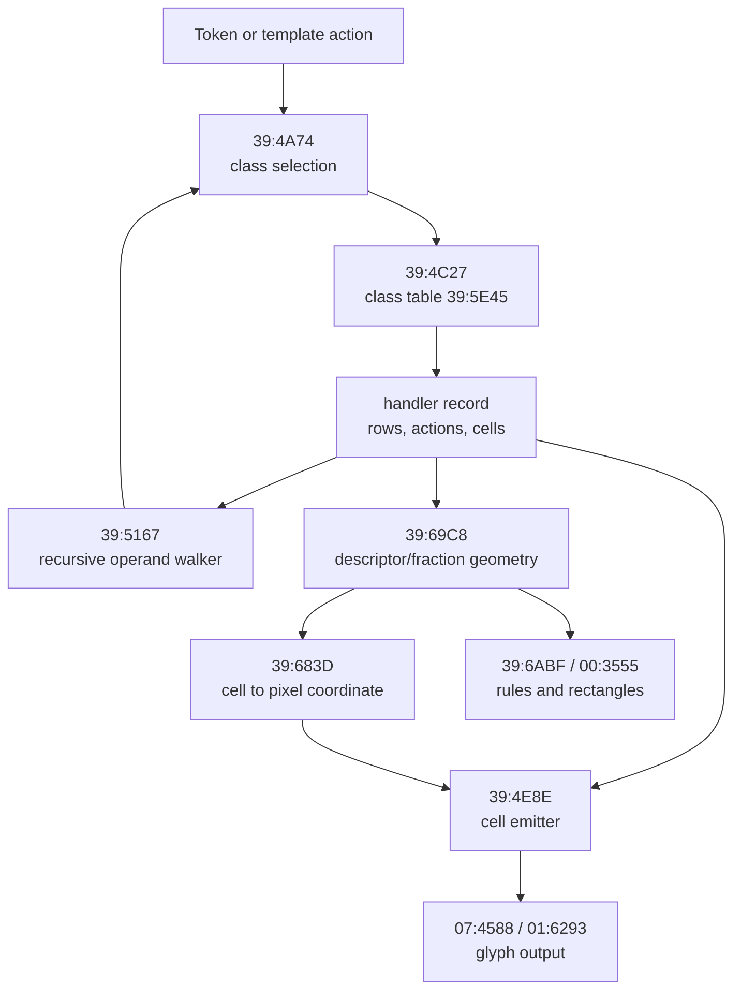

# Equation display (MathPrint)

*TI-84 Plus OS 2.55MP — feature deep dive.*

MathPrint is the OS subsystem that turns a tokenized expression into a two-dimensional
screen layout. It is used by the homescreen entry line, the Y= editor, the Solver
equation line, and the template menus. The implementation is concentrated on flash page
`39` and drives the display services described in [Display & LCD](08-display-lcd.md).
It consumes the token stream described in [Tokenizer & TI-BASIC](07-tokenizer-basic.md)
and preserves the OP registers described in [Floating-point engine](06-floating-point.md).

The useful mental model is a **cell-grid typesetter**. The OS classifies each token,
selects a compact handler record, walks the expression into rows and slots, maps each
cell to pixel coordinates, and emits glyphs or graph-buffer rules. It is not a floating
box tree: the live state is a small RAM block, a few display variables, and ROM tables.



## Core state

The layout engine keeps most of its state in `0x85DE..0x85F2`. The table below names the
fields that matter for reading the page-39 code. [confirmed]

| RAM | Role | Meaning |
|-----|------|---------|
| `0x85DE` | mode / class | Caller mode at entry, then the current layout class. |
| `0x85DF` | row index | Current row inside the selected handler or template. |
| `0x85E0` | slot index | Current argument or cell slot. |
| `0x85E1` | row count | Number of rows in the current handler record. |
| `0x85E2` | slot count | Number of cells or arguments in the active row. |
| `0x85E3..0x85E6` | saved display state | Snapshot of shared display flags while the engine redraws. |
| `0x85E7` | OP scratch | Saved `OP1` slot used while recursing into operands. |
| `0x85E8` | template kind | Low nibble selects descriptor-backed template UI. |
| `0x85E9/0x85EA` | descriptor origin | Packed pixel base used by descriptor cell mapping. |
| `0x85EB` | row height | Pixel height for the current descriptor row. |
| `0x85EC/0x85ED` | cell pointer | Pointer to descriptor cell data. |
| `0x85EE/0x85EF` | fraction geometry | Measured numerator/denominator cell counts for fraction templates. |
| `0x85F2` | OP scratch | Second saved `OP1` slot. |
| `0x86D7/0x86D8` | pen coordinate | Pixel coordinate staged before graph/small-font output. |
| `0x844B/0x844C` | text row/column | Shared OS cursor row and column; `844C` also participates in overflow. |
| `0x984A` | baseline row | The row restored around recursive operand emission. |
| `0x9D27` | saved geometry | Copy of the measured fraction geometry used by the template handoff. |

The main draw/measure distinction comes from `(IY+0x36)` bit 6. Clear means the engine is
measuring or preparing state; set means it may emit pixels. Several other `IY` flags bias
class selection: `(IY+0x09)` bit 0 selects fraction/argument context, while `(IY+0x02)`
bits 4, 5, and 6 select exponent and alternate edit forms. [confirmed]

## Handler records

A visible expression is driven by **handler records** reached through the class table at
`39:5E45`. Each class has one word entry:

```text
handler = word(39:5E45 + 2 * class)
```

Most entries point to compact data, not executable code. The common record format is a
variable-length tail:

```c
typedef uint16_t EqDispCell;  /* high byte D, low byte E */

typedef struct {
    uint8_t row_count;
    uint8_t cell_count[];  /* row_count entries */
    /* uint8_t row_action[row_count]; */
    /* EqDispCell cell[sum(cell_count[0..row_count - 1])]; */
} EqDispHandlerRecord;
```

`row_action[]` bytes are row labels or control actions. They are separate from the cell
stream. The row-cell pointer routine at `39:4DCA` skips the row count, the per-row cell
counts, and the row-action bytes before it reaches the packed two-byte cells. The cell
emitter at `39:4DE6` then walks the selected row and calls `39:4E8E` for each `D:E` cell.
[confirmed]

Examples:

| Class | Record | Meaning |
|-------|--------|---------|
| `0x08` | `39:608B` | Numeric-calculus operator row, including `nDeriv(` and `fnInt(`. |
| `0x0D` | `39:60F9` | Fixed structural glyph rows, including direct `Lintegral` cells. |
| `0x29` | `39:6546` | Group/root-family control row. |
| `0x2A` | `39:654D` | Root/power row containing the `Lroot` payload cell. |
| `0x30` | `39:6030` | Fraction-context variant of the class-`0x08` operator row. |
| `0x31` | `39:6433` | Stacked root/power row with a degree row. |

The display cell `00 C8` is the visible `fnInt(` name. It appears in class `0x08` and
class `0x30`; it is distinct from the fixed `Lintegral` glyph cells in class `0x0D`.
[confirmed]

## Token classification

`eqdisp_dispatch_token` (`39:4A74`) turns an incoming token or action byte into a layout
class. It first handles the special `0x3D` template handoff, then applies context bias.
[confirmed]

```pseudocode
\begin{algorithm}
\caption{Class selection}
\begin{algorithmic}
\REQUIRE incoming byte $a$
\IF{$a = \mathtt{0x3D}$}
  \STATE jump to the template handoff at \texttt{39:672E}
  \RETURN
\ENDIF
\STATE $c \gets a - \mathtt{0x2A}$
\IF{exponent/edit-context flags select an alternate form}
  \STATE bias $c$ into the alternate class family
\ENDIF
\IF{fraction or argument context is active and $c \in \{3,4,5,6,7,8\}$}
  \STATE $c \gets c + \mathtt{0x28}$
\ENDIF
\STATE $\mathtt{85DE} \gets c$
\STATE $HL \gets \mathrm{word}(\mathtt{39:5E45} + 2c)$
\end{algorithmic}
\end{algorithm}
```

This is why the same token can render differently in ordinary and stacked contexts. For
example, class `0x08` and class `0x30` share the `fnInt(`/`nDeriv(` operator family, but
`0x30` is selected after the fraction-context bias. [confirmed]

## Layout pass

The high-level loop is:

1. Save display and OP state.
2. Classify the current token into `0x85DE`.
3. Load the handler record from `39:5E45`.
4. Measure row and slot counts into `0x85E1/0x85E2`.
5. Recurse into argument slots when a handler cell represents an operand.
6. Restore the baseline row and emit visible cells during the draw pass.

The argument walker at `39:5167` manages multi-argument operators. It keeps the parser
argument index in `0x85E0` and uses `0x85E2` as the argument count. Normal operands pass
through `39:59E0`; variable operands pass through `39:59F9`. Both routes delegate token
scanning to page 7 rather than inventing a second field order. [confirmed]

For `fnInt(expr,var,lower,upper[,tol])`, the visible MathPrint fields preserve parser
order: slot 0 is the integrand, slot 1 is the variable, slot 2 is the lower endpoint,
slot 3 is the upper endpoint, and slot 4 is the optional tolerance. The evaluator on
pages `02` and `33` consumes the same order. [confirmed]

The same routine is the tall-template row compositor. `eqdisp_layout_main` reaches
`39:5167` from the action-`0x08` window-advance path at `39:50A4` and the action-`0x04`
drain path at `39:52B3`. `39:5167` calls `39:5949` to decide whether the next argument
consumes one or two display rows, adjusts `0x844B`, emits slot markers through `39:4E0A`,
and emits the saved operand through `39:5B10` or `39:5B1D`. The result is a row composition
around fixed structural cells; the ROM does not use a separate stretch-bitmap routine for
the final MathPrint operator form. [confirmed]

## Cell coordinates

Descriptor-backed templates use a fixed ABI. A descriptor is:

```c
typedef struct {
    uint16_t base_yx;       /* packed base y/x coordinate */
    uint16_t box_yx;        /* packed box y/x coordinate */
    uint8_t  row_height;
    uint16_t cols_rows;     /* packed column/row count */
    uint16_t cell_pointer;  /* pointer to descriptor cells */
} EqDispTemplateDescriptor;
```

The mapper at `39:683D` converts a descriptor cell to pixels:

$$x = \mathit{base}_x + 7 \cdot \mathit{col}$$

$$y = \mathit{base}_y + \mathit{row} \cdot (\mathit{rowHeight} + 2)$$

The known descriptors are:

| Descriptor | Kind | Use |
|------------|------|-----|
| `39:686F` | `0x10` | Fraction menu descriptor. |
| `39:6880` | `0x11` | Root/function template menu descriptor. |
| `39:6893` | descriptor family | Two-row template descriptor. |
| `39:689C` | descriptor family | Two-row, six-column descriptor. |
| `39:68A5` | descriptor family | Two-row, three-column descriptor. |

Descriptor `39:6880` contains `FE09`, `FB C8`, `00 C7`, `00 C8`, and `FB C7` in one row.
That places `fnInt(` as a menu/template cell, not as a structural integral glyph.
[confirmed]

## Fractions

Fractions are the most completely recovered dynamic template. The kind-2 fraction path
uses `0x85EE` and `0x85EF` as measured numerator and denominator widths. It draws a fixed
template box, emits the row/column labels, and updates the focused numerator or denominator
cell. [confirmed]

The rectangle helper at `39:6ABF` handles the focus rectangle. Its endpoint helper at
`39:6B1C` uses:

$$x_\text{left} = \mathtt{0x1B} + 7n$$

$$x_\text{right} = x_\text{left} + 4$$

Static callers of `39:6ABF`, `39:6B1C`, and the box wrapper `39:6AF5` are all in this
fraction-template UI path. The visible fraction bar in the generic expression layout is a
rule drawn through the graph-buffer drawing machinery, not a character cell. [confirmed]

## Exponents and raised rows

Superscripts are represented as row placement, not as a font attribute. The helper at
`39:4CE9` raises classes in the `0x24..0x28` family and class `0x39` by forcing `0x844B`
to a higher display row before emitting the selected cell. The per-row height accounting
then folds that raised row into the parent layout. [confirmed]

This means `X^2` is stored and walked as ordinary cells in different rows. The glyph for
`2` is not special; the row selection is.

## Radicals

The radical mark starts with the fixed large-font `Lroot` glyph (`0x10`). Its glyph bytes
live at `07:466F`, and the root/power records contain the payload cell `00 10` in class
`0x2A` and class `0x31`. [confirmed]

The same records also contain low-byte `E=1F` cells for related power/root pieces. Those
cells follow the ordinary token-string path; they are not the special high-byte `D=1F`
cell form used by the `39:4E8E` IX-backed branch. [confirmed]

A tall radical is therefore a composition:

1. A fixed `Lroot` glyph supplies the hook and top shape.
2. The radicand is laid out as a recursive operand window.
3. `39:5167` advances the operand row window when the radicand or degree spans rows.
4. Parentheses or other delimiters are chosen around the resulting height when needed.

The root mark is ROM-backed by fixed records and the generic cell emitter. The variable
piece is operand placement, not a synthesized root bitmap: `39:5167` owns the recursive
row-window composition, while `39:4E8E`/`39:4F1A` and the page-7 glyph blitter emit the
fixed structural cells. [confirmed]

## Integrals and summations

The visible `fnInt(` menu cell and the structural integral glyph are separate things.

| Concept | Cell / glyph | Source |
|---------|--------------|--------|
| `fnInt(` display name | `00 C8` | Class `0x08`/`0x30` operator records and page-1 token-name strings. |
| Fixed integral glyph | `Lintegral` `0x08` | Class `0x0D` cells `FC3F` and `08 42`, emitted through `39:4F1A`. |
| Summation glyph | `0xC6` family | Fixed glyph data; no simple `00 C6` page-39 handler cell has been found. |

The fixed `Lintegral` glyph is emitted by the ordinary structural-glyph path:
`39:4E8E` calls the delimiter classifier, falls through to `39:4F1A`, maps the cell to
large-font code `0x08`, and emits it. [confirmed]

The tall definite-integral layout is a higher-level composition around that glyph:

1. Place the tall integral glyph on the main axis.
2. Use `39:5167` to walk the lower, upper, integrand, and variable slots in parser order.
3. Update `0x844B` by the row step from `39:5949`.
4. Emit slot markers through `39:4E0A`.
5. Emit the operand bodies through `39:5B10` and `39:5B1D`.

The parser slot order and display compositor are both identified. `39:5167` is the ROM
routine that turns the measured argument slots into the visible row placement around the
fixed integral cell. The final pixels still come from the ordinary output paths:
`39:4E8E`/`39:4F1A` for fixed glyph cells, page `07:4588` for the large-font record copy,
and the rectangle helpers for rule-like UI surfaces. [confirmed]

## Delimiters

The fixed delimiter families are handler records, not renderer-invented cells. Classes
`0x17`, `0x18`, and `0x19` point to one-row records at `39:62C8`, `39:62DF`, and
`39:62F6`. Each record contains ten cells. Page 7 maps those cells to output families
`61 00..61 09`, `60 00..60 09`, and `AA 00..AA 09`. [confirmed]

This covers the fixed delimiter surface. The dynamic choice of delimiter height is part of
the same row-window composition used by radicals and integrals: `39:5167` advances or
backs the visible argument slot, while the delimiter families themselves remain fixed
handler records and page-7 display-byte mappings. [confirmed]

## Emission paths

Cells reach pixels through a small set of output paths:

| Path | Entry | Use |
|------|-------|-----|
| Generic cell emitter | `39:4E8E` | Dispatches two-byte display cells. |
| Direct large glyph map | `39:4F1A` | Maps `FC3C..FC40`, `FE7D..FE81`, and `xx42` cells to large-font codes. |
| String path | `39:6B66` + page `01:6D10` | Converts ordinary token cells to counted strings. |
| Display-byte remap | page `07:44DE` | Remaps `FE`, `FC`, and `FB` prefixed display bytes. |
| Small-font blit | page `01:6293` | `_VPutMap`; emits small labels and compact limits from `0x86D7`. |
| Large-font blit | page `07:4588` | Copies one fixed large-font glyph record. |
| Rule / rectangle helpers | `39:6ABF`, `39:6AF5`, `00:3555` | Draw fraction UI rectangles, boxes, and fixed chrome lines. |

The page-7 large-font service copies fixed glyph rows. It does not measure a radicand or
stretch a glyph by itself. [confirmed]

## Algorithm summary

```pseudocode
\begin{algorithm}
\caption{MathPrint layout}
\begin{algorithmic}
\STATE save display flags and OP scratch registers
\FOR{each visible token or template action}
  \STATE classify the token into a layout class
  \STATE load the class handler record from \texttt{39:5E45}
  \STATE read row count, row actions, and row cell counts
  \IF{the selected cell is an operand slot}
    \STATE recurse through the argument walker
  \ELSIF{the selected cell is a descriptor-backed template cell}
    \STATE map descriptor row/column to pixel coordinates
    \STATE emit the descriptor cell or marker action
  \ELSIF{the selected cell is a structural glyph}
    \STATE map it through the direct glyph path and emit the fixed glyph
  \ELSE
    \STATE convert it through the string or display-byte path
  \ENDIF
  \STATE update row, column, and overflow state
\ENDFOR
\STATE restore display flags and OP scratch registers
\end{algorithmic}
\end{algorithm}
```

## Evidence anchors

The page is intentionally an architecture summary, not a verifier log. These are the main
anchors for readers who want to check the disassembly. [confirmed]

| Address | Meaning |
|---------|---------|
| `39:4A74` | Main token/action dispatcher. |
| `39:4C27` | Class table lookup through `39:5E45`. |
| `39:4DCA` | Row-cell pointer computation for handler records. |
| `39:4DE6` | Row cell stream emitter. |
| `39:4E8E` | Generic two-byte cell emitter. |
| `39:4F1A` | Direct large-glyph classifier. |
| `39:4E0A` | Argument-index marker emitter used by the row compositor. |
| `39:5167` | Multi-argument operand walker and tall-template row compositor. |
| `39:5949` | Row-step classifier for one-row versus two-row argument advance. |
| `39:5B10` / `39:5B1D` | Saved-operand emitters used by forward and reverse placement. |
| `39:59E0` / `39:59F9` | Normal and variable operand emitters. |
| `39:672E` | Template handoff for incoming `0x3D`. |
| `39:683D` | Descriptor cell-to-pixel mapper. |
| `39:68AE` | Geometry action handler. |
| `39:69C8` | Descriptor/fraction geometry selector. |
| `39:6ABF` / `39:6B1C` | Fraction focus rectangle and endpoint helper. |
| `39:6B66` | Generic string selector. |
| `07:44DE` | Display-byte remapper. |
| `07:4588` | Large-font fixed glyph blitter. |
| `01:6293` | `_VPutMap` small-font pixel output. |

## Remaining detail

The static MathPrint pipeline is recovered: token classification, handler records,
recursive operand order, descriptor templates, fraction UI geometry, fixed structural
glyphs, display-byte remaps, generic output services, and multi-argument row composition.
The row compositor is `39:5167`; the pixel emitters are the fixed glyph and rule paths
listed above. Dynamic traces can still refine the exact runtime path for a specific
expression and cursor state, but the static map now has the ROM routine that owns
tall-template row composition.
