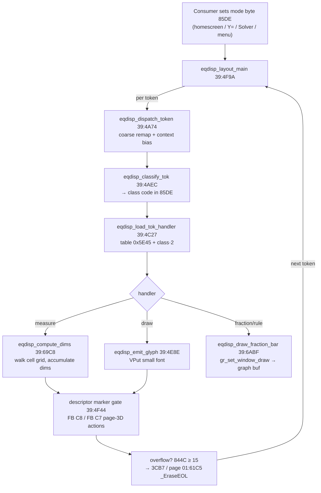

# Equation Display (MathPrint pretty-printer)

*TI-84 Plus OS 2.55MP — feature deep dive.*

How the OS lays a tokenized expression out as **2-D text** — the engine behind the homescreen entry line, the **Y= editor**, the **Solver** equation line, and catalog/menu rendering. It is the single largest subsystem on **flash page 0x39** (147 named functions, 112 with the `eqdisp_*` prefix; the rest are menu/solver helpers). It is the inverse of parsing: a token stream → pixels, with nesting, fraction bars, superscripts, radicals, and indentation, instead of evaluation.

> Related: [Tokenizer & TI-BASIC](07-tokenizer-basic.md) (the token format it consumes), [Display & LCD](08-display-lcd.md) (the glyph blitter and graph buffer it drives), [Solver & Numerical Methods](sub-solver-numeric.md) (a consumer of the equation line).

## What the engine actually is

There is **no float "box-tree"**. MathPrint is a **cell-grid typesetter**: it walks the token stream and assigns each piece to a cell on a grid of *rows × columns*, where a column is ~7 px wide and each row carries its own height. Stacked structures (fractions, exponents) consume extra rows; the renderer turns each `(row, col)` cell into a pixel `(x, y)` and emits a glyph there. State lives in a fixed RAM block (`0x85DE–0x85F2`) plus the OS display context addressed through `IY`. Glyphs are the OS **proportional small font** (drawn via the page-1 `_VPutMap` path); the **fraction bar and structural rules are filled rectangles** blitted into the graph back-buffer — not characters.

The walk runs effectively **twice**: a *measure* phase that builds the cell grid and its dimensions (`eqdisp_compute_dims`), and a *draw* phase that emits glyphs and rules at the resolved positions. The phase is selected by mode flags (`IY+0x36` bit 6 = draw path; `IY+0x0C` bit 4 = "geometry committed"). Horizontal overflow is cleaned up through the page-1 display erase path (`3CB7 -> 01:61C5`), not a separate page-0x3A MathPrint continuation.



## The data model — RAM state block

Everything the engine needs is in `0x85DE–0x85F2`, plus the shared display vars and the `IY` flag area. (`R/W` = how the engine touches it.)

| Addr | Name | R/W | Purpose |
|------|------|-----|---------|
| `0x85DE` | **mode / token class** | R+W | The dispatch index. Consumers write it to pick the editor (homescreen/Y=/Solver/menu); `eqdisp_classify_tok` overwrites it with the token's *class code*. |
| `0x85DF/E0` | cursor `(row, col)` | R+W | Read together as `BC` by `decr_counters` (`LD BC,(85DF)`: `C`=row `85DF`, `B`=col `85E0`). |
| `0x85E1/E2` | `(row count, arg count)` | R+W | Written together as a word (`LD (85E1),DE`); the loop bounds for the cursor pair. |
| `0x85E3..E6` | saved display context | W/R | `IY+0xD`, `IY+0xC`, `8D17`, `IY+3` snapshot (save/restore). |
| `0x85E7` | OP scratch slot **E7** (9 B) | R+W | OP1 save slot across recursion. |
| `0x85E8` | **kind nibble** | R+W | `& 0xF`: `0`=glyph run, `2`=fraction, else template index; bit 1 = matrix vs linear. |
| `0x85E9/EA` | dimension word (cols, rows) | R+W | Grid extent accumulator. |
| `0x85EB` | row-height / ascent base | R+W | Pixels above baseline for the cell origin. |
| `0x85EC/ED` | per-row height array ptr | R+W | Walks the kind descriptor. |
| `0x85EE/EF` | fraction num/den cells | R+W | The two sub-positions of a fraction. |
| `0x85F2` | OP scratch slot **F2** (9 B) | R+W | Second OP1 save slot. |
| `0x844B` | `curRow` | R+W | Shared OS text row (= the homescreen `curRow`). |
| `0x844C` | `curCol` / **overflow flag** | R+W | Pen column; set to 1 by `eqdisp_set_overflow_jp` when a line runs off-screen. |
| `0x984A` | indent depth | R | 1 normally, 2 for the `'!'` structure. |
| `0x984B/4C` | scroll / pixel accumulators | W | Zeroed at entry, accumulated while drawing. |
| `0x8478` | `OP1` | R+W | The math accumulator the engine must preserve (see [Floating-Point](06-floating-point.md)). |
| `0x86D7/D8` | `penCol`/`penRow` | R+W | Pixel pen staged before each glyph emit. |
| `0x8DA2` | draw-window struct (5 B) | W | Corner coords fed to the graph-buffer rectangle fill. |

A handful of `IY` flag bits steer the walk:

| Flag | Meaning |
|------|---------|
| `IY+0x36` bit 6 | **draw** path (set) vs **measure**/layout path (clear) |
| `IY+0x0C` bit 4 | token geometry committed ("render this token") |
| `IY+0x09` bit 0 | **fraction / argument context** active (selects stacked forms) |
| `IY+0x02` bits 4/5/6 | edit-context bits (select superscript / alternate forms) |

The flash side has two distinct data formats:

- **Handler records** reached through the class table at `0x5E45`. These records describe expression rows: row count, per-row argument counts, per-row layout/action bytes, then 2-byte display-token cells.
- **Kind box descriptors** at `0x686F`, `0x6880`, `0x6893`, `0x689C`, `0x68A5`. These are fixed menu/box templates walked by `eqdisp_compute_dims`; they are not the hidden source of the tall integral glyph. Descriptor tokens such as `FB CA`/`FB CB` route through `eqdisp_load_glyph18b` to MathPrint mode-menu strings (`n/d`, `Un/d`), `FB D6`/`FB D8`/`FB D7` route to answer-mode strings, and `FB C7`/`FB C8` are special-cased elsewhere as square down/up markers.

## Token classification & dispatch [confirmed — from disassembly]

A raw token is reduced to a small **class code** (≈`0x01–0x43`), context-biased, then used to index a pointer table.

1. **Coarse remap** (`eqdisp_dispatch_token` 39:4A74): incoming token/action byte `0x3D` is special-cased out to `0x672E`; otherwise the byte is biased down by `0x2A` and adjusted by the edit-context bits `(IY+0x2)` 4/5/6 and the fraction/arg flag `(IY+0x9)` bit 0. When the fraction/arg context is set, classes `0x03–0x08` are pushed up by `0x28` to select their **stacked variants** — this is the switch that makes the *same* operator token render as a superscript or a fraction part depending on where the cursor is.
2. **Classify** (`eqdisp_classify_tok` 39:4AEC): stores the class code into `0x85DE` and loads the token's handler **record** (not just a code). Disassembled, it: zeroes the sub-row (`85DF`); writes the class to `85DE` (or, on the draw pass `IY+0x36` bit 6, gates through the `2CBB` callback described below); calls `load_tok_handler` (`4C27`) to get `HL =` the handler **record pointer**; then reads `(HL)` → **`85E1` = row count** and walks the record to extract the **argument/token count → `85E2`** (for the float class `0x14` it instead reads the live float type from `0x8478`). It then branches on a handful of terminal classes: `0x32`/`0x41` return immediately (literal/atom), `0x10` → variable (`59A6`, `_FindSym` path), `0x02` → list/named operand (`5AC5`), `0x29` → close-group (emits glyph `0x17` via `59CC`). This is what populates the per-token grid extents the geometry pass consumes.
3. **Dispatch** (`eqdisp_load_tok_handler` 39:4C27): `LD A,(85DE) ; LD HL,0x5E45 ; SLA A ; ADD HL,DE ; JP 0x0033` — i.e. **`HL = *(0x5E45 + class·2)`** via `_LdHLind`. The target is usually a **handler record**, not executable code. The record drives row selection, token-cell emission, recursion, and special template actions.

```pseudocode
\begin{algorithm}
\caption{Token dispatch (eqdisp\_dispatch\_token / load\_tok\_handler)}
\begin{algorithmic}
\REQUIRE raw token in $A$, edit flags in $(IY{+}2)$, fraction flag $(IY{+}9).0$
\IF{$A = \mathtt{0x3D}$} \STATE jump to dedicated handler \texttt{0x672E}; \RETURN \ENDIF
\STATE $c \gets A - \mathtt{0x2A}$ \COMMENT{coarse class}
\IF{$\lnot (IY{+}2).4$} \STATE $c \gets c + \mathtt{0x29}$ \ENDIF \COMMENT{superscript / alt edit form: bit 4 reset}
\IF{$(IY{+}9).0$ \AND $c \in \{3,4,5,6,7,8\}$} \STATE $c \gets c + \mathtt{0x28}$ \ENDIF \COMMENT{stacked fraction-context form}
\STATE $(\mathtt{0x85DE}) \gets c$
\STATE $\mathit{handler} \gets \texttt{word at } \mathtt{0x5E45} + 2c$ \COMMENT{table lookup, then \_LdHLind}
\STATE run $\mathit{handler}$ \COMMENT{emit glyph / open fraction / open exponent / recurse}
\end{algorithmic}
\end{algorithm}
```

Notable terminal classes: `0x10` → variable/symbol (`eqdisp_findsym_op1`), `0x14` → float/value token (reads the float type from `0x8478`), `0x02` → list/named operand, `0x29` → close/grouping (emits glyph `0x17`). The handler table at **`0x5E45`** holds 0x44 little-endian record pointers; e.g. class `0x08`→`0x608B`, its fraction-context variant class `0x30`→`0x6030`, class `0x10`→`0x6148`, `0x14`→`0x6529`, `0x29`→`0x6546`. Paren matching uses pair tables at `0x62E2 / 0x62CB / 0x62F9`.

### Handler record format [confirmed]

The record layout is:

```
byte row_count
byte arg_count[row_count]
byte row_action[row_count]
word display_token[sum(arg_count)]
```

`eqdisp_sum_arg_widths` (`39:4DCA`) computes the token-cell pointer for the current row:

```
row_tokens = record + 1 + 2*row_count
           + 2*sum(arg_count[0 .. current_row-1])
```

`eqdisp_emit_arglist` (`39:4DE6`) then walks `arg_count[current_row]` two-byte cells, loads each cell as `D,E`, and calls `eqdisp_emit_glyph` (`39:4E8E`). The `row_action` array is emitted separately from operand cells: the row-title loop at `4D92` calls `eqdisp_load_tok_handler` (`4C27`), reads `row_count`, skips the count array, points at `row_action[0]`, emits each row's byte through the `3B2B` bjump, and highlights the byte whose index equals `0x85DF`. `tools/dump-mathprint-layout.py --bjump-flow` proves `3B2B` targets page `01:7183`, an indexed-string printer using the page-1 pointer table at `0x71A1`; it is not a raw glyph blitter. `tools/dump-mathprint-layout.py --record-flow` verifies those byte anchors, the `4DCA` row-cell pointer math, and the only direct `4DE6` caller (`4CB7`) against the ROM. `tools/dump-mathprint-layout.py --row-action-flow` adds the key action-byte boundary: `4D92` reads handler-record `row_action[]` bytes as row labels, `4DCA` skips them before cell emission, and `4F9A` saves an incoming action byte in `B` before routing to `68AE`. Bytes such as `0x48` can therefore appear both as handler-record row labels and as geometry actions, but they become geometry kind selectors only after `6761` has already forced `85DE=0x48`.

`tools/dump-mathprint-layout.py --record-cell-stream-flow` closes the pre-cell stream immediately before `4E8E`. `4DCA` implements the record formula above, so the packed cell rows start after `row_count`, `arg_count[]`, and `row_action[]`. `4DE6` sets the current display row from the saved baseline `984A`, calls `4E0A`, then passes each two-byte `D:E` cell to `4E8E`; it stops when the slot index reaches `85E2` or the display row reaches 7. The `4E0A` gutter routine clears `844C`, highlights the selected slot when `C == 85E0`, emits a fixed slot label (`1..9`, `0`, `A..Z`, `[`, or space), then emits a separator (`:`, `0x1E`, or `0x1F`) based on the baseline row and row-7 continuation state. This is fixed UI gutter/separator logic; it does not inspect glyph bitmap data, measured radicand height, or descriptor dimensions.

`tools/dump-mathprint-layout.py --argument-gutter-caller-flow` closes that gutter routine's caller set. The direct `4E0A` callers are exactly `4DEC`, `51A6`, `51CE`, `51DD`, `5261`, `528B`, `529C`, and `5B46`; the only direct mid-entry `4E14` caller is `5236`. The first is the record-cell stream, the `51xx`/`52xx` callers are forward/reverse `5167` multi-argument slot markers around saved normal/variable operands, `5236` is the action-`0x03` row-7 highlighted-slot marker, and `5B46` is the saved-operand tail before optional OP restore and string/control emission. There are no unexpected raw word refs to `4E0A`/`4E14`, so the argument-gutter path is not a hidden measured tall-symbol builder.

The `fnInt(`/`nDeriv(`/summation family is in this record machinery. Page 1's token-name table has `C8 06 "fnInt("` and `C7 07 "nDeriv("`; the page-39 class `0x08` record (`0x608B`) contains row-0 cells `00 C7`, `00 C8`, `FB C8`, `FB C7`, and class `0x30` (`0x6030`) is the same family under the `+0x28` fraction-context bias. `FB C8` and `FB C7` are not integral-piece bitmaps: in `eqdisp_menu_or_emit` (`39:53AD`) they trigger square-up (`0x06`) and square-down (`0x07`) marker emission.

`tools/dump-mathprint-layout.py --fnint-token-flow` pins the parser/display identity split across ROM pages: `BB 24` is the raw parser token `tFnInt` and `BB 25` is `tNDeriv` (page-2 evaluator branches at `68F3`/`6904`, with the `BB 24` menu-table entry at page 7 `42F6`), while `00 C8`/`00 C7` are page-39 display/name cells backed by page-1 token-name strings. `--extended-token-table-flow` tightens that boundary: `BB24` and `BB25` occur only in page-7 extended-token table data, the specific table-entry addresses have no page-local word refs, and the nearby `50B5/50B8` consumers are parser/editor scanner entries reached through the operand service path. This proves that the visual `fnInt(` cell is a display-level name for the parser token, not the recursive operand itself, and that the page-7 raw-token table is not a hidden tall-symbol renderer.

`tools/dump-mathprint-layout.py --fnint-template-flow` pins the operator row one step further. Page `01:7183` is the indexed-string printer used for handler-record row-action bytes; the class `0x08`/`0x30` row-action bytes resolve to `0x35 -> "MATH"`, `0x3B -> "NUM"`, `0x25 -> "CPX"`, and `0x43 -> "PRB"` through the page-1 pointer table. In both class records, `nDeriv(` is row 0 slot 7 and `fnInt(` is row 0 slot 8 under the `MATH` row-action label, followed by `FB C8`/`FB C7` square-up/down template markers in slots 9/10. The same verifier byte-anchors the page-2 evaluator prologue: `BB24`/second byte `0x24` seeds `OP1` and calls `_FPSPushReal` (`4A83`), while `BB25`/second byte `0x25` runs `_ErrD_OP1_0` (`212D`) and jumps into the nearby shared constant-push path at `6AF3/6AF6`. This proves operator/menu identity and the numeric-calculus parser bridge; the later argument order is recovered by `--fnint-argument-order-flow`.

`tools/dump-mathprint-layout.py --fnint-eval-flow` adds evaluator-side backing for the endpoint/tolerance side of that claim. Raw Ghidra names page `33:4D00` as `fnint_body`; its prologue calls `_CpyTo2FPS3` (`163F`), `_CpyTo1FPS2` (`169C`), `_FPSub` (`2297`), `_TimesPt5` (`2382`), then repeats through `_CpyTo1FPS1` (`168D`) to set up interval scale. The verifier also byte-anchors the page-2 `BB24` branch and the shared `6AF6` default-tolerance setup. This proves that parsed FPS slots 2 and 3 are consumed as the integration endpoints for `fnInt(expr,var,a,b[,tol])`, but it is numeric-evaluator evidence, not page-39 proof of the exact visible field placement.

`tools/dump-mathprint-layout.py --fnint-slot-flow` proves how that operator row is selected by action bytes. The normal dispatcher path at `53F8` maps `0x8F..0x97` to slots `0..8`, maps `0x8E` to slot 9, maps `0x9A..0xB3` to slots `10..35`, then calls `5955`; `5955` rejects slots `>= 85E2`, calls `4DCA` to locate the current row's cells, and `595F` skips `2*slot` bytes. The saved-OP path at `5C41` uses the same slot-subtraction mapping for `0x8F..0x97` and `0x8E`, while `0x9A..0xB3`/`0xCC` take the named/list path instead. On the `MATH` row, this proves action `0x96 -> slot 7 -> 00C7` (`nDeriv(`), action `0x97 -> slot 8 -> 00C8` (`fnInt(`), `0x8E -> slot 9 -> FB C8`, and normal action `0x9A -> slot 10 -> FB C7`. This is a recovered operator/menu-cell selection path, not the later parser-argument placement for the four visible `fnInt(` fields.

`tools/dump-mathprint-layout.py --fnint-argument-order-flow` pins that parser-argument identity boundary. `5167` keeps the current parser-argument index in `85E0` and the argument count in `85E2`; the forward in-row path at `51CB` emits the previous slot index, advances the display row, emits the current slot index, then calls `5B10`; the reverse path at `5286` mirrors this through `5B1D`; and the saved-OP direct-slot path at `5CF6` writes the selected slot to `85E0` before emitting operands until the row index catches up. `5B10`/`5B1D` restore saved OP state and call `59E0`/`59F9`, which cross to the page-7 parser scanner rather than choosing a new field order. Combined with `--fnint-eval-flow`, which proves parsed FPS slots 2 and 3 are the integration endpoints, the visible `fnInt(expr,var,a,b[,tol])` fields are an ordered parser-slot pass-through: slot 0 expression/integrand, slot 1 differential variable, slot 2 lower endpoint, slot 3 upper endpoint, and optional slot 4 tolerance. This still does not recover the exact vertical placement/tall-symbol builder.

`tools/dump-mathprint-layout.py --fnint-row-window-flow` recovers the generic visible row-window logic around those ordered operands. `eqdisp_clamp_argcount` (`50CF`) preserves `85E0`, refreshes setup, clamps the slot below `85E2`, and computes a six-row overflow window. `eqdisp_set_row_from_arg` (`5101`) maps the selected slot to display row `844B = min(85E0 + 1, 7)`, and `eqdisp_layout_arg` (`513E`) restores `844B` from the baseline row `984A` after the requested argument is laid out. For class `0x08`/`0x30`, `eqdisp_arg_kind` (`5949`) leaves the tested `fnInt(` slots on the one-row path. `eqdisp_emit_subexpr`/`eqdisp_emit_subexpr2` (`4C5A`/`4CA4`) compute `visible_slot = 85E0 - (844B - 984A)`, emit the row cells at `base + 2*visible_slot`, and restore the baseline row. This proves the generic operand row-window and overflow placement segment; the special tall-symbol pixel placement remains separate.

`tools/dump-mathprint-layout.py --glyph-emission-flow` pins the next boundary: decoded record/descriptor cells are emitted through `eqdisp_emit_glyph` (`4E8E`) and `eqdisp_map_token_glyph` (`4F1A`), plus the bjump display layer. `4F1A` directly maps only `FC3C..40`, `FE7D..81`, and `xx42` subscript-style cells to large-font codepoints. The decoded records contain that direct glyph form in class `0x0D` row 0 (`FC3C..FC40`, including `FC3F -> L08` = `Lintegral`) and row 2 (`0042..0942`, including `0842 -> L08` = `Lintegral`), but `00C8`/`00C7` are **not** direct `4F1A` glyph mappings. The `FB` string loader (`6B62/6B66`) only copies known mode/answer strings (`FBCA`, `FBCB`, `FBD6`, `FBD8`, `FBD7`), and page 7 `4588` is fixed 7-byte-stride / 8-byte-record large-font copy machinery. This rules out a hidden tall-integral/radical stretch inside the ordinary decoded-cell emitter.

`tools/dump-mathprint-layout.py --structural-glyph-census` makes that search executable for the current structural glyph candidates. It finds `FC3F` (`Lintegral`) at page-39 raw hit `6110`, inside class `0x0D` row 0, and `0842` (`Lintegral`) at raw hit `6144`, inside class `0x0D` row 2; `0010` (`Lroot`) only at `6438/6550`, inside class `0x31`/`0x2A` root/power rows; no page-39 raw hit and no decoded record/descriptor hit for `00C6` (`Σ` candidate); and `00C8`/`FB C8`/`FB C7` only in the `fnInt(`/template-menu contexts already described. This proves those menu/template cells are not secretly direct structural glyph mappings; it does not by itself recover the later stretched-symbol composition.

`tools/dump-mathprint-layout.py --structural-symbol-flow` pins the emission side of those structural cells and now prints their handler-row provenance. The `fnInt(` display cell `00C8` is selected from class `0x08`/`0x30` row 0 slot 8 under the `MATH` row label, next to `FB C8`/`FB C7` marker cells. The fixed `Lintegral` cells are separate class `0x0D` structural rows: `FC3F` appears in row 0 slot 8 and `0842` in row 2 slot 8. Both are ordinary fixed glyph paths: `4E8E` calls the delimiter classifier at `6675`, no fixed delimiter-pair table matches, the fallback at `66A0` calls `4F1A`, and `4F1A` maps the `FC3C..FC40` or `xx42` cells to large-font codes, so both `FC3F` and `0842` resolve to `L08` (`Lintegral`) before `RST 28` output. `0010` is present in the root/power records and the fixed `Lroot` glyph bytes are present at `07:466F`, but `0010` is not a `4F1A` direct glyph. `--key-string-structural-flow` proves the important boundary: if `0010` is treated as an ordinary `_KeyToString` cell, index `00` points to the counted string `All+`, so `_KeyToString` is not itself the `Lroot` glyph explanation. This keeps `fnInt(` menu selection, fixed structural glyph emission, root record/glyph provenance, and the still-missing measured radical/integral/delimiter stretch caller separate.

`tools/dump-mathprint-layout.py --structural-record-placement-flow` closes a tempting false shortcut around those `Lintegral` cells. It byte-checks the entire class `0x0D` record at `60F9`, the `4DE6/4DFA` row-cell placement loop, the `4F1A` direct glyph mapper, and the page-7 fixed glyph bytes for `Lintegral` (`07:4637`) and `Lroot` (`07:466F`). The decoded row-action labels for class `0x0D` are `NAMES`, `MATH`, and `EDIT`; raw byte `0x37` normalizes to class `0x0D`, while `BB24` (`tFnInt`) and `BB25` (`tNDeriv`) remain page-7 parser-token table entries. Therefore class `0x0D` proves fixed structural glyph placement through ordinary record rows, but it is not the inserted `fnInt(` definite-integral template or its final tall-symbol placement caller.

`tools/dump-mathprint-layout.py --page3f-glyph-duplicate-flow` closes the remaining duplicate fixed-`Lintegral` bitmap hit. The canonical page-7 glyph bytes are `07:4637 = 02 05 04 04 04 14 08`; page `3F:46B7` contains a width-prefixed copy `06 02 05 04 04 04 14 08 06` in a glyph-like data island. The duplicate row address `3F:46B8` and record address `3F:46B7` have no ROM-wide raw word refs, raw Ghidra reports no function at `page_3F:46B8`, and the local `3F:4600..4700` window has no MathPrint measured-state refs or draw/display service patterns. This is font/data duplication, not the measured tall-integral placement routine.

`tools/dump-mathprint-layout.py --structural-immediate-draw-flow` closes the procedural-immediate version of the same false lead. It scans ROM-wide for structural glyph/piece code bytes `08/10/C6/F5/F6/F7` loaded by simple immediate forms (`LD A/E/D/L/B/C,n`) within `+/-0x40` bytes of `3B37`, `3B3D`, `3CDB`, `_DarkLine`, `_PutPSB`, and rectangle/invert bcalls. The complete hit set is nine byte-checked contexts: fixed page-1 count/branch constants, page-3/page-5/page-37/page-3B UI or graph constants, page-39 template-chrome line coordinate `67E7`, and one unaligned raw `2E F5` false positive inside a `CALL` operand at `39:6C32`. There are no unexpected hits, so no hidden procedural load of `Lintegral`/`Lroot`/`Sigma`/MathPrint-piece code remains near those draw services.

`tools/dump-mathprint-layout.py --suffix-1f-flow` separates two easy-to-confuse cell forms. A high-byte `D=0x1F` cell is the special `4E8E` path (`PUSH IX; POP HL; RST 20`) and appears in the decoded handler table only as class `0x14` cell `1F12`. The root/power and fnInt-related records instead contain low-byte `E=0x1F` cells such as `061F`, `0C1F`, `FE1F`, and `FC1F`. Those low-byte suffix cells do not enter the `D=1F` special path and are not direct `4F1A` large-glyph mappings; they fall through the generic cell path, where non-`FB` cells use `_KeyToString` (`6B9C`) and `_PutPSB` (`4EE6`). `--key-string-1f-flow` pins the off-page half: `_KeyToString` at page `01:6D10` maps `E=0x1F` cells through table index `0x50 + D` and copies a token string. This explains the template-family cell emission path without promoting the `1F` suffix to a measured tall-symbol algorithm.

`tools/dump-mathprint-layout.py --menu-cell-flow` pins the active menu/template-cell transition. Internal action `0x05` loads the current row/descriptor cell through `5955`, then `52E5` either escapes to recursive token display when the loaded-cell context has `C == 0x82` (`A` is saved at `9D2C`, then `49A8` sets template box flags and calls `4A74`) or continues into the ordinary menu/token path. The `FB C7`/`FB C8` square-marker cells do not become glyphs: `53AD` calls the RAM/page-0 cross-page stub at `3891` with action bytes `6/7/8`, whose inline target byte resolves to page `3D:7CBA` in the current 64-page ROM model, and then restarts the layout dispatcher with internal action `0x09`. Raw Ghidra names that target `j_flash_obj_dispatch`; the byte anchors show action `7 -> BC=0804`, action `6 -> BC=0402`, and both share the page-3D `7DC4` bit-mask helper. That makes this a template/menu-state control path, not the tall-symbol geometry builder. The ordinary menu path restores the `FB` prefix at `53DA`, calls the menu state helpers, then normalizes returned `FF` to `FE` before returning selection state. This explains how template-marker cells drive state transitions while leaving the visual operand fields to the recursive argument walkers.

`tools/dump-mathprint-layout.py --active-cell-recurse-flow` closes the recursive-token side of that action-`0x05` split. It byte-checks the `52DA -> 5955 -> 52E5` gate, the `52E5 -> 49A8` recursive entry, the `595F` selected-cell scanner, and the non-`82` continuations at `5373`/`53AD`. The only decoded handler-record cells with high byte `0x82` are in classes `0x0B`, `0x0C`, and `0x20`; `00 C8` (`fnInt(`), `FB C8`/`FB C7`, `FC3F`/`0842` (`Lintegral`), and `00 10` (`Lroot`) are all outside that prefix set. Therefore action `0x05` does not transform the `fnInt(` menu cell or square markers into the fixed structural glyph records through the `49A8` recursive-token path.

`tools/dump-mathprint-layout.py --descriptor-marker-flow` pins the same square-marker cells inside the descriptor walker. Descriptor `0x6880` contains `FE09`, `FB C8`, `00 C7`, `00 C8`, `FB C7` in that order; the class `0x08/0x30` records contain the same `00 C7`/`00 C8`/`FB C8`/`FB C7` operator family. The descriptor cell loop at `6A4B` loads each two-byte cell, routes known `FB` strings through `6B62`, measures width through `6BE7`, then calls `4F44`. Raw Ghidra names `4F44` as `eqdisp_cmp_cursor_bounds`, but the byte body compares `DE` to `FB C8` and `FB C7` and dispatches page-3D actions `7` and `6` through `3891`; marker hits can then enter `4F6C` (`eqdisp_setnorm_split2`) for split/display normalization. `--marker-retouch-flow` isolates that final branch: decoded cells reach `4F62` only after the marker gate, descriptor cells reach `4F6C` only from `6A66`, and both paths call `00:3555 -> 04:4025` (`_DarkLine`) without `85EE`/`85EF`/`9D27` measured-state input. This corrects the role of `4F44` and its retouch tail: they are descriptor square-marker handling, not hidden tall-symbol emitters.

`tools/dump-mathprint-layout.py --two-byte-form-flow` audits the two-byte form selectors reached from that path. Raw Ghidra names `39:5E1F` as `eqdisp_lookup_tbl_6203`, `39:5E26` as `eqdisp_lookup_tbl_63e3`, and `39:5E32` as `eqdisp_table_lookup2`; ROM bytes also expose an inline sibling selector at `39:5E2D` for table `0x63C3`. The decoded tables are `6203` (14 entries), `63E3` (4 entries), and `63C3` (16 entries). The branch at `5373` uses the first two tables to rewrite matched cells into `D=56` fraction/superscript form cells (`A=8E` or `A=92`, adjusted by `B`); the `63C3` sibling is a separate local lookup table. `BB24`/`BB25`, `00C8`, `FB C7/C8`, `0842`, `0010`, and `00C6` are absent from all three tables, so this is not the missing `fnInt(` field mapper or tall-symbol stretch recipe.

`tools/dump-mathprint-layout.py --square-marker-flow` follows that boundary off-page. For `FB C8`, page 39 first calls the `3891 -> 3D:7CBA` stub with action `7`; if the page-3D bit test returns nonzero, page 39 calls bcall `_grc_4611` (`52FF -> 37:4611`) with `A=8` and restarts action `0x09`. For `FB C7`, it does the same with action `6`, then `_grc_4611` with `A=7`. Page `3D:7CC6` maps action `7` to mask pair `BC=0804` and action `6` to `BC=0402`, and the helper cluster `7D5A/7D76/7DB2/7DC4` preserves `OP1` type while deriving and testing flash/object bit masks. `_grc_4611` maps `A=8` to the page-37 disabled-feature message at `4C24` (`summation Σ( HAS BEEN...`) and `A=7` to `4C09` (`logBASE( HAS BEEN...`) before a shared message/update path. This is ROM-backed square-marker disabled-feature handling; it still has no measured-height input, descriptor walk, or tall-symbol draw primitive.

**The class table is a flat 0x44-entry pointer array indexed by `0x85DE`.** Because dispatch is purely `0x5E45 + 2·(0x85DE)`, the *layout class* of every token is exactly the byte the coarse-remap (`dispatch_token` 4A74) deposits in `0x85DE` — there is no second lookup. The context-bias in step 1 is what swaps a token between its baseline and stacked class **before** this index is taken: superscript edit form adds `0x29` when `(IY+2)` bit 4 is **reset** (`4A7F: BIT 4,(IY+2) / JR NZ` skips the `ADD A,0x29` at `4A85`; `4A87`/`4A8E` add one more each when bits 6/5 are likewise reset), and an active fraction/argument context (`IY+9` bit 0) bumps classes `0x03–0x08` up by `0x28` (`4AB3`), so the *same* operator token resolves to a different `0x5E45` slot — a baseline glyph vs a fraction-part / exponent handler. The **fraction‑vs‑superscript form selector** for two‑byte tokens uses small `{hi,lo}` match tables: `39:5E1F` loads **`0x6203`** (14 entries), `39:5E26` loads **`0x63E3`** (4 entries), and both join `39:5E32`; a hit picks the stacked class (`0x92`, superscript) vs the default (`0x8E`, fraction) at `537D`/`5381`. A sibling selector at `39:5E2D` loads **`0x63C3`** (16 entries) into the same comparator for another local two-byte-token test. Paren matching uses pair tables at `0x62E2 / 0x62CB / 0x62F9` (walked by `eqdisp_peek_match_tok` `6667`/`6675`).

### Template setup state [confirmed]

The class/row setup path at `4AFD` initializes the shared template state before either row-cell emission or operand recursion. It writes the row word to `0x85DF`, writes the selected layout class to `0x85DE`, reloads the handler record via `4C27`, stores the record's `row_count` in `0x85E1`, stores `arg_count[current_row]` in `0x85E2`, zeros the current argument slot `0x85E0`, and clears `(IY+0x11)` bit 5. Zero-argument terminal classes then take special paths: classes `0x32` and `0x41` return immediately; class `0x10` runs the symbol/variable OP1 path (`59A6`); class `0x02` enters the saved-OP/list path, sets `(IY+0x11)` bit 5 and `(IY+0x26)` bit 0, and adjusts `0x85E2` after measuring sub-argument count.

The argument-position helpers are also byte-anchored: `eqdisp_clamp_argcount` (`50CF`) clamps `0x85E0` against `0x85E2`; `eqdisp_set_row_from_arg` (`5101`) maps `0x85E0 + 1` to display row `0x844B`, capped at row 7; `eqdisp_layout_arg` (`513E`) writes a requested argument slot to `0x85E0`, clamps it, maps it to a row, restores the baseline from `0x984A`, and returns through `5447`. `tools/dump-mathprint-layout.py --setup-flow` verifies all of these anchors against the ROM.

`tools/dump-mathprint-layout.py --row-placement-flow` pins the other small row-placement helper. `eqdisp_begin` (`49A8`) enters `4A02` after token dispatch; `4A02` calls `4C40`, sets `(IY+0x0C)` bit 4, calls `4CE9`, then enters the `4A18/4A28` render/action loop. `4CE9` is the raised-row helper: classes `0x24..0x27` force `844B=4`, class `0x28` forces `844B=3`, and class `0x39` forces `844B=4`, then each emits an indexed string through `3B2B`. Its only direct callers are `4A09` and the carry-preserving return wrapper `5449`, so this path explains exponent-style raised strings but has no descriptor walk, measured operand state, or tall-symbol draw primitive.

### Layout action dispatcher [confirmed for control flow]

The layout loop at `4F9A` dispatches on internal action codes, distinct from the handler-record `row_action` bytes emitted by the menu-title path. The byte-anchored cases currently recovered are: `0x01`/`0x02` move through rows with saved-OP special cases; `0x08` enters the wide-argument continuation path and the six-pass `5167` loop at `50A1`; `0x07` maps the current argument slot back to a visible row; `0x03`/`0x04` walk wide argument pages in reverse/forward directions; `0x05` loads the current argument cell and enters token/menu handling; `0x5A` runs the close/menu guard; and the `FB C7`/`FB C8` square-marker path restarts the dispatcher with internal action `0x09`.

`tools/dump-mathprint-layout.py --layout-flow` verifies those dispatcher anchors and page-local control-flow xrefs against `tools/rom.bin`. This proves the control-flow skeleton that drives argument paging and menu-token handling; `--fnint-argument-order-flow` adds the ordered `fnInt(` parser-slot identity proof, and `--fnint-row-window-flow` adds the generic visible row-window proof while the special tall-symbol placement remains separate.

`tools/dump-mathprint-layout.py --class49-flow` pins the other special dispatcher gate at `4FC4`. When `85DE=0x48`, non-`0x09`/`0x40` actions enter geometry dispatch at `68AE`; when `85DE=0x49`, the dispatcher jumps to `6CC1` instead. That class-49 branch is editor/menu state: `6D54` forces `85DE=49` and calls editor service `_edt_69f8` (`5461`), `6CC1` handles action `0x40` by restoring menu/app state through `6D96`/`6DD5` and `mnu_show_and_getkey` (`5466`), and `6CEC` normalizes `FF`/`FE`/`FC`/`FB` cells before `_edt_6bd1` (`5458`). The verifier also closes the direct class-49 entries: `6CB9` is reached only from menu/saved-OP post-state paths (`53DF`/`5BE8`), and `6CC1` only from the dispatcher gate (`4FC9`). The local `6CB9..6DE3` window has no measured-template refs to `85E8/85E9/85EB/85EC/85EE/85EF/9D27/86D7`. The only decoded handler-record row action `0x49` is class `0x06` row 0 (`0055 0155 0255 FF61 FF60`). This rules out `85DE=49`/`6CC1` as the hidden tall-template geometry branch.

### Operand recursion [confirmed for walker mechanics]

The final expression renderer separates **menu/record cell display** from **operand-slot recursion**. `eqdisp_emit_arglist` (`4DE6`) emits the current record row's display cells. `eqdisp_layout_multiarg` (`5167`) is the recursive argument walker: its entry reads `0x85E0` as the current argument slot and `0x85E2` as the argument count, and static page-39 xrefs show it is reached only from `50A4` and its own recursive action-4 path at `52B3`.

The operand emit direction is now ROM-backed. The forward paths at `51B8` and `51E0` call `eqdisp_emit_op_save_e7` (`5B10`), while the reverse/variable paths at `5273` and `529F` call `eqdisp_emit_var_save_e7` (`5B1D`); the paired scratch-slot helpers `5B2B`/`5B38` are reached from `519C`/`5257`. All four wrappers are gated by `(IY+0x11)` bit 5, restore OP1 from scratch slot `0x85E7` or `0x85F2`, call the normal operand emitter (`59E0`) or variable emitter (`59F9`), and save OP1 back on success. `eqdisp_load_last_arg_tok` (`5955`) bounds-checks the requested slot against `0x85E2`, calls `eqdisp_sum_arg_widths` (`4DCA`), and walks the decoded row cells by two bytes per argument.

Raw Ghidra HTTP gives stable names for the slot loader: `5955` is `eqdisp_load_last_arg_tok`, `595F` is `eqdisp_scan_arg_tok`, and `5949` is `eqdisp_arg_kind`. The recovered chain is: `5955` rejects slots `A >= 0x85E2`; `4DCA` returns the current row's cell base; `595F` copies the requested slot index from `B`, skips `2*slot` bytes, optionally chases menu-token indirection, normalizes `FF/FE/FC/FB` prefix cells by moving the prefix into `B`, writes the low byte to `0x8446`, returns the prefix in `A`, and sets carry. `59E0`/`59F9` then dispatch normal vs variable operand emission, guarded by the class-2 check at `5A17`.

The saved-OP/list-token branch is also ROM-backed. Raw Ghidra HTTP does not split `5B8C` into its own function; it shows the block inside `eqdisp_layout_main`. The page-local bytes prove the branch shape: `52D3` tests `(IY+0x11)` bit 5 and jumps nonzero to `5B8C`; `5B8C` handles saved-OP action `0x05`, copies saved display state, clears `0x8446`, and routes list/named/menu-token handling; `5C41` classifies token ranges `0x8F..0x97`, `0x8E`, `0x9A..0xB3`, and `0xCC`; `5CF6` subtracts the range base, requires the result to be below `0x85E2`, writes `0x85E0`, then runs the operand emit loop. `tools/dump-mathprint-layout.py --saved-op-flow` verifies those anchors and the static xrefs (`52D7 -> 5B8C`, `5B8E -> 5C41`, `5C49/5C50 -> 5CF6`) against the ROM.

`tools/dump-mathprint-layout.py --multiarg-placement-flow` tightens the generic placement rule inside that walker. Raw Ghidra names `5167` as `eqdisp_layout_multiarg`, `4C5A` as `eqdisp_emit_subexpr`, `4CA4` as `eqdisp_emit_subexpr2`, `4E0A`/`4E14` as the argument-index glyph helpers, `59D0` as `eqdisp_emit_operand`, and `5A3C` as `eqdisp_emit_named_arg`. The byte anchors prove that forward in-row placement emits the previous slot index through `4E0A`, advances display row `844B` by a one-row or two-row step, emits the current slot index, then calls `5B10`; reverse placement emits the next slot index, subtracts the same row step from `844B`, then calls `5B1D`. The row-step classifier is `5949`: only class `0x06` with `85E0 <= 2` takes the two-row step; class `0x08`/`0x30` and other tested slots take one row. The saved-OP direct-slot branch at `5CF6` writes `85E0`, clears `844B`, emits operand slot 0 through `59D0`, then loops `INC 844B` + `59E0` until `844B == 85E0`. The same verifier now anchors wide-argument paging: action `0x08` advances the visible window and can run six `5167` steps, action `0x07` backs/remaps through the `50CF/5101` clamp, action `0x03` jumps to the last visible argument for eight-or-more-argument forms and emits it on row 7, and action `0x04` drains by repeatedly calling `5167` until the final argument is reached. This proves the generic parser-argument row and paging mechanics.

That means cells such as `00 C8` (`fnInt(`) prove the menu/action record identity and raw-token bridge, while `FB C7`/`FB C8` prove square-marker/template-state controls. The integrand / variable / lower / upper operands are assigned by the recursive argument walker, not by those menu cells themselves. `tools/dump-mathprint-layout.py --operand-flow` verifies the byte anchors and xrefs above against `tools/rom.bin`, including the `595F` scanner and prefix normalizer. It also byte-anchors the fixed-bank display/cursor bjumps used around the `5167` walker: `3C81 -> 01:5FF1`, `3C93 -> 01:6076`, `3DE9 -> 01:60E4`, and `3FDB -> 01:5B4C`; raw Ghidra identifies those targets as cursor/scroll/clear/`_PutC` display helpers, not template construction. `--menu-cell-flow` verifies the action-`0x05` cell-selection transition into that machinery; `--fnint-slot-flow` verifies the action-byte-to-row-slot mapping that selects `fnInt(` from the `MATH` row; `--fnint-argument-order-flow` verifies the ordered parser-slot pass-through; and `--fnint-row-window-flow` verifies the generic visible row-window. The remaining boundary for a fully proven `fnInt(` template is the special tall-symbol pixel placement emitted around that generic operand window.

`tools/dump-mathprint-layout.py --emit-boundary-flow` narrows the draw/operand split further. It byte-anchors the `4C40` choice between normal record/operand emission and special `85DE='H'` geometry redraw, the `4CDF/4CE4` saved-OP vs named-argument bridge, and the `59D0`/`59E0`/`59F9` operand emitters. Raw Ghidra decompilation of `5A3C` agrees with the ROM bytes: it seeds class-specific OP1 state, then optionally runs a counted loop through `59E0`. These routines feed parser-token operand emission; they are not tall-symbol drawing routines.

`tools/dump-mathprint-layout.py --operand-service-flow` pins the next boundary below those emitters. `59E0` calls fixed-bank service `3A53`, which raw Ghidra HTTP identifies as `cross_page_jump -> page_07:50B5`; `59F9` similarly calls `306F -> page_07:50B8`. The page-7 target is a parser/expression scanner: the byte anchors at `50B5`, `5104`, and `5199` walk expression pointers such as `0x982E/0x9830`, store the current scan pointer in `0x84E3`, and compare scratch values around `0x8480/0x8496`. The same verifier now anchors the unsplit `50B5` scanner context plus page-7 callers at `5544`, `6361`, `70D6`, and `7207`; these caller sites continue into parser/evaluator token classification and FPS setup, not page-39 display emission. This proves the operand emitters cross below page 39 into shared token-stream traversal rather than local template graphics, field labeling, or tall-symbol construction.

`tools/dump-mathprint-layout.py --bjump-flow` and `--glyph-emission-flow` also pin the display-service boundary. Page 39 reaches `3B2B` at `4D08`, `4DB3`, and `4EC6`; that bjump lands on page `01:7183` (`put_indexed_string`). It reaches `3B37` at `6692`; that target is a page-7 token display-byte mapper. The actual large-font blitter is page `07:4588` (`put_glyph_large`), and `_VPutMap` is page `01:6293`; page 39's direct `3CDB` calls are in descriptor/fraction geometry (`6A39..6BF4`). This means the bjump layer blits or maps glyph/string data after page 39 has chosen positions and classes; it is not the missing tall-template layout algorithm.

`tools/dump-mathprint-layout.py --indexed-string-caller-flow` closes the caller/body side of the `3B2B` indexed-string bjump. Raw Ghidra identifies `01:7183` as `put_indexed_string`; its decompilation indexes the page-1 pointer table at `71A1` and prints the selected string. A ROM-wide `CALL 3B2B` scan finds only page-39 callers `4D08`, `4DB3`, and `4EC6`; no unexpected caller remains. Local `+/-0x60` windows around those callers contain row/menu-title state (`844B/844C`, `85DE`, `85DF`, `85E0..85E2`) but no measured/template refs to `85E8/85E9/85EB/85EC/85EE/85EF/9D27`, and the page-1 target body has no such refs either. This closes `3B2B` as fixed row-label/string output, not a tall integral/radical construction path.

`tools/dump-mathprint-layout.py --page39-external-entry-flow` closes the public page-39 bjump entry surface. The external vectors are `3B01 -> 48A6` (set `85DE=46` plus adjacent structural-class predicates), `3B0D -> 53AD` (marker/menu emit), `3B13 -> 4F9A` (the known layout/action dispatcher), `3B19 -> 5421` (token/menu emit wrapper), `3B1F -> 6B66` (FB string loader / `_KeyToString` fallback), and `3B67 -> 5DD8` (`_SaveDisp`). The verifier byte-checks those targets, including the structural predicate chain that tests classes `0x14/0x41/0x2A/0x21/0x42/0x44/0x37/0x36/0x35/0x34/0x43/0x38/0x39/0x33/0x32/0x31`, and prints page-local xrefs. This leaves `4F9A` as the only public entry into the large layout/action dispatcher already audited by `--layout-flow`; the other page-39 bjump targets are state predicates, menu/cell emitters, string loading, or LCD capture, not independent `BB24` tall-template pixel builders.

`tools/dump-mathprint-layout.py --structural-predicate-flow` closes that adjacent predicate chain directly. Ghidra splits `48B6` as a tiny `ret_a_thunk2`, but the surrounding ROM bytes form a shared class-predicate family. The verifier byte-checks the `48B6/48BE/48CE` tests, proves the exact caller set (`4990`, `4A0C`, `52CB`, `52E5`, `5969`, plus mid-chain calls at `4FFE`/`5003`), and scans each caller window. Those windows are render-loop, active-cell, row-navigation, and selected-cell scanner gates; they have no `85EE`/`85EF`/`9D27` measured-state use and no draw/rectangle/glyph service calls. The predicate chain is therefore a classifier/control gate for structural/root/power classes, not the tall-symbol placement routine.

`tools/dump-mathprint-layout.py --page39-bjump-caller-flow` closes the ROM-wide caller side of that same surface. Direct `CALL 3B01`, `3B0D`, `3B13`, `3B19`, and `3B1F` occur only in the page-1 display bridge: it sets template box flags before `3B01`, normalizes prefix bytes through `8446` before `3B0D`, sends action `0x09` to `3B13 -> 39:4F9A`, routes token/menu fallbacks through `3B19`, and uses `3B1F` only as a string/cell loader before page-1 measurement/output. `CALL 3B67` appears only in LCD-save/capture plumbing on pages 1 and 36. The verifier scans the off-page caller windows (`01:775C..7C9A`, `01:5EDA..5F3C`, `36:5050..5068`) and finds no measured-template refs to `85E8/85E9/85EB/85EC/85EE/85EF/9D27` and no rectangle/line/large-glyph draw service. That off-page bridge delegates layout back to the audited page-39 entries; it is not a separate top/middle/bottom tall-symbol table or `fnInt(` renderer.

`tools/dump-mathprint-layout.py --page1-display-bridge-flow` audits that page-1 bridge directly. The byte-checked range `01:775C..7C9A` touches text row/column state (`844B/844C`), the prefix byte `8446`, saved pointer `85DA`, and the page-39 class/state byte at entry (`85DE`), but it has no references to the measured/template geometry words `85E8/85E9/85EB/85EC/85EE/85EF`, graph pen `86D7/86D8`, or saved measured pair `9D27`. Its local services are page-1 text output and cleanup (`_PutC`, `_PutMap` for a blank/space path, `_PutS`, `_PutPSB`, `_EraseEOL`, erase-to-end-of-screen, `_homeup`); the range has no `_VPutMap` graph call, no page-7 display-byte mapper or large-font blitter call, no rectangle bcall, and no `_DarkLine` call. This makes the bridge a text/display orchestration layer around page 39, not the missing measured tall-symbol placement routine.

`tools/dump-mathprint-layout.py --page1-action-table-flow` decodes the remaining page-1 bridge table at `01:7BEB`. The code at `01:79B9` maps only incoming actions `0x9A..0xB3` plus `0xCC` (normalized to `0xB4`) through this pointer table. The packed lists do contain display-name cells `00C8` (`fnInt(`) and `00C7` (`nDeriv(`), plus later square-marker cells `FB C8`/`FB C7`, but they contain no parser tokens `BB24`/`BB25`, no direct `Lintegral` cells `FC3F`/`0842`, and no literal `Lroot` cell `0010`. This closes the page-1 action table as a display-cell remap list, not a hidden tall-integral/radical pixel builder.

`tools/dump-mathprint-layout.py --draw-primitive-flow` turns that boundary into a page-39 draw primitive census. Raw Ghidra HTTP reports 25 executable page-39 `RST28` callsites after collapsing duplicate parent functions; the verifier byte-checks each `EF lo hi` sequence against `tools/rom.bin`. The draw-relevant subset is `_PutPSB` at `4EE6`, template chrome rectangles at `67B6`/`6826`, descriptor/fraction rectangles at `6AE9`/`6AEE`/`6AF8`/`6B17`, and `_KeyToString` at `6B9C`; the other callsites are menu/editor/app/display-state helpers. The extra raw-byte candidate at `4F04` (`51F4`) after `CALL 3CB7` is real but now resolved: the bcall table entry `3B:51F4 = D1 60 75` points to `35:60D1`, a page-35 display/menu helper. That target saves/restores `92FC`, temporarily changes `97A6`, derives graph pen `y` from `844B`, writes fixed graph pen `x` values (`0x0C`, `0x1A`, `0x31`, `0x48`), and calls page-1 display helpers (`3C69`, `3CB7`, `21E9`), but it has no `85EE`/`85EF`/`9D27` measured-state input. The other raw-byte candidate at `5D90` is `_RestoreDisp` inside the display-buffer wrapper closed by `--restore-display-flow`. The same verifier now closes the non-`RST28` line primitive: page-39 `CALL 3555` resolves through the RAM trampoline at `00:3555` to page `04:4025` (`_DarkLine`), and its complete caller set is `4F84`, `67E1`, `67EB`, `67F3`, and `680C`. Those calls are post-marker split/window retouch and template chrome tab/empty-cue lines; the only measured-state touch is `6802` reading `85EE` as a zero/nonzero guard for the fixed empty-template cue. `_FillRect` (`4D62`), `_FillRectPattern` (`4D89`), and `_DisplayImage` (`4D9B`) do not appear as page-39 inline bcalls, and page 39 has no direct call to the large-glyph bjump `3B3D`. This rules out another local rectangle/fill/image/line primitive as the hidden tall-radical/integral stretcher; the remaining tall-symbol search has to stay in the token/class/geometry handoff and off-page glyph/display services rather than another local draw primitive.

`tools/dump-mathprint-layout.py --graph-table-helper-flow` closes the remaining low-level graph-table helper lead. Raw Ghidra names `39:66DC` as `gr_draw_tbl_glyph`, but the verifier byte-checks the helper and proves it has no page-39 direct or raw xrefs. The actually used graph-window setup helper `4833` is called only at `67A0`, `6AE4`, and `6AF5`; the restore helper `4822` is called only at `67A6` and `6AF1`. Those callers are the template chrome wrapper plus descriptor/fraction rectangle wrappers already classified above, not a procedural tall-symbol glyph stretcher.

`tools/dump-mathprint-layout.py --lcd-capture-flow` closes the direct LCD I/O candidate on page 39. Raw Ghidra HTTP names `39:5DD1` as `lcd_screen_shift_capture` and its fall-through body at `39:5DD8` as bcall `_SaveDisp`; the ROM bytes set `HL=9872`, write LCD commands through port `0x10`, and read 64 columns of 12 bytes through port `0x11` into the app backup screen buffer. Its xrefs are only `49F1`/`4AC5` to the context gate, `5DC7` to `_SaveDisp`, and `586D`/`5DD1` to the `6C43` context helper. This is display capture/save plumbing around the render loop, not a token/class dispatcher, measured-height consumer, glyph table, or rectangle primitive for tall templates.

`tools/dump-mathprint-layout.py --restore-display-flow` closes the paired page-39 `_RestoreDisp` wrapper that raw Ghidra does not split as a function. The reachable wrapper at `39:5D86` saves `(IY+0x14)`, clears bit 1, calls `_RestoreDisp` (`EF 70 48`), restores `(IY+0x14)`, and returns. Its direct callers are exactly `4AD3`, `579E`, `5873`, `5DA1`, and `6C26`; they load either `9872` (`appBackUpScreen`) or `86EC` before restoring the display buffer. Local windows around those callers contain no `85EE`/`85EF`/`9D27` measured-template refs, so this is display-buffer restore plumbing rather than a hidden tall-template renderer.

`tools/dump-mathprint-layout.py --draw-mode-callback-flow` closes the `2CBB` draw-pass callback. The RAM/page-0 stub at `2CBB` cross-page jumps to page `3B:7CA8`; page 39 reaches it only from five draw-mode gates (`4AF8`, `4C2D`, `4DAD`, `4ED7`, `546F`). The page-3B target checks stored `HL/A` triples in the `9Bxx` draw-state slots through the shared `7ABF` pointer/symbol helper and clears the matching `(IY+0x36)` draw-pass bit; the paired setter at `3B:7DB0` stores `HL/A` in `9BC0/9BC2` and sets bit 6. The verifier now scans the page-39 hook windows plus page-3B `7ABF/7CA8/7DB0`; those windows have no `85EE/85EF/9D27` measured geometry and no local draw/display services other than the ordinary `_PutPSB` continuation after the page-39 cell-emitter hook. This is draw-state validation, not glyph output, rectangle drawing, or measured tall-template construction.

`tools/dump-mathprint-layout.py --large-font-flow` pins the off-page glyph service itself. Page `07:44DE` maps ordinary/`FE`/`FC`/`FB` display bytes to large-font codes. `_PutMap` starts with `HL = code*8`; page `07:4588` adds the table base `0x45FF`, calls `07:45EB` to divide the original offset by 8 and subtract the recovered code, producing `0x45FF + code*7`, then copies a fixed 8-byte render record to `0x845A` through `_Mov8B`. The alternate helper at `07:45FB` is a fixed seven-iteration shifted-copy loop. None of these page-7 paths reads template dimensions, `85EE`, or radicand height, so the large-font service cannot be the tall-symbol measurement/build caller.

`tools/dump-mathprint-layout.py --display-byte-map-flow` decodes the `07:44DE` classifier tables. `FE` cells with low byte `<0x69` use one-byte table `0x4099`; `FE` lows `>=0x69` use pair table `0x4102`; `FC` cells use pair table `0x422C`; `FB` cells use pair table `0x4426` after the `>=0x8C` low-byte bias; ordinary one-byte inputs are only valid for `A >= 0x5A` and use table `0x4000`. Sample ROM mappings include `FB C8 -> EF33`, `FB C7 -> EF34`, `FE A7 -> 6000`, `FC00 -> 6100`, and `FC8C -> BB1B`. The same verifier prints `00C8`/`00C7`, `0842`, and `0010` as not valid direct inputs to this page-7 classifier. This keeps the off-page display-byte remap separate from the missing measured tall-symbol caller.

`tools/dump-mathprint-layout.py --display-byte-caller-flow` closes the caller side of that remap. Its ROM-wide `CALL 3B37` scan finds only `01:6D31`, `03:4684`, `04:477B`, `05:420D`, `06:4592/47E9/4901`, `34:4634`, `37:618F/6535`, and the page-39 fixed delimiter classifier at `6692`; no unexpected caller remains. Local `+/-0x60` windows around each caller and the page-7 `44DE..453A` classifier body contain no measured/template refs to `85E8/85E9/85EB/85EC/85EE/85EF/9D27`. Raw Ghidra names `07:44DE` as `arc_chk_type`, but the bytes are the fixed display-byte classifier, so the `3B37` bjump is a fixed remap surface, not a hidden variable-height template builder.

`tools/dump-mathprint-layout.py --offpage-render-flow` closes the generic display-service loop around that finding. `_PutMap` (`01:5A98`) clamps the display code, computes `code*8`, calls the `3B3D` bjump, then outputs a fixed `B=8` glyph record. `_LoadPattern` (`01:6267`) and the page-6 helper at `7F66` are the other direct `3B3D` callers, and both also use fixed `code*8` glyph/pattern records. ROM-wide `_FillRect` (`4D62`), `_FillRectPattern` (`4D89`), and `_DisplayImage` (`4D9B`) inline bcalls are absent. The only off-page `9D27` writes are reset/startup seeds of `0202` (`35:734E`, `37:6D30`). This rules out the generic off-page glyph/blit service as the hidden measured tall-symbol emitter.

`tools/dump-mathprint-layout.py --glyph-service-closed-flow` is the tighter closed-world verifier for the same boundary. It byte-checks `_PutMap`, `_LoadPattern`, the unsplit page-6 helper, `put_glyph_large`, and the `07:45EB` stride adjuster; raw Ghidra HTTP names `01:5A98` as `_PutMap`, `01:6267` as `_LoadPattern`, and `07:4588` as `put_glyph_large`. Its ROM-wide `CALL 3B3D` scan finds only `01:5ABC`, `01:627D`, and `06:7F6C`, all fixed `code*8` glyph/pattern service callers, while ROM-wide inline `_FillRect`/`_FillRectPattern`/`_DisplayImage` bcalls are absent. `--large-glyph-caller-flow` then scans the local windows around those three callers plus the page-7 blitter body: only ordinary `844B/844C` display row/column state appears in the `_PutMap` caller window, no window references `85EE`/`85EF`/`9D27`, and no window contains fill/image/line draw primitives. The off-page large-glyph bjump service therefore does not form a measured variable-height glyph builder.

`tools/dump-mathprint-layout.py --vputmap-caller-flow` closes the sibling page-1 `_VPutMap` bjump surface. Raw Ghidra HTTP identifies `01:6293` as `_VPutMap`; its decompilation reads `86D7/86D8` as pen coordinates and calls `_LoadPattern`, but the body has no `85EE`/`85EF`/`9D27` measured-template refs. The verifier enumerates ROM-wide `CALL 3CDB` sites and proves the page-39 caller set is exactly the descriptor/fraction small-label sites in `69C8..6BFE`. The only caller windows with nearby template/measured refs are those already-classified descriptor-cell and kind-2 fraction UI windows, so `_VPutMap` is small-label pixel output, not final tall integral/radical construction.

`tools/dump-mathprint-layout.py --offpage-state-intersection-flow` byte-audits the remaining page-level off-page state/draw intersections from the broader census. Page 6 has a key/action helper at `06:4B24` that maps bytes `49/48/2E/5A` to `85E8` kind values and returns action `0x3D`; its cursor helper around `06:7CD0` may preserve `86D7` around `3CDB`, but it has no local `85EE`/`85EF`/`9D27` geometry refs. Page 7 clears `85DE`/`984B` in an editor/parser cleanup path, while its nearby `3CDB` helper has no MathPrint state refs. Page 37 tests `85DE` only in an app/UI helper, writes fixed coordinates to `86D7`, and seeds `9D27=0202` during startup/default setup. These intersections are cursor/UI/startup false positives, not measured tall-symbol placement routines.

`tools/dump-mathprint-layout.py --offpage-draw-state-flow` makes the off-page search explicit. It scans ROM-wide for plausible Z80 word-operand references to `85DE..85F2`/`9D27`, intersects those pages with draw/display patterns (`CALL 3555 -> _DarkLine`, `3B37`, `3B3D`, `3CDB`, rectangle bcalls, `_PutPSB`, `_RestoreDisp`, line/point/circle/graph command wrappers, and graph-table helpers), and prints nearest same-page draw-service distances for `85EE`/`85EF`/`9D27`. After filtering inline bcall/data byte coincidences, the only `85EE` pages with draw/display services are `33`, `34`, and `39`; `85EF` intersects only on page `39`; and `9D27` intersects on pages `35`, `37`, and `39`. The expanded command-level set adds only non-measured page-level coincidences (`_PixelTest`, `_DrawCirc2`, `_DrawZeroOP1`, `_GraphParseTok`, `_VertSplitDraw`, `_Regraph`, `_grf_5e06`, and graph-table helpers); the local command-helper windows have no `85EE`/`85EF`/`9D27` refs. The page-35 hit is only a page-level coincidence: the byte-checked local window around `35:6887` uses `86D7` and fixed `0x3F/0x39` line coordinates before `_DarkLine`, while the `9D27` default `0202` seed is far away at `35:734F`. The page-5 `_DarkLine` callers are graph helpers with no MathPrint state refs, and the page-39 `_DarkLine` callers stay in template chrome/post-marker retouch. Page `33:4F47` and page `34:4889/4DCF/5138` are therefore the only off-page `85EE` static candidates that need the direct byte audit below, not generic glyph/blit services.

`tools/dump-mathprint-layout.py --direct-pixel-surface-flow` closes a lower-level bypass possibility: direct graph-buffer/LCD-port writes instead of draw-service calls. It scans ROM-wide for `plotSScreen` (`9340`), `appBackUpScreen` (`9872`), the display-backup buffer (`86EC`), and direct LCD port I/O (`OUT 10`, `OUT 11`, `IN 11`), then intersects those pages with MathPrint state refs. Page 39 has no direct `plotSScreen` word refs; its direct LCD I/O is confined to the `_SaveDisp`/`_RestoreDisp` buffer path. The local high-risk windows prove page-33 `85EE` and `86EC` refs are separated, page-35/page-37 LCD helpers are separated from their `9D27` default seeds, and the page-39 measured geometry window `6750..6B30` has no direct LCD port I/O or buffer word refs. Therefore no direct graph-buffer or LCD-port writer remains as the static tall-symbol pixel emitter.

`tools/dump-mathprint-layout.py --pen-surface-flow` closes the related staged-pen-coordinate bypass. It scans ROM-wide `86D7/86D8` word refs and intersects them with draw/display services, then byte-checks the high-risk local windows. The off-page pen/draw intersections are page-6 cursor preservation around one `3CDB` call, fixed page-35/page-37 UI/display helpers, or generic graph/text pages with no `85EE/85EF/9D27` measured geometry. The page-39 intersections are template chrome, descriptor cell emission, or the kind-2 fraction UI already closed by the local geometry verifiers. Thus `86D7/86D8` remain staged pen coordinates, not a separate variable-height integral/radical emitter.

`tools/dump-mathprint-layout.py --offpage-85ee-candidate-flow` now closes those candidates as non-renderers. It byte-anchors `33:4F42`, `34:4880`, `34:4DC8`, and `34:5130`, then scans each local `+/-0x100` byte window for draw/display service patterns. The surrounding context anchors show `33:4F23/4F42` is a `0x2B` token/value helper that scales the `85EE`-derived count through `_HTimesL` (`00:1EF6`) and returns offsets; `34:4880` stores `85EE` into an object/record field at offset `+0x12`; and `34:4DC8/5130` copy or seed `85EE` inside parser/object case handling before evaluator/workspace helpers. The same verifier checks local measured-state refs: these windows contain only `85EE`, not `85EF` or `9D27`, and no local `3B37`/`3B3D`/`3CDB`/rectangle-bcall pattern. The only off-page `9D27` refs are the byte-checked default `0202` reset/startup seeds. These page-33/page-34 refs are parser/evaluator/object bookkeeping, not tall-symbol emitters.

The candidate audit is now closed-world at the local control-ref level too: `33:4F42` is reached only by the byte-checked `CALL` at `33:4F3B`, while `34:4880`, `34:4DC8`, and `34:5130` have no direct/raw page-local word refs. The verifier also byte-checks `_HTimesL` (`00:1EF6`), `_CpHLDE` (`00:21BB`), the `33:4F3B` caller body, and the `34:4DCA` stream-word-to-`85EE` case body before printing the raw Ghidra identities. Those checks keep the off-page classification backed by ROM bytes rather than by the current Ghidra function split.

`tools/dump-mathprint-layout.py --lcd-tallp-flow` closes a name-based false lead around `lcdTallP` (`0x8DA3`). Raw Ghidra HTTP identifies page `04:42EC` as `_IBounds`, whose decompilation compares incoming coordinates against `(8DA3)`. The verifier byte-checks representative refs on pages 4, 5, 6, 33, 35, 37, and 38, prints all filtered `8DA3` refs on those pages, and proves page 39 has no filtered `8DA3` refs. Pages with `lcdTallP` refs may have generic graph/UI display calls, but they do not combine `8DA3` with the MathPrint measured words `85EE/85EF/9D27` and a local variable-height glyph loop. The symbol is generic LCD/graph bounds state, not the MathPrint tall integral/radical construction path.

`tools/dump-mathprint-layout.py --page39-tall-surface-flow` closes the remaining local page-39 static state/draw surface for hidden tall-template emitters. The verifier scans filtered word-operand refs to the MathPrint state words (`85DE..85EF`, `86D7`, `9D27`) and display-service byte patterns, then requires every hit to land in a named ROM-backed bucket. Raw Ghidra names the previously loose regions as entry predicates (`48A6` etc.), menu/key dispatch (`5466`), `disp_set_flag10` (`659D`), token peek/fullscreen/glyph helpers (`66BD`/`66D2`/`66DC`), and the measured fraction geometry action routine (`68AE`). The sweep now has no unclassified page-39 candidate hit; the remaining proof burden is off-page or dynamic pen/glyph tracing, not another hidden page-39 static state/draw window.

`tools/dump-mathprint-layout.py --template-tracepoint-flow` turns that remaining dynamic proof into a byte-checked breakpoint manifest. It anchors the layout dispatcher (`39:4F9A`), geometry handoff (`39:4FD9`/`68AE`/`67A0`/`69C8`), descriptor cell loop (`39:6A27`), handler-cell emitter (`39:4DE6`/`4E8E`/`4EEA`), rule/rectangle helpers (`39:6ABF`/`6B1C`/`6AF5`), the page-7 large-font blitter (`07:4588`), and page-1 `_VPutMap` (`01:6293`). The manifest lists the state/registers to capture for `fnInt(sqrt(X^2+1),X,1/2,3^2)` and the fraction-radical stress case. This is not a substitute for a trace: it defines the exact dynamic evidence needed to prove the final tall integral/root/delimiter pixel-placement algorithm after the static page-39 closure.

`tools/dump-mathprint-layout.py --rectangle-rule-event-flow` classifies the page-39 rectangle/rule helpers at event level. In kind-2 fraction geometry, actions `0x01/0x02` adjust the column and actions `0x03/0x04` adjust the row, then the code erases the old row/column rectangle with `SCF; CALL 6ABF`, stores the new `85DF`, and redraws with `OR A; CALL 6ABF`. The verifier proves `6ABF` has only those two callers (`6998`/`69A0`), `6B1C` has only the `6ABF` and `6AFD` endpoint callers (`6ADA`/`6B14`), and `6AF5` has only descriptor/fraction box callers (`6A0F`/`6A95`). Endpoint samples reproduce the `L=0x1B+7*n`, `E=L+4` rule. This gives the dynamic trace a concrete filter: these closed events are fraction-template UI rectangles/focus inversion, not radical or integral bars.

`tools/dump-mathprint-layout.py --template-pixel-sample-flow` turns the descriptor/fraction pixel formulas into byte-checked examples. It verifies the descriptor ABI fields for `686F`, `6880`, `6893`, `689C`, and `68A5`, then checks concrete `683D` samples such as descriptor `6880` cell 3 (`fnInt(`) at `(x=0x2A,y=0x11)` and descriptor `689C` lower-right cell at `(x=0x5D,y=0x18)`. It also rechecks `6B1C` rule endpoint samples. This makes the descriptor-backed template and kind-2 fraction UI pixel algorithm concrete, while still leaving the non-descriptor tall radical/integral pixels to be proven by a trace or a newly identified caller.

`tools/dump-mathprint-layout.py --delimiter-flow` pins the page-39 paren/delimiter classifier. The tables at `62CB`, `62E2`, and `62F9` are three fixed ten-entry lists of two-byte display cells; `6667` scans exactly ten entries, and `6675` tries the three lists before falling back to `4F1A`. A matched pair stores the low byte in `8446` and routes the high byte through bjump `3B37`; an unmatched cell uses the ordinary token-to-large-font mapper. This is ROM evidence for fixed delimiter-pair mapping, not for measured-height delimiter construction: the path has no dimension input, repeat count, or rectangle/fill draw primitive.

`tools/dump-mathprint-layout.py --delimiter-display-map-flow` follows those 30 fixed pairs through the page-7 display-byte classifier. Table A maps through the `FC` pair table to `6100..6109`, table B maps through `FE`/`FC` pair tables to `6000..6009`, and table C maps through the `FC` pair table to `AA00..AA09`; every entry is byte-checked. Raw page-39 byte coincidences for `6000/6002/6003` have no decoded record/descriptor provenance, so these are generated display-byte outputs, not page-39 delimiter recipes. This closes the fixed delimiter-map surface while leaving the dynamic variant-selection caller as residual work.

`tools/dump-mathprint-layout.py --delimiter-record-family-flow` ties those fixed families back to decoded ROM handler records. Classes `0x17`, `0x18`, and `0x19` point through the handler table to `62C8`, `62DF`, and `62F6`; each record has one ten-cell row with actions `31`, `3F`, and `52`, and each cell maps through page 7 to the expected `6100..6109`, `6000..6009`, and `AA00..AA09` output families. The cells have decoded record provenance and no descriptor provenance, so the fixed delimiter family surface is ROM-backed; the dynamic variant selector remains residual work.

`tools/dump-mathprint-layout.py --cell-emission-algorithm-flow` closes the decoded-cell emission branch at `39:4E8E`. If `D=1F`, the emitter uses the IX-backed OP/string special form and then enters overflow cleanup. If `D=82`, it converts `E-0x3E` to an indexed string through bjump `3B2B`. Otherwise it classifies delimiter pairs through `6675`, optionally runs the page-3B draw-state callback when `(IY+0x36)` bit 6 is set, optionally loads a string through `6B66`/`_PutPSB`, and finally tries the direct fixed-glyph mapper `4F1A`. The tail at `4F08` handles erase-to-end-of-line overflow, the `FB C8`/`FB C7` marker gate at `4F44`, and row retouch at `4F62`. The only direct fixed-glyph cells are `FC3C..FC40`, `FE7D..FE81`, and `xx42`; `0010` (`Lroot`) is a root/power record cell with separate page-7 fixed glyph bytes, and `00C8` (`fnInt(`) stays on a string/control path. This decoded-cell branch has no measured-height input, repeat count, or fill/rectangle stretcher.

`tools/dump-mathprint-layout.py --generic-string-caller-flow` closes the optional string branch in that decoded-cell emitter. It byte-anchors the `4ECB..4F08` generic tail, the `6B62/6B66` FB string selector and `_KeyToString` fallback, and page-1 `_KeyToString` at `01:6D10`. The page-39 direct output sites are exactly `4EE3` (`CALL 6B66`), `4EE6` (`_PutPSB`), `6A52` (`CALL 6B62` from the descriptor walker), and `6B9C` (`_KeyToString`); no unexpected page-39 string-output site remains. Local windows around the generic tail, selector body, and `_KeyToString` body have no measured/template refs to `85E8/85E9/85EB/85EC/85EE/85EF/9D27`, and `_KeyToString` maps cells to fixed counted strings. This closes the generic string/_PutPSB branch as fixed string output, not a tall integral/radical construction path.

## The cell grid → pixels [confirmed — from disassembly]

The geometry pass (`eqdisp_compute_dims` 39:69C8) iterates the grid `row = 0..rows-1`, `col = 0..cols-1`, and `eqdisp_decr_counters` (39:683D) maps each cell to a pixel:

- **x** = `base + 7·col` — each column advances **7 px** (the nominal glyph-cell width).
- **y** = `base + Σ(row_height + 2)` — rows stack downward, each contributing its own height plus a **2 px** inter-row gap.

So **width = Σ column advances** (proportional glyph widths summed for the real pen position) and **height = Σ row heights** down the stacked rows — widths add across a row, heights add down the rows, and a row's height is the max glyph height it contains.

### Template state and descriptor geometry flow [confirmed]

Raw Ghidra HTTP (`decompile_function_by_address?address=page_39:4C40`) identifies the special template geometry state as `0x85DE == 0x48` (`'H'`). The state setter at `6761` stores the selected kind byte in `0x85E8` and then forces `0x85DE = 0x48`; `6773` is the menu/action wrapper that preserves the incoming action, sets box flags via `676A`, updates the menu path, restores the action, and calls `6761`. In that state, `4C40` jumps to the draw/update helper `682A`, while the layout dispatcher gate at `4FC4` routes non-`0x09`/`0x40` action bytes to `68AE`. `tools/dump-mathprint-layout.py --template-state-flow` verifies those state-transition anchors and xrefs against the ROM.

`tools/dump-mathprint-layout.py --geometry-action-flow` recovers the action algorithm inside that special state. Raw Ghidra names `68AE` as `eqdisp_layout_token_geom`: while `85DE=0x48`, incoming actions `0x49`, `0x48`, `0x2E`, and `0x5A` select template kinds `0x10`, `0x11`, `0x12`, and `0x13` through `6773`; for descriptor-backed kinds, actions `0x03/0x04` move rows, action `0x05` dispatches the current descriptor cell through `595F -> 53AD`, and direct actions `0x8F..0x97` select visible descriptor slots. For kind `0x12`, the same routine treats action `0x05` as the measured fraction count update: it calls `6AFD`, writes `85EE` or `85EF`, copies the pair to `9D27`, and redraws focus; actions `0x01/0x02` adjust columns and `0x03/0x04` adjust rows by erasing/drawing through `6ABF`. This is the editable template-geometry action algorithm, not a separate variable-height glyph table.

`tools/dump-mathprint-layout.py --template-descriptor-algorithm-flow` recovers the descriptor-backed template menu emitter as an explicit ABI. Descriptor records are `[base word][box word][row height][cols:rows word][cell pointer]`; the base word is `y:x`, and cells map to `x = base_x + 7*col`, `y = base_y + row*(row_height+2)` through `683D`. The action path is byte-anchored as `68AE -> 6773 -> 6761 -> 69C8`: action `0x49` selects kind `0x10` and descriptor `686F`, action `0x48` selects kind `0x11` and descriptor `6880`, action `0x2E` jumps to the kind-2 measured fraction editor at `6A8A`, and action `0x5A` selects the `689C/68A5/6893` descriptor family. Descriptor `6880` places `FE09`, `FB C8`, `00 C7`, `00 C8`, and `FB C7` at `(15,11)`, `(1C,11)`, `(23,11)`, `(2A,11)`, and `(31,11)` respectively, proving the ROM-backed placement of the `nDeriv(`/`fnInt(` template menu cells. This recovers the descriptor/menu emission algorithm; it still does not name the measured tall radical/integral stretch caller.

`tools/dump-mathprint-layout.py --entry-dispatch-flow` and `--geometry-handoff-flow` pin a second boundary needed for nested templates. The entry-dispatch anchors show that `0x3D` is tested as an incoming token/action byte at `496C` and `4A74`; the ordinary normalized class path begins only after `4A79` subtracts `0x2A`. `eqdisp_dispatch_token` (`4A74`) special-cases that incoming `0x3D` and jumps to `672E` before ordinary class-table setup. That path either seeds `HL=0` or reloads `HL=(0x9D27)`, stores it to `0x85EE`, mirrors `0x85E8`, and forces `0x85DE='H'`. The only page-39 `0x9D27` writer is the kind-2 fraction geometry branch (`696E/697C`), which updates `0x85EE`/`0x85EF` and copies the measured pair to `0x9D27`; the only page-39 reader is the `6753/6758` handoff. This proves a measured-geometry handoff between dynamic fraction layout and later template redraws. It does not, by itself, name the full stretched radical/delimiter drawing routine.

`tools/dump-mathprint-layout.py --dispatch-context-flow` byte-checks the context-sensitive class remap inside the same `4A74` dispatcher. Raw `0x3D` branches to the `672E` measured-template handoff before it can become an `85DE` class. Otherwise the dispatcher computes `A-0x2A`, with raw `0x3B` receiving an exponent-context bias from `(IY+2)` bits 4/6/5, and active fraction/argument context from `(IY+9)` bit 0 remapping ordinary classes `0x03..0x08` to `0x2B..0x30` before the `5E45 + 2*class` handler lookup. This recovers the upstream token/action-to-layout-class algorithm; it still sits above final tall-symbol pixel placement.

`tools/dump-mathprint-layout.py --template-handoff-guard-flow` decodes the guard around that handoff. Raw Ghidra HTTP resolves `ram:2077` to `BIT 5,(IY+44)` and `ram:36FF` to the page `04:7FBA` bjump target. The page-4 bytes check `859A=49`, MathPrintActive, `(IY+44)` bit 6, `(IY+35)` bit 4, and `9B98` state before returning to page 39. On page 39, `672E` reloads `(9D27)` only if that guard path and the subsequent `6DDB`/`IY+45`/`IY+44` tests survive; otherwise it seeds `85EE=0000` and still forces `85DE='H'`. The wrapper at `6773` sets template box flags, routes through menu/editor state, sets `85E8/85DE` through `6761`, and re-enters drawing. This is guarded state transfer into geometry mode, not a measured tall-symbol piece builder.

`tools/dump-mathprint-layout.py --template-draw-bridge-flow` pins the draw-pass bridge after the forced `85DE=0x48` state. Raw Ghidra names `49A8` as `eqdisp_begin`, `4C40` as `eqdisp_setup_indent`, and `67A0` as `eqdisp_draw_window`; `682A` is not split as a function, but byte anchors and xrefs prove the route. `49A8` sets template box flags, calls `4A74`, then falls into `4A02`; `4A02` calls `4C40`; `4C40` jumps to `682A` only when `85DE=0x48`; `682A` is the only direct caller of `67A0`; and `67A0` saves graph-window state, draws template chrome, restores, then jumps to `69C8`. The verifier classifies both direct `4C40` callers: `4A02` is the normal draw wrapper, while `5077` is the generic action-`01/02` row-navigation redraw tail reached only after the `4FC4` class-`0x48` gate has routed template actions to `68AE`. The extra raw `4A02` word at `650E` is byte-checked as class-`0x27` handler-record count/action data (`02 4A`), not an indirect draw caller. This proves the ROM-backed bridge from recursive template-cell emission into descriptor/fraction geometry, but the final variable-height radical/integral construction is still below `69C8` or in another caller.

`tools/dump-mathprint-layout.py --cell-pixel-mapper-flow` closes the small coordinate mapper below that bridge. Raw Ghidra identifies `6833` as `eqdisp_draw_indented` and `683D` as `eqdisp_decr_counters`; the verifier byte-checks `682A`, `6833`, `683D`, `68AE`, and `6A27`. The caller set is exact: `682A` is reached only by the `4C51` special-state jump, `6833` only by `68CB`/`68FB`, and `683D` only by `6833`/`6A27`. The local windows contain the descriptor base/row-height/cursor words (`85E9`, `85EB`, `85DF`) but no measured fraction words (`85EE`, `85EF`, `9D27`). `6A27` uses the mapped coordinate by storing `86D7` and then emitting descriptor cells/strings through `3CDB`, `6B62`, `6BE7`, and `4F44`. This closes `682A/6833/683D` as coordinate/highlight plumbing, not a tall-symbol piece builder.

`tools/dump-mathprint-layout.py --geometry-selector-closed-flow` closes the next layer down. It audits `69C8..6BFE`: the selector, descriptor reader, descriptor cell loop, kind-2 fraction UI, string loader, word reader, and width helper. The range-local direct calls are only to the cell-to-pixel mapper, descriptor/fraction box helpers, row-label/string output, square-marker gate, and string/width helpers; the aligned inline `RST 28` sites are `_DrawRectBorder`, `_EraseRectBorder`, `_DrawRectBorderClear`, `_InvertRect`, and `_KeyToString`. `9D27` is absent from this range, while `85EE/85EF` are referenced only by the kind-2 fraction UI. This rules out `69C8` and its immediate helper tail as a hidden top/middle/bottom piece table or variable-height glyph loop.

`tools/dump-mathprint-layout.py --measured-state-flow` audits the remaining page-39 references to the measured-state words. `85E9/85EB/85EC` are produced by the descriptor reader at `6A00` and consumed by the pixel mapper at `683D`; `85EE/85EF/9D27` stay scoped to the kind-2 fraction/template handoff described above. The only extra `85E9` read is `5BD7`, inside the saved-OP/list-token class-`0x10` path: for `85E9 < 6` it writes `8446=85E9+0x77` and queries the menu flag `0xFE`; for larger values it shifts `84C6` twice, tests menu flag `0x29`, and may force class-49 editor/menu state. That is ROM-backed menu/list-token handling, not a dimension consumer or tall-symbol draw routine.

`tools/dump-mathprint-layout.py --class10-dynamic-selector-flow` tightens that `5BD7` outlier into an explicit selector algorithm. In the `85E9 < 6` arm, the ROM generates `FE77..FE7C`; page 7 maps those cells through the `FE` pair table to `5D00..5D05`. None of those six generated cells is a decoded handler-record cell, descriptor cell, or direct `4F1A` glyph. The local branch has no `85EE`/`85EF`/`9D27` measured-height refs, no `86D7` pen refs, and no local graph/rectangle/fill primitive; the `85E9 >= 6` arm falls through class-`0x29`/class-49 menu/editor state. This proves one dynamic display-cell selector is ROM-backed while also excluding it as the final tall radical/integral pixel placer.

`tools/dump-mathprint-layout.py --class10-saved-tail-flow` closes the earlier class-`0x10` branch in the same saved-operand tail. After `5B46` emits the fixed gutter, non-class-`0x10` paths either jump to the string/list fallback at `65AE` or emit the fixed string/control cell `82 4D` through `4E8E`. Class `0x10` enters `5B66`: it calls `66AB`, which raw Ghidra leaves unsplit but the ROM bytes show as `_ChkFindSym` (`00:0E60`), `ret_noop_1785`, and optional `'*'` output through `3FDB`; then `5B66` checks `85E8`, optionally the adjacent `85E9`, and reaches the only ROM-wide `RST28 51F7` bcall before erase-to-end-of-line. The raw bcall table entry at `3B:51F7` is `85 64 75`, so `51F7` resolves to `35:6485`; that wrapper selects a ROM string through `35:608A`, copies 18 bytes to `keyForStr` (`9D76`) through `ram:221D`, and calls the `ram:3E85` trampoline to `_PutS` (`01:5C39`). The local branch has no `85EE`/`85EF`/`9D27` refs and no glyph-row loop. This rules out the class-`0x10` saved-tail branch as the missing tall-symbol builder.

`tools/dump-mathprint-layout.py --template-chrome-flow` pins the geometry-mode chrome emitter. The redraw wrapper at `67A0` saves the graph-window state through `4833`, calls the chrome routine at `67AC`, restores through `4822`, then enters `69C8`. The chrome routine sets the graph draw flag, clears the template/menu rectangle with `_ClearRect` (`RST 28` id `4D5C`), loops over the literal ROM label string `FRACFUNCMTRXYVAR` at `685F`, and draws the four tabs. The tab separators use the `_DarkLine` RAM trampoline at `3555`, and `6802` uses `85EE == 0` only to decide whether to draw the fixed empty-template cue line. The highlighter at `680F` uses `85E8 & 0x0F` to choose tab x positions `{0x02, 0x15, 0x28, 0x3B}` before `_InvertRect` (`4D5F`). The same verifier anchors the rectangle bcalls used by descriptor/fraction boxes: `_DrawRectBorderClear` (`4D8C`), `_DrawRectBorder` (`4D7D`), `_EraseRectBorder` (`4D86`), and the focused-cell `_InvertRect` call. This is confirmed template UI/chrome emission and rectangle/line drawing; it is not a hidden tall-integral/radical stretch table.

Raw Ghidra HTTP (`get_function_by_address?address=page_39:69C8`) identifies `69C8` as `eqdisp_compute_dims` with body `69C8..6AB2`; `disassemble_function` and `decompile_function_by_address` both agree with the ROM byte anchors in `tools/dump-mathprint-layout.py --geometry-flow`. The routine clears `0x85DF/0x85E0`, reads `0x85E8 & 0x0F`, selects a fixed descriptor (`0x686F`, `0x6880`, `0x689C`, `0x68A5`, or `0x6893`), or jumps to the kind-2 fraction path at `6A8A`.

For descriptor-backed kinds, the `6A00` sequence reads descriptor words through `6BE2`, seeds the origin in `0x85E9`, draws the descriptor box through `6AF5`, stores row height in `0x85EB`, stores grid dimensions in `0x85E1`, and stores the cell pointer in `0x85EC`. The loop at `6A27/6A4B` calls `eqdisp_decr_counters` (`683D`), loads each two-byte descriptor cell, routes known `FB` menu/answer strings through `eqdisp_load_glyph18b`/`eqdisp_load_glyph18b2` (`6B62/6B66`), measures them with `6BE7`, checks descriptor square markers through `4F44`, and advances `0x85E0/0x85DF` across the descriptor grid.

This is a fixed descriptor/menu-cell walker, not a hidden tall-symbol renderer. The only dynamically growing branch in this selector is kind `0x12`/fraction: `69E0` jumps to `6A8A`, which requires `0x85EE`, draws the fraction box, emits row labels, and calls `eqdisp_draw_fraction_bar` (`6ABF`) through the rule endpoint helper `6B1C`. The page-local xrefs verified by `--emit-boundary-flow` keep that rule helper scoped to the fraction path: `6ABF` is directly called only at `6998`/`69A0`, and `6B1C` only at `6ADA`/`6B14`. `--rectangle-rule-event-flow` tightens that from caller scope to event sequence: the two `6ABF` calls are the old-rectangle erase and new-rectangle draw around a kind-2 `85DF` update.

`tools/dump-mathprint-layout.py --fraction-template-flow` recovers the kind-2 fraction template UI algorithm. `6A8A` requires a nonzero `85EE`, draws the fixed template box with `HL=1211` / `DE=354C` through `6AF5`, prints counted ROM strings `ROW:  ` (`6B5B`) and `COL:  ` (`6B54`) at y positions `0x17` and `0x22` via `6B2D`, prints the `OK` label at `86D7=2C2C`, and then calls the numerator/denominator focus helpers. `6AFD` reads `85E0` bit 0 to choose `85EE` vs `85EF` and y `0x17` vs `0x22`, runs the shared coordinate helper `6B1C`, and calls `_InvertRect` (`4D5F`). `6ABF` draws or erases row rectangles: carry selects `_DrawRectBorder` (`4D7D`) vs `_EraseRectBorder` (`4D86`), while `85DF` selects the full `2B2A..3334` rectangle or a numerator/denominator row rectangle. `--rectangle-rule-event-flow` proves that this erase/store/redraw pair is the whole static `6ABF` caller set. This is now a recovered template UI sub-algorithm, but it still is not the missing tall radical/integral stretch caller.

```pseudocode
\begin{algorithm}
\caption{Cell $\to$ pixel (eqdisp\_decr\_counters, 39:683D)}
\begin{algorithmic}
\REQUIRE grid dims $(\mathit{rows}, \mathit{cols})$ at \texttt{0x85E9}, cursor $(\mathit{col}, \mathit{row})$ at \texttt{0x85DF}
\STATE $x \gets \mathit{rows\_base}$
\FOR{$i = 1$ \TO $\mathit{col}$} \STATE $x \gets x + 7$ \ENDFOR \COMMENT{7 px per column}
\STATE $y \gets \mathit{cols\_base}$
\FOR{$j = 1$ \TO $\mathit{row}$} \STATE $y \gets y + \mathit{row\_height}[j] + 2$ \ENDFOR \COMMENT{stack rows, +2 px gap}
\RETURN pixel $(x, y)$
\end{algorithmic}
\end{algorithm}
```

## Stacking rules

### Fractions [confirmed — from disassembly]

A fraction is a **2-row cell**: row 0 = numerator, the bar, row 1 = denominator. `eqdisp_layout_token_geom` (39:68AE) tracks the two halves in `0x85EE`/`0x85EF`. Width is the **wider** of the two operands; the bar spans that width; the denominator is pushed below it.

- The bar's horizontal extent comes from `eqdisp_advance_col6` (39:6B1C): it starts from base `0x1B`, adds **7 px per column** (`DJNZ` over `ADD A,L`, where `L=7`), writes `L = 0x1B + 7·n`, and sets `E = L + 4`. The caller (`6ABF`) then does `DEC L` and `INC E`, so the filled rule has a small overhang around the measured cell span.
- The bar sits at `y = top + 6` inside `eqdisp_advance_col6` (`ADD A,0x6`), then the draw caller shifts the lower endpoint **+4 px** (`INC D ×4`) for the fraction denominator region.
- The bar itself is drawn by `gr_set_window_draw` (39:4833) as a thin filled rectangle into the graph window struct at `0x8DA2` → graph buffer `0x9340` — **not** a glyph.
- The same coordinate helper is reused by the kind-2 fraction template UI: `--fraction-template-flow` proves `6AFD` uses `85EE/85EF` to invert the focused row extent and `6ABF` draws/erases the numerator/denominator row rectangles.

$$\text{width} = \max(\text{num}_w, \text{den}_w), \qquad \text{height} = \text{num}_h + \text{bar} + \text{den}_h$$

```pseudocode
\begin{algorithm}
\caption{Fraction layout (kind == 2)}
\begin{algorithmic}
\STATE measure numerator $\to (\text{num}_w, \text{num}_h)$ on row 0
\STATE measure denominator $\to (\text{den}_w, \text{den}_h)$ on row 1
\STATE $W \gets \max(\text{num}_w, \text{den}_w)$
\STATE draw bar: rectangle of width $\approx \mathtt{0x1B} + 7(W{+}1)$ at $y = \text{top} + 6$
\STATE place numerator centered on row 0; denominator on row 1, $+4$ px below the bar
\STATE box $\gets (W,\ \text{num}_h + \text{bar} + \text{den}_h)$
\end{algorithmic}
\end{algorithm}
```

### Exponents / superscripts [confirmed — from disassembly]

`eqdisp_set_row_for_tok` (39:4CE9) forces certain layout classes into a **raised row slot** (`0x844B = 3` or `4`). It reads the class from `0x85DE` and, for classes in **`[0x24, 0x29)`**, saves the current `0x844B`, loads a raised row index (`LD HL,4`, with `LD L,3` for the `0x28` case = `0x24+4`), writes it, and emits the selected indexed string through the `3B2B` bjump; **class `0x39`** takes the same raised path with row `4` and `A=0x1B`. `--row-placement-flow` verifies those bytes, the `49A8 -> 4A02 -> 4CE9` entry path, and the decoded raised-row classes (`0x24..0x28`, `0x39`). Because `decr_counters` derives `y` from the row index, a smaller row index renders higher on screen; the exponent's height is folded into the parent box through the per-row accumulation. So `X²` is just `X` on the baseline row and `2` on a raised row — the class byte alone (not a glyph attribute) selects the raised slot.

### Radicals, stretched symbols, and delimiters [partly confirmed]

Radicals are split the same way fractions are: the visible `√` mark starts as a **font glyph**, while the vinculum above the radicand is a **rule rectangle** drawn through the graph-window helper. The root glyph appears directly in the decoded page-39 handler records:

- class `0x2A` (`record 0x654D`) has one row, action `0x62`, and begins with display cells `00 10` = `Lroot`, `00 11` = `Linverse`, followed by `1F`-suffixed root/power-family cells;
- class `0x31` (`record 0x6433`) has a stacked two-row variant: row 0 action `0x48` begins with `Lroot`/`Linverse` and related cells, and row 1 action `0x46` contains `00 14` (`Ldegree`);
- class `0x29` (`record 0x6546`) shares the `0x62` action family but contains only `00 59` plus a zero-argument action `0x63` row.

`tools/dump-mathprint-layout.py --root-flow` byte-anchors the handler-table entries (`class 0x29 -> 0x6546`, `0x2A -> 0x654D`, `0x31 -> 0x6433`), the class records above, and their page-local xrefs. `--suffix-1f-flow` adds the important emission distinction: the `1F`-suffixed root/power cells are low-byte `E=1F` generic token-string cells, not the high-byte `D=1F` IX/RST20 special form. `--key-string-structural-flow` adds the corresponding negative proof for the literal `0010` cell: `_KeyToString` would compute index `00` and load `All+`, so the fixed `Lroot` rendering is backed by the page-7 glyph bytes and root/power records, not by that ordinary string table path. `--lroot-final-emitter-boundary-flow` tightens the final-emitter boundary: `0010` is a decoded payload cell in class `0x2A/0x31`, but it is not a descriptor cell, fixed delimiter-family cell, or direct `4F1A` glyph cell; row actions `0x62/0x48` are labels/control metadata skipped by `4DCA`; and the `2CBB -> page 3B:7CA8` draw-mode callback around `4E8E` has no measured-state refs or glyph/rule output. The record pointers are reached through the `0x5E45` handler table only; there are no direct code xrefs to those record bodies. Keep those record bytes separate from the geometry-mode dispatcher: action `0x62` is present in class `0x29`/`0x2A` records but is not one of the geometry actions in `68AE`. Class `0x31` row action `0x48` is a ROM-backed record label for the stacked root/power row; `--row-action-flow` proves that this record byte is emitted by `4D92`/`3B2B` and skipped by `4DCA` before payload cells are emitted. Separately, `eqdisp_layout_token_geom` (`68AE`) maps incoming action byte `0x48` to kind `0x11` only when `0x85DE` has already been forced to the special `0x48` geometry state by `6761`. In that geometry state, `68AE` maps `0x49 -> kind 0x10 -> descriptor 0x686F`, `0x48 -> kind 0x11 -> descriptor 0x6880`, `0x2E -> kind 0x12 -> fraction special path 0x6A8A`, and `0x5A -> kind 0x13 -> descriptor family 0x689C/0x68A5/0x6893`; `tools/dump-mathprint-layout.py --template-state-flow` reproduces this state/action-to-kind evidence. This proves the root/power menu family shares byte values with the kind-template setup path, but it is not by itself the final tall-radical drawing routine.

For a tall radicand such as `sqrt(X^2+1)`, the current renderer matches the calculator by preserving the ROM `Lroot` top/hook rows, stretching a middle vertical-stem row, and drawing the vinculum as a rule. Treat that as a ROM-glyph-anchored reconstruction model, not a fully recovered OS algorithm: the exact root-template caller that chooses the final radicand height and invokes the rule draw is still not isolated. The ROM-backed facts are the `Lroot` glyph bytes (`07:466F`), the root/power-family handler records containing `0010`, and the `0x48 -> kind 0x11 -> descriptor 0x6880` route. The fraction-bar helper arithmetic around `6B1C` proves rule endpoint conventions, but `--emit-boundary-flow` shows those exact `6ABF`/`6B1C` callers are fraction-path callers, not the missing tall-radical caller. Use `--template-tracepoint-flow` as the breakpoint checklist for the still-needed dynamic proof of where the radical bar and tall-root pixels are actually emitted.

The same provenance split applies to tall integral/summation templates: `Lintegral` (`0x08`) and `Σ` (`0xC6`) are ROM font glyphs, and the current renderer stretches/places them against raised and lowered slots as a reconstruction model. `--glyph-emission-flow` proves `0842` is a direct `Lintegral` glyph cell, and `--structural-symbol-flow` now proves both direct `Lintegral` cells are class `0x0D` structural cells (`FC3F` row 0 slot 8, `0842` row 2 slot 8). The `fnInt(` menu/action records are class `0x08` (`record 0x608B`) and class `0x30` (`record 0x6030` under fraction-context bias); both contain the `00 C8` display cell for `fnInt(` plus square-up/down marker cells (`FB C8` / `FB C7`) used by the template UI. The exact tall-symbol measurement and operand-slot transition is still residual work.

### Indentation [confirmed]

`eqdisp_setup_indent` (39:4C40) sets indent depth `0x984A = 1`, or `2` for the `'!'` structure, applied only in display context (`85DE == 'H'`). It is folded into the row origin (`+6 px` window offset) for nested / continued rows.

### Multi-argument functions [confirmed]

`eqdisp_sum_arg_widths` (39:4DCA) computes the current row's token-cell pointer from the handler record and sums per-argument widths; `eqdisp_layout_multiarg` (39:5167) walks args `0..(0x85E2-1)` by changing `0x85E0`, moving the display row `0x844B`, and dispatching the saved-OP emitters documented above. `--multiarg-placement-flow` proves the row-step rule: most slots consume one display row, while class `0x06` slots `0..2` consume two rows via the `5949` classifier. Wide argument lists use the `50A4` six-pass loop and the `52B3` recursive action-4 path to continue across slots instead of treating menu cells as operands.

## Glyph emission [confirmed — from disassembly]

`eqdisp_emit_glyph` (39:4E8E) dispatches on the token's high byte (`D`): `0x1F` is a special form (`PUSH IX/POP HL/RST 20`); `0x82` subtracts `0x3E` from the low byte and calls the `3B2B` indexed-string bjump; otherwise it runs `eqdisp_classify_paren` (`6675`) and `eqdisp_map_token_glyph` (`4F1A`), then delegates display-byte mapping/blitting to the bjump layer documented by `--bjump-flow`/`--glyph-emission-flow`. It then checks horizontal overflow (`LD A,(0x844C); CP 0x0F` → `3CB7` when `≥ 15` columns). The descriptor walker separately calls `4F44` for `FB C8`/`FB C7` square-marker cells; it is not a generic cursor-bound checker. The large glyphs themselves come from the page-7 large font (`0x45FF + code*7`; see [Display & LCD → Fonts](08-display-lcd.md)); `eqdisp_glyph_width` (39:6BE7) sums per-glyph widths for the pen advance.

- **Digits** (`eqdisp_emit_digit` 39:4E14) convert a numeric token to its ASCII char (`+'0'`/`+'1'`, hex base `'7'`) and VPut it, with a cursor-highlight bit when the digit is at the cursor.
- **Math symbols** — the integral, radical, summation, super/subscript boxes, and the placeholder box are **font glyphs** (codepoints in the [glyph index](#large-font-glyph-index)), blitted like any character.
- The **fraction bar** is a filled rectangle drawn into the graph buffer by `gr_set_window_draw` (39:4833); `--graph-table-helper-flow` proves the nearby `gr_draw_tbl_glyph` helper at `39:66DC` has no page-39 xrefs. Parenthesis matching uses the pair tables at `0x62E2/0x62CB/0x62F9`.
- The **radical vinculum** follows the same structural-rule model: `Lroot` (`0x10`) supplies the glyph mark, and the overbar is a filled rule whose endpoint behavior matches the `6B1C` column-to-pixel helper (`0x1B + 7·n` plus the caller's endpoint expansion).
- `eqdisp_load_glyph18b` / `eqdisp_load_glyph18b2` (`39:6B62/6B66`) are menu-string loaders despite their old names: `FB CA` -> `0x6BA9` (`n/d`), `FB CB` -> `0x6BAD` (`Un/d`), `FB C8` -> `0x6BB2` (`summation Sigma(`, draw path only), and `FB D6/D8/D7` -> answer-mode strings. They `_Mov18B` into `0x97F2` and return that string buffer to `eqdisp_glyph_width`. Other nearby `FB C*` cells are not proven to use this loader path.

## Worked examples

The structure (which cell each piece lands in) is exact; pixel sizes follow the 7-px column / per-row-height model above.

**`1/2`** — kind = 2 (fraction), 2 rows × 1 col:

```
row 0, col 0:  1        (numerator)
   ───────              bar  (filled rectangle, y = top+6, width ≈ 0x1B+7·2+4)
row 1, col 0:  2        (denominator, +4 px below the bar)
```
The engine measures `1` → (1 col, h), measures `2` → (1 col, h), takes `W = max(1,1) = 1`, draws the bar, stacks the rows. Total box = `(1 col wide, num_h + bar + den_h)`.

**`X²`** — exponent via `set_row_for_tok`:

```
raised row (slot 4):       2     <- forced row index 4, same small font
baseline row:           X        <- 'X' glyph on the baseline
```
No fraction kind, no second column for the base — the `2` is placed on a higher row slot so it renders up and to the right.

**`(A+B)/C`** — fraction with a 3-wide numerator over a 1-wide denominator:

```
row 0:  ( A + B )        numerator: 'A','+','B' across cols (plus parens)
        ─────────        bar spans W = max(3,1) = 3 columns
row 1:      C            denominator centered under the 3-col bar
```
`eqdisp_sum_arg_widths` adds the operand columns; the bar length tracks the wider (numerator) row.

**`1/(2/3)`** — *nested* fraction: the outer denominator is itself a 2-row fraction, so the outer row-1 cell contains a sub-grid. The engine recurses through `eqdisp_emit_subexpr`, measuring the inner fraction's box first and feeding its `(width, height)` back up as the denominator's dimensions — which is why heights compound and the whole expression grows taller.

**`2⌐3/4` (mixed number)** — in `Un/d` display mode the OS shows an improper fraction as an integer part beside a fraction cell:

```
        3
   2  ─────        '2' on the baseline (col 0), then a fraction box at cols 1+
        4
```
The `2` is an ordinary baseline glyph; the `3/4` is a kind-2 fraction box laid out to its right. The `n⁄d` vs `Un/d` choice comes from the mode menu (`0x6BA9` strings) — the same flag that picks improper-vs-mixed rendering.

### MathPrint symbols are font glyphs

The 2-D math symbols are **dedicated glyphs in the page-7 large font**, blitted like any character — they are *not* dynamically stroked. The `ti83plus.inc` font-codepoint table names them, and rendering them from the ROM (page 7, `0x45FF + code*7`) confirms each:

| Code | `inc` name | Symbol | Code | `inc` name | Symbol |
|------|-----------|--------|------|-----------|--------|
| `0x08` | `Lintegral` | **∫** | `0x10` | `Lroot` | **√** |
| `0x0E` | `LcubeR` | ³ (cube-root index) | `0x11` | `Linverse` | ⁻¹ |
| `0x06` | `LsqUp` | ◳ (exponent box) | `0x07` | `LsqDown` | ◰ (subscript box) |
| `0x1B` | `Lexponent` | exponent mark | `0xC6` | (Sigma) | **Σ** |
| `0xF5` | — | MathPrint `_` | `0xF6` | — | fraction slash |
| `0xF7` | — | ☐ placeholder box | `0x12` | `Lsquare` | ² |

So `fnInt(` renders as the **∫ glyph (`0x08`)** with the integrand to its right and the lower/upper limits stacked below/above it; summations use the **Σ glyph (`0xC6`)** the same way; `√(` uses **`Lroot` (`0x10`)**. The 2-D *placement* is record- and row-action-driven: the class `0x08`/`0x30` records carry the `fnInt(`/`nDeriv(`/summation token cells and the square up/down marker cells, while the cell-grid machinery chooses the raised/lowered rows. Codepoints `0xF5/0xF6/0xF7` were **added in OS 2.53MP** for MathPrint (per WikiTI `83Plus:OS:OS 2.53MP Changes`); `0xF7` is the "checkered box" placeholder shown for an empty/over-deep template.

**MathPrint mode flag**: `tools/dump-mathprint-layout.py --mathprint-mode-flow` pins the ROM mode bits. Page `01:5A07` is only the mode-menu string data (`D2 09 "MATHPRINT"`, `D3 07 "CLASSIC"`); the executable selector is the page-2 mode-option table at `7A90`. The MATHPRINT handler at `02:7AA2` returns if `(IY+0x44)` bit 5 is already set, otherwise toggles that bit through the single ROM-wide `LD/XOR 0x20/LD` write at `02:7AA7`. The CLASSIC handler at `02:7AB9` sets an edit/display flag, tests the same bit, and jumps back to the toggle path only when it must clear MathPrintActive. `02:7AC4/7AC9` separately clear/set `(IY+0x48)` bit 0 for `n/d` vs `Un/d` fraction display; that bit is not the MathPrint/Classic selector. In Classic mode the engine takes the 1-line path and the cell-grid stacking does not run.

**Bracket nesting `(((X)))`** — each `(` pushes a structural open-paren glyph and matches via the pair tables at `0x62E2/0x62CB/0x62F9`; `eqdisp_classify_paren` tracks the depth so the matching `)` glyphs line up. Pure nesting adds width (a column per paren) but no height.

## Cursor, overflow & state preservation [confirmed]

**Square-marker tracking** (`eqdisp_cmp_cursor_bounds` in Ghidra, 39:4F44): despite the current Ghidra name, the byte body loads literal cells `FB C8` and `FB C7`, compares them with the current descriptor cell in `DE` through `_CpHLDE`, and fires the page-3D action stub `3891` with action `7` or `6`. This is the descriptor-side square-marker gate for the `fnInt(`/`nDeriv(` template family, not a generic cursor-bound routine.

**Overflow / scroll**: `eqdisp_emit_glyph` checks the pen column `0x844C` against the 15-column width; when a line runs off-screen, `4F08` calls bjump `3CB7`, whose actual target is page `01:61C5` (`_EraseEOL`). That routine fills the remaining columns with spaces, restores `0x844C`, and returns through the ordinary page-1 display path; `3CBD` targets page `01:61F4` for erase-to-end-of-screen. `eqdisp_set_overflow_jp` (39:6712) separately sets the overflow flag (`0x844C = 1`), emits `':'` through `3FDB`, and gates scrolled/split display modes via `0x85E5 ∈ {0x2F, 0x1E, 0x1C}`. `tools/dump-mathprint-layout.py --overflow-flow` verifies these anchors and corrects the earlier page-0x3A attribution.

**Register preservation**: layout is recursive and must not clobber the caller's math registers. `eqdisp_save_disp_state` / `restore_disp_state` (39:57CF/5801) snapshot the OS display context (`IY+0xC/0xD/3`, `8D17`) into `0x85E3–E6`; OP1 (`0x8478`) is preserved through two 9-byte scratch slots `0x85E7` and `0x85F2` (`op1_to_e7`/`op1_to_f2` via `_Mov9B`), so the engine can run the parser/`_FindSym` on sub-expressions and still hand the caller its OP1 back intact.

## Consumers [confirmed]

The engine takes **no register arguments** — it is driven through the shared mode byte `0x85DE`, the cursor-bound pointers `0xFBC7/0xFBC8`, the `IY` display context, and OP1. Setup/readers:

- **page_33::5E14** writes `0x85DE` — the producer that hands the engine its token-stream context.
- **page_01 `disp_sync_curpos`** reads `0x85DE` to choose the legacy 1-line path vs. the 2-D path (homescreen entry line).
- **page_06 `app_mode_dispatch` / `_GetKey`** consult the mode while editing, routing to the entry line / Y= editor / Solver / catalog-menu (sibling byte `0x859A` ∈ {'U','I','V','X','@'}) so cursor keys move within the 2-D layout.
- The graph (page_04), table (page_05), and `_Disp` (page_37) paths share the same display-state byte `0x8D17` the engine saves/restores.

## Routine reference

| Stage | Routine | Addr |
|-------|---------|------|
| Entry / loop | `eqdisp_begin` / `eqdisp_render_entry` / `eqdisp_layout_main` | `49A8` / `4A56` / `4F9A` |
| Dispatch | `eqdisp_dispatch_token` / `eqdisp_classify_tok` / `eqdisp_load_tok_handler` | `4A74` / `4AEC` / `4C27` |
| Geometry | `eqdisp_compute_dims` / `eqdisp_decr_counters` / `eqdisp_layout_token_geom` | `69C8` / `683D` / `68AE` |
| Stacking | `eqdisp_setup_indent` / `eqdisp_sum_arg_widths` / `eqdisp_layout_multiarg` / `eqdisp_set_row_for_tok` | `4C40` / `4DCA` / `5167` / `4CE9` |
| Glyphs | `eqdisp_emit_glyph` / `eqdisp_emit_digit` / `eqdisp_glyph_width` | `4E8E` / `4E14` / `6BE7` |
| Rules / blits | `eqdisp_draw_fraction_bar` / `eqdisp_advance_col6` / `gr_set_window_draw` / template chrome / `_VPutMap` | `6ABF` / `6B1C` / `4833` / `67AC` / bjump `3CDB -> 01:6293` |
| Marker / state | descriptor marker gate / `eqdisp_set_overflow_jp` / `save`/`restore_disp_state` | `4F44` / `6712` / `57CF`/`5801` |
| Menus | `mnu_show_and_getkey` / `eqdisp_menu_dispatch` / `eqdisp_menu_or_emit` | `5466` / `545B` / `53AD` |

Tables: handler record pointers `0x5E45` (0x44 entries; dump with `tools/dump-mathprint-layout.py`) · paren pairs `0x62E2/0x62CB/0x62F9` · two-byte form tables `0x6203/0x63E3/0x63C3` · kind box descriptors `0x686F/0x6880/0x6893/0x689C/0x68A5` · MathPrint mode-menu strings `0x6BA9…0x6BD7` (`n/d`/`Un/d`/`AUTO`/`DEC`/`FRAC`). Use `tools/dump-mathprint-layout.py --xref 0x6ABF` for page-39 static xref scans, `--setup-flow` for class/row state setup anchors, `--row-placement-flow` for the `49A8 -> 4A02 -> 4CE9` raised-row helper and render-loop anchors, `--record-flow` for handler-row emission anchors, `--record-cell-stream-flow` for the pre-`4E8E` row-cell/gutter stream, `--argument-gutter-caller-flow` for the closed `4E0A`/`4E14` gutter caller set, `--row-action-flow` for the handler-record row-action versus incoming geometry-action split, `--layout-flow` for internal action-dispatch anchors, `--class49-flow` for the special class-49 menu/editor branch, `--emit-boundary-flow` for the record/operand/geometry boundary and fraction-rule xrefs, `--operand-service-flow` for the page-39 `59E0`/`59F9` to page-7 parser-service handoff, `--bjump-flow` for the indexed-string/glyph/VPutMap bjump boundary, `--indexed-string-caller-flow` for the ROM-wide `CALL 3B2B` caller/body measured-state audit, `--page39-external-entry-flow` for the public page-39 bjump entry surface, `--page39-bjump-caller-flow` for the ROM-wide caller surface into those public entries, `--page1-display-bridge-flow` for the page-1 bridge state/draw-service audit, `--page1-action-table-flow` for the page-1 action-table display-cell remap audit, `--overflow-flow` for the page-39 overflow to page-1 erase path, `--mathprint-mode-flow` for the `(IY+0x44)` bit-5 MathPrintActive and `(IY+0x48)` bit-0 fraction-mode selector anchors, `--draw-primitive-flow` for the page-39 inline bcall/draw-service census, `--lcd-capture-flow` for the page-39 direct LCD I/O / `_SaveDisp` backup path, `--restore-display-flow` for the page-39 `_RestoreDisp` wrapper and caller closure, `--draw-mode-callback-flow` for the `2CBB -> page 3B:7CA8` draw-state callback, `--large-font-flow` for page-7 display-byte and large-font fixed-copy anchors, `--display-byte-map-flow` for the page-7 `FE`/`FC`/`FB` remap tables, `--display-byte-caller-flow` for the ROM-wide `CALL 3B37` caller/body measured-state audit, `--offpage-render-flow` for `_PutMap`/`_LoadPattern`/`3B3D` fixed-record glyph service anchors and ROM-wide fill-bcall absence, `--glyph-service-closed-flow` for the closed ROM-wide `3B3D`/fill-primitive/off-page state audit, `--offpage-state-intersection-flow` for the page-6/page-7/page-37 off-page state/draw false-positive audit, `--offpage-draw-state-flow` for the ROM-wide MathPrint-state/draw-service intersection audit including `_DarkLine`, `--direct-pixel-surface-flow` for the direct graph-buffer/LCD-port bypass audit, `--offpage-85ee-candidate-flow` for the page-33/page-34 85EE candidate classifier, `--lcd-tallp-flow` for the off-page `lcdTallP`/`8DA3` generic LCD-bounds false lead, `--page39-tall-surface-flow` for the closed page-39 state/draw-service candidate surface, `--delimiter-flow` for the fixed paren/delimiter pair-table classifier, `--delimiter-display-map-flow` for the fixed delimiter family map through page-7 display-byte tables, `--delimiter-record-family-flow` for the class-`0x17/0x18/0x19` ROM handler-record delimiter families, `--glyph-emission-flow` for the decoded-cell/token-glyph/display-service boundary, `--cell-emission-algorithm-flow` for the closed `4E8E` decoded-cell branch algorithm, `--generic-string-caller-flow` for the `6B66`/`_PutPSB`/`_KeyToString` string-output audit, `--structural-glyph-census` for the decoded-record/descriptor hits of `Lintegral`/`Lroot`/`Σ` candidates and template marker cells, `--structural-immediate-draw-flow` for the procedural structural-code immediate near draw-service audit, `--suffix-1f-flow` for the high-byte `D=1F` special form versus low-byte `E=1F` generic template-cell emission split, `--key-string-1f-flow` for the page-1 `_KeyToString` table path used by low-byte `E=1F` cells, `--key-string-structural-flow` for the `0010`/`_KeyToString` negative proof and page-7 `Lroot` glyph-byte anchor, `--template-tracepoint-flow` for the byte-checked dynamic breakpoint manifest needed to prove final tall-template pixels, `--template-pixel-sample-flow` for concrete descriptor/fraction pixel-coordinate samples, `--menu-cell-flow` for the active menu/template-cell dispatch path, `--descriptor-marker-flow` for the descriptor `FB C7/C8` marker branch through `4F44`, `--two-byte-form-flow` for the `6203/63E3/63C3` form-table audit, `--square-marker-flow` for the off-page `FB C7/C8` square-marker control path, `--root-flow` for root/power handler-record anchors, `--template-state-flow` for the `85E8`/`85DE='H'` template-state transition, `--template-draw-bridge-flow` for the `49A8/4A02/4C40 -> 682A -> 67A0 -> 69C8` draw bridge, `--template-emission-closure-flow` for the closed direct exits from template actions to geometry/glyph/draw services, `--geometry-selector-closed-flow` for the closed `69C8..6BFE` selector/helper audit, `--cell-pixel-mapper-flow` for the closed `682A/6833/683D` coordinate/highlight caller set, `--geometry-action-flow` for the `68AE` geometry-mode action algorithm, `--dispatch-context-flow` for the `4A74` context-sensitive class remap, `--geometry-handoff-flow` for the `4A74 -> 672E` / `9D27 <-> 85EE` measured-geometry handoff, `--measured-state-flow` for the page-39 measured-state consumer audit and the `5BD7` saved-OP/list-token outlier, `--template-chrome-flow` for the `67AC` tab/chrome rectangle emitter and geometry rectangle bcalls, `--geometry-flow` for descriptor/fraction geometry anchors, `--template-descriptor-algorithm-flow` for the descriptor ABI and action-to-kind menu-emission algorithm, `--fraction-template-flow` for the recovered kind-2 fraction template UI, `--fnint-token-flow` for the cross-page raw-token/display-cell bridge, `--extended-token-table-flow` for the page-7 `BB24`/`BB25` token-table and scanner boundary, `--fnint-template-flow` for the `MATH` row/slot and evaluator-prologue anchors, `--fnint-eval-flow` for the page-2/page-33 `fnInt(` endpoint and tolerance FPS flow, `--fnint-slot-flow` for the `0x96`/`0x97` action-byte to `nDeriv(`/`fnInt(` row-slot proof, `--template-actions` for decoded row-action byte searches, `--operand-flow` for the `5167`/`5B10`/`5B1D` operand-walker anchors, `--multiarg-placement-flow` for the `5167` row-step and saved-OP direct-slot placement rule, and `--saved-op-flow` for the saved-OP/list-token branch at `5B8C..5D2A`. (Page 0x39 = ROM file offset `0xE4000`.)
Use `--active-cell-recurse-flow` for the action-`0x05` active-cell `82xx` recursive-token boundary, and `--class10-saved-tail-flow` for the earlier class-`0x10` saved-tail branch at `5B66`.
Use `--class10-dynamic-selector-flow` for the `5BD7` class-`0x10` `85E9` selector that generates `FE77..FE7C -> 5D00..5D05` and then exits through menu/class-49 state.
Use `--lroot-final-emitter-boundary-flow` for the `0010` root payload's final-emitter, callback, row-action, delimiter, `4F1A`, and `_KeyToString` exclusion.
Use `--marker-retouch-flow` for the `4F62/6A66 -> 4F6C -> 00:3555 -> 04:4025` square-marker retouch tail and its `_DarkLine` boundary.
Use `--large-glyph-caller-flow` for local state/draw scans around every `CALL 3B3D` large-glyph bjump caller.
Use `--vputmap-caller-flow` for ROM-wide `CALL 3CDB` enumeration and the `_VPutMap` body/caller measured-state audit.
Use `--graph-table-helper-flow` for the unused `66DC` graph-table helper and the `4833`/`4822` graph-window wrapper caller surface.
Use `--structural-predicate-flow` for the `48B6/48BE/48CE` structural-class predicate chain and its caller windows.

Use `tools/dump-mathprint-layout.py --structural-symbol-flow` for the fixed `Lintegral` glyph path versus the `0010` root-record boundary, `--structural-record-placement-flow` for the class-`0x0D` fixed-record placement check that separates raw byte `0x37` from `BB24` `tFnInt`, `--structural-piece-census` for the ROM-backed `Lintegral`/`Lroot`/`Sigma`/MathPrint-piece decoded-record audit plus the ROM-wide fixed-glyph and modeled stretch-family bitmap checks, `--structural-immediate-draw-flow` for the procedural immediate-code near draw-service audit, and `--page3f-glyph-duplicate-flow` for the page-3F fixed-`Lintegral` data duplicate closure.

Use `tools/dump-mathprint-layout.py --fnint-argument-order-flow` for the ordered parser-slot pass-through proof: page 39 walks `fnInt(` operands in syntax order and does not permute the expression, variable, lower endpoint, upper endpoint, or optional tolerance before operand emission. Use `--fnint-row-window-flow` for the generic visible row-window proof around those ordered operands.

Use `tools/dump-mathprint-layout.py --template-handoff-guard-flow` for the guarded `672E` restore/zero-state path into geometry mode, and `--template-draw-bridge-flow` for the forced-state draw bridge into `69C8`.

## Takeaway

Page 0x39 is a **cell-grid 2-D typesetter**: classify each token → index a handler table → measure it into a `(row, col)` cell grid (fractions add a row + bar, exponents force a raised row) → map cells to pixels at 7 px/column with per-row heights → emit proportional-font glyphs and graph-buffer rectangles, all while tracking the edit cursor against the token stream and preserving the caller's OP registers. Every context that shows an editable expression drives it through the shared `0x85DE` mode byte.

## Remaining unknowns
- **Largely resolved — token→class lookup mechanics, setup state, dispatcher flow, handler record format, and generic multi-argument placement.** Classification (`4AEC`) + dispatch (`4C27`) are now documented: the class byte in `0x85DE` indexes the 0x44-entry record table at `0x5E45`, context-bias (`+0x29` superscript, `+0x28` fraction-context) swaps a token's class before the index, setup writes `0x85DF/DE/E1/E2/E0`, internal action dispatch is byte-anchored from `4F9A`, and handler records are decoded as row counts, per-row argument counts/title bytes, and two-byte token cells. `--setup-flow`, `--layout-flow`, `--record-flow`, `--record-cell-stream-flow`, `--multiarg-placement-flow`, `--fnint-argument-order-flow`, and `--fnint-row-window-flow` byte-anchor the setup, action dispatcher, row-action/title loop, pre-`4E8E` gutter/cell stream, one-row/two-row argument-slot step rule, ordered `fnInt(` parser-slot pass-through, and generic visible operand row-window. Residual: the semantic label for every row title byte and the exact tall-symbol pixel placement are not fully named yet.
- **Resolved for the earlier integral blocker — kind box descriptors (`0x686F…`) are not integral segment tables.** They are fixed box/menu descriptors walked by `eqdisp_compute_dims` (`69C8`) and byte-anchored by `--geometry-flow`; `--template-chrome-flow` separately proves the `67AC` FRAC/FUNC/MTRX/YVAR tab chrome and rectangle bcalls. The proven `FB` cases route to menu strings or square-marker handling, not tall-integral bitmaps.
- **Resolved — overflow continuation target.** The `3CB7` bjump used by the `844C >= 0x0F` checks targets page `01:61C5` (`_EraseEOL`), and `3CBD` targets page `01:61F4`; `--overflow-flow` byte-anchors both. This is page-1 display cleanup, not a separate page-0x3A MathPrint continuation.
- **Resolved — MathPrint vs Classic selector.** `--mathprint-mode-flow` byte-anchors `(IY+0x44)` bit 5 as the persistent MathPrintActive flag and corrects the earlier `pg01:5A09` note: that address is inside the page-1 `MATHPRINT` string, while the mode-option handlers live at page `02:7AA2` (MATHPRINT) and `02:7AB9` (CLASSIC). `(IY+0x48)` bit 0 is the separate `n/d` vs `Un/d` fraction display selector.
- **Partly resolved — radical primitive geometry.** `√` is the `Lroot` font glyph (`0x10`) in class `0x2A`/`0x31` records; `--root-flow` pins class `0x29/0x2A/0x31` table entries and proves action `0x62` is not a geometry-mode action. The geometry-mode action byte `0x48` reaches kind `0x11` and descriptor `0x6880` only after `6761` forces `0x85DE='H'`, and `--geometry-action-flow` now recovers the `68AE` action algorithm for descriptor navigation, visible-slot dispatch, and kind-2 measured fraction count updates. `--template-draw-bridge-flow` proves the forced-state draw route `49A8/4A02/4C40 -> 682A -> 67A0 -> 69C8`; `--template-emission-closure-flow` closes the direct exits from template actions to geometry/glyph/draw services; `--geometry-selector-closed-flow` rules out `69C8..6BFE` as a hidden piece table or variable-height glyph loop; `--draw-primitive-flow` closes the inline rectangle/fill/image census plus the `CALL 3555 -> _DarkLine` caller set as chrome/marker retouch; and `--emit-boundary-flow` proves the ordinary operand emitters are not tall-symbol draw routines and scopes `6ABF`/`6B1C` to the fraction path. `--dispatch-context-flow` proves the context-sensitive `4A74` class remap, while `--entry-dispatch-flow`/`--geometry-handoff-flow` prove that dynamic fraction measurements can be copied through `9D27` and reloaded into `85EE` by the incoming-`0x3D` template handoff before ordinary class normalization; `--measured-state-flow` and `--class10-dynamic-selector-flow` now classify the extra page-39 `85E9` read at `5BD7` as a ROM-backed saved-OP/menu selector that generates `FE77..FE7C -> 5D00..5D05`, not a measured-height draw path; `--class10-saved-tail-flow` rules out the earlier class-`0x10` saved-tail branch at `5B66`; `--glyph-service-closed-flow` rules out the generic off-page fixed-record glyph/blit service; and `--offpage-85ee-candidate-flow` closes the known page-33/page-34 off-page `85EE` refs as parser/evaluator/object bookkeeping. The renderer's stretched-stem radical matches one captured `sqrt(X^2+1)` case, but `screenshot3.png` is a taller `sqrt((X^2+1)/X)` radical-fraction case and still needs the exact ROM caller below/outside the closed static exits or a dynamic pen trace that turns measured radicand geometry into final tall radical/delimiter pixels. `--delimiter-display-map-flow` and `--delimiter-record-family-flow` now close the fixed ROM-backed delimiter-family map, but not every dynamic variant-selection caller.
- **`∫` integral / `Σ` summation — partly resolved.** Both symbols are **font glyphs** (`Lintegral 0x08`, `Σ 0xC6`, `Lroot 0x10`, …), *not* dynamically stroked. The associated display-token cells are in class `0x08`/`0x30` handler records, `--fnint-token-flow` proves the `BB24` parser token to `00C8` display-cell bridge, `--extended-token-table-flow` proves `BB24`/`BB25` live only in page-7 token-table data whose scanner consumers are parser/editor paths, `--fnint-template-flow` proves `fnInt(` is the `MATH` row slot 8 display/menu cell and byte-anchors the numeric-calculus evaluator prologue, `--fnint-eval-flow` proves the page-2/page-33 endpoint/tolerance FPS flow for the public `fnInt(expr,var,a,b[,tol])` syntax, `--fnint-slot-flow` proves action `0x97` selects that slot through `5955/595F`, `--fnint-argument-order-flow` proves page 39 walks the parser arguments in order without a field permutation, `--fnint-row-window-flow` proves the generic visible operand row-window, `--glyph-emission-flow` proves `00C8` is not a direct `4F1A` large-glyph mapping, `--structural-glyph-census` proves `FC3F` and `0842` are the decoded-record direct `Lintegral` cells and that `00C6` has no decoded record/descriptor hit, `--structural-symbol-flow` now proves those `Lintegral` cells are class `0x0D` structural rows rather than the class `0x08`/`0x30` `fnInt(` menu cell, `--structural-record-placement-flow` proves class `0x0D` is a raw-byte-`0x37` `NAMES`/`MATH`/`EDIT` fixed record rather than the inserted `BB24` definite-integral template, `--structural-piece-census` rules out decoded page-39 record/descriptor top/middle/bottom piece tables for `Lintegral`/`Lroot`/`Sigma`/`F5`/`F6`/`F7`, classifies the raw `0008` hit at `39:6D49` as a state-save literal, and proves modeled tall-integral/root stretch-family byte sequences for heights `8..40` are absent ROM-wide, `--structural-immediate-draw-flow` rules out procedural immediate loads of those structural codes near draw/display services, `--menu-cell-flow` proves the active action-`0x05` menu/template-cell path and the `FB C7/C8` square-marker controls, `--two-byte-form-flow` proves the `6203/63E3/63C3` two-byte form tables do not contain `fnInt`/structural candidates, `--multiarg-placement-flow` proves the generic `5167` row-step mechanics and saved-OP direct-slot render loop, and `--offpage-85ee-candidate-flow` closes page-33/page-34 `85EE` refs as non-render parser/evaluator/object bookkeeping. The renderer's tall-symbol stretch matches the captured layout, but the exact ROM routine that measures/builds the tall symbol and assigns final pixel placement around that operand window remains to be proven.
