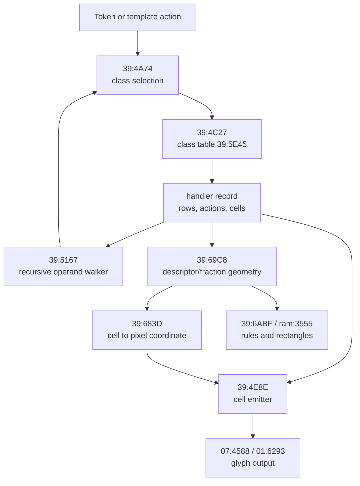
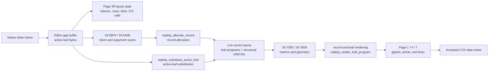

# Equation display (MathPrint)

MathPrint turns a tokenized expression into a two-dimensional screen layout for
the home-screen entry line, the **Y=** editor, the Solver equation line, and the
template menus. It consumes the token stream described in [Tokenizer and
TI-BASIC tokens](tokenizer-basic.md) and
preserves the OP registers described in
[Floating-point engine](floating-point.md).

The token stream, record graph, and editor state coexist while an expression
is being edited; together they emit a transient drawing stream. MathPrint does
not repeatedly flatten the equation to pixels and parse it back. [confirmed]

The table below separates those three stored representations from their
output:

| Representation | What it preserves | Main code |
|----------------|-------------------|-----------|
| Native token stream | Calculator tokens and the active gap-buffer split. | Page `06` editor helpers |
| Live record graph | Expression nesting, child order, active child, and per-record geometry. | Page `34` construction and traversal |
| Editor layout state | Token classes, handler rows, argument slots, and focused cells. | Page `39` |
| Drawing stream | Positioned glyphs, points, lines, and accepted LCD writes. | Pages `01`, `04`, and `07` |

Page `39` is a cell-grid typesetter for the editable template view. It
classifies a token, selects a compact handler record, walks rows and argument
slots, and turns cells into positioned output. Page `34` constructs, measures,
and redraws the live record graph. Both paths eventually use the services in
[Display and LCD](display-lcd.md). [confirmed]


```mermaid
flowchart TD
    token["Token or template action"] --> dispatch["39:4A74<br/>class selection"]
    dispatch --> table["39:4C27<br/>class table 39:5E45"]
    table --> record["handler record<br/>rows, actions, cells"]
    record --> operand["39:5167<br/>recursive operand walker"]
    record --> cell["39:4E8E<br/>cell emitter"]
    record --> geom["39:69C8<br/>descriptor/fraction geometry"]
    operand --> dispatch
    geom --> coord["39:683D<br/>cell to pixel coordinate"]
    coord --> cell
    cell --> glyph["07:4588 / 01:6293<br/>glyph output"]
    geom --> rules["39:6ABF / ram:3555<br/>rules and rectangles"]
```

This first diagram follows the page `39` cell path. The record graph in the
next section is a separate, longer-lived representation. [confirmed]

Two companion pages continue this one. [MathPrint live editor and settled
drawing](sub-mathprint-editor.md) follows an edit from the gap buffer through
the record graph to pixels and pins the settled-drawing traces.
[MathPrint validation and browser model](sub-mathprint-validation.md) lists the
verification stack behind the standalone renderer.

## Editor state and record graph

MathPrint keeps native token bytes in an editor gap buffer and maintains a live
arena of numbered records. Page `39` treats the active expression as token
classes, handler rows, argument slots, and packed `D:E` display cells.
`eqdisp_handler_table` (`39:5E45`) contains 68 entries. Sixty-six entries point
to decoded handler records; the class-`0x00` pointer does not decode as a page `39`
handler, and class `0x13` has a null pointer. [confirmed]

Page `34` allocates the record arena while the editor is active. A leaf record
contains a token program. A structural record contains a fixed header followed
by child record IDs. `eqdisp_find_structural_record` (`34:4ACE`) walks the
structural region, and `eqdisp_find_leaf_record` (`34:4A83`) walks the leaf
region. `eqdisp_substitute_active_leaf` (`34:4AAF`) substitutes the active
gap-buffer payload when the leaf pointer equals
`mathprintArenaState.active_leaf` at `0x8DC2` (base `mathprintArenaState` at
`0x8DAF`). The record graph therefore preserves
the editable equation tree before evaluation; page `39` row and cell state is
the transient layout view of that live equation. [confirmed]

`eqdisp_allocate_record` (`34:4900`) commits a prepared arena record.
`eqdisp_render_leaf_program` (`34:660A`) later executes the settled leaf's
token-and-marker payload. [confirmed]


```mermaid
flowchart LR
    tokens["Native token bytes"] --> gap["Editor gap buffer<br/>active leaf bytes"]
    gap --> editor["Page 39 layout state<br/>classes, rows, slots, D:E cells"]
    gap --> scan["34:58F9 / 34:5A99<br/>token and argument scans"]
    scan --> build
    build["eqdisp_allocate_record<br/>record allocation"] --> recordArena["Live record arena<br/>leaf programs + structural child IDs"]
    gap --> substitute["eqdisp_substitute_active_leaf<br/>active-leaf substitution"]
    substitute --> recordArena
    recordArena --> metrics["34:7393 / 34:7609<br/>metrics and geometry"]
    metrics --> render["record and leaf rendering<br/>eqdisp_render_leaf_program"]
    render --> primitive["Page 1 / 4 / 7<br/>glyphs, points, and lines"]
    primitive --> lcd["Accepted LCD data writes"]
```

The record graph decodes as an expression tree because structural child IDs
preserve argument order. The handler records describe how an editable token
class is laid out; they do not by themselves encode one whole equation tree.
[confirmed]

## Core state

The layout engine keeps most of its state in `0x85DE`–`0x85F2`. The table below names the
fields that matter for reading the page `0x39` code. [confirmed]

| RAM | Role | Meaning |
|-----|------|---------|
| `0x85DE` | mode / class | Caller mode at entry, then the current layout class. |
| `0x85DF` | row index | Current row inside the selected handler or template. |
| `0x85E0` | slot index | Current argument or cell slot. |
| `0x85E1` | row count | Number of rows in the current handler record. |
| `0x85E2` | slot count | Number of cells or arguments in the active row. |
| `0x85E3`–`0x85E6` | saved display state | Snapshot of shared display flags while the engine redraws. |
| `0x85E7` | OP scratch | Saved `OP1` slot used while recursing into operands. |
| `0x85E8` | template kind | Low nibble selects descriptor-backed template UI. |
| `0x85E9/0x85EA` | descriptor origin | Packed pixel base used by descriptor cell mapping. |
| `0x85EB` | row height | Pixel height for the current descriptor row. |
| `0x85EC/0x85ED` | cell pointer | Pointer to descriptor cell data. |
| `0x85EE/0x85EF` | fraction geometry | Measured numerator/denominator cell counts for fraction templates. |
| `0x85F2` | OP scratch | Second saved `OP1` slot. |
| `0x86D7/0x86D8` | pen coordinate | Pixel coordinate staged before graph/small-font output. |
| `0x844B/0x844C` | text row/column | Shared OS cursor row and column; `844C` also participates in overflow. |
| `0x984A` | baseline row | The row restored around recursive operand emission. |
| `0x9D27` | saved geometry | Copy of the measured fraction geometry used by the template handoff. |

The main draw/measure distinction comes from `(IY+0x36)` bit 6. Clear means the engine is
measuring or preparing state; set means it may emit pixels. Several other `IY` flags bias
class selection: `(IY+0x09)` bit 0 selects fraction/argument context, while `(IY+0x02)`
bits 4, 5, and 6 select exponent and alternate edit forms. [confirmed]

## Page 39 handler recipes

MathPrint uses two formats that are easy to confuse. A page `39` handler is a
shared layout recipe selected by token class. A page `34` arena record is one
node in the current expression: it stores the operands and geometry for that
particular occurrence. The recipe says *how* to arrange a class; the arena
record says *what* this expression contains. [confirmed]

A visible expression is driven by handler recipes reached through
`eqdisp_handler_table`. Each class has one word entry:

```text
handler = eqdisp_handler_table[class]
```

Most entries point to compact data, not executable code. The common record format is a
variable-length tail:

```c
typedef uint16_t EqDispCell;  /* high byte D, low byte E */

typedef struct {
    uint8_t row_count;
    uint8_t cell_count[];  /* row_count entries */
    /* uint8_t row_action[row_count]; */
    /* EqDispCell cell[sum(cell_count[0..row_count - 1])]; */
} EqDispHandlerRecord;
```

`row_action[]` bytes are row labels or control actions. They are separate from the cell
stream. The row-cell pointer routine at `39:4DCA` skips the row count, the per-row cell
counts, and the row-action bytes before it reaches the packed two-byte cells. The cell
emitter at `39:4DE6` then walks the selected row and calls `39:4E8E` for each `D:E` cell. [confirmed]

Examples:

| Class | Record | Meaning |
|-------|--------|---------|
| `0x08` | `39:608B` | Numeric-calculus operator row, including `nDeriv(` and `fnInt(`. |
| `0x0D` | `39:60F9` | Fixed structural glyph rows, including direct `Lintegral` cells. |
| `0x29` | `39:6546` | Group/root-family control row. |
| `0x2A` | `39:654D` | Root/power row containing the `00 10` payload cell. |
| `0x30` | `39:6030` | Fraction-context variant of the class-`0x08` operator row. |
| `0x31` | `39:6433` | Stacked root/power row with a degree row. |

The display cell `00 C8` is the visible `fnInt(` name. It appears in class `0x08` and
class `0x30`; it is distinct from the fixed `Lintegral` glyph cells in class `0x0D`. [confirmed]

## Page 34 expression records

Every settled record begins with this 20-byte header. The word names remain
address-based where different render types assign different meanings. [confirmed]

```c
#pragma pack(push, 1)
typedef struct {
    uint16_t id;          /* +00h: arena ID */
    uint8_t type;         /* +02h: leaf/object or structural render type */
    uint16_t word03;      /* +03h: parent ID in captured constructed records */
    uint16_t word05;      /* +05h: leaf height or structural child selector */
    uint16_t word07;      /* +07h: type-specific height or width */
    uint16_t word09;      /* +09h: type-specific width */
    uint16_t word0B;      /* +0Bh: local x origin for recursive entry */
    uint16_t word0D;      /* +0Dh: local y origin or type-specific anchor */
    uint16_t word0F;      /* +0Fh: type-specific flags or depth state */
    uint16_t word11;      /* +11h: payload length or dimensions/depth */
    uint8_t byte13;       /* +13h: first payload byte or type-specific data */
} SettledRecordHeader;
#pragma pack(pop)
```

Leaf types below `0x1F` store `word11` payload bytes beginning at `+0x13`.
Structural types `0x1F`–`0x2B` retain the complete header and append
little-endian child IDs at `+0x14`. `eqdisp_resolve_child` (`34:6CCD`) resolves
a child ID through `34:4B05` and `eqdisp_find_leaf_record`; the child words are
not pointers. Captured construction
writes place the parent record ID at `+3`. [confirmed]

A leaf payload is also a small record program. The sequence
`EF type id_lo id_hi` invokes a structural record. `EF 2D` closes or separates
that embedded object without drawing a glyph. Ordinary native token bytes stay
in program order around those markers. A power record of type `0x2A` binds the
preceding leaf run as its base and child 1 as its exponent. [confirmed]

### Construction tables

Construction is table-driven rather than a switch over complete expressions:

```pseudocode
\begin{algorithm}
\caption{Construct one structural arena record}
\begin{algorithmic}
\STATE $t \gets \operatorname{LookupRenderType}(sourceToken)$ \COMMENT{eqdisp\_source\_type\_table}
\STATE $g \gets \operatorname{LookupAllocationGeometry}(t)$ \COMMENT{eqdisp\_allocation\_geometry\_table}
\STATE $record \gets \operatorname{AllocateArenaRecord}(g)$
\STATE $\operatorname{ReserveChildIds}(record, g)$
\STATE $s \gets \operatorname{LookupChildScan}(t)$ \COMMENT{eqdisp\_child\_scan\_table}
\STATE $children \gets \operatorname{ScanSourceArguments}(s)$
\STATE $\operatorname{StoreChildrenInRenderOrder}(record, children)$
\end{algorithmic}
\end{algorithm}
```

Three ROM table families supply those steps. `eqdisp_source_type_table`
(`34:594D`) maps 16 source-token pairs to render types.
`eqdisp_child_scan_table` (`34:59AC`) gives one five-byte scan row for each type
`0x1F`–`0x2B`. `eqdisp_allocation_geometry_table` (`33:4F82`) gives the
corresponding allocation geometry. The
metric and geometry passes dispatch the same 13-type domain through `34:739F`
and `34:7611`. [confirmed]

### Capacity gate

`33:4F6D` also decodes the three-byte rows in
`eqdisp_allocation_geometry_table`. It returns
the workspace request in `DE`, the child-slot count in `BC`, and the record
size in `HL`. For example, the type-`0x22` integral row returns 112 workspace
bytes, four child slots, and 28 record bytes. Type `0x2B` derives all three
values from its matrix element count at `33:4F42`–`33:4F6C`. [confirmed]

`34:4869` passes that workspace request to the capacity gate at
`34:4B7C`. `eqdisp_capacity_remaining` (`34:4B86`) starts with the word at
`0x8DB1`. When
`(IY+2Dh).0` is clear, it subtracts the conditional reserve at `0x8DF8`; when
the bit is set, it skips that subtraction. It then subtracts the record tail
at `0x8DBE`. Each subtraction follows `OR A`, so it starts with carry clear and
wraps as a 16-bit word. A borrow from the record-tail subtraction makes
`34:4B80` skip the request comparison. Otherwise `34:4B82` subtracts the
requested bytes. Either carry returns from the allocator caller at `34:486F`
with `A=0x02`; an exact fit continues with zero bytes remaining. [confirmed]

The finite capacity model partitions all $2^{65}$ combinations of four input
words and the reserve-gate bit into six paths. A 524,287-state raw-byte
differential basis covers each word value at the range and request boundaries.
The initial values of `0x8DB1`, `0x8DBE`, and `0x8DF8` still depend on the
calling editor state, so this gate alone does not define one source-character
limit for every home-screen expression. The gate and projected model are
[confirmed]. A context-independent character limit remains [hypothesis].

`settledRecordAllocationCheck()` translates `eqdisp_allocate_record_checked`
(`34:4862`):
it obtains the workspace request from the type/matrix geometry row and passes
that request to the capacity gate, retaining the allocator's `A=02h` carry
return. The arena words remain explicit because their producers walk the
record list at `34:4A83`/`34:4ACE`; this boundary is therefore a stateful input
rather than a fabricated free-space estimate. [confirmed]

The structural children preserve semantic argument order after the source scan
applies the metadata permutation. For example, the integral metadata is
`04 03 04 01 02`: scan kind 4 reads four source arguments and assigns them to
children 3, 4, 1, and 2. The settled graph then stores lower endpoint, upper
endpoint, body, and variable in the order consumed by the type-`0x22` renderer.
[confirmed]

## Token classification

`eqdisp_dispatch_token` (`39:4A74`) turns an incoming token or action byte into a layout
class. It first handles the special `0x3D` template handoff, then applies context bias. [confirmed]

```pseudocode
\begin{algorithm}
\caption{Class selection}
\begin{algorithmic}
\REQUIRE incoming byte $a$
\IF{$a = \mathtt{0x3D}$}
  \STATE jump to the template handoff at \texttt{39:672E}
  \RETURN
\ENDIF
\STATE $c \gets a - \mathtt{0x2A}$
\IF{exponent/edit-context flags select an alternate form}
  \STATE bias $c$ into the alternate class family
\ENDIF
\IF{fraction or argument context is active and $c \in \{3,4,5,6,7,8\}$}
  \STATE $c \gets c + \mathtt{0x28}$
\ENDIF
\STATE $\mathtt{85DE} \gets c$
\STATE $HL \gets \mathrm{word}(\mathtt{39:5E45} + 2c)$
\end{algorithmic}
\end{algorithm}
```

This is why the same token can render differently in ordinary and stacked contexts. For
example, class `0x08` and class `0x30` share the `fnInt(`/`nDeriv(` operator family, but
`0x30` is selected after the fraction-context bias. [confirmed]

## Argument composition

The high-level loop is:

1. Save display and OP state.
2. Classify the current token into `0x85DE`.
3. Load the handler record from `39:5E45`.
4. Measure row and slot counts into `0x85E1/0x85E2`.
5. Recurse into argument slots when a handler cell represents an operand.
6. Restore the baseline row and emit visible cells during the draw pass.

The static caller graph assigns multi-argument walking to `39:5167`. When
selected, it keeps the argument index in `0x85E0` and uses `0x85E2` as the
argument count. Forward paths pass saved OP1 state through `39:59E0`; reverse
paths use `39:59F9`. These routines dispatch `_FindAlphaUp` and `_FindAlphaDn`
on page 7, respectively; they do not dispatch a parser-stream scanner.
[confirmed] `_FindAlphaUp` and `_FindAlphaDn` scan the physical VAT and retain
the nearest alphabetic successor or predecessor. The result does not depend on
the physical order of VAT records. [confirmed]

For `fnInt(expr,var,lower,upper[,tol])`, the visible MathPrint fields preserve parser
order: slot 0 is the integrand, slot 1 is the variable, slot 2 is the lower endpoint,
slot 3 is the upper endpoint, and slot 4 is the optional tolerance. The evaluator on
pages `02` and `33` consumes the same order. [confirmed]

The same routine implements tall-template row composition. `eqdisp_layout_main` reaches
`39:5167` from the action-`0x08` window-advance path at `39:50A4` and the action-`0x04`
single-step path at `39:52B3`. `39:5167` calls `39:5949` to decide whether the next argument
consumes one or two display rows, adjusts `0x844B`, emits slot markers through `39:4E0A`,
and emits the saved operand through `39:5B10` or `39:5B1D`. These bytes define
row composition around fixed structural cells. The filled and nested-integral
traces below do not select this entry. [confirmed]

The action byte chooses how that argument window advances:

| Action | Decision | Result |
|--------|----------|--------|
| `0x03` at `39:51F1` | Argument index is nonzero. | Walk backward through `39:523B`. |
| `0x03` at `39:51F1` | Index is zero and `(IY+1Dh).0` is set. | Emit the row-token tail. |
| `0x03` at `39:51F1` | Index is zero, the flag is clear, and count is below eight. | Call `39:5167` once per byte count, then emit the visible suffix and final row-7 argument. |
| `0x03` at `39:51F1` | Count is at least eight. | Begin the visible window at `count - 8 + baseline`. |
| `0x04` at `39:52A5` | `uint8((count - 1) - index)` is nonzero. | Walk once through `39:5167`, then emit the row-token tail. |
| `0x04` at `39:52A5` | The difference is zero and `(IY+1Dh).0` is set. | Emit the same row-token tail. |
| `0x04` at `39:52A5` | The difference is zero and the flag is clear. | Lay out argument zero through `39:513E`. |

All count arithmetic is byte-sized. In particular, an initial zero in the
action-`0x03` do-while loop at `39:50A1` wraps to `0xFF` and makes 256 calls.
`39:4DCA` locates the handler row, `39:4CA4` emits its visible suffix, and
`39:4E14` emits the final argument on row 7. The action-`0x04` delegated return
passes through `39:5447` and `39:52A2`. [confirmed]

### Action bytes are TI key codes

The action byte that reaches `eqdisp_layout_main` (`39:4F9A`, entered with the
code in `A`) is a raw key code from the editor's key-dispatch loop. The
dispatcher compares it directly. `CP 2` (`kLeft`) at `39:5048` opens the
backward-walk path. `CP 8` (`kAlphaDown` in the `ti83plus.inc` keypress
equates) at `39:507C` opens window advance. [confirmed]

The window-advance body computes
`count(0x85E2) - index(0x85E0) + baseline(0x844B)`. For values below nine, it
stores `6` at `0x844D` and loops over `CALL 39:5167` with the `DEC (HL)`
counter at `39:50A4`–`39:50AB`. Otherwise, `ADD A,7` repositions the index
before the jump to `39:5132`. [confirmed]

Two traces constrain which inputs select it:

- A trace of a 20-digit integrand does not reach `eqdisp_layout_main` while the
  content scrolls. Its template dispatchers run during insertion transitions.
  In-slot horizontal scrolling uses a separate page-`39` scroll set
  (`39:530A`–`39:539F`, `39:53A1`–`39:53FE`,
  `39:5500`–`39:5563`, `39:5605`–`39:5632`, `39:5709`–`39:572C`,
  `39:57AC`–`39:57FC`, and `39:5955`–`39:599B`). Character scrolling inside
  that slot is not a compositor event. [confirmed]
- Inserting a nested radical into the integrand re-enters the layout dispatcher
  at `39:507C`. The action is not `kAlphaDown`, so the relayout jumps directly
  to `39:5112`. This structural insertion does not select window advance.
  [confirmed]

The translator at `39:53A1` converts a specific incoming key code into layout
actions. It first calls bcall ID `4A68h`, whose body at `07:59F1` is a context
test rather than a key fetch. The body copies the entry `A` to `B` and calls
the helper at `07:59E5`. That helper compares `cxMain` at `0x858D` with
context ID `0x5B53`. A mismatch returns NZ. When the context matches, the body
returns Z only for codes `0x41`–`0x59` that equal the context byte at `0x859A`.
[confirmed]

The translator then compares the preserved `A` with `0xFB`. On a match, it
reads the template ID at `0x8446`: `0xC7` yields action `7`, and `0xC8` yields
action `8`, before the jump to `39:4F9A`. Register captures show `0xC8`
(`kFnInt`) at `0x8446` when `fnInt(` is inserted, including a nested insertion
inside another integral's integrand. The `ti83plus.inc` equates identify
`0xC7` as `kNDeriv`, `0xC8` as `kFnInt`, and `0xFB` as `kwnA`. Plain template
insertion therefore does not pass the `CP 0xFB` gate. The editor state that
sends `0xFB` to this handler remains open. [confirmed]

Five more jumps to `39:4F9A` occur on page `35`, at `35:4DAE`, `35:4E73`,
`35:4F1D`, `35:4F70`, and `35:5052`. The jump at `39:53D7` is another entry.
These entries have not yet been attributed to specific editor events.
[confirmed]

## Cell coordinates

Descriptor-backed templates use a fixed ABI. A descriptor is:

```c
typedef struct {
    uint16_t base_yx;       /* packed base y/x coordinate */
    uint16_t box_yx;        /* packed box y/x coordinate */
    uint8_t  row_height;
    uint16_t cols_rows;     /* packed column/row count */
    uint16_t cell_pointer;  /* pointer to descriptor cells */
} EqDispTemplateDescriptor;
```

The mapper at `39:683D` converts a descriptor cell to pixels. Its index names
are transposed relative to conventional screen coordinates: the descriptor
row advances LCD $x$, while the descriptor column advances $y$. The `+7` loop
builds the packed high byte:

```z80
DEC B
ADD A,7
```

The `rowHeight + 2` loop builds the low byte. The caller stores `HL` to `penCol`
(`0x86D7`, low to $x$) and `penRow` (`0x86D8`, high to $y$):

$$
\begin{aligned}
x &= \mathit{base}_x \\\\
  &\quad + \mathit{row}\,(\mathit{rowHeight}+2).
\end{aligned}
$$

$$
y = \mathit{base}_y + 7\,\mathit{col}.
$$

The known descriptors are:

| Descriptor | Kind | Use |
|------------|------|-----|
| `39:686F` | `0x10` | Fraction menu descriptor. |
| `39:6880` | `0x11` | Root/function template menu descriptor. |
| `39:6893` | descriptor family | Two-row template descriptor. |
| `39:689C` | descriptor family | Two-row, six-column descriptor. |
| `39:68A5` | descriptor family | Two-row, three-column descriptor. |

For kind nibbles `3` and above, `39:69C8` adds `0x10` and calls
`ram:025E`:

```z80
BIT 6,(IY+2)
RET
```

A set bit selects `39:689C`. Otherwise it adds `0x10` again and calls
`ram:0254`:

```z80
BIT 5,(IY+2)
RET
```

A set bit selects `39:68A5`, and a clear result selects `39:6893`. The JavaScript
`selectDescriptor` translation takes this caller-owned `flag02` byte explicitly
for the family branches and reports the byte that `39:69FC` stores back at
`0x85E8`. [confirmed]

Descriptor `39:6880` contains `FE09`, `FB C8`, `00 C7`, `00 C8`, and `FB C7` in one row.
That places `fnInt(` as a menu/template cell, not as a structural integral glyph. [confirmed]

## Fractions

Fractions are the most completely recovered dynamic template. The kind-2 fraction path
uses `0x85EE` and `0x85EF` as measured numerator and denominator widths. It draws a fixed
template box, emits the row/column labels, and updates the focused numerator or denominator
cell. [confirmed]

The rectangle helper at `39:6ABF` handles the focus rectangle. Its endpoint helper at
`39:6B1C` uses:

$$x_\text{left} = \mathtt{0x1B} + 7n$$

$$x_\text{right} = x_\text{left} + 4$$

Static callers of `39:6ABF`, `39:6B1C`, and the box wrapper `39:6AF5` are all in this
fraction-template UI path. The emitter for the visible bar in a generic
expression remains unidentified. [confirmed]

## Exponents and raised rows

Superscripts are represented as row placement, not as a font attribute. The helper at
`39:4CE9` raises classes in the `0x24`–`0x28` family and class `0x39` by forcing `0x844B`
to a higher display row before emitting the selected cell. The per-row height accounting
then folds that raised row into the parent layout. [confirmed]

This means `X^2` is stored and walked as ordinary cells in different rows. The row selection
does the work; the glyph for `2` is the ordinary one.

## Radicals

The recovered pieces establish where the radical data lives, but not yet the
complete page `39` emission route:

| Finding | Evidence | Confidence |
|---------|----------|------------|
| The large-font table contains `Lroot` code `0x10`. | `07:466F` | [confirmed] |
| Classes `0x2A` and `0x31` contain cell `00 10`; related cells use low byte `E=1F`. | Decoded handler recipes | [confirmed] |
| `39:4F1A` does not map `00 10`; the ordinary `_KeyToString` interpretation is `All+`. | Direct mapper and string table | [confirmed] |
| An upstream or dynamic path must select the final root-mark emitter. | The direct path remains unidentified. | [hypothesis] |

The low-byte `E=1F` cells use the ordinary token-string path. They are not the
special high-byte `D=1F` form used by the `39:4E8E` IX-backed branch.
[confirmed]

The static `39:5167` path can advance a recursive operand window when selected,
but the demonstrated traces do not connect it to the radical records. The
precise division between fixed root glyphs, radicand placement, and any
vinculum drawing remains open.

## Integrals and summations

The visible `fnInt(` menu cell and the structural integral glyph are separate things.

| Concept | Cell / glyph | Source |
|---------|--------------|--------|
| `fnInt(` display name | `00 C8` | Class `0x08`/`0x30` operator records and page-1 token-name strings. |
| Fixed integral glyph | `Lintegral` `0x08` | Class `0x0D` cells `FC3F` and `08 42`, emitted through `39:4F1A`. |
| Summation glyph | `0xC6` family | Fixed glyph data; no direct `00 C6` page `0x39` handler cell has been found. |

The fixed `Lintegral` glyph is emitted by the ordinary structural-glyph path:
`39:4E8E` runs the named-token prepass, continues to `39:4F1A`, maps the cell
to large-font code `0x08`, and emits it. [confirmed]

The static `39:5167` path can compose argument slots around a fixed glyph:

1. Place the tall integral glyph on the main axis.
2. Walk the lower, upper, integrand, and variable slots in parser order.
3. Update `0x844B` by the row step from `39:5949`.
4. Emit slot markers through `39:4E0A`.
5. Emit the operand bodies through `39:5B10` and `39:5B1D`.

The parser slot order and the static compositor are identified. The filled and
nested-integral traces use `39:4CA4` instead, so the expression or cursor state
that selects `39:5167` remains open. A headless TilEm trace that inserts the
`fnInt(` template and walks the cursor across its slots exercises the action
dispatcher once each at `39:51F1` (action `0x03`) and `39:52A5` (action
`0x04`) but takes the non-`5167` branches; the window-advance path at
`39:50A4` does not execute. The witness state therefore needs either more
arguments than the visible window (count ≥ 8) or a template whose slot walk
crosses a window boundary. Fixed glyph cells use `39:4E8E` and
`39:4F1A`; page `07:4588` copies large-font records. [confirmed]

## Archived fixed-token markers

Classes `0x17`, `0x18`, and `0x19` point to one-row records at `39:62C8`,
`39:62DF`, and `39:62F6`. Each record contains ten cells. Page 7 maps them to
fixed-token names `61 00`–`61 09` (`GDB1`–`GDB0`), `60 00`–`60 09`
(`Pic1`–`Pic0`), and `AA 00`–`AA 09` (`Str1`–`Str0`). [confirmed]

`39:6675–66BC` looks up each mapped name in the VAT. `_FindSym` returns the VAT
page byte through the record referenced by `HL`; five `DEC HL` instructions at
`ram:1785` move from the returned type byte to that page byte. A zero page
returns without output. A nonzero archive page emits display code `2Ah` (`*`)
through `ram:3FDB`. The original cell then continues through the counted-string
and direct-glyph stages. [confirmed]

## Emission paths

Cells reach pixels through a small set of output paths:

| Path | Entry | Use |
|------|-------|-----|
| Generic cell emitter | `39:4E8E` | Dispatches two-byte display cells. |
| Direct large glyph map | `39:4F1A` | Maps `FC3C`–`FC40`, `FE7D`–`FE81`, and `xx42` cells to large-font codes. |
| String path | `39:6B66` + page `01:6D10` | Converts ordinary token cells to counted strings. |
| Display-byte remap | page `07:44DE` | Remaps `FE`, `FC`, and `FB` prefixed display bytes. |
| Small-font blit | page `01:6293` | `_VPutMap`; emits small labels and compact limits from `0x86D7`. |
| Large-font blit | page `07:4588` | Copies one fixed large-font glyph record. |
| Rule / rectangle helpers | `39:6ABF`, `39:6AF5`, `ram:3555` | Draw fraction UI rectangles, boxes, and fixed chrome lines. |

`39:6675` saves a matched fixed-token cell's `E` byte in `keyExtend` and passes
its `D` byte to `07:44DE`. It constructs the VAT lookup name from the remapped
pair. Unmatched cells that map through `39:4F1A` instead use `05:4056` to build
a `5C:A` matrix name. The prepass emits `*` when the selected VAT record has a
nonzero page byte. The JavaScript translation preserves the lookup and output
order.
The committed layout artifact contains every table entry addressable from the
main entry. A pinned-byte interpreter compares all 65,536 combinations of
display byte and `keyExtend`; they reduce to seven paths and 12 branch outcomes.
The separate public entry at `07:44FE` is outside this main-entry domain. [confirmed]

The translated `39:4E8E–4F19` outer controller covers all 2,097,152 projected
states formed by `D:E`, the draw-pass flag and callback result, the
`curCol < 15` relation, and effective restriction-byte bits 1 and 2. They
reduce to 39 ordered paths, 22 branch outcomes, and seven minimum
representatives. The installed callback, indexed-string printer, and output
bcalls remain named boundaries rather than simulated return values.
[confirmed]

The marker gate at `39:4F44–4F61` compares `D:E` with `FBC8` and `FBC7`.
`FBC8` selects action `7` and mask `04h`; `FBC7` selects action `6` and mask
`02h`. Both actions reach `3D:7DC4` through `ram:3891`. `3D:7DC4` ANDs the byte
returned by `3D:45D9` with the selected mask. The JavaScript translation covers
all 262,144 combinations of `D:E` and the two effective restriction bits.
They reduce to five paths, six branch outcomes, and three minimum
representatives. [confirmed]

When the marker gate returns NZ, `39:4F62–4F99` draws a horizontal divider from
$(11, 59 - 8\mathit{curRow})$ through $(94, 59 - 8\mathit{curRow})$, with the
row coordinate reduced modulo 256. The routine copies `00 40 60 5F 5E` to the
five-byte display window at `0x8DA2`, forces `plotFlags.plotDisp` during
`_DarkLine`, and then restores the original `plotFlags` byte. `_DarkLine` at
`04:4025` preserves `AF`, so the branch at `39:4F8B` consumes the preceding
`_CheckSplitFlag` result. A horizontal split installs `20 20 60 5F 5E`; a
vertical split installs `0C 34 30 2F 2E`; otherwise the normal window remains.
The finite model covers all 2,048 row and effective `sGrFlags` states. They
reduce to three paths, four branch outcomes, and three minimum representatives.
[confirmed]

The `39:6675–66BC` translation covers every `D:E` pair with absent, RAM, and
archived exact-VAT results. These 196,608 projected states reduce to 13 paths,
14 branch outcomes, and six minimum representatives. The existing `_FindSym`
documentation supplies the exact fixed-token scan contract; the prepass model
accepts a logical VAT snapshot and performs the corresponding three-byte name
match. [confirmed]

`_KeyToString` at `01:6D10` uses that public entry for `FB`, `FC`, `FE`, and
`FF` cells, scans 13 high-byte special strings, or selects one of 101 counted
strings through the pointer table at `01:6E05`. The JavaScript translation
compares all 65,536 `D:E` pairs with a pinned-byte interpreter. A second
comparison covers all 1,024 prefix/index states admitted by the `_KeyToString`
caller at `07:44FE`. Together they resolve all 447 unique key-string cells in
the decoded handler records and descriptors. Installed font and token hook
bodies remain explicit external boundaries. [confirmed]

The page-7 large-font service copies fixed glyph rows. It does not measure a radicand or
stretch a glyph by itself. [confirmed]

The caller enters `07:4588` with the glyph code in `A` and its eight-byte
offset in `HL`. `07:45EB` converts that offset to the seven-byte table address
`07:45FF + 7 * code`. The entry then copies eight consecutive bytes to
`ram:845A`. The eighth byte is the first row of the next glyph. Code `FFh`
instead reads the byte `CDh` at `07:4CFF`, immediately after the 256-glyph
table. [confirmed]

The alternate entry at `07:45B6` uses the same address conversion and builds
the nine-byte map record `[06h, row0 << 1, ..., row6 << 1, 00h]`. The leading
width gives each five-pixel glyph a clear advance column. A pinned byte
interpreter matches the JavaScript translation for all 256 glyph codes at both
entries. [confirmed]

`(IY+35h).5` enables the font hook, and `(IY+35h).1` enables the localization
hook. A hook that returns Z either completes the copy entry or supplies the
pattern pointer consumed by the shifted entry. The 32 hook predicate states
reduce to 14 complete branch paths. Hook-provided pattern bytes remain external
to the translation. [confirmed]

## Evidence anchors

The page is intentionally an architecture summary, not a verifier log. These are the main
anchors for readers who want to check the disassembly. [confirmed]

| Address | Meaning |
|---------|---------|
| `39:4A74` | Main token/action dispatcher. |
| `39:4C27` | Class table lookup through `39:5E45`. |
| `39:4DCA` | Row-cell pointer computation for handler records. |
| `39:4DE6` | Row cell stream emitter. |
| `39:4E8E` | Generic two-byte cell emitter. |
| `39:4F1A` | Direct large-glyph classifier. |
| `39:4F08` | Text-column overflow check before marker handling. |
| `39:4E0A` | Argument-index marker emitter used by the row compositor. |
| `39:5167` | Multi-argument operand walker and tall-template row compositor. |
| `39:5949` | Row-step classifier for one-row versus two-row argument advance. |
| `39:5B10` / `39:5B1D` | Saved-E7 wrappers for ascending and descending alphabetic VAT searches. |
| `39:59E0` / `39:59F9` | `_FindAlphaUp` and `_FindAlphaDn` dispatchers. |
| `39:672E` | Template handoff for incoming `0x3D`. |
| `39:683D` | Descriptor cell-to-pixel mapper. |
| `39:68AE` | Geometry action handler. |
| `39:69C8` | Descriptor/fraction geometry selector. |
| `39:6ABF` / `39:6B1C` | Fraction focus rectangle and endpoint helper. |
| `39:6B66` | Generic string selector. |
| `39:66E9` / `39:66FE` | Reverse and forward argument-overflow cues. |
| `39:6712` | Overflow marker path; resets `curCol` and emits `:`. |
| `07:44DE` | Display-byte remapper. |
| `07:4588` | Large-font fixed glyph blitter. |
| `01:6293` | `_VPutMap` small-font pixel output. |

## MathPrint pipeline coverage

Coverage here has three layers. The declared control-flow graph defines the
branches being counted; finite models exhaust selected routine-level input
projections; dynamic traces show which of those branches calculator-created
states actually reach. A complete finite projection is not whole-machine
coverage, and a branch absent from the corpus is unresolved rather than
infeasible unless a separate invariant rules it out.

### Scope of the analyzer

`tools/ti84re/mathprint/analyze_saturation.py` bounds the coverage claim to nine
declared components: settled construction, settled rendering, metrics and
geometry, record allocation, editor layout, small-font/LCD output, point and
line primitives, large-glyph output, and alphabetic VAT selection. It
recursively follows direct ROM edges from named entries, seeds decoded table
destinations, overlays exact next-PC outcomes from 276 retained traces, and
lists direct external targets. Computed dispatch destinations are manually
seeded; bcall and RAM bjump bodies remain outside the direct-edge walk. Of those
traces, 275 reach their state through calculator input. One explicitly
classified synthetic trace inserts an `EF36h` editor buffer through direct RAM
writes. The report keeps the two provenance classes separate.
`tools/oracles/mathprint/mathprint-saturation.json` records the resulting branches and trace
hashes. [confirmed]

The analyzer can restore trace identities, provenance, and per-trace summaries
from a prior report and the digest-keyed cache. Regeneration therefore scans a
new trace once without reopening the other retained TLMT files. [confirmed]

None of the 276 report traces executes `39:5167`, `39:523B`, the saved-operand
wrappers at `39:5B10`–`39:5B38`, or the dispatchers at `39:59E0`/`39:59F9`.
The 276-digest trace cache also has no hit at those entries. [confirmed]
`_FindAlphaUp` at `07:50B5` executes once in 112 report traces, but every call
comes from the type-`16h` cleanup loop at `07:5544`. Each observed call returns
carry with OP1 unchanged; no trace supplies a successful alphabetic-search or
MathPrint caller witness. [confirmed]

The report is a symbolic-execution aid rather than a whole-machine proof. It
decodes fixed table rows and partitions selected projected input domains. The
scan-kind dispatcher at `34:5678` partitions all 256 incoming `A` values into
seven terminal paths. `eqdisp_draw_marker_primitive` (`34:6143`) partitions the
$256 \times 2 \times 65{,}536 = 33{,}554{,}432$ projected tuples over incoming
`A`, `(IY+44h).3`, and the word at `0x8520`. Its predicates reduce those tuples
to 14 branch-path classes and ten terminal actions. This count covers the
projected inputs, not every register and RAM state. The marker-tail callee at
`34:759C` reduces 16 abstract predicate valuations to five return classes.
Stream length, arbitrary RAM, and unmodeled indirect targets remain outside
these finite models. [confirmed]

The page-7 domains partition all 32 masked type classes, 192 declared type/key
form pairs, all 8,192 type/record-marker pairs, and all 288 abstract candidate
decisions. A fifth domain covers both terminal return states. A sixth
partitions all 33,554,432 combinations of return state, incoming OP extension
bytes, and selected-record continuation byte. The candidate
projection includes direction, type equality, filter result, the `FFh`
sentinel, source relation, and current-best relation. These domains cover the
translated branch predicates and minimize representatives for their outcomes.
They do not enumerate arbitrary VAT length, every possible eight-byte name, or
every surrounding machine state. [confirmed]

The extended raised-token classifier at `34:580C` has a caller-scoped domain of
3,047 packed-token states. `34:5866` handles numeric bytes and `B0h` first, and
`34:5887` skips `EF1Eh`. The remaining ordinary bytes and 11 two-byte token
families reduce to 12 complete classifier paths. The `5Fh` and `EBh`
designators enter bounded eight- and five-byte name scans. The loop at
`34:583D` accepts digits `30h`–`39h` and letters `41h`–`5Bh`; a source boundary
or any other byte stops it. The analyzer enumerates every accepted digit/letter
prefix, stop class, and counter exit. These are finite byte-class projections,
not claims that every packed token or name occurs in a calculator-created
expression. [confirmed]

### Finite symbolic models

The analyzer generates one deterministic representative for every complete
path-equivalence class in 52 finite models. It also computes an exact minimum
representative set for the branch outcomes in each model. The checked unit test
regenerates the complete corpus from the model functions. Schema 5 of the report
stores its aggregate counts rather than repeating the generated representatives.
The minimums are per domain: the five- and eight-byte name-loop ABIs share branch
addresses, but a representative for one ABI does not cover the other. [confirmed]

| Finite model | Projected inputs | Path classes | Branch outcomes | Minimum representatives |
|--------------|-----------------:|-------------:|----------------:|------------------------:|
| Structural scan-kind dispatch | 256 | 7 | 12 | 7 |
| Structural-depth gate | 256 | 2 | 2 | 2 |
| Structural-insertion dispatch | 65,536 | 6 | 10 | 6 |
| Raised extended-token classifier | 3,047 | 12 | 22 | 10 |
| Five-byte raised-name loop | 493,112,577 | 125 | 10 | 4 |
| Eight-byte raised-name loop | 24,977,631,672,321 | 1,021 | 10 | 4 |
| Shared marker draw helper | 33,554,432 | 14 | 26 | 13 |
| Settled render nesting tail | 16,777,216 | 15 | 24 | 11 |
| Point mode and buffer routing | 2,048 | 28 | 22 | 5 |
| Drawing-hook dispatch | 4 | 3 | 4 | 2 |
| Point style dispatch | 512 | 5 | 8 | 5 |
| Point bounds | 33,554,432 | 7 | 14 | 7 |
| Thick-point expansion | 4,294,967,296 | 8 | 14 | 8 |
| Shaded-point expansion | 3,145,728 | 1,850 | 30 | 8 |
| Small-font pointer selection | 65,536 | 16 | 31 | 16 |
| Token-hook dispatch | 1,048,576 | 9 | 10 | 5 |
| Direct cell-to-large-glyph selection | 65,536 | 9 | 16 | 9 |
| Display-byte remapper | 65,536 | 7 | 12 | 7 |
| `_KeyToString` `_sOK` prefix | 1,024 | 5 | 8 | 5 |
| `_KeyToString` selector | 65,536 | 35 | 40 | 14 |
| Page-39 cell-string selector | 131,072 | 14 | 16 | 8 |
| Page-39 archived-token prepass | 196,608 | 13 | 14 | 6 |
| Page-39 marker restriction gate | 262,144 | 5 | 6 | 3 |
| Page-39 marker row retouch | 2,048 | 3 | 4 | 3 |
| Page-39 cell-emission controller | 2,097,152 | 39 | 22 | 7 |
| Glyph advance and delimiter padding | 131,072 | 6 | 10 | 4 |
| `_VPutMap` byte-boundary gate | 56 | 2 | 2 | 2 |
| MathPrint `_VPutMap` right-edge gate | 3,584 | 4 | 6 | 2 |
| MathPrint `_VPutMap` row state | 112 | 4 | 10 | 2 |
| `_VPutMap` aligned-byte composition | 917,504 | 2 | 2 | 2 |
| Large-glyph hook dispatch | 32 | 14 | 16 | 8 |
| Metric marker-tail gate | 16 | 5 | 8 | 5 |
| Editor action `0x03` controller | 131,072 | 11 | 9 | 4 |
| Editor action `0x04` controller | 131,072 | 5 | 5 | 3 |
| Reverse argument-overflow cue | 65,536 | 2 | 2 | 2 |
| Editor horizontal viewport | 17,179,869,184 | 8 | 6 | 2 |
| Editor vertical viewport | 17,179,869,184 | 8 | 6 | 2 |
| Editor vertical overflow cues | 4,294,901,760 | 5 | 8 | 3 |
| Editor left-overflow cue | 1,099,494,850,560 | 5 | 8 | 5 |
| Editor right-overflow cue | 281,474,976,710,656 | 5 | 10 | 4 |
| Glyph vertical viewport | 1,099,511,627,776 | 16 | 22 | 6 |
| Glyph viewport gates | 30,064,771,072 | 3 | 4 | 3 |
| `logBASE` counted-string viewport | 8,589,934,592 | 20 | 6 | 1 |
| Embedded-record viewport gate | 4,294,967,296 | 2 | 2 | 2 |
| Record-allocation capacity | 36,893,488,147,419,103,232 | 6 | 6 | 2 |
| Saved-operand wrappers | 16 | 12 | 12 | 8 |
| FindAlpha type normalization | 32 | 31 | 8 | 4 |
| FindAlpha key preparation | 192 | 13 | 14 | 4 |
| FindAlpha record stepping | 8,192 | 8 | 12 | 4 |
| FindAlpha candidate reducer | 288 | 25 | 17 | 10 |
| FindAlpha endpoint | 2 | 2 | 4 | 2 |
| FindAlpha OP scratch transition | 33,554,432 | 2 | 5 | 2 |

The 52 models contain 3,484 path classes and 587 distinct modeled branch
outcomes. Their per-domain minimum corpora contain 274 representatives. Each
class records its concrete representative, projected-state count, terminal,
and complete branch-outcome sequence. These representatives saturate the
declared projections. They do not establish calculator reachability or cover
state outside those projections. [confirmed]

The table models also distinguish decoded rows from reachable indices.
`eqdisp_lookup_render_type` (`34:5935`) scans 16 source-token rows but has 15
first-match classes: row 6
duplicates the `0006h` mapping at row 3 and can never win the first-match scan.
The report partitions the other 65,521 packed `D:E` values into the no-match
class. The render, allocator, and editor-class index models decode all 256
8-bit inputs. Types `0x1F`–`0x2B` select the 13 render and allocator rows;
class bytes `0x00`–`0x43` select the 68 editor rows. Other inputs read adjacent
ROM bytes. This records local index behavior without asserting that each
overread is reachable through a calculator entry. [confirmed]

The metadata rows use scan kinds `0`, `1`, `2`, `3`, `4`, and `6`. Natural
traces witness six of the seven dispatch classes. Scan kind `2` would take
`34:5680` into the fraction scanner at `34:56DF`, but no retained invocation
does so. Existing fraction construction instead reaches the same scanner
through another entry route. The outcome remains unresolved because the
metadata value proves local relevance but does not prove caller reachability.
[confirmed]

### Dynamic coverage

The report keeps complete path witnesses separate from individual branch
outcome witnesses. A class whose branch outcomes all occur somewhere in the
corpus is not necessarily a class traversed by one invocation. The editor ABI
of `eqdisp_draw_marker_primitive` has seven complete live path witnesses. The render-table ABI has
one ROM-fixed class because `_LdHLind` fixes `A=0x43`. The `34:759C` model ends
at the callee return. It records the continuations at `34:755F`, `34:6FC9`, and
the tail-jump caller at `05:785F` separately. A branch outcome unique to each
return class identifies which callee paths have live witnesses. [confirmed]

| Component | Reachable instructions | Natural / all-evidence outcomes | Outcomes in CFG | Natural / all-evidence instruction coverage |
|-----------|-----------------------:|--------------------------------:|----------------:|--------------------------------------------:|
| Settled construction | 991 | 249 / 250 | 408 | 80.93% / 80.93% |
| Settled rendering | 1,898 | 258 / 259 | 302 | 97.52% / 97.52% |
| Metrics and geometry | 470 | 77 / 77 | 80 | 100.00% / 100.00% |
| Record allocator | 64 | 7 / 7 | 8 | 98.44% / 98.44% |
| Alphabetic VAT search | 236 | 17 / 17 | 92 | 34.32% / 34.32% |
| Editor layout | 2,776 | 255 / 255 | 1,098 | 33.03% / 33.03% |
| Small-font and LCD output | 413 | 81 / 81 | 122 | 75.54% / 75.54% |
| Point and line primitives | 508 | 50 / 50 | 134 | 59.65% / 59.65% |
| Large glyphs | 130 | 16 / 16 | 32 | 68.46% / 68.46% |

These counts describe the declared CFG and retained saturation corpus, not all
OS entry states. A branch with both outcomes observed is dynamically saturated
for that corpus. A branch with one or no outcomes remains open even when its
containing routine has been reached. Metrics and geometry and the allocator
have no wholly unobserved branch. The other seven components still do. Three of
the allocator's four branches and 37 of the 40 metric branches have both
outcomes. [confirmed]

The report classifies all 2,276 enumerated outcomes. Natural calculator input
exercises 1,010. The synthetic `EF36h` state adds two outcomes, for 1,012 across
all evidence. One allocator outcome is infeasible under its data invariant.
Two metric outcomes are infeasible under the calculator call ABI, and one is
infeasible under the valid **Y=** editor-entry invariant. Three small-font
pointer outcomes are infeasible under the `01:6702` entry invariant. The full
evidence set leaves 1,257 unresolved; the natural-only set leaves 1,259.
An unobserved outcome never becomes infeasible from absence alone. [confirmed]

The infeasible allocator outcome is the fallthrough at `33:4F4E`. The type
`0x2B` path loads rows and columns from record offsets `+0x13` and `+0x12`, then
`_HTimesL` (`00:1EF6`) computes their product. The matrix-creation path at
`02:5DCF` raises `_ErrDimension` when either dimension is zero. A valid settled
matrix record therefore reaches `33:4F4E` with a nonzero product and takes the
branch. [confirmed]

The calculator metric entries at `34:7377`, `34:737A`, and `34:7380` all pass
through `34:7386`, which loads `B=0`. The recursive route stores that zero at
`0x8512` and reloads it at `34:75F4` before `34:7606`. Induction over the
dispatcher recursion therefore fixes `B=0`. The `B!=0` outcomes at `34:73CD`
fallthrough and `34:765D` return are infeasible under this calculator ABI.
Synthetic direct calls to internal metric handlers do not share the ABI.
[confirmed]

The `BBh` route through `smallfont_glyph_ptr` reaches `01:6765` with Z set by
`CP BBh`; the intervening `LD A,L` preserves Z. The taken outcome is therefore
infeasible from `01:6702`. Both outcomes of `01:6776` are also infeasible
because that comparison's only predecessor is the dead taken edge at
`01:6765`. [confirmed]

### Minimal diverse trace corpus

The report computes two exact Z3 covers. The first preserves every individual
branch outcome observed in the supplied traces. It does not preserve complete
invocation paths, register or RAM states, dispatch indices, record cases, or LCD
write cases. The all-evidence branch cover selects 20 traces and preserves
1,012 outcomes in 4,424,233,548 bytes. The natural-only cover selects 21 traces
and preserves 1,010 outcomes in 4,580,267,958 bytes.

The diversity cover adds complete observed paths, modeled path classes,
dispatch indices, record types, and LCD-oracle types. It deliberately excludes
individual oracle identities, neighboring editor-state labels, raw register
values, and raw token values. Those values belong to regression fixtures rather
than the mechanism-diversity objective. The all-evidence universe has 1,106
tags and needs 26 traces. The natural-only universe has 1,104 tags and also
needs 26 traces. The retained byte totals are 5,118,199,506 and 5,204,001,186,
respectively. Both covers minimize trace count first, retained bytes second,
and labels third. [confirmed]

The diversity cover preserves only mechanisms represented by its tags. It does
not turn unobserved RAM into an observed state or prove that the traces reach
every symbolic valuation. The separate exhaustive models state their
preconditions; the dynamic cover states what the retained traces exercise.
[confirmed]

The 20-trace all-evidence branch cover retains the nested derivative, complete
root-level structural-navigation, depth-two fraction **LEFT**, mixed
radical/fraction traversal, integral, and **Y=**/table runs below. Other selected
traces cover every outcome in the depth-four log-base, log-base marker, and
radical runs, so the exact solver omits them. The macro paths contain no
`memwrite` command or execution hook. The raw TLMT files remain outside the
repository; their hashes identify the exact inputs used by the report.
[confirmed]

The all-evidence cover omits the token-built matrix traversal because the
synthetic state already covers its otherwise-new `34:6B94` outcome. The
natural-only cover selects it with 15 exclusive outcomes, including the first
natural `34:6B94` taken witness. [confirmed]

| Input | Reproduction macro | Trace SHA-256 | Exclusive outcomes in the full branch cover |
|-------|--------------------|--------------|--------------------------|
| Nested derivative with tall body and value | `tools/macros/mathprint-nested-tall-nderiv.macro` | `e11c011b74df79165c55f7f64b699e3aa393bf8087f45ec89a73d616b73cdbb5` | 10 |
| Depth-four log-base and power tree | `tools/macros/mathprint-nested-depth4.macro` | `b8d970906e63db96d36847dfcafed91d97e73fc7699294cc8debd08e7affdd93` | Omitted |
| Log-base marker insertion | `tools/macros/mathprint-logbase-boundary-insert.macro` | `a49e4c13c93358662713da7f5e07862f42863d60a70ce18e141a90987914008b` | Omitted |
| Radical marker insertion | `tools/macros/mathprint-radical-nonspecial-insert.macro` | `e7b79e37149f2b9b4a986bdbb114a89b03cd452bbecc6da20490edc972895e98` | Omitted |
| Integral marker insertion | `tools/macros/mathprint-integral-boundary-insert.macro` | `328b8f52ebe939b35f79e676076984aa85ee59e05c06862647c4fc615069bb3c` | 2 |
| Mixed summation traversal | `tools/macros/mathprint-editor-summation-left-navigation.macro` | `55fee4452906f94c2f3133961879ce4daec8fa0a98a5b69be1c27eae27190d3d` | 3 |
| Completed nDeriv and log-base traversal | `tools/macros/mathprint-editor-extra-structural-navigation.macro` | `d77bdeb19c52dd1337db4ea0410c1d5970924a7a3bf6a589742280b508fda776` | 2 |
| Remaining insertable structural traversal | `tools/macros/mathprint-editor-remaining-structural-navigation.macro` | `6263edce978d46750859f38c964ec4858b2c28fc8f6c914d510a8c332a01d85f` | 19 |
| Token-built matrix traversal | `tools/macros/mathprint-editor-matrix-navigation.macro` | `78639019ccf6b1d01a62b2f88dc5ff619382c08fe81396886aa0c49bcfe962d4` | Omitted |
| Depth-two fraction **RIGHT** | `tools/macros/mathprint-editor-nested-fraction-right-navigation.macro` | `15e6bccf136c7212fd36f7bf8ed570fd1ebbe161c8ef58584a439e891237d1ac` | Omitted |
| Depth-two fraction **LEFT** | `tools/macros/mathprint-editor-nested-fraction-left-navigation.macro` | `6cd38899f36e5a6398a0d1959557f8cb45172b4046db1f39cdfa298250066e6a` | 1 |
| Fraction nested in a radical | `tools/macros/mathprint-editor-radical-fraction-navigation.macro` | `99d813bdbb7102c9bd5ae608c0cc9eb64cd84c0410a06e4f2243e1768d86c574` | 1 |
| **Y=**/table/power round trip | `tools/macros/mathprint-yequ-table-power-insert.macro` | `ac719f540d2adfca05d2ffa415f065b83eaf407f04fca42f5ae63c440a746b9d` | 16 |
| **Y=** equals-sign selection sweep | `tools/macros/mathprint-yequ-state-sweep.macro` | `56733273b52ab4281ca2998ec2b89ece3083deb75c01160f97b936f30b73fe2f` | Omitted |

The two depth-two fraction traces each contain the same 367 branch outcomes.
The **LEFT** trace is 34,465,218 bytes smaller, so the lexicographic minimum
retains it and omits the **RIGHT** trace. This substitution changes retained
bytes without changing the covered-outcome count. [confirmed]

The mixed radical/fraction trace supplies the first natural `34:75B0`
fallthrough with `A=27h`, the radical marker outside the special fraction,
nth-root, and power set. It exercises the last two previously unseen metric
instructions and raises metric/geometry instruction coverage to 100%. The
component has 77 exercised outcomes, two outcomes proven infeasible under the
calculator ABI, and one proven infeasible under the valid **Y=** editor-entry
invariant. All 80 outcomes are classified. [confirmed]

The retained `mathprint_integral_boundary_insert` trace reaches `34:6968`
taken, `34:6B6D` fallthrough, and `34:6B94` fallthrough through calculator
input. It supplies the natural witnesses recorded for all three outcomes.
[confirmed]

Four additional reset-origin traces close ten natural branch outcomes and four
complete editor-helper paths. Their macros use key input only. The screenshots
and `A` at each discriminator were checked before admission. [confirmed]

| Input | Reproduction macro | Trace SHA-256 | Complete `eqdisp_draw_marker_primitive` path |
|-------|--------------------|--------------|-------------------------|
| Absolute-value marker | `tools/macros/mathprint-absolute-boundary-insert.macro` | `103f3acc7f1ad13d1bf88af45ecacdc7e34133e66cc9c00fb57587674357cacf` | `A=0x21` → display code `0x7C` |
| $e^x$ marker | `tools/macros/mathprint-e-power-boundary-insert.macro` | `c927963c5db9a1f6f18652213764eabbf7a4fa9f2d2a74b7dae320fe882d7917` | `A=0x25` → display code `0xDB` |
| $10^x$ marker | `tools/macros/mathprint-ten-power-boundary-insert.macro` | `eb337f479d112e88537f0950fd7d2a917d101cfafda98447fb717a9a35f1e1e4` | `A=0x26` → display code `0x1D` |
| Summation marker | `tools/macros/mathprint-summation-boundary-insert.macro` | `980b2d17df5753223881090235fcca4bb4e8457a37c6cb05eef8f7a54314adf8` | `A=0x29` → display code `0xC6` |

The synthetic `EF36h` trace uses
`tools/macros/mathprint-ef36-injected-buffer.macro`. Its two `memwrite`
commands place `EF 36 31 11` at the editor cursor. It is the sole synthetic
source in the 276-trace report. It supplies the only evidence for
`34:5A23` fallthrough and `34:6992` taken. The token-built matrix traversal
supplies the first natural witness for `34:6B94` taken. The full minimum
retains it; the natural minimum excludes it by construction. [confirmed]
