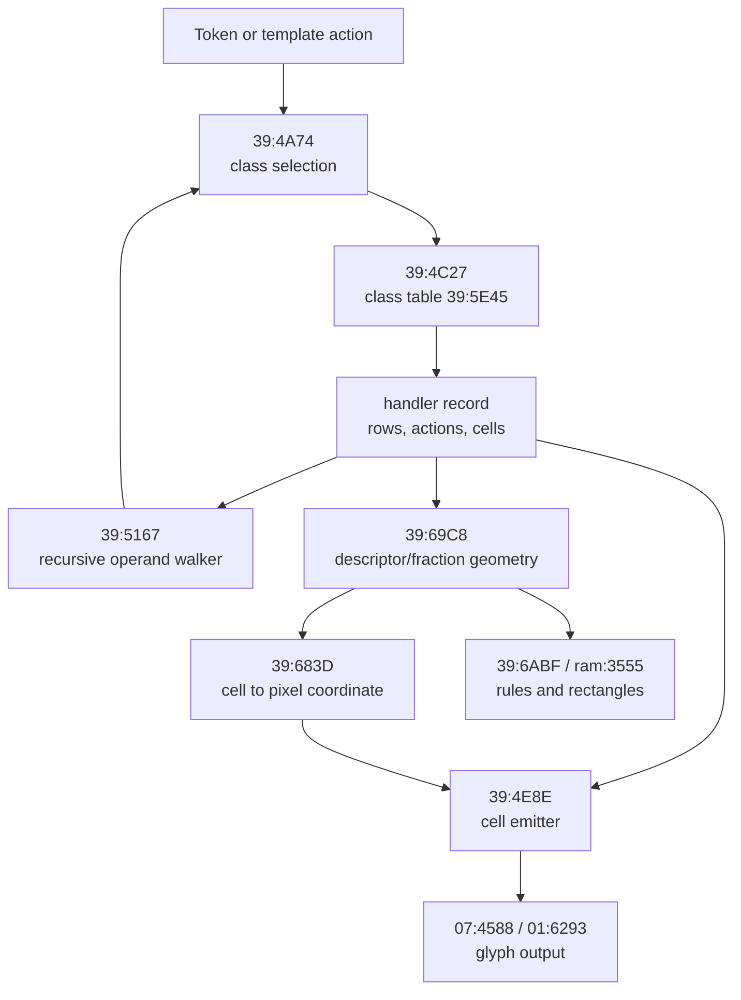

# Equation display (MathPrint)

MathPrint is the OS subsystem that turns a tokenized expression into a two-dimensional
screen layout. It is used by the homescreen entry line, the Y= editor, the Solver
equation line, and the template menus. Page `39` handles template editing and
record selection. The settled homescreen redraw traverses display objects on
page `34`. Both paths drive the services described in [Display and LCD](display-lcd.md).
It consumes the token stream described in [Tokenizer & TI-BASIC](tokenizer-basic.md)
and preserves the OP registers described in [Floating-point engine](floating-point.md).

The editor path is a cell-grid typesetter. The OS classifies each token, selects
a compact handler record, walks the expression into rows and slots, maps each
cell to pixel coordinates, and emits glyphs or graph-buffer rules. A page `34`
object walker redraws the settled expression through page `01` glyph output and
page `04` line and point routines. [confirmed]


```mermaid
flowchart TD
    token["Token or template action"] --> dispatch["39:4A74<br/>class selection"]
    dispatch --> table["39:4C27<br/>class table 39:5E45"]
    table --> record["handler record<br/>rows, actions, cells"]
    record --> operand["39:5167<br/>recursive operand walker"]
    record --> cell["39:4E8E<br/>cell emitter"]
    record --> geom["39:69C8<br/>descriptor/fraction geometry"]
    operand --> dispatch
    geom --> coord["39:683D<br/>cell to pixel coordinate"]
    coord --> cell
    cell --> glyph["07:4588 / 01:6293<br/>glyph output"]
    geom --> rules["39:6ABF / ram:3555<br/>rules and rectangles"]
```

The diagram shows the page `39` editor path. It does not describe the page `34`
settled-expression walker. [confirmed]

## Core state

The layout engine keeps most of its state in `0x85DE`–`0x85F2`. The table below names the
fields that matter for reading the page `0x39` code. [confirmed]

| RAM | Role | Meaning |
|-----|------|---------|
| `0x85DE` | mode / class | Caller mode at entry, then the current layout class. |
| `0x85DF` | row index | Current row inside the selected handler or template. |
| `0x85E0` | slot index | Current argument or cell slot. |
| `0x85E1` | row count | Number of rows in the current handler record. |
| `0x85E2` | slot count | Number of cells or arguments in the active row. |
| `0x85E3`–`0x85E6` | saved display state | Snapshot of shared display flags while the engine redraws. |
| `0x85E7` | OP scratch | Saved `OP1` slot used while recursing into operands. |
| `0x85E8` | template kind | Low nibble selects descriptor-backed template UI. |
| `0x85E9/0x85EA` | descriptor origin | Packed pixel base used by descriptor cell mapping. |
| `0x85EB` | row height | Pixel height for the current descriptor row. |
| `0x85EC/0x85ED` | cell pointer | Pointer to descriptor cell data. |
| `0x85EE/0x85EF` | fraction geometry | Measured numerator/denominator cell counts for fraction templates. |
| `0x85F2` | OP scratch | Second saved `OP1` slot. |
| `0x86D7/0x86D8` | pen coordinate | Pixel coordinate staged before graph/small-font output. |
| `0x844B/0x844C` | text row/column | Shared OS cursor row and column; `844C` also participates in overflow. |
| `0x984A` | baseline row | The row restored around recursive operand emission. |
| `0x9D27` | saved geometry | Copy of the measured fraction geometry used by the template handoff. |

The main draw/measure distinction comes from `(IY+0x36)` bit 6. Clear means the engine is
measuring or preparing state; set means it may emit pixels. Several other `IY` flags bias
class selection: `(IY+0x09)` bit 0 selects fraction/argument context, while `(IY+0x02)`
bits 4, 5, and 6 select exponent and alternate edit forms. [confirmed]

## Handler records

A visible expression is driven by handler records reached through the class table at
`39:5E45`. Each class has one word entry:

```text
handler = word(39:5E45 + 2 * class)
```

Most entries point to compact data, not executable code. The common record format is a
variable-length tail:

```c
typedef uint16_t EqDispCell;  /* high byte D, low byte E */

typedef struct {
    uint8_t row_count;
    uint8_t cell_count[];  /* row_count entries */
    /* uint8_t row_action[row_count]; */
    /* EqDispCell cell[sum(cell_count[0..row_count - 1])]; */
} EqDispHandlerRecord;
```

`row_action[]` bytes are row labels or control actions. They are separate from the cell
stream. The row-cell pointer routine at `39:4DCA` skips the row count, the per-row cell
counts, and the row-action bytes before it reaches the packed two-byte cells. The cell
emitter at `39:4DE6` then walks the selected row and calls `39:4E8E` for each `D:E` cell. [confirmed]

Examples:

| Class | Record | Meaning |
|-------|--------|---------|
| `0x08` | `39:608B` | Numeric-calculus operator row, including `nDeriv(` and `fnInt(`. |
| `0x0D` | `39:60F9` | Fixed structural glyph rows, including direct `Lintegral` cells. |
| `0x29` | `39:6546` | Group/root-family control row. |
| `0x2A` | `39:654D` | Root/power row containing the `00 10` payload cell. |
| `0x30` | `39:6030` | Fraction-context variant of the class-`0x08` operator row. |
| `0x31` | `39:6433` | Stacked root/power row with a degree row. |

The display cell `00 C8` is the visible `fnInt(` name. It appears in class `0x08` and
class `0x30`; it is distinct from the fixed `Lintegral` glyph cells in class `0x0D`. [confirmed]

## Token classification

`eqdisp_dispatch_token` (`39:4A74`) turns an incoming token or action byte into a layout
class. It first handles the special `0x3D` template handoff, then applies context bias. [confirmed]

```pseudocode
\begin{algorithm}
\caption{Class selection}
\begin{algorithmic}
\REQUIRE incoming byte $a$
\IF{$a = \mathtt{0x3D}$}
  \STATE jump to the template handoff at \texttt{39:672E}
  \RETURN
\ENDIF
\STATE $c \gets a - \mathtt{0x2A}$
\IF{exponent/edit-context flags select an alternate form}
  \STATE bias $c$ into the alternate class family
\ENDIF
\IF{fraction or argument context is active and $c \in \{3,4,5,6,7,8\}$}
  \STATE $c \gets c + \mathtt{0x28}$
\ENDIF
\STATE $\mathtt{85DE} \gets c$
\STATE $HL \gets \mathrm{word}(\mathtt{39:5E45} + 2c)$
\end{algorithmic}
\end{algorithm}
```

This is why the same token can render differently in ordinary and stacked contexts. For
example, class `0x08` and class `0x30` share the `fnInt(`/`nDeriv(` operator family, but
`0x30` is selected after the fraction-context bias. [confirmed]

## Layout pass

The high-level loop is:

1. Save display and OP state.
2. Classify the current token into `0x85DE`.
3. Load the handler record from `39:5E45`.
4. Measure row and slot counts into `0x85E1/0x85E2`.
5. Recurse into argument slots when a handler cell represents an operand.
6. Restore the baseline row and emit visible cells during the draw pass.

The static caller graph assigns multi-argument walking to `39:5167`. When
selected, it keeps the parser argument index in `0x85E0` and uses `0x85E2` as
the argument count. Normal operands pass through `39:59E0`; variable operands
pass through `39:59F9`. Both routes delegate token scanning to page 7, reusing
its single field order. [confirmed]

For `fnInt(expr,var,lower,upper[,tol])`, the visible MathPrint fields preserve parser
order: slot 0 is the integrand, slot 1 is the variable, slot 2 is the lower endpoint,
slot 3 is the upper endpoint, and slot 4 is the optional tolerance. The evaluator on
pages `02` and `33` consumes the same order. [confirmed]

The same routine implements tall-template row composition. `eqdisp_layout_main` reaches
`39:5167` from the action-`0x08` window-advance path at `39:50A4` and the action-`0x04`
drain path at `39:52B3`. `39:5167` calls `39:5949` to decide whether the next argument
consumes one or two display rows, adjusts `0x844B`, emits slot markers through `39:4E0A`,
and emits the saved operand through `39:5B10` or `39:5B1D`. These bytes define
row composition around fixed structural cells. The filled and nested-integral
traces below do not select this entry. [confirmed]

## Cell coordinates

Descriptor-backed templates use a fixed ABI. A descriptor is:

```c
typedef struct {
    uint16_t base_yx;       /* packed base y/x coordinate */
    uint16_t box_yx;        /* packed box y/x coordinate */
    uint8_t  row_height;
    uint16_t cols_rows;     /* packed column/row count */
    uint16_t cell_pointer;  /* pointer to descriptor cells */
} EqDispTemplateDescriptor;
```

The mapper at `39:683D` converts a descriptor cell to pixels. The `+7` loop (`DEC B; ADD A,7`)
builds the *high* byte and the `+(rowHeight+2)` loop builds the *low* byte; the caller stores
`HL` to `penCol`(`0x86D7`, low→x) / `penRow`(`0x86D8`, high→y), so the two products land as:

$$x\ (\mathit{penCol}) = \mathit{base}_x + \mathit{row} \cdot (\mathit{rowHeight} + 2)$$

$$y\ (\mathit{penRow}) = \mathit{base}_y + 7 \cdot \mathit{col}$$

The known descriptors are:

| Descriptor | Kind | Use |
|------------|------|-----|
| `39:686F` | `0x10` | Fraction menu descriptor. |
| `39:6880` | `0x11` | Root/function template menu descriptor. |
| `39:6893` | descriptor family | Two-row template descriptor. |
| `39:689C` | descriptor family | Two-row, six-column descriptor. |
| `39:68A5` | descriptor family | Two-row, three-column descriptor. |

Descriptor `39:6880` contains `FE09`, `FB C8`, `00 C7`, `00 C8`, and `FB C7` in one row.
That places `fnInt(` as a menu/template cell, not as a structural integral glyph. [confirmed]

## Fractions

Fractions are the most completely recovered dynamic template. The kind-2 fraction path
uses `0x85EE` and `0x85EF` as measured numerator and denominator widths. It draws a fixed
template box, emits the row/column labels, and updates the focused numerator or denominator
cell. [confirmed]

The rectangle helper at `39:6ABF` handles the focus rectangle. Its endpoint helper at
`39:6B1C` uses:

$$x_\text{left} = \mathtt{0x1B} + 7n$$

$$x_\text{right} = x_\text{left} + 4$$

Static callers of `39:6ABF`, `39:6B1C`, and the box wrapper `39:6AF5` are all in this
fraction-template UI path. The emitter for the visible bar in a generic
expression remains unidentified. [confirmed]

## Exponents and raised rows

Superscripts are represented as row placement, not as a font attribute. The helper at
`39:4CE9` raises classes in the `0x24`–`0x28` family and class `0x39` by forcing `0x844B`
to a higher display row before emitting the selected cell. The per-row height accounting
then folds that raised row into the parent layout. [confirmed]

This means `X^2` is stored and walked as ordinary cells in different rows. The row selection
does the work; the glyph for `2` is the ordinary one.

## Radicals

The large-font table contains the fixed `Lroot` glyph (`0x10`) at `07:466F`.
The root/power records also contain the payload cell `00 10` in classes `0x2A`
and `0x31`. These facts do not establish a direct emission path between the
cell and that glyph. [confirmed]

The same records also contain low-byte `E=1F` cells for related power/root pieces. Those
cells follow the ordinary token-string path; they are not the special high-byte `D=1F`
cell form used by the `39:4E8E` IX-backed branch. [confirmed]

The direct mapper at `39:4F1A` does not accept `00 10`. If that cell follows the
ordinary string path, `_KeyToString` selects `All+`, not `Lroot`. The final
root-mark emitter must therefore be selected by an upstream or dynamic path
that remains unidentified. [hypothesis]

The static `39:5167` path can advance a recursive operand window when selected,
but the demonstrated traces do not connect it to the radical records. The
precise division between fixed root glyphs, radicand placement, and any
vinculum drawing remains open.

## Integrals and summations

The visible `fnInt(` menu cell and the structural integral glyph are separate things.

| Concept | Cell / glyph | Source |
|---------|--------------|--------|
| `fnInt(` display name | `00 C8` | Class `0x08`/`0x30` operator records and page-1 token-name strings. |
| Fixed integral glyph | `Lintegral` `0x08` | Class `0x0D` cells `FC3F` and `08 42`, emitted through `39:4F1A`. |
| Summation glyph | `0xC6` family | Fixed glyph data; no direct `00 C6` page `0x39` handler cell has been found. |

The fixed `Lintegral` glyph is emitted by the ordinary structural-glyph path:
`39:4E8E` calls the delimiter classifier, falls through to `39:4F1A`, maps the cell to
large-font code `0x08`, and emits it. [confirmed]

The static `39:5167` path can compose argument slots around a fixed glyph:

1. Place the tall integral glyph on the main axis.
2. Walk the lower, upper, integrand, and variable slots in parser order.
3. Update `0x844B` by the row step from `39:5949`.
4. Emit slot markers through `39:4E0A`.
5. Emit the operand bodies through `39:5B10` and `39:5B1D`.

The parser slot order and the static compositor are identified. The filled and
nested-integral traces use `39:4CA4` instead, so the expression or cursor state
that selects `39:5167` remains open. Fixed glyph cells use `39:4E8E` and
`39:4F1A`; page `07:4588` copies large-font records. [confirmed]

## Delimiters

The fixed delimiter families are handler records. Classes
`0x17`, `0x18`, and `0x19` point to one-row records at `39:62C8`, `39:62DF`, and
`39:62F6`. Each record contains ten cells. Page 7 maps those cells to output families
`61 00`–`61 09`, `60 00`–`60 09`, and `AA 00`–`AA 09`. [confirmed]

This covers the fixed delimiter surface. The delimiter families remain fixed
handler records and page `0x07` display-byte mappings. A runtime path that
selects their height remains unidentified. [confirmed]

## Emission paths

Cells reach pixels through a small set of output paths:

| Path | Entry | Use |
|------|-------|-----|
| Generic cell emitter | `39:4E8E` | Dispatches two-byte display cells. |
| Direct large glyph map | `39:4F1A` | Maps `FC3C`–`FC40`, `FE7D`–`FE81`, and `xx42` cells to large-font codes. |
| String path | `39:6B66` + page `01:6D10` | Converts ordinary token cells to counted strings. |
| Display-byte remap | page `07:44DE` | Remaps `FE`, `FC`, and `FB` prefixed display bytes. |
| Small-font blit | page `01:6293` | `_VPutMap`; emits small labels and compact limits from `0x86D7`. |
| Large-font blit | page `07:4588` | Copies one fixed large-font glyph record. |
| Rule / rectangle helpers | `39:6ABF`, `39:6AF5`, `ram:3555` | Draw fraction UI rectangles, boxes, and fixed chrome lines. |

The page-7 large-font service copies fixed glyph rows. It does not measure a radicand or
stretch a glyph by itself. [confirmed]

## Algorithm summary

```pseudocode
\begin{algorithm}
\caption{MathPrint layout}
\begin{algorithmic}
\STATE save display flags and OP scratch registers
\FOR{each visible token or template action}
  \STATE classify the token into a layout class
  \STATE load the class handler record from \texttt{39:5E45}
  \STATE read row count, row actions, and row cell counts
  \IF{the selected cell is an operand slot}
    \STATE recurse through the argument walker
  \ELSIF{the selected cell is a descriptor-backed template cell}
    \STATE map descriptor row/column to pixel coordinates
    \STATE emit the descriptor cell or marker action
  \ELSIF{the selected cell is a structural glyph}
    \STATE map it through the direct glyph path and emit the fixed glyph
  \ELSE
    \STATE convert it through the string or display-byte path
  \ENDIF
  \STATE update row, column, and overflow state
\ENDFOR
\STATE restore display flags and OP scratch registers
\end{algorithmic}
\end{algorithm}
```

## Evidence anchors

The page is intentionally an architecture summary, not a verifier log. These are the main
anchors for readers who want to check the disassembly. [confirmed]

| Address | Meaning |
|---------|---------|
| `39:4A74` | Main token/action dispatcher. |
| `39:4C27` | Class table lookup through `39:5E45`. |
| `39:4DCA` | Row-cell pointer computation for handler records. |
| `39:4DE6` | Row cell stream emitter. |
| `39:4E8E` | Generic two-byte cell emitter. |
| `39:4F1A` | Direct large-glyph classifier. |
| `39:4E0A` | Argument-index marker emitter used by the row compositor. |
| `39:5167` | Multi-argument operand walker and tall-template row compositor. |
| `39:5949` | Row-step classifier for one-row versus two-row argument advance. |
| `39:5B10` / `39:5B1D` | Saved-operand emitters used by forward and reverse placement. |
| `39:59E0` / `39:59F9` | Normal and variable operand emitters. |
| `39:672E` | Template handoff for incoming `0x3D`. |
| `39:683D` | Descriptor cell-to-pixel mapper. |
| `39:68AE` | Geometry action handler. |
| `39:69C8` | Descriptor/fraction geometry selector. |
| `39:6ABF` / `39:6B1C` | Fraction focus rectangle and endpoint helper. |
| `39:6B66` | Generic string selector. |
| `07:44DE` | Display-byte remapper. |
| `07:4588` | Large-font fixed glyph blitter. |
| `01:6293` | `_VPutMap` small-font pixel output. |

## MathPrint pipeline coverage

The static MathPrint map covers token classification, handler records,
recursive operand order, descriptor templates, fraction UI geometry, fixed structural
glyphs, display-byte remaps, generic output services, and multi-argument row composition.
The row compositor is `39:5167`; the pixel emitters are the fixed glyph and rule paths
listed above. The runtime selection of `39:5167` for an expression and cursor
state remains unobserved.

## Filled and nested-integrand traces

Two reset-origin TLMT v2 traces use the pinned ROM SHA-256
`7d9a7d96d89fc552ebee6afdbdd011fdc6047be9c16d308245dff07eb1f7bd6d`.
The raw traces remain outside the repository because they are 162 MB and 202 MB.
`tools/mathprint-trace-report.json` records their hashes, emulator provenance,
exact entry counts, state bytes, and replay results. [confirmed]

`web/mathprint/draw-order.json` preserves the visible pixel mutations after the
final expression key press. The filled-integral trace contains 351 accepted LCD
writes that change 522 pixels; the nested trace contains 391 writes that change
610 pixels. This sequence includes both set and clear transitions, so the
interactive preview can replay the controller's write order instead of an
inferred glyph order. [confirmed]

| Scenario | Page `0x39` editing hits | Final state | Settled LCD replay |
|----------|--------------------------|-------------|--------------------|
| `int(1,2,X^2,X)` | `4CA4` ×1, `4DCA` ×2, `4DE6` ×1, `4E8E` ×7, `4F1A` ×14 | `0x85E1=04`, `0x85E8=00` | 43×20; zero pixels differ from the model. |
| `int(1,2,(1//2)X,X)` | The same handler entries, plus `683D` ×5, `68AE` ×1, and `69C8` ×1 | `0x85E8=10`, `0x85EB=06`, `0x85EE=02`, `0x85EF=02` | 47×23; zero pixels differ from the model. |

Both traces execute `eqdisp_emit_subexpr2` at `39:4CA4`, not the static
multi-argument entry at `39:5167`. The nested case also executes the descriptor
cell mapper and geometry selector, confirming that handler-record emission and
descriptor geometry compose in one rendered expression. Neither trace reaches
the exact entries `39:5167`, `39:5949`, `39:5B10`, `39:5B1D`, or `39:6ABF`.
[confirmed]

The settled walker dispatches object kinds `0`–`12` through the word table at
`34:7012`. The handlers are `34:6D0C`, `706A`, `70B8`, `702C`, `7133`, `70A0`,
`70E2`, `70E2`, `7087`, `7102`, `717E`, `70C1`, and `71C6`, in order. Kinds 6
and 7 share `34:70E2`. The nested trace also visits transient records near
`0xFBDB` and `0xFBEF`, so the final RAM dump does not contain every walked
record. [confirmed]

These page `39` entries occur before the final **GRAPHVAR** key press. The
settled redraw after that key does not re-enter them. It calls `34:6D26` and
`34:737A` from `34:4347` and `34:434A`, then traverses the display objects from
`34:6016`. [confirmed]

For the nested scenario, `tools/analyze_mathprint_draw_trace.py` attributes all
391 visible-changing writes after the final key. The nearest page `34` frames
are `34:5FE7` → `ram:34E9` (158 writes), `34:6CA8` → `ram:3CE1` (96),
`34:5DA2` → `ram:3573` (78), `34:5EA3` → `ram:3567` (24), and `34:5DBA` →
`ram:3579` (10). The remaining 25 writes precede the page `34` object traversal
and come from the large-font path. The fixed-page stubs dispatch to page `04`
line and point routines and page `01:6297` small-font output. [confirmed]

The point wrapper at `34:5E85` clips each object coordinate through `34:5DD1`
and `34:5DEF`. Its closed tail at `34:5E98`–`34:5EA6` passes `B=x`,
`C=63-y`, and `D=1` to `_PointOn` at `04:4155`. Dynamic samples include
`(x,y)=(3,0)` → `BC=033Fh` and `(32,20)` → `BC=202Bh`. [confirmed]

The line wrappers share the viewport state at `0x8DFA`–`0x8E04`.
`34:5D96` passes a clipped vertical segment to `04:431D`; `34:5DA6` swaps the
axes and passes a clipped horizontal segment to `04:4382`. The nested trace's
fraction rule enters `34:5DA6` with object coordinates `x=1`–`5`, `y=6` and
origins `x=16`, `y=5`. Page `04` receives endpoints `(17,52)` and `(21,52)`.
[confirmed]

Render-record type `0x22` dispatches through `34:6105` and the table at
`34:6119` to `34:622F`. The word at record offset `+7` is the integral-sign
height $h$. The handler draws the inclusive stem `(2,1)`–`(2,h-2)`, then hook
points `(3,0)`, `(4,1)`, `(1,h-1)`, and `(0,h-2)`, in that order. [confirmed]

Render-record type `0x20` dispatches to `34:620A`. The handler renders child
records 1 and 2 through `34:636C` and `34:6378`, then reads each child's word at
offset `+7`. It draws an inclusive horizontal line from `(1,y)` to
`(max(w_1,w_2)+1,y)`, where the parent word at offset `+0x0B` supplies $y$.
The nested-fraction trace reaches the line wrapper with `BC=1`, `DE=5`, and
`HL=6`, yielding `(1,6)`–`(5,6)`. [confirmed]

Render-record type `0x2A` dispatches to a `JP 34:636C` at `34:6375`.
`34:636C` selects child record 1 through `34:6CCD` before entering the recursive
renderer. The wrapper emits no point, line, or glyph itself. The corrected
record-table trace identifies `0x2A` as the `X^2` root type. [confirmed]

Render-record type `0x27` dispatches to the radical handler at `34:62A1`. It
emits the ten-byte root-hook bitmap through `34:62D0`, draws the vertical stem,
selects child 1, and reads that child's word at offset `+7`. It then draws the
inclusive vinculum from `(2,0)` through `(w+3,0)` and renders child 1 through
`34:660A`. The cursor-free history redraw for `sqrt(X^2+1)` has height 8 and a
child `+7` width of `0x17`. It reaches the wrappers with stem
`(2,1)`–`(2,7)` and vinculum `(2,0)`–`(0x1A,0)`. This produces the 26-pixel
rendered width. The final editable-entry redraw has child width `0x1D` and a
vinculum endpoint of `0x20`; cursor and edit-state geometry therefore remain
separate from history-echo geometry. [confirmed]

Render-record type `0x21` dispatches to the absolute-value handler at
`34:6347`. The parent words at `+7` and `+9` supply height and width. The
handler draws inclusive vertical bars at `x=2` and `x=w-4`, then renders child
1 through `34:636C`. The cursor-free `abs(X-3)` history redraw reaches the line
wrapper with `(x,y_1,y_2)=(2,0,6)` and `(0x1A,0,6)`. [confirmed]

Render-record type `0x24` dispatches to the nth-root handler at `34:6315`. It
renders index child 1, emits the root-hook bitmap at `x=w_1-1`, draws its short
vertical segment, renders radicand child 2, and draws the vinculum. The
cursor-free `nthroot(3,X+1)` history redraw reaches the wrappers with vertical
segment `(5,3)`–`(5,4)` and vinculum `(5,2)`–`(0x18,2)`. [confirmed]

The remaining settled render types map to calculator constructs through the
source-token table at `34:594D` and post-**ENTER** traces. Type `0x23` renders
`nDeriv(`, `0x25` renders $e^x$, `0x26` renders $10^x$, `0x28` renders
`logBASE(`, `0x29` renders summation, and `0x2B` renders a dimensioned matrix.
Type `0x1F` is a transient root/container type; an ordinary scalar history
redraw does not dispatch it through `34:6105`. [confirmed]

Types `0x25` and `0x26` share the body at `34:6381`. The handlers position and
conditionally emit fixed display codes `0xDB` and `0x1D`, respectively. They
then render child 1. The child record supplies its local origin through offsets
`+0x0B` and `+0x0D`. [confirmed]

Type `0x28` dispatches to `34:63B2`. It emits the three bytes returned by
`_KeyToString` for `00C1h`, renders child 1, emits the opening compound shape
through `34:5D1A`, renders child 2, and emits the closing compound shape through
`34:5D07`. The settled `logBASE(2,8)` root has child IDs `0x0010` and `0x0011`.
[confirmed]

Type `0x29` dispatches to `34:6504`. It conditionally emits display code
`0xC6`, renders children 1–3, and surrounds child 4 with the compound emitters
at `34:5D1A` and `34:5D07`. It also conditionally emits display code `0x3D`
between children 1 and 2. The settled `sum(N,1,3,N^2)` root contains child IDs
`0x0014`–`0x0017`. [confirmed]

Type `0x2B` dispatches to `34:65AA`. It emits the left vertical bracket and its
two inward points, renders the matrix elements in child-ID order, then emits
the right bracket and its points. `33:4F23` derives the element-loop bound from
the dimensions at record bytes `+0x12` and `+0x13`. The high byte at `+0x12`
stores the column count. Byte `+0x13` stores the row count. A settled
$2\times2$ identity matrix renders four children between the bracket operations.
[confirmed]

The type-`0x2B` constructor lays out elements in row-major order. For element
width $w_{r,c}$ and height $h_{r,c}$, define the column and row extents as
[confirmed]

$$
C_c = \max_r w_{r,c}, \qquad R_r = \max_c h_{r,c}.
$$

The first column begins at $x_0=6$, and each later column begins after the
previous extent and a six-pixel gap. The first row begins at $y_0=0$, and each
later row begins after the previous extent and a two-pixel gap:

$$
x_{c+1}=x_c+C_c+6, \qquad y_{r+1}=y_r+R_r+2.
$$

Each element is centered within its row and column extent:

$$
X_{r,c}=x_c+\left\lfloor\frac{C_c-w_{r,c}}{2}\right\rfloor, \qquad
Y_{r,c}=y_r+\left\lfloor\frac{R_r-h_{r,c}}{2}\right\rfloor.
$$

For $m$ rows and $n$ columns, let $N_e$ be the element count, $H$ the matrix
height, $W$ the matrix width, and $y_c$ the vertical center:

$$
\begin{aligned}
N_e &= mn, & H &= \sum_r R_r+2(m-1), \\
W &= 12+\sum_c C_c+6(n-1), & y_c &=
\left\lfloor\frac{H}{2}\right\rfloor.
\end{aligned}
$$

The constructor stores $N_e$, $H$, $W$, and $y_c$ in the words at `+5`, `+7`,
`+9`, and `+0x0B`, respectively. [confirmed]

The word at `+0x11` stores the column count in its high byte and structural
depth in its low byte. The byte at `+0x13` stores the row count. When the matrix
contains more than one element, the allocation pass leaves one unused ID after
the first child. The reachable child sequence is therefore `0x11`, `0x13`,
`0x14`, and so on in captures whose matrix record is `0x10`. [confirmed]

Five reset-origin traces cover $1\times1$, $1\times2$, $2\times2$,
$2\times3$, and $3\times3$ matrices. The JavaScript constructor matches every
captured record field, child ID, and element position. The matrix result begins
at LCD row 9 and uses $x=95-W$, where $W$ is the outer leaf width at `+7`.
The generated streams match 32, 46, 92, 134, and 180 synchronous accepted LCD
data writes, respectively. [confirmed]

The $2\times3$ capture also contains eight accepted writes from the standard
timer's run-indicator handler at `01:6BBA`–`01:6BFA`. That handler reads and
rewrites LCD byte column 11 across rows 0–7 through `indicCounter` and
`indicBusy` at `0x8476`/`0x8477`. Removing those asynchronous writes leaves the
134-write MathPrint stream. The generated timeline models the synchronous
settled renderer and labels the interrupt writes separately in its oracle.
[confirmed]

`web/mathprint/rom-engine.js` implements the complete `0x1F`–`0x2B` structural
dispatch table as an executable record-graph walker. It resolves child IDs
through a node map, adds each child record's `+0x0B` and `+0x0D` origins on
recursive entry, preserves the handler's depth changes, and returns ordered
primitive and leaf operations. A settled expression enters this layer from a
type-`0x00` leaf program at `34:660A`. The program executor consumes its payload
in order and invokes embedded structural records against the same pen and depth
state. The `nDeriv(` handler renders child 1 again at `34:64B3`, then places
display code `0x3D` after that child's `+7` width. [confirmed]

The trace analyzer recovers leaf records from the resolver path. At `34:6CCD`,
`DE` is the one-based child index and `ram:8DF2` points at the parent. At
`34:6CD8`, `DE` contains the selected child ID and `HL` points at its resolved
record. Pairing these observations produces the complete record graph visited
by a settled render. [confirmed]

Leaf payload begins at record offset `+0x13`; the word at `+0x11` gives its
byte count. A one-byte scalar therefore stores its display byte at `+0x13`.
Compound leaf objects retain the subsequent bytes in the same record. A leaf
may construct and dispatch another structural record while it renders. The
analyzer preserves these secondary dispatches in instruction order. It uses the
first `34:660A` entry at the shallowest Z80 stack depth after the final key press
to identify the enclosing leaf program. [confirmed]

The analyzer also decodes the reachable settled graph into a semantic
expression tree. Structural child IDs recover argument order. A type-`0x2A`
record binds its exponent to the expression immediately before the
embedded-record marker. The decoder preserves `EF 1E` as an explicit extended
token. The renderer maps the pair to display code `0xF7`, so the decoded tree
exposes an unfilled template slot. The tree identifies the expression in a
trace without using LCD pixels or a screenshot. It describes the settled graph
consumed by `34:660A`; the editor/parser representation before `34:4900`
remains open. [confirmed]

Within that program, `EF type id_lo id_hi` invokes the structural record with
the given little-endian ID. `EF 2D` terminates or separates the embedded object
without drawing it. Ordinary payload bytes may follow. The settled
`sum(N,1,3,N^2)` entry invokes type `0x29`. Its body child emits `N`, invokes
type `0x2A`, and then closes the exponent object. This byte order matches the
structural dispatch and glyph trace order. [confirmed]

`executeSettledRecordProgram()` translates this byte stream rather than
replaying captured glyph events. Tests provide record headers, child IDs, and
payload bytes as input. They compare the generated display-code, coordinate,
depth, and order tuples with independently captured `34:6C37` observations for
absolute value, summation with an exponent, and nested `nDeriv(`. [confirmed]

The ordinary-token path resolves payload bytes through `smallfont_glyph_ptr`
at `01:6702`. A zero lead selects the word table at `01:4252`. The two-byte
leads `5Ch`, `5Dh`, `5Eh`, `60h`–`63h`, `7Eh`, `AAh`, `BBh`, and `EFh` select
tables at `01:4452`–`01:47E8`. The `5Eh` second byte selects one of four banks.
The `BBh` path clamps indices `F6h`–`FFh` to `F6h`. [confirmed]

Each selected pointer names one metadata byte followed by a counted
display-code string. Token `72h` therefore expands to `A`, `n`, `s`. Token
`C2h` expands to `s`, `i`, `n`, `(`. Two-byte token `5D 00` expands to `L` and
the subscript-1 display code. `_GetTokLen = 4591h` reads the count, and
`_Get_Tok_Strng = 4594h` copies the counted bytes. The browser uses the
ROM-extracted tables in `web/mathprint/token-strings.json`; it preserves native
token boundaries while constructing the settled record. [confirmed]

`34:6873` receives each resulting display code. It diverts `28h` and `29h` to
the compound-parenthesis emitters, including `28h` embedded in the spelling of
`sin(`. The open shape therefore uses the point and line order from `34:5D1A`
instead of the large-font glyph-row order. An explicit closing token `11h`
resolves to `29h` and uses `34:5D07`. [confirmed]

Six reset-origin traces cover `Ans+1`, `Ans^2`, `sqrt(Ans)`, `X^Ans`,
`sin(X)`, and `sin(sqrt(X))`. Their generated graphs match every record field.
Their complete accepted-write streams contain 49, 40, 63, 32, 56, and 83
writes, respectively. Replaying each generated stream produces the same final
96×64 LCD bitmap as replaying its captured `34:660A` interval. `X^Ans` verifies
the variable-width small-font spelling. `sin(sqrt(X))` verifies a counted token
spelling before a structural child and the compound shapes around its taller
metrics. The structural record stores the containing leaf's accumulated
horizontal anchor at `+0x0D`. [confirmed]

Five reset-origin traces cover `L1`, `[A]`, `Y1`, `Str1`, and `X^L1`. Their
generated record graphs match every field after normalizing record IDs. Their
accepted-write streams contain 21, 35, 21, 42, and 22 writes. The generated
stream and captured outer-`34:660A` interval have the same byte-column, row,
and value for every write. Replaying either stream produces the same 96×64 LCD
bitmap. `X^L1` verifies two-byte spelling and width in the small-font exponent
path. [confirmed]

The translated renderer then maps the ordered operations through the ROM font
bitmaps, page-4 point and line behavior, `_VPutMap`, the page-7 large-glyph
path, and LCD byte packing. Six settled programs reproduce every accepted LCD
data write through the outer `34:660A` return: absolute value (49 writes), nth
root (69), radical (82), summation (66), `nDeriv(` (96), and a nested
integral/fraction (114). This comparison includes accepted writes whose value
does not change the displayed byte. [confirmed]

The small-font table at `03:4CD6` stores seven rows per glyph. `_VPutMap` emits
the five interior rows. It retains an interior zero row, but it does not emit
the padding row above or below the glyph. A row that crosses an LCD byte
boundary writes the right byte before the left byte at `01:63CE`–`01:641A`.
The large-font path emits all seven rows of its fixed cell. [confirmed]

The absolute-value constructor translates a closed slice of the earlier record
pass. `34:5935` maps source token `00B2h` through the table at `34:594D` to
render type `0x21`. The translated `34:4900`, `34:7393`, and `34:7609` paths
construct the containing leaf, the absolute-value record, its child leaf, and
their settled metrics. Fresh reset-origin traces for `abs(2)`, `abs(X/2)`, and
`abs(X+12)` match the generated record fields and every accepted LCD data write.
The trace streams are comparison oracles and are not constructor inputs.
[confirmed]

The compositional constructor translates the type-`0x2A` power and type-`0x27`
radical paths. `34:5935` maps source token `00BCh` through `34:594D` to render
type `0x27`; the containing leaf embeds the structural ID and constructs the
radicand as child 1. Its settled height, width, and baseline derive from the
child metrics. Raised radicals select the final five rows of the root-hook
bitmap at `34:62D0`, while outer radicals use all seven rows. [confirmed]

`34:5935` maps source token `00F0h` through `34:594D` to render type `0x2A`.
The containing leaf embeds `EF 2A id_lo id_hi EF 2D`, and child 1 contains the
raised payload. The metric branches at `34:7393` and `34:7609` distinguish the
first raised row from later raised rows. The JavaScript translation constructs
right-associated record trees and obtains raised-glyph widths from the ROM
small-font table. [confirmed]

Parentheses remain ordinary leaf tokens `0x10` and `0x11` in the settled
record. `34:6873` maps their display codes `0x28` and `0x29` to the compound
emitters at `34:5D1A` and `34:5D07`. A raised parenthesis keeps a six-pixel
token-cell metric. The shape height and baseline follow the enclosed payload.
The type-`0x2A` word at `+0x0D` stores the containing leaf width accumulated
before the power object. It is `0x1E` for `(X+1)^2`, after the five six-pixel
leaf tokens, and `0x0C` for the power inside `(X^2+1)`. [confirmed]

Five reset-origin traces cover `(X+1)`, `(X^2+1)`, `(X+1)^2`, `X^(1+2)`, and
`abs(X^2+1)`. The generated record graphs and complete accepted-write streams
match these traces. The streams contain 49, 60, 59, 32, and 60 writes,
respectively. [confirmed]

When the base of a power ends in a structural object, the constructor writes
`3` to that object's word at `+0x0F`. The type-`0x2A` height and baseline also
increase by the base leaf's baseline above the ordinary baseline at that render
depth. For `sqrt(X)^2`, the power record has height 12, baseline 8, and an
`+0x0D` horizontal anchor of 11. [confirmed]

Reset-origin traces for `sqrt(X)^2`, `abs(X)^2`, and
`abs(sqrt(X^2+1))` match every generated record field and accepted LCD data
write. Their complete streams contain 35, 33, and 113 writes, respectively.
The nested case verifies the absolute-value bars, radical hook and vinculum,
powered radicand, and leaf glyphs in ROM emission order. [confirmed]

Fresh reset-origin traces for `X^2`, `X^12`, `2^X^2`, and `2^X^2^3` match the
constructed record fields and every accepted LCD data write. Their streams
contain 17, 22, 22, and 32 writes, respectively. These captures test one, two,
and three raised levels without supplying records or writes to the constructor.
[confirmed]

The type-`0x25` and type-`0x26` constructors map source tokens `00BFh` and
`00C1h` through `34:594D`. Both allocate one exponent child. The child begins at
`x=6`, uses raised small-font metrics, and determines the parent height, width,
and baseline. The handlers at `34:637E` and `34:63AD` emit fixed large-font
display codes `0xDB` and `0x1D` before rendering that child. [confirmed]

Reset-origin traces for `exp(12)`, `exp(X^2)`, `exp(1//2)`, and
`tenpow(X^2)` match every constructed record field and accepted LCD data write.
Each stream contains 22 writes. The JavaScript renderer generates the writes
from the expression tree, constructed records, structural handlers, ROM font
bitmaps, and LCD byte-packing logic. [confirmed]

The type-`0x28` constructor maps source token `EF34h` through `34:594D` and
reserves the base and argument leaves before scanning either payload. It places
the base at `x=18` and the argument after the base width at $x=w_b+24$. The
argument height and baseline determine the parent's height and baseline. The
parent width is $w_b+w_a+30$. [confirmed]

Reset-origin traces for `logbase(12,345)`, `logbase(X,X^2)`,
`logbase(3,1//2)`, and `logbase(1//2,3)` match every constructed record field.
Their complete accepted-write streams contain 99, 79, 91, and 71 writes. These
cases cover multi-token children, a powered argument, and a stacked fraction in
each child position. [confirmed]

Eight additional reset-origin traces cover radicals, sequences inside radicals,
nested radicals, powers inside radicals, and radicals inside powers. The deepest
cases are `sqrt(2^X^2)`, `sqrt(sqrt(2))`, `X^sqrt(2)`, and
`sqrt(X^sqrt(2))`. Their generated graphs and complete accepted-write streams
match the traces. The root bitmap comparison includes accepted writes whose
value does not change the LCD byte. [confirmed]

The type-`0x24` constructor maps source token `00F1h` through `34:594D`, then
allocates the containing leaf, structural record, index child, and radicand
child. The index uses the raised small-font metrics. The radicand begins four
pixels after the index width and four pixels below the parent origin. Its
height, width, and baseline determine the structural record metrics. At
`34:62D0`, an outer nth root selects all seven root-hook rows and a raised nth
root selects the final five. [confirmed]

Fresh traces for `nthroot(2,2)`, `nthroot(12,X+12)`,
`nthroot(3,X^2)`, and `X^nthroot(3,2)` match every generated record field and
accepted LCD data write. These cases cover a multi-token index, a structural
radicand, and a raised nth root. [confirmed]

The type-`0x20` constructor maps the stacked-fraction source token `EF2Eh`
through `34:594D`. It renders both children one depth below the containing leaf.
For numerator height $h_n$, denominator height $h_d$, and child widths $w_n$
and $w_d$, the settled metrics are [confirmed]

$$
\begin{aligned}
w &= \max(w_n,w_d), \\
x_n &= 2 + \left\lfloor\frac{w-w_n}{2}\right\rfloor, \\
x_d &= 2 + \left\lfloor\frac{w-w_d}{2}\right\rfloor, \\
y_d &= h_n + 3, \\
H &= h_n + h_d + 3, \\
W &= w + 4, \\
B &= h_n + 1.
\end{aligned}
$$

The numerator begins at $y=0$. The metric pass clears the numerator leaf's
word at `+0x0F`. The renderer consumes its payload through the word at `+0x11`.
[confirmed]

`34:4900` allocates structural records in a fraction numerator before it
allocates the enclosing type-`0x20` record. It allocates the numerator leaf
afterward. For `(X^2)//3`, IDs `0x11` and `0x12` identify the power record and
its exponent leaf. ID `0x13` identifies the fraction, `0x14` its numerator
leaf, and `0x15` its denominator leaf. The graph points from the numerator leaf
back to the earlier power record. A structural denominator follows the ordinary
recursive allocation order. A fraction nested in the numerator recursively
applies the same hoisting rule. [confirmed]

Thirteen reset-origin traces cover leaf, sequence, power, radical, nth-root,
and nested-fraction operands. The generated graphs match every captured record
field and ID. Their accepted LCD data-write streams also match through the outer
`34:660A` return. [confirmed]

Integral, summation, and `nDeriv(` records in a fraction numerator follow the
same hoisting rule. `34:4900` allocates the multi-argument record and reserves
its child leaves before it allocates the enclosing type-`0x20` fraction. The
nested structural record stores `0x10` at `+0x13`. Raised integral layout uses
a 10-pixel body-to-variable gap; the outer layout uses 12 pixels. In a raised
`nDeriv(X^2,X,...)` numerator, the body leaf stores `0x58` before the
type-`0x2A` marker, and the power record stores `4` at `+0x0D`. [confirmed]

Six reset-origin traces cover integral, summation, and `nDeriv(` numerators,
each with an ordinary body and a powered body. Before parity is accepted, the
trace analyzer must decode each settled graph to the asserted expression. The
JavaScript constructor then matches every record field and allocation ID, plus
every accepted LCD data write through the outer `34:660A` return. [confirmed]

The type-`0x22` constructor maps integral source token `0024h` through
`34:594D`. `34:4900` allocates the integral record, then reserves all four child
leaf IDs before it scans any child payload. The children hold the lower bound,
upper bound, body, and differential variable in that order. A structural child
allocates its records after all four reservations. A nested integral repeats the
same reservation rule recursively. [confirmed]

The bounds render one depth below the containing leaf. The body and variable
render at the containing depth. For lower-bound metrics $(h_l,w_l)$,
upper-bound metrics $(h_u,w_u)$, body metrics $(h_b,w_b,b_b)$, and variable
metrics $(w_v,b_v)$, the integral positions and parent metrics are [confirmed]

$$
\begin{aligned}
y_b &= \max(5,h_u), & s_l &= \max(5,h_l), \\
H &= y_b+h_b+s_l, & B &= y_b+b_b, \\
x_b &= \max(w_l,w_u)+12, & x_v &= x_b+w_b+12, \\
W &= x_v+w_v+2, & y_v &= B-b_v.
\end{aligned}
$$

The lower bound begins at $(6,H-h_l)$, the upper bound at $(6,0)$, and the body
at $(x_b,y_b)$. The type-`0x22` record stores $H$, $W$, and $B$ in the words at
`+7`, `+9`, and `+0x0B`. The variable child uses render type `1`. [confirmed]

Twelve reset-origin traces cover unequal token-bound widths, a multi-token body,
a different variable, power, radical, fraction, and nth-root bodies, structural
bounds, and a nested integral. The JavaScript constructor matches every record
field and ID. It also reproduces all accepted LCD data writes through the outer
`34:660A` return. The traces supply comparison oracles, not constructor input.
[confirmed]

The type-`0x29` constructor maps summation source token `EF33h` through
`34:594D`. `34:4900` allocates the summation record, then reserves child leaves
for the variable, lower bound, upper bound, and body in that order. It fills
their payloads after all four reservations. Structural arguments therefore
allocate their records after the reserved leaves. A nested summation applies
the same rule recursively. [confirmed]

The variable, lower bound, and upper bound render one depth below the containing
leaf. The body renders at the containing depth. The variable leaf uses render
type `1`. For child height, width, and baseline metrics $(h,w,b)$, define
[confirmed]

$$
\begin{aligned}
L &= w_v+4+w_l, & O &= \max(w_u,L,12), \\
S_u &= \max(5,h_u), & S_l &= \max(h_v,h_l), \\
H &= S_u+9+S_l, & B &= S_u+4, \\
x_b &= O+6, & W &= x_b+w_b+5.
\end{aligned}
$$

The variable begins at $(0,H-S_l)$ and the lower bound begins at
$(w_v+4,H-S_l)$. Placing both on the common lower row keeps structural lower
bounds aligned with the variable. The upper bound begins at
$(\lfloor(O-w_u)/2\rfloor,0)$. The body begins at $(x_b,B-b_b)$. The
type-`0x29` record stores `3`, $H$, $W$, and $B$ at `+5`, `+7`, `+9`, and
`+0x0B`, respectively. [confirmed]

Eleven reset-origin traces cover the representative `sum(N,1,3,N^2)` case,
unequal-width token limits, multi-token limits, power limits, radical,
nth-root, fraction, and power bodies, a different variable, and a nested
summation. The JavaScript constructor matches every record field and ID. It
also reproduces every accepted LCD data write through the outer `34:660A`
return. The traces supply comparison oracles, not constructor input.
[confirmed]

The settled lower-bound leaf for `sum(N,1,3,N^2)` contains `0x31`. The byte
pair `EF 1E` instead emits display code `0xF7`, the empty template square. It
appears in captures whose template navigation leaves a slot unfilled, including
discarded summation and `nDeriv(` captures. [confirmed]

The type-`0x23` constructor maps source token `0025h` through `34:594D`.
`34:4900` allocates the `nDeriv(` record, then reserves child leaves for the
variable, body, and evaluation value in that order. It fills those leaves
before it allocates structural descendants of the body or value. A nested
`nDeriv(` applies the same reservation rule recursively. [confirmed]

For body metrics $(h_b,w_b,b_b)$ and variable and evaluation-value widths
$w_v$ and $w_e$, the metric branches at `34:7485` and `34:76C2` produce
[confirmed]

$$
\begin{aligned}
B &= \max(6,b_b), & H &= \max(h_b,B+7), \\
x_v &= 5, & y_v &= B+2, \\
x_b &= 16, & y_b &= B-b_b, \\
x_e &= w_b+w_v+29, & y_e &= B+2, \\
W &= x_e+w_e.
\end{aligned}
$$

The type-`0x23` record stores `3`, $H$, $W$, and $B$ at `+5`, `+7`, `+9`,
and `+0x0B`. The variable leaf uses render type `1`. The valid settled scalar
case `nDeriv(X,X,1)` stores `0x58` in both the variable and body leaves. The
same body token precedes the type-`0x2A` marker in valid powered-body captures.
[confirmed]

Twelve reset-origin traces cover ordinary and unequal-width arguments, power,
radical, fraction, nth-root, and integral bodies, plus nested `nDeriv(`. The
JavaScript constructor matches every record field and ID. It also reproduces
every accepted LCD data write through the outer `34:660A` return. The traces
supply comparison oracles, not constructor input. [confirmed]

Flat absolute-value bodies and expressions composed from ordinary token runs,
the native `Ans`, `sin(`, `cos(`, `tan(`, `ln(`, and `log(` tokens,
right-associated powers, $e^x$, $10^x$, `logBASE(`, radicals, nth roots,
stacked fractions, and numeric matrices now run from tokens through record
construction, layout, drawing operations, and LCD byte writes. Integrals,
summations, and `nDeriv(` compose with the same translated forms in their
arguments and in a stacked-fraction numerator. The remaining
arbitrary-expression branches are still untranslated.
[confirmed]

Each dispatch also captures the viewport origin at `ram:8DFE`/`ram:8E00`.
Nested fraction `1/2` reaches `34:5DA6` with the local rule `(1,6)`–`(5,6)`
and origin `(16,5)`. Page 4 therefore receives the translated endpoints
`(17,52)` and `(21,52)`. [confirmed]

The fixed 20-byte record header contains a two-byte ID at `+0`, a type byte at
`+2`, eight unaligned little-endian words at `+3`, `+5`, `+7`, `+9`, `+0x0B`,
`+0x0D`, `+0x0F`, and `+0x11`, and a byte at `+0x13`. The analyzer names words
by offset until each render type establishes its meaning. Words following the
root header are child IDs. `34:6CCD` passes an ID through `34:4B05` and
`34:4A83` to resolve the child record; these words are not RAM pointers.
[confirmed]

Exact point counts matter here. The resolver's `--funcs` mode groups an
instruction under the nearest preceding symbol. It places 69 instructions in
the `39:5167` bucket for each scenario even though the entry itself has zero
hits. `tools/test_hardware_trace.py` covers this distinction. [confirmed]

## Cell encoding

`eqdisp_emit_glyph` (`39:4E8E`) dispatches each `D:E` cell by its `D` byte:
`D=0x1F` is a cursor marker (no draw), `D=0x82` selects an indexed string or
title, and
otherwise a counted-string selection (`39:6B66` → `_KeyToString = 45CAh` → `01:6D10`,
`_KeyToString`, with its pointer table at `01:6E05`) or a direct glyph via
`39:4F1A` (`FC3C`–`FC40` → glyph `E - 0x3C + 5`,
`FE7D`–`FE81` → `E - 0x7D`, `E = 0x42` and `D < 0x0A` → glyph `D`). So `00C8` draws the literal name
"fnInt(", not a glyph. The full decode is in
`tools/cell-glyph-spec.md` and
`tools/token-name-spec.md`; the placement geometry
(`683D`, `6B1C`, `5167`/`5949`, pen conversion) is in
`tools/geometry-spec.md`. [confirmed]

## Trace replay and renderer checks

The renderer writes through the LCD ports rather than a RAM framebuffer.
`tools/trace_lcd.py` replays reset-origin TilEm TLMT v2 LCD I/O through the
pinned TilEm T6A04 state model, including mirrored ports, data reads, busy-write
rejection, and the controller's 128×64 backing RAM. This reconstructs the
emulator bitmap for a complete compatible trace; it is not a physical-controller
claim. The controller behavior is [standard] for the pinned TilEm source model;
synthetic tests confirm the replay implementation.

`tools/parity-mathprint.py` selects that replay when tracing is enabled.
The local ignored `tools/rom.bin` enables pinned-ROM reproduction when present.
The browser's generated path encodes native calculator bytes, scans their
one- and two-byte token boundaries through translations of `34:58F9` and
`34:5911`, and splits nested arguments through the page-`34` parse-ahead state
machine at `34:5A99`–`34:5CAC`. The translation includes the public
`_AHEADEQUAL = 4B49h`, `_PARSAHEADS = 4B4Ch`, and `_PARSAHEAD = 4B4Fh`
entries plus the internal entries at `34:5AA3`, `34:5AA7`, and `34:5AA9`.
It constructs settled records and emits accepted LCD data bytes. Each
write replaces one eight-pixel span in a 96×64 framebuffer. Five changed and
deeply nested expressions pin every intermediate write and the packed final
framebuffer without loading a captured write stream. These deterministic cases
exercise summation, integral, `nDeriv(`, matrix, and a three-level raised
fraction. [confirmed]

The retained `sum(N,1,3,N)` trace exposes four calls through `34:5AA3` with
`C=1`. The scanner stops on the three depth-zero comma bytes. At the closing
`0x11` byte, it returns `A=0x11`, `DE=0xFF00`, and sets Z and C. The JavaScript
translation matches these registers, flags, and scratch bytes. Static byte
decoding covers the other mode bits and token classes; they do not yet have
independent dynamic coverage for every exit branch. [confirmed]

`34:5A05` classifies function openers from packed `D:E` tokens. Ordinary
one-byte tokens pass through `34:5A52`, `BB` tokens through `34:5A28`, and `EF`
tokens through `34:5A14`. The JavaScript scanner applies those comparisons and
ROM tables directly. Generic function runs can therefore contain translated
structural children without depending on a list of preview function names.
The `EF36h` mapping to structural type `0x2C` remains rejected because its
constructor and renderer are not yet translated. [confirmed]

The first byte of each row at `34:59AC` selects a scan policy at `34:5678`.
Scan kind `3` enters `34:56E3` with `B=2` and selects one unary child. Scan kind
`4` enters `34:56EC` with `C=1` for each source argument. The remaining
nonzero metadata bytes map source arguments to child-record indices. They are
`[3,4,1,2]` for integral, `[2,1,3]` for `nDeriv(`, `[2,1]` for `logBASE(`,
and `[4,1,2,3]` for summation. The JavaScript scanner returns each half-open
source-byte range with its child index and verifies the terminating comma or
`0x11` byte. The retained summation trace reaches `34:56EC` four times and
matches those ranges. [confirmed]

Scan kind `1` enters `34:5699` for `F0h` power and `F1h` nth-root operators.
It saves the source cursor, returns an operand endpoint in `BC`, and restores
the source cursor at `34:56AC`–`34:56B3`. `X^12` returns after both digit
bytes. The `2^(X^(2³))` editor buffer contains explicit `10h`–`11h` raised
slots; separate calls return the outer and inner closing-slot endpoints. The
JavaScript scanner translates these numeric and delimited-slot branches and
requires native construction to stop at the same half-open byte boundary.
Other kind-`1` token classes remain untranslated. [confirmed]

The browser expands every accepted byte into eight ordered pixel results. A
timeline row records the previous byte, replacement byte, all eight destination
bits, and which bits changed. Accepted writes with equal previous and replacement
bytes therefore remain visible in the trace. [confirmed]

The text field uses a preview-specific semantic grammar for ordinary input. It
does not emulate the TI-OS editor or decode its in-progress template AST. An
input prefixed with `hex:` bypasses that grammar and passes the listed native
bytes to the translated constructor. Malformed streams and untranslated
structural types produce an error; this path does not select the model
compositor. Each accepted LCD byte remains available as eight ordered pixel
results in the live timeline. [confirmed]

The 5,018-case Node test remains a deterministic parser/layout smoke test. Six
settled record programs provide exact final-pixel and complete accepted-write
parity for their expressions. Three fresh absolute-value cases, four power
cases, eight power/radical composition cases, four nth-root cases, thirteen
fraction cases, twelve integral cases, and eleven summation cases verify
token-to-record construction and complete accepted-write streams. Four
exponential cases and four `logBASE(` cases verify their child metrics, nested
structures, and accepted-write streams. Twelve `nDeriv(` cases verify its three
arguments, structural bodies, and recursive nesting. Six raised multi-argument
numerator cases also require the settled record graph to decode to the asserted
semantic expression. Five grouping cases cover flat and structural groups,
grouped power operands, and a structural absolute-value child. The deepest
power oracle has three raised levels. Six named-token cases verify counted
spellings, raised small-font widths, compound parentheses, structural children,
and complete accepted-write streams. Five two-byte-token cases verify list,
matrix-name, equation-variable, and string-variable tables in large and raised
contexts. Two longer trace scenarios cover the editor and display activity
around the final key press.
[confirmed]

## Extracted records and interactive model

The class table, decoded handler records, and selected descriptors are extracted to
`web/mathprint/layout.json` by `tools/export-layout.py`;
the fonts to `web/mathprint/font.json` by `tools/export-font.py`; and the
single- and two-byte token spellings to
`web/mathprint/token-strings.json` by `tools/export-token-strings.py`. The font
data appears on the interactive
renderer's font-table tab. `tools/interp-cells.js` and the browser share the executable
translations in `web/mathprint/rom-engine.js`. The translated routines consume
`layout.json` for handler lookup, row-cell iteration, direct glyph and delimiter
classification, descriptor iteration, fraction endpoints, and class-6 row
stepping. The arbitrary-expression compositor in `app.js` still uses a separate,
trace-fitted box model. `web/mathprint/record-programs.json` contains six
retained record snapshots for offline comparison. The browser does not fetch
them. It constructs supported named-token, absolute-value, power,
radical, nth-root, stacked-fraction, integral, summation, and `nDeriv(`
expressions from native token bytes, including nesting among the structural
forms. The translated renderer exposes every generated LCD byte and the
resulting pixel frame as a live timeline. This mode does not load a record
fixture or captured LCD event stream. Multi-argument and generic-function
boundaries pass through the translated `34:5AA3` state machine. Numeric and
delimited raised operands also pass through the translated `34:5699` scan.
The remaining source grammar and record-construction branches are listed above.
[confirmed]

The standalone nth-root encoder supplies an inferred template boundary because
the retained trace does not expose the final source buffer. [hypothesis]
