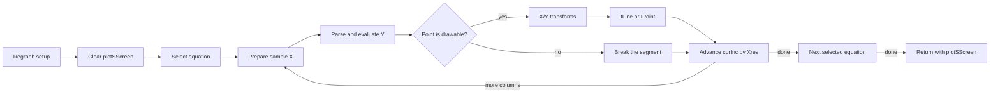

# Graphing

The graphing subsystem maps real coordinates to pixels, draws into
`plotSScreen`, and copies that buffer to the LCD. This page connects the
**Y=**, **WINDOW**, **GRAPH**, **TRACE**, and **DRAW** paths to their window
state, equation storage, and drawing primitives.

The [interactive demo](graphing/) shows the confirmed sampling, coordinate
mapping, discontinuity break, and `Circle(` schedule while labeling its
browser-arithmetic boundary.

## Window variables [confirmed]

All graph window state lives in a contiguous block of 9-byte `TIFloat`s starting at `0x8F50`.
These are the values the WINDOW editor writes and the grapher reads.

| Addr | Name | Meaning |
|------|------|---------|
| `0x8F50` | `Xmin` | left edge real X |
| `0x8F59` | `Xmax` | right edge real X |
| `0x8F62` | `Xscl` | X tick spacing |
| `0x8F6B` | `Ymin` | bottom edge real Y |
| `0x8F74` | `Ymax` | top edge real Y |
| `0x8F7D` | `Yscl` | Y tick spacing |
| `0x8F86` | `ThetaMin` / `0x8F8F` `ThetaMax` / `0x8F98` `ThetaStep` | polar/parametric range |
| `0x900D` | `XresO` | Xres (pixel step between plotted columns) |
| `0x9151` | `Xres_int` | integer copy of Xres |
| `0x9152` | `deltaX` | `(Xmax−Xmin)/94` — real width of one pixel column |
| `0x915B` | `deltaY` | `(Ymax−Ymin)/62` — real height of one pixel row |
| `0x9164` | `shortX` | reciprocal X scale used as a multiplier |
| `0x916D` | `shortY` | reciprocal Y scale used as a multiplier |
| `0x913F` | `XFact` / `0x9148` `YFact` | ZOOM IN/OUT factors |

There is a second "u" copy block at `0x8E7E` (`uXmin`…`uXres` at `0x8F3B`) — the
uVar window set used in the alternate (split/table) graph context, and a working/temp
float pair around `0x8E6A`/`0x8E73` used by the transform code. [confirmed]

Both contiguous 23-float blocks share one structural layout. The active copy is
`activeWindow` at `0x8F50`; the alternate copy is `userWindow` at `0x8E7E`:

```c
typedef struct {
    TIFloat x_min, x_max, x_scale, y_min, y_max, y_scale;
    TIFloat theta_min, theta_max, theta_step;
    TIFloat t_min, t_max, t_step, plot_start;
    TIFloat n_max, u0, v0, n_min, u02, v02, w0;
    TIFloat plot_step, x_resolution, w02;
} GraphWindowValues;
```

For example, `activeWindow.x_min` is the established `Xmin` address
`0x8F50`, while `userWindow.x_min` is `uXmin` at `0x8E7E`. This member
notation distinguishes which window copy a routine uses without dropping the
official RAM labels. [confirmed]

`deltaX` and `deltaY` are the per-pixel steps used by graph sampling and DRAW
routines. The forward transform instead multiplies by `shortX` or `shortY`.
The LCD is 96×64, but the full graph scale spans columns 0–94 and 62 vertical
intervals; `_YftoI` represents those as bottom-up coordinates 1–63. Hence the
window setup's divisions by 94 and 62. [confirmed]

---

## Coordinate-to-pixel transforms

### Forward: real coordinate → pixel index

`_XftoI` (`37:41EB`) and `_YftoI` (`37:41DF`) take a pointer in `DE` to a
9-byte `TIFloat` and return a pixel index in `A`. Both select operands for the
shared engine at `37:41F2`: [confirmed]

```z80
_XftoI (37:41EB):  BC = 0x8E6A, HL = shortX (0x9164), SCF  → 37:41F2
_YftoI (37:41DF):  BC = Ymin,   HL = shortY (0x916D), OR A → 37:41F2
INC A
```

The core loads `*DE`, subtracts the selected base through `ram:228F`, and
multiplies by the selected reciprocal through `ram:2385`. The X path then adds
the origin term at `0x8E73`. In compact form: [confirmed]

```text
scaled = (*DE - *base) * *reciprocal_scale
if axis == X:
    scaled += *0x8E73
A = graph_round_coordinate_magnitude(scaled)
if axis == Y:
    A = (A + 1) & 0xFF
```

The finishing routine at `37:4229` is sign-agnostic. Magnitudes below 0.5
become zero; values from 0.5 through the two-digit range round half upward by
packed-BCD addition. Three- and four-digit values receive an out-of-frame bias
before conversion. A mantissa carry writes the canonical `10 00` prefix and
increments the exponent. `_ConvOP1` (`38:7433`) then converts up to four
integer digits into `DE`, returns `E` in `A`, and raises a dimension error for
an exponent above `0x83`. [confirmed]

`tools/graph-coordinate.js` translates this operand order and finishing path.
Its test pins the three ROM spans and compares 220,000 packed-BCD OP1 states
against an independent transcription. [confirmed]

The Y result is a 1-based, bottom-up graph coordinate. A reset-origin `Y1=X²`
trace maps $y=8.872793118$ to `A=60` with `Ymin=-10` and `shortY=3.1`.
`_IOffset` later mirrors it for the LCD controller with `0x3F - y`.
[confirmed]

A function value `y` at sample `x` becomes a `(column, row)` pair through these
subtract-and-multiply transforms. The same conversion serves graph plotting
and TRACE coordinate display. [confirmed]

### Inverse: pixel index → real coordinate

`_SetXXOP1` (`33:5F7E`) and `_SetXXOP2` (`33:5F83`) take an integer pixel value in A
and build a real `TIFloat` in OP1 / OP2 (`0x8478` / `0x8483`). [confirmed]
- `CALL 1BA7` zeroes the destination mantissa,
- `CALL 5F6A` converts the binary value to packed BCD by repeated `ADD A,0x16 / DAA`
  (binary→decimal nibble accumulation), looping A times,
- the exponent byte is set so OP1 holds the integer; `_SetXXXXOP2` (`33:5F9E`) is the
  4-digit (up to 9999) variant for larger pixel/coordinate counts.

These are used to turn a pixel column/row (e.g. under the TRACE cursor) back into the real
X/Y shown at the bottom of the screen, and by DRAW commands that take pixel arguments.

---

## Graph buffer and pixel addressing

- `plotSScreen` = `0x9340`, 768 bytes = 96×64/8. Monochrome, 1 bit/pixel, 12 bytes per
  scanline (8 pixels per byte). This is the back buffer everything draws into. [confirmed]
- `saveSScreen` = `0x86EC`, 768 bytes — a saved copy (e.g. for redrawing the graph after
  a menu covers it). [confirmed]

`_GrBufClr` (`04:6071`): clears the whole 0x300-byte buffer to 0 (a
`LD (HL),0` + 0x2FF-byte propagate copy). [confirmed]

`_IOffset` (`04:42B5`) computes the LCD controller address bytes for a pixel (inputs `B`=x, `C`=y):
```text
(0x844F) = (x >> 3) | 0x20     # LCD byte-column command for the horizontal group
(0x8451) = (0x3F - y) | 0x80   # LCD row command, vertically mirrored
returns (table_42E4)[x & 7]    # the 1-of-8 bit mask within the byte (bit = x mod 8)
HL = 3 * ((4 * display_row) & 0xFF) + (x >> 3)
```
This maps a `(x,y)` pixel to a byte+bit in the buffer and produces the matching LCD
command bytes. Adding `HL` to `0x9340` addresses `plotSScreen`; adding it to
`0x9872` addresses `appBackUpScreen`. [confirmed]

`_IPoint` (`04:4157`) applies one of four byte operations selected by `D`: `0`
clears the mask, `1` sets it, `2` XORs it, and `3` tests it without writing.
`_PointOn` (`04:4155`) fixes `D=1`. The style path at `04:4173` can emit adjacent
points before the byte operation; the drawing hook at `04:415A` can replace the
normal path. [confirmed]

The normal path routes the byte through `(IY+3Ch)` and `plotFlags.1` at
`(IY+02h)`. Routing bit 3 selects `appBackUpScreen` without LCD I/O. Bit 0
selects the corresponding direct `plotSScreen` route. When both are clear,
the routine reads and writes the LCD controller. `plotFlags.1` preserves
`plotSScreen` and uses the LCD byte as the source; clearing it uses and rewrites
the RAM byte. Routing bit 2 also stores the result in `appBackUpScreen`.
[confirmed]

`_PixelTest` (`04:79E7`): the `pxl-Test(` command — validates the row/col against the
current graph dimensions `lcdTallP` (`0x8DA3`) and `pixWide_m_1` (`0x8DA5`) — 63 and 95 on a
full screen, smaller when split — maps the split-screen offset, and returns whether that buffer
pixel is on. `_ErrDomain` on out-of-range. [confirmed]

---

## Drawing primitives

### Lines

`_ILine` (`04:4029`) — integer pixel line via Bresenham. [confirmed]
It computes `dx=|x2−x1|`, `dy=|y2−y1|`, picks the major axis, sets the error term
`(dy−dx)*2`/`dy*2`, then loops `_IPoint` for each step, advancing the minor axis when the
error crosses zero. `graph_chk_flag20` (`04:4316`) is the step-along-major-axis helper. The endpoint and
draw-mode (set/clear/xor) are passed in. `_DarkLine` (`04:4025`) is `_ILine` with
the "draw/dark" mode forced. [confirmed]

`_CLine`/`_CLineS` (`33:6028`/`33:6034`) and `_UCLineS` (`33:6010`) — coordinate
line: take real-coordinate endpoints, run them through the X/Y transforms (the SetXX/ftoI
path), then call the integer line. The `S` variants take an explicit style/mode byte; the
mode bit comes from `(IY+0x35) & 0x80` (`hookflags3` bit 7, the drawing-hook-active flag —
not a split-screen flag). These back the `Line(`
DRAW command at the math layer. [confirmed]

### Circle

`_CircCmd` (`33:74CE`) is the parser-facing `Circle(` command wrapper. Its
dispatch at `33:74DF` tests `(IY+0x3C).4` and selects one of two segment
generators. [confirmed]

A reset-origin TilEm trace of `Circle(0,0,5)` observed the flag clear at
`0x8A2C`. That state selected the page-33 generator at `33:74E9`; its loop at
`33:7506` ran 61 times and its emit point at `33:7561` called `_CLine` exactly
60 times. All 59 adjacent endpoint pairs matched byte for byte. The first
segment went from $(5,0)$ to approximately
$(4.9726094768414,0.52264231633825)$, a six-degree step. The final
`plotSScreen` contained 306 set pixels. [confirmed]

The trace did not enter `_GrphCirc` (`33:758D`), `_DrawCirc2`
(`3B:7171`), or the coefficient lookup at `35:79E9`. It therefore establishes
the clear-flag page-33 path only. [confirmed]

The `_GrphCirc` body allocates a `0x5A`-byte floating-point frame. It preserves
the working coordinate and window values, prepares the circle state, and calls
the same dispatch at `33:74DF`. The user-visible state that sets the tested
flag and selects `_DrawCirc2` remains open. [confirmed]

The separate `_DrawCirc2` body allocates `0xA2` bytes, or 18 `TIFloat`s. Its
seven-iteration loop makes eight calls per iteration to the point-pair helper
at `3B:72F3`, followed by four closing calls at `3B:730E`: 60 `_CLine` calls
in total. The helper preserves the old point in OP3/OP4, stores the new OP1/OP2
point into the frame, calls `_CLine` at `33:6028`, and advances the frame
pointer by 18 bytes. [confirmed]

The loop consumes seven consecutive constants at `35:79F5`, alternating sine
and cosine values for 6°, 12°, 18°, and finally sine 24°. The adjacent
cosine 24° constant is present but is not consumed by this loop. The static
schedule and helper ABI are checked in `tools/graph_circle.py`; the latter is
compared with the pinned helper bytes for all 65,536 16-bit test seeds.
[confirmed]

### DRAW menu commands (page 0x04 handlers)

Each DRAW menu command has a page-04 bcall handler that draws into `plotSScreen`:

| bcall | Addr | Command |
|-------|------|---------|
| `_HorizCmd` | `04:793E` | `Horizontal y` — draws a full-width horizontal line at real Y. See note below. |
| `_VertCmd` | `04:7955` | `Vertical x` — draws a full-height vertical line at real X. See note below. |
| `_LineCmd` | `04:796A` | `Line(x1,y1,x2,y2)` — `_PDspGrph`, optionally draws via page 33, then `JP 0x152A` = `_DeallocFPS1(0x24)` frees the coord frame (the alloc happens upstream). |
| `_UnLineCmd` | `04:797C` | `Line(…,0)` — erase variant (same path, clear mode). |
| `_PointCmd` | `04:79B2` | `Pt-On/Pt-Off/Pt-Change(` — reads style from `OP1.value.mantissa[0] & 0x20`, dispatches set/clear/toggle. |
| `_DrawCmd` | `04:7B8B` | top-level `DRAW` dispatch — grabs the pending count and cross-jumps to the per-command handler. |
| `draw_zero_op1` | `04:620B` | seeds OP3=0 then draws (used for axis / `DrawF` zero baseline). |

Note: `_HorizCmd`/`_VertCmd` both `CALL 7933` first, which allocates a 0x24-byte FPS frame
(`LD HL,0x24 / CALL 1537 / SBC HL,DE`) and returns a pointer to it. `_HorizCmd` then builds the
line's two endpoints in that frame: it copies `Xmin` (`0x8F50`) and `Xmax` (`0x8F59`) — the window's
X range — with `_Mov9B` (`00:1A92`, which reads a window float into the frame), interleaving the
line's Y (`OP1`) via `_MovFrOP1` (`00:1B0C`), so the endpoints are `(Xmin, y)` and `(Xmax, y)`.
`_VertCmd` does the same with `Ymin` (`0x8F6B`)/`Ymax` (`0x8F74`) and the line's X. It renders with
`_PDspGrph`, then `_DeallocFPS1(0x24)` frees the frame — the window variables are read only,
so the line just spans the current window edges. [confirmed]

---

## Rendering the graph to the LCD

`_PDspGrph` (`04:7904`, "possibly-display graph") decides whether to copy the buffer to the
screen and whether a full re-plot is needed first. [confirmed]

- Clears the "need redraw" flag at `(IY+2)`,
- if the graph-dirty bit `(IY+3)&1` is set (`graphFlags.graphDraw`, inc `graphFlags=3`/`graphDraw=0`; `1`=redraw needed — this is the `graphFlags` bit at `IY+3`, distinct from `grfDBFlags` at `IY+4` and SmartGraph at `IY+0x17`), calls
  `_Regraph` to recompute the whole plot,
- otherwise checks the split-screen flag (`_Bit_VertSplit`) and copies the buffer to the LCD
  (`graph_redraw_buf` `04:607F`).

`_GrBufCpy` (`04:60A3`) blits `plotSScreen` to the LCD: handles split-screen
(`_CheckSplitFlag`, `_Bit_VertSplit`), draws the split divider line (`_DarkLine`/`_ILine` at
column region 0x2F), sets normal display vals, and walks the rows. [confirmed]

`_RestoreDisp` (`04:6176`) is the actual row-blit loop: for each of the up-to-64 rows it
issues the row and byte-column LCD commands, then streams pixel bytes to `port_lcdData` (`0x11`)
through `lcd_wait`, and pokes `port_lcdCmd` (0x10). This is where the buffer physically
reaches the panel. [confirmed]

`_Regraph` (`04:6764`) begins by enabling interrupts and calling the relocated
bjump thunk at `ram:3F27`. Its observed bytes, `CD 09 2B 18 65 01`, target
`_RunIndicOn` at `01:6518`. `_Regraph` then prepares the window state, clears
`plotSScreen`, dispatches the active graph mode, and finishes at `04:6985`.
SmartGraph (`grfModeFlags.smartGraph`) can bypass this work and copy the
existing buffer when the graph state is still valid. [confirmed]

The function-mode path has this observed shape:



`graph_advance_sample_column` (`04:69CF`) compares `curInc` (`0x8E67`) with
`pixWide_m_2` (`0x8DA6`). It returns without carry at the edge; otherwise it
adds `Xres_int` (`0x9151`), stores the next column, and returns with carry.
[confirmed]

---

## Y= equation storage and evaluation

### Storage [confirmed]

Y= functions are ordinary equation variables (`EquObj`), stored in the VAT as tokenized
byte streams — the same token encoding the homescreen uses. `Y1`…`Y0` (and `r1`…, `X1T/Y1T`,
`u/v/w`) are *system* equation vars. Each holds the tokens you typed after `Y1=`. The
equation's flags byte is `0x23` when selected (plotted) and `0x03` when deselected, so
the selection bit is bit 5 (`0x20`). The per-equation style byte holds the line style:
`0`=line, `1`=thick, `2`=shade above, `3`=shade below, `4`=trace/path, `5`=animate, `6`=dotted
(`curGStyle` `0x8D17` is the current-equation copy). [confirmed] The
selection/style byte values also match the
[TI link-protocol guide](https://merthsoft.com/linkguide/ti83+/vars.html#style).

### Variable-version scan

`_GetVarVersion` (`33:5023`) walks a tokenized variable through
`_SetupPagedPtr`/`_PagedGet`, recognizes two-byte tokens with `_IsA2ByteTok`,
and raises the returned compatibility tier for particular `0xBB` and `0xEF`
token ranges. This compatibility scan is not evidence for a graph-mode
graphability pre-scan. [confirmed]

### Evaluation → points

The function-mode loop prepares each sample at `04:710F`. Its traced parser
entry is `parse_init_findsym` (`38:5975`), which initializes parser state and
joins the shared evaluator tail at `38:59A4`. Evaluation passes through
`eval_eqn_recursive` (`38:778F`) and `eval_eqn_finish_typecheck` (`38:77C2`).
Official `_ParseInp` at `38:5987` is a sibling entry with additional state
cleanup; neither graph trace executes it. [confirmed]

`tools/graph-regraph.json` records ROM and TilEm provenance, raw-trace hashes,
and final-buffer hashes for two reset-origin TilEm traces: [confirmed]

| Function-mode observation | `Y1=X²` | `Y1=X⁻¹` |
|---------------------------|---------:|----------:|
| post-entry `_Regraph` instruction span | 3,951,185 | 4,316,730 |
| sample advances, `curInc=0`–`94` | 95 | 95 |
| `parse_init_findsym` entries | 190 | 190 |
| completed recursive evaluations | 190 | 188 |
| divide-by-zero entries at `ram:26EC` | 0 | 2 |
| post-dispatch `_ILine` calls | 30 | 94 |
| pixel-byte writes after the 768-byte clear | 296 | 402 |
| set pixels in final `plotSScreen` | 261 | 266 |

The reciprocal trace reaches the divide-by-zero entry with `curInc=46` and
again with `curInc=47`. The left segment ends at column 46; drawing restarts
with a zero-length seed at column 48, and no `_ILine` call bridges column 47.
The two missing evaluator completions therefore correspond to a visible break,
not a line across the asymptote. [confirmed]

These traces cover line style 0, `Xres=1`, and one selected equation. They do
not establish the thick, shade, trace, animate, or dotted paths; `Xres>1`;
multiple selected equations; or other graph modes. `tools/analyze_graph_regraph.py`
regenerates the compact report from raw TLMT traces, which remain outside the
repository.

### Graph databases (GDB) [confirmed]

`_StoGDB2` (`33:71AC`) / `_RclGDB2` (`33:72D9`) store/recall a GraphDataBase
(`GDBObj`, type/exp marker `0x61`) — the bundle of window vars + mode + selected equations
that the `StoreGDB`/`RecallGDB` commands save. `_JError(0x89)` on a type mismatch.

### Indexed pointer helpers [confirmed]

`_PUT_INDEX_LST` (`33:7066`) and `_GET_INDEX_LST` (`33:707A`) store and load
2-byte slots at `iMathPtr4 + 2n`; `_HEAP_SORT` (`33:7097`) sorts a
caller-supplied indexed range. Their bodies do not establish a selected-equation
list or show that Regraph and TABLE share one iterator.

---

## Graph, home-screen, and TRACE paths

- The home screen uses the large font and `curRow`/`curCol` text cursor (see
  [display-lcd.md](display-lcd.md)). The graph screen is the pixel buffer `plotSScreen` rendered by
  the routines above; small-font labels (coords, TRACE readout) go through
  `_VPutMap`/`penCol`(0x86D7)/`penRow`(0x86D8). [confirmed]
- **TRACE** moves a cursor along a selected function: it steps the column, evaluates the
  function for that X, maps the point with `_XftoI`/`_YftoI`, draws the
  cross-cursor, and uses `_SetXXOP1`/`_SetXXOP2` to convert the cursor pixel back to the real
  X/Y it prints at the bottom. The exact TRACE-side evaluator entry has not yet
  been traced. [confirmed]
- A `DRAW` command (`_DrawCmd`) or `Line(`/`Circle(`/`Pt-On(` draws straight into
  `plotSScreen` over the current plot and persists across a SmartGraph redraw (it is not
  re-evaluated) until `ClrDraw` is issued. [confirmed]

---

## Evidence summary and open items

- The forward transforms, coordinate rounding, and `_ConvOP1` boundary are
  byte-pinned and differentially tested. Reset-origin X and Y witnesses
  confirm the pointer ABI and returned indices. [confirmed]
- Reset-origin function-mode traces cover `Y1=X²` and `Y1=X⁻¹` with line style 0,
  `Xres=1`, and one selected equation. They do not cover the other styles,
  `Xres>1`, multiple selected equations, or alternate graph modes. [confirmed]
- The page-33 `Circle(` generator is dynamically observed. `_DrawCirc2` has a
  byte-pinned static schedule, but no reset-origin trace has selected it.
  [confirmed]
- `_HorizCmd` and `_VertCmd` build their endpoints from the live window edges
  and the command coordinate; they do not modify the window variables.
  [confirmed]
- The Y= selection bit (`0x20`; flags byte `0x23` selected / `0x03` deselected)
  and style values `0`–`6` agree with the
  [TI link-protocol variable guide](https://merthsoft.com/linkguide/ti83+/vars.html#style).
  [confirmed]
