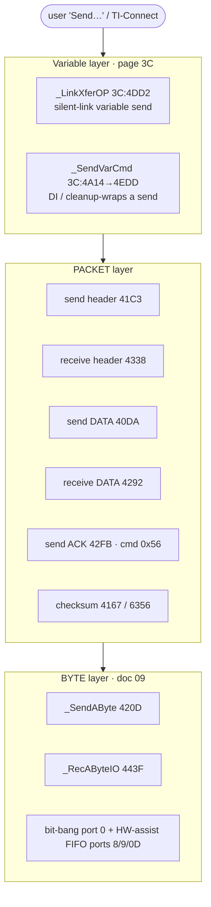

# Link / data transfer

*TI-84 Plus OS 2.55MP — feature deep dive.*

Deep-dive companion to [09-keyboard-link.md](09-keyboard-link.md), focused on what a **student transferring data**
touches: pushing a program/list/etc. to a computer (TI-Connect) or another calculator over the
2.5 mm I/O link or the 84+ USB/hardware link-assist. Builds the full stack on top of [doc 09](09-keyboard-link.md)'s byte
primitives `_SendAByte` (`3C:420D`) and `_RecAByteIO` (`3C:443F`); the ASIC-facing assist/USB ports
are covered separately in [USB ASIC and link assist](sub-usb-asic.md).

Addresses here are read from the raw Z80 disassembly. The decompiler mis-renders this subsystem —
it passes arguments in registers and does its state work with `SET/RES/BIT b,(IY+d)` flag ops that the
C view shows as bogus `*(param+0xNN)` stores — so the notes follow the disassembly, not the C view.

Page numbers are the masked flash page (`rawpage & 0x3F`). The whole silent-link engine lives on
**flash page 3C** (shared with the flash/archive command code — see [sub-vat-archive.md](sub-vat-archive.md)).

Confidence (this doc's shorthand; see [Conventions](conventions.md)): **[C]=confirmed from disassembly** (≈`[confirmed]`), **[H]=high (structure clear, some inference)** (≈`[standard]`), **[I]=inferred / standard-TI behavior** (≈`[hypothesis]`).

---

## 0. The three layers



---

## 1. RAM state block (the link "registers") [C]

All labels below are confirmed from `ti83plus.inc`. This contiguous block at `0x8670` is the
silent-link control/scratch area:

| Addr | Label (`.inc`) | Meaning |
|------|----------------|---------|
| `8670` | `ioFlag` | I/O state flags (bit4 tested on receive completion) |
| `8672` | `sndRecState` | transfer-type / phase: **0x0A**=backup, **0x15**=var DATA, **0x0B**=request/dir |
| `8673` | `ioErrState` | link error sub-state |
| `8674` | `header` | **packet header byte 0 = machine-ID** |
| `8675` | `header+1` | **packet header byte 1 = command-ID** |
| `8676` | `header+2` | **packet length, word (LE)** — also the running payload byte budget |
| `8678` | (running) | **running 16-bit checksum accumulator** (sum of payload byte values) |
| `867D` | `ioData` | scratch: built var-header length / data ptr setup |
| `867F` | — | **the variable header** (type+name) copied from OP1 via `_MovFrOP1` |
| `8688/8689` | `ioNewData` | "new var arrived" status (bit7 of `8689`) |
| `868B` | `bakHeader` | **saved 9-byte header** for echo/ACK comparison (`_Mov9B` to/from `8674`) |
| `84DB` | `iMathPtr5` | active **data pointer** during a streaming transfer |
| `9834` | `pagedCount` | bytes buffered in the 16-byte staging block (Flash-write batching) |
| `9836` | `pagedGetPtr` | write cursor into `pagedBuf` |
| `983A` | `pagedBuf` | 16-byte staging block (received data flushed to RAM/Flash 16 at a time) |
| `9C86` | — | HW-assist TX timeout reload (0xFA) |
| `9CAC` | — | HW-assist TX/RX timeout down-counter (seeded from CPU speed, port 0x20) |
| `85D9` | `varClass` | variable class (backup sub-type check, =0x0A) |

IY-relative flag bytes used by the link code (IY = `flags` base, `0x89F0`): **`IY+0x1B`** is the
link-mode/peer-type byte (which machine-ID to advertise, USB-vs-DBUS, single-byte mode), **`IY+0x12`
bit2** "command in progress", **`IY+0x24` bit1/2** transfer-active, **`IY+0xC` bit2** APD-disable
save, **`IY+0x3E` bit0** / **`IY+0x3D` bit5** USB-presence.

---

## 2. The byte layer (recap + receive internals) [C]

Doc 09 covers `_SendAByte`. Two new things pinned here:

### 2a. Hardware-assist send `6BB2` [C]
`_SendAByte` (`3C:420D`) starts `CALL probe_hw_model_keep_a ; JP Z,0x6BB2` — if the model probe sets Z (the
84+ link-assist hardware is present), it jumps to **`3C:6BB2`**:
```z80
6BB2: setup line / 2× short delay (6BD2 seeds 9CAC from port 0x20 = CPU speed)
6BBB: LD A,0xFA ; (9C86)=A           ; reload inner timeout
      IN A,(0x9) ; BIT 5,A           ; port 0x09 bit5 = TX buffer empty/ready
      JR Z,6BCA                       ; not ready → spin
      LD A,C ; OUT (0x0D),A ; RET     ; *** write the byte to port 0x0D (assist FIFO) ***
6BCA: CALL 6BE4 (decrement 9CAC) ; JR Z,6BBB (retry) ; else JP 4434 (timeout)
```
So the assist path is: **poll port 0x09 bit 5, then `OUT (0x0D),byte`** — exactly the "FIFO" [doc 09](09-keyboard-link.md)
mentioned, with a CPU-speed-scaled timeout. The legacy bit-bang fall-through (port 0, send `1`/`2`,
wait for echo, `DE`-timeout → `_JErrorNo`) is unchanged from [doc 09](09-keyboard-link.md).

### 2b. Receive `_RecAByteIO` `443F` and decoder `444A` [C]
```z80
443F: DI ; CALL 447E (arm/clock the line) ; CALL 444A (get-status) ; RET C/NZ ; loop if Z
444A:  CP 1                              ; result==1?  (got a real byte)
       LD A,C                            ; A = the byte
       JR NZ,4456
       CP 0xE0 ; JP NZ,_ErrLinkXmit      ; in 'must-get-byte' mode, anything else = link error
       JR 4470
4456:  CP 0xE0 ; RET NZ                  ; caller passed sentinel 0xE0 = "non-blocking probe"
       IN A,(0x2) ; AND 0x80             ; port 0x02 bit7 set = non-83+-Basic (has assist HW on 84+)
       JR Z,4469                         ;   legacy:  6CC1 polls the bit-bang lines
       IN A,(0x9) ; BIT 6,A ; JR NZ,4470 ; port 0x09 bit6 = transmission error → abort
       AND 0x19 ; JR NZ,4475             ; port 0x09 bits 0x19 = link error/active flags
4470:  CALL 6D17 ; XOR A ; RET           ; error/no byte → return 0
```
Key port semantics (84+ assist): **port 0x09 bit 5 = TX ready**, **bit 6 = transmission error**,
**bit 4 = byte received**, **bits 0x19 = error/active**; **port 0x0D = data FIFO**; **port 0x02
bit 7 = non-83+-Basic** (used here as the assist-present gate; WikiTI's dedicated "link-assist
available" flag is port 0x02 **bit 6**).
The sentinel **`0xE0`** passed in `A` selects non-blocking ("peek-only") vs. blocking-with-error
behaviour. `_Rec1stByte` (`3C:439C`) / `_Rec1stByteNC` (`3C:43A3`, "no-clear") are the same logic
wrapped with APD/`_ApdSetup` and the bit-bang start-bit detect, used to wait for the **first** byte
of an incoming packet (peer may be idle for a long time).

---

## 3. Packet framing — the TI link protocol [C]

A TI link packet is a **4-byte header** optionally followed by **data + 2-byte checksum**:

```
  +--------+--------+--------+--------+   +============+----------+
  | mach-ID|  cmd   |  len-lo|  len-hi|   |  data[len] | chk16 LE |
  +--------+--------+--------+--------+   +============+----------+
   8674     8675     8676     8677         streamed      8678 acc
```

### 3a. Send a header — `41C3` [C]
```z80
41C3: 6D4B (drive line) ; short delay ; CALL probe_hw_model_keep_a (model probe)
      … (HW handshake on 84+, or bit-bang line-idle wait; failure → _ErrLinkXmit) …
41F2: (8678)=0                              ; reset checksum accumulator
      LD A,(8674) ; CALL _SendAByte         ; machine-ID
      LD A,(8675) ; CALL _SendAByte         ; command-ID
      LD A,(8676) ; CALL _SendAByte         ; length lo
      LD A,(8677) ; CALL _SendAByte         ; length hi
```
`419B` is the generic "send a 0-length control packet": it sets the local machine-ID (`620A`),
stores the command from `H`, and calls `41C3`. Convenience entries: **`4195` H=0x92 (EOT)**,
**`4199` H=0x09 (CTS)**, `41BC` ID=0x73/cmd=0x68 (RTS).

### 3b. Receive a header — `4338` [C]
```z80
4338: CALL _RecAByteIO ; (8674)=A           ; machine-ID, validated against the known set:
      0x95 0x73 0x23 0x74 0x82 0x02 0x12 0x83 0x03 0x13 0x08   (else fall to 2nd-byte machine list)
4370: CALL _RecAByteIO ; (8675)=A           ; command-ID, validated: 0x68 0x47 0x74 0x2D … else _JErrorNo
438F: CALL _RecAByteIO ; (8675)=A  (cmd)     ; (on the validated path)
4392: CALL _RecAByteIO ; (8676)=A           ; length lo
4395: CALL _RecAByteIO ; (8677)=A           ; length hi ; RET
```
An unrecognised machine-ID or command-ID byte aborts via `_JErrorNo` (→ `E_LnkErr` 0x9F).

### 3c. Machine-ID selector — `620A` [C]
The **local** machine-ID advertised in outgoing packets depends on the peer-type bits in `IY+0x1B`:
```z80
620A: L=0x82 ; BIT 2,(IY+0x1B) ; RET NZ     ; 0x82 = default / TI-84+ silent
      L=0x95 ; BIT 1,(IY+0x1B) ; RET NZ     ; 0x95 = computer / TI-Connect (USB host)
      L=0x83 ; BIT 3,(IY+0x1B) ; RET NZ
      L=0x03 ; BIT 4,(IY+0x1B) ; RET NZ     ; 0x03 = TI-83
      L=0x73 ; RET                          ; 0x73 = TI-73 / fallback
```

### 3d. Command-ID byte cheat-sheet [C/I]
Confirmed in the code; semantics are the standard TI link protocol:

| cmd | name | seen at | meaning |
|-----|------|---------|---------|
| `0x06` | **VAR** | `_LinkXferOP` reply check `4E86 CP 6` | variable header packet (type+name+size) |
| `0x09` | **CTS** | `4199` (H=0x09) | clear-to-send (receiver ready for DATA) |
| `0x15` | **DATA** | `40DA`/`407C` send, `426D CP 0x15` recv | the variable's data bytes |
| `0x2D` | **DEL** | header-validate `4382 CP 0x2D` | delete / directory variants |
| `0x36` | **SKIP/EXIT** | `_LinkXferOP` `4E7C CP 0x36` | peer refused this var → abort transfer |
| `0x56` | **ACK** | built by `42FB` (LD H,0x56); checked `418F CP 0x56` | acknowledge |
| `0x5A` | **ERR/NAK** | built by `6356`/`6385` (LD H,0x5A) | checksum/length error reply |
| `0x68` | **RTS** | `41BC` (LD H,0x68) | request-to-send |
| `0x92` | **EOT** | `4195` (H=0x92) | end of transmission |
| `0xA2`/`0xB7` | request | `_LinkXferOP` `4E2B/4E2F` | request var (A2=DATA-type, B7=other) |

### 3e. Checksum / ACK tail [C]
After the data payload, the sender appends the 16-bit sum and waits for the ACK:
```z80
4167 (send tail): LD HL,(8678) ; A=L ; CALL _SendAByte ; A=H ; CALL _SendAByte   ; chk lo, hi
4178:  CALL 4318 (save hdr→bakHeader) ; CALL 4338 (recv reply header)
417E:  LD A,(8675) ; … CALL 430F (compare/store) ; CP 0x56 ; RET Z ; JP _JErrorNo
```
On the **receive** side the matching check is `6356`: after streaming the payload it compares the
accumulated checksum `8678` against the received 16-bit checksum; on mismatch it sends a **0x5A ERR
packet** (`6385: LD H,0x5A ; CALL 419B`) and raises `_JErrorNo`. The ACK-builder `42FB` echoes the
peer's saved header (`868B bakHeader`), forces command = **0x56**, length = 0, sends it, then
`_Mov9B` restores the header.

---

## 4. Receive DATA payload — `4292` [C]

`4261`/`4292` is the data-payload receiver. It streams `len` (`8676`) bytes from `_RecAByteIO`,
buffering 16 at a time into `pagedBuf` (`983A`) and flushing the block (so an incoming **archived**
variable is written straight to Flash via `6AB1`, which runs the port-0x14 flash-program stub —
identical prologue to the archive writer in [sub-vat-archive.md](sub-vat-archive.md) §6):
```z80
4292: BC=(8676) len ; (8678)=0
      loop: HL=(84DB) dest ; 1FD6 (clock) ; _RecAByteIO → A
            store A via pagedGetPtr (9836); INC pagedCount (9834)
            when pagedCount==0x10 → CALL 6AB1 (flush 16 bytes to RAM/Flash)
            (8678) += received_byte ; DEC BC ; loop while BC
      flush remainder (6AB1)
42EF: _RecAByteIO ×2 → received checksum ; CALL 6356 (verify len/sum, NAK 0x5A on mismatch)
42FB: send ACK (cmd 0x56)
```

The header-classifier `6994` shows the **receive-and-store** sequence a var-receive runs:
```z80
6994: 4255 (reset chk) ; 6298 (machine-ID re-validate) ; RST4 on (867F) (classify var header)
      6D4B/4338 recv header ; expect (8675)==0x09 (VAR/CTS) else _JErrorNo
      4338 recv DATA header ; expect (8675)==0x15 (DATA) else _JErrorNo
      BC=(8676) len ; RST5 → store the variable into the VAT (creates RAM/Flash entry)
```
i.e. the receiver reproduces the VAT-create / `_InsertMem` path from [sub-vat-archive.md](sub-vat-archive.md).

---

## 5. Silent-link variable send — `_LinkXferOP` (`3C:4DD2`) [C]

This is the headline path a student's "Send" hits (TI-Connect pulls a var, or a calc-to-calc send).
OP1 = the variable name. It negotiates, sends the VAR header, waits for CTS, then streams the DATA.

```z80
_LinkXferOP (3C:4DD2):
  CALL probe_hw_model_keep_a        ; model/HW probe; spin on port 0x20 if assist busy
  SET 1,(IY+0x24)                   ; mark "transfer active"
  RES 3,(IY+0x1B) ; save IY+0xC (APD) ; install cleanup handler 4F3E via 27DA (see §7)
  CALL _OP1ToOP6                    ; preserve the var name
  (build the var header into 867F) :
      LD DE,0x867F ; CALL _MovFrOP1 ; *** header = var type byte + name token(s) ***
  decide request command:
      LD A,(8672) sndRecState ; CP 0x15 ;  A = 0xA2 (DATA-type)  else  0xB7
      CALL 6971 (set "cmd in progress")
  USB negotiation (when IY+0x1B bit0 & bit5/6 set): poll port 0x4D bits 5/6, cross_page 2E0B
  CALL 4055 (send the VAR/request header via 40DA→41C3)
  CALL 6184 → _Rec1stByteNC (wait for peer reply)
      CP 0x36 (SKIP/EXIT) → 427E ; _JErrorNo            ; peer refused
      CP 0x06 (VAR/CTS ok) → continue, else 4D45 _JErrorNo
  CALL 4255 ; CALL 687A (check transfer state 8688==0x07)
  if sndRecState==0x15 (DATA):
      CALL 4763 (resolve var data: type/size/ptr, archive-aware) ; CALL ... send DATA
  else: send the symbol-table/listing payload (4261)
  RES 1,(IY+0x24) ; FUN_ram_2800 (restore) ; JP 4F3E (cleanup)
```

### 5a. Resolve the variable for sending — `4763` [C]
`4763` reads the var-header type byte at `867F` and branches by class. For graph/equation types
(`0x0F‥0x14`) it uses a cross-page helper; otherwise `47AB`: `_CkOP1Real`, checks size, then
`_ChkFindSym` (`0E60`) to locate the VAT entry, and for an **archived** var it routes through the
flash path (`_Chk_Batt_Low`, `83F7` size save). The actual data ptr/page/length come from
`_SetupPagedPtr` inside the DATA sender.

### 5b. Send the DATA payload — `40DA` [C]
```z80
40DA: CALL _SetupPagedPtr (17AC)            ; HL=data ptr, DE=len, A=page  ←  VAT entry resolution
      (84DB)=ptr ; (8676)=len               ; iMathPtr5, packet length
      6971 ; 620A (machine-ID) ; (8674)=ID
      (special-case sndRecState==0x08 backup w/ varClass 0x0A: clamp len 0x37D, prepend 0x63 00)
413D: CALL 41C3 (send DATA header, cmd already 0x15 from 4055)
      HL=(84DB) ptr ; DE=(8676) len ; (8678)=0
      loop 4150: 1FD6 (clock) ; _PagedGet (17BB) the next byte (handles Flash page-cross) ;
                 41AB → _SendAByte ; accumulate (8678) ; DEC DE ; loop
4167: send 2-byte checksum (8678 lo,hi) ; recv reply header ; CP 0x56 (ACK) ; else _JErrorNo
```
`_PagedGet` makes the streamer **transparent to RAM-vs-archived** data: an archived program is read
straight out of the Flash window, advancing the bank-A page (port 0x06) at the 0x8000 boundary,
exactly like `_FlashToRam` ([sub-vat-archive.md](sub-vat-archive.md) §5).

---

## 6. `_SendVarCmd` (`3C:4A14` → body `3C:4EDD`) [C]

The bcall most code/TI-BASIC reaches for to silent-send. It is a thin DI-wrapped front for the same
machinery:
```z80
4EDD: DI ; save IY+0xC (APD) ; RES 2,(IY+0xC)
      install cleanup 4F3E via 27DA
      LD A,0x0B ; (8672)=A          ; sndRecState = request/directory
      LD A,0xC9 ; CALL 6971         ; command setup
      CALL 62B0 (clear link sub-state in 8A0B) ; SET 2,(IY+0x1B)
      CALL 58ED (→ SET 2,(IY+0x24) ; _ChkFindSym)  ; locate the var
      JR 4EAD (shared tail with _LinkXferOP: RES 1,(IY+0x24); 2800; JP 4F3E)
```
Note `4EDD` physically **overlaps / shares the tail** (`4EAD`) with `_LinkXferOP`; they are two
entry points into one routine body. `_SendVarCmd` is the "send by name from the running context"
door; `_LinkXferOP` is the "OP1 already set up, do the silent transfer" door.

---

## 7. APD, cleanup, and the line idle wait [C]

- `27DA` (`FUN_ram_27da`) installs an **abort/cleanup callback** (always `3C:4F3E`) so that if the
  transfer errors out via `_JError`, the link state, APD timer and `IY+0xC` APD bit are restored.
  `4F3E: POP AF ; BIT 2,A ; (restore IY+0xC bit2) ; → 4F31 (RES 2,(IY+0x12); re-enable timers; EI)`.
- `_ApdSetup` (`00:03AE`) is called before any long blocking receive (`6177`, `6184`) so the calc
  doesn't auto-power-down mid-transfer.
- `62B0`/`62BB` clear the link error sub-state byte (`8A0B`, the low bits of `IY+0x1B`-area flags).

---

## 8. Error handling [C]

| Trigger | Address | Error |
|---------|---------|-------|
| send/receive line timeout, bad echo, unexpected reply cmd | `_JErrorNo` `00:2799` | `E_LnkErr` **0x9F** "ERR:LINK" |
| `_RecAByteIO` got non-byte in must-get mode; header-send line never went idle | `_ErrLinkXmit` `00:278D` → `_JError(0x9F)` | `E_LnkErr` **0x9F** |
| received checksum/length mismatch | `6356`→ sends 0x5A NAK → `2799` | `E_LnkErr` **0x9F** |
| peer sent SKIP/EXIT (0x36) | `_LinkXferOP` `4E80/4E83` | `E_LnkErr` **0x9F** |

The OS collapses the link failures into the single user-visible **`E_LnkErr` (0x9F)** "ERR:LINK".
The finer-grained codes **`E_LinkIOChkSum` 0x22, `E_LinkIOTimeOut` 0x23, `E_LinkIOBusy` 0x24,
`E_LinkIOVer` 0x25** exist in the error table (`ty_error.txt`) and are used by the higher-level
*assembly-callable file-transfer API* (e.g. `OpenSendFlag`/`Send`/`Receive` style), not by the raw
silent-link engine documented here. **[C for 0x9F path; H for the 0x22-25 mapping.]**

---

## 9. End-to-end: "Send PRGM to computer" [H]

1. Host (TI-Connect, machine-ID 0x95) opens the USB/DBUS link; calc detects it (`IY+0x1B` bit1).
2. Host requests the directory or a specific var; calc's receiver (`4338`) parses the request
   header, `6994`/`6298` classify it.
3. To send a var: `_LinkXferOP`/`_SendVarCmd` builds the **VAR header** (type byte + name from OP1,
   size) at `867F`, sends it (`41C3`, cmd path), waits for **CTS (0x09)**.
4. `40DA` streams the **DATA (0x15)** payload via `_PagedGet`→`_SendAByte` (Flash-transparent),
   appends the **16-bit checksum**, waits for **ACK (0x56)**.
5. `_GetSysInfo` (`00:50DD`)-style metadata and an **EOT (0x92)** close the session.
6. Receive direction is the mirror: header in → CTS out → DATA in (buffered 16 bytes →
   RAM/Flash via `6AB1`) → checksum verify (`6356`, NAK 0x5A on error) → ACK out → VAT store (RST5).

---

## 10. Confident address index

| space:addr | name | what |
|------------|------|------|
| `3C:420D` | `_SendAByte` | send one byte: HW-assist (port 0x09/0x0D) or bit-bang (port 0) |
| `3C:6BB2` | `lnk_send_byte_hw` | HW-assist send: poll port 0x09 bit5, `OUT (0x0D)` |
| `3C:443F` | `_RecAByteIO` | receive one byte (blocking) |
| `3C:444A` | `lnk_rec_status` | RX status decode (port 0x09 bit6 = TX error / bit4 = byte received / 0x19 err; sentinel 0xE0) |
| `3C:439C` | `_Rec1stByte` | wait for first byte of a packet (APD + start-bit) |
| `3C:43A3` | `_Rec1stByteNC` | as above, no line-clear |
| `3C:41C3` | `lnk_send_header` | send 4-byte header (ID, cmd, len-lo, len-hi) |
| `3C:419B` | `lnk_send_ctrl_pkt` | send a 0-length control packet (cmd in H) |
| `3C:4195` | `lnk_send_eot` | send EOT (cmd 0x92) |
| `3C:4199` | `lnk_send_cts` | send CTS (cmd 0x09) |
| `3C:4338` | `lnk_recv_header` | receive + validate 4-byte header |
| `3C:620A` | `lnk_local_machine_id` | pick local machine-ID from IY+0x1B mode |
| `3C:42FB` | `lnk_send_ack` | build+send ACK (cmd 0x56) from saved header |
| `3C:4292` | `lnk_recv_data` | receive DATA payload, 16-byte Flash batching, checksum |
| `3C:6356` | `lnk_verify_cksum` | verify count vs len; NAK 0x5A on mismatch |
| `3C:6AB1` | `lnk_flush_block` | flush 16-byte staging block to RAM/Flash (port 0x14) |
| `3C:4DD2` | `_LinkXferOP` | silent-link variable send orchestrator (OP1=name) |
| `3C:4EDD` | `_SendVarCmd` | bcall `_SendVarCmd` (4A14) body; DI-wrapped send-by-name |
| `3C:4763` | `lnk_resolve_var` | resolve var class/size/ptr for sending (archive-aware) |
| `3C:40DA` | `lnk_send_data` | send DATA payload (`_PagedGet`→`_SendAByte`) + checksum + ACK wait |
| `3C:4167` | `lnk_send_cksum_tail` | append 16-bit checksum, recv reply, expect ACK 0x56 |
| `3C:4F3E` | `lnk_cleanup` | error/abort cleanup (restore APD/timers/flags) |
| `3C:62B0` | `lnk_clear_substate` | clear link error sub-state (8A0B) |
| `3C:6994` | `lnk_recv_store` | receive var + VAT store sequence (expects 0x09 then 0x15) |
| `00:278D` | `_ErrLinkXmit` | `_JError(0x9F)` E_LnkErr |
| `00:2799` | `_JErrorNo` | raise current pending error (link → 0x9F) |
| `00:50DD` | `_GetSysInfo` | system info reply (used in link sessions) |
| `00:4A14` | `_SendVarCmd` (bcall id) | → 3C:4EDD |

**Ports:** `0x00` = bit-bang link (tip/ring); `0x08`-`0x0D` = HW link-assist control/status/data
FIFO (port 0x09 bit5 TX-ready, bit6 transmission-error, bit4 byte-received, bits 0x19 error);
`0x02` bit7 = non-83+-Basic (assist-present gate on 84+; WikiTI's "link-assist available" is bit6);
`0x20` = CPU speed (timeout scaling); `0x4D` bits5/6 = USB negotiation; `0x14` = Flash
write/erase (received-to-archive path). See [sub-usb-asic.md](sub-usb-asic.md) for the assist port
state machine. RAM block: `ioFlag 8670 … bakHeader 868B`, staging
`pagedBuf 983A`.

**Command IDs:** 0x06 VAR · 0x09 CTS · 0x15 DATA · 0x2D DEL · 0x36 SKIP/EXIT · 0x56 ACK ·
0x5A ERR/NAK · 0x68 RTS · 0x92 EOT · 0xA2/0xB7 request. **Machine IDs:** 0x82/0x73 calc(84+/73),
0x95 computer (TI-Connect), 0x03 TI-83, plus the 0x02/0x12/0x23/0x74/0x83/0x13/0x08 set accepted.

## 11. Open items
- The 0x22-0x25 fine-grained link error codes: which higher API (`Send`/`Receive` bcalls) emits
  them vs. the blanket 0x9F here. [H]
- Backup (sndRecState 0x08 / varClass 0x0A) framing detail in `40DA` (the 0x37D clamp + 0x63 00
  prefix) — full backup-packet layout. [H]
- The prior USB target gap is now mapped in [sub-usb-asic.md](sub-usb-asic.md): `_LinkXferOP` calls
  `ram:2E0B`, a `cross_page_jump` thunk to `35:4280`, after sampling port `0x4D`.
