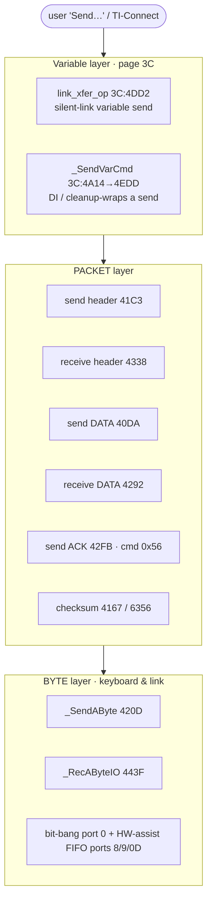

# Link and data transfer

The data-transfer subsystem sends variables and system objects through the
packet layer over either the 2.5 mm link or the TI-84 Plus USB/link-assist path.
It builds on `_SendAByte` (`3C:420D`) and `_RecAByteIO` (`3C:443F`), described in
[Two-wire link port hardware](link-port-hardware.md). [USB ASIC and link
assist](sub-usb-asic.md) covers the ASIC-facing ports.

Raw disassembly preserves the register-passed arguments and
`SET`/`RES`/`BIT b,(IY+d)` state operations that the decompiler can mis-render.
The silent-link engine shares Flash page `3C` with archive command code.

## Transfer layers


```mermaid
flowchart TB
    SRC(["user 'Send…' / TI-Connect"])
    subgraph VAR["Variable layer · page 3C"]
      LX["link_xfer_op 3C:4DD2<br/>silent-link variable send"]
      SV["_SendVarCmd 3C:4A14→4EDD<br/>DI / cleanup-wraps a send"]
    end
    subgraph PKT["PACKET layer"]
      direction LR
      SH["send header 41C3"]
      RH["receive header 4338"]
      SD["send DATA 40DA"]
      RD["receive DATA 4292"]
      AK["send ACK 42FB · cmd 0x56"]
      CK["checksum 4167 / 6356"]
    end
    subgraph BYTE["BYTE layer · keyboard & link"]
      direction LR
      SB["_SendAByte 420D"]
      RB["_RecAByteIO 443F"]
      HW["bit-bang port 0 + HW-assist FIFO ports 8/9/0D"]
    end
    SRC --> VAR --> PKT --> BYTE
```

---

## RAM state block [confirmed]

All labels below are confirmed from `ti83plus.inc`. This contiguous block at `0x8670` is the
silent-link control/scratch area:

| Addr | Label (`.inc`) | Meaning |
|------|----------------|---------|
| `8670` | `ioFlag` | I/O state flags (bit4 tested on receive completion) |
| `8672` | `sndRecState` | transfer type / phase: `0x08` selects backup-send framing, `0x0A` appears in backup receive/orchestration, `0x15` is variable DATA, and `0x0B` is request/directory |
| `8673` | `ioErrState` | link error sub-state |
| `8674` | `header` | packet header byte 0 = machine-ID |
| `8675` | `header+1` | packet header byte 1 = command-ID |
| `8676` | `header+2` | packet length, word (LE) — also the running payload byte budget |
| `8678` | (running) | running 16-bit checksum accumulator (sum of payload byte values) |
| `867D` | `ioData` | scratch: built var-header length / data ptr setup |
| `867F` | — | the variable header (type+name) copied from OP1 via `_MovFrOP1` |
| `8688/8689` | `ioNewData` | "new var arrived" status (bit7 of `8689`) |
| `868B` | `bakHeader` | saved 9-byte header for echo/ACK comparison (`_Mov9B` to/from `8674`) |
| `84DB` | `iMathPtr5` | active data pointer during a streaming transfer |
| `848E`–`8492` | — | three backup-section lengths parsed from or written to the backup header |
| `8494` | — | saved user-memory boundary used after backup restore |
| `9834` | `pagedCount` | bytes buffered in the 16-byte staging block (Flash-write batching) |
| `9836` | `pagedGetPtr` | write cursor into `pagedBuf` |
| `983A` | `pagedBuf` | 16-byte staging block for received Flash-window data |
| `9C86` | — | HW-assist TX timeout reload (0xFA) |
| `9CAC` | — | HW-assist TX/RX timeout down-counter (seeded from CPU speed, port 0x20) |
| `85D9` | `varClass` | variable class (backup sub-type check, =0x0A) |

IY-relative flag bytes used by the link code (IY = `flags` base, `0x89F0`): `IY+0x1B` is the
link-mode/peer-type byte (which machine-ID to advertise, USB-vs-DBUS, single-byte mode), `IY+0x12`
bit2 "command in progress", `IY+0x24` bit1/2 transfer-active, `IY+0xC` bit2 APD-disable
save, `IY+0x3E` bit0 / `IY+0x3D` bit5 USB-presence.

---

## Byte layer [confirmed]

[Two-wire link port hardware](link-port-hardware.md) covers the complete raw port-`0x00` send and receive handshakes. This section records how the byte entries select and report the hardware-assist path.

### Hardware-assist send [confirmed]

`_SendAByte` (`3C:420D`) starts:

```z80
CALL probe_hw_model_keep_a
JP Z,0x6BB2
```

If the model probe sets Z, the 84+ link-assist hardware is present, and the
routine jumps to `3C:6BB2`:

```z80
6BB2: setup line / 2× short delay (6BD2 seeds 9CAC from port 0x20 = CPU speed)
6BBB: LD A,0xFA
      LD (0x9C86),A            ; reload inner timeout
      IN A,(0x09)
      BIT 5,A                  ; port 0x09 bit 5 = TX buffer empty/ready
      JR Z,6BCA                ; not ready → spin
      LD A,C
      OUT (0x0D),A             ; write the byte to the assist FIFO
      RET
6BCA: CALL 6BE4                ; decrement 0x9CAC
      JR Z,6BBB                ; retry
      JP 4434                  ; timeout
```
So the assist path is: poll port 0x09 bit 5, then `OUT (0x0D),byte`, with a CPU-speed-scaled timeout. The legacy fall-through writes port `0x00` directly; see [Two-wire link port hardware](link-port-hardware.md) for its two-read polling loop and four-transition handshake.

### Receive path and decoder [confirmed]

```z80
443F: DI
      CALL 447E                  ; arm/clock the line
      CALL 444A                  ; get status
      RET C/NZ                   ; loop if Z
444A: CP 1                       ; status 1 selects the error-status path
      LD A,C                     ; A = candidate byte/status marker
      JR NZ,4456                 ; other status: normal byte or marker
      CP 0xE0
      JP NZ,_ErrLinkXmit
      JR 4470
4456: CP 0xE0
      RET NZ                     ; return an ordinary byte from C
      IN A,(0x02)
      AND 0x80                   ; port 0x02 bit 7 set = non-83+-Basic
      JR Z,4469                  ; legacy path: 6CC1 polls the bit-bang lines
      IN A,(0x09)
      BIT 6,A
      JR NZ,4470                 ; transmission error → abort
      AND 0x19
      JR NZ,4475                 ; link error/active flags
4470: CALL 6D17
      XOR A
      RET                        ; error/no byte → return 0
```
Key port semantics (84+ assist): port 0x09 bit 5 = TX ready, bit 6 = transmission error,
bit 4 = byte received, bits 0x19 = error/active; port 0x0D = data FIFO; port 0x02
bit 7 = non-83+-Basic (used here as the assist-present gate; WikiTI's dedicated "link-assist
available" flag is port 0x02 bit 6).
The assist receiver at `3C:6C20` returns a normal port-`0x0A` byte in `C` with
`A=0`; the port-`0x09` bit-6 path returns `A=1`. `lnk_rec_status` compares the
returned `C` value with `0xE0`; `_RecAByteIO` does not preserve a caller-supplied
`A` value. The exceptional byte is the TI-Keyboard frame prefix. The public
`_KeyboardGetKey = 50E9` table entry resolves to `3C:6D5E`, whose decoder
requires `0xE0`, a deliberate DBUS error delimiter, command byte `0x01`, and a
final scan-code or modifier byte. `3C:6D17` preserves the comparison of the
command byte with `0x01` while receiving the final byte. The public routine
then discards that byte and returns status `0x01`. [confirmed]

The ROM proves what the calculator accepts, not what a physical keyboard emits.
The historical [WikiTI `_KeyboardGetKey` revision 5510](https://wikiti.brandonw.net/index.php?title=83Plus:BCALLs:50E9&oldid=5510)
independently describes the peripheral sending the same four-part sequence;
that transmitter behavior remains [standard] until captured from hardware.
The linked external disassembly is no longer available and was not used as
evidence. See [Two-wire link port hardware](link-port-hardware.md#the-ti-keyboard-error-delimiter)
for the status tails and executable decoder model.
`_Rec1stByte` (`3C:439C`) / `_Rec1stByteNC` (`3C:43A3`, "no-clear") are the same logic
wrapped with APD/`_ApdSetup` and the bit-bang start-bit detect, used to wait for the *first* byte
of an incoming packet (peer may be idle for a long time).

---

## TI link packet framing [confirmed]

A TI link packet is a 4-byte header optionally followed by data + 2-byte checksum:

```text
  +--------+--------+--------+--------+   +============+----------+
  | mach-ID|  cmd   |  len-lo|  len-hi|   |  data[len] | chk16 LE |
  +--------+--------+--------+--------+   +============+----------+
   8674     8675     8676     8677         streamed      8678 acc
```

As a C struct:

```c
typedef struct {
    uint8_t  machine_id;   /* +0: peer/local device class */
    uint8_t  command_id;   /* +1: command byte            */
    uint16_t data_length;  /* +2: little-endian length    */
} LinkPacketHeader;      /* 4 bytes at header = 0x8674 */
```

The typed RAM view therefore exposes `header.machine_id`, `header.command_id`,
and `header.data_length`; the disassembly below retains the concrete addresses
that establish those fields. [confirmed]

### Sending a header [confirmed]

```z80
41C3: 6D4B (drive line)
      short delay
      CALL probe_hw_model_keep_a (model probe)
      … (HW handshake on 84+, or bit-bang line-idle wait, with failure reaching _ErrLinkXmit) …
41F2: (8678)=0                       ; reset checksum accumulator
      LD A,(8674)
      CALL _SendAByte                ; machine-ID
      LD A,(8675)
      CALL _SendAByte                ; command-ID
      LD A,(8676)
      CALL _SendAByte                ; length lo
      LD A,(8677)
      CALL _SendAByte                ; length hi
```
`419B` is the generic "send a 0-length control packet": it sets the local machine-ID (`620A`),
stores the command from `H`, and calls `41C3`. Convenience entries: `4195` H=0x92 (EOT),
`4199` H=0x09 (CTS), `41BC` ID=0x73/cmd=0x68 (RTS).

### Receiving a header [confirmed]

```z80
4338: CALL _RecAByteIO
      (8674)=A                       ; machine-ID, validated against the known set:
      0x95 0x73 0x23 0x74 0x82 0x02 0x12 0x83 0x03 0x13 0x08   (else fall to 2nd-byte machine list)
4370: CALL _RecAByteIO
      (8675)=A                       ; command-ID, validated: 0x68 0x47 0x74 0x2D … else _JErrorNo
438F: CALL _RecAByteIO
      (8675)=A                       ; command ID on the validated path
4392: CALL _RecAByteIO
      (8676)=A                       ; length lo
4395: CALL _RecAByteIO
      (8677)=A                       ; length hi
      RET
```
An unrecognised machine-ID or command-ID byte aborts via `_JErrorNo` (→ `E_LnkErr` 0x9F).

### Machine-ID selector [confirmed]

The *local* machine-ID advertised in outgoing packets depends on the peer-type bits in `IY+0x1B`:
```z80
620A: LD L,0x82                     ; default / TI-84+ silent
      BIT 2,(IY+0x1B)
      RET NZ
      LD L,0x95                     ; computer / TI-Connect USB host
      BIT 1,(IY+0x1B)
      RET NZ
      LD L,0x83
      BIT 3,(IY+0x1B)
      RET NZ
      LD L,0x03                     ; TI-83
      BIT 4,(IY+0x1B)
      RET NZ
      LD L,0x73                     ; TI-73 / fallback
      RET
```

### Command-ID byte reference [hypothesis]

Confirmed in the code; semantics are the standard TI link protocol:

| cmd | name | seen at | meaning |
|-----|------|---------|---------|
| `0x06` | `VAR` | `link_xfer_op` reply check `4E86 CP 6` | variable header packet (type+name+size) |
| `0x09` | `CTS` | `4199` (H=0x09) | clear-to-send (receiver ready for DATA) |
| `0x15` | `DATA` | `40DA`/`407C` send, `426D CP 0x15` recv | the variable's data bytes |
| `0x2D` | `DEL` | header-validate `4382 CP 0x2D` | delete / directory variants |
| `0x36` | `SKIP/EXIT` | `link_xfer_op` `4E7C CP 0x36` | peer refused this var → abort transfer |
| `0x56` | `ACK` | built by `42FB` (LD H,0x56); checked `418F CP 0x56` | acknowledge |
| `0x5A` | `ERR/NAK` | built by `6356`/`6385` (LD H,0x5A) | checksum/length error reply |
| `0x68` | `RTS` | `41BC` (LD H,0x68) | request-to-send |
| `0x92` | `EOT` | `4195` (H=0x92) | end of transmission |
| `0xA2`/`0xB7` | request | `link_xfer_op` `4E2B/4E2F` | request var (A2=DATA-type, B7=other) |

### Checksum and acknowledgement tail [confirmed]

After the data payload, the sender appends the 16-bit sum and waits for the ACK:
```z80
4167: LD HL,(8678)
      LD A,L
      CALL _SendAByte               ; checksum lo
      LD A,H
      CALL _SendAByte               ; checksum hi
4178: CALL 4318 (save hdr→bakHeader)
      CALL 4338 (recv reply header)
417E: LD A,(8675)
      … CALL 430F (compare/store)
      CP 0x56
      RET Z
      JP _JErrorNo
```
On the *receive* side the matching check is `6356`: after streaming the payload it compares the
accumulated checksum `8678` against the received 16-bit checksum; on mismatch it sends a `0x5A` ERR
packet:

```z80
6385: LD H,0x5A
      CALL 419B
```

It then raises `_JErrorNo`. The ACK-builder `42FB` saves the
caller's header to `868B bakHeader`, then builds an ACK with a fresh local machine-ID (`CALL 620A`),
command = `0x56`, length = 0, sends it, and `_Mov9B` restores the saved header.

---

## DATA payload receive path [confirmed]

`3C:4261` stores the destination in `iMathPtr5` at `0x84DB`, validates a DATA
header, and enters `3C:4292`. The payload loop loads the destination once at
`3C:42AB`. Bit 7 of `H` then selects one of two storage paths: [confirmed]

- A RAM destination (`HL >= 0x8000`) is written directly at `3C:42D4`, and the
  loop increments `HL` after each byte.
- A Flash-window destination (`HL < 0x8000`) is buffered at `0x983A`.
  `3C:42CF` flushes each full 16-byte block through `3C:6AB1`, and `3C:42EC`
  flushes a nonzero remainder.

```z80
4292: BC=(8676) len
      (8678)=0
      if BC==0 → checksum tail
      pagedGetPtr=983A
      pagedCount=0
      HL=(84DB) dest
      loop: 1FD6 (break check)
            _RecAByteIO → A
            if BIT 7,H: (HL)=A
                        INC HL
            else: store A via pagedGetPtr
                  INC pagedCount
                  when pagedCount==0x10 → CALL 6AB1
            (8678) += received_byte
            DEC BC
            loop while BC
      if pagedCount!=0 → CALL 6AB1
42EF: _RecAByteIO ×2 → received checksum
      CALL 6356 (verify len/sum, NAK 0x5A on mismatch)
42FB: send ACK (cmd 0x56)
```

### Flash-window staging flush — `3C:6AB1` [confirmed]

`flush_paged_flash_block` at `3C:6AB1` clears `pagedCount`, resets
`pagedGetPtr` to `0x983A`, and loads the write state below. It preserves caller
`BC`, `DE`, and `HL`. [confirmed]

| `_WriteFlash` input | Source at `3C:6AB1` |
|---------------------|----------------------|
| `A` destination page | `arcInfo.page` at `0x83EE` |
| `DE` destination address | `iMathPtr5` at `0x84DB` |
| `BC` length | `B=0`, `C=pagedCount` from `0x9834` |
| `HL` RAM source | `pagedBuf` at `0x983A` |

The protected sequence at `3C:6AD9`–`3C:6AE5` opens the port-`0x14` command
gate. The routine classifies the page through `3C:6B79`, calls `_WriteFlash`
(`80C9h`) at `3C:6AF5`, and relocks through `3C:66D5`. The bytes are
`EF C9 80`; this is the guarded `_WriteFlash` entry, not `_WriteFlashUnsafe`
(`8087h`). [confirmed]

`3C:6B79` preserves the incoming `A` around the model probes at `00:1837` and
`00:182F`, then applies one range: [confirmed]

| Model branch | Page mask | Upper bound, exclusive | Pages accepted by `3C:6AB1` |
|--------------|-----------|------------------------|---------------------------------|
| TI-84 Plus | `0x3F` | `0x2A` | `0x08`–`0x29` |
| legacy | `0x1F` | `0x16` | `0x08`–`0x15` |
| expanded | `0x7F` | `0x6A` | `0x08`–`0x69` |

The TI-84 Plus branch requires port `0x02` bit 7 set and port `0x21` bits
0–1 clear. A page below `0x08` or at or above the selected upper bound skips
the bcall. [confirmed]

After the bcall or page rejection, `3C:6B06` saves the resulting `DE` in
`iMathPtr5` (`0x84DB`). The comparison at `3C:6B0A` increments `arcInfo.page`
at `0x83EE`
when the starting `DE` is greater than or equal to the final `DE`. Normal
receive callers pass 1–16 bytes on an eligible page. A dispatcher call with
zero count or an invalid page leaves `DE` unchanged, so the equality case
still increments the stored page. [confirmed]

The direct callers are the full-block and remainder sites at `3C:42CF` and
`3C:42EC`. Dispatcher mode `3` at `3C:6F57` also jumps here. The page-0 bjump
stub at `00:2D45` targets that dispatcher; its only adjacent mode-`3` caller is
`36:415C`. [confirmed]

That caller belongs to the USB receive-to-memory loop at `36:40E7`. The Flash
branch at `36:413A` caps a chunk at 16 bytes, points `HL` at `0x983A`, and calls
the page-0 bjump stub at `00:2E17`. The stub targets the endpoint helper at
`35:4FA1`, whose byte loop reads port `0xA1` at `35:500E`. The page-`36` loop
then stores the count at `0x9834` and invokes dispatcher mode `3`. Its RAM
branch at `36:416C` uses the same endpoint helper with chunks of at most 64
bytes and does not call the Flash flush. [confirmed]

`tools/analyze_link_flash_staging.py` checks the ROM signatures and complete
caller sets. Its importable model also reports page classification, RAM-direct
versus Flash-buffered routing, block counts, destination crossing, and the
equality quirk.

The header-classifier `6994` shows the receive-and-store sequence a var-receive runs:
```z80
6994: 4255 (reset chk)
      6298 (machine-ID re-validate)
      RST4 on (867F) (classify var header)
      6D4B/4338 recv header
      expect (8675)==0x09 (VAR/CTS) else _JErrorNo
      4338 recv DATA header
      expect (8675)==0x15 (DATA) else _JErrorNo
      BC=(8676) len
      RST5 → store the variable into the VAT (creates RAM/Flash entry)
```
i.e. the receiver reproduces the VAT-create / `_InsertMem` path from [sub-vat-archive.md](sub-vat-archive.md).

---

## Silent-link variable send [confirmed]

This is the path a "Send" hits (TI-Connect pulls a var, or a calc-to-calc send).
OP1 = the variable name. It negotiates, sends the VAR header, waits for CTS, then streams the DATA.

```z80
link_xfer_op (3C:4DD2):
  CALL probe_hw_model_keep_a        ; model/HW probe, spin on port 0x20 if assist busy
  SET 1,(IY+0x24)                   ; mark "transfer active"
  RES 3,(IY+0x1B)
  save IY+0xC (APD)
  install cleanup handler 4F3E via 27DA
  CALL _OP1ToOP6                    ; preserve the var name
  (build the var header into 867F) :
      LD DE,0x867F
      CALL _MovFrOP1                ; header = var type byte + name token(s)
  decide request command:
      LD A,(8672) sndRecState
      CP 0x15
      A = 0xA2 (DATA-type) else 0xB7
      CALL 6971 (set "cmd in progress")
  USB negotiation (when IY+0x1B bit0 & bit5/6 set): poll port 0x4D bits 5/6, cross_page 2E0B
  CALL 4055 (send the VAR/request header via 40DA→41C3)
  CALL 6184 → _Rec1stByteNC (wait for peer reply)
      CP 0x36 (SKIP/EXIT) → 427E
      _JErrorNo                     ; peer refused
      CP 0x06 (VAR/CTS ok) → continue, else 4D45 _JErrorNo
  CALL 4255
  CALL 687A (check transfer state 8688==0x07)
  if sndRecState==0x15 (DATA):
      CALL 4763 (resolve var data: type/size/ptr, archive-aware)
      CALL ... send DATA
  else: send the symbol-table/listing payload (4261)
  RES 1,(IY+0x24)
  FUN_ram_2800 (restore)
  JP 4F3E (cleanup)
```

### Resolving the variable for sending [confirmed]

`lnk_resolve_var` (`3C:4763`) reads the var-header type byte at `0x867F` and
branches by class. For graph/equation types (`0x0F`–`0x14`) it uses a
cross-page helper. Otherwise `3C:47AB` calls `_CkOP1Real`, checks the size,
then calls `_ChkFindSym` (`ram:0E60`)
to locate the VAT entry. An archived variable routes through the Flash path,
where `_Chk_Batt_Low` saves `arcInfo.size` at `0x83F7`. `_SetupPagedPtr`
supplies the data pointer, page, and length inside the DATA sender.

### Sending the DATA payload [confirmed]

```z80
40DA: CALL _SetupPagedPtr (17AC)            ; initialize the paged source from HL, DE, and B
      (84DB)=ptr                            ; iMathPtr5
      (8676)=len                            ; packet length
      6971
      620A (machine-ID)
      (8674)=ID
      if sndRecState == 0x08 and varClass == 0x0A and len > 0x037D:
          (8676)=0x037D
          send header
          checksum=0
          send 0x63,0x00
          DE=0x037B
          HL=data ptr+2
413D: CALL 41C3 (send DATA header, cmd already 0x15 from 4055)
      HL=(84DB) ptr
      DE=(8676) len
      (8678)=0
      loop 4150: 1FD6 (clock)
                 _PagedGet (17BB) the next byte (handles Flash page-cross)
                 41AB → _SendAByte
                 accumulate (8678)
                 DEC DE
                 loop
4167: send 2-byte checksum (8678 lo,hi)
      recv reply header
      CP 0x56 (ACK)
      else _JErrorNo
```

The comparison at `3C:410A` computes `0x037D - len`. An equal length takes the
ordinary path; only a larger source enters the backup branch. The resulting
wire payload is byte-pinned as follows. [confirmed]

| Source length | DATA header length | DATA payload |
|---------------|--------------------|--------------|
| `len <= 0x037D` | `len` | `source[0:len]` |
| `len > 0x037D` with `sndRecState = 0x08`, `varClass = 0x0A` | `0x037D` | `63 00` followed by `source[2:0x037D]` |

The exceptional source is the first section of a three-part calculator backup.
At `3C:4B52`, the backup reply passes `HL=0x89F0` and `DE=0x13A5` to the DATA
sender. This source spans `flags` through `0x9D94`. The setup at `3C:4CCD`
caps the advertised VAR length to `0x037D`; `3C:410F` applies the same cap to
the DATA packet. The transmitted section therefore covers `0x89F0`–`0x8D6C`.
[confirmed]

The bytes `63 00` are the normalized image of RAM `0x89F0`–`0x89F1`, not an
embedded section length. The restore path at `3C:46FC` loads the first section
length from `0x848E`, sets `DE=0x89F0`, and calls the DATA receiver at
`3C:4261`. The receiver writes the packet bytes to that destination. The first
restored system-flags byte is thus `0x63` (bits 0, 1, 5, and 6 set), and the
second is zero. The sender fixes these bytes instead of copying their live
values. [confirmed]

The fixed word selects a mixture of persistent mode, input, display, and
unnamed bits. The symbol column below comes from the bundled public
`ti83plus.inc`; the instruction counts come from an independent raw scan of
the retail ROM. Each count covers an exact memory-only `BIT`, `RES`, or `SET`
instruction using `IY = 0x89F0`. [standard] for the public names; [confirmed]
for the fixed values and byte-pattern counts.

| RAM bit | Sent | Public symbol | Direct ROM bit operations |
|---------|------|---------------|---------------------------|
| `0x89F0`.0 | 1 | `inDelete` | 10 `BIT`, 4 `RES`, 1 `SET` |
| `0x89F0`.1 | 1 | — | 5 `BIT`, 4 `RES`, 2 `SET` |
| `0x89F0`.2 | 0 | `trigDeg` | 13 `BIT`, 3 `RES`, 2 `SET` |
| `0x89F0`.3 | 0 | `kbdSCR` | 2 `BIT`, 2 `RES`, 2 `SET` |
| `0x89F0`.4 | 0 | `kbdKeyPress` | 1 `BIT`, 1 `RES`, 2 `SET` |
| `0x89F0`.5 | 1 | `donePrgm` | 1 `BIT`, 0 `RES`, 4 `SET` |
| `0x89F0`.6 | 1 | — | none |
| `0x89F0`.7 | 0 | — | 4 `BIT`, 1 `RES`, 2 `SET` |
| `0x89F1`.0 | 0 | — | none |
| `0x89F1`.1 | 0 | — | none |
| `0x89F1`.2 | 0 | `editOpen` | 39 `BIT`, 2 `RES`, 2 `SET` |
| `0x89F1`.3 | 0 | `AnsScroll` | 6 `BIT`, 5 `RES`, 3 `SET` |
| `0x89F1`.4 | 0 | `monAbandon` | 13 `BIT`, 12 `RES`, 8 `SET` |
| `0x89F1`.5 | 0 | — | 1 `BIT`, 1 `RES`, 1 `SET` |
| `0x89F1`.6–7 | 0 | — | none |

This rules out a live-state snapshot. The fixed word clears the degree-mode
bit, both pending-keyboard bits, the editor-open bit, answer scrolling, the
monitor-abandon bit, and the unnamed active bit at `0x89F1`.5. It sets the
public `donePrgm` bit. Those choices are consistent with a canonical
post-restore state. Bits `0x89F0`.0, `.1`, and `.6` keep the stronger conclusion
open: `.0` and `.1` have active consumers, while `.6` has no direct indexed
bit operation anywhere in this ROM. No TI source or older-ROM comparison has
yet been found that establishes whether those three values instead encode
model or OS-version compatibility. [hypothesis]

The audit is reproducible without subsystem-specific parsing:

```console
python3 tools/describe_backup.py legacy-flags
```

**External format evidence.** [standard] tilibs commit
`791d2535813fa7ffef8f9feadf110998d4ae57fb` provides an independent format
check. `calc_73.cc::send_backup` passes `data_part1` unchanged to `SEND_XDP`.
`files8x.cc::ti8x_file_write_backup` writes `data_length1` before
`data_part1`, outside the section bytes. The file and wire implementations
therefore agree that `0x0063` belongs to the RAM image. The reason the ROM
chooses this particular system-flags mask remains [hypothesis].

Calls to `3C:41AB` add `0x63`, `0x00`, and the remaining `0x037B` bytes to the
same 16-bit checksum at `0x8678`. The checksum covers all 893 transmitted bytes
modulo `0x10000`. [confirmed]

`_PagedGet` makes the streamer transparent to RAM-vs-archived data: an archived program is read
straight out of the Flash window, advancing the bank-A page (port 0x06) at the 0x8000 boundary,
exactly like [`_FlashToRam`](sub-vat-archive.md#reading-archived-data-with-_flashtoram-confirmed).

---

## `_SendVarCmd` [confirmed]

The bcall most code/TI-BASIC reaches for to silent-send. It is a thin DI-wrapped front for the same
machinery:
```z80
4EDD: DI
      save IY+0xC (APD)
      RES 2,(IY+0xC)
      install cleanup 4F3E via 27DA
      LD A,0x0B
      LD (8672),A                   ; sndRecState = request/directory
      LD A,0xC9
      CALL 6971                     ; command setup
      CALL 62B0                     ; clear link sub-state in 8A0B
      SET 2,(IY+0x1B)
      CALL 58ED                     ; sets IY+0x24 bit 1 and calls _ChkFindSym
      JR 4EAD                       ; shared tail with link_xfer_op
4EAD: RES 1,(IY+0x24)
      2800 (restore)
      JP 4F3E
```
Note `4EDD` physically overlaps / shares the tail (`4EAD`) with `link_xfer_op`; they are two
entry points into one routine body. `_SendVarCmd` is the "send by name from the running context"
door; `link_xfer_op` is the "OP1 already set up, do the silent transfer" door.

---

## APD, cleanup, and idle-line wait [confirmed]

- `27DA` (`FUN_ram_27da`) installs an error callback. `link_xfer_op` and `_SendVarCmd` install
  `3C:4F3E`, which restores link state, the APD timer, and `IY+0xC` bit 2 after `_JError`:

  ```z80
  4F3E: POP AF
        BIT 2,A
        restore IY+0xC bit 2
        continue at 4F31
  4F31: RES 2,(IY+0x12)
        re-enable timers
        EI
  ```
- Six other transfer paths install page-0 stub `2D51`, which bjumps to `3C:6136`. That callback
  dispatches on `sndRecState`; for the applicable non-DATA states it calls the raw/USB-aware abort
  cleanup at `3C:618D`, then records `ioErrState=1` through stub `2F31` → `07:7AC3`. The raw branch
  drives both port-`0x00` lines low for an exact software delay before releasing them. See
  [Two-wire link port hardware](link-port-hardware.md#error-cleanup-and-the-both-low-abort-pulse).
- `_ApdSetup` (`00:03AE`) is called before any long blocking receive (`6177`, `6184`) so the calc
  doesn't auto-power-down mid-transfer.
- `62B0`/`62BB` clear the link error sub-state byte (`8A0B`, the low bits of `IY+0x1B`-area flags).

---

## Flash-object dispatch and error handling

| Trigger | Address | Error |
|---------|---------|-------|
| send/receive line timeout, bad echo, unexpected reply cmd | `_JErrorNo` `00:2799` | `E_LnkErr` `0x9F` "ERR:LINK" |
| `lnk_rec_status` returned `A=1` with `C != 0xE0`; header-send line never went idle | `_ErrLinkXmit` `00:278D` → `_JError(0x9F)` | `E_LnkErr` `0x9F` |
| received checksum/length mismatch | `6356`→ sends 0x5A NAK → `2799` | `E_LnkErr` `0x9F` |
| peer sent SKIP/EXIT (0x36) | `link_xfer_op` `4E80/4E83` | `E_LnkErr` `0x9F` |
| incoming variable-header type at `0x867F` equals `0x22` | `3C:463D` → `_JError` `00:2793` | raw error `0x22`, displayed as `ERR:LINK` |

The ordinary timeout, checksum, and unexpected-command paths collapse to
`E_LnkErr` (`0x9F`). The error display masks bit 7, so this becomes table code
`0x1F`; pointer entry `07:6B08` selects `07:6C55`, the string `LINK`.
`_JError(0x22)` uses pointer entry `07:6B0E`, which selects the same string.
The two raw codes therefore produce the same visible `ERR:LINK` message.
`error_table.py` decodes this ROM table, and `describe_error.py 0x22 0x9F`
reproduces both lookups. [confirmed]

The include file labels `0x22`–`0x25` as `E_LinkIOChkSum`,
`E_LinkIOTimeOut`, `E_LinkIOBusy`, and `E_LinkIOVer`, but the same block marks
all four numbers obsolete. Those names do not describe the dispatcher at
`3C:45D7`: it reloads the variable-header type from `0x867F`, not the packet
command at `0x8675`. [confirmed]

The independent tilibs type tables name `0x23` OS/AMS, `0x24` Flash
application, and `0x25` certificate; they define no Z80 Flash-object type at
`0x22`. The ROM control flow agrees with those three names. [standard] for the
host-library names; [confirmed] for the ROM branches.

| Header type | ROM behavior |
|-------------|--------------|
| `0x22` | `3C:463D` jumps to `_JError` with `A=0x22`, producing `ERR:LINK`. |
| `0x23` — OS/AMS | `3C:45EA` enters negotiation at `3C:45EE`; its `3C:5735` branch checks the battery, initializes MD5 through `_MD5Init = 808Dh`, and calls `_ReceiveOS = 8072h`. |
| `0x24` — Flash application | `3C:45DA` requires sender machine ID `0x73`, then jumps to the application-specific path at `3C:512C`, whose first operation is `_Chk_Batt_Low`. A separate receive path at `3C:550D` also selects type `0x24` and requires PC sender ID `0x23`. |
| `0x25` — certificate | `3C:462D` requires sender machine ID `0x73`, then jumps through `3C:5114` to the certificate path at `3C:566B`; that path calls `_FindFirstCertField = 8027h` and uses `0x00E8`-byte blocks at `3C:5659`. |

A linear scan of all 64 physical pages finds 32 direct references to
`_JError` at `00:2793` and no `rst 28h` call with bcall ID `44D7h`.
Reviewing those direct sites finds the `0x22` path above, but no site that
loads `0x23`, `0x24`, or `0x25` as a fixed `_JError` argument. The ROM bytes
do not support the claim that a separate assembly-callable transfer API emits
all four obsolete values. The `0x22` collision is the only one of these four
header branches that passes its value directly to `_JError`. [confirmed]

The external cross-check uses tilibs commit
[`791d253`](https://github.com/debrouxl/tilibs/blob/791d2535813fa7ffef8f9feadf110998d4ae57fb/libtifiles/trunk/src/types84p.h)
for the type table and its
[`calc_73.cc`](https://github.com/debrouxl/tilibs/blob/791d2535813fa7ffef8f9feadf110998d4ae57fb/libticalcs/trunk/src/calc_73.cc)
DBus implementation for the OS, application, and certificate transfer shapes.

---

## End-to-end program transfer [standard]

1. Host (TI-Connect, machine-ID 0x95) opens the USB/DBUS link; calc detects it (`IY+0x1B` bit1).
2. Host requests the directory or a specific var; calc's receiver (`4338`) parses the request
   header, `6994`/`6298` classify it.
3. To send a var: `link_xfer_op`/`_SendVarCmd` builds the VAR header (type byte + name from OP1,
   size) at `867F`, sends it (`41C3`, cmd path), waits for `CTS` (`0x09`).
4. `40DA` streams the `DATA` (`0x15`) payload via `_PagedGet`→`_SendAByte` (Flash-transparent),
   appends the 16-bit checksum, waits for `ACK` (`0x56`).
5. `_GetSysInfo` (`07:7345`, id `0x50DD`)-style metadata and an `EOT` (`0x92`) close the session.
6. Receive direction is the mirror: header in → CTS out → DATA in (RAM direct,
   or Flash staged in 16-byte blocks through `3C:6AB1`) → checksum verify
   (`3C:6356`, NAK `0x5A` on error) → ACK out → VAT store.

---

## Routine index

| space:addr | name | what |
|------------|------|------|
| `3C:420D` | `_SendAByte` | send one byte: HW-assist (port 0x09/0x0D) or bit-bang (port 0) |
| `3C:6BB2` | `lnk_send_byte_hw` | HW-assist send: poll port 0x09 bit5, `OUT (0x0D)` |
| `3C:443F` | `_RecAByteIO` | receive one byte (blocking) |
| `3C:444A` | `lnk_rec_status` | decode low-level status and returned `C`; `C=0xE0` is the TI-Keyboard prefix and re-arms or joins its exceptional delimiter path |
| `3C:6D5E` | `_KeyboardGetKey` | decode the `0xE0`, deliberate-error, `0x01`, data sequence and return a status byte |
| `3C:439C` | `_Rec1stByte` | wait for first byte of a packet (APD + start-bit) |
| `3C:43A3` | `_Rec1stByteNC` | as above, no line-clear |
| `3C:41C3` | `lnk_send_header` | send 4-byte header (ID, cmd, len-lo, len-hi) |
| `3C:419B` | `lnk_send_ctrl_pkt` | send a 0-length control packet (cmd in H) |
| `3C:4195` | `lnk_send_eot` | send EOT (cmd 0x92) |
| `3C:4199` | `lnk_send_cts` | send CTS (cmd 0x09) |
| `3C:4338` | `lnk_recv_header` | receive + validate 4-byte header |
| `3C:620A` | `lnk_local_machine_id` | pick local machine-ID from IY+0x1B mode |
| `3C:42FB` | `lnk_send_ack` | build+send ACK (cmd 0x56, fresh local machine-ID), restoring the saved header |
| `3C:4292` | `lnk_recv_data` | receive DATA payload, 16-byte Flash batching, checksum |
| `3C:6356` | `lnk_verify_cksum` | verify count vs len; NAK 0x5A on mismatch |
| `3C:6AB1` | `flush_paged_flash_block` | program one 1–16-byte staged Flash block through `_WriteFlash` and port `0x14` |
| `3C:4DD2` | `link_xfer_op` | silent-link variable send orchestrator (OP1=name) |
| `3C:4EDD` | `_SendVarCmd` | bcall `_SendVarCmd` (4A14) body; DI-wrapped send-by-name |
| `3C:4763` | `lnk_resolve_var` | resolve var class/size/ptr for sending (archive-aware) |
| `3C:40DA` | `lnk_send_data` | send DATA payload (`_PagedGet`→`_SendAByte`) + checksum + ACK wait |
| `3C:4167` | `lnk_send_cksum_tail` | append 16-bit checksum, recv reply, expect ACK 0x56 |
| `3C:4F3E` | `lnk_cleanup` | error/abort cleanup (restore APD/timers/flags) |
| `3C:6136` | `lnk_error_cleanup` | installed state-aware error callback; reaches raw/USB abort cleanup where applicable |
| `3C:618D` | `lnk_abort_transport` | clear USB busy state or issue the raw both-low abort pulse |
| `3C:62B0` | `lnk_clear_substate` | clear link error sub-state (8A0B) |
| `3C:6994` | `lnk_recv_store` | receive var + VAT store sequence (expects 0x09 then 0x15) |
| `00:278D` | `_ErrLinkXmit` | `_JError(0x9F)` E_LnkErr |
| `00:2799` | `_JErrorNo` | raise current pending error (link → 0x9F) |
| `07:7345` | `_GetSysInfo` (id `0x50DD`) | system info reply (used in link sessions) |
| `00:4A14` | `_SendVarCmd` (bcall id) | → 3C:4EDD |

**Ports:** `0x00` = raw two-wire link; `0x08`–`0x0D` = HW link-assist control/status/data
FIFO (port 0x09 bit5 TX-ready, bit6 transmission-error, bit4 byte-received, bits 0x19 error);
`0x02` bit7 = non-83+-Basic (assist-present gate on 84+; WikiTI's "link-assist available" is bit6);
`0x20` = CPU speed (timeout scaling); `0x4D` bits5/6 = USB negotiation; `0x14` = Flash
write/erase (received-to-archive path). See [sub-usb-asic.md](sub-usb-asic.md) for the assist port
state machine. RAM block: `ioFlag 8670 … bakHeader 868B`, staging
`pagedBuf 983A` for Flash-window receive staging.

**Command IDs:** 0x06 VAR · 0x09 CTS · 0x15 DATA · 0x2D DEL · 0x36 SKIP/EXIT · 0x56 ACK ·
0x5A ERR/NAK · 0x68 RTS · 0x92 EOT · 0xA2/0xB7 request. **Machine IDs:** 0x82/0x73 calc(84+/73),
0x95 computer (TI-Connect), 0x03 TI-83, plus the 0x02/0x12/0x23/0x74/0x83/0x13/0x08 set accepted.

## Open items

- Determine why the legacy backup normalizer chooses system-flags word
  `0x0063`. Its RAM destination, replacement behavior, section bounds, and
  checksum coverage are confirmed. A complete direct indexed-bit audit shows
  that the word clears degree-mode, keyboard, editor, answer-scroll, and
  monitor state while setting `donePrgm`; the remaining gap is why active
  unnamed bits 0 and 1 and unreferenced bit 6 of `0x89F0` are set.
- The prior USB target gap is now mapped in [sub-usb-asic.md](sub-usb-asic.md): `link_xfer_op` calls
  `ram:2E0B`, a `cross_page_jump` thunk to `35:4280`, after sampling port `0x4D`.
