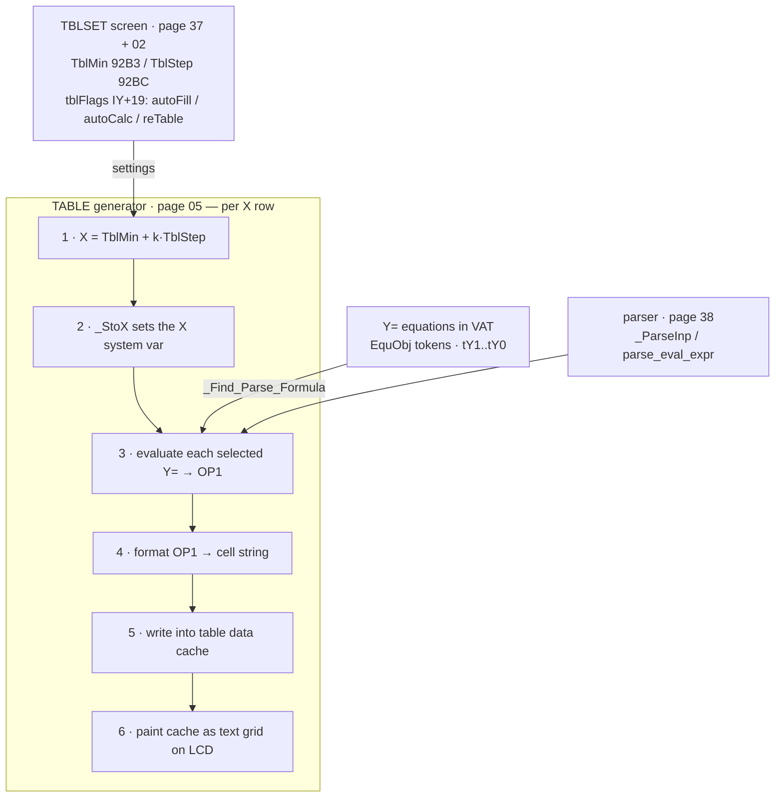

# Table & Y= Variables

*TI-84 Plus OS 2.55MP — feature deep dive.*

What a college student touches when they enter functions in **Y=**, configure
**TBLSET** (`2nd WINDOW`), and read the **TABLE** (`2nd GRAPH`) to tabulate
`Y1(X)`, `Y2(X)`, … over a range of `X`. Traces: where the table-setup settings
live → how the OS, per X row, sets the `X` variable, evaluates each selected Y=
function through the parser into OP1, formats the result, and lays the values out
as a text grid → how Y= equations are stored, selected, and styled → and the
Table ↔ Y= ↔ parser ↔ display interaction.

Builds on [sub-graphing.md](sub-graphing.md) (Y= storage, the regraph/eval path, `plotSScreen`),
[sub-tibasic.md](sub-tibasic.md) (the page-38 parser, `_Find_Parse_Formula`, `_ParseInp`),
[05-variables-vat.md](05-variables-vat.md) (`EquObj`, `_FindSym`), [08-display-lcd.md](08-display-lcd.md) (text grid via
`_PutMap`/`_PutC`), and [11-boot-contexts-errors.md](11-boot-contexts-errors.md) (the context/`cxMain`
mechanism that selects the TABLE editor vs TABLE-setup screens).

Address form is `page:addr` (flash-page hex : logical offset; flash routines run
mapped at `0x4000`). RAM addresses are absolute. Confidence:
**[confirmed]** = decompiled/byte-verified here; **[strong]** = multiple
consistent signals (flag/token compares, call shape) but the dense Z80 handler
bodies don't fully reduce in the decompiler; **[standard]** = documented TI-83+/84+
behavior consistent with what was seen, not byte-pinned here.

---

## 0. The three pieces and how they connect



The TABLE feature does **not** re-implement function evaluation. It reuses the
exact same Y= storage and the same page-38 recursive-descent evaluator the
grapher and homescreen use; it only adds (a) the running-`X` driver from
`TblMin`/`TblStep`, (b) a RAM **value cache** so scrolling doesn't recompute, and
(c) a text-grid renderer. [confirmed for structure]

---

## 1. TABLE SETUP — where the settings live & how they're read

### System variables (RAM `TIFloat`s) [confirmed addresses, ti83plus.inc + code]

| Addr | Name | Meaning | Token |
|------|------|---------|-------|
| `0x92B3` | `TblMin` (a.k.a. **TblStart**) | first independent value in the table | `tTblMin`/`TBLMINt` = `0x1A` |
| `0x92BC` | `TblStep` (**ΔTbl**) | increment between successive rows | `tTblStep`/`TBLSTEPt` = `0x21` |

Both are 9-byte floats. They are ordinary **system token variables**: read/written
through `_RclSysTok` (`38:683E`) / `_StoSysTok` (`38:623B`) using the token bytes
above (the page-38 system-var token table lives around `38:61F1`). `ΔTbl`'s token
is the **list-step** token `0x21`; `TblStart` uses `0x1A`. [confirmed token+addr]

### Mode flags — `tblFlags` (IY+19 = IY+0x13) [confirmed bit layout]

From `ti83plus.inc` and verified by the bit-ops below:

| Bit | Name | Meaning |
|-----|------|---------|
| 4 (`0x10`) | `autoFill` | **Indpnt**: 0 = `Auto` (fill X from TblStart/ΔTbl), 1 = `Ask` (prompt the student for each X) |
| 5 (`0x20`) | `autoCalc` | **Depend**: 0 = `Auto` (compute Y immediately), 1 = `Ask` (compute a cell only on request) |
| 6 (`0x40`) | `reTable`  | 0 = cached table valid, 1 = **must recompute** the table |

### TBLSET key/edit handler — `tblsetup_handler` (`02:7B20`) [confirmed]

The page-02 command/mode handler that backs the **TBLSET** screen edits the two
floats and the two mode rows. Its core writer (`02:7B35`) byte-decodes as:

```z80
02:7B35  RES 4,(IY+0x13)   ; default Indpnt = Auto  (autoFill=0)
         SET 6,(IY+0x13)   ; reTable = 1  → table is now dirty
         RET
02:7B3A  BIT 4,(IY+0x13) … ; toggle helpers for the menu rows:
         SET 4,(IY+0x13)   ;   Indpnt = Ask
         RES 5,(IY+0x13)   ;   Depend = Auto
         SET 5,(IY+0x13)   ;   Depend = Ask
```

So changing **any** TBLSET field (TblStart, ΔTbl, Indpnt, or Depend) **sets
`reTable`**, forcing a full recompute next time the TABLE is shown. [confirmed]

### TBLSET display/validation context — `tblset_cx_display` (`37:5F10`) [confirmed]

The TABLE-setup *screen* logic lives on page 37 (the menu/editor display page).
`37:5F10` reconciles the on-screen Indpnt/Depend selection against the stored
`tblFlags`: it compares `tblFlags` bit4 (autoFill) vs a UI-selection bit
(`IY+0x16 & 0x40`) and bit5 (autoCalc) vs `IY+0x11 & 0x40`, and when either
**differs it sets `reTable`** (`SET 6,(IY+0x13)`). It also zeroes the table-top
row index `0x91E0` when Indpnt flips to Ask. Companion sites: `37:5F2B`
(BIT 5 autoCalc), `37:5F59`/`37:5F94` (re-reads). [confirmed]

---

## 2. Y= equation variables — storage, selection, style

### Storage [confirmed type/token, strong for byte layout]

`Y1…Y9, Y0` are **system equation variables**, VAT objects of type **`EquObj` = 3**
(`ti83plus.inc`: `EquObj EQU 3`; `NewEquObj`=0x0B, `UnknownEquObj`=0x0A). Each holds
`word size` + `size` bytes of the **tokenized formula** you typed after `Y1=` — the
*same* token encoding the homescreen and program editor use (see [sub-tibasic.md](sub-tibasic.md)).
The equation name in OP1 is the 2-byte token sequence **`tVarEqu (0x5E)` + the
Y-token**:

| Var | Token | | Var | Token |
|-----|-------|-|-----|-------|
| `Y1` | `0x10` | | `Y6` | `0x15` |
| `Y2` | `0x11` | | `Y7` | `0x16` |
| `Y3` | `0x12` | | `Y8` | `0x17` |
| `Y4` | `0x13` | | `Y9` | `0x18` |
| `Y5` | `0x14` | | `Y0` | `0x19` |

(Parametric `X1T/Y1T`=`0x20/0x21`…, polar `r1`…, and `u/v/w` sequences share the
same `EquObj`/`tVarEqu` machinery.) [confirmed tokens]

### Selection & style flags [confirmed]

Each equation's **flags byte** is `0x23` when **selected** (plotted / tabulated) and
`0x03` when deselected — i.e. the selection bit is **bit 5 (`0x20`)**. The separate
per-equation **style byte** encodes the line style: `0`=line, `1`=thick, `2`=shade above,
`3`=shade below, `4`=trace/path, `5`=animate, `6`=dotted. The TABLE iterates the
**same selected set** the grapher plots, so deselecting `Y2` in the Y= editor (or
clearing its `=` highlight) removes its column from the table. `curGStyle`
(`0x8D17`) holds the in-progress style; `sGrFlags` bit `g_style_active`
(IY+20 bit5) enables per-equation styles. The graphing doc covers the plot side; the
*table* only reads the selection bit to decide which columns exist. [confirmed against the
[TI link-protocol var guide](https://merthsoft.com/linkguide/ti83+/vars.html#style)]

### The selected-equation list — `iMathPtr4` (`0x84D9`) [confirmed]

The OS keeps an in-RAM table of **2-byte pointers to the selected equations'
VAT entries**, based at `iMathPtr4 = 0x84D9`. Three bcalls index it (verified by
decompile — they compute `0x84D9 + 2·n`):

| bcall | Addr | Role |
|-------|------|------|
| `_GraphTblFind` | `33:7097` | (re)build the list of selected-equation pointers |
| `_GraphTblNext` | `33:707A` | `_LdHLind(0x84D9 + 2·n)` — fetch the n-th equation pointer |
| `_grf_7066` | `33:7066` | store a pointer into slot n (`0x84D9 + 2·n`) |

This is the shared iterator the **regraph driver and the table builder both walk**
to visit each selected `Yn`. [confirmed]

### Resolving & evaluating a Y-var — `_Find_Parse_Formula` (`38:758A`) [confirmed]

`_Find_Parse_Formula` (bcall id `0x4AF2`) is the universal "find a named var and
parse/evaluate its stored formula" entry (see `sub-tibasic.md §3`). For a Y-var it
`_FindSym`s the `EquObj`, points the parse cursor at its token body, and runs the
page-38 evaluator, leaving the result in **OP1**. The 38:758A entry seen here is a
thin **RST2 bcall trampoline**; the body switches on var type (Window `0x0F` /
ZSto `0x10` / **TblRng `0x11`** special-cased) before the cross-page parse — i.e.
the table range is itself handled as a special "formula" type by this resolver.
It is bcalled from `03:67C0` (the Y= equation editor) and `33:7720` (graph setup).
Homescreen `Y1(2)` evaluates through this same path: the parser sees `tVarEqu tY1`,
resolves the EquObj, substitutes the argument as `X`, and evaluates. [confirmed
entry; strong for the eval substitution]

---

## 3. Table generation — the page-05 subsystem

**Page 0x05 is the TABLE editor / Graph-Table subsystem.** All references to
`TblMin`/`TblStep` and to the table column-data pointers (`XOutDat 0x918E`,
`YOutDat 0x9192`) concentrate on page 05, and the page's `tblFlags` bit-ops
(`reTable`, `autoFill`, `autoCalc`) drive the recompute/scroll logic. The TABLE
editor is installed as a **context** (`cxTableEditor = 0x4A`, `ti83plus.inc`),
selected from `[2nd][GRAPH]` via the key→context router (`11-boot-contexts`);
its handler vectors run on page 05.

### Editor main display — `table_editor_main` (`05:5D0D`) [confirmed]

```c
if (tblFlags & 0x40 /*reTable*/) recompute = table_recompute()  ; 05:5DD7
else                              use_cache  = table_use_cache() ; 05:78CF
if (graphFlags & 1) { redraw helpers ... }                       ; split-graph case
paint_grid(...)                                                  ; 05:7771
```

So on every entry to the TABLE the editor checks `reTable`: if dirty it runs the
recompute driver, otherwise it repaints from the cached values. [confirmed]

### Recompute driver — `table_recompute` (`05:5DD7`) [confirmed]

```z80
05:5DD7  XOR A ; LD (0x8E63),A           ; reset table column/row state
         CALL 0x3411 ; RET Z             ; (window/mode gate)
         CALL 0x7704                     ; init column descriptors (see below)
         CALL 0x774B                     ; seed running-X = TblMin  (see §3.1)
         CALL 0x65D2 ; CALL 0x65C8       ; clear per-column flags
         CALL 0x5EE1                     ; FILL the value cache (the row loop)
         CALL 0x6014 ; CALL 0x5FFC       ; lay out / size the columns
         RES 6,(IY+0x13)                 ; reTable = 0  (cache now valid)
         CALL 0x76BA
```

After a successful recompute it **clears `reTable`**, so subsequent scrolls reuse
the cache until something marks it dirty again. [confirmed bytes]

### 3.1 Seeding the running independent value [confirmed]

`05:774B` (and the identical `05:773F`) initialise the per-table running `X`:

```z80
LD HL,0x92B3 (TblMin) ; LD DE,0x862B ; JP 0x1A92    ; running-X (0x862B) ← TblMin
```

i.e. the first row's independent value is **TblStart**. A working float at
`0x8622`/`0x862B` holds the current row's X. The "advance to next row" step
(`05:65DC`) adds **TblStep** to it:

```z80
05:65DC  … LD HL,(table indices) … CALL 0x6D67 (advance) …
05:6359  LD A,(0x91DD) … LD DE,0x9221 / 0x91E2 (cell buffers)
         LD HL,(0x91DC /*row idx*/) ; ADD ; CALL _LdHLind ; ADD HL,DE
```

So row $k$ uses $X=\mathrm{TblMin}+k\cdot\mathrm{TblStep}$. (In **Indpnt = Ask** mode this driver is
bypassed and the student types each X; see §3.4.) [confirmed structure]

### 3.2 The per-row evaluation: set X, evaluate each selected Y [strong]

For each row the recompute fills the cache by, per selected equation:
1. store the running-X into the `X` **system variable** (`_StoX`, `38:62A3`),
2. evaluate that equation's tokens against the current `X` — the table walks the
   selected list via `_GraphTblNext` (`33:707A`) and runs each formula through the
   page-38 evaluator (`_ParseInp` `38:5987` / the `_Find_Parse_Formula` path),
   leaving `Y` in **OP1** (exactly the grapher's per-column eval in
   `sub-graphing.md §6`),
3. format OP1 and stash the result string/value into the row's cache slot.

The fill loop is `05:5EE1`: it strides the cell buffer at **`0x91E2`** in 9-byte
(`TIFloat`) steps for up to 7 visible columns (`LD C,0x07`), keyed off the
top-row index `0x91E0`. The `X` column itself is written from the running-X; the
`Y` columns from the evaluated OP1. [strong — loop + buffers byte-confirmed; the
`_StoX`/eval calls are on-page direct CALLs not individually byte-pinned here]

### 3.3 The value cache & scrolling [confirmed buffers]

The table keeps the visible window of computed values in a RAM **cache** so that
scrolling is instant (no recompute):

| Addr | Role |
|------|------|
| `0x918C` `XOutSym` / `0x918E` `XOutDat` | X column: symbol + **data pointer** |
| `0x9190` `YOutSym` / `0x9192` `YOutDat` | active Y column: symbol + **data pointer** |
| `0x9194` `inputSym` / `0x9196` `inputDat` | the "Ask"/input column descriptor |
| `0x9198` `prevData` | previous-column data pointer |
| `0x91DB` / `0x91DC` / `0x91E0` | row indices / top-row index / column count |
| `0x91E2 … 0x9221 …` | the per-cell computed-value buffers (9-byte floats) |

`05:6014` performs the **scroll**: `LD HL,0x9221 ; LD DE,0x9260 ; LDIR` (copy a
0x3F-byte block) and an `LDDR` shift of a 0xB4-byte region — i.e. when you press
↑/↓ past the cached window it slides the cache and only computes the one new row
(or recomputes if `reTable`). [confirmed bytes]

### 3.4 Indpnt = Auto vs Ask, Depend = Auto vs Ask [confirmed test sites]

`05:6D40`/`05:6D51` read the mode bits to branch:

```z80
05:6D40  … CALL 0x74BE ; JR NZ ; BIT 4,(IY+0x13) ; RET   ; Indpnt (autoFill) test
         … CALL 0x74BE ; JR NZ ; BIT 5,(IY+0x13) ; RET   ; Depend (autoCalc) test
         LD A,(0x91DB) … LD A,(0x91DC) …                  ; Ask-mode row state
```

- **Indpnt = Auto** (bit4=0): the driver auto-fills X from TblStart/ΔTbl (§3.1).
- **Indpnt = Ask** (bit4=1): the X column starts empty; the editor prompts the
  student to type each X, parses it (entry-line editor → `_ParseInp`), stores it
  to `X`, then evaluates the Y columns for just that row.
- **Depend = Auto** (bit5=0): Y cells compute immediately during the fill.
- **Depend = Ask** (bit5=1): Y cells show blank until the cursor lands on one and
  `[ENTER]` requests it, at which point that single cell is evaluated. [confirmed
  bit tests; Ask prompting flow is strong/standard]

### 3.5 Rendering the grid to the LCD — `05:7E45` (column/row paint loop) [confirmed]

The table is a **text grid** (not the pixel graph buffer): up to 8 visible rows ×
columns, drawn with the large font through the home-screen text primitives
(`_PutMap`/`_PutC`, [08-display-lcd.md](08-display-lcd.md)). The paint loop:

```z80
05:7E45  loop over visible rows:
           CALL 0x7E7C            ; position/clear the cell (selects buffer
                                  ;   0x9221 for one column or 0x91E2 for the other)
           CALL 0x7E9D
           LD DE,(0x9192 YOutDat) ; the Y-column value pointer
           CP 2 / CP 5            ; column-kind dispatch (X col vs Y col vs input)
           CALL 0x7E7C ; CALL 0x7E98   ; render the cached value into the cell
           CALL 0x65DC            ; advance running-X (= +TblStep) for next row
           INC row ; … ; LD (0x91DC),A
```

`05:7E7C` chooses the destination text buffer (`0x9221` vs `0x91E2`) based on the
column index, and writes `0xFF`/blank sentinels for empty (Ask) cells. The bottom
status line and the highlighted-cell full-precision readout reuse the same value
cache. [confirmed loop + buffers]

### 3.6 Split Graph-Table mode — `_ScreenSplit` (`05:7712`) [confirmed]

The **G-T** mode (graph on the left half, table on the right) is set up by
`_ScreenSplit` (bcall `0x5227`): it checks the split flag, calls `_Bit_VertSplit`,
then `05:7544` and the table-init `05:773F` (seed running-X from TblMin), and
cross-jumps to redraw. So G-T mode shares the very same table cache + running-X
driver, just rendered into the right columns alongside the plot. [confirmed]

---

## 4. What marks the table dirty (`reTable` = 1) [confirmed sites]

Anything that could change a tabulated value sets `tblFlags` bit6, forcing the
next TABLE view to recompute:

| Site | Trigger |
|------|---------|
| `02:7B35` | editing **TblStart/ΔTbl/Indpnt/Depend** in TBLSET |
| `37:5F3D` | toggling Indpnt or Depend on the setup screen |
| `38:6340`, `38:4809`, `38:54CD` | the **parser** storing into a Y= equation or a relevant var (editing `Y1=…`, `→Y1`, or changing `X`/window) |
| `00:4105` | boot / reset (`RAM clear`) initialises the table as dirty |

Conversely only the recompute driver **clears** it (`05:5DD7`, `05:62FD`,
`05:64DE` → `RES 6,(IY+0x13)`). [confirmed]

---

## 5. End-to-end: a student tabulates Y1=X² + 1

1. **Y=**: types `X²+1` after `Y1=`. The editor tokenizes it and stores the bytes
   as the `EquObj` `Y1` (token `5E 10`) in the VAT, with its flags byte's **select
   bit set** (the `=` is highlighted). The parser store path sets `reTable`.
2. **TBLSET** (`2nd WINDOW`): sets `TblStart=0` (`TblMin` 0x92B3), `ΔTbl=1`
   (`TblStep` 0x92BC), `Indpnt:Auto`, `Depend:Auto`. Each edit sets `reTable`
   (`02:7B35`).
3. **TABLE** (`2nd GRAPH`): enters context `cxTableEditor` (0x4A) on page 05.
   `table_editor_main` (`05:5D0D`) sees `reTable=1` → `table_recompute`
   (`05:5DD7`):
   - seed running-X ← `TblMin` (`05:774B`),
   - `_GraphTblFind`/`_GraphTblNext` (`33:7097`/`707A`) walk the **selected**
     equation list at `iMathPtr4` (0x84D9) — here just `Y1`,
   - per row: `_StoX` the running-X, evaluate `Y1`'s tokens via the page-38
     evaluator (`_Find_Parse_Formula` / `_ParseInp`) → OP1 = `X²+1`, format and
     stash into the cell cache (`0x91E2`/`0x9221`),
   - advance running-X by `TblStep` (`05:65DC`) and repeat,
   - clear `reTable`.
4. The grid paints (`05:7E45`) the cached `X` and `Y1` columns as large-font text;
   scrolling (`05:6014`) slides the cache and computes only newly exposed rows.
5. Deselecting `Y1` (or editing the formula, or changing `ΔTbl`) sets `reTable`
   again and the next view recomputes.

---

## 6. Confident addresses (`space:addr` → name)

```
; --- TABLE setup settings & flags ---
RAM  92B3   TblMin / TblStart                  ; first independent value (sys float)
RAM  92BC   TblStep / ΔTbl                     ; row increment (sys float)
IY+19 b4    tblFlags.autoFill = Indpnt Auto/Ask
IY+19 b5    tblFlags.autoCalc = Depend Auto/Ask
IY+19 b6    tblFlags.reTable  = table-dirty
page_02:7b20  tblsetup_handler                 ; TBLSET key/edit handler
page_02:7b35  tblsetup_set_defaults            ; default Indpnt=Auto, set reTable
page_37:5f10  tblset_cx_display                ; TBLSET screen reconcile → reTable

; --- TABLE editor / generator (page 05) ---
page_05:5d0d  table_editor_main                ; reTable? recompute : use cache; paint
page_05:5dd7  table_recompute                  ; seed X, fill cache, clear reTable
page_05:774b  table_seed_runX_from_TblMin      ; runningX(0x862B) ← TblMin
page_05:773f  table_seed_runX_from_TblMin2     ; same, split-graph path
page_05:65dc  table_next_X                     ; runningX += TblStep
page_05:5ee1  table_fill_cache_loop            ; per-row value-cache fill (0x91E2)
page_05:6014  table_scroll_cache               ; slide cell cache on scroll (LDIR/LDDR)
page_05:6d40  table_mode_test                  ; BIT autoFill/autoCalc (Auto vs Ask)
page_05:7e45  table_paint_grid_loop            ; render cached cells as text columns
page_05:7e7c  table_cell_select_buffer         ; pick cell text buffer 0x9221/0x91E2
page_05:7712  _ScreenSplit                     ; Graph-Table split-screen setup
page_05:62fd  table_recompute_clear_reTable    ; another RES6 recompute exit

; --- table value-cache RAM ---
RAM  918C/918E  XOutSym / XOutDat              ; X-column symbol + data ptr
RAM  9190/9192  YOutSym / YOutDat              ; Y-column symbol + data ptr
RAM  9194/9196  inputSym / inputDat            ; Ask-input column descriptor
RAM  9198       prevData                       ; previous-column data ptr
RAM  91DB/91DC/91E0  row idx / row idx / top-row & col count
RAM  91E2 / 9221     per-cell computed-value buffers (9-byte floats)
RAM  8622 / 862B     running independent value (current row's X)

; --- Y= equations, selected list, evaluation ---
EquObj = 3 (VAT type)                          ; Y1..Y0 stored as tokenized formulas
tokens: tVarEqu=0x5E + tY1=0x10 … tY0=0x19     ; Y-var name encoding
RAM  84D9   iMathPtr4                          ; base of selected-equation pointer list
page_33:7097  _GraphTblFind                    ; (re)build selected-equation list
page_33:707a  _GraphTblNext                    ; fetch n-th equation ptr (0x84D9+2n)
page_33:7066  _grf_7066                        ; store n-th equation ptr
page_38:758a  _Find_Parse_Formula              ; FindSym Y-var + parse its formula → OP1
page_38:5987  _ParseInp                        ; parse/eval a formula against current X
page_38:62a3  _StoX                            ; store OP1 → X system var (per row)
page_38:67ae  _RclX  / 38:67a4 _RclY / 38:626c _StoY
page_33:5023  _GraphParseTok                   ; pre-scan equation tokens (graphable?)

; --- reTable (dirty) setters ---
page_38:6340 / 38:4809 / 38:54cd  parser sets reTable on Y=/var edit
page_00:4105  boot sets reTable
```

---

## 7. Confidence summary / open items

- TblMin/TblStep addresses + tokens, the `tblFlags` bit layout, and which sites
  set/clear `reTable`: **[confirmed]** (equates + byte-verified bit-ops).
- Page 05 = TABLE subsystem, the recompute→clear-reTable structure, the running-X
  seed from TblMin and `+TblStep` advance, the cell-cache buffers, the scroll
  (`LDIR`/`LDDR`), and the text-grid paint loop: **[confirmed]** from byte
  disassembly; the dense Z80 bodies don't fully reduce in the decompiler but the
  CALL/buffer structure is byte-pinned.
- The exact per-row `_StoX` + selected-Y eval calls inside `05:5EE1`/the fill
  loop are **[strong]** — the loop, buffers, and the shared selected-equation
  iterator (`iMathPtr4` / `_GraphTblNext`) are confirmed; the individual on-page
  direct CALLs to `_StoX`/the evaluator were inferred from the identical
  grapher per-column path rather than each byte-traced.
- Y= **selection bit (`0x20`)** — flags byte `0x23` selected / `0x03` deselected — and the
  **style** byte values (`0`=line … `6`=dotted) are **[confirmed]** against the
  [TI link-protocol var guide](https://merthsoft.com/linkguide/ti83+/vars.html#style).
- **Ask**-mode prompting flow (entry-line editor → `_ParseInp` → `_StoX` for a
  typed X, single-cell Depend:Ask compute) is **[strong]**: the mode bit tests
  (`05:6D40`) are confirmed; the interactive prompt body overlaps the page-02
  Input/entry handlers and was not fully reduced.
- `_Find_Parse_Formula`'s `TblRng` (type 0x11) special-case is **[confirmed]** in
  the header switch but its full body (cross-page) was not traced here.
