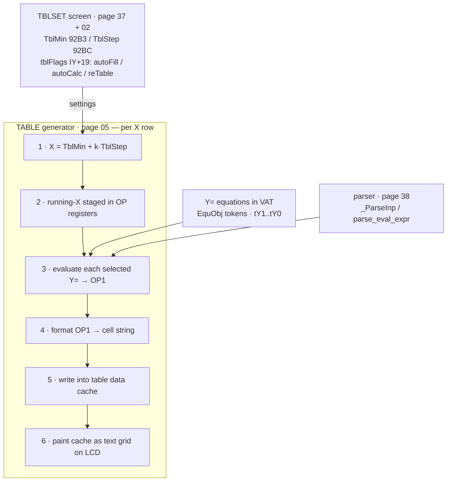

# Table and Y= variables

The table subsystem stores equations from **Y=**, reads settings from
**TBLSET**, evaluates selected equations row by row, caches their values, and
paints the **TABLE** grid. This page covers automatic and prompted independent
and dependent values as well as split graph-table mode.

The subsystem shares equation storage with [Graphing](sub-graphing.md), parser
entry points with [TI-BASIC execution](sub-tibasic.md), VAT objects with
[Variables and the VAT](variables-vat.md), and text output with [Display and
LCD](display-lcd.md).

## Subsystem components


```mermaid
flowchart TB
    TBLSET["TBLSET screen · page 37 + 02<br/>TblMin 92B3 / TblStep 92BC<br/>tblFlags IY+19: autoFill / autoCalc / reTable"]
    YEQ["Y= equations in VAT<br/>EquObj tokens · tY1..tY0"]
    PARSER["parser · page 38<br/>_ParseInp / parse_eval_expr"]
    subgraph GEN["TABLE generator · page 05 — per X row"]
      direction TB
      S1["1 · X = TblMin + k·TblStep"]
      S2["2 · running-X staged in OP registers"]
      S3["3 · evaluate each selected Y= → OP1"]
      S4["4 · format OP1 → cell string"]
      S5["5 · write into table data cache"]
      S6["6 · paint cache as text grid on LCD"]
      S1 --> S2 --> S3 --> S4 --> S5 --> S6
    end
    TBLSET -->|settings| S1
    YEQ --> S3
    PARSER --> S3
```

The TABLE feature reuses the Y= storage and the same page-38
recursive-descent evaluator the grapher and homescreen use; it adds only
(a) the running-`X` driver from
`TblMin`/`TblStep`, (b) a RAM value cache that reuses values still in its window, and
(c) a text-grid renderer. [confirmed]

---

## TABLE settings

### System variables (RAM `TIFloat`s) [confirmed]

| Addr | Name | Meaning | Token |
|------|------|---------|-------|
| `0x92B3` | `TblMin` (a.k.a. `TblStart`) | first independent value in the table | `tTblMin`/`TBLMINt` = `0x1A` |
| `0x92BC` | `TblStep` (`ΔTbl`) | increment between successive rows | `tTblStep`/`TBLSTEPt` = `0x21` |

Both are 9-byte floats. They are ordinary system token variables: read/written
through `_RclSysTok` (`38:683E`) / `_StoSysTok` (`38:623B`) using the token bytes
above (the page-38 system-var token table lives around `38:61F1`). `ΔTbl`'s token
is the list-step token `0x21`; `TblStart` uses `0x1A`. [confirmed]

### Mode flags — `tblFlags` (IY+19 = IY+0x13) [confirmed]

From `ti83plus.inc` and verified by the bit-ops below:

| Bit | Name | Meaning |
|-----|------|---------|
| 4 (`0x10`) | `autoFill` | **Indpnt**: 0 = `Auto` (fill X from TblStart/ΔTbl), 1 = `Ask` (prompt for each X) |
| 5 (`0x20`) | `autoCalc` | **Depend**: 0 = `Auto` (compute Y immediately), 1 = `Ask` (compute a cell only on request) |
| 6 (`0x40`) | `reTable`  | 0 = cached table valid, 1 = must recompute the table |

### TBLSET key and edit handler [confirmed]

The page-02 command/mode handler that backs the **TBLSET** screen edits the two
floats and the two mode rows. A retired helper label at `02:7B31` is not a live function in the current DB, but the byte sequence there decodes as:

```z80
02:7B31  RES 4,(IY+0x13)   ; default Indpnt = Auto  (autoFill=0)
02:7B35  SET 6,(IY+0x13)   ; reTable = 1  → table is now dirty
         RET
02:7B3A  BIT 4,(IY+0x13) … ; toggle helpers for the menu rows:
         SET 4,(IY+0x13)   ;   Indpnt = Ask
         RES 5,(IY+0x13)   ;   Depend = Auto
         SET 5,(IY+0x13)   ;   Depend = Ask
```

So changing any TBLSET field (TblStart, ΔTbl, Indpnt, or Depend) sets
`reTable`, forcing a full recompute next time the TABLE is shown. [confirmed]

### TBLSET display and validation context [confirmed]

The TABLE-setup *screen* logic lives on page 37 (the menu/editor display page).
`37:5F10` reconciles the on-screen Indpnt/Depend selection against the stored
`tblFlags`: it compares `tblFlags` bit4 (autoFill) vs a UI-selection bit
(`IY+0x16 & 0x40`) and bit5 (autoCalc) vs `IY+0x11 & 0x40`, and when either
differs it sets `reTable` (`SET 6,(IY+0x13)`). It also zeroes the table-top
row index `0x91E0` when Indpnt flips to Ask. Companion sites: `37:5F2B`
(BIT 5 autoCalc), `37:5F59`/`37:5F94` (re-reads). [confirmed]

---

## Y= equation storage, selection, and style

### Storage [confirmed]

`Y1…Y9, Y0` are system equation variables, VAT objects of type `EquObj` = 3
(`ti83plus.inc`: `EquObj EQU 3`; `NewEquObj`=0x0B, `UnknownEquObj`=0x0A). Each holds
`word size` + `size` bytes of the tokenized formula you typed after `Y1=` — the
*same* token encoding the homescreen and program editor use (see [sub-tibasic.md](sub-tibasic.md)).
The equation name in OP1 is the 2-byte token sequence `tVarEqu (0x5E)` + the
Y-token:

| Var | Token | | Var | Token |
|-----|-------|-|-----|-------|
| `Y1` | `0x10` | | `Y6` | `0x15` |
| `Y2` | `0x11` | | `Y7` | `0x16` |
| `Y3` | `0x12` | | `Y8` | `0x17` |
| `Y4` | `0x13` | | `Y9` | `0x18` |
| `Y5` | `0x14` | | `Y0` | `0x19` |

(Parametric `X1T/Y1T`=`0x20/0x21`…, polar `r1`…, and `u/v/w` sequences share the
same `EquObj`/`tVarEqu` machinery.) [confirmed]

### Selection and style flags [confirmed]

Each equation's flags byte is `0x23` when selected (plotted / tabulated) and
`0x03` when deselected — i.e. the selection bit is bit 5 (`0x20`). The separate
per-equation style byte encodes the line style: `0`=line, `1`=thick, `2`=shade above,
`3`=shade below, `4`=trace/path, `5`=animate, `6`=dotted. The TABLE iterates the
same selected set the grapher plots, so deselecting `Y2` in the Y= editor (or
clearing its `=` highlight) removes its column from the table. `curGStyle`
(`0x8D17`) holds the in-progress style; `sGrFlags` bit `g_style_active`
(IY+20 bit5) enables per-equation styles. The graphing doc covers the plot side; the
*table* only reads the selection bit to decide which columns exist. [confirmed]
The values also match the
[TI link-protocol var guide](https://merthsoft.com/linkguide/ti83+/vars.html#style).

### Indexed pointer helpers — `iMathPtr4` (`0x84D9`) [confirmed]

Two official bcalls address a RAM array of two-byte values based at the pointer stored in `iMathPtr4`
(`0x84D9`). A third official bcall sorts a caller-supplied range:

| bcall | Addr | Role |
|-------|------|------|
| `_PUT_INDEX_LST` | `33:7066` | store a value in slot `n` at `word_at(0x84D9) + 2n` |
| `_GET_INDEX_LST` | `33:707A` | load the value in slot `n` through `_LdHLind` |
| `_HEAP_SORT` | `33:7097` | sort an indexed caller-supplied range |

The helper behavior is [confirmed], but the bodies do not identify what every
caller stores in the array. `_HEAP_SORT` does not discover selected equations.
The builder and consumer for the TABLE editor's selected-Y set remain
[hypothesis].

### Resolving and evaluating a Y-var [confirmed]

 `_Find_Parse_Formula` (bcall ID `4AF2h`) begins at
`38:758A` with `CALL 17A6h` followed by `CALL 12A1h`, then prepares parser
and FP state. It is not an RST trampoline. The actual TABLE caller-to-parser
path must be checked separately from this public routine's name.
The checks at `38:734D` and `38:7056` do not establish a
`TblRng` special case in `_Find_Parse_Formula`; `38:734D`
is an operand byte inside `CALL 1674h`. [confirmed]

---

## Table generation

Page 0x05 is the TABLE editor / Graph-Table subsystem. All references to
`TblMin`/`TblStep` and to the table column-data pointers (`XOutDat 0x918E`,
`YOutDat 0x9192`) concentrate on page 05, and the page's `tblFlags` bit-ops
(`reTable`, `autoFill`, `autoCalc`) drive the recompute/scroll logic. The TABLE
editor is installed as a context (`cxTableEditor = 0x4A`, `ti83plus.inc`),
selected from `[2nd][GRAPH]` via the key→context router (`11-boot-contexts`);
its handler vectors run on page 05.

### Editor main display — `table_editor_main` (`05:5D0D`) [confirmed]

```c
if (tblFlags & 0x40 /* reTable */) recompute = table_recompute()  ; 05:5DD7
else                              use_cache  = table_use_cache() ; 05:78CF
if (graphFlags & 1) { redraw helpers ... }                       ; split-graph case
paint_grid(...)                                                  ; 05:7771
```

So on every entry to the TABLE the editor checks `reTable`: if dirty it runs the
recompute driver, otherwise it repaints from the cached values. [confirmed]

### Recompute driver — `table_recompute` (`05:5DD7`) [confirmed]

```z80
05:5DD7  XOR A
         LD (0x8E63),A                   ; reset table column/row state
         CALL 0x3411
         RET Z                           ; window/mode gate
         CALL 0x7704                     ; init column descriptors (see below)
         CALL 0x774B                     ; seed running-X = TblMin
         CALL 0x65D2
         CALL 0x65C8                     ; clear per-column flags
         CALL 0x5EE1                     ; FILL the value cache (the row loop)
         CALL 0x6014
         CALL 0x5FFC                     ; lay out / size the columns
         RES 6,(IY+0x13)                 ; reTable = 0  (cache now valid)
         CALL 0x76BA
```

After a successful recompute it clears `reTable`. Values retained in the cache
can then be reused; scrolling beyond its window still requires new values.
[confirmed]

### Seeding the independent value [confirmed]

`05:774B` initialises the two-float `table_x_work` array. It first clears
`table_x_work[0]` (`0x8622`), then at `05:7751` copies `TblMin` into
`table_x_work[1]`, the running-X slot:

```z80
05:7751  LD HL,0x92B3                  ; TblMin
         LD DE,0x862B                  ; running-X destination
         JP 0x1A92
```

i.e. the first row's independent value is `TblStart`. The row index is bounds-checked at
`05:65DC` by comparing the current row with the last row:

```z80
LD A,(0x91E0)
LD HL,CurTableRow
CP (HL)
RET
```

Automatic mode presents the sequence
$X_k=\mathrm{TblMin}+k\cdot\mathrm{TblStep}$. [standard]
The cache-address helper at `05:6359`–`05:6378` selects a
band and multiplies a row index by nine. It does not establish whether the
numeric sequence uses repeated addition or a fresh multiplication for every
row. That arithmetic choice remains [hypothesis].

### Per-row evaluation [confirmed]

For each visible row the recompute fills the cache:

1. Store the row's X value in a cache slot and stage it through OP1/OP2. The
   running X remains in OP registers and FPS slots rather than passing through
   `_StoX` for each row.
2. Evaluate each selected equation against the current X through the parser.
   The observed parser cluster includes `38:5B7B`, `38:5B10`, and the
   `_ParseInp` region. The exact evaluator call edge remains open. Bcall
   `4741h` is `_CPYO1TOES15` at `35:7C7C`, an expression-stack helper;
   its name and entry do not establish a parser dispatcher.
3. Format OP1 and store the result in the row's cache slot.

The fill setup at `05:6200` loads `B = 7` for the visible rows. Its loop at
`05:6205` increments
`CurTableRow` (`0x91DC`) on each iteration. It pushes a cleanup handler through
`ram:27DA`, calls the evaluator once per selected equation, and stores results
through `05:6284` and `05:629B`. A headless TilEm trace of `Y1=X²` with default
TBLSET executes the `_ParseInp` region seven times, once per row. Between
consecutive rows, execution passes through `parse_init` and `fps_alloc_to_9652`.
The trace does not execute `_StoX` (`38:62A3`) during the fill. [confirmed]

The cache-clearing preamble is `table_fill_cache_loop` (`05:5EE1`): it strides
`table_value_cache.band[0]` at `0x91E2` in 9-byte (`TIFloat`) steps for seven
value slots (`LD C,0x07`), keyed off the top-row index `0x91E0`. The `X`
column itself is written from the running-X; the `Y` columns from the evaluated
OP1. [confirmed]

### Value cache and scrolling [confirmed]

The table keeps the visible window of computed values in a RAM cache so that
values still inside the cached window can be reused:

| Addr | Role |
|------|------|
| `0x918C` `XOutSym` / `0x918E` `XOutDat` | X column: symbol + data pointer |
| `0x9190` `YOutSym` / `0x9192` `YOutDat` | active Y column: symbol + data pointer |
| `0x9194` `inputSym` / `0x9196` `inputDat` | the "Ask"/input column descriptor |
| `0x9198` `prevData` | previous-column data pointer |
| `0x91DB` | unnamed Ask-mode row state |
| `0x91DC` / `0x91DD` | `CurTableRow` / `CurTableCol` |
| `0x91E0` | table-top state; exact role remains open |
| `0x91E2` | `table_value_cache`, the per-cell computed-value bands |

The three contiguous 63-byte regions at `0x91E2`, `0x9221`, and `0x9260`
form one typed cache:

```c
typedef struct {
    TIFloat value[7];
} TableCacheBand;             /* 0x3F bytes */

typedef struct {
    TableCacheBand band[3];
} TableValueCache;            /* 0xBD bytes at table_value_cache */
```

Thus `0x9221` is `table_value_cache.band[1]`, and `0x9260` is
`table_value_cache.band[2]`. This notation captures both the 9-byte element
stride and the 63-byte scroll-copy stride. [confirmed]

The band-copy entry at `05:601E` performs this copy:

```z80
LD HL,0x9221
LD DE,0x9260
LDIR
```

This copies
`table_value_cache.band[1]` to `band[2]` (a `0x3F`-byte block).
Entry `05:6026` reverses that copy. The separate entry at `05:6032`
performs an `LDDR` shift of a `0xB4`-byte region.
`05:6014` instead calls `ram:34B9` and `05:618D`, stores `A` to
`0x91DA`, and returns; it is not the copy/shift body. When the cursor moves above or below the
cached window, it slides the cache and computes only the one new row
(or recomputes if `reTable`). [confirmed]

### Auto and Ask modes [confirmed]

`05:6D40`/`05:6D51` read the mode bits to branch:

```z80
05:6D40  … CALL 0x74BE
         JR NZ
         BIT 4,(IY+0x13)
         RET                             ; Indpnt (autoFill) test
         … CALL 0x74BE
         JR NZ
         BIT 5,(IY+0x13)
         RET                             ; Depend (autoCalc) test
         LD A,(0x91DB) … LD A,(0x91DC) …                  ; Ask-mode row state
```

- **Indpnt = Auto** (bit4=0): the driver auto-fills X from TblStart/ΔTbl as described under [Seeding the independent value](#seeding-the-independent-value-confirmed).
- **Indpnt = Ask** (bit4=1): the X column starts empty. The per-row prompt body
  at `05:6DFF` calls the Indpnt test at `05:6D4C` and invokes the entry-line
  editor at `05:7303`. The editor installs error continuation `05:7329` through `ram:27DA` and enters setup at `05:5F64` and `05:5F51`. On
  success, `05:6032` shifts the `table_value_cache` band and enters row
  evaluation at `05:615C`. [confirmed]
- **Depend = Auto** (bit5=0): Y cells compute immediately during the fill.
- **Depend = Ask** (bit5=1): the gate at `05:6DD1` tests bit 5 through
  `05:6D67` and `05:6D56`. In Ask mode, `05:69D2` checks cell state at `0x91CE`
  and `0x8D1B`, then calls `05:637C` for one deferred evaluation. That routine
  installs error continuation `05:644E` through `ram:27DA` and runs
  the cell expression through the standard OPS machinery. [confirmed]

The mode tests at `05:6D4C` and `05:6D56` first call `05:74BE`. A nonzero result
bypasses the `(IY+0x13)` bit tests. This override behavior is [confirmed], but
the condition detected by `05:74BE` remains [hypothesis].

### Grid rendering [confirmed]

The table is a text grid (not the pixel graph buffer): up to 8 visible rows ×
columns, drawn with the large font through the home-screen text primitives
(`_PutMap`/`_PutC`, [display-lcd.md](display-lcd.md)). The paint loop:

```z80
05:7E45  loop over visible rows:
           CALL 0x7E7C            ; position/clear the cell (selects buffer
                                  ;   0x9221 for one column or 0x91E2 for the other)
           CALL 0x7E9D
           LD DE,(0x9192 YOutDat) ; the Y-column value pointer
           CP 2 / CP 5            ; column-kind dispatch (X col vs Y col vs input)
           CALL 0x7E7C
           CALL 0x7E98             ; render the cached value into the cell
           CALL 0x65DC            ; row-index bound check (current row vs last)
           INC row
           …
           LD (0x91DC),A
```

`05:7E7C` chooses the destination cache band (`table_value_cache.band[1]` at
`0x9221` versus `band[0]` at `0x91E2`) based on the
column index, and writes `0xFF`/blank sentinels for empty (Ask) cells. The bottom
status line and the highlighted-cell full-precision readout reuse the same value
cache. [confirmed]

### Split graph-table mode [confirmed]

The **G-T** mode (graph on the left half, table on the right) is set up by
`screen_split` (bcall `0x5227`): it checks the split flag, calls `_Bit_VertSplit`,
then `05:7544` and the table-init `05:773F` (seed running-X from TblMin), and
cross-jumps to redraw. G-T mode shares the table cache and running-X
driver, rendered into the right columns alongside the plot. [confirmed]

---

## Table invalidation through `reTable` [confirmed]

Anything that could change a tabulated value sets `tblFlags` bit6, forcing the
next TABLE view to recompute:

| Site | Trigger |
|------|---------|
| `02:7B35` bytes | editing TblStart/ΔTbl/Indpnt/Depend in TBLSET |
| `37:5F3D` | toggling Indpnt or Depend on the setup screen |
| `38:6340`, `38:4809`, `38:54CD` | the parser storing into a Y= equation or a relevant var (editing `Y1=…`, `→Y1`, or changing `X`/window) |
| boot / reset (`RAM clear`) | initialises the table as dirty (`reTable` set); the exact init site is not pinned here (`00:4105` is the "Resetting All…" message string, not the setter) |

Conversely only the recompute driver clears it (`05:5DD7`, `05:62FD`,
`05:64DE` → `RES 6,(IY+0x13)`). [confirmed]

---

## End-to-end example: tabulating Y1=X² + 1

1. **Y=**: types `X²+1` after `Y1=`. The editor tokenizes it and stores the bytes
   as the `EquObj` `Y1` (token `5E 10`) in the VAT, with its flags byte's select
   bit set (the `=` is highlighted). The parser store path sets `reTable`.
2. **TBLSET** (`2nd WINDOW`): sets `TblStart=0` (`TblMin` 0x92B3), `ΔTbl=1`
   (`TblStep` 0x92BC), `Indpnt:Auto`, `Depend:Auto`. Each edit sets `reTable`
   (the setup bytes around `02:7B35`).
3. **TABLE** (`2nd GRAPH`): enters context `cxTableEditor` (0x4A) on page 05.
   `table_editor_main` (`05:5D0D`) sees `reTable=1` → `table_recompute`
   (`05:5DD7`):
   - seed running-X ← `TblMin` (`05:774B`),
   - walk the selected equation set — here only `Y1`; the exact builder and
     iterator remain open,
   - per row: stage the running-X through OP1/OP2, evaluate `Y1`'s tokens via
     the page `38` parser cluster → OP1 = `X²+1`, format and
     stash into `table_value_cache.band[0]`/`band[1]`,
   - advance to the next row (bound-checked at `05:65DC`; X = `TblStart + k·TblStep`) and repeat,
   - clear `reTable`.
4. The grid paints (`05:7E45`) the cached `X` and `Y1` columns as large-font text;
   scrolling uses the cache-copy/shift helpers and computes newly exposed rows.
5. Deselecting `Y1` (or editing the formula, or changing `ΔTbl`) sets `reTable`
   again and the next view recomputes.

---

## Routine and state index

```text
; --- TABLE setup settings & flags ---
RAM  92B3   TblMin / TblStart                  ; first independent value (sys float)
RAM  92BC   TblStep / ΔTbl                     ; row increment (sys float)
IY+19 b4    tblFlags.autoFill = Indpnt Auto/Ask
IY+19 b5    tblFlags.autoCalc = Depend Auto/Ask
IY+19 b6    tblFlags.reTable  = table-dirty
02:7b20  tblsetup_handler                 ; TBLSET key/edit handler
02:7b35  (retired label; no live function in the current Ghidra DB)
37:5f10  tblset_cx_display                ; TBLSET screen reconcile → reTable

; --- TABLE editor / generator (page 05) ---
05:5d0d  table_editor_main                ; reTable? recompute : use cache; paint
05:5dd7  table_recompute                  ; seed X, fill cache, clear reTable
05:774b  table_seed_runX_from_TblMin      ; runningX(0x862B) ← TblMin
05:773f  table_seed_runX_from_TblMin2     ; same, split-graph path
05:65dc  table_row_bound                   ; row-index bound check (91E0 vs (91DC))
05:5ee1  table_fill_cache_loop            ; fill table_value_cache.band[0]
05:6014  table_refresh_cache_anchor       ; call 34B9/618D and store A at 91DA
05:601E / 6026                            ; copy cache band 1↔2
05:6032                                  ; shift cached values through LDDR
05:6d40  table_mode_test                  ; BIT autoFill/autoCalc (Auto vs Ask)
05:7e45  table_paint_grid_loop            ; render cached cells as text columns
05:7e7c  table_cell_select_buffer         ; pick cache band 1/0
05:7712  screen_split                     ; Graph-Table split-screen setup
05:62fd  table_recompute_clear_reTable    ; another RES6 recompute exit

; --- table value-cache RAM ---
RAM  918C/918E  XOutSym / XOutDat              ; X-column symbol + data ptr
RAM  9190/9192  YOutSym / YOutDat              ; Y-column symbol + data ptr
RAM  9194/9196  inputSym / inputDat            ; Ask-input column descriptor
RAM  9198       prevData                       ; previous-column data ptr
RAM  91DC/91DD        CurTableRow / CurTableCol
RAM  91E0             table-top state; exact role remains open
RAM  91E2             table_value_cache (three bands × seven TIFloats)
RAM  8622             table_x_work[2]; running independent-value scratch

; --- Y= equations, selected list, evaluation ---
EquObj = 3 (VAT type)                          ; Y1..Y0 stored as tokenized formulas
tokens: tVarEqu=0x5E + tY1=0x10 … tY0=0x19     ; Y-var name encoding
RAM  84D9   iMathPtr4                          ; indexed-list base; contents depend on caller
33:7097  _HEAP_SORT                       ; sort caller-supplied indexed range
33:707a  _GET_INDEX_LST                   ; fetch slot n from word_at(0x84D9)+2n
33:7066  _PUT_INDEX_LST                   ; store slot n at word_at(0x84D9)+2n
38:758a  _Find_Parse_Formula              ; FindSym Y-var + parse its formula → OP1
38:5987  _ParseInp                        ; parse/eval a formula against current X
38:62a3  _StoX                            ; store OP1 → X system var (not on the fill path)
35:7c7c  _CPYO1TOES15                    ; bcall 0x4741 expression-stack helper
38:67ae  _RclX  / 38:67a4 _RclY / 38:626c _StoY
33:5023  _GetVarVersion                    ; classify extended tokens by version tier

; --- reTable (dirty) setters ---
38:6340 / 38:4809 / 38:54cd  parser sets reTable on Y=/var edit
(boot/RAM-clear)  sets reTable (init site not pinned; 00:4105 is a message string)
```

---

## Evidence summary and open items

- TblMin/TblStep addresses + tokens, the `tblFlags` bit layout, and which sites
  set/clear `reTable`: [confirmed] (equates + byte-verified bit-ops).
- Page 05 = TABLE subsystem, the recompute→clear-reTable structure, the running-X
  seed from TblMin, the cell-cache buffers, the scroll
  (`LDIR`/`LDDR`), and the text-grid paint loop: [confirmed] from byte
  disassembly; the dense Z80 bodies don't fully reduce in the decompiler but the
  CALL/buffer structure is byte-pinned.
- The per-row driver at `05:6205` has a seven-row loop. The retained
  `Y1=X²` observation visits the page-`38` parser once per visible
  row, but the precise numeric call edge needs a reduced trace.
  `4741h` resolves to `_CPYO1TOES15`, not a named evaluator.
  The generic indexed-list helpers use the pointer in `iMathPtr4`;
  their bodies do not identify TABLE's selected-equation representation.
- Y= selection bit (`0x20`) — flags byte `0x23` selected / `0x03` deselected — and the
  `style` byte values (`0`=line … `6`=dotted) are [confirmed] against the
  [TI link-protocol var guide](https://merthsoft.com/linkguide/ti83+/vars.html#style).
- Ask-mode prompting flow is [confirmed]. Indpnt=Ask prompts through the
  entry-line editor at `05:7303`, with error continuation `05:7329`. Depend=Ask
  evaluates individual cells at `05:637C`, with error continuation `05:644E`.
  See [Auto and Ask modes](#auto-and-ask-modes-confirmed).
- The selected-equation iterator, exact independent-value arithmetic, and
  complete parser/error call paths remain open. Adjacent parser byte comparisons
  do not establish a `TblRng` special case in `_Find_Parse_Formula`.
