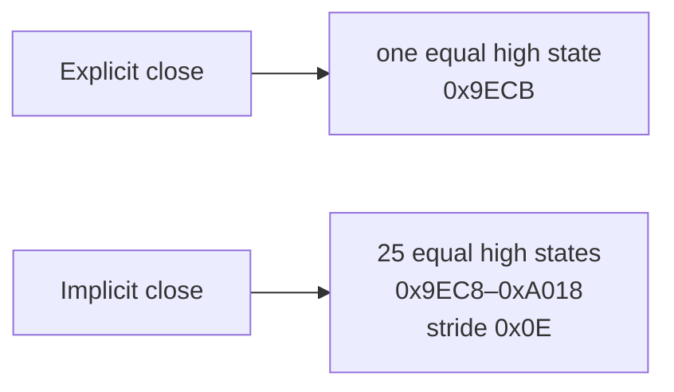
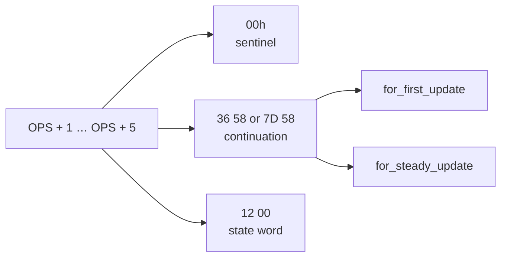

# TI-BASIC `For(` parenthesis trap

The closing `)` in `For(` is optional syntax, but the two spellings can produce
different parser-buffer behavior. A paired OS 2.55MP trace with a false
single-line `If` as the first body statement measures the difference without
including boot, link transfer, menu navigation, or final display work.

## Reproduced pair

The fixtures differ by one token byte:

```ti-basic
Asm(prgmZMARK)
For(I,1,25)
If 0
1
End
Asm(prgmZMARK)
If I=26
Asm(prgmZPASS)
```

```ti-basic
Asm(prgmZMARK)
For(I,1,25
If 0
1
End
Asm(prgmZMARK)
If I=26
Asm(prgmZPASS)
```

`ZMARK` contains one Z80 instruction:

```ti-basic
AsmPrgm
C9
```

`C9` is `RET`. Both traces execute it twice at `userMem` (`0x9D95`). The analyzer counts
instructions and clocks from the first marker to the second. After the second
marker, each program calls `ZPASS` only when `I=26`; `ZPASS` writes `A5h` to
`plotSScreen` at `0x9340`. The smoke runner asserts that RAM byte directly.
[confirmed]

The headers differ only by `tRParen = 11h`:

```text
explicit: D3 49 2B 31 2B 32 35 11 3F CE 30 ...
implicit: D3 49 2B 31 2B 32 35    3F CE 30 ...
```

## Measured work

| Form | Instructions | Clocks | Trace ID |
|------|-------------:|-------:|----------|
| Explicit `)` | 145,748 | 1,698,162 | `d8348851f6ba…` |
| Implicit close | 157,052 | 1,790,338 | `eef08147e170…` |

The implicit form adds 11,304 instructions, or 7.76%, and 92,176 clocks, or
5.43%. These values describe this `N=25`, false-`If` pair. They do not imply the
same ratio for other bodies or trip counts. [confirmed]
The compact JSON report retains each complete SHA-256 digest.

## Parser-buffer state

The trace records writes to `nextParseByte` (`0x965D`) and `basic_end`
(`0x965F`). The analyzer selects temporary states where the two pointers are
equal and at or above `0x9E80`.



The explicit trace reuses one equal-pointer high state. The implicit trace
advances through 25 states from `0x9EC8` to `0xA018` in `0x0E`-byte steps.
This is direct RAM-state evidence that the two token streams manage temporary
parse space differently. [confirmed]

The `FPS` pointer distinguishes the forms at every `End` visit:

| Form | First `FPS` | Last `FPS` | Distinct values |
|------|-------------|------------|----------------:|
| Explicit `)` | `0x9F02` | `0x9F02` | 1 |
| Implicit close | `0x9EFF` | `0xA04F` | 25 |

The implicit sequence advances by `0x0E` per iteration. The explicit sequence
keeps one `FPS` value after the first body setup. This matches the temporary
cursor/end stride without using an LCD image as an oracle. [confirmed]

## The natural loop record

Both forms reach `parse_for_production` (`38:41E5`) and
`parse_end_ops_record` (`38:4200`). At each `End`, `parse_end_ops_record`
consumes one five-byte `TIForOpsRecord` beginning at `OPS + 1`:



The first continuation prepares the loop update. The steady continuation
re-enters the update path on later iterations. The trace observes 25 `End`
visits and the same two record variants in both spellings. [confirmed]

The pair does not enter the command-finalization gate at `02:5676` or the
page-33 dispatcher at `33:435F`; those routines do not explain the difference.
The exact branch between `For(` argument parsing and temporary `FPS` allocation
that selects reuse versus `0x0E`-byte growth remains [hypothesis].

## Reproduce the evidence

Generate the programs, run both cases, and retain their traces:

```sh
tools/tibasic_samples.py --write-dir tools/tibasic-samples

TILEM=/path/to/patched/tilem2
python3 tools/tibasic_smoke.py \
  --tilem "$TILEM" --rom tools/rom.bin \
  --out-dir /tmp/tibasic-for-paren --keep-trace \
  --case forparen --case forimplicit
```

Reduce the traces to the checked compact report:

```sh
PYTHONPATH=tools python3 tools/analyze_tibasic_for_paren.py \
  --explicit /tmp/tibasic-for-paren/forparen.trace \
  --implicit /tmp/tibasic-for-paren/forimplicit.trace \
  --output tools/tibasic-for-paren.json
```

`tools/tibasic-for-paren.json` stores the hashes, marker intervals, pointer-write
counts, high-state sequence, `FPS` summary, and decoded OPS record variants.
The smoke check reads the completion marker from a logical-RAM dump. Raw traces
remain outside the repository.

## Practical rule

Write the closing `)` when a `For(` body begins with a single-line guard:

```ti-basic
For(I,1,N)
If condition
statement
End
```

The explicit form avoids the measured advancing temporary-buffer sequence in
this pattern. Use the trace pair as evidence for this case, not as a general
claim that every implicit `For(` close is slower.
