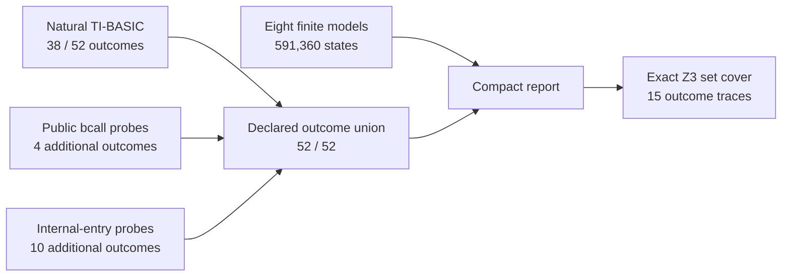
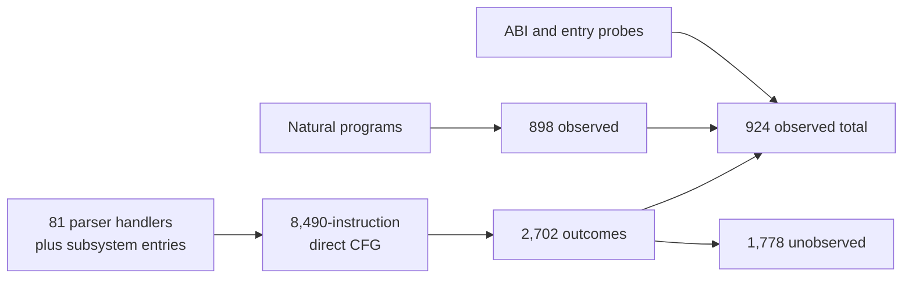

# TI-BASIC dynamic tracing

TI-BASIC coverage combines exhaustive local models, natural calculator traces,
and provenance-labeled probes. The models classify bounded decisions. Natural
traces establish program reachability. Probes distinguish remaining outcomes
without presenting prepared state as a natural language path. None of these
layers is whole-interpreter coverage.

## Evidence layers

| Layer | Establishes | Does not establish |
|-------|-------------|--------------------|
| ROM signature | The modeled instructions are the expected OS 2.55MP bytes | Meaning of every surrounding routine |
| Finite model | Every state in one declared finite domain has an outcome | Arbitrary streams or caller-owned RAM and stack state |
| Natural trace | A stored TI-BASIC program reaches an outcome with ordinary parser state | Feasibility of an unobserved outcome |
| Public-bcall probe | Exact ROM execution reaches a public ABI boundary | Natural TI-BASIC reachability of the supplied register value |
| Internal-entry probe | Exact ROM execution distinguishes a selected internal state | A supported ABI or natural caller for that state |
| RAM or LCD assertion | The fixture produces its expected machine or visible result | Which internal path is uniquely responsible |

`tools/analyze_tibasic_coverage.py` refuses a ROM whose SHA-256 differs from
the pinned OS 2.55MP image, then verifies short byte signatures at every modeled
decision family. [confirmed]

## Exhaustive finite models

The checked report exhausts 591,360 states and 45 semantic outcomes:

| Model | Exhausted states | Outcomes | Boundary |
|-------|-----------------:|---------:|----------|
| Encoded token width | 256 | 2 | Lead-byte membership, not second-byte validity |
| Statement delimiter | 256 | 4 | Byte classification, not refill faults |
| Token scan step | 256 | 4 | One step, not arbitrary stream length |
| Block matcher transition | 524,288 | 10 | Every 16-bit depth over eight decision-equivalent token classes |
| Extended grammar fold | 256 | 2 | `CP F2h`/`ADD 12h`, not later handlers |
| Precedence handler family | 65,536 | 3 | Grammar class × selector byte, not recursive handler state |
| Command finalization gate | 256 | 5 | First page-02 gate only |
| Control-flow table bounds | 256 | 15 | Index validation, not the 13 handler bodies |

The block model uses token equivalence classes because the ROM performs the
same comparisons for every non-control byte. It still enumerates all 65,536
values of the 16-bit `DE` depth, including the zero and increment-wrap boundaries. This
is exhaustive over the stated local transition, not a depth limit of 255.

Z3 minimizes one representative per semantic outcome after exhaustive
enumeration establishes the partition. Z3 is not being presented as a proof of
the entire Z80 routine or of arbitrary token streams.

## Coverage by provenance

The report declares 26 branch sites and both outcomes at each site. Natural
programs reach 38 of those 52 outcomes. Public-bcall probes add the four
page-33 bounds outcomes. Internal-entry probes add the remaining 10 outcomes.
The union reaches 52 of 52, but only the first number describes natural
TI-BASIC reachability. [confirmed]



The per-provenance counts in the JSON are 38, 8, and 18 because wrappers share
ordinary grammar outcomes. Those counts overlap. The additional-outcome counts
in the diagram describe what each probe layer contributes after the preceding
layer. No successor at a declared branch is unclassified. [confirmed]

That 52-outcome matrix is a regression test for eight local models. It is not
the interpreter denominator. The broader CFG audit seeds all valid destinations
from the parser table at `38:4000` and the 13-entry page-33 table at `33:4381`,
then follows direct control flow through five bounded components. [confirmed]

## Expanded CFG saturation

The expanded graph contains 8,490 reachable instructions and 1,351 conditional
branches. Its 2,702 possible outcomes produce this trace breakdown:

| Component | Possible | All evidence | Natural programs |
|-----------|---------:|-------------:|-----------------:|
| Parser core | 1,956 | 625 | 619 |
| Command arguments | 162 | 54 | 48 |
| Page-33 control flow | 174 | 13 | 0 |
| Value storage | 154 | 112 | 112 |
| Numeric and error checks | 256 | 120 | 119 |
| **Total** | **2,702** | **924** | **898** |

Natural `factorial` and `dfs` traces now identify the actual page-38 loop path:
`For(` reaches `38:41E5`, `End` reaches `38:4200`, and the loop continuations
are `38:5836` and `38:587D`. They still do not enter the page-33 probe
dispatcher. [confirmed]



The exact outcome cover retains 30 of 33 traces. `hello`, `callstop`, and the
natural syntax-error trace remain useful semantic examples, but they do not add
a branch outcome to the larger graph. The report therefore separates the
minimum outcome corpus from the selective documentation corpus. [confirmed]

### Natural programs

Seven successful fixtures cover distinct interpreter behaviors:

| Case | Distinct behavior | Oracle |
|------|-------------------|--------|
| `hello` | straight-line statement, quoted string, `Disp` | LCD text |
| `factorial` | `Prompt`, scalar stores, `For(`/`End`, FP multiplication | LCD result `120` |
| `data` | two-byte list tokens, literal/store, built-in list fold | lists and sum on the LCD |
| `dfs` | nested `While`, `If ... Then`, `For`, and list-backed stack | traversal and visited list |
| `callabi` | nested BASIC call, shared scalar/list/`Ans`, `Return` | returned scalar and list state |
| `callstop` | nested BASIC call and nonlocal `Stop` | absence of the post-call line |
| `branchmatrix` | `Else`, `Repeat`, nested blocks, and an omitted string quote | `A5h` at `plotSScreen` (`0x9340`) |

`missingend` and `terminalif` add natural end-of-input structural boundaries.
They exercise carry returns that closed blocks do not reach, then finish through
page-38 cleanup and display `Done`; they do not raise an OS error. The report
marks both traces with `termination: completed`. [confirmed]

The syntax and divide-by-zero fixtures provide baseline unwind witnesses.
`syntaxerr` executes `Disp 1+` and reaches the syntax entry at `00:2700`.
`divzero` executes `Disp 1/0` and reaches `_ErrDivBy0` at `00:26EC`. The expanded numeric corpus
raises the natural local-matrix result from 34 to 38 outcomes. The 15-trace
outcome minimum omits the error fixtures because other traces cover those local
branches; the semantic corpus retains their distinct causes. [confirmed]

Twelve selected numeric-error fixtures also retain the path before the shared
error shim. The reducer restarts a candidate slice whenever it sees the guard's
first instruction. It accepts the slice only when the remaining guard and shim
addresses occur in order and the shim leaves the expected error code in `A`.
This prevents an unrelated earlier call to `_FPDiv`, `_FPMult`, or the zero
checker from being attached to a later error. [confirmed]

| Case | Ordered causal boundary | Result |
|------|-------------------------|--------|
| `divzero` | `00:2548 → 00:254B → 00:26EC` | divisor-zero guard, code `82h` |
| `overflow` | `02:7076 → 02:7078 → 02:7053 → 02:7056 → 02:7059 → 00:26E8` | `10^x` range guard, code `81h` |
| `muloverflow` | `00:2513 → 00:2516 → 00:2517 → 00:2519 → 00:251B → 00:251D → 00:26E8` | exponent-add overflow, code `81h` |
| `lndomain` | `02:6F1E → 00:212D → 00:1DE9 → 00:2130 → 00:2131 → 00:211D → 00:26F4` | logarithm zero guard, code `84h` |
| `increment` | `37:4268 → 00:1DE9 → 37:426B → 00:26F8` | zero loop step, code `85h` |
| `asindomain` | `02:76F1 → 02:76F4 → 02:76F5 → 00:26F4` | inverse-sine range guard, code `84h` |
| `acosdomain` | `02:76DF → 02:76E2 → 00:26F4` | inverse-cosine range guard, code `84h` |
| `sqrtnonreal` | `00:1B8F → 00:1B93 → 00:26FC` | real-mode result guard, code `87h` |
| `singular` | `02:439C → 02:439F → 02:43A1 → 02:43A2 → 02:43A3 → 02:43A5 → 00:26F0` | matrix-pivot guard, code `83h` |
| `lateincrement` | `38:586D → 38:5870 → 38:5873 → 38:5876 → 00:26F8` | loop no-progress guard, code `85h` |
| `negfactdomain` | `35:79CF → 35:79D2 → 00:26F4` | factorial sign/integer guard, code `84h` |
| `ncrdomain` | `02:4FC8 → 02:4FA1 → 00:2125 → 00:1DFD → 00:1E00 → 00:1E02 → 00:2128 → 00:211C → 00:211D → 00:26F4` | combination left-operand guard, code `84h` |

All 12 paths come from stored TI-BASIC programs. They cover all six numeric
error codes, 12 causes, and 11 distinct direct caller sites. [confirmed]

The report separately inventories 114 whole-ROM direct-reference candidates:
9 overflow, 2 divide-by-zero, 3 singular-matrix, 91 domain, 6 increment, and 3
non-real. Linear disassembly can decode data as instructions, so each candidate
still needs CFG or dynamic reachability evidence. Indirect transfers and helpers
that load `A` before entering `00:270A` remain outside that inventory.
[confirmed]

### Probe outcomes

Three public-bcall probes call `grf_435f = 5140h` with an input below the table,
inside the table, and at its upper boundary. They cover both outcomes at
`33:436D` and `33:4372`. These are public ABI executions, not stored-program
loop transitions. [confirmed]

Eight internal-entry probes cover four command-finalization classes and four
grammar states. They map the required ROM page, enter the selected routine from
RAM, and let the exact ROM execute the branch. `cmdbad` combines the safe
implicit-end case with the invalid class, which removes one redundant trace.
These probes establish branch behavior only; they do not establish a natural
caller or a supported interface. [confirmed]

Across all 33 traces, the saturation report records 132,634,495 instructions.
The raw files total about 6.08 GiB. Only SHA-256 digests, counts, outcomes,
provenance, and the 47 KB report are checked in. Exact outcome-only set cover
retains 30 traces. The three omitted traces remain useful semantic examples.
[confirmed]

## Reproduce the report

Generate the source/token/link fixtures first:

```sh
tools/tibasic_samples.py --write-dir tools/tibasic-samples
```

The TilEm binary must support loading command-line `.8xp` files before the
macro starts. Run the natural cases while retaining their temporary traces:

```sh
TILEM=/path/to/patched/tilem2
python3 tools/tibasic_smoke.py \
  --tilem "$TILEM" --rom tools/rom.bin \
  --out-dir /tmp/tibasic-coverage --keep-trace \
  --case hello --case factorial --case data \
  --case dfs --case callabi --case callstop \
  --case branchmatrix --case missingend --case terminalif \
  --case syntaxerr --case divzero \
  --case overflow --case muloverflow --case lndomain --case increment \
  --case asindomain --case acosdomain --case sqrtnonreal --case singular \
  --case lateincrement --case negfactdomain --case ncrdomain
```

Run the probe cases in the same output directory:

```sh
python3 tools/tibasic_smoke.py \
  --tilem "$TILEM" --rom tools/rom.bin \
  --out-dir /tmp/tibasic-coverage --keep-trace \
  --case cflowlow --case cflowhigh --case cflowvalid \
  --case cmdclose --case cmdopen --case cmdunit --case cmdbad \
  --case gramlow --case gramhigh --case gramflag --case gramnonzero
```

The natural branch matrix uses a RAM marker instead of an image crop. The
probe cases use resolved trace anchors. Existing user-facing samples retain LCD
oracles where the displayed result is part of the behavior.

Build the compact report through the Nix shell so `z80dasm` and Z3 are pinned.
The checked command passes all 33 `LABEL=PATH` pairs; the complete ordered label
list is the `dynamic.traces` array in `tools/tibasic-coverage.json`.

```sh
set --
for label in \
  hello factorial data dfs callabi callstop \
  branchmatrix missingend terminalif syntaxerr divzero \
  overflow muloverflow lndomain increment \
  asindomain acosdomain sqrtnonreal singular \
  lateincrement negfactdomain ncrdomain \
  cflowlow cflowhigh cflowvalid \
  cmdclose cmdopen cmdunit cmdbad \
  gramlow gramhigh gramflag gramnonzero
do
  set -- "$@" --trace "$label=/tmp/tibasic-coverage/$label.trace"
done
nix develop -c python3 tools/analyze_tibasic_coverage.py "$@" \
  --output tools/tibasic-coverage.json
```

Export exact instruction boundaries from the rebuilt Ghidra database, then
reuse the same trace arguments for the expanded report:

```sh
ghidra-analyzeHeadless "$PWD" ti84 \
  -process ti84_page00.bin -noanalysis -readOnly \
  -scriptPath "$PWD/tools" \
  -postScript ExportTiBasicInstructionStarts.java \
  /tmp/tibasic-instruction-starts.tsv

nix develop -c python3 tools/analyze_tibasic_saturation.py \
  --instruction-list /tmp/tibasic-instruction-starts.tsv \
  "$@" --output tools/tibasic-saturation.json
```

Capture and reduce the selected numeric-error paths separately. This keeps
their semantic provenance without adding redundant traces to the branch-only
minimum corpus:

```sh
python3 tools/tibasic_smoke.py \
  --tilem "$TILEM" --rom tools/rom.bin \
  --out-dir /tmp/tibasic-numeric-errors --keep-trace \
  --case divzero --case overflow --case muloverflow \
  --case lndomain --case increment --case asindomain \
  --case acosdomain --case sqrtnonreal --case singular \
  --case lateincrement --case negfactdomain --case ncrdomain

nix develop -c env PYTHONPATH=tools \
  python3 tools/analyze_tibasic_numeric_errors.py \
  --trace divzero=/tmp/tibasic-numeric-errors/divzero.trace \
  --trace overflow=/tmp/tibasic-numeric-errors/overflow.trace \
  --trace muloverflow=/tmp/tibasic-numeric-errors/muloverflow.trace \
  --trace lndomain=/tmp/tibasic-numeric-errors/lndomain.trace \
  --trace increment=/tmp/tibasic-numeric-errors/increment.trace \
  --trace asindomain=/tmp/tibasic-numeric-errors/asindomain.trace \
  --trace acosdomain=/tmp/tibasic-numeric-errors/acosdomain.trace \
  --trace sqrtnonreal=/tmp/tibasic-numeric-errors/sqrtnonreal.trace \
  --trace singular=/tmp/tibasic-numeric-errors/singular.trace \
  --trace lateincrement=/tmp/tibasic-numeric-errors/lateincrement.trace \
  --trace negfactdomain=/tmp/tibasic-numeric-errors/negfactdomain.trace \
  --trace ncrdomain=/tmp/tibasic-numeric-errors/ncrdomain.trace \
  --output tools/tibasic-numeric-errors.json
```

Delete the temporary traces after regeneration. They are reproducible evidence,
not source assets.

## Reading gaps honestly

Full coverage of the small matrix means both outcomes at 26 selected sites. The
expanded report gives the more useful denominator: 924 of 2,702 outcomes across
five declared components, with 898 reached naturally. Neither number means
whole-interpreter coverage.

The graph expands all four declared computed jumps over their valid domains:
14 literal parser continuations at `38:4390`, 27 nonzero destinations from the
49-class table used by `38:7244`, five literal command targets at `02:5675`,
and 13 bounds-checked rows at `33:4380`. This does not establish behavior for a
corrupted class, stack, or pointer outside those domains. Other open dimensions
include arbitrary token-stream length, every nested error context, full OPS/FPS
record layout, arbitrary VAT and list shapes, floating-point path classes, and
display or graph subsystem continuations.

The next useful coverage expansion starts with the unresolved caller census:

1. reject linear-disassembly candidates that are data or unreachable code;
2. backward-slice one remaining executable caller to its input predicate;
3. construct the smallest natural program and a RAM or value oracle;
4. retain its trace only when it adds a guard path or CFG outcome; and
5. update the relevant interpreter model with the established transition.

Lower-level trace formats and memory-write decoding are documented in
`tools/dynamic-tracing.md`.
