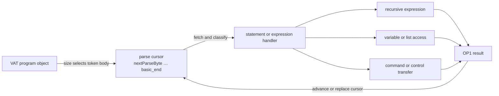
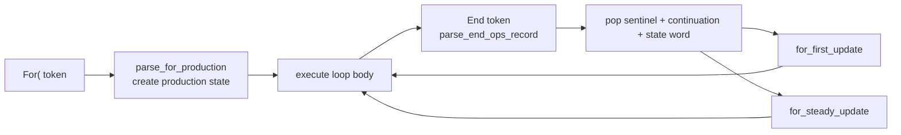
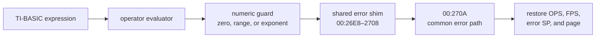
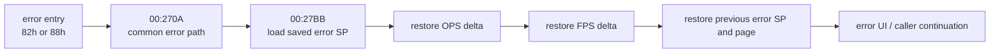

# TI-BASIC execution

TI-BASIC is a token-stream interpreter built around three kinds of state: a
cursor over program bytes, a recursive expression evaluator whose result lives
in `OP1`, and control records that remember where loops and subprograms resume.
This page follows one statement through those layers before describing the
special cases.

The addresses and byte-level decisions below refer to TI-84 Plus OS 2.55MP.
Claims marked [confirmed] are tied to ROM bytes or calculator traces. A
[hypothesis] marks the remaining interpretation of an incompletely decoded
structure.

## The execution pipeline

A stored program is a VAT object of type `ProgObj` (`05h`) or `ProtProgObj`
(`06h`). Its data begins with a little-endian size word followed by exactly that
many token bytes. There are no stored line numbers: `3Fh` separates lines, and
`3Eh` separates colon-delimited statements. [confirmed]

Execution can be read as a pipeline:



The page-38 evaluator owns the cursor and grammar. Statement commands can
cross to page 02, control-flow bodies to page 33, display code to pages 01/03/37,
and variable lookup to the VAT routines. Those page changes are continuations
of one interpreter, not separate parsers. [confirmed]

## The token cursor

`TIBasicParserState` (`0x9652`) keeps the program identity and cursor interval
contiguous in RAM: [confirmed]

```c
#pragma pack(push, 1)
typedef struct {
    uint8_t basic_prog[9];
    uint16_t basic_start;
    uint16_t next_parse_byte;
    uint16_t basic_end;
    uint8_t num_arguments;
} TIBasicParserState;
#pragma pack(pop)
```

`next_parse_byte` is the current token position. `basic_start` begins the
current body, and `basic_end` is its inclusive parser/refill boundary.

The small page-38 helpers are the useful way to reason about cursor movement:

| Routine | Address | Operation |
|---------|---------|-----------|
| `parse_cur_tok` | `38:72DA` | Fetch the current byte and classify `00h`, `3Eh`, and `3Fh` |
| `parse_advance` | `38:7248` | Increment `nextParseByte`, compare it with `basic_end`, and refill when needed |
| `parse_expect_or_err` | `38:5CD8` | Require one token or restore the fault position and raise syntax error |
| `parse_scan_tokens` | `38:4180` | Scan to a statement delimiter without splitting a two-byte token or quoted string |
| `parse_init` | `38:5B7B` | Reset parser-position bytes and parser flags |

Encoded width matters whenever the interpreter skips rather than evaluates.
`_IsA2ByteTok` (`00:1FE8`) searches the 11-byte
`two_byte_token_lead_table` (`00:1FF6`); a match
means the lead and following byte must move together. The scanner also treats a
quoted string as one region, so `Then`, `Else`, or `End` bytes inside a string
cannot terminate an outer scan. [confirmed]

```text
scan_to_delimiter():
  loop:
    token = current_token()
    if token is end, colon, or EOL:
      return
    if token is quote:
      advance through the closing quote or EOL
    else if token is a two-byte lead:
      advance once for the second byte
    advance to the next token
```

This routine does not know the grammar of an expression. Its job is narrower:
preserve token boundaries while another routine searches for a statement or
block delimiter.

## Expressions are nested productions

`_ParseInp` (`38:5987`) initializes parser state for a homescreen expression or
formula and enters the shared evaluator. Stored-program execution arrives with
the program body and parser frame already selected. Both converge on the
recursive expression machinery around `parse_eval_expr` (`38:5AB3`) and the
statement loop at `38:59C5`. [confirmed]

The evaluator is not a flat “token to function” switch. It first maps the
current token to a grammar class, selects a production family, and lets that
handler recursively consume tighter-binding operands. The selector at
`38:7010` chooses among three bases:

| Selector `C` | Handler family | Role |
|--------------|----------------|------|
| Other than `02h` or `03h` | `grammar_handler_table` (`38:4000`) | Main grammar productions |
| `02h` | code at `38:478C` | Postfix/power production |
| `03h` | `leaf_production_handler_table` (`38:7175`) | Six leaf-production offsets |

For the main family, the grammar class in `A` indexes
`grammar_handler_table`. Its 87 page-local offsets contain 84 valid pointers and 81
distinct handler destinations. The bytes there are data — beginning `9F 41 F0 45
1C 42 ...`—not executable Z80. The selector doubles the class, reads the
pointer, and calls the chosen production. [confirmed]

```text
evaluate_production(class, level):
  if level == 2:
    return postfix_production_478C(class)
  else if level == 3:
    handler = leaf_production_handler_table[class]
  else:
    handler = grammar_handler_table[class]

  return handler(parse_cursor, OP1)
```

This nesting is what gives `^`, multiplication, and addition their precedence.
Binary productions move operands through the OS floating-point stack and apply
operations such as `_FPAdd`, `_FPMult`, or `_BinOPExec`; the completed value is
left in `OP1`. `38:6FB7–6FC2` also folds token classes `F2h` and above by adding
`12h` before dispatch. [confirmed]

The other indirect jumps in the declared interpreter graph also have bounded
ROM-owned destinations:

| Jump | Selector source | Valid destinations |
|------|-----------------|-------------------:|
| `38:4390` | 14 entry wrappers load literal continuations | 14 |
| `38:7244` | 49-class table at `38:4FDB`; five rows are zero/invalid | 27 distinct |
| `02:5675` | Five preceding token comparisons load literal targets | 5 |
| `33:4380` | Bounds-checked 13-row table at `33:4381` | 13 |

The CFG follows those destinations without treating adjacent table bytes as
instructions. The bounds describe valid interpreter state, not arbitrary
register or stack corruption. [confirmed]

The shared statement loop can then do one of three things with the result:

- store it through a parsed variable name;
- write it to `Ans` through `_StoAns` (`38:6251`); or
- pass it to a command or control-flow continuation.

`_AnsName` (`38:74B7`) constructs the internal name with class byte `72h`;
`_RclAns` (`38:679F`) recalls it through the ordinary variable machinery.
[confirmed]

## Variable identity and value payload are separate

The parser first builds a variable-name descriptor in `OP1`. The descriptor's
type byte selects a VAT object class and the following bytes encode the token or
name. `findsym_scan` (`07:565F`) resolves that identity to a VAT entry and data
pointer; only then does the recall path copy or address the value payload.
[confirmed]

| Object class | Type | Payload used by BASIC |
|--------------|------|-----------------------|
| Real | `00h` | One 9-byte `TIFloat` |
| Real list | `01h` | 2-byte length, then 9-byte elements |
| Matrix | `02h` | Two dimensions, then 9-byte elements |
| String | `04h` | 2-byte length, then token/character bytes |
| Program | `05h` | 2-byte length, then token bytes |
| Protected program | `06h` | Program payload with protected edit semantics |
| Complex list | `0Dh` | 2-byte length, then complex elements |


Scalar arithmetic copies a 9-byte value into the OP registers. List and matrix
access instead checks the container type and dimensions, computes one element
address, and moves that element through `OP1`. Stores can therefore fail before
arithmetic runs: name lookup, type compatibility, dimensions, and allocation
are distinct boundaries. [confirmed]

## Statements end locally; blocks scan structurally

A false single-line `If` only has to skip one statement. A false `If ... Then`,
`While`, `Repeat`, or `For(` must find a matching structural boundary without
executing the intervening tokens. That is the purpose of
`blockmatch_end_else` (`38:4130`). [confirmed]

```text
find_matching_boundary():
  depth = 0
  loop:
    token = current_token()

    if token == Else and depth == 0: return Else
    if token == End  and depth == 0: return End
    if token == End:                    depth -= 1
    if token in {For, While, Repeat}:   depth += 1

    if token == If:
      scan_to_delimiter()
      if current_token() == Then:       depth += 1

    scan_to_delimiter()
```

The distinction between `If condition` and `If condition:Then` is structural:
only the latter opens a block. Nested `Else` tokens are ignored until the depth
returns to zero. The comparisons and counter changes are visible at
`38:4137–417E`; the counter is the 16-bit `DE` register. [confirmed]

### Natural loops use a page-38 OPS record

The public page-33 routine behind bcall `grf_435f = 5140h` subtracts `20h`,
accepts 13 indices, and jumps through the table at `33:4381`. Three ABI probes
confirm both bounds outcomes at `33:436D` and `33:4372`, but natural stored
programs do not enter it. It is not the `For(`/`End` transition. [confirmed]

Natural `For(` execution reaches `parse_for_production` (`38:41E5`). Natural
`End` execution reaches `parse_end_ops_record` (`38:4200`), which consumes a
5-byte loop record from the operator stack at `OPS + 1`. All three structured
loops share the shape — sentinel byte, continuation word, state word: [confirmed]

```c
#pragma pack(push, 1)
typedef struct {
    uint8_t sentinel;       /* 00h */
    uint16_t continuation;  /* where the End token jumps back to */
    uint16_t state;         /* varies per fixture; meaning open */
} TILoopOpsRecord;
#pragma pack(pop)
```

A shadow-memory replay of the headless trace records the loop state for a
program that runs `For(θ,1,3)`, `While θ<3`, and `Repeat θ≥2` in sequence. The
reproduction macro is `tools/macros/run-loops-typed.macro`.

| Loop | Record at `End` | Continuation | State |
|------|-----------------|--------------|-------|
| `For(` first `End` | `00 36 58 07 00` | `for_first_update` (`38:5836`) | `0007h` |
| `For(` later `End`s | `00 7D 58 07 00` | `for_steady_update` (`38:587D`) | `0007h` |
| `Repeat` `End` | `00 E7 57 23 00` | `38:57E7` | `0023h` |

The continuation field selects the loop mechanics. Observed state words include
`0012h` and `0007h`, so the field is not a fixed constant; its exact role is
still open. [confirmed]

`While` and `Repeat` push their records in a parse-time form with continuation
`38:5AC1`. Three observed pushes carry marker bytes `F0 58`, `11 58`, and
`2A 58`. The first condition evaluation rewrites the record to the runtime form
above. That evaluation runs through
`38:41CC` or `38:41D9` — each guards with `CALL 7203`, calls `71B4`, pops the
saved value into `HL`, and jumps to `38:57A8` or `38:57E1` respectively;
`38:57E1` sits immediately before the `Repeat` continuation `38:57E7`.
[confirmed]

A single trace does not establish which loop re-enters through
`parse_end_ops_record` on each iteration and which jumps directly from its
continuation. [hypothesis]



The continuation path resolves the loop variable through the VAT, applies the
floating-point increment, compares the updated value, and either revisits the
body or removes the record. The paired trace confirms the record bytes and the
two continuations. The complete layout of the associated limit, step, and
temporary floating-point values is not yet decoded. [confirmed]

The optional closing `)` in `For(` changes marker-to-marker work and parser
buffer state. Neither spelling reaches the page-02 finalization gate in the
paired trace, so the exact causal transition remains open. The measured effect
is covered in [the `For(` parenthesis trap](sub-tibasic-for-paren.md).

### Labels rescan instead of indexing

`goto_lbl_name_scanner` (`38:4870`) reads the label name after `Goto` or `Lbl`.
The search path at `38:7600` rescans the program body for a matching `Lbl`, then
moves `nextParseByte` to it. This explains both the linear cost of `Goto` and
why jumping out of structured loops can bypass normal loop cleanup. The token
and name-scanning path is [confirmed]; the complexity and stack consequence are
standard TI-BASIC behavior.

## Program calls share data but preserve parser control

`prgmNAME` resolves another `ProgObj`, saves the caller's interpreter state,
and evaluates the callee body. It does not create a local variable frame.
Scalars, lists, strings, and `Ans` remain global, so they form the practical
calling convention. [confirmed]

| Event | Effect |
|-------|--------|
| `prgmNAME` | Enter the callee with a nested parser/control frame |
| `Return` | Unwind one BASIC program frame and resume the caller |
| End of body | Return through the same program-frame machinery |
| `Stop` | Terminate the whole BASIC program chain |

The run-confirmed callee transition passes through `38:6910`, calls at
`38:6914`, and enters the body evaluator at `38:778F`. The public parser bcalls
are not substitutes for that prepared state: calling `_ParseInpLastEnt` or
`_Find_Parse_Formula` from an arbitrary `AsmPrgm` reaches parser setup but not a
working BASIC call frame. The negative fixtures end at `ERR:INVALID` and
`ERR:UNDEFINED`, respectively. [confirmed]

For source-level conventions and the `Ans`/scalar/list calling fixture, see
[TI-BASIC examples and ASM interop](sub-tibasic-examples.md#subprogram-interfaces).

## Commands parse arguments, then hand off

Commands use the same expression evaluator for arguments and then cross to a
specialized subsystem. The important boundary is between argument parsing and
the operation itself:

| Command | Parse/dispatch evidence | Downstream operation |
|---------|-------------------------|----------------------|
| `Disp` | page-38 statement handler | `_Disp` at `37:51D3`, then `_NewLine` |
| `Output(` | `38:6AE6`, page-02 handler | `_OutputExpr` at `03:4AF2` |
| `Input` | `02:54EF` | entry editor, `_ParseInp`, variable store |
| `Prompt` | `02:562F` | repeated named-variable entry and store |
| `Menu(` | `02:555D` | `_DispMenuTitle` at `39:4D21`, then label transfer |
| `Pause` | `02:55E7` | display and key-wait loop |
| `getKey` | expression token `ADh` | non-blocking `_GetKey` bcall `4972h` |

`Input` accepts either an optional prompt string or a row/column prefix before
one store target. `Prompt` loops over comma-separated variables and generates
the `NAME=` labels itself. `Menu(` parses a title followed by option-string and
label pairs. These argument-order boundaries are [confirmed]; the entry
editor's internal cursor and redraw state are not yet mapped.

`getKey` is an expression value, not a statement. The table at `37:6700` is a
token-attribute table; returned key codes come from `_GetKey` on page 06. This
distinction prevents a common false inference from the nearby `CP ADh` bytes.
[confirmed]

## Errors unwind saved relative stack state

The error entries first select an error code, then join the common path at
`00:270A`. For example, `_ErrDivBy0` at `00:26EC` selects `82h`, while the
syntax entry at `00:2700` selects `88h`. Natural `Disp 1/0` and `Disp 1+`
traces reach those entries, respectively. [confirmed]

The entry identifies the error message, but its incoming guard identifies the
cause. Twelve natural programs separate all six numeric error entries into 12
guard paths. This table groups related paths so the mechanism stays visible:

| Program | Originating guard | Predicate | Error shim |
|---------|-------------------|-----------|------------|
| `Disp 1/0` | `00:2548–254B` | divisor in OP1 is zero | `_ErrDivBy0` at `00:26EC` |
| `Disp 10^100` | `02:7076–7078`, then `02:7053–7059` | positive exponent argument is at least 100 | `_ErrOverflow` at `00:26E8` |
| `Disp 1E99*1E99` | `00:2513–251D` | adjusted sum of biased decimal exponents overflows | `_ErrOverflow` at `00:26E8` |
| `Disp ln(0)` | `02:6F1E`, then `00:212D–2131` | logarithm operand in OP1 is zero | `_ErrDomain` at `00:26F4` |
| `Disp sin⁻¹(2)` / `cos⁻¹(2)` | `02:76F1–76F5` / `02:76DF–76E2` | operand lies outside $[-1,1]$ | `_ErrDomain` at `00:26F4` |
| `Disp (-1)!` / `(-1) nCr 1` | `35:79CF–79D2` / `02:4FC8`, then `00:2125–211D` | operand fails the operation's sign or integer check | `_ErrDomain` at `00:26F4` |
| `Disp sqrt(-1)` | `00:1B8F–1B93` | a complex result reaches the real-mode guard | `_ErrNon_Real` at `00:26FC` |
| `Disp [[1,2][2,4]]⁻¹` | `02:439C–43A5` | the pivot helper rejects the rank-deficient matrix | `_ErrSingularMat` at `00:26F0` |
| `For(I,1,3,0)` / `For(I,1E99,1E99)` | `37:4268–426B` / `38:586D–5876` | the step is zero / adding it makes no progress | `_ErrIncrement` at `00:26F8` |

The two OVERFLOW rows reach the same shim through different predicates. A trace
that records only `00:26E8` therefore merges distinct numeric behavior. The
compact numeric-error report retains the ordered guard path, the register state
after each guard instruction, and the final error code in `A`. [confirmed]

A whole-ROM direct-reference scan finds 114 candidate `CALL` or `JP` operands
to the six shims. The natural corpus reaches 11 distinct direct callers:

| Error entry | Direct-reference candidates | Witnessed callers |
|-------------|----------------------------:|------------------:|
| `_ErrOverflow` at `00:26E8` | 9 | 2 |
| `_ErrDivBy0` at `00:26EC` | 2 | 1 |
| `_ErrSingularMat` at `00:26F0` | 3 | 1 |
| `_ErrDomain` at `00:26F4` | 91 | 4 |
| `_ErrIncrement` at `00:26F8` | 6 | 2 |
| `_ErrNon_Real` at `00:26FC` | 3 | 1 |

These 114 sites are linear-disassembly candidates, not 114 established
predicates. The scan can decode data as instructions. It also omits indirect
transfers and helpers that load an error code before entering the common path.
The report preserves that distinction. [confirmed]



The shared context wrapper at `00:27DA` does not save absolute `FPS` and `OPS`
pointers. It saves each pointer as a delta from the corresponding base at
`0x9822` or `0x9826`, together with the previous error stack and mapped page.
The unwind path at `00:27BB–27D9` restores them in reverse order. [confirmed]

```text
save_error_context(target):
  push current_flash_page
  push previous_error_stack
  push FPS - word_at(0x9822)
  push OPS - word_at(0x9826)
  error_stack = SP
  jump target

unwind_error(error_code):
  SP = error_stack
  OPS = word_at(0x9826) + pop_word()
  FPS = word_at(0x9822) + pop_word()
  error_stack = pop_word()
  restore_flash_page(pop_word())
  return error_code
```



The traces confirm the entry, common unwind, and pointer restoration. The
error-screen `Goto` editor and every nested-error caller remain outside the
current interpreter model.

## What the coverage model establishes

`tools/analyze_tibasic_coverage.py` ties eight finite models to byte signatures
in the pinned ROM. It exhausts 591,360 states across token width, delimiters,
one scan step, one block-depth transition, the extended-class fold, precedence
family selection, command finalization, and page-33 table bounds. Z3 proves a
minimum representative set for the semantic outcomes. [confirmed]

Dynamic evidence is a separate layer. Natural programs reach 38 of 52 outcomes
at 26 selected branch sites. Public-bcall and internal-entry probes bring the
declared outcome set to 52 of 52 while preserving provenance. The report records
only trace hashes and compact counts; raw traces remain outside the repository.
See [TI-BASIC dynamic tracing](sub-tibasic-tracing.md) for commands and exact
boundaries. [confirmed]

The broader saturation audit starts at all 81 grammar-handler destinations and
selected command, control-flow, value-storage, and numeric-error entries. It
reaches 8,490 ROM instructions and 1,351 conditional branches, or 2,702
possible branch outcomes. The retained traces observe 924 outcomes; natural
TI-BASIC programs account for 898. [confirmed]

This is deliberately not a claim of complete interpreter coverage. The four
declared computed jumps are expanded over their ROM-defined valid domains, but
corrupted or otherwise out-of-domain dispatch state is not modeled. Calls into
display, graphing, and other ROM pages leave the declared regions, and arbitrary
token streams, recursion depths, VAT layouts, and floating-point values remain
open. The compact `tools/tibasic-saturation.json` report records those
boundaries explicitly.

## Address map

| Address | Role |
|---------|------|
| `00:1FE8` | `_IsA2ByteTok` |
| `38:4000` | Grammar-handler pointer table |
| `38:4130` | Matching `End`/`Else` scanner |
| `38:4180` | Token-aware skip scanner |
| `38:41E5` | Natural `For(` production entry |
| `38:4200` | Natural `End` record consumer |
| `38:4870` | `Goto`/`Lbl` name scanner |
| `38:5987` | `_ParseInp` |
| `38:5AB3` | Recursive expression evaluator |
| `38:6251` | `_StoAns` |
| `38:6910` | Stored-program statement-body entry |
| `38:6FB7` | Grammar-class validation and high-token fold |
| `38:7010` | Production-family selector |
| `38:7248` | Cursor advance/refill |
| `38:72DA` | Current-token fetch and delimiter classification |
| `38:758A` | `_Find_Parse_Formula` |
| `38:7600` | Store/label name scanning region |
| `38:778F` | Nested stored-program body evaluator |
| `02:5676` | Command finalization gate |
| `33:435F` | Bounded control-flow command dispatcher |

The local finite-model evidence is `tools/tibasic-coverage.json`. The broader
direct-CFG evidence is `tools/tibasic-saturation.json`. The selected backward
error slices are in `tools/tibasic-numeric-errors.json`. All three generators
verify the pinned ROM before producing a report.
