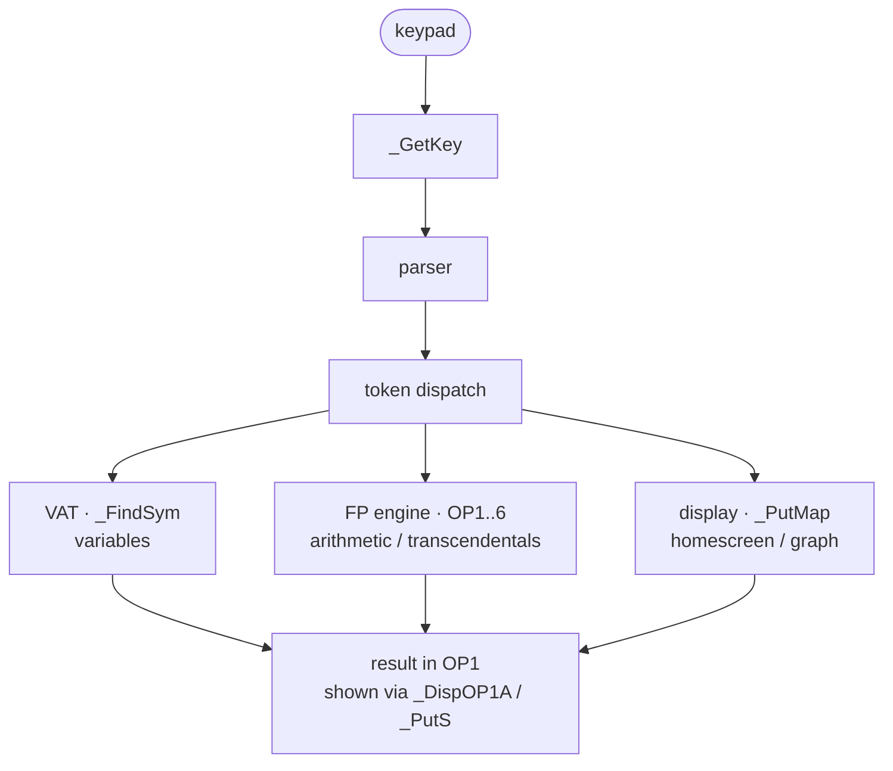

# Subsystem map (bcall API surface)

This page groups representative bcall entry points by subsystem. The
[bcall index](bcall-index.md) records 645 main-table mappings and 87 retail
boot-table mappings, including project-inferred names. [confirmed] for the
checked maps; a name or mapping alone does not establish a public ABI.

| Subsystem | Representative entry points |
|-----------|------------------------------|
| Floating-point / numeric | `_FPAdd`, `_Times2`, `_DivHLBy10`, `_Intgr`, `_Trunc`, `_DToR`, `_RToD`, `_Min`, `_Max`, `_SqRoot` |
| Display / LCD | `_PutMap`, `_PutC`, `_PutS`, `_DispHL`, `_NewLine`, `_ClrLCDFull`, `_VPutS`, `_GrBufCpy` |
| Variables / VAT | `_FindSym`, `_ChkFindSym`, `_CreateReal`, `_CreateStrng`, `_CreateAppVar`, `_DelVar`, `_InsertMem`, `_Arc_Unarc` |
| String / convert | `_ExpToHex`, `_OP1ExpToDec`, `_CreateStrng`, `_StrCopy`, `_Get_Tok_Strng` |
| Parser / TI-BASIC | `_IsA2ByteTok`, `_GetTokLen`, `_BinOPExec`, `_ParseInp` |
| Link / I/O | `_SendAByte`, `_RecAByteIO`, `_SendVarCmd`, `_Rec1stByte`, `_GetVarCmdUSB` |
| System / power | `_AppInit`, `_PutAway`, `_RandInit`, `_ApdSetup`, `_Chk_Batt_Low`, `_SetExSpeed`, `_JForceCmd` |
| Boot cryptography | `_MD5Init`, `_MD5Update`, `_MD5Final`, `_SigModR`, `_TransformHash` |
| List / matrix | `_CreateRList`, `_CreateCList`, `_CreateRMat`, `_ErrDimMismatch` |
| Keyboard | `_GetCSC`, `_GetKey`, `_KeyToString` |
| Menu / UI | `_DispMenuTitle`, `_CursorOn`, `_CursorOff`, `_RunIndicOn`, `_RunIndicOff` |

## Reading the map

Numeric evaluation uses the parser, VAT, arithmetic engine, and display:

Cross-cutting services used by all of the above: [the bcall mechanism](bcall-mechanism.md), [interrupt dispatch](interrupts.md), [clock/timers/APD/power](clock-timers-power.md), [MD5 and boot signature arithmetic](md5-hardware.md), error handling (`_JError` + `TIError` codes), and the system flags (`SystemFlags` @ `flags`).

## Execution through-line

1. **Interrupt** keeps time, scans the keypad into `kbdScanCode`, runs APD.
2. `_GetKey` turns scan codes into key codes (`TIKeyCode`), driving menus and the homescreen.
3. The parser reads tokenized input/programs, dispatching each `TIToken`.
4. Number tokens → FP engine (OP1–OP6, BCD); name tokens → VAT (`_FindSym`).
5. Results land in `OP1` and are rendered by the display subsystem.
6. **bcall + paging** is the substrate that lets steps 3–5 live on different flash pages; errors unwind via `_JError`/`onSP`.

See the subsystem pages linked above and in the sidebar for detail.
